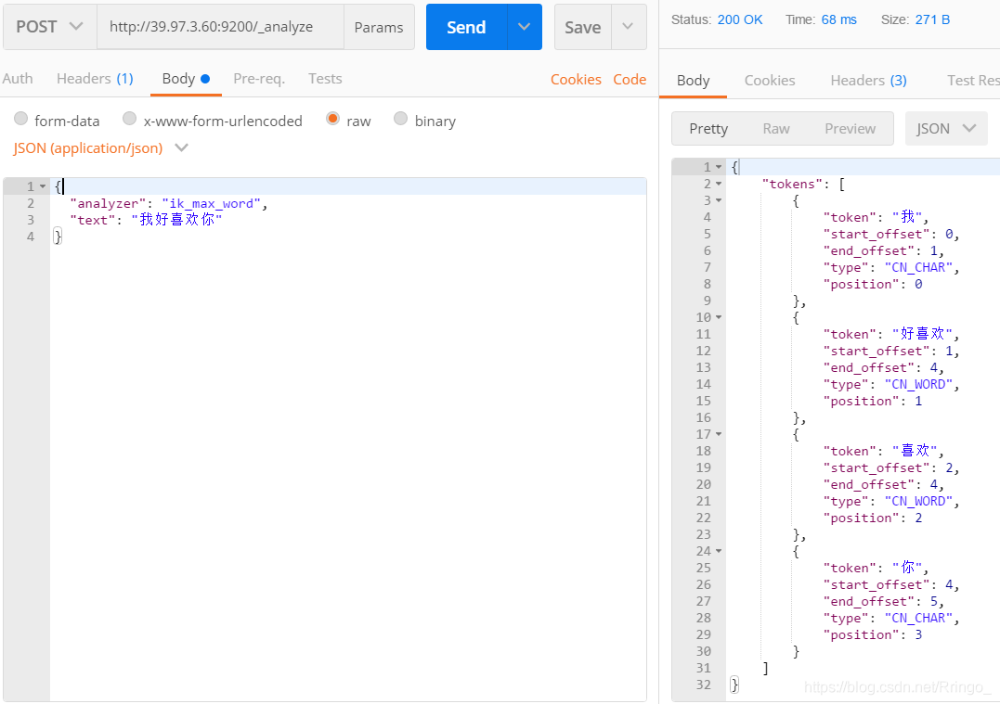

# 1.elasticsearch概述

## 1.1 什么是ElasticSearch

Elasticsearch 是一个**分布式、高扩展、高实时**的搜索与[数据分析](https://baike.baidu.com/item/数据分析/6577123)引擎。它能很方便的使大量数据具有搜索、分析和探索的能力。它提供**可扩展**的搜索，具有**接近实时**的搜索。ES本身扩展性很好，可以扩展到上百台服务器。ES也使用Java开发并使用Lucene作为核心来实现所有索引和搜索的功能，但是它的目的是通过简单的RESTful API来隐藏Lucene的复杂性，从而让全文检索变得简单。

据国际权威的数据库产品评测机构DB Engines的统计，在2016年1月，ElasticSearch已经超过Solr等，成为排名第一的搜索引擎类应用！

##  1.2 ElasticSearch的使用案例

**谁在使用ES：**

- 维基百科，类似百度百科，全文检索，高亮，搜索推荐。
- Stack Overflow，国外程序异常论坛。
- GitHub。
- 电商网站，检索商品。
- 国内：站内搜索（电商，招聘，门户），IT系统搜索，数据分析。

## 1.3 ElasticSearch对比Solr

- Solr 利用 Zookeeper 进行分布式管理，而 Elasticsearch 自身带有分布式协调管理功能;
- Solr 支持更多格式的数据，而 Elasticsearch 仅支持json文件格式；
- Solr 官方提供的功能更多，而 Elasticsearch 本身更注重于核心功能，高级功能多有第三方插件提供；
- Solr 在传统的搜索应用中表现好于 Elasticsearch，但在处理实时搜索应用时效率明显低于 Elasticsearch

# 2.elasticsearch环境

## 2.1.安装elasticsearch

> Linux普通安装

**下载地址：https://www.elastic.co/cn/downloads/elasticsearch**

```shell
# jdk1.8最低要求！elasticsearch支持客户端，界面工具！
# Java开发，elasticsearch的版本和我们之后对应的Java的核心包！版本对应！JDK环境正常

# 1、下载elasticsearch-7.8.0-linux-x86_64.tar.gz，然后解压到指定文件，就可以使用了！

# 2、熟悉elasticsearch目录
- bin                   # 启动文件    
- config                # 配置文件
    log4j2              # 日志配置文件
    jvm.options         # JVM相关配置 如过内存小 修改一下JVM的配置
    elasticsearch.yml   # ElasticSearch配置文件  默认9200端口
- lib                   # 相关jar
- modules               # 功能模块
- plugins               # 插件
- logs                  # 日志

# 3、启动elasticsearch之前的准备工作
# 由于elasticsearch-7.X不能以Root启动elasticsearch，所以需要创建用户
adduser Tangs # 添加用户
passwd Tangs # 设置密码

chown -R Tangs /opt/elasticsearch/elasticsearch-7.8.0/  # Root个用户权限！

# 4、以新的用户到bin目录启动elasticsearch脚本
[Tangs@Ringo bin]$ ./elasticsearch

# 5、测试连接
[root@Ringo elasticsearch-7.8.0]# curl localhost:9200
{
  "name" : "Ringo",
  "cluster_name" : "elasticsearch",
  "cluster_uuid" : "IS5Y80WYRJOj4AHmIQ32Fw",
  "version" : {
    "number" : "7.8.0",
    "build_flavor" : "default",
    "build_type" : "tar",
    "build_hash" : "757314695644ea9a1dc2fecd26d1a43856725e65",
    "build_date" : "2020-06-14T19:35:50.234439Z",
    "build_snapshot" : false,
    "lucene_version" : "8.5.1",
    "minimum_wire_compatibility_version" : "6.8.0",
    "minimum_index_compatibility_version" : "6.0.0-beta1"
  },
  "tagline" : "You Know, for Search"
}
```

Docker安装

```shell
# 1、需要将elasticsearch的config文件夹拷贝到挂载目录下

# 2、修改elasticsearch.yml 文件
network.host: 0.0.0.0
http.port: 9200

# 3、启动并运行
docker run -e "ES_JAVA_OPTS=-Xms256m -Xmx256m" \
--name elasticsearch -p 9200:9200 -p 9300:9300 \
-e "discovery.type=single-node" \
-v /root/elasticsearch/config:/usr/share/elasticsearch/config \
-d elasticsearch:7.8.0

# 4、测试连接
[root@Ringo config]# curl localhost:9200
{
  "name" : "78f3957f5cb9",
  "cluster_name" : "elasticsearch",
  "cluster_uuid" : "-IsEt9kXQxKemftK6b8RaA",
  "version" : {
    "number" : "7.8.0",
    "build_flavor" : "default",
    "build_type" : "docker",
    "build_hash" : "757314695644ea9a1dc2fecd26d1a43856725e65",
    "build_date" : "2020-06-14T19:35:50.234439Z",
    "build_snapshot" : false,
    "lucene_version" : "8.5.1",
    "minimum_wire_compatibility_version" : "6.8.0",
    "minimum_index_compatibility_version" : "6.0.0-beta1"
  },
  "tagline" : "You Know, for Search"
}
```


## 2.2.安装elasticsearch-head

**下载地址：https://github.com/mobz/elasticsearch-head**

```shell
# 1、安装node.js

# 2、安装grunt
npm install -g grunt-cli

# 查看grunt是否安装成功
grunt -version

# 3、克隆elasticsearch-head项目

# 4、到elasticsearch-head目录下安装依赖
npm install

# 5、运行elasticsearch-head
npm run start

# 6、开启elasticsearch服务端的跨域支持，进入elasticsearch.yml
# 在文件末尾添加如下配置
http.cors.enabled: true
http.cors.allow-origin: "*"
node.master: true
node.data: true

# 取消以下两行的注释
cluster.name: my-application
node.name: node-1

# 7、测试连接
http://localhost:9100/
```

## 2.3.安装kibana

**下载地址：https://www.elastic.co/cn/downloads/kibana**

**Kibana的版本要和elasticsearch版本对应！**

> Docker安装

```shell
# 1、拉取kibana镜像
docker pull kibana:7.8.0

# 2、修改kibana.yml
server.port: 5601
server.name: "kibana"
server.host: "0.0.0.0"
elasticsearch.hosts: ["http://172.18.0.5:9200"]

# 3、运行kibana
docker run --name kibana --privileged=true -p 5601:5601 \
-v /root/kibana/config:/usr/share/kibana/config \
-d kibana:7.8.0

# 4、测试连接
http://39.97.3.60:5601

# 5、kibana汉化 打开kibana.yml
i18n.locale: "zh-CN"   # 重启docker容器这样就可以将kibana汉化了！ 
```

# 3.ES核心概念

## 3.1.基本介绍

> Elasticsearch是面向文档(document oriented)的，这意味着它可以存储整个对象或文档(document)。然而它不仅仅是存储，还会索引(index)每个文档的内容使之可以被搜索。在Elasticsearch中，你可以对文档（而非成行成列的数据）进行索引、搜索、排序、过滤。Elasticsearch比传统关系型数据库如下：
>
> ```
> Relational DB -> Databases -> Tables -> Rows -> Columns
> Elasticsearch -> Indices   -> Types  -> Documents -> Fields
> ```

**elasticsearch是面向文档的。**

关系型数据库 和 elasticsearch客观对比！一切都是JSON！

| Relational DB    | Elasticsearcg |
| :--------------- | :------------ |
| 数据库(database) | 索引(index)   |
| 表(tables)       | types         |
| 行(rows)         | documents     |
| 字段(columns)    | fields        |

elasticsearch(集群)中可以包含多个索引(数据库)，每个索引中可以包含多个类型(表)，每个类型下又包含多个文档(行)，每个文档中又包含多个字段(列)。

**物理设计：**

elasticsearch在后台把每个索引划分成多个分片，每分分片可以在集群中的不同服务器之间迁移！

**一个elasticsearch就是一个集群**。默认的集群名称就是`elasticsearch`。

**逻辑设计：**

一个索引类型中，包含多个文档，比如说文档1，文档2。当我们索引一篇文档时，可以通过这样的一个序列找到它：`索引>类型>文档ID`，通过这个组合我们就能索引到某个具体的文档。**注意：ID不必是整数，实际上它是个字符串！**

## 3.2.文档(document)

**文档就类比表中的一条条数据。**

```md
user
1      zangsan     18
2      lisi        3
```

之前说`elasticsearch`是面向文档的，那么就意味着索引和搜索数据的最小单位是文档，`elasticsearch`中，文档有几个重要的属性：

- 自我包含，一篇文档同时包含字段和对应的值，也就是同时包含`key-value`。
- 可以是层次型的，一个文档中包含自文档，复杂的逻辑实体就是这么来的！
- 灵活的结构，文档不依赖预先定义的模式，我们知道关系型数据库中，要提前定义字段才能使用，在`elasticsearch`中，对于字段是非常灵活的，有时候，我们可以忽略该字段，或者动态的添加一个新的字段。

## 3.3.类型(type)

类型是文档的逻辑容器，就像关系型数据库一样，表格是行的容器。类型中对于字段的定义成为映射，比如`name`映射为字符串类型。我们说文档是无模式的，他们不需要拥有映射中所定义的所有字段，比如新增一个字段，那么`elasticsearch`是怎么做的呢？`elasticsearch`会自动的将新字段加入映射，但是这个字段的不确定它是什么类型，`elasticsearch`就开始猜，如果这个值是18，那么`elasticsearch`就会认为它是整型，但是`elasticsearch`也可能猜不对，所以最安全的办法的是提前定义好所需要的映射，这点跟关系型数据库殊途同归了，先是定义好字段，然后再使用。

## 3.4.索引(index)

**索引就类比数据库！**

索引是映射类型的容器，`elasticsearch`中的索引是一个非常大的文档集合。索引存储了映射类型的字段和其他设置。然后它们被存储到了各个分片上。我们来研究下分片是如何工作的。


**物理设计：节点和分片 如何工作**

一个集群至少有一个节点，而一个节点就是一个`elasticsearch`进程，节点可以有多个索引，如果创建索引，那么索引将会有5个分片(`primary shard`，又称主分片)构成，每一个主分片会有一个副本（`replica shard`，又称复制分片）。


上图是一个有3个节点的集群，可以直接看到主分片[P]和对应的复制分片[R]都不会在同一个节点内，这样有利于某个节点挂掉了，数据也不会丢失。实际上，一个分片是一个`Lucene`索引，一个包含__倒排索引__的文件目录，倒排索引的结构使得`elasticsearch`在不扫描全部文档的情况下，就能告诉你哪些文档包含特定的关键字。不过，倒排索引是什么？

## 3.5.倒排索引

> 倒排索引基本介绍

`elasticsearch`使用的是一种称为倒排索引的结构，采用`Lucene`倒排索引作为底层。这种结构适用于快速的全文检索，一个索引由文档中所有不重复的列表构成，对于每一个词，都有一个包含它的文档列表。例如，现在有两个文档，每个文档包含如下内容：

```shell
Study every day,good good up to forever # 文档1包含的内容
To forever,study every day, good good up # 文档2包含的内容
```

为了创建倒排索引，我们首先要将每个文档拆分成独立的词(或称为词条或者tokens)，然后创建一个包含所有不重复的词条的排序列表，然后列出每个词条出现在哪个文档！

| term    | doc.1 | doc.2 |
| ------- | ----- | ----- |
| Study   | √     | ×     |
| To      | ×     | √     |
| every   | √     | √     |
| forever | √     | √     |
| day     | √     | √     |
| study   | ×     | √     |
| good    | √     | √     |
| every   | √     | √     |
| to      | √     | ×     |
| up      | √     | √     |

现在我们试图搜索to forever，只需要查看包含每个词条的文档

| term    | doc.1 | doc.2 |
| ------- | ----- | ----- |
| to      | √     | ×     |
| forever | √     | √     |
| total   | 2     | 1     |

两个文档都匹配，但是第一个文档比第二个匹配程度更高。如果没有别的条件，现在，这两个包含关键字的都将返回。


> 创建倒排索引步骤

1、创建文档列表：`Lucene`首先对原始文档数据进行编号，形成列表，就是一个文档列表。


2、创建倒排索引列表：対原始文档中的数据进行分词，得到词条。対词条进行编号，以词条创建索引。然后记录下包含该词条的所有文档编号及其他信息。


**搜索的过程：**

当用户输入任意的词条时，首先对用户输入的数据进行分词，得到用户要搜索的所有词条，然后拿着这些词条去倒排索引列表中进行匹配。找到这些词条就能找到包含这些词条的所有文档的编号。

然后根据这些编号去文档列表中找到文档。

## 3.6 映射 mapping

mapping是处理数据的方式和规则方面做一些限制，如某个字段的数据类型、默认值、分析器、是否被索引等等，这些都是映射里面可以设置的，其它就是处理es里面数据的一些使用规则设置也叫做映射，按着最优规则处理数据对性能提高很大，因此才需要建立映射，并且需要思考如何建立映射才能对性能更好。

## 3.7 字段Field

相当于是数据表的字段，对文档数据根据不同属性进行的分类标识

# 4.IK分词器插件

## 4.1.什么是IK分词器？

**分词**：即把一段中文或者别的划分为一个个的关键字，我们在搜索时候会把自己的信息进行分词，会把数据库中或者索引库中的数据进行分词，然后进行一个匹配操作，默认的中文分词是将每个字看成一个词，比如"我喜欢你"会被分为"我"，"喜"，"欢"，"你"，这显然是不符合要求的，所以我们需要安装中文分词器ik来解决这个问题。

如果要使用中文，建议使用ik分词器。

IK提供了两个分词算法：`ik_smart`和`ik_max_word`，其中`ik_smart`为最少切分，`ik_max_word`为最细粒度划分！

## 4.2.安装IK分词器插件

> Docker安装

**压缩文件下载地址：https://github.com/medcl/elasticsearch-analysis-ik/releases**

```shell
# 注意IK要和ES版本一直

# 1、进入Docker容器执行
./bin/elasticsearch-plugin install https://github.com/medcl/elasticsearch-analysis-ik/releases/download/v7.8.0/elasticsearch-analysis-ik-7.8.0.zip

# 2、查看IK是否安装成功
[root@a2fa79fcb8ef bin]# ./elasticsearch-plugin list
analysis-ik
```

## 4.3.查看不同的分词器

> ik_smart最少切分


> ik_max_word为最细粒度划分！穷尽所有可能！




## 4.3.自定义字典

> 给IK增加字典

```xml 
<!--第一步：在IKAnalyzer.cfg.xml同级目录下新建一个自己的字典ringo.dic并写入内容-->
棠时

<!--找到IKAnalyzer.cfg.xml可以增加自己的字典-->
<?xml version="1.0" encoding="UTF-8"?>
<!DOCTYPE properties SYSTEM "http://java.sun.com/dtd/properties.dtd">
<properties>
        <comment>IK Analyzer 扩展配置</comment>
        <!--用户可以在这里配置自己的扩展字典 -->
        <entry key="ext_dict">ringo.dic</entry>
         <!--用户可以在这里配置自己的扩展停止词字典-->
        <entry key="ext_stopwords"></entry>
        <!--用户可以在这里配置远程扩展字典 -->
        <!-- <entry key="remote_ext_dict">words_location</entry> -->
        <!--用户可以在这里配置远程扩展停止词字典-->
        <!-- <entry key="remote_ext_stopwords">words_location</entry> -->
</properties>

<!--第三步：重启elasticsearch-->
```

> 测试

```json
# 1、没有增加自己定义的字典之前
# 测试样例
GET _analyze
{
  "analyzer": "ik_smart",
  "text": "棠时"
}

# 结果
{
  "tokens" : [
    {
      "token" : "棠",
      "start_offset" : 0,
      "end_offset" : 1,
      "type" : "CN_CHAR",
      "position" : 0
    },
    {
      "token" : "时",
      "start_offset" : 1,
      "end_offset" : 2,
      "type" : "CN_CHAR",
      "position" : 1
    }
  ]
}

# 2、增加自己自定义的词典并重启elasticsearch之后
# 测试样例
GET _analyze
{
  "analyzer": "ik_smart",
  "text": "棠时"
}

# 结果
{
  "tokens" : [
    {
      "token" : "棠时",
      "start_offset" : 0,
      "end_offset" : 2,
      "type" : "CN_WORD",
      "position" : 0
    }
  ]
}
```

# 5.关于索引的基本操作

## 5.1.Rest模板

| method |                     url地址                     |         描述         |
| :----: | :---------------------------------------------: | :------------------: |
|  PUT   |     localhost:9200/索引名称/类型名称/文档id     | 创建文档(指定文档id) |
|  POST  |        localhost:9200/索引名称/类型名称         | 创建文档(随机文档id) |
|  POST  | localhost:9200/索引名称/类型名称/文档id/_update |       修改文档       |
| DELETE |     localhost:9200/索引名称/类型名称/文档id     |       删除文档       |
|  GET   |     localhost:9200/索引名称/类型名称/文档id     |  通过文档id查询文档  |
|  POST  |    localhost:9200/索引名称/类型名称/_search     |     查询所有数据     |

## 5.2.添加索引

当然不是只有`kibana`可以测试，使用其他软件如`Postman`或者T`alend APT Tester`都可以。

```shell
# 使用Postman测试 

# 基本语法
POST请求 http://39.97.3.60:9200/索引名/~类型名~/文档id
{请求体}

# 1、测试创建索引(添加了文档)
POST请求 http://39.97.3.60:9200/test1/_doc/1
{
   "name": "Ringo",
   "age": 3
}

# 2、测试创建索引规则(不添加文档)
PUT请求 http://39.97.3.60:9200/test2
{
   "mappings": {
      "properties": {
         "name": {
            "type": "text"           
         },
         "age": {
            "type": "long"
         },
         "birthday": {
            "type": "date"
         }
      }
   }
}

# 3、获取索引具体的信息
GET请求 http://39.97.3.60:9200/test2
```

## 5.3.查看索引默认信息

```shell
# 1、创建索引并添加数据
POST请求 http://39.97.3.60:9200/test3/_doc/1
{
	"name": "Ringo",
	"age": 18,
	"birth": "1997-11-13"
}

# 2、我们自己没有为索引写mapping映射查看索引默认的信息
GET请求 http://39.97.3.60:9200/test3

# 返回的结果，ES给我们的字段自动加上了类型
{
    "test3": {
        "aliases": {},
        "mappings": {
            "properties": {
                "age": {
                    "type": "long"
                },
                "birth": {
                    "type": "date"
                },
                "name": {
                    "type": "text",
                    "fields": {
                        "keyword": {
                            "type": "keyword",
                            "ignore_above": 256
                        }
                    }
                }
            }
        },
    }
}
```

如果自己的文档字段没有指定类型，那么`elasticsearch`就会给我们默认配置字段类型！


## 5.4.扩展命令

```shell
# 1、查看ElasticSearch健康状态
GET请求 http://39.97.3.60:9200/_cat/health

# 2、查看ElasticSearch详细信息
GET请求 http://39.97.3.60:9200/_cat/indices?v
```

## 5.5.修改索引

```shell
# 方式一：修改文档
PUT请求 http://39.97.3.60:9200/test3/_doc/1

{
	"name": "Ringo",
	"age": 18,
	"birth": "1997-11-13"
}

# 返回结果
{
    "_index": "test3",
    "_type": "_doc",
    "_id": "1",
    "_version": 3,     # 发现修改一次之后版本号会增加1
    "result": "updated",
    "_shards": {
        "total": 2,
        "successful": 1,
        "failed": 0
    },
}

# 方式二：修改文档
POST请求 http://39.97.3.60:9200/test3/_doc/1/_update

{
	"doc": {
		"name": "Ringo",
		"age": 19,
		"birth": "1997-11-13"
	}
}

# 返回结果
{
    "_index": "test3",
    "_type": "_doc",
    "_id": "1_update",
    "_version": 3,
    "result": "updated",
    "_shards": {
        "total": 2,
        "successful": 1,
        "failed": 0
    },
}
```

## 5.6.删除索引

```shell
# 1、删除索引
DELETE请求 http://39.97.3.60:9200/test1

# 2、删除文档
DELETE请求 http://39.97.3.60:9200/test3/_doc/1
```


# 6.关于文档的基本操作

## 6.1.基本操作

```shell
# 1、创建文档
POST请求 http://39.97.3.60:9200/ringo/_doc/1
{
  "name": "RingoTangs",
  "age": 18,
  "describe": "铃铃铃",
  "tags": ["阳光","喜欢篮球","喜欢学习"]
}

# 2、获取数据
GET请求 http://39.97.3.60:9200/ringo/_doc/1

# 3、更新数据,PUT如果不写全字段就会被覆盖
PUT请求 http://39.97.3.60:9200/ringo/_doc/3

{
  "name": "李四233",
  "age": 30,
  "describe": "法外狂徒，李四",
  "tags": ["靓仔","喜欢唱歌","喜欢学习"]
}

# 4、推荐使用POST来更新,自由度很高，携带的JSON可以只写修改字段
POST请求 http://39.97.3.60:9200/ringo/_doc/3/_update

{
   "doc": {
      "name": "李四999"
	}
}
```


## 6.2.简单查询

```shell
# 1、简单的条件查询
GET请求 http://39.97.3.60:9200/ringo/_search?q=name:张三

GET请求 http://39.97.3.60:9200/ringo/_search?q=tags:篮球
```


## 6.3.复杂查询

```shell
# 1、带上查询条件，match只要名字中有"张三"的都会被检索出来
POST请求 http://39.97.3.60:9200/ringo/_search

{
	"query": {
		"match": {
			"name": "张三"
		}
	}
}

# 2、查询结果返回具体的字段,使用"_source"
POST请求 http://39.97.3.60:9200/ringo/_search

{
	"query": {
		"match": {
			"name": "张三"
		}
	},
	"_source": ["name", "age"]
}


# 3、查询结果排序,使用"sort",通过某个字段进行排序
POST请求 http://39.97.3.60:9200/ringo/_search

{
	"query": {
		"match": {
			"name": "张三"
		}
	},
	"_source": ["name", "age"],
	"sort": [{
		"age": {
			"order": "asc"
		}
	}]
}

# 4、分页查询 "from"从哪里开始,“size"每页显示几条数据
POST请求 http://39.97.3.60:9200/ringo/_search

{
	"query": {
		"match": {
			"name": "张三"
		}
	},
	"_source": ["name", "age"],
	"from": 0,
	"size": 1
}

# 5、通过"bool"和"must"组合使用，可以多条件组合查询,等价于and
# 会把name="张三"和age=30的文档查出来
POST请求 http://39.97.3.60:9200/ringo/_search
{
	"query": {
		"bool": {
			"must": [{
				"match": {
					"name": "张三"
				}
			}, {
				"match": {
					"age": 30
				}
			}]
		}
	}
}

# 4、"should"有一个条件符合即可，等价于or
# 会把name="张三"或者age=18的文档查出来
POST请求 http://39.97.3.60:9200/ringo/_search

{
	"query": {
		"bool": {
			"should": [{
				"match": {
					"name": "张三"
				}
			}, {
				"match": {
					"age": 18
				}
			}]
		}
	}
}


# 5、"must_not"查询年龄不是18岁的人
POST请求 http://39.97.3.60:9200/ringo/_search

{
	"query": {
		"bool": {
			"must_not": [{
				"match": {
					"age": 18
				}
			}]
		}
	}
}

# 6、查询结果过滤，范围查询
# gt：大于
# gte：大于等于
# lt：小于
# lte：小于等于
POST请求 http://39.97.3.60:9200/ringo/_search

{
	"query": {
		"bool": {
			"must":[{
				"match": {
					"name": "张三"
				}
			}],
			"filter": {
				"range": {
					"age": {
						"gt": 19
					}
				}
			}
		}
	}
}

# 7、多条件使用空格隔开，只要满足其中一个结果就可以被查出
POST请求 http://39.97.3.60:9200/ringo/_search

{
  "query": {
    "match": {
      "tags": "喜欢 阳光"
    }
  }
}

# 8、精确查询term  "term"输入的词不会被分词，"match"会使用分词器解析
# term查询是直接通过倒排索引指定的词条进行精确查找的！
# 注意：keyword类型的字段不会被分词器解析！！！
PUT /testdb
{
  "mappings": {
    "properties": {
      "name": {
        "type": "text"   # text类型会走分词器
      },
      "describe": {
        "type": "keyword"  # keyword不会走分词器，当成一个整体
      }
    }
  }
}

GET /testdb/_search
{
  "query": {
    "term": {
      "describe": "Ringo 每天都要好好学习"
    }
  }
}

# 9、高亮查询
# 测试样例
GET /testdb/_search
{
  "query": {
    "match": {
      "name": "棠时"
    }
  },
  "highlight": {
    "pre_tags": "<p class='key' style='color:red'>", 
    "post_tags": "</p>", 
    "fields": {
      "name": {}
    }
  }
}

# 结果
"highlight" : {
    "name" : [
        "<p class='key' style='color:red'>棠</p><p class='key' style='color:red'>时</p>每天都要开心"
    ]
}
```

# 7.ElasticSearch的客户端操作

实际开发中，主要有三种方式可以作为elasticsearch服务的客户端：

- 第一种，elasticsearch-head插件
- 第二种，使用elasticsearch提供的Restful接口直接访问
- 第三种，使用elasticsearch提供的API进行访问


## 7.1 安装Postman工具

Postman中文版是postman这款强大网页调试工具的windows客户端，提供功能强大的Web API & HTTP 请求调试。软件功能非常强大，界面简洁明晰、操作方便快捷，设计得很人性化。Postman中文版能够发送任何类型的HTTP 请求 (GET, HEAD, POST, PUT..)，且可以附带任何数量的参数。

**下载Postman工具**：Postman官网：https://www.getpostman.com

## 7.2 使用Postman工具进行Restful接口访问

### 7.2.1 ElasticSearch的接口语法

```
curl -X<VERB> '<PROTOCOL>://<HOST>:<PORT>/<PATH>?<QUERY_STRING>' -d '<BODY>'
```

其中：

| 参数           | 解释                                                         |
| -------------- | ------------------------------------------------------------ |
| `VERB`         | 适当的 HTTP *方法* 或 *谓词* : `GET`、 `POST`、 `PUT`、 `HEAD` 或者 `DELETE`。 |
| `PROTOCOL`     | `http` 或者 `https`（如果你在 Elasticsearch 前面有一个 `https` 代理） |
| `HOST`         | Elasticsearch 集群中任意节点的主机名，或者用 `localhost` 代表本地机器上的节点。 |
| `PORT`         | 运行 Elasticsearch HTTP 服务的端口号，默认是 `9200` 。       |
| `PATH`         | API 的终端路径（例如 `_count` 将返回集群中文档数量）。Path 可能包含多个组件，例如：`_cluster/stats` 和 `_nodes/stats/jvm` 。 |
| `QUERY_STRING` | 任意可选的查询字符串参数 (例如 `?pretty` 将格式化地输出 JSON 返回值，使其更容易阅读) |
| `BODY`         | 一个 JSON 格式的请求体 (如果请求需要的话)                    |

### 7.2.2 创建索引index和映射mapping

请求url：

```json
PUT		localhost:9200/blog1
```

请求体：

```json
{
    "mappings": {
        "article": {
            "properties": {
                "id": {
                	"type": "long",
                    "store": true,
                    "index":"not_analyzed"
                },
                "title": {
                	"type": "text",
                    "store": true,
                    "index":"analyzed",
                    "analyzer":"standard"
                },
                "content": {
                	"type": "text",
                    "store": true,
                    "index":"analyzed",
                    "analyzer":"standard"
                }
            }
        }
    }
}
```

### 7.2.3 创建索引后设置Mapping

我们可以在创建索引时设置mapping信息，当然也可以先创建索引然后再设置mapping。

在上一个步骤中不设置maping信息，直接使用put方法创建一个索引，然后设置mapping信息。

请求的url：

```
POST	http://127.0.0.1:9200/blog2/hello/_mapping
```

请求体：

```json
{
    "hello": {
            "properties": {
                "id":{
                	"type":"long",
                	"store":true
                },
                "title":{
                	"type":"text",
                	"store":true,
                	"index":true,
                	"analyzer":"standard"
                },
                "content":{
                	"type":"text",
                	"store":true,
                	"index":true,
                	"analyzer":"standard"
                }
            }
        }
  }

```

### 7.2.4 删除索引index

请求url：

```json
DELETE		localhost:9200/blog1
```

### 7.2.5 创建文档document

请求url：

```json
POST	localhost:9200/blog1/article/1
```

请求体：

```json
{
	"id":1,
	"title":"ElasticSearch是一个基于Lucene的搜索服务器",
	"content":"它提供了一个分布式多用户能力的全文搜索引擎，基于RESTful web接口。Elasticsearch是用Java开发的，并作为Apache许可条款下的开放源码发布，是当前流行的企业级搜索引擎。设计用于云计算中，能够达到实时搜索，稳定，可靠，快速，安装使用方便。"
}
```


###  7.2.6 修改文档document

请求url：

```json
POST	localhost:9200/blog1/article/1
```

请求体：

```json
{
	"id":1,
	"title":"【修改】ElasticSearch是一个基于Lucene的搜索服务器",
	"content":"【修改】它提供了一个分布式多用户能力的全文搜索引擎，基于RESTful web接口。Elasticsearch是用Java开发的，并作为Apache许可条款下的开放源码发布，是当前流行的企业级搜索引擎。设计用于云计算中，能够达到实时搜索，稳定，可靠，快速，安装使用方便。"
}
```

### 7.2.7 删除文档document

请求url：

```json
DELETE	localhost:9200/blog1/article/1
```

### 7.2.8 查询文档-根据id查询

请求url：

```json
GET	localhost:9200/blog1/article/1
```

### 7.2.9 查询文档-querystring查询

请求url：

```json
POST	localhost:9200/blog1/article/_search
```

请求体：

```json
{
    "query": {
        "query_string": {
            "default_field": "title",
            "query": "搜索服务器"
        }
    }
}
```

注意：

将搜索内容"搜索服务器"修改为"钢索"，同样也能搜索到文档，该原因会在下面讲解中得到答案

```json
{
    "query": {
        "query_string": {
            "default_field": "title",
            "query": "钢索"
        }
    }
}
```

### 7.2.10 查询文档-term查询

请求url：

```json
POST	localhost:9200/blog1/article/_search
```

请求体：

```json
{
    "query": {
        "term": {
            "title": "搜索"
        }
    }
}
```

# 8. ElasticSearch集群

> ES集群是一个 P2P类型(使用 gossip 协议)的分布式系统，除了集群状态管理以外，其他所有的请求都可以发送到集群内任意一台节点上，这个节点可以自己找到需要转发给哪些节点，并且直接跟这些节点通信。所以，从网络架构及服务配置上来说，构建集群所需要的配置极其简单。在 Elasticsearch 2.0 之前，无阻碍的网络下，所有配置了相同 cluster.name 的节点都自动归属到一个集群中。2.0 版本之后，基于安全的考虑避免开发环境过于随便造成的麻烦，从 2.0 版本开始，默认的自动发现方式改为了单播(unicast)方式。配置里提供几台节点的地址，ES 将其视作 gossip router 角色，借以完成集群的发现。由于这只是 ES 内一个很小的功能，所以 gossip router 角色并不需要单独配置，每个 ES 节点都可以担任。所以，采用单播方式的集群，各节点都配置相同的几个节点列表作为 router 即可。

集群中节点数量没有限制，一般大于等于2个节点就可以看做是集群了。一般处于高性能及高可用方面来考虑一般集群中的节点数量都是3个及3个以上。

## 8.1 集群的相关概念

### 8.1.1 集群 cluster

一个集群就是由一个或多个节点组织在一起，它们共同持有整个的数据，并一起提供索引和搜索功能。一个集群由一个唯一的名字标识，这个名字默认就是“elasticsearch”。这个名字是重要的，因为一个节点只能通过指定某个集群的名字，来加入这个集群

### 8.1.2 节点 node

一个节点是集群中的一个服务器，作为集群的一部分，它存储数据，参与集群的索引和搜索功能。和集群类似，一个节点也是由一个名字来标识的，默认情况下，这个名字是一个随机的漫威漫画角色的名字，这个名字会在启动的时候赋予节点。这个名字对于管理工作来说挺重要的，因为在这个管理过程中，你会去确定网络中的哪些服务器对应于Elasticsearch集群中的哪些节点。

一个节点可以通过配置集群名称的方式来加入一个指定的集群。默认情况下，每个节点都会被安排加入到一个叫做“elasticsearch”的集群中，这意味着，如果你在你的网络中启动了若干个节点，并假定它们能够相互发现彼此，它们将会自动地形成并加入到一个叫做“elasticsearch”的集群中。

在一个集群里，只要你想，可以拥有任意多个节点。而且，如果当前你的网络中没有运行任何Elasticsearch节点，这时启动一个节点，会默认创建并加入一个叫做“elasticsearch”的集群。

### 8.1.3 分片和复制 shards&replicas

一个索引可以存储超出单个结点硬件限制的大量数据。比如，一个具有10亿文档的索引占据1TB的磁盘空间，而任一节点都没有这样大的磁盘空间；或者单个节点处理搜索请求，响应太慢。为了解决这个问题，Elasticsearch提供了将索引划分成多份的能力，这些份就叫做分片。当你创建一个索引的时候，你可以指定你想要的分片的数量。每个分片本身也是一个功能完善并且独立的“索引”，这个“索引”可以被放置到集群中的任何节点上。分片很重要，主要有两方面的原因： 
1）允许你水平分割/扩展你的内容容量。 
2）允许你在分片（潜在地，位于多个节点上）之上进行分布式的、并行的操作，进而提高性能/吞吐量。

至于一个分片怎样分布，它的文档怎样聚合回搜索请求，是完全由Elasticsearch管理的，对于作为用户的你来说，这些都是透明的。

在一个网络/云的环境里，失败随时都可能发生，在某个分片/节点不知怎么的就处于离线状态，或者由于任何原因消失了，这种情况下，有一个故障转移机制是非常有用并且是强烈推荐的。为此目的，Elasticsearch允许你创建分片的一份或多份拷贝，这些拷贝叫做复制分片，或者直接叫复制。

复制之所以重要，有两个主要原因： 在分片/节点失败的情况下，提供了高可用性。因为这个原因，注意到复制分片从不与原/主要（original/primary）分片置于同一节点上是非常重要的。扩展你的搜索量/吞吐量，因为搜索可以在所有的复制上并行运行。总之，每个索引可以被分成多个分片。一个索引也可以被复制0次（意思是没有复制）或多次。一旦复制了，每个索引就有了主分片（作为复制源的原来的分片）和复制分片（主分片的拷贝）之别。分片和复制的数量可以在索引创建的时候指定。在索引创建之后，你可以在任何时候动态地改变复制的数量，但是你事后不能改变分片的数量。

默认情况下，Elasticsearch中的每个索引被分片5个主分片和1个复制，这意味着，如果你的集群中至少有两个节点，你的索引将会有5个主分片和另外5个复制分片（1个完全拷贝），这样的话每个索引总共就有10个分片。

## 8.2 集群的搭建

### 8.2.1 准备三台elasticsearch服务器

创建elasticsearch-cluster文件夹，在内部复制三个elasticsearch服务

### 8.2.2 修改每台服务器配置

修改elasticsearch-cluster\node*\config\elasticsearch.yml配置文件

**node1节点：**

```yaml
#节点1的配置信息：
#集群名称，保证唯一
cluster.name: my-elasticsearch
#节点名称，必须不一样
node.name: node-1
#必须为本机的ip地址
network.host: 127.0.0.1
#服务端口号，在同一机器下必须不一样
http.port: 9200
#集群间通信端口号，在同一机器下必须不一样
transport.tcp.port: 9300
#设置集群自动发现机器ip集合
discovery.zen.ping.unicast.hosts: ["127.0.0.1:9300","127.0.0.1:9301","127.0.0.1:9302"]
```

**node2节点：**

```yaml
#节点2的配置信息：
#集群名称，保证唯一
cluster.name: my-elasticsearch
#节点名称，必须不一样
node.name: node-2
#必须为本机的ip地址
network.host: 127.0.0.1
#服务端口号，在同一机器下必须不一样
http.port: 9201
#集群间通信端口号，在同一机器下必须不一样
transport.tcp.port: 9301
#设置集群自动发现机器ip集合
discovery.zen.ping.unicast.hosts: ["127.0.0.1:9300","127.0.0.1:9301","127.0.0.1:9302"]
```

**node3节点：**

```yaml
#节点3的配置信息：
#集群名称，保证唯一
cluster.name: my-elasticsearch
#节点名称，必须不一样
node.name: node-3
#必须为本机的ip地址
network.host: 127.0.0.1
#服务端口号，在同一机器下必须不一样
http.port: 9202
#集群间通信端口号，在同一机器下必须不一样
transport.tcp.port: 9302
#设置集群自动发现机器ip集合
discovery.zen.ping.unicast.hosts: ["127.0.0.1:9300","127.0.0.1:9301","127.0.0.1:9302"]
```

### 8.2.3 集群测试

#### 添加索引和映射

```json
PUT		localhost:9200/blog1
```

```json
{
    "mappings": {
        "article": {
            "properties": {
                "id": {
                	"type": "long",
                    "store": true,
                    "index":"not_analyzed"
                },
                "title": {
                	"type": "text",
                    "store": true,
                    "index":"analyzed",
                    "analyzer":"standard"
                },
                "content": {
                	"type": "text",
                    "store": true,
                    "index":"analyzed",
                    "analyzer":"standard"
                }
            }
        }
    }
}
```

#### 添加文档

```json
POST	localhost:9200/blog1/article/1
```

```json
{
	"id":1,
	"title":"ElasticSearch是一个基于Lucene的搜索服务器",
	"content":"它提供了一个分布式多用户能力的全文搜索引擎，基于RESTful web接口。Elasticsearch是用Java开发的，并作为Apache许可条款下的开放源码发布，是当前流行的企业级搜索引擎。设计用于云计算中，能够达到实时搜索，稳定，可靠，快速，安装使用方便。"
}
```

# 9. ElasticSearch编程操作

## 9.1 创建工程，导入坐标

pom.xml坐标

```xml
<dependencies>
    <dependency>
        <groupId>org.elasticsearch</groupId>
        <artifactId>elasticsearch</artifactId>
        <version>5.6.8</version>
    </dependency>
    <dependency>
        <groupId>org.elasticsearch.client</groupId>
        <artifactId>transport</artifactId>
        <version>5.6.8</version>
    </dependency>
    <dependency>
        <groupId>org.apache.logging.log4j</groupId>
        <artifactId>log4j-to-slf4j</artifactId>
        <version>2.9.1</version>
    </dependency>
    <dependency>
        <groupId>org.slf4j</groupId>
        <artifactId>slf4j-api</artifactId>
        <version>1.7.24</version>
    </dependency>
    <dependency>
        <groupId>org.slf4j</groupId>
        <artifactId>slf4j-simple</artifactId>
        <version>1.7.21</version>
    </dependency>
    <dependency>
        <groupId>log4j</groupId>
        <artifactId>log4j</artifactId>
        <version>1.2.12</version>
    </dependency>
    <dependency>
        <groupId>junit</groupId>
        <artifactId>junit</artifactId>
        <version>4.12</version>
    </dependency>
</dependencies>
```

## 9.2 创建索引index

```java
@Test
//创建索引
public void test1() throws Exception{
    // 创建Client连接对象
    Settings settings = Settings.builder().put("cluster.name", "my-elasticsearch").build();
    TransportClient client = new PreBuiltTransportClient(settings)
        .addTransportAddress(new InetSocketTransportAddress(InetAddress.getByName("127.0.0.1"), 9300));
    //创建名称为blog2的索引
    client.admin().indices().prepareCreate("blog2").get();
    //释放资源
    client.close();
}
```


## 9.3 创建映射mapping

```java
@Test
//创建映射
public void test3() throws Exception{
    // 创建Client连接对象
    Settings settings = Settings.builder().put("cluster.name", "my-elasticsearch").build();
    TransportClient client = new PreBuiltTransportClient(settings)
        .addTransportAddress(new InetSocketTransportAddress(InetAddress.getByName("127.0.0.1"), 9300));
    
    // 添加映射
    /**
         * 格式：
         * "mappings" : {
             "article" : {
                "dynamic" : "false",
                 "properties" : {
                    "id" : { "type" : "string" },
                     "content" : { "type" : "string" },
                    "author" : { "type" : "string" }
                 }
            }
         }
         */
    XContentBuilder builder = XContentFactory.jsonBuilder()
        .startObject()
        .startObject("article")
        .startObject("properties")
        .startObject("id")
        .field("type", "integer").field("store", "yes")
        .endObject()
        .startObject("title")
        .field("type", "string").field("store", "yes").field("analyzer", "ik_smart")
        .endObject()
        .startObject("content")
        .field("type", "string").field("store", "yes").field("analyzer", "ik_smart")
        .endObject()
        .endObject()
        .endObject()
        .endObject();
    // 创建映射
    PutMappingRequest mapping = Requests.putMappingRequest("blog2")
        .type("article").source(builder);
    client.admin().indices().putMapping(mapping).get();
    //释放资源
    client.close();
}
```


## 9.4 建立文档document

### 9.4.1 建立文档（通过XContentBuilder）

```java
@Test
//创建文档(通过XContentBuilder)
public void test4() throws Exception{
    // 创建Client连接对象
    Settings settings = Settings.builder().put("cluster.name", "my-elasticsearch").build();
    TransportClient client = new PreBuiltTransportClient(settings)
        .addTransportAddress(new InetSocketTransportAddress(InetAddress.getByName("127.0.0.1"), 9300));

    //创建文档信息
    XContentBuilder builder = XContentFactory.jsonBuilder()
        .startObject()
        .field("id", 1)
        .field("title", "ElasticSearch是一个基于Lucene的搜索服务器")
        .field("content",
               "它提供了一个分布式多用户能力的全文搜索引擎，基于RESTful web接口。Elasticsearch是用Java开发的，并作为Apache许可条款下的开放源码发布，是当前流行的企业级搜索引擎。设计用于云计算中，能够达到实时搜索，稳定，可靠，快速，安装使用方便。")
        .endObject();

    // 建立文档对象
    /**
         * 参数一blog1：表示索引对象
         * 参数二article：类型
         * 参数三1：建立id
         */
    client.prepareIndex("blog2", "article", "1").setSource(builder).get();

    //释放资源
    client.close();
}
```

### 9.4.2 建立文档（使用Jackson转换实体）

1）创建Article实体

```java
public class Article {
	private Integer id;
	private String title;
	private String content;
    getter/setter...
}
```

2）添加jackson坐标

```xml
<dependency>
    <groupId>com.fasterxml.jackson.core</groupId>
    <artifactId>jackson-core</artifactId>
    <version>2.8.1</version>
</dependency>
<dependency>
    <groupId>com.fasterxml.jackson.core</groupId>
    <artifactId>jackson-databind</artifactId>
    <version>2.8.1</version>
</dependency>
<dependency>
    <groupId>com.fasterxml.jackson.core</groupId>
    <artifactId>jackson-annotations</artifactId>
    <version>2.8.1</version>
</dependency>
```

3）代码实现

```java
@Test
//创建文档(通过实体转json)
public void test5() throws Exception{
    // 创建Client连接对象
    Settings settings = Settings.builder().put("cluster.name", "my-elasticsearch").build();
    TransportClient client = new PreBuiltTransportClient(settings)
        .addTransportAddress(new InetSocketTransportAddress(InetAddress.getByName("127.0.0.1"), 9300));

    // 描述json 数据
    //{id:xxx, title:xxx, content:xxx}
    Article article = new Article();
    article.setId(2);
    article.setTitle("搜索工作其实很快乐");
    article.setContent("我们希望我们的搜索解决方案要快，我们希望有一个零配置和一个完全免费的搜索模式，我们希望能够简单地使用JSON通过HTTP的索引数据，我们希望我们的搜索服务器始终可用，我们希望能够一台开始并扩展到数百，我们要实时搜索，我们要简单的多租户，我们希望建立一个云的解决方案。Elasticsearch旨在解决所有这些问题和更多的问题。");

    ObjectMapper objectMapper = new ObjectMapper();

    // 建立文档
    client.prepareIndex("blog2", "article", article.getId().toString())
        //.setSource(objectMapper.writeValueAsString(article)).get();
        .setSource(objectMapper.writeValueAsString(article).getBytes(), XContentType.JSON).get();

    //释放资源
    client.close();
}
```


## 9.5 查询文档操作

### 9.5.1关键词查询

```java
@Test
public void testTermQuery() throws Exception{
    //1、创建es客户端连接对象
    Settings settings = Settings.builder().put("cluster.name", "my-elasticsearch").build();
    TransportClient client = new PreBuiltTransportClient(settings)
        .addTransportAddress(new InetSocketTransportAddress(InetAddress.getByName("127.0.0.1"), 9300));

    //2、设置搜索条件
    SearchResponse searchResponse = client.prepareSearch("blog2")
        .setTypes("article")
        .setQuery(QueryBuilders.termQuery("content", "搜索")).get();

    //3、遍历搜索结果数据
    SearchHits hits = searchResponse.getHits(); // 获取命中次数，查询结果有多少对象
    System.out.println("查询结果有：" + hits.getTotalHits() + "条");
    Iterator<SearchHit> iterator = hits.iterator();
    while (iterator.hasNext()) {
        SearchHit searchHit = iterator.next(); // 每个查询对象
        System.out.println(searchHit.getSourceAsString()); // 获取字符串格式打印
        System.out.println("title:" + searchHit.getSource().get("title"));
    }

    //4、释放资源
    client.close();

}
```

### 9.5.2  字符串查询

```java
@Test
public void testStringQuery() throws Exception{
    //1、创建es客户端连接对象
    Settings settings = Settings.builder().put("cluster.name", "my-elasticsearch").build();
    TransportClient client = new PreBuiltTransportClient(settings)
        .addTransportAddress(new InetSocketTransportAddress(InetAddress.getByName("127.0.0.1"), 9300));

    //2、设置搜索条件
    SearchResponse searchResponse = client.prepareSearch("blog2")
        .setTypes("article")
        .setQuery(QueryBuilders.queryStringQuery("搜索")).get();

    //3、遍历搜索结果数据
    SearchHits hits = searchResponse.getHits(); // 获取命中次数，查询结果有多少对象
    System.out.println("查询结果有：" + hits.getTotalHits() + "条");
    Iterator<SearchHit> iterator = hits.iterator();
    while (iterator.hasNext()) {
        SearchHit searchHit = iterator.next(); // 每个查询对象
        System.out.println(searchHit.getSourceAsString()); // 获取字符串格式打印
        System.out.println("title:" + searchHit.getSource().get("title"));
    }

    //4、释放资源
    client.close();

}

```

### 9.5.2 使用文档ID查询文档

```java
@Test
    public void testIdQuery() throws Exception {
        //client对象为TransportClient对象
        SearchResponse response = client.prepareSearch("blog1")
                .setTypes("article")
                //设置要查询的id
                .setQuery(QueryBuilders.idsQuery().addIds("test002"))
                //执行查询
                .get();
        //取查询结果
        SearchHits searchHits = response.getHits();
        //取查询结果总记录数
        System.out.println(searchHits.getTotalHits());
        Iterator<SearchHit> hitIterator = searchHits.iterator();
        while(hitIterator.hasNext()) {
            SearchHit searchHit = hitIterator.next();
            //打印整行数据
            System.out.println(searchHit.getSourceAsString());
        }
    }
```


## 9.6 查询文档分页操作

### 9.6.1 批量插入数据

```java
 @Test
//批量插入100条数据
public void test9() throws Exception{
    	// 创建Client连接对象
        Settings settings = Settings.builder().put("cluster.name", "my-elasticsearch").build();
        TransportClient client = new PreBuiltTransportClient(settings)
                .addTransportAddress(new InetSocketTransportAddress(InetAddress.getByName("127.0.0.1"), 9300));

        ObjectMapper objectMapper = new ObjectMapper();

        for (int i = 1; i <= 100; i++) {
            // 描述json 数据
            Article article = new Article();
            article.setId(i);
            article.setTitle(i + "搜索工作其实很快乐");
            article.setContent(i
                    + "我们希望我们的搜索解决方案要快，我们希望有一个零配置和一个完全免费的搜索模式，我们希望能够简单地使用JSON通过HTTP的索引数据，我们希望我们的搜索服务器始终可用，我们希望能够一台开始并扩展到数百，我们要实时搜索，我们要简单的多租户，我们希望建立一个云的解决方案。Elasticsearch旨在解决所有这些问题和更多的问题。");

            // 建立文档
            client.prepareIndex("blog2", "article", article.getId().toString())
                    //.setSource(objectMapper.writeValueAsString(article)).get();
                    .setSource(objectMapper.writeValueAsString(article).getBytes(),XContentType.JSON).get();
        }

        //释放资源
        client.close();
}
```

### 9.6.2 分页查询

```java
@Test
//分页查询
public void test10() throws Exception{
    // 创建Client连接对象
    Settings settings = Settings.builder().put("cluster.name", "my-elasticsearch").build();
    TransportClient client = new PreBuiltTransportClient(settings)
        .addTransportAddress(new InetSocketTransportAddress(InetAddress.getByName("127.0.0.1"), 9300));

    // 搜索数据
    SearchRequestBuilder searchRequestBuilder = client.prepareSearch("blog2").setTypes("article")
        .setQuery(QueryBuilders.matchAllQuery());//默认每页10条记录

    // 查询第2页数据，每页20条
    //setFrom()：从第几条开始检索，默认是0。
    //setSize():每页最多显示的记录数。
    searchRequestBuilder.setFrom(0).setSize(5);
    SearchResponse searchResponse = searchRequestBuilder.get();

    SearchHits hits = searchResponse.getHits(); // 获取命中次数，查询结果有多少对象
    System.out.println("查询结果有：" + hits.getTotalHits() + "条");
    Iterator<SearchHit> iterator = hits.iterator();
    while (iterator.hasNext()) {
        SearchHit searchHit = iterator.next(); // 每个查询对象
        System.out.println(searchHit.getSourceAsString()); // 获取字符串格式打印
        System.out.println("id:" + searchHit.getSource().get("id"));
        System.out.println("title:" + searchHit.getSource().get("title"));
        System.out.println("content:" + searchHit.getSource().get("content"));
        System.out.println("-----------------------------------------");
    }

    //释放资源
    client.close();
}
```

### 9.6.3 高亮显示代码实现

```java
@Test
//高亮查询
public void test11() throws Exception{
    // 创建Client连接对象
    Settings settings = Settings.builder().put("cluster.name", "my-elasticsearch").build();
    TransportClient client = new PreBuiltTransportClient(settings)
        .addTransportAddress(new InetSocketTransportAddress(InetAddress.getByName("127.0.0.1"), 9300));

    // 搜索数据
    SearchRequestBuilder searchRequestBuilder = client
        .prepareSearch("blog2").setTypes("article")
        .setQuery(QueryBuilders.termQuery("title", "搜索"));

    //设置高亮数据
    HighlightBuilder hiBuilder=new HighlightBuilder();
    hiBuilder.preTags("<font style='color:red'>");
    hiBuilder.postTags("</font>");
    hiBuilder.field("title");
    searchRequestBuilder.highlighter(hiBuilder);

    //获得查询结果数据
    SearchResponse searchResponse = searchRequestBuilder.get();

    //获取查询结果集
    SearchHits searchHits = searchResponse.getHits();
    System.out.println("共搜到:"+searchHits.getTotalHits()+"条结果!");
    //遍历结果
    for(SearchHit hit:searchHits){
        System.out.println("String方式打印文档搜索内容:");
        System.out.println(hit.getSourceAsString());
        System.out.println("Map方式打印高亮内容");
        System.out.println(hit.getHighlightFields());

        System.out.println("遍历高亮集合，打印高亮片段:");
        Text[] text = hit.getHighlightFields().get("title").getFragments();
        for (Text str : text) {
            System.out.println(str);
        }
    }

    //释放资源
    client.close();
}
```

# 10.SpringBoot整合ES

**官方文档地址：https://www.elastic.co/guide/en/elasticsearch/client/index.html**

## 10.1.基本环境和配置

> pom

```xml
<?xml version="1.0" encoding="UTF-8"?>
<project xmlns="http://maven.apache.org/POM/4.0.0"
         xmlns:xsi="http://www.w3.org/2001/XMLSchema-instance"
         xsi:schemaLocation="http://maven.apache.org/POM/4.0.0 http://maven.apache.org/xsd/maven-4.0.0.xsd">
    <modelVersion>4.0.0</modelVersion>

    <groupId>com.ymy</groupId>
    <artifactId>elastic-search-api</artifactId>
    <version>1.0-SNAPSHOT</version>

    <properties>
        <!--重点：注意这里要和我们Linux上安装的客户端版本对应-->
        <elasticsearch.version>7.8.0</elasticsearch.version>
    </properties>

    <parent>
        <groupId>org.springframework.boot</groupId>
        <artifactId>spring-boot-starter-parent</artifactId>
        <version>2.2.4.RELEASE</version>
    </parent>

    <dependencies>
        <!--web-->
        <dependency>
            <groupId>org.springframework.boot</groupId>
            <artifactId>spring-boot-starter-web</artifactId>
        </dependency>

        <!--elasticsearch 注意elasticsearch的jar要和Linux上装的客户端版本对应-->
        <dependency>
            <groupId>org.springframework.boot</groupId>
            <artifactId>spring-boot-starter-data-elasticsearch</artifactId>
        </dependency>

        <!--test-->
        <dependency>
            <groupId>org.springframework.boot</groupId>
            <artifactId>spring-boot-starter-test</artifactId>
            <scope>test</scope>
        </dependency>

    </dependencies>

    <build>
        <plugins>
            <plugin>
                <groupId>org.springframework.boot</groupId>
                <artifactId>spring-boot-maven-plugin</artifactId>
                <version>2.2.6.RELEASE</version>
                <configuration>
                    <fork>true</fork>
                    <addResources>true</addResources>
                </configuration>
            </plugin>
        </plugins>
    </build>
</project>
```


`SpringBoot`的依赖中，默认用的`elasticsearch`版本还是6.8.6。我们只需要在我们自己的`pom`文件的`<properties>`修改`elasticsearch`版本为`Linux`服务器上的版本即可。

```xml
<!--这是SpringBoot依赖管理中使用的ES版本-->
<properties>
	<elasticsearch.version>6.8.6</elasticsearch.version>
</properties>

<dependencyManagement>
    <dependencies>
        <dependency>
            <groupId>org.elasticsearch</groupId>
            <artifactId>elasticsearch</artifactId>
            <version>${elasticsearch.version}</version>
        </dependency>
        <dependency>
            <groupId>org.elasticsearch.client</groupId>
            <artifactId>transport</artifactId>
            <version>${elasticsearch.version}</version>
        </dependency>
        ....
    </dependencies>
</dependencyManagement>
```


> elasticsearch配置

```java
import org.apache.http.HttpHost;
import org.elasticsearch.client.RestClient;
import org.elasticsearch.client.RestHighLevelClient;
import org.springframework.context.annotation.Bean;
import org.springframework.context.annotation.Configuration;

@Configuration
public class ElasticSearchConf {
    @Bean(name = "client")
    public RestHighLevelClient restHighLevelClient() {
        RestHighLevelClient client = new RestHighLevelClient(RestClient.builder(new HttpHost("39.97.3.60", 9200, "http")));
        return client;
    }
}
```


> ES自动配置


`SpringBoot`默认将`RestHighLevelClient`加到了容器中，详情见`org.springframework.boot.autoconfigure.elasticsearch.rest.RestClientConfigurations`。

```java
package org.springframework.boot.autoconfigure.elasticsearch.rest;
class RestClientConfigurations {
    
    @Configuration(proxyBeanMethods = false)
    @ConditionalOnClass(RestHighLevelClient.class)
    static class RestHighLevelClientConfiguration {

        @Bean
        @ConditionalOnMissingBean
        RestHighLevelClient elasticsearchRestHighLevelClient(RestClientBuilder restClientBuilder) {
            return new RestHighLevelClient(restClientBuilder);
        }
    }   
}
```


## 10.2.关于索引的API操作

```java
package com.ymy.elasticsearch;

import org.elasticsearch.action.admin.indices.delete.DeleteIndexRequest;
import org.elasticsearch.action.support.master.AcknowledgedResponse;
import org.elasticsearch.client.RequestOptions;
import org.elasticsearch.client.RestHighLevelClient;
import org.elasticsearch.client.indices.CreateIndexRequest;
import org.elasticsearch.client.indices.CreateIndexResponse;
import org.elasticsearch.client.indices.GetIndexRequest;
import org.elasticsearch.client.indices.GetIndexResponse;
import org.junit.Test;
import org.junit.runner.RunWith;
import org.springframework.boot.test.context.SpringBootTest;
import org.springframework.test.context.junit4.SpringRunner;

import javax.annotation.Resource;

/**
 * ES关于索引的操作
 */
@RunWith(SpringRunner.class)
@SpringBootTest
public class TestESIdxAPI {

    @Resource
    private RestHighLevelClient client;

    public static final String INDEX_NAME = "test_es_idx_api";

    /**
     * 1、创建索引
     */
    @Test
    public void createIndex() throws Exception {
        // 1、创建索引请求
        CreateIndexRequest request = new CreateIndexRequest(INDEX_NAME);

        // 2、执行请求 client.indices()返回対索引操作的对象
        CreateIndexResponse response = client.indices().create(request, RequestOptions.DEFAULT);

        // 3、打印响应
        System.out.println(response.isAcknowledged());
    }

    /**
     * 2、获取索引
     */
    @Test
    public void getIndex() throws Exception {
        // 1、获取索引请求
        GetIndexRequest request = new GetIndexRequest(INDEX_NAME);

        // 2、判断索引是否存在
        boolean exists = client.indices().exists(request, RequestOptions.DEFAULT);
        System.out.println(exists);

        // 3、执行请求
        GetIndexResponse response = client.indices().get(request, RequestOptions.DEFAULT);

        // 4、获得索引信息
        System.out.println(response.getSettings());
    }

    /**
     * 3、删除索引
     */
    @Test
    public void deleteIndex() throws Exception{
        // 1、删除索引请求
        DeleteIndexRequest request = new DeleteIndexRequest(INDEX_NAME);

        // 2、执行请求
        AcknowledgedResponse response = client.indices().delete(request, RequestOptions.DEFAULT);

        // 3、返回结果
        System.out.println(response.isAcknowledged());
    }
}
```

## 10.3.关于文档的API操作

```java
package com.ymy.elasticsearch;

import com.fasterxml.jackson.databind.ObjectMapper;
import com.ymy.elasticsearch.entity.User;
import org.elasticsearch.action.bulk.BulkRequest;
import org.elasticsearch.action.bulk.BulkResponse;
import org.elasticsearch.action.delete.DeleteRequest;
import org.elasticsearch.action.delete.DeleteResponse;
import org.elasticsearch.action.get.GetRequest;
import org.elasticsearch.action.get.GetResponse;
import org.elasticsearch.action.index.IndexRequest;
import org.elasticsearch.action.index.IndexResponse;
import org.elasticsearch.action.search.SearchRequest;
import org.elasticsearch.action.search.SearchResponse;
import org.elasticsearch.action.update.UpdateRequest;
import org.elasticsearch.action.update.UpdateResponse;
import org.elasticsearch.client.RequestOptions;
import org.elasticsearch.client.RestHighLevelClient;
import org.elasticsearch.common.unit.TimeValue;
import org.elasticsearch.common.xcontent.XContentType;
import org.elasticsearch.index.query.QueryBuilders;
import org.elasticsearch.search.SearchHit;
import org.elasticsearch.search.builder.SearchSourceBuilder;
import org.junit.Test;
import org.junit.runner.RunWith;
import org.springframework.beans.factory.annotation.Autowired;
import org.springframework.boot.test.context.SpringBootTest;
import org.springframework.test.context.junit4.SpringRunner;

import javax.annotation.Resource;
import java.util.ArrayList;
import java.util.Arrays;
import java.util.List;


/**
 * ES关于文档的操作
 */
@RunWith(SpringRunner.class)
@SpringBootTest
public class TestESDocAPI2 {

    @Resource
    private RestHighLevelClient client;

    @Autowired
    private ObjectMapper objectMapper;

    public static final String INDEX_NAME = "test_es_idx_api";

    /**
     * 1、添加文档
     */
    @Test
    public void addDocument() throws Exception {
        // 1、创建对象
        User user = new User("张三", "234");

        // 2、创建请求
        IndexRequest request = new IndexRequest(INDEX_NAME);

        // 3、设置规格
        request.id("1").timeout(TimeValue.timeValueSeconds(5));

        // 4、将数据放入请求
        request.source(objectMapper.writeValueAsString(user), XContentType.JSON);

        // 5、发送请求
        IndexResponse response = client.index(request, RequestOptions.DEFAULT);

        // 6、打印响应
        System.out.println(response.status());  // CREATED 创建成功
        System.out.println(response.toString());
    }

    /**
     * 2、获取文档信息
     */
    @Test
    public void getDocument() throws Exception {
        // 1、创建请求
        GetRequest request = new GetRequest(INDEX_NAME, "1");

        // 不获取"_source"的上下文
        //request.fetchSourceContext(new FetchSourceContext(false));

        // 2、判断文档是否存在
        boolean exists = client.exists(request, RequestOptions.DEFAULT);
        System.out.println(exists);

        // 3、执行请求
        GetResponse response = client.get(request, RequestOptions.DEFAULT);

        // 4、打印响应结果
        System.out.println(response.isExists());
        System.out.println(response.getSourceAsMap()); // {password=234, username=张三}
        System.out.println(response.getSource()); // {password=234, username=张三}
        System.out.println(response.getSourceAsString()); // {"username":"张三","password":"234"}
    }

    /**
     * 3、更新文档信息
     */
    @Test
    public void updateDocument() throws Exception {
        // 1、创建请求
        UpdateRequest request = new UpdateRequest(INDEX_NAME, "1");

        // 2、创建更新的对象
        User user = new User("李四44", "234");

        // 3、将更新对象放入请求
        request.doc(objectMapper.writeValueAsString(user), XContentType.JSON);

        // 4、执行请求
        UpdateResponse response = client.update(request, RequestOptions.DEFAULT);

        // 5、打印结果
        System.out.println(response.status()); // OK 表示修改成功！
        System.out.println(response.toString());
    }

    /**
     * 4、删除文档信息
     */
    @Test
    public void deleteDocument() throws Exception {
        // 1、创建请求
        DeleteRequest request = new DeleteRequest(INDEX_NAME, "1");
        request.timeout(TimeValue.timeValueSeconds(2));

        // 2、执行请求
        DeleteResponse response = client.delete(request, RequestOptions.DEFAULT);

        // 3、打印结果
        System.out.println(response.status()); // OK 删除成功
        System.out.println(response.toString());
    }

    /**
     * 5、批量插入数据
     */
    @Test
    public void bulkAddDocs() throws Exception {
        // 1、创建请求
        BulkRequest request = new BulkRequest();
        request.timeout("10s");

        // 2、创建数据
        List<User> users = new ArrayList<>();
        users.add(new User("张三", "123"));
        users.add(new User("李四", "123"));
        users.add(new User("王五", "123"));
        users.add(new User("赵六", "123"));
        users.add(new User("王二狗", "123"));

        // 3、将数据放到请求中
        for (int i = 0; i < users.size(); i++) {
            request.add(new IndexRequest(INDEX_NAME)
                    .id(String.valueOf(i + 1))
                    .source(objectMapper.writeValueAsString(users.get(i)), XContentType.JSON)
            );
        }

        // 4、执行请求
        BulkResponse response = client.bulk(request, RequestOptions.DEFAULT);

        // 5、打印结果
        System.out.println(response.status()); // OK 批量插入成功！
        System.out.println(response.hasFailures()); // false 表示批量插入成功！
    }

    /**
     * 6、查询
     */
    @Test
    public void query() throws Exception {
        // 1、创建请求
        SearchRequest request = new SearchRequest(INDEX_NAME);

        // 2、构建搜索条件
        SearchSourceBuilder searchSourceBuilder = new SearchSourceBuilder()
                .query(QueryBuilders.matchQuery("username", "张三"))// 查询条件
                .timeout(TimeValue.timeValueSeconds(5)) // 设置超时时间
                .from(0) // 分页查询
                .size(3);

        // 3、请求中添加搜索条件
        request.source(searchSourceBuilder);

        // 4、执行请求
        SearchResponse response = client.search(request, RequestOptions.DEFAULT);

        // 5、打印结果
        System.out.println(response.status()); // OK

        /**
         * {
         *   "_index" : "test_es_idx_api",
         *   "_type" : "_doc",
         *   "_id" : "1",
         *   "_score" : 2.8796844,
         *   "_source" : {
         *     "username" : "张三",
         *     "password" : "123"
         *   }
         * }
         */
        response.getHits().forEach(System.out::println);
        // 这个SearchHits是返回的全部信息
        // System.out.println(objectMapper.writeValueAsString(response.getHits())); 

        
        // SearchHit主要包装"_source"
        SearchHit[] hits = response.getHits().getHits(); 
        // {"username":"张三","password":"123"}
        Arrays.stream(hits).forEach(hit -> System.out.println(hit.getSourceAsString()));
    }
}
```