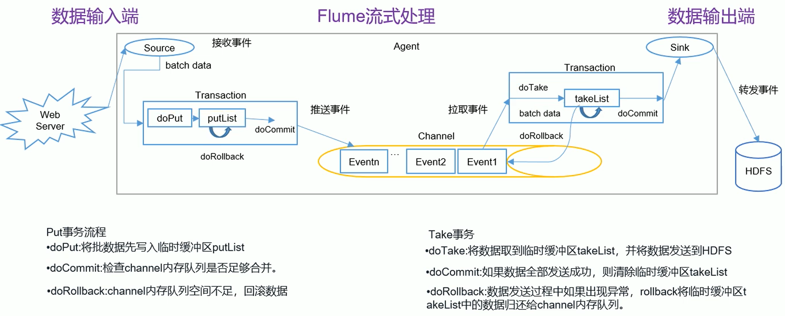

# 1 概述

## 1.1 Flume定义

Flume是Cloudera提供的一个高可用的，高可靠，分布式的海量**日志**采集、聚合和传输的系统。Flume基于流失架构，灵活简单。


> Flume最主要的作用就是。==实时==读取服务器本地磁盘的数据，将数据写入到HDFS。

## 1.2 Flume组成架构


**Flume组成架构详解**


### 1.2.1 Agent

Agent是一个JVM进程，它以事件的形式将数据从源头送至目的，是Flume数据传输的基本单元

Agent主要有3部分组成：Source、Channel、Sink

### 1.2.2 Source

Source是负责接收数据到Flum Agent的组件。Source组件可以处理各种类型、各种格式的日志数据、包括avro、thrift、exec、jms、spooling directory、netcat、sequence generator、syslog、http、legacy

### 1.2.3 Channel

> Channel是位于Source和Sink之间的缓冲区。因此，Channel允许Source和Sink运作在不同的速率上。Channel是线程安全的，可以同时处理几个Source的写入操作和几个Sink的读取操作。

Flume自带两种Channel：Memory Channel 和 File Channel。

- Memory Channel 是内存中的队列。Memory Channel在不需要关心数据丢失的情景下适用。如果需要关心数据丢失，那么Memory Channel就不应该使用，因为程序死亡、机器宕机或者重启都会导致数据丢失。
- File Channel将所有事件写到磁盘。因此在程序关闭或机器宕机的情况下不会丢失数据。

### 1.2.4 Sink

> Sink 不断地轮询 Channel 中的事件且批量地移除它们，并将这些事件批量写入到存储或索引系统、或者被发送到另一个 Flume Agent。
>
> Sink 是完全事务性的。在从 Channel 批量删除数据之前，每个 Sink 用 Channel 启动一个事务。批量事件一旦成功写出到存储系统或下一个Flume Agent，Sink 就利用 Channel 提交事务。事务一旦被提交，该 Channel 从自己的内部缓冲区删除事件。

Sink 组件目的地包括 hdfs、logger、avro、thrift、ipc、file、null、HBase、solr、自定义。

### 1.2.5 Event

传输单元，Flume 数据传输的基本单元，以事件的形式将数据从源头送至目的地。

## 1.3 Flume 拓扑结构

- Flume Agent连接


- 单Source、多channel、Sink


- Flume 负载均衡


- Flume Agent聚合


## 1.4 Flume Agent 内部原理


# 2 安装与使用

## 2.1 Flume安装地址

-  Flume官网地址：http://flume.apache.org/
- 文档查看地址：http://flume.apache.org/FlumeUserGuide.html
- 下载地址：http://archive.apache.org/dist/flume/

## 2.2 安装部署

1. 将 apache-flume-1.7.0-bin.tar.gz 上传到 linux的/opt/software目录下
2. 解压apache-flume-1.7.0-bin.tar.gz到/opt/module/目录下

```shell
tar -zxvf apache-flume-1.7.0-bin.tar.gz -C /opt/module/
```

3. 修改apache-flume-1.7.0-bin的名称为flume

```shell
mv apache-flume-1.7.0-bin flume
```

4.  将flume/conf下的flume-env.sh.template文件修改为flume-env.sh，并配置flume-env.sh文件

```shell
mv flume-env.sh.template flume-env.sh
vi flume-env.sh
export JAVA_HOME=/opt/module/jdk1.8.0_144
```

## 2.3 企业开发案例

### 2.3.1 监控端口数据官方案例

1）案例需求：首先，Flume监控本机44444端口，然后通过telnet工具向本机44444端口发送消息，最后Flume将监听的数据实时显示在控制台。

2）需求分析：监听数据端口案例分析


- 结果


3）实现步骤：

1.安装telnet工具：将rpm软件包(xinetd-2.3.14-40.el6.x86_64.rpm、telnet-0.17-48.el6.x86_64.rpm和telnet-server-0.17-48.el6.x86_64.rpm)拷入/opt/software文件夹下面。执行RPM软件包安装命令：

```shell
[atguigu@hadoop102 software]$ sudo rpm -ivh xinetd-2.3.14-40.el6.x86_64.rpm
[atguigu@hadoop102 software]$ sudo rpm -ivh telnet-0.17-48.el6.x86_64.rpm
[atguigu@hadoop102 software]$ sudo rpm -ivh telnet-server-0.17-48.el6.x86_64.rpm
```

2．判断44444端口是否被占用

```shell
[atguigu@hadoop102 flume-telnet]$ sudo netstat -tunlp | grep 44444
```

功能描述：netstat命令是一个监控TCP/IP网络的非常有用的工具，它可以显示路由表、实际的网络连接以及每一个网络接口设备的状态信息。

基本语法：netstat[选项]，选项参数：

| 参数            | 说明                                     |
| --------------- | ---------------------------------------- |
| -t或--tcp       | 显示TCP传输协议的连线状况                |
| -u或--udp       | 显示UDP传输协议的连线状况                |
| -n或--numeric   | 直接使用ip地址，而不通过域名服务器       |
| -l或--listening | 显示监控中的服务器的Socket               |
| -p或--programs  | 显示正在使用Socket的程序识别码和程序名称 |

3．创建Flume Agent配置文件flume-telnet-logger.conf

在flume目录下创建job文件夹并进入job文件夹。

```shell
[atguigu@hadoop102 flume]$ mkdir job
[atguigu@hadoop102 flume]$ cd job/
```

在job文件夹下创建Flume Agent 配置文件 flume-telnet-logger.conf。

```shell
[atguigu@hadoop102 job]$ touch flume-telnet-logger.conf
```

在 flume-telnet-logger.conf 文件中添加如下内容。

```shell
[atguigu@hadoop102 job]$ vim flume-telnet-logger.conf
```

添加内容如下：

```shell
# Name the components on this agent
a1.sources = r1
a1.sinks = k1
a1.channels = c1
# Describe/configure the source
a1.sources.r1.type = netcat
a1.sources.r1.bind = localhost
a1.sources.r1.port = 44444
# Describe the sink
a1.sinks.k1.type = logger
# Use a channel which buffers events in memory
a1.channels.c1.type = memory
a1.channels.c1.capacity = 1000
a1.channels.c1.transactionCapacity = 100
# Bind the source and sink to the channel
a1.sources.r1.channels = c1
a1.sinks.k1.channel = c1
```

**注：**配置文件来源于官方手册http://flume.apache.org/FlumeUserGuide.html

==配置文件解析==：


4. 先开启flume监听端口

```shell
[atguigu@hadoop102 flume]$ bin/flume-ng agent --conf conf/ --name a1 --conf-file job/flume-telnet-logger.conf -Dflume.root.logger=INFO,console
```

参数说明：

| 参数                              | 说明                                                         |
| --------------------------------- | ------------------------------------------------------------ |
| --conf conf/                      | 表示配置文件存储在conf/目录                                  |
| --name a1                         | 表示给agent起名为a1                                          |
| --conf-file job/flume-telnet.conf | flume本次启动读取的配置文件是在job文件夹下的flume-telnet.conf文件。 |
| -Dflume.root.logger==INFO,console | -D表示flume运行时动态修改flume.root.logger参数属性值，并将控制台日志打印级别设置为INFO级别。日志级别包括:log、info、warn、error。 |

5．使用telnet工具向本机的44444端口发送内容

```shell
[atguigu@hadoop102 ~]$ telnet localhost 44444
```


6．在Flume监听页面观察接收数据情况


### 2.3.2实时读取本地文件到HDFS案例

1）案例需求：实时监控Hive日志，并上传到HDFS中

2）需求分析：实时读取本地文件到HDFS案例


3）实现步骤：

1．Flume要想将数据输出到HDFS，必须持有Hadoop相关jar包

将commons-configuration-1.6.jar、hadoop-auth-2.7.2.jar、hadoop-common-2.7.2.jar、hadoop-hdfs-2.7.2.jar、commons-io-2.4.jar、htrace-core-3.1.0-incubating.jar拷贝到/opt/module/flume/lib文件夹下。

2．创建flume-file-hdfs.conf文件

创建文件

```shell
[atguigu@hadoop102 job]$ touch flume-file-hdfs.conf
```

**注：**要想读取Linux系统中的文件，就得按照Linux命令的规则执行命令。由于Hive日志在Linux系统中所以读取文件的类型选择：exec即execute执行的意思。表示执行Linux命令来读取文件。

```shell
[atguigu@hadoop102 job]$ vim flume-file-hdfs.conf
```

添加如下内容

```shell
# Name the components on this agent
a2.sources = r2
a2.sinks = k2
a2.channels = c2
# Describe/configure the source
a2.sources.r2.type = exec
a2.sources.r2.command = tail -F /opt/module/hive/logs/hive.log
a2.sources.r2.shell = /bin/bash -c
# Describe the sink
a2.sinks.k2.type = hdfs
a2.sinks.k2.hdfs.path = hdfs://hadoop102:9000/flume/%Y%m%d/%H
#上传文件的前缀
a2.sinks.k2.hdfs.filePrefix = logs-
#是否按照时间滚动文件夹
a2.sinks.k2.hdfs.round = true
#多少时间单位创建一个新的文件夹
a2.sinks.k2.hdfs.roundValue = 1
#重新定义时间单位
a2.sinks.k2.hdfs.roundUnit = hour
#是否使用本地时间戳
a2.sinks.k2.hdfs.useLocalTimeStamp = true
#积攒多少个 Event 才 flush 到 HDFS 一次
a2.sinks.k2.hdfs.batchSize = 1000
#设置文件类型，可支持压缩
a2.sinks.k2.hdfs.fileType = DataStream
#多久生成一个新的文件
a2.sinks.k2.hdfs.rollInterval = 600
#设置每个文件的滚动大小
a2.sinks.k2.hdfs.rollSize = 134217700
#文件的滚动与 Event 数量无关
a2.sinks.k2.hdfs.rollCount = 0
#最小冗余数
a2.sinks.k2.hdfs.minBlockReplicas = 1
# Use a channel which buffers events in memory
a2.channels.c2.type = memory
a2.channels.c2.capacity = 1000
a2.channels.c2.transactionCapacity = 100
# Bind the source and sink to the channel
a2.sources.r2.channels = c2
a2.sinks.k2.channel = c2
```

配置文件说明


3．执行监控配置

```shell
[atguigu@hadoop102 flume]$ bin/flume-ng agent --conf conf/ --name a2 --conf-file job/flume-file-hdfs.conf
```

4．开启Hadoop和Hive并操作Hive产生日志

```shell
[atguigu@hadoop102 hadoop-2.7.2]$ sbin/start-dfs.sh
[atguigu@hadoop103 hadoop-2.7.2]$ sbin/start-yarn.sh
[atguigu@hadoop102 hive]$ bin/hive
hive (default)>
```

5．在HDFS上查看文件。


### 2.3.3 实时读取目录文件到HDFS案例

1）案例需求：使用Flume监听整个目录的文件

2）需求分析：实时读取目录文件到HDFS案例


3）实现步骤：

1．创建配置文件flume-dir-hdfs.conf

创建一个文件

```shell
[atguigu@hadoop102 job]$ touch flume-dir-hdfs.conf
```

打开文件

```shell
[atguigu@hadoop102 job]$ vim flume-dir-hdfs.conf
```

添加如下内容

```shell
a3.sources = r3
a3.sinks = k3
a3.channels = c3
# Describe/configure the source
a3.sources.r3.type = spooldir
a3.sources.r3.spoolDir = /opt/module/flume/upload
a3.sources.r3.fileSuffix = .COMPLETED
a3.sources.r3.fileHeader = true
#忽略所有以.tmp 结尾的文件，不上传
a3.sources.r3.ignorePattern = ([^ ]*\.tmp)
# Describe the sink
a3.sinks.k3.type = hdfs
a3.sinks.k3.hdfs.path = 
hdfs://hadoop102:9000/flume/upload/%Y%m%d/%H
#上传文件的前缀
a3.sinks.k3.hdfs.filePrefix = upload-
#是否按照时间滚动文件夹
a3.sinks.k3.hdfs.round = true
#多少时间单位创建一个新的文件夹
a3.sinks.k3.hdfs.roundValue = 1
#重新定义时间单位
a3.sinks.k3.hdfs.roundUnit = hour
#是否使用本地时间戳
a3.sinks.k3.hdfs.useLocalTimeStamp = true
#积攒多少个 Event 才 flush 到 HDFS 一次
a3.sinks.k3.hdfs.batchSize = 100
#设置文件类型，可支持压缩
a3.sinks.k3.hdfs.fileType = DataStream
#多久生成一个新的文件
a3.sinks.k3.hdfs.rollInterval = 600
#设置每个文件的滚动大小大概是 128M
a3.sinks.k3.hdfs.rollSize = 134217700
#文件的滚动与 Event 数量无关
a3.sinks.k3.hdfs.rollCount = 0
#最小冗余数
a3.sinks.k3.hdfs.minBlockReplicas = 1
# Use a channel which buffers events in memory
a3.channels.c3.type = memory
a3.channels.c3.capacity = 1000
a3.channels.c3.transactionCapacity = 100
# Bind the source and sink to the channel
a3.sources.r3.channels = c3
a3.sinks.k3.channel = c3
```

配置文件分析


2. 启动监控文件夹命令

```shell
[atguigu@hadoop102 flume]$ bin/flume-ng agent --conf conf/ --name a3 --conf-file job/flume-dir-hdfs.conf
```

说明：在使用Spooling Directory Source时

- 1)不要在监控目录中创建并持续修改文件
- 2)上传完成的文件会以.COMPLETED结尾
- 3)被监控文件夹每500毫秒扫描一次文件变动

3. 向upload文件夹中添加文件

在/opt/module/flume目录下创建upload文件夹

```shell
[atguigu@hadoop102 flume]$ mkdir upload
```

向upload文件夹中添加文件

```shell
[atguigu@hadoop102 upload]$ touch atguigu.txt
[atguigu@hadoop102 upload]$ touch atguigu.tmp
[atguigu@hadoop102 upload]$ touch atguigu.log
```

4. 查看HDFS上的数据


5. 等待1s，再次查询upload文件夹

```shell
[atguigu@hadoop102 upload]$ ll
总用量 0
-rw-rw-r--. 1 atguigu atguigu 0 5 月 20 22:31 atguigu.log.COMPLETED
-rw-rw-r--. 1 atguigu atguigu 0 5 月 20 22:31 atguigu.tmp
-rw-rw-r--. 1 atguigu atguigu 0 5 月 20 22:31 atguigu.txt.COMPLETED
```

# 3 Flume进阶

## 3.1 Flume事务



## 3.2Flume Agent内部原理


## 3.3Flume拓扑结构

### 3.3.1 简单串联

Flume Agent连接


这种模式是将多个Flume顺序连接起来了，从最初的Source开始到最终sink传送的目的存储系统。此模式不建议桥接过多的Flume数量，Flume数量过多不仅会影响传输速率，而且一旦传输过程中某个节点Flume宕机，会影响整个传输系统。

### 3.3.2 复制和多路复用


Flume支持将事件流向一个或者多个目的地。这种模式可以将相同数据复制到多个Channel中，或者将不同数据分发到不同的Channel中，Sink可以选择传送到不同的目的地。

### 3.3.3 负载均衡和故障转移


Flume支持使用将多个sink逻辑上分到一个sink组，sink组配合不同的SinkProcessor

### 3.3.4 聚合

Flume Agent聚合


## 3.4 企业开发案例

### 3.4.1 复制和多路复用

#### 单数据源多出口案例(选择器)

单Source多Channel、Sink


1）案例需求：使用Flume-1监控文件变动，Flume-1将变动内容传递给Flume-2，Flume-2负责存储到HDFS。同时Flume-1将变动内容传递给Flume-3，Flume-3负责输出到Local FileSystem

2）需求分析：单数据源多出口案例（选择器）


3）实现步骤：

0．准备工作

在/opt/module/flume/job目录下创建group1文件夹

```shell
[atguigu@hadoop102 job]$ cd group1/
```

在/opt/module/datas/目录下创建flume3文件夹

```shell
[atguigu@hadoop102 datas]$ mkdir flume3
```

1．创建flume-file-flume.conf

配置1个接收日志文件的source和两个channel、两个sink，分别输送给flume-flume-hdfs和flume-flume-dir。

创建配置文件并打

```shell
[atguigu@hadoop102 group1]$ touch flume-file-flume.conf
[atguigu@hadoop102 group1]$ vim flume-file-flume.conf
```

添加如下内容

```shell
# Name the components on this agent
a1.sources = r1
a1.sinks = k1 k2
a1.channels = c1 c2
# 将数据流复制给所有 channel
a1.sources.r1.selector.type = replicating
# Describe/configure the source
a1.sources.r1.type = exec
a1.sources.r1.command = tail -F /opt/module/hive/logs/hive.log
a1.sources.r1.shell = /bin/bash -c
# Describe the sink
a1.sinks.k1.type = avro
a1.sinks.k1.hostname = hadoop102
a1.sinks.k1.port = 4141
a1.sinks.k2.type = avro
a1.sinks.k2.hostname = hadoop102
a1.sinks.k2.port = 4142
# Describe the channel
a1.channels.c1.type = memory
a1.channels.c1.capacity = 1000
a1.channels.c1.transactionCapacity = 100
a1.channels.c2.type = memory
a1.channels.c2.capacity = 1000
a1.channels.c2.transactionCapacity = 100
# Bind the source and sink to the channel
a1.sources.r1.channels = c1 c2
a1.sinks.k1.channel = c1
a1.sinks.k2.channel = c2
```

**注**：Avro是由Hadoop创始人Doug Cutting创建的一种语言无关的数据序列化和RPC框架。

**注：**RPC（Remote Procedure Call）—远程过程调用，它是一种通过网络从远程计算机程 序上请求服务，而不需要了解底层网络技术的协议。

2．创建 flume-flume-hdfs.conf

配置上级 Flume 输出的 Source，输出是到 HDFS 的 Sink。

创建配置文件并打开

```shell
[atguigu@hadoop102 group1]$ touch flume-flume-hdfs.conf
[atguigu@hadoop102 group1]$ vim flume-flume-hdfs.conf
```

添加如下内容

```shell
# Name the components on this agent
a2.sources = r1
a2.sinks = k1
a2.channels = c1
# Describe/configure the source
a2.sources.r1.type = avro
a2.sources.r1.bind = hadoop102
a2.sources.r1.port = 4141
# Describe the sink
a2.sinks.k1.type = hdfs
a2.sinks.k1.hdfs.path = hdfs://hadoop102:9000/flume2/%Y%m%d/%H
#上传文件的前缀
a2.sinks.k1.hdfs.filePrefix = flume2-
#是否按照时间滚动文件夹
a2.sinks.k1.hdfs.round = true
#多少时间单位创建一个新的文件夹
a2.sinks.k1.hdfs.roundValue = 1
#重新定义时间单位
a2.sinks.k1.hdfs.roundUnit = hour
#是否使用本地时间戳
a2.sinks.k1.hdfs.useLocalTimeStamp = true
#积攒多少个 Event 才 flush 到 HDFS 一次
a2.sinks.k1.hdfs.batchSize = 100
#设置文件类型，可支持压缩
a2.sinks.k1.hdfs.fileType = DataStream
#多久生成一个新的文件
a2.sinks.k1.hdfs.rollInterval = 600
#设置每个文件的滚动大小大概是 128M
a2.sinks.k1.hdfs.rollSize = 134217700
#文件的滚动与 Event 数量无关
a2.sinks.k1.hdfs.rollCount = 0
#最小冗余数
a2.sinks.k1.hdfs.minBlockReplicas = 1
# Describe the channel
a2.channels.c1.type = memory
a2.channels.c1.capacity = 1000
a2.channels.c1.transactionCapacity = 100
# Bind the source and sink to the channel
a2.sources.r1.channels = c1
a2.sinks.k1.channel = c1
```

3．创建 flume-flume-dir.conf

配置上级 Flume 输出的 Source，输出是到本地目录的 Sink。

创建配置文件并打开

```shell
[atguigu@hadoop102 group1]$ touch flume-flume-dir.conf
[atguigu@hadoop102 group1]$ vim flume-flume-dir.conf
```

添加如下内容

```shell
# Name the components on this agent
a3.sources = r1
a3.sinks = k1
a3.channels = c2
# Describe/configure the source
a3.sources.r1.type = avro
a3.sources.r1.bind = hadoop102
a3.sources.r1.port = 4142
# Describe the sink
a3.sinks.k1.type = file_roll
a3.sinks.k1.sink.directory = /opt/module/datas/flume3
# Describe the channel
a3.channels.c2.type = memory
a3.channels.c2.capacity = 1000
a3.channels.c2.transactionCapacity = 100
# Bind the source and sink to the channel
a3.sources.r1.channels = c2
a3.sinks.k1.channel = c2
```

**提示**：输出的本地目录必须是已经存在的目录，如果该目录不存在，并不会创建新的目录。

4．执行配置文件 分别开启对应配置文件：

flume-flume-dir，flume-flume-hdfs，flume-file-flume。

```shell
[atguigu@hadoop102 flume]$ bin/flume-ng agent --conf conf/ --name a3 --conf-file job/group1/flume-flume-dir.conf
[atguigu@hadoop102 flume]$ bin/flume-ng agent --conf conf/ --name a2 --conf-file job/group1/flume-flume-hdfs.conf
[atguigu@hadoop102 flume]$ bin/flume-ng agent --conf conf/ --name a1 --conf-file job/group1/flume-file-flume.conf
```

5．启动 Hadoop 和 Hive

```shell
[atguigu@hadoop102 hadoop-2.7.2]$ sbin/start-dfs.sh
[atguigu@hadoop103 hadoop-2.7.2]$ sbin/start-yarn.sh
[atguigu@hadoop102 hive]$ bin/hive
hive (default)>
```

6．检查 HDFS 上数据


7 检查/opt/module/datas/flume3 目录中数据

```shell
[atguigu@hadoop102 flume3]$ ll
总用量 8
-rw-rw-r--. 1 atguigu atguigu 5942 5 月 22 00:09 1526918887550-3
```

### 3.4.2 负载均衡和故障转移

1）案例需求：

使用Flume监控一个端口，其Sink组中的Sink分别对接Flume2和Flume3，采用FailoverSinkProsessor，实现故障转移的功能

2）需求分析：故障转移案例


3）实现步骤

（1）准备工作

在/opt/module/flume/job目录下创建group2文件夹

```shell
[atguigu@hadoop102 job]$ cd group2
```

(2)创建 flume-netcat-flume.confe

配置1个netcat source和1个channel、1个sink group (2个 sink)，分别输送给flume-flume-console1和flume-flume-console2。

编辑配置文件

```shell
[atguigu@hadoop102 group2]$ vim flume-netcat-flume.conf
```

添加如下内容

```shell
# Name the components on this agentea1.sources = r1+a1.channels = c1-

al.sinkgroups = gle
al.sinks = k1 k2
#Describe/configure the sourcre
a1.sources.r1.type = netcate
a1.sourees.r1.bind= localhoste
a1.sources.r1.port=44444
a1.sinkgroups.g1.processor.type = failover
a1.sinkgroups.g1.processor.priority.k1 = 5
a1.sinkgroups.g1.processor.priority.k2 = 10
a1.sinkgroups.g1.processor.maxpenalty = 100002
# Describe the sinke
al.sinks.k1.type = avroe
a1.sinks.k1.hostname = hadoop102
al.sinks.k1.port = 4141
al.sinks.k2.type = avroeal.sinks.k2.hostname = hadoop102eal.sinks.k2.port = 4142
# Describe the channele
a1.channels.c1.type = memorye
al.channels.c1.capacity = 1000-al.channels.c1.transactionCapacity = 100e
# Bind the source and sink to the channele
a1.sources.r1.channels = c1
a1.sinkgroups.g1.sinks = k1 k2
a1.sinks.k1.channel = c1
a1.sinks.k2.channel = c1
```

（3）创建Flume-Flume-console1.conf

配置上级 Flume 输出的 Source，输出是到本地控制台。

编辑配置文件

```shell
[atguigu@hadoop102 group2]$ vim flume-flume-consolel.conf
```

添加如下内容

```shell
# Name the components on this agente
a2.sources = r1
a2.sinks = k1
a2.channels =c1
# Describe/configure the sourceu
a2.sources.r1.type = avroe
a2.sources.r1.bind = hadoop102
a2.sources.r1.port = 4141
# Describe the sinke
a2.sinks.k1.type = logger
# Describe the channel
a2 .channe1s .c1.type = memory
a2.channels.c1.capacity = 1000
a2.channels.c1.transactioncapacity = 100
# Bind the source and sink to the channel
a2 .sources.r1.channels = c1
a2 .sinks .k1.channe1 = c1
```

(4)创建flume-flume-console2.conf

配置上级Flume 输出的Source，输出是到本地控制台。

编辑配置文件

```shell
[atguigu@hadoop102 group2]$ vim flume-flume-console2.conf
```

添加如下内容

```shell
# Name the components on this agente
a3.sources =r1
a3.sinks = k1
a3.channels = c2
# Describe/confiqure the sourcee
a3.sources.r1.type = avroe
a3.sources.r1.bind = hadoop102
a3.sources.r1.port = 4142
#Describe the channele
a3.channels.c2.type = memory
a3.channels.c2.capacity = 1000
a3.channels.c2.transactionCapacity = 100
#Bind the source and sink to the channel
a3.sources.r1.channels = c2
a3.sinks.k1.channel = c2
```

（5）执行配置文件

分别开启对应配置文件：flume-flume-console2,flume-flume-console1,flume-netcat-flume。

```shell
[atguiguhadoop102 flume]$ bin/flume-ng agent--conf conf/--namea3 --conf-file job/group2/flume-flume-console2.conflDflume.root.logger=INFO,console
[atguigu@hadoop102 flume]$ bin/flume-ng agent --conf conf/--name a2 --conf-file job/group2/flume-flume-consolel.conf - Dflume.root.logger=INFO,console
[atguigu@hadoop102 flumels bin/flume-ng agent--conf conf/--name al --conf-file job/group2/flume=netcat-flume.conf
```

(6)使用netcat 工具向本机的44444端口发送内容

```shell
$ nc localhost 44444
```

(7)查看 Flume2及 Flume3 的控制台打印日志

(8)将Flume2 kill，观察Flume3 的控制台打印情况

==注:使用 jps -ml 查看 Flume 进程。==

### 3.4.3 单数据源多出口案例(Sink 组)

单 Source、Channel 多 Sink(负载均衡)


1）案例需求：使用Flume-1监控文件变动，Flume-1将变动内容传递给Flume-2，Flume-2负责存储到HDFS。同时Flume-1将变动内容传递给Flume-3，Flume-3也负责存储到HDFS

2）需求分析：单数据源多出口案例（Sink组）


3）实现步骤：

0．准备工作

在/opt/module/flume/job目录下创建group2文件夹

```shell
[atguigu@hadoop102 job]$ cd group2/
```

1．创建flume-netcat-flume.conf

配置1个接收日志文件的source和1个channel、两个sink，分别输送给flume-flume-console1和flume-flume-console2

创建配置文件并打开

```shell
[atguigu@hadoop102 group2]$ touch flume-netcat-flume.conf
[atguigu@hadoop102 group2]$ vim flume-netcat-flume.conf
```

添加如下内容

```shell
# Name the components on this agent
a1.sources = r1
a1.channels = c1
a1.sinkgroups = g1
a1.sinks = k1 k2
# Describe/configure the source
a1.sources.r1.type = netcat
a1.sources.r1.bind = localhost
a1.sources.r1.port = 44444
a1.sinkgroups.g1.processor.type = load_balance
a1.sinkgroups.g1.processor.backoff = true
a1.sinkgroups.g1.processor.selector = round_robin
a1.sinkgroups.g1.processor.selector.maxTimeOut=10000
# Describe the sink
a1.sinks.k1.type = avro
a1.sinks.k1.hostname = hadoop102
a1.sinks.k1.port = 4141
a1.sinks.k2.type = avro
a1.sinks.k2.hostname = hadoop102
a1.sinks.k2.port = 4142
# Describe the channel
a1.channels.c1.type = memory
a1.channels.c1.capacity = 1000
a1.channels.c1.transactionCapacity = 100
# Bind the source and sink to the channel
a1.sources.r1.channels = c1
a1.sinkgroups.g1.sinks = k1 k2
a1.sinks.k1.channel = c1
a1.sinks.k2.channel = c1
```

**注：**Avro 是由 Hadoop 创始人 Doug Cutting 创建的一种语言无关的数据序列化和 RPC 框 架。

**注：**RPC（Remote Procedure Call）—远程过程调用，它是一种通过网络从远程计算机程 序上请求服务，而不需要了解底层网络技术的协议。

2．创建 flume-flume-console1.conf

配置上级 Flume 输出的 Source，输出是到本地控制台。

创建配置文件并打开

```shell
[atguigu@hadoop102 group2]$ touch flume-flume-console1.conf
[atguigu@hadoop102 group2]$ vim flume-flume-console1.conf
```

添加如下内容

```shell
# Name the components on this agent
a2.sources = r1
a2.sinks = k1
a2.channels = c1
# Describe/configure the source
a2.sources.r1.type = avro
a2.sources.r1.bind = hadoop102
a2.sources.r1.port = 4141
# Describe the sink
a2.sinks.k1.type = logger
# Describe the channel
a2.channels.c1.type = memory
a2.channels.c1.capacity = 1000
a2.channels.c1.transactionCapacity = 100
# Bind the source and sink to the channel
a2.sources.r1.channels = c1
a2.sinks.k1.channel = c1
```

3．创建 flume-flume-console2.conf

配置上级 Flume 输出的 Source，输出是到本地控制台。

创建配置文件并打开

```shell
[atguigu@hadoop102 group2]$ touch flume-flume-console2.conf
[atguigu@hadoop102 group2]$ vim flume-flume-console2.conf
```

添加如下内容

```shell
# Name the components on this agent
a3.sources = r1
a3.sinks = k1
a3.channels = c2
# Describe/configure the source
a3.sources.r1.type = avro
a3.sources.r1.bind = hadoop102
a3.sources.r1.port = 4142
# Describe the sink
a3.sinks.k1.type = logger
# Describe the channel
a3.channels.c2.type = memory
a3.channels.c2.capacity = 1000
a3.channels.c2.transactionCapacity = 100
# Bind the source and sink to the channel
a3.sources.r1.channels = c2
a3.sinks.k1.channel = c2
```

4．执行配置文件

分别开启对应配置文件：flume-flume-console2，flume-flume-console1，flume-netcat-flume

```shell
[atguigu@hadoop102 flume]$ bin/flume-ng agent --conf conf/ --name a3 --conf-file job/group2/flume-flume-console2.conf
-Dflume.root.logger=INFO,console
[atguigu@hadoop102 flume]$ bin/flume-ng agent --conf conf/ --name a2 --conf-file job/group2/flume-flume-console1.conf
-Dflume.root.logger=INFO,console
[atguigu@hadoop102 flume]$ bin/flume-ng agent --conf conf/ --name a1 --conf-file job/group2/flume-netcat-flume.conf
```

5.使用 telnet 工具向本机的 44444 端口发送内容

```shell
$ telnet localhost 44444
```

6.查看 Flume2 及 Flume3 的控制台打印日志

### 3.4.4 聚合

####  多数据源汇总案例

多 Source 汇总数据到单 Flume


1）案例需求：

hadoop103上的Flume-1监控文件/opt/module/group.log，

hadoop102上的Flume-2监控某一个端口的数据流，

Flume-1与Flume-2将数据发送给hadoop104上的Flume-3，Flume-3将最终数据打印到控制台。

2）需求分析：多数据源汇总案例


3）实现步骤：

0．准备工作

分发Flume

```shell
[atguigu@hadoop102 module]$ xsync flume
```

在hadoop102、hadoop103以及hadoop104的/opt/module/flume/job目录下创建一个group3 文件夹。

```shell
[atguigu@hadoop102 job]$ mkdir group3
[atguigu@hadoop103 job]$ mkdir group3
[atguigu@hadoop104 job]$ mkdir group3
```

1．创建flume1-logger-flume.conf

配置Source用于监控hive.log文件，配置Sink输出数据到下一级Flume。

在hadoop103上创建配置文件并打开

```shell
[atguigu@hadoop103 group3]$ touch flume1-logger-flume.conf
[atguigu@hadoop103 group3]$ vim flume1-logger-flume.conf
```

添加如下内容

```shell
# Name the components on this agent
a1.sources = r1
a1.sinks = k1
a1.channels = c1
# Describe/configure the source
a1.sources.r1.type = exec
a1.sources.r1.command = tail -F /opt/module/group.log
a1.sources.r1.shell = /bin/bash -c
# Describe the sink
a1.sinks.k1.type = avro
a1.sinks.k1.hostname = hadoop104
a1.sinks.k1.port = 4141# Name the components on this agent
a1.sources = r1
a1.sinks = k1
a1.channels = c1
# Describe/configure the source
a1.sources.r1.type = exec
a1.sources.r1.command = tail -F /opt/module/group.log
a1.sources.r1.shell = /bin/bash -c
# Describe the sink
a1.sinks.k1.type = avro
a1.sinks.k1.hostname = hadoop104
a1.sinks.k1.port = 4141
# Describe the channel
a1.channels.c1.type = memory
a1.channels.c1.capacity = 1000
a1.channels.c1.transactionCapacity = 100
# Bind the source and sink to the channel
a1.sources.r1.channels = c1
a1.sinks.k1.channel = c1
```

2．创建 flume2-netcat-flume.conf

配置 Source 监控端口 44444 数据流，配置 Sink 数据到下一级 Flume：

在 hadoop102 上创建配置文件并打开

```shell
[atguigu@hadoop102 group3]$ touch flume2-netcat-flume.conf
[atguigu@hadoop102 group3]$ vim flume2-netcat-flume.conf
```

添加如下内容

```shell
# Name the components on this agent
a2.sources = r1
a2.sinks = k1
a2.channels = c1
# Describe/configure the source
a2.sources.r1.type = netcat
a2.sources.r1.bind = hadoop102
a2.sources.r1.port = 44444
# Describe the sink
a2.sinks.k1.type = avro
a2.sinks.k1.hostname = hadoop104
a2.sinks.k1.port = 4141
# Use a channel which buffers events in memory
a2.channels.c1.type = memory
a2.channels.c1.capacity = 1000
a2.channels.c1.transactionCapacity = 100
# Bind the source and sink to the channel
a2.sources.r1.channels = c1
a2.sinks.k1.channel = c1
```

3．创建 flume3-flume-logger.conf

配置 source 用于接收 flume1 与 flume2 发送过来的数据流，最终合并后 sink 到控制台。

在 hadoop104 上创建配置文件并打开

```shell
[atguigu@hadoop104 group3]$ touch flume3-flume-logger.conf
[atguigu@hadoop104 group3]$ vim flume3-flume-logger.conf
```

添加如下内容

```shell
# Name the components on this agent
a3.sources = r1
a3.sinks = k1
a3.channels = c1
# Describe/configure the source
a3.sources.r1.type = avro
a3.sources.r1.bind = hadoop104
a3.sources.r1.port = 4141
# Describe the sink
# Describe the sink
a3.sinks.k1.type = logger
# Describe the channel
a3.channels.c1.type = memory
a3.channels.c1.capacity = 1000
a3.channels.c1.transactionCapacity = 100
# Bind the source and sink to the channel
a3.sources.r1.channels = c1
a3.sinks.k1.channel = c1
```

4．执行配置文件

分 别 开 启 对 应 配 置 文 件 ： flume3-flume-logger.conf ， flume2-netcat-flume.conf ， flume1-logger-flume.conf。

```shell
[atguigu@hadoop104 flume]$ bin/flume-ng agent --conf conf/ --name a3 --conf-file job/group3/flume3-flume-logger.conf
-Dflume.root.logger=INFO,console
[atguigu@hadoop102 flume]$ bin/flume-ng agent --conf conf/ --name a2 --conf-file job/group3/flume2-netcat-flume.conf
[atguigu@hadoop103 flume]$ bin/flume-ng agent --conf conf/ --name a1 --conf-file job/group3/flume1-logger-flume.conf
```

5．在 hadoop103 上向/opt/module 目录下的 group.log 追加内容

```shell
[atguigu@hadoop103 module]$ echo 'hello' > group.log
```

6．在 hadoop102 上向 44444 端口发送数据

```shell
[atguigu@hadoop102 flume]$ telnet hadoop102 44444
```

7.检查 hadoop104 上数据


# 4  Flume 监控之 Ganglia

Ganglia 由 gmond、gmetad 和 gweb 三部分组成。

gmond(Ganglia Monitoring Daemon)是一种轻量级服务，安装在每台需要收集指标数据的节点主机上。使用 gmond，你可以很容易收集很多系统指标数据，如 CPU、内存、磁盘、网络和活跃进程的数据等。

gmetad(Ganglia Meta Daemon)整合所有信息，并将其以RRD 格式存储至磁盘的服务。

gweb (Ganglia Web)Ganglia 可视化工具，gweb 是一种利用浏览器显示 gmetad 所存储数据的 PHP 前端。在 Web 界面中以图表方式展现集群的运行状态下收集的多种不同指标数据。

## 4.1 Ganglia 的安装与部署

1) 安装 httpd 服务与 php

```shell
[atguigu@hadoop102 flume]$ sudo yum -y install httpd php
```

2) 安装其他依赖

```shell
[atguigu@hadoop102 flume]$ sudo yum -y install rrdtool 
perl-rrdtool rrdtool-devel
[atguigu@hadoop102 flume]$ sudo yum -y install apr-devel
```

3) 安装 ganglia

```shell
[atguigu@hadoop102 flume]$ sudo rpm -Uvh http://dl.fedoraproject.org/pub/epel/6/x86_64/epel-release-6-8
.noarch.rpm
[atguigu@hadoop102 flume]$ sudo yum -y install ganglia-gmetad 
[atguigu@hadoop102 flume]$ sudo yum -y install ganglia-web
[atguigu@hadoop102 flume]$ sudo yum install -y ganglia-gmond
```

4) 修改配置文件/etc/httpd/conf.d/ganglia.conf

```shell
[atguigu@hadoop102 flume]$ sudo vim /etc/httpd/conf.d/ganglia.conf
```

修改为红颜色的配置：

```shell
# Ganglia monitoring system php web frontend
Alias /ganglia /usr/share/ganglia
<Location /ganglia>
 Order deny,allow
 Deny from all
 Allow from all
 # Allow from 127.0.0.1
 # Allow from ::1
 # Allow from .example.com
</Location>
```

5) 修改配置文件/etc/ganglia/gmetad.conf

```shell
[atguigu@hadoop102 flume]$ sudo vim /etc/ganglia/gmetad.conf
```

修改为：

```shell
data_source "hadoop102" 192.168.1.102
```

6) 修改配置文件/etc/ganglia/gmond.conf

```shell
[atguigu@hadoop102 flume]$ sudo vim /etc/ganglia/gmond.conf 
```

修改为：

```shell
cluster {
 name = "hadoop102"
 owner = "unspecified"
 latlong = "unspecified"
 url = "unspecified"
}
udp_send_channel {
 #bind_hostname = yes # Highly recommended, soon to be default.
 # This option tells gmond to use a source 
address
 # that resolves to the machine's hostname. 
Without
 # this, the metrics may appear to come from any
 # interface and the DNS names associated with
 # those IPs will be used to create the RRDs.
# mcast_join = 239.2.11.71
host = 192.168.1.102
 port = 8649
 ttl = 1
}
udp_recv_channel {
 # mcast_join = 239.2.11.71
 port = 8649
 bind = 192.168.1.102
 retry_bind = true
 # Size of the UDP buffer. If you are handling lots of metrics you really
 # should bump it up to e.g. 10MB or even higher.
 # buffer = 10485760
}

```

7) 修改配置文件/etc/selinux/config

```shell
[atguigu@hadoop102 flume]$ sudo vim /etc/selinux/config
```

修改为：

```shell
# This file controls the state of SELinux on the system.
# SELINUX= can take one of these three values:
# enforcing - SELinux security policy is enforced.
# permissive - SELinux prints warnings instead of enforcing.
# disabled - No SELinux policy is loaded.
SELINUX=disabled
# SELINUXTYPE= can take one of these two values:
# targeted - Targeted processes are protected,
# mls - Multi Level Security protection.
SELINUXTYPE=targeted
```

**尖叫提示：**selinux 本次生效关闭必须重启，如果此时不想重启，可以临时生效之：

```shell
[atguigu@hadoop102 flume]$ sudo setenforce 0
```

5) 启动 ganglia

```shell
[atguigu@hadoop102 flume]$ sudo service httpd start
[atguigu@hadoop102 flume]$ sudo service gmetad start
[atguigu@hadoop102 flume]$ sudo service gmond start
```

6) 打开网页浏览 ganglia 页面： http://192.168.1.102/ganglia 

**尖叫提示：**如果完成以上操作依然出现权限不足错误，请修改/var/lib/ganglia 目录的权限：

```shell
[atguigu@hadoop102 flume]$ sudo chmod -R 777 /var/lib/ganglia
```

## 4.2 操作 Flume 测试监控

1) 修改/opt/module/flume/conf 目录下的 flume-env.sh 配置：

```sh
JAVA_OPTS="-Dflume.monitoring.type=ganglia
-Dflume.monitoring.hosts=192.168.1.102:8649
-Xms100m
-Xmx200m"
```

2) 启动 Flume 任务

```shell
[atguigu@hadoop102 flume]$ bin/flume-ng agent \
--conf conf/ \
--name a1 \
--conf-file job/flume-telnet-logger.conf \
-Dflume.root.logger==INFO,console \
-Dflume.monitoring.type=ganglia \
-Dflume.monitoring.hosts=192.168.1.102:8649
```

3) 发送数据观察 ganglia 监测图

```shell
[atguigu@hadoop102 flume]$ telnet localhost 44444
```

样式如图：


图例说明：

| 字段（图表名称）      | 字段含义                                                     |
| --------------------- | ------------------------------------------------------------ |
| EventPutAttemptCount  | source 尝试写入 channel 的事件总数量                         |
| EventPutSuccessCount  | 成功写入 channel 且提交的事件总数量                          |
| EventTakeAttemptCount | sink 尝试从 channel 拉取事件的总数量。这不意味着每次事件都被返回， 因为 sink 拉取的时候 channel 可能没有任何数据。 |
| EventTakeSuccessCount | sink 成功读取的事件的总数量                                  |
| StartTime             | channel 启动的时间（毫秒）                                   |
| StopTime              | channel 停止的时间（毫秒）                                   |
| ChannelSize           | 目前 channel 中事件的总数量                                  |
| ChannelFillPercentage | channel 占用百分比                                           |
| ChannelCapacity       | channel 的容量                                               |

# 5 Flume高级之自定义 MySQLSource

## 5.1 自定义 Source 说明

Source 是负责接收数据到 Flume Agent 的组件。Source 组件可以处理各种类型、各种格 式的日志数据，包括 avro、thrift、exec、jms、spooling directory、netcat、sequence generator、 syslog、http、legacy。官方提供的 source 类型已经很多，但是有时候并不能满足实际开发当 中的需求，此时我们就需要根据实际需求自定义某些 Source。

如：实时监控 MySQL，从 MySQL 中获取数据传输到 HDFS 或者其他存储框架，所以 此时需要我们自己实现 MySQLSource。

官方也提供了自定义 source 的接口： 官网说明：https://flume.apache.org/FlumeDeveloperGuide.html#source

## 5.2 自定义Interceptor

1）案例需求
使用 Flume 采集服务器本地日志，需要按照日志类型的不同，将不同种类的日志发往不同的分析系统。

2）案例分析

在实际的开发中，一台服务器产生的日志类型可能有很多种，不同类型的日志可能需要发送到不同的分析系统。此时会用到Flume 拓扑结构中的Multiplexing结构,Multiplexing的原理是，根据event 中Header 的某个 key 的值，将不同的event 发送到不同的 Channel中，所以我们需要自定义一个Interceptor，为不同类型的event 的 Header 中的 key 赋予不同的值。在该案例中,我们以端口数据模拟日志，以是否包含”atguigu'”模拟不同类型的日志我们需要自定义interceptor 区分数据中是否包含”atguigu”，将其分别发往不同的分析系统（Channel）

Interceptor和Multipexing ChannelSelector案例


3）实现步骤

（1）创建一个Maven项目，并引入以下依赖

```xml
<dependency>
    <groupId>org.apache.flume</groupId>
    <artifactId>flume-ng-core</artifactId>
    <version>1.9.0</version>
</dependency>
```

（2）定义CustomInterceptor 类并实现 Interceptor 接口。


## 5.3 自定义 MySQLSource 组成


### 5.3.1 自定义 MySQLSource 步骤

根据官方说明自定义 MySqlSource 需要继承 AbstractSource 类并实现 Configurable 和 PollableSource 接口。

实现相应方法：

- getBackOffSleepIncrement()//暂不用
- getMaxBackOffSleepInterval()//暂不用
- configure(Context context)//初始化 context
- process()//获取数据（从 MySql 获取数据，业务处理比较复杂，所以我们定义一个专门 的类——SQLSourceHelper 来处理跟 MySql 的交互），封装成 Event 并写入 Channel，这个 方法被循环调用
- stop()//关闭相关的资源

### 5.3.2 代码实现

#### 5.3.2.1 导入 Pom 依赖

```xml
<dependencies>
    <dependency>
        <groupId>org.apache.flume</groupId>
        <artifactId>flume-ng-core</artifactId>
        <version>1.7.0</version>
    </dependency>
    <dependency>
        <groupId>mysql</groupId>
        <artifactId>mysql-connector-java</artifactId>
        <version>5.1.27</version>
    </dependency>
</dependencies>
```

#### 5.3.2.2 添加配置信息

在 ClassPath 下添加 jdbc.properties 和 log4j. properties

jdbc.properties:

```properties
dbDriver=com.mysql.jdbc.Driver
dbUrl=jdbc:mysql://hadoop102:3306/mysqlsource?useUnicode=true&
characterEncoding=utf-8
dbUser=root
dbPassword=000000
```

log4j. properties:

```properties
#--------console-----------
log4j.rootLogger=info,myconsole,myfile
log4j.appender.myconsole=org.apache.log4j.ConsoleAppender
log4j.appender.myconsole.layout=org.apache.log4j.SimpleLayout
#log4j.appender.myconsole.layout.ConversionPattern =%d [%t] %-5p [%c] - %m%n
#log4j.rootLogger=error,myfile
log4j.appender.myfile=org.apache.log4j.DailyRollingFileAppende
r
log4j.appender.myfile.File=/tmp/flume.log
log4j.appender.myfile.layout=org.apache.log4j.PatternLayout
log4j.appender.myfile.layout.ConversionPattern =%d [%t] %-5p [%c] - %m%n
```

#### 5.3.2.3 SQLSourceHelper

1）属性说明：

| 属性                    | 说明（括号中为默认值）                      |
| ----------------------- | ------------------------------------------- |
| runQueryDelay           | 查询时间间隔（10000）                       |
| batchSize               | 缓存大小（100）                             |
| startFrom               | 查询语句开始 id（0）                        |
| currentIndex            | 查询语句当前 id，每次查询之前需要查元数据表 |
| recordSixe              | 查询返回条数                                |
| table                   | 监控的表名                                  |
| columnsToSelect         | 查询字段（*）                               |
| customQuery             | 用户传入的查询语句                          |
| query                   | 查询语句                                    |
| defaultCharsetResultSet | 编码格式（UTF-8）                           |

2）方法说明：

| 方法                                               | 说明                                               |
| -------------------------------------------------- | -------------------------------------------------- |
| SQLSourceHelper(Context context)                   | 构造方法，初始化属性及获取 JDBC 连接               |
| InitConnection(String url, String user, String pw) | 获取 JDBC 连接                                     |
| checkMandatoryProperties()                         | 校验相关属性是否设置（实际开发中可增加内容）       |
| buildQuery()                                       | 根据实际情况构建 sql 语句，返回值 String           |
| executeQuery()                                     | 执行 sql 语句的查询操作，返回值 List<List<Object>> |
| getAllRows(List> queryResult)                      | 将查询结果转换为 String，方便后续操作              |
| updateOffset2DB(int size)                          | 根据每次查询结果将 offset 写入元数据表             |
| execSql(String sql)                                | 具体执行 sql 语句方法                              |
| getStatusDBIndex(int startFrom)                    | 获取元数据表中的 offset                            |
| queryOne(String sql)                               | 获取元数据表中的 offset 实际 sql 语句执行方法      |
| close()                                            | 关闭资源                                           |

3）代码分析


4）代码实现：

```java
package com.atguigu.source;
import org.apache.flume.Context;
import org.apache.flume.conf.ConfigurationException;
import org.slf4j.Logger;
import org.slf4j.LoggerFactory;
import java.io.IOException;
import java.sql.*;
import java.text.ParseException;
import java.util.ArrayList;
import java.util.List;
import java.util.Properties;
public class SQLSourceHelper {
    private static final Logger LOG = 
        LoggerFactory.getLogger(SQLSourceHelper.class);
    private int runQueryDelay, //两次查询的时间间隔
    startFrom, //开始 id
    currentIndex, //当前 id
    recordSixe = 0, //每次查询返回结果的条数
    maxRow; //每次查询的最大条数
    private String table, //要操作的表
    columnsToSelect, //用户传入的查询的列
    customQuery, //用户传入的查询语句
    query, //构建的查询语句
    defaultCharsetResultSet;//编码集
    //上下文，用来获取配置文件
    private Context context;
    //为定义的变量赋值（默认值），可在 flume 任务的配置文件中修改
    private static final int DEFAULT_QUERY_DELAY = 10000;
    private static final int DEFAULT_START_VALUE = 0;
    private static final int DEFAULT_MAX_ROWS = 2000;
    private static final String DEFAULT_COLUMNS_SELECT = "*";
    private static final String DEFAULT_CHARSET_RESULTSET = 
        "UTF-8";
    private static Connection conn = null;
    private static PreparedStatement ps = null;
    private static String connectionURL, connectionUserName, 
    connectionPassword;
    //加载静态资源
    static {
        Properties p = new Properties();
        try {

            p.load(SQLSourceHelper.class.getClassLoader().getResourceAsStr
                   eam("jdbc.properties"));
            connectionURL = p.getProperty("dbUrl");
            connectionUserName = p.getProperty("dbUser");
            connectionPassword = p.getProperty("dbPassword");
            Class.forName(p.getProperty("dbDriver"));
        } catch (IOException | ClassNotFoundException e) {
            LOG.error(e.toString());
        }
    }
    //获取 JDBC 连接
    private static Connection InitConnection(String url, String 
                                             user, String pw) {
        try {
            Connection conn = DriverManager.getConnection(url, 
                                                          user, pw);
            if (conn == null)
                throw new SQLException();
            return conn;
        } catch (SQLException e) {
            e.printStackTrace();
        }
        return null;
    }
    //构造方法
    SQLSourceHelper(Context context) throws ParseException {
        //初始化上下文
        this.context = context;
        //有默认值参数：获取 flume 任务配置文件中的参数，读不到的采用默认值
        this.columnsToSelect = 
            context.getString("columns.to.select", DEFAULT_COLUMNS_SELECT);
        this.runQueryDelay = context.getInteger("run.query.delay", 
                                                DEFAULT_QUERY_DELAY);
        this.startFrom = context.getInteger("start.from", 
                                            DEFAULT_START_VALUE);
        this.defaultCharsetResultSet = 
            context.getString("default.charset.resultset", 
                              DEFAULT_CHARSET_RESULTSET);
        //无默认值参数：获取 flume 任务配置文件中的参数
        this.table = context.getString("table");
        this.customQuery = context.getString("custom.query");
        connectionURL = context.getString("connection.url");
        connectionUserName = 
            context.getString("connection.user");
        connectionPassword = 
            context.getString("connection.password");
        conn = InitConnection(connectionURL, connectionUserName, 
                              connectionPassword);
        //校验相应的配置信息，如果没有默认值的参数也没赋值，抛出异常
        checkMandatoryProperties();
        //获取当前的 id
        currentIndex = getStatusDBIndex(startFrom);
        //构建查询语句
        query = buildQuery();
    }
    //校验相应的配置信息（表，查询语句以及数据库连接的参数）
    private void checkMandatoryProperties() {
        if (table == null) {
            throw new ConfigurationException("property table not set");
        }
        if (connectionURL == null) {
            throw new ConfigurationException("connection.url property not set");
        }

        if (connectionUserName == null) {                                                            throw new ConfigurationException("connection.user property not set");
                                        }
        if (connectionPassword == null) {
            throw new ConfigurationException("connection.password property not set");
        }
    }
    //构建 sql 语句
    private String buildQuery() {
        String sql = "";
        //获取当前 id
        currentIndex = getStatusDBIndex(startFrom);
        LOG.info(currentIndex + "");
        if (customQuery == null) {
            sql = "SELECT " + columnsToSelect + " FROM " + table;
        } else {
            sql = customQuery;
        }
        StringBuilder execSql = new StringBuilder(sql);
        //以 id 作为 offset
        if (!sql.contains("where")) {
            execSql.append(" where ");

            execSql.append("id").append(">").append(currentIndex);
            return execSql.toString();
        } else {
            int length = execSql.toString().length();
            return execSql
                .toString()
                .substring(0, length - String.valueOf(currentIndex).length()) + currentIndex;
        }
    }
    //执行查询
    List<List<Object>> executeQuery() {
        try {
            //每次执行查询时都要重新生成 sql，因为 id 不同
            customQuery = buildQuery();
            //存放结果的集合
            List<List<Object>> results = new ArrayList<>();
            if (ps == null) {
                //
                ps = conn.prepareStatement(customQuery);
            }
            ResultSet result = ps.executeQuery(customQuery);
            while (result.next()) {
                //存放一条数据的集合（多个列）
                List<Object> row = new ArrayList<>();
                //将返回结果放入集合
                for (int i = 1; i <= 
                     result.getMetaData().getColumnCount(); i++) {
                    row.add(result.getObject(i));
                }
                results.add(row);
            }
            LOG.info("execSql:" + customQuery + "\nresultSize:" + 
                     results.size());
            return results;
        } catch (SQLException e) {
            LOG.error(e.toString());
            // 重新连接
            conn = InitConnection(connectionURL, 
                                  connectionUserName, connectionPassword);
        }
        return null;
    }
    //将结果集转化为字符串，每一条数据是一个 list 集合，将每一个小的 list
    集合转化为字符串
        List<String> getAllRows(List<List<Object>> queryResult) {
        List<String> allRows = new ArrayList<>();
        if (queryResult == null || queryResult.isEmpty())
            return allRows;
        StringBuilder row = new StringBuilder();
        for (List<Object> rawRow : queryResult) {
            Object value = null;
            for (Object aRawRow : rawRow) {
                value = aRawRow;
                if (value == null) {
                    row.append(",");
                } else {
                    row.append(aRawRow.toString()).append(",");
                }
            }
            allRows.add(row.toString());
            row = new StringBuilder();
        }
        return allRows;
    }
    //更新 offset 元数据状态，每次返回结果集后调用。必须记录每次查询的offset 值，为程序中断续跑数据时使用，以 id 为 offset
    void updateOffset2DB(int size) {
        //以 source_tab 做为 KEY，如果不存在则插入，存在则更新（每个源表对应一条记录）
        String sql = "insert into flume_meta(source_tab,currentIndex) VALUES('"
            + this.table
            + "','" + (recordSixe += size)
            + "') on DUPLICATE key update source_tab=values(source_tab),currentIndex=values(currentIndex)";
        LOG.info("updateStatus Sql:" + sql);
        execSql(sql);
    }
    //执行 sql 语句
    private void execSql(String sql) {
        try {
            ps = conn.prepareStatement(sql);
            LOG.info("exec::" + sql);
            ps.execute();
        } catch (SQLException e) {
            e.printStackTrace();
        }
    }
    //获取当前 id 的 offset
    private Integer getStatusDBIndex(int startFrom) {
        //从 flume_meta 表中查询出当前的 id 是多少
        String dbIndex = queryOne("select currentIndex from flume_meta where source_tab='" + table + "'");
        if (dbIndex != null) {
            return Integer.parseInt(dbIndex);
        }
        //如果没有数据，则说明是第一次查询或者数据表中还没有存入数据，返回最初传入的值
        return startFrom;
        //查询一条数据的执行语句(当前 id)
        private String queryOne(String sql) {  
            ResultSet result = null;
            try {
                ps = conn.prepareStatement(sql);
                result = ps.executeQuery();
                while (result.next()) {
                    return result.getString(1);
                }
            } catch (SQLException e) {
                e.printStackTrace();
            }
            return null;
        }
        //关闭相关资源
        void close() {
            try {
                ps.close();
                conn.close();
            } catch (SQLException e) {
                e.printStackTrace();
            }
        }
        int getCurrentIndex() {
            return currentIndex;
        }
        void setCurrentIndex(int newValue) {
            currentIndex = newValue;
        }
        int getRunQueryDelay() {
            return runQueryDelay;
        }
        String getQuery() {
            return query;
        }
        String getConnectionURL() {
            return connectionURL;
        }
        private boolean isCustomQuerySet() {
            return (customQuery != null);
        }
        Context getContext() {
            return context;
        }
        public String getConnectionUserName() {
            return connectionUserName;
        }
        public String getConnectionPassword() {
            return connectionPassword;
        }
        String getDefaultCharsetResultSet() {
            return defaultCharsetResultSet;
        }
    }
```

#### 5.3.2.4 MySQLSource

代码实现：

```java
package com.atguigu.source;
import org.apache.flume.Context;
import org.apache.flume.Event;
import org.apache.flume.EventDeliveryException;
import org.apache.flume.PollableSource;
import org.apache.flume.conf.Configurable;
import org.apache.flume.event.SimpleEvent;
import org.apache.flume.source.AbstractSource;
import org.slf4j.Logger;
import org.slf4j.LoggerFactory;
import java.text.ParseException;
import java.util.ArrayList;
import java.util.HashMap;
import java.util.List;
public class SQLSource extends AbstractSource implements 
    Configurable, PollableSource {
    //打印日志
    private static final Logger LOG = 
        LoggerFactory.getLogger(SQLSource.class);
    //定义 sqlHelper
    private SQLSourceHelper sqlSourceHelper;
    @Override
    public long getBackOffSleepIncrement() {
        return 0;
    }
    @Override
    public long getMaxBackOffSleepInterval() {
        return 0;
    }
    @Override
    public void configure(Context context) {
        try {
            //初始化
            sqlSourceHelper = new SQLSourceHelper(context);
        } catch (ParseException e) {
            e.printStackTrace();
        }
    }
    @Override
    public Status process() throws EventDeliveryException {
        try {
            //查询数据表
            List<List<Object>> result = 
                sqlSourceHelper.executeQuery();
            //存放 event 的集合
            List<Event> events = new ArrayList<>();
            //存放 event 头集合
            HashMap<String, String> header = new HashMap<>();
            //如果有返回数据，则将数据封装为 event
            if (!result.isEmpty()) {
                List<String> allRows = 
                    sqlSourceHelper.getAllRows(result);
                Event event = null;
                for (String row : allRows) {
                    event = new SimpleEvent();
                    event.setBody(row.getBytes());
                    event.setHeaders(header);
                    events.add(event);
                }
                //将 event 写入 channel

                this.getChannelProcessor().processEventBatch(events);
                //更新数据表中的 offset 信息
                sqlSourceHelper.updateOffset2DB(result.size());
            }
            //等待时长
            Thread.sleep(sqlSourceHelper.getRunQueryDelay());
            return Status.READY;
        } catch (InterruptedException e) {
            LOG.error("Error procesing row", e);
            return Status.BACKOFF;
        }
    }
    @Override
    public synchronized void stop() {
        LOG.info("Stopping sql source {} ...", getName());
        try {
            //关闭资源
            sqlSourceHelper.close();
        } finally {
            super.stop();
        }
    }
}
```

### 5.3.3 测试

#### 5.3.3.1 Jar 包准备

1) 将 MySql 驱动包放入 Flume 的 lib 目录下

```shell
[atguigu@hadoop102 flume]$ cp \
/opt/sorfware/mysql-libs/mysql-connector-java-5.1.27/mysql-con
nector-java-5.1.27-bin.jar \
/opt/module/flume/lib/
```

2) 打包项目并将 Jar 包放入 Flume 的 lib 目录下

#### 5.3.3.2 配置文件准备

1）创建配置文件并打开

```shell
[atguigu@hadoop102 job]$ touch mysql.conf
[atguigu@hadoop102 job]$ vim mysql.conf 
```

2）添加如下内容

```shell
# Name the components on this agent
a1.sources = r1
a1.sinks = k1
a1.channels = c1
# Describe/configure the source
a1.sources.r1.type = com.atguigu.source.SQLSource 
a1.sources.r1.connection.url = 
jdbc:mysql://192.168.9.102:3306/mysqlsource
a1.sources.r1.connection.user = root 
a1.sources.r1.connection.password = 000000 
a1.sources.r1.table = student 
a1.sources.r1.columns.to.select = * 
#a1.sources.r1.incremental.column.name = id
#a1.sources.r1.incremental.value = 0 
a1.sources.r1.run.query.delay=5000
# Describe the sink
a1.sinks.k1.type = logger
# Describe the channel
a1.channels.c1.type = memory
a1.channels.c1.capacity = 1000
a1.channels.c1.transactionCapacity = 100
# Bind the source and sink to the channel
a1.sources.r1.channels = c1
a1.sinks.k1.channel = c1
```

#### 5.3.3.3 MySql 表准备

1) 创建 MySqlSource 数据库

```sql
CREATE DATABASE mysqlsource；
```

2) 在 MySqlSource 数据库下创建数据表 Student 和元数据表 Flume_meta

```mysql
CREATE TABLE `student` (
`id` int(11) NOT NULL AUTO_INCREMENT,
`name` varchar(255) NOT NULL,
PRIMARY KEY (`id`)
);
CREATE TABLE `flume_meta` (
`source_tab` varchar(255) NOT NULL,
`currentIndex` varchar(255) NOT NULL,
PRIMARY KEY (`source_tab`)
);
```

3) 向数据表中添加数据

```shell
1 zhangsan
2 lisi
3 wangwu
4 zhaoliu
```

#### 5.3.3.4 测试并查看结果

1) 任务执行

```shell
[atguigu@hadoop102 flume]$ bin/flume-ng agent --conf conf/ --name a1 --conf-file job/mysql.conf -Dflume.root.logger=INFO,console
```

2) 结果展示，如图 6-2 所示：


## 5.4 自定义Sink

1)介绍

Sink 不断地轮询 Channel 中的事件且批量地移除它们，并将这些事件批量写入到存储或索引系统、或者被发送到另一个 Flume Agent。

Sink 是完全事务性的。在从 Channel 批量删除数据之前，每个 Sink 用 Channel启动一个事务。批量事件一旦成功写出到存储系统或下一个 Flume Agent，Sink 就利用Channel提交事务。事务一旦被提交，该 Channel 从自己的内部缓冲区删除事件。

Sink 组件目的地包括hdfs、logger、avro、thrift、ipc、file、null、HBase、solr、自定义。官方提供的 Sink 类型已经很多，但是有时候并不能满足实际开发当中的需求，此时我们就需要根据实际需求自定义某些 Sink。

官方也提供了自定义 sink 的接口:“
https://flume.apache.org/FlumeDeveloperGuide.html#sink 根据官方说明自定义MySink 需要继承AbstractSink 类并实现 Configurable 接口。


# 6 知识扩展

## 6.1 常见正则表达式语法

| 元字符 | 描述                                                         |
| ------ | ------------------------------------------------------------ |
| ^      | 匹配输入字符串的开始位置。如果设置了 RegExp 对象的 Multiline 属性，^也 匹配“\n”或“\r”之后的位置。 |
| $      | 匹配输入字符串的结束位置。如果设置了 RegExp 对象的 Multiline 属性，$也 匹配“\n”或“\r”之前的位置。 |
| **     | 匹配前面的子表达式任意次。例如，zo*能匹配“z”，“zo”以及“zoo”。*等价于 {0,}。 |
| +      | 匹配前面的子表达式一次或多次(大于等于 1 次）。例如，“zo+”能匹配“zo”以 及“zoo”，但不能匹配“z”。+等价于{1,}。 |
| [a-z]  | 字符范围。匹配指定范围内的任意字符。例如，“[a-z]”可以匹配“a”到“z”范围 内的任意小写字母字符。 **注意:**只有连字符在字符组内部时,并且出现在两个字符之间时,才能表示字符的 范围; 如果出字符组的开头,则只能表示连字符本身 |

# 7 企业真实面试题（重点）

## 7.1 你是如何实现 Flume 数据传输的监控的

使用第三方框架 Ganglia 实时监控 Flume。

## 7.2 Flume 的 Source，Sink，Channel 的作用？你们 Source 是什么类 型？

1、作用 

（1）Source 组件是专门用来收集数据的，可以处理各种类型、各种格式的日志数据， 包括 avro、thrift、exec、jms、spooling directory、netcat、sequence generator、syslog、http、 legacy

（2）Channel 组件对采集到的数据进行缓存，可以存放在 Memory 或 File 中。 （3）Sink 组件是用于把数据发送到目的地的组件，目的地包括 Hdfs、Logger、avro、 thrift、ipc、file、Hbase、solr、自定义。 

2、我公司采用的 Source 类型为： 

（1）监控后台日志：exec 

（2）监控后台产生日志的端口：netcat Exec spooldir

## 7.3 Flume 的 Channel Selectors


## 7.4 Flume 参数调优

1.Source 

- 增加 Source 个（使用 Tair Dir Source 时可增加 FileGroups 个数）可以增大 Source 的读 取数据的能力。例如：当某一个目录产生的文件过多时需要将这个文件目录拆分成多个文件 目录，同时配置好多个 Source 以保证 Source 有足够的能力获取到新产生的数据。 
- batchSize 参数决定 Source 一次批量运输到 Channel 的 event 条数，适当调大这个参数可 以提高 Source 搬运 Event 到 Channel 时的性能。

2.Channel

- type 选择 memory 时 Channel 的性能最好，但是如果 Flume 进程意外挂掉可能会丢失数 据。type 选择 file 时 Channel 的容错性更好，但是性能上会比 memory channel 差。
- 使用 file Channel 时 dataDirs 配置多个不同盘下的目录可以提高性能。 
- Capacity 参数决定 Channel 可容纳最大的 event 条数。transactionCapacity 参数决定每次 Source 往 channel 里面写的最大 event 条数和每次 Sink 从 channel 里面读的最大 event 条数。 transactionCapacity 需要大于 Source 和 Sink 的 batchSize 参数。

3.Sink

- 增加 Sink 的个数可以增加 Sink 消费 event 的能力。Sink 也不是越多越好够用就行，过 多的 Sink 会占用系统资源，造成系统资源不必要的浪费。
- batchSize 参数决定 Sink 一次批量从 Channel 读取的 event 条数，适当调大这个参数可以提高 Sink 从 Channel 搬出 event 的性能。

## 7.5 Flume 的事务机制

>  Flume 的事务机制（类似数据库的事务机制）：Flume 使用两个独立的事务分别负责从 Soucrce 到 Channel，以及从 Channel 到 Sink 的事件传递。比如 spooling directory source 为 文件的每一行创建一个事件，一旦事务中所有的事件全部传递到 Channel 且提交成功，那么 Soucrce 就将该文件标记为完成。同理，事务以类似的方式处理从 Channel 到 Sink 的传递过 程，如果因为某种原因使得事件无法记录，那么事务将会回滚。且所有的事件都会保持到 Channel 中，等待重新传递。

## 7.6 Flume 采集数据会丢失吗? 

- 不会，Channel 存储可以存储在 File 中，数据传输自身有事务


