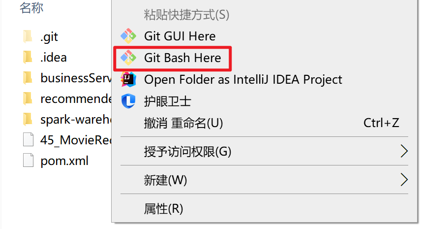
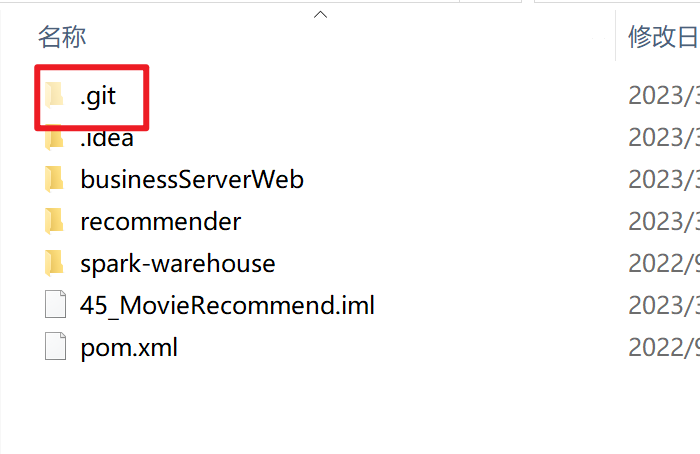

# 1 上传本地项目到Github仓库

1.1 在本地项目路径中右键，点击GitBash Here



1.2 然后执行指令：`git init`

初始化成功后你会发现项目里多了一个隐藏文件夹.git



1.3 将所有文件添加到仓库

执行指令：`git add .`

1.4 把文件提交到仓库，双引号内是提交注释。

执行指令：`git commit -m "提交文件"`

如此本地仓库建立好了。

1.5 关联github仓库

【git@github.com:gain-wyj/wyj_first.git】你的Git仓库地址

然后执行指令：`git remote add origin git@github.com:gain-wyj/wyj_first.git`

1.6 上传本地代码

执行指令：`git push -u origin master`

## 2 上传大文件

```text
cd upload #进入名为upload的文件夹，提前将要上传的大文件放入该文件夹下
git init #创建本地仓库环境
git lfs install #安装大文件上传应用
git lfs track * #追踪要上传的大文件，*表示路径下的所有文件
git add .gitattributes #添加先上传的属性文件(要先上传属性文件，不然有可能失败)
git commit -m "pre" #添加属性文件上传的说明
git remote add origin https://github.com/Youpeng-Zhang/MOP.git #建立本地和Github仓库的链接
git push origin master #上传属性文件
git add * #添加要上传的大文件，*表示路径下的所有文件
git commit -m "Git LFS commit" #添加大文件上传的说明
git push origin master #上传大文件
```