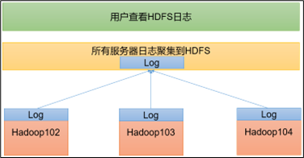
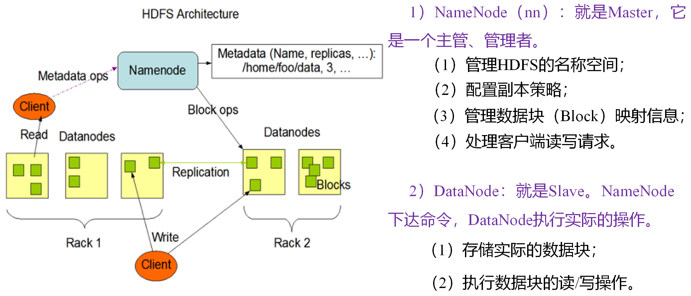
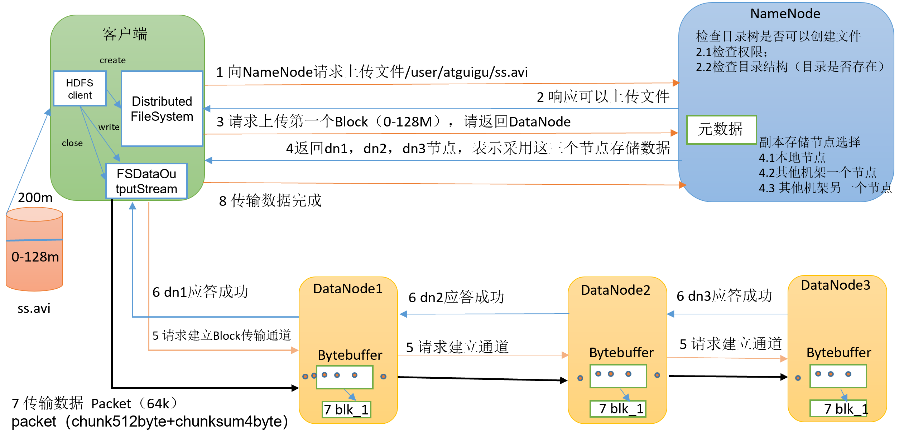
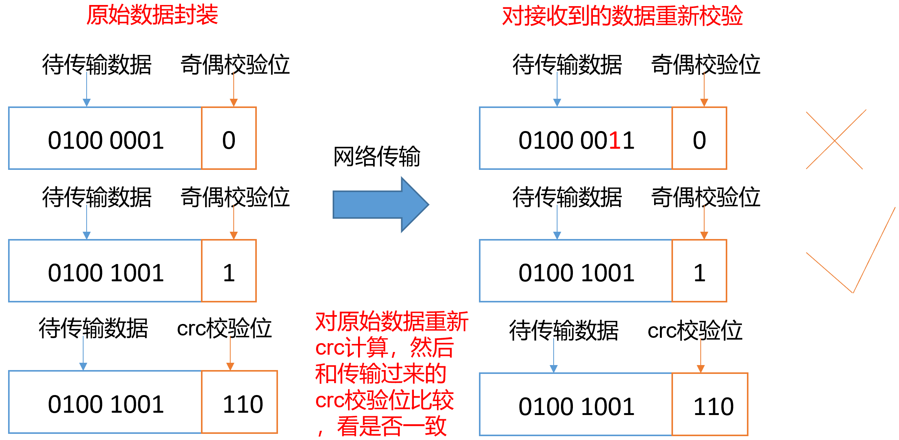
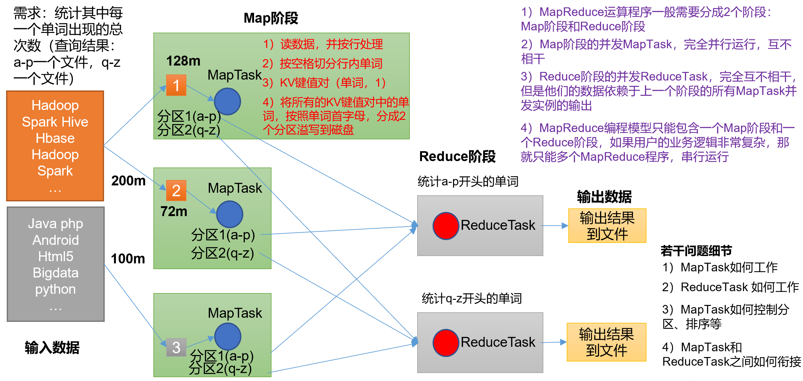
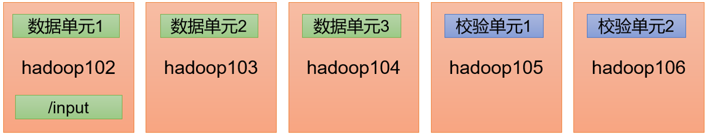
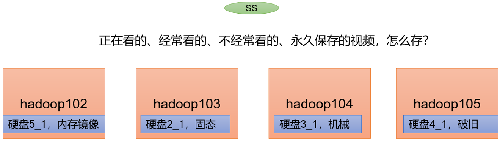
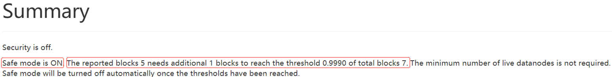

# 1 大数据概论

## 1.1 大数据概念

大数据（Big Data）：指无法在一定时间范围内用常规软件工具进行捕捉、管理和处理的数据集合，是需要新处理模式才能具有更强的决策力、洞察发现力和流程优化能力的海量、高增长和多样化的信息资产。

- 大数据主要解决的问题

海量数据的采集、存储和分析计算问题

- 数据存储单位：bit、Byte、KB、MB、GB、TB、PB、EB、ZB、YB、BB、NB、DB

1Byte=8bit、1K=1024Byte、1MB=1024K、1G=1024M、1T=1024G、1P=1024T

## 1.2 大数据特点（4V）

 目前来说，大数据的特征还存在一定的争议。但按照普遍被接受的4V，即规模性（volume）、多样性（variety）、价值密度（value）和 高速性（velocity）进行描述。

1. 数据量大（volume）

> 非结构化数据的超大规模增长导致数据集合的规模不断扩大，数据单位已经从GB级到TB级再到PB级，甚至开始以EB和ZB来计数。

2. 类型繁多（variety）

>  大数据的类型不仅包括网络日志等结构化数据，音频、视频、图片、地理位置信息等非结构化数据，甚至还包括半结构化数据，都具有异构性和多样性的特点。

3. 价值密度低（value）

>  大数据价值密度相对较低。如随着物联网的广泛应用，信息感知无处不在，信息海量，但价值密度较低，存在大量不相关信息。因此需要对未来趋势与模式作可预测分析，利用机器学习、人工智能等进行深度复杂分析。而如何通过强大的机器算法更迅速地完成数据的价值提炼，是大数据时代亟待解决的难题。虽然单位数据的价值密度在不断降低，但是数据的整体价值在提高。

4. 速度快时效高（velocity）

> 处理速度快，时效性要求高。需要实时分析而非批量式分析，数据的输入、处理和分析连贯性地处理，这是大数据区分于传统数据挖掘最显著的特征。

## 1.3 大数据部门内组织结构


# 2 Hadoop概述

## 2.1 Hadoop是什么

1. Hadoop是一个由Apache基金会所开发的  分布式系统基础架构  
2. 主要解决的问题：海量数据的==**存储**==和海量数据的分析==**计算**==问题
3. 广义上来说，Hadoop通常是指一个更为广泛的概念--  Hadoop生态圈  
4. 


## 2.2 Hadoop的优势

1. **高可靠性**：Hadoop按位存储和处理数据的能力值得人们信赖。Hadoop底层维护多个数据副本，所以即使Hadoop某个计算元素或存储出现故障，也不会导致数据的丢失
2. **高扩展性**：Hadoop是在可用的计算机集簇间分配数据并完成计算任务的，这些集簇可以方便地扩展到数以千计的节点中。
3. **高效性**：Hadoop能够在节点之间动态地移动数据，并保证各个节点的动态平衡，因此处理速度非常快。在MapReduce的思想下，Hadoop是并行工作的，以加快任务处理速度
4. **高容错性**：Hadoop能够自动保存数据的多个副本，并且能够自动将失败的任务重新分配。

## 2.3 HDFS架构概述

Hadoop Distributed File System，简称HDFS，是一个  分布式文件存储系统  

- NameNode(nn)：存储文件的元数据，如文件名，文件目录结构，文件属性（生成时间，副本数、文件权限等），以及每个文件的块列表和块所在的DataNode等。
- DataNode(dn)：在本地文件系统存储文件块数据，以及块数据的校验和【存储真实数据】
- SecondaryNameNode(2nn)：每隔一段时间对NameNode元数据备份

## 2.4 YARN架构概述

Yet Another Resource Negotiator简称YARN，另一种资源协调者，是Hadoop的资源管理器。

- ResourceManager(RM)：整个集群资源【内存、CPU等】的老大
- NodeManager(NM)：单个节点服务器资源老大
- ApplicationMaster(AM)：单个任务运行的老大
- Container：容器，相当于一台独立的服务器，里面封装了任务所需要的资源，如内存、CPU、磁盘、网络等。


## 2.5 MapReduce架构概述

MapReduce将计算过程分为两个阶段：Map和Reduce

- Map阶段并行处理输入数据
- Reduce阶段对Map结果进行汇总

## 2.6 大数据技术生态体系


## 2.7 Hadoop的目录结构

| 目录      | 说明                                                        |
| --------- | ----------------------------------------------------------- |
| bin目录   | 存放对Hadoop相关服务（hdfs、yarn、mapreduce）进行操作的脚本 |
| etc目录   | Hadoop的配置文件目录，存放Hadoop的配置文件                  |
| lib目录   | 存放Hadoop的本地库（对数据进行压缩解压功能）                |
| sbin目录  | 存放启动或停止Hadoop相关服务的脚本                          |
| share目录 | 存放Hadoop的依赖jar包、文档和官方案例                       |

## 2.8 Hadoop运行模式

三种模式：本地模式、伪分布式模式、完全分布式模式

- 本地模式：单机运行，只是用来演示官方案例，生成环境不用
- 伪分布式模式：也是单机运行，但是具备Hadoop集群的所有功能，一台服务器模拟一个分布式的环境。
- 完全分布式模式：多态服务器组成分布式环境。

## 2.9 免密登录原理


| 文件名称        | 含义                                     |
| --------------- | ---------------------------------------- |
| known_hosts     | 记录ssh访问过计算机的公钥（public  key） |
| id_rsa          | 生成的私钥                               |
| id_rsa.pub      | 生成的公钥                               |
| authorized_keys | 存放授权过的无密登录服务器公钥           |

## 2.10 集群启动注意点

- 如果集群是第一次启动，需要在master节点格式化NameNode

  - 注意：格式化NameNode，会产生新的集群id，导致NameNode和DataNode的集群id不一致，集群找不到已往数据。

  - 如果集群在运行过程中报错，需要重新格式化NameNode的话，一定要先停止namenode和datanode进程，并且要删除所有机器的data和logs目录，然后再进行格式化。

## 2.11 日志的聚集

日志聚集概念：应用运行完成以后，将程序运行日志信息上传到HDFS系统上。



日志聚集功能好处：可以方便的查看到程序运行详情，方便开发调试。

注意：开启日志聚集功能，需要重新启动NodeManager 、ResourceManager和HistoryServer。

-   配置yarn-site.xml  ，在该文件里添加如下配置：

```sh
在该文件里面增加如下配置。
<!-- 开启日志聚集功能 -->
<property>
    <name>yarn.log-aggregation-enable</name>
    <value>true</value>
</property>
<!-- 设置日志聚集服务器地址 -->
<property>  
    <name>yarn.log.server.url</name>  
    <value>http://hadoop102:19888/jobhistory/logs</value>
</property>
<!-- 设置日志保留时间为7天 -->
<property>
    <name>yarn.log-aggregation.retain-seconds</name>
    <value>604800</value>
</property>
```

## 2.12 Hadoop的常用端口号说明

| 端口名称                  | Hadoop2.x   | Hadoop3.x         |
| ------------------------- | ----------- | ----------------- |
| NameNode内部通信端口      | 8020 / 9000 | 8020 /  9000/9820 |
| NameNode HTTP UI          | 50070       | 9870              |
| MapReduce查看执行任务端口 | 8088        | 8088              |
| 历史服务器通信端口        | 19888       | 19888             |

# 3 Hadoop之HDFS

## 3.1 HDFS概述

### 3.1.1 HDFS产出背景及定义

1）HDFS产生背景

随着数据量越来越大，在一个操作系统存不下所有的数据，那么就分配到更多的操作系统管理的磁盘中，但是不方便管理和维护，迫切需要一种系统来管理多台机器上的文件，这就是分布式文件管理系统。HDFS只是分布式文件管理系统中的一种。

2）HDFS定义

HDFS（Hadoop Distributed File System），它是一个文件系统，用于存储文件，通过目录树来定位文件；其次，它是分布式的，由很多服务器联合起来实现其功能，集群中的服务器有各自的角色。

HDFS的使用场景：适合一次写入，多次读出的场景。一个文件经过创建、写入和关闭之后就不需要改变。

### 3.1.2 HDFS优缺点

- HDFS优点


- HDFS缺点


### 3.1.3 HDFS组成架构




### 3.1.4 HDFS文件块大小（面试重点）


## 3.2 HDFS的Shell操作（开发重点）

### 3.2.1 基本语法

hadoop fs 具体命令 OR hdfs dfs 具体命令，两个是完全相同的。

### 3.2.2 命令大全

```shell
bin/hadoop fs
[-appendToFile <localsrc> ... <dst>]
     [-cat [-ignoreCrc] <src> ...]
     [-chgrp [-R] GROUP PATH...]
     [-chmod [-R] <MODE[,MODE]... | OCTALMODE> PATH...]
     [-chown [-R] [OWNER][:[GROUP]] PATH...]
     [-copyFromLocal [-f] [-p] <localsrc> ... <dst>]
     [-copyToLocal [-p] [-ignoreCrc] [-crc] <src> ... <localdst>]
     [-count [-q] <path> ...]
     [-cp [-f] [-p] <src> ... <dst>]
     [-df [-h] [<path> ...]]
     [-du [-s] [-h] <path> ...]
     [-get [-p] [-ignoreCrc] [-crc] <src> ... <localdst>]
     [-getmerge [-nl] <src> <localdst>]
     [-help [cmd ...]]
     [-ls [-d] [-h] [-R] [<path> ...]]
     [-mkdir [-p] <path> ...]
     [-moveFromLocal <localsrc> ... <dst>]
     [-moveToLocal <src> <localdst>]
     [-mv <src> ... <dst>]
     [-put [-f] [-p] <localsrc> ... <dst>]
     [-rm [-f] [-r|-R] [-skipTrash] <src> ...]
     [-rmdir [--ignore-fail-on-non-empty] <dir> ...]
<acl_spec> <path>]]
     [-setrep [-R] [-w] <rep> <path> ...]
     [-stat [format] <path> ...]
     [-tail [-f] <file>]
     [-test -[defsz] <path>]
     [-text [-ignoreCrc] <src> ...]
```

### 3.2.3 常用命令实操

1）启动Hadoop集群

```shell
sbin/start-dfs.sh
sbin/start-yarn.sh
```

2）-help：输出这个命令参数

```shell
hadoop fs -help rm
```

3）创建/sanguo文件夹

```shell
hadoop fs -mkdir /sanguo
```

4）上传

- -moveFromLocal：从本地剪切粘贴到HDFS

```shell
hadoop fs -moveFromLocal ./shuguo.txt /sanguo
```

- -copyFromLocal：从本地文件系统中拷贝文件到HDFS路径去

```shell
hadoop fs -copyFromLocal weiguo.txt /sanguo
```

- -put：等同于copyFromLocal，生产环境更习惯用put

```shell
hadoop fs -put ./wuguo.txt /sanguo
```

- -appendToFile：追加一个文件到已经存在的文件末尾

```shell
hadoop fs -appendToFile liubei.txt /sanguo/shuguo.txt
```

5）下载

- -copyToLocal：从HDFS拷贝到本地

```shell
hadoop fs -copyToLocal /sanguo/shuguo.txt ./
```

- -get：等同于copyToLocal，生产环境更习惯用get

```shell
hadoop fs -get /sanguo/shuguo.txt ./shuguo2.txt
```

6）HDFS直接操作

- -ls: 显示目录信息

```shell
hadoop fs -ls /sanguo
```

- -cat：显示文件内容

```shell
hadoop fs -cat /sanguo/shuguo.txt
```

- -chgrp、-chmod、-chown：Linux文件系统中的用法一样，修改文件所属权限

```shell
 hadoop fs -chmod 666 /sanguo/shuguo.txt
 hadoop fs -chown atguigu:atguigu  /sanguo/shuguo.txt
```

- -mkdir：创建路径

```shell
hadoop fs -mkdir /jinguo
```

- -cp：从HDFS的一个路径拷贝到HDFS的另一个路径

```shell
hadoop fs -cp /sanguo/shuguo.txt /jinguo
```

- -mv：在HDFS目录中移动文件

```shell
hadoop fs -mv /sanguo/wuguo.txt /jinguo
hadoop fs -mv /sanguo/weiguo.txt /jinguo
```

- -tail：显示一个文件的末尾1kb的数据

```shell
hadoop fs -tail /jinguo/shuguo.txt
```

- -rm：删除文件或文件夹

```shell
hadoop fs -rm /sanguo/shuguo.txt
```

- -rm -r：递归删除目录及目录里面内容

```shell
hadoop fs -rm -r /sanguo
```

- -du统计文件夹的大小信息

```shell
hadoop fs -du -s -h /jinguo
#27 81 /jinguo
hadoop fs -du -h /jinguo
#14 42 /jinguo/shuguo.txt
#7  21  /jinguo/weiguo.txt
#6  18  /jinguo/wuguo.tx
```

​    说明：27表示文件大小；81表示27 3个副本；/jinguo表示查看的目录

- -setrep：设置HDFS中文件的副本数量

```shell
hadoop fs -setrep 10 /jinguo/shuguo.txt     
```


这里设置的副本数只是记录在NameNode的元数据中，是否真的会有这么多副本，还得看DataNode的数量。因为目前只有3台设备，最多也就3个副本，只有节点数的增加到10台时，副本数才能达到10。

## 3.3 HDFS的API操作

### 3.3.1 客户端环境准备

1）找到资料包路径下的Windows依赖文件夹，拷贝hadoop-3.1.0到非中文路径（比如d:\）。

2）配置HADOOP_HOME环境变量

​     

3）配置Path环境变量。

  注意：如果环境变量不起作用，可以重启电脑试试。  


验证Hadoop环境变量是否正常。双击winutils.exe，如果报如下错误。说明缺少微软运行库（正版系统往往有这个问题）。再资料包里面有对应的微软运行库安装包双击安装即可。

 

4）在IDEA中创建一个Maven工程HdfsClientDemo，并导入相应的依赖坐标+日志添加

```xml
<dependencies>
  <dependency>
   <groupId>org.apache.hadoop</groupId>
   <artifactId>hadoop-client</artifactId>
   <version>3.1.3</version>
  </dependency>
  <dependency>
   <groupId>junit</groupId>
   <artifactId>junit</artifactId>
   <version>4.12</version>
  </dependency>
  <dependency>
    <groupId>org.slf4j</groupId>
    <artifactId>slf4j-log4j12</artifactId>
   <version>1.7.30</version>
  </dependency>
</dependencies>
```

在项目的src/main/resources目录下，新建一个文件，命名为“log4j.properties”，在文件中填入

```properties
log4j.rootLogger=INFO, stdout 
log4j.appender.stdout=org.apache.log4j.ConsoleAppender 
log4j.appender.stdout.layout=org.apache.log4j.PatternLayout 
log4j.appender.stdout.layout.ConversionPattern=%d %p [%c] - %m%n 
log4j.appender.logfile=org.apache.log4j.FileAppender 
log4j.appender.logfile.File=target/spring.log 
log4j.appender.logfile.layout=org.apache.log4j.PatternLayout 
log4j.appender.logfile.layout.ConversionPattern=%d %p [%c] - %m%n
```

5）创建包名：com.atguigu.hdfs

6）创建HdfsClient类

```java
public class HdfsClient {
  @Test
  public void testMkdirs() throws IOException, URISyntaxException, InterruptedException {
      // 1 获取文件系统
      Configuration configuration = new Configuration();
      // FileSystem fs = FileSystem.get(new URI("hdfs://hadoop102:8020"), configuration);
      FileSystem fs = FileSystem.get(new URI("hdfs://hadoop102:8020")
                                     configuration,"atguigu");
      // 2 创建目录
      fs.mkdirs(new Path("/xiyou/huaguoshan/"));
      // 3 关闭资源
      fs.close();
  }
}
```

7）执行程序

客户端去操作HDFS时，是有一个用户身份的。默认情况下，HDFS客户端API会从采用Windows默认用户访问HDFS，会报权限异常错误。所以在访问HDFS时，一定要配置用户。

```java
org.apache.hadoop.security.AccessControlException: Permission denied: user=56576, access=WRITE, inode="/xiyou/huaguoshan":atguigu:supergroup:drwxr-xr-x
```

## 3.4 HDFS的API案例实操

### 3.4.1 HDFS文件上传（测试参数优先级）

1）编写源代码

```java
@Test
public void testCopyFromLocalFile() throws IOException, InterruptedException, URISyntaxException {
  // 1 获取文件系统
  Configuration configuration = new Configuration();
  configuration.set("dfs.replication", "2");
  FileSystem fs = FileSystem.get(new URI("hdfs://hadoop102:8020"), configuration, "atguigu");
  // 2 上传文件
  fs.copyFromLocalFile(new Path("d:/sunwukong.txt"), new Path("/xiyou/huaguoshan"));
  // 3 关闭资源
  fs.close();
｝
```

2）将hdfs-site.xml拷贝到项目的resources资源目录下

```xml
<?xml version="1.0" encoding="UTF-8"?>
<?xml-stylesheet type="text/xsl" href="configuration.xsl"?>
<configuration>
  <property>
      <name>dfs.replication</name>
      <value>1</value>
  </property>
</configuration>
```

3）参数优先级

参数优先级排序：（1）客户端代码中设置的值 >（2）ClassPath下的用户自定义配置文件 >（3）然后是服务器的自定义配置（xxx-site.xml） >（4）服务器的默认配置（xxx-default.xml）

### 3.4.2 HDFS文件下载

```java
@Test
public void testCopyToLocalFile() throws IOException, InterruptedException, URISyntaxException{
  // 1 获取文件系统
  Configuration configuration = new Configuration();
  FileSystem fs = FileSystem.get(new URI("hdfs://hadoop102:8020"), configuration, "atguigu");
  // 2 执行下载操作
  // boolean delSrc 指是否将原文件删除
  // Path src 指要下载的文件路径
  // Path dst 指将文件下载到的路径
  // boolean useRawLocalFileSystem 是否开启文件校验
  fs.copyToLocalFile(false, new Path("/xiyou/huaguoshan/sunwukong.txt"), new Path("d:/sunwukong2.txt"), true);
  // 3 关闭资源
  fs.close();
}
```

注意：如果执行上面代码，下载不了文件，有可能是你电脑的微软支持的运行库少，需要安装一下微软运行库。

### 3.4.3 HDFS文件更名和移动

```java
@Test
public void testRename() throws IOException, InterruptedException, URISyntaxException{
  // 1 获取文件系统
  Configuration configuration = new Configuration();
  FileSystem fs = FileSystem.get(new URI("hdfs://hadoop102:8020"), configuration, "atguigu"); 
  // 2 修改文件名称
  fs.rename(new Path("/xiyou/huaguoshan/sunwukong.txt"), new Path("/xiyou/huaguoshan/meihouwang.txt"));
  // 3 关闭资源
  fs.close();
}
```

### 3.4.4 HDFS删除文件和目录

```java
@Test
public void testDelete() throws IOException, InterruptedException, URISyntaxException{
  // 1 获取文件系统
  Configuration configuration = new Configuration();
  FileSystem fs = FileSystem.get(new URI("hdfs://hadoop102:8020"), configuration, "atguigu");
  // 2 执行删除
  fs.delete(new Path("/xiyou"), true);
  // 3 关闭资源
  fs.close();
}
```

### 3.4.5 HDFS文件详情查看

查看文件名称、权限、长度、块信息

```java
@Test
public void testListFiles() throws IOException, InterruptedException, URISyntaxException {
 // 1获取文件系统
 Configuration configuration = new Configuration();
 FileSystem fs = FileSystem.get(new URI("hdfs://hadoop102:8020"), configuration, "atguigu");
 // 2 获取文件详情
 RemoteIterator<LocatedFileStatus> listFiles = fs.listFiles(new Path("/"), true);
 while (listFiles.hasNext()) {
     LocatedFileStatus fileStatus = listFiles.next();
     System.out.println("==" + fileStatus.getPath() + "=");
     System.out.println(fileStatus.getPermission());
     System.out.println(fileStatus.getOwner());
     System.out.println(fileStatus.getGroup());
     System.out.println(fileStatus.getLen());
     System.out.println(fileStatus.getModificationTime());
     System.out.println(fileStatus.getReplication());
     System.out.println(fileStatus.getBlockSize());
     System.out.println(fileStatus.getPath().getName());
     // 获取块信息
     BlockLocation[] blockLocations = fileStatus.getBlockLocations();
     System.out.println(Arrays.toString(blockLocations));
 }
    // 3 关闭资源
    fs.close();
}
```

### 3.4.6 HDFS文件和文件夹判断

```java
@Test
public void testListStatus() throws IOException, InterruptedException, URISyntaxException{
    // 1 获取文件配置信息
    Configuration configuration = new Configuration();
    FileSystem fs = FileSystem.get(new URI("hdfs://hadoop102:8020"), configuration, "atguigu");
    // 2 判断是文件还是文件夹
    FileStatus[] listStatus = fs.listStatus(new Path("/"));
    for (FileStatus fileStatus : listStatus) {
        // 如果是文件
        if (fileStatus.isFile()) {
            System.out.println("f:"+fileStatus.getPath().getName());
        }else {
            System.out.println("d:"+fileStatus.getPath().getName());
        }
    }
    // 3 关闭资源
    fs.close();
}
```

## 3.5 HDFS的写数据流程（面试重点）

### 3.5.1 剖析文件写入



（1）客户端通过Distributed FileSystem模块向NameNode请求上传文件，NameNode检查目标文件是否已存在，父目录是否存在。

（2）NameNode返回是否可以上传。

（3）客户端请求第一个 Block上传到哪几个DataNode服务器上。

（4）NameNode返回3个DataNode节点，分别为dn1、dn2、dn3。

（5）客户端通过FSDataOutputStream模块请求dn1上传数据，dn1收到请求会继续调用dn2，然后dn2调用dn3，将这个通信管道建立完成。

（6）dn1、dn2、dn3逐级应答客户端。

（7）客户端开始往dn1上传第一个Block（先从磁盘读取数据放到一个本地内存缓存），以Packet为单位，dn1收到一个Packet就会传给dn2，dn2传给dn3；dn1每传一个packet会放入一个应答队列等待应答。

（8）当一个Block传输完成之后，客户端再次请求NameNode上传第二个Block的服务器。（重复执行3-7步）。

### 3.5.2 网络拓扑-节点距离计算

 在HDFS写数据的过程中，NameNode会选择距离待上传数据最近距离的DataNode接收数据。那么这个最近距离怎么计算呢？

节点距离：两个节点到达最近的共同祖先的距离总和。


例如，假设有数据中心d1机架r1中的节点n1。该节点可以表示为/d1/r1/n1。利用这种标记，这里给出四种距离描述。

大家算一算每两个节点之间的距离。

  

### 3.5.3 机架感知（副本存储节点选择）

1）机架感知说明

（1）官方说明：http://hadoop.apache.org/docs/r3.1.3/hadoop-project-dist/hadoop-hdfs/HdfsDesign.html#Data_Replication

For the common case, when the replication factor is three, HDFS’s placement policy is to put one replica on the local machine if the writer is on a datanode, otherwise on a random datanode, another replica on a node in a different (remote) rack, and the last on a different node in the same remote rack. This policy cuts the inter-rack write traffic which generally improves write performance. The chance of rack failure is far less than that of node failure; this policy does not impact data reliability and availability guarantees. However, it does reduce the aggregate network bandwidth used when reading data since a block is placed in only two unique racks rather than three. With this policy, the replicas of a file do not evenly distribute across the racks. One third of replicas are on one node, two thirds of replicas are on one rack, and the other third are evenly distributed across the remaining racks. This policy improves write performance without compromising data reliability or read performance.

（2）源码说明

Crtl + n 查找BlockPlacementPolicyDefault，在该类中查找chooseTargetInOrder方法。

2）Hadoop3.1.3副本节点选择

 

## 3.6 HDFS读数据流程


（1）客户端通过DistributedFileSystem向NameNode请求下载文件，NameNode通过查询元数据，找到文件块所在的DataNode地址。

（2）挑选一台DataNode（就近原则，然后随机）服务器，请求读取数据。

（3）DataNode开始传输数据给客户端（从磁盘里面读取数据输入流，以Packet为单位来做校验）。

（4）客户端以Packet为单位接收，先在本地缓存，然后写入目标文件。

## 3.7 NameNode和SecondaryNameNode

### 3.7.1 NN和2NN工作机制

思考：NameNode中的元数据是存储在哪里的？

首先，我们做个假设，如果存储在NameNode节点的磁盘中，因为经常需要进行随机访问，还有响应客户请求，必然是效率过低。因此，元数据需要存放在内存中。但如果只存在内存中，一旦断电，元数据丢失，整个集群就无法工作了。因此产生在磁盘中备份元数据的FsImage。

这样又会带来新的问题，当在内存中的元数据更新时，如果同时更新FsImage，就会导致效率过低，但如果不更新，就会发生一致性问题，一旦NameNode节点断电，就会产生数据丢失。因此，引入Edits文件（只进行追加操作，效率很高）。每当元数据有更新或者添加元数据时，修改内存中的元数据并追加到Edits中。这样，一旦NameNode节点断电，可以通过FsImage和Edits的合并，合成元数据。

但是，如果长时间添加数据到Edits中，会导致该文件数据过大，效率降低，而且一旦断电，恢复元数据需要的时间过长。因此，需要定期进行FsImage和Edits的合并，如果这个操作由NameNode节点完成，又会效率过低。因此，引入一个新的节点SecondaryNamenode，专门用于FsImage和Edits的合并。

- NameNode工作机制


1）第一阶段：NameNode启动

（1）第一次启动NameNode格式化后，创建Fsimage和Edits文件。如果不是第一次启动，直接加载编辑日志和镜像文件到内存。

（2）客户端对元数据进行增删改的请求。

（3）NameNode记录操作日志，更新滚动日志。

（4）NameNode在内存中对元数据进行增删改。

2）第二阶段：Secondary NameNode工作

（1）Secondary NameNode询问NameNode是否需要CheckPoint。直接带回NameNode是否检查结果。

（2）Secondary NameNode请求执行CheckPoint。

（3）NameNode滚动正在写的Edits日志。

（4）将滚动前的编辑日志和镜像文件拷贝到Secondary NameNode。

（5）Secondary NameNode加载编辑日志和镜像文件到内存，并合并。

（6）生成新的镜像文件fsimage.chkpoint。

（7）拷贝fsimage.chkpoint到NameNode。

（8）NameNode将fsimage.chkpoint重新命名成fsimage。

### 3.7.2 Fsimage和Edits解析

- Fsimage和Edits概念


  注意：  Edits文件体现了HDFS的最新状态

1）oiv查看Fsimage文件

（1）查看oiv和oev命令

```shell
hdfs
#oiv      apply the offline fsimage viewer to an fsimage
#oev      apply the offline edits viewer to an edits file
```

（2）基本语法

hdfs oiv -p 文件类型 -i镜像文件 -o 转换后文件输出路径

（3）案例实操

```shell
pwd
#/opt/module/hadoop-3.1.3/data/dfs/name/current
hdfs oiv -p XML -i fsimage_0000000000000000025 -o /opt/module/hadoop-3.1.3/fsimage.xml
cat /opt/module/hadoop-3.1.3/fsimage.xml
```

将显示的xml文件内容拷贝到Idea中创建的xml文件中，并格式化。部分显示结果如下。

```xml
<inode>
    <id>16386</id>
    <type>DIRECTORY</type>
    <name>user</name>
    <mtime>1512722284477</mtime>
    <permission>atguigu:supergroup:rwxr-xr-x</permission>
    <nsquota>-1</nsquota>
    <dsquota>-1</dsquota>
</inode>
<inode>
    <id>16387</id>
    <type>DIRECTORY</type>
    <name>atguigu</name>
    <mtime>1512790549080</mtime>
    <permission>atguigu:supergroup:rwxr-xr-x</permission>
    <nsquota>-1</nsquota>
    <dsquota>-1</dsquota>
</inode>
<inode>
    <id>16389</id>
    <type>FILE</type>
    <name>wc.input</name>
    <replication>3</replication>
    <mtime>1512722322219</mtime>
    <atime>1512722321610</atime>
    <perferredBlockSize>134217728</perferredBlockSize>
    <permission>atguigu:supergroup:rw-r--r--</permission>
    <blocks>
        <block>
            <id>1073741825</id>
            <genstamp>1001</genstamp>
            <numBytes>59</numBytes>
        </block>
    </blocks>
</inode >
```

思考：可以看出，Fsimage中没有记录块所对应DataNode，为什么？

在集群启动后，要求DataNode上报数据块信息，并间隔一段时间后再次上报。

2）oev查看Edits文件

（1）基本语法

hdfs oev -p 文件类型 -i编辑日志 -o 转换后文件输出路径

（2）案例实操

```shell
hdfs oev -p XML -i edits_0000000000000000012-0000000000000000013 -o /opt/module/hadoop-3.1.3/edits.xml
cat /opt/module/hadoop-3.1.3/edits.xml
```

将显示的xml文件内容拷贝到Idea中创建的xml文件中，并格式化。显示结果如下。

```xml
<?xml version="1.0" encoding="UTF-8"?>
<EDITS>
    <EDITS_VERSION>-63</EDITS_VERSION>
    <RECORD>
        <OPCODE>OP_START_LOG_SEGMENT</OPCODE>
        <DATA>
            <TXID>129</TXID>
        </DATA>
    </RECORD>
    <RECORD>
        <OPCODE>OP_ADD</OPCODE>
        <DATA>
            <TXID>130</TXID>
            <LENGTH>0</LENGTH>
            <INODEID>16407</INODEID>
            <PATH>/hello7.txt</PATH>
            <REPLICATION>2</REPLICATION>
            <MTIME>1512943607866</MTIME>
            <ATIME>1512943607866</ATIME>
            <BLOCKSIZE>134217728</BLOCKSIZE>
            <CLIENT_NAME>DFSClient_NONMAPREDUCE_-1544295051_1</CLIENT_NAME>
            <CLIENT_MACHINE>192.168.10.102</CLIENT_MACHINE>
            <OVERWRITE>true</OVERWRITE>
            <PERMISSION_STATUS>
                <USERNAME>atguigu</USERNAME>
                <GROUPNAME>supergroup</GROUPNAME>
                <MODE>420</MODE>
            </PERMISSION_STATUS>
            <RPC_CLIENTID>908eafd4-9aec-4288-96f1-e8011d181561</RPC_CLIENTID>
            <RPC_CALLID>0</RPC_CALLID>
        </DATA>
    </RECORD>
    <RECORD>
        <OPCODE>OP_ALLOCATE_BLOCK_ID</OPCODE>
        <DATA>
            <TXID>131</TXID>
            <BLOCK_ID>1073741839</BLOCK_ID>
        </DATA>
    </RECORD>
    <RECORD>
        <OPCODE>OP_SET_GENSTAMP_V2</OPCODE>
        <DATA>
            <TXID>132</TXID>
            <GENSTAMPV2>1016</GENSTAMPV2>
        </DATA>
    </RECORD>
    <RECORD>
        <OPCODE>OP_ADD_BLOCK</OPCODE>
        <DATA>
            <TXID>133</TXID>
            <PATH>/hello7.txt</PATH>
            <BLOCK>
                <BLOCK_ID>1073741839</BLOCK_ID>
                <NUM_BYTES>0</NUM_BYTES>
                <GENSTAMP>1016</GENSTAMP>
            </BLOCK>
            <RPC_CLIENTID></RPC_CLIENTID>
            <RPC_CALLID>-2</RPC_CALLID>
        </DATA>
    </RECORD>
    <RECORD>
        <OPCODE>OP_CLOSE</OPCODE>
        <DATA>
            <TXID>134</TXID>
            <LENGTH>0</LENGTH>
            <INODEID>0</INODEID>
            <PATH>/hello7.txt</PATH>
            <REPLICATION>2</REPLICATION>
            <MTIME>1512943608761</MTIME>
            <ATIME>1512943607866</ATIME>
            <BLOCKSIZE>134217728</BLOCKSIZE>
            <CLIENT_NAME></CLIENT_NAME>
            <CLIENT_MACHINE></CLIENT_MACHINE>
            <OVERWRITE>false</OVERWRITE>
            <BLOCK>
                <BLOCK_ID>1073741839</BLOCK_ID>
                <NUM_BYTES>25</NUM_BYTES>
                <GENSTAMP>1016</GENSTAMP>
            </BLOCK>
            <PERMISSION_STATUS>
                <USERNAME>atguigu</USERNAME>
                <GROUPNAME>supergroup</GROUPNAME>
                <MODE>420</MODE>
            </PERMISSION_STATUS>
        </DATA>
    </RECORD>
</EDITS >
```

思考：NameNode如何确定下次开机启动的时候合并哪些Edits？

### 3.7.3 CheckPoint的工作流程与时间设置

**工作流程**


- （1）SecondaryNameNode 通知Name Node切换edits文件，NameNode生成一个名叫edits.new的文件，用于记录合并过程中产生的日志信息；
- （2）SecondaryNameNode将edits文件. 与fsimage文件从NameNode上下载到SecondaryNameNode上；
- （3）SecondaryNameNode将edits文件与fsimage进行合并操作，合并成一个fsimage.ckpt文件；
- （4）SecondaryNameNode将生成的合并后的文件fsimage.ckpt文件上传到NameNode上；
- （5）在NameNode上，将fsimage.ckpt变成fsimage文件替换NameNode上原有的fsimage文件。将edits.new文件上变成edits文件替换NameNode上原有的edits文件

**时间设置**

1）通常情况下，SecondaryNameNode每隔一小时执行一次。

 [hdfs-default.xml]

```xml
<property>
    <name>dfs.namenode.checkpoint.period</name>
    <value>3600s</value>
</property>
```

2）一分钟检查一次操作次数，当操作次数达到1百万时，SecondaryNameNode执行一次。

```xml
<property>
    <name>dfs.namenode.checkpoint.txns</name>
    <value>1000000</value>
    <description>操作动作次数</description>
</property>
<property>
    <name>dfs.namenode.checkpoint.check.period</name>
    <value>60s</value>
    <description> 1分钟检查一次操作次数</description>
</property>
```

## 3.8 DataNode

### 3.8.1 DataNode工作机制


（1）一个数据块在DataNode上以文件形式存储在磁盘上，包括两个文件，一个是数据本身，一个是元数据包括数据块的长度，块数据的校验和，以及时间戳。

（2）DataNode启动后向NameNode注册，通过后，周期性（6小时）的向NameNode上报所有的块信息。

DN向NN汇报当前解读信息的时间间隔，默认6小时；

```xml
<property>
    <name>dfs.blockreport.intervalMsec</name>
    <value>21600000</value>
    <description>Determines block reporting interval in milliseconds.</description>
</property>
```

DN扫描自己节点块信息列表的时间，默认6小时

```xml
<property>
    <name>dfs.datanode.directoryscan.interval</name>
    <value>21600s</value>
    <description>Interval in seconds for Datanode to scan data directories and reconcile the difference between blocks in memory and on the disk.
  Support multiple time unit suffix(case insensitive), as described
  in dfs.heartbeat.interval.
    </description>
</property>
```

（3）心跳是每3秒一次，心跳返回结果带有NameNode给该DataNode的命令如复制块数据到另一台机器，或删除某个数据块。如果超过10分钟没有收到某个DataNode的心跳，则认为该节点不可用。

（4）集群运行中可以安全加入和退出一些机器。

### 3.8.2 数据完整性

思考：如果电脑磁盘里面存储的数据是控制高铁信号灯的红灯信号（1）和绿灯信号（0），但是存储该数据的磁盘坏了，一直显示是绿灯，是否很危险？同理DataNode节点上的数据损坏了，却没有发现，是否也很危险，那么如何解决呢？

如下是DataNode节点保证数据完整性的方法。

（1）当DataNode读取Block的时候，它会计算CheckSum。

（2）如果计算后的CheckSum，与Block创建时值不一样，说明Block已经损坏。

（3）Client读取其他DataNode上的Block。

（4）常见的校验算法crc（32），md5（128），sha1（160）

（5）DataNode在其文件创建后周期验证CheckSum。

- 数据完整性



### 3.8.3 掉线时限参数设置

- DataNode掉线时限参数设置


 需要注意的是hdfs-site.xml 配置文件中的heartbeat.recheck.interval的单位为毫秒，dfs.heartbeat.interval的单位为  秒  。

```xml
<property>
    <name>dfs.namenode.heartbeat.recheck-interval</name>
    <value>300000</value>
</property>
<property>
    <name>dfs.heartbeat.interval</name>
    <value>3</value>
</property>
```

# 4 Hadoop之MapReduce

## 4.1 MapReduce概述

### 4.1.1 MapReduce定义

MapReduce是一个分布式运算程序的编程框架，是用户开发“基于Hadoop的数据分析应用”的核心框架。

MapReduce核心功能是将用户编写的业务逻辑代码和自带默认组件整合成一个完整的分布式运算程序，并发运行在一个Hadoop集群上。

### 4.1.2 MapReduce优缺点

#### （1） 优点

1）MapReduce易于编程

它简单的实现一些接口，就可以完成一个分布式程序，这个分布式程序可以分布到大量廉价的PC机器上运行。也就是说你写一个分布式程序，跟写一个简单的串行程序是一模一样的。就是因为这个特点使得MapReduce编程变得非常流行。

2）良好的扩展性

当你的计算资源不能得到满足的时候，你可以通过简单的增加机器来扩展它的计算能力。

3）高容错性

MapReduce设计的初衷就是使程序能够部署在廉价的PC机器上，这就要求它具有很高的容错性。比如其中一台机器挂了，它可以把上面的计算任务转移到另外一个节点上运行，不至于这个任务运行失败，而且这个过程不需要人工参与，而完全是由Hadoop内部完成的。

4）适合PB级以上海量数据的离线处理

可以实现上千台服务器集群并发工作，提供数据处理能力。

#### （2） 缺点

1）不擅长实时计算

MapReduce无法像MySQL一样，在毫秒或者秒级内返回结果。

2）不擅长流式计算

流式计算的输入数据是动态的，而MapReduce的输入数据集是静态的，不能动态变化。这是因为MapReduce自身的设计特点决定了数据源必须是静态的。

3）不擅长DAG（有向无环图）计算

多个应用程序存在依赖关系，后一个应用程序的输入为前一个的输出。在这种情况下，MapReduce并不是不能做，而是使用后，每个MapReduce作业的输出结果都会写入到磁盘，会造成大量的磁盘IO，导致性能非常的低下。

### 4.1.3 MapReduce核心思想       



（1）分布式的运算程序往往需要分成至少2个阶段。

（2）第一个阶段的MapTask并发实例，完全并行运行，互不相干。

（3）第二个阶段的ReduceTask并发实例互不相干，但是他们的数据依赖于上一个阶段的所有MapTask并发实例的输出。

（4）MapReduce编程模型只能包含一个Map阶段和一个Reduce阶段，如果用户的业务逻辑非常复杂，那就只能多个MapReduce程序，串行运行。

总结：分析WordCount数据流走向深入理解MapReduce核心思想。

### 4.1.4 MapReduce进程

一个完整的MapReduce程序在分布式运行时有三类实例进程：

（1）  MrAppMaster  ：负责整个程序的过程调度及状态协调。

（2）  MapTask  ：负责Map阶段的整个数据处理流程。

（3）  ReduceTask  ：负责Reduce阶段的整个数据处理流程。

### 4.1.5 官方WordCount源码

采用反编译工具反编译源码，发现WordCount案例有Map类、Reduce类和驱动类。且数据的类型是Hadoop自身封装的序列化类型。

### 4.1.6 常用数据序列化类型

| Java    类型 | Hadoop Writable    类型 |
| ------------ | ----------------------- |
| Boolean      | BooleanWritable         |
| Byte         | ByteWritable            |
| Int          | IntWritable             |
| Float        | FloatWritable           |
| Long         | LongWritable            |
| Double       | DoubleWritable          |
| String       | Text                    |
| Map          | MapWritable             |
| Array        | ArrayWritable           |
| Null         | NullWritable            |

### 4.1.7 MapReduce编程规范

用户编写的程序分成三个部分：Mapper、Reducer和Driver。

 


### 4.1.8 WordCount案例实操

#### （1）本地测试

1）需求

在给定的文本文件中统计输出每一个单词出现的总次数

（1）输入数据


（2）期望输出数据

```sh
atguigu  2
banzhang 1
cls  2
hadoop  1
jiao 1
ss   2
xue 1
```

2）需求分析

按照MapReduce编程规范，分别编写Mapper，Reducer，Driver。


3）环境准备

（1）创建maven工程，MapReduceDemo

（2）在pom.xml文件中添加如下依赖

```xml
<dependencies>
    <dependency>
        <groupId>org.apache.hadoop</groupId>
        <artifactId>hadoop-client</artifactId>
        <version>3.1.3</version>
    </dependency>
    <dependency>
        <groupId>junit</groupId>
        <artifactId>junit</artifactId>
        <version>4.12</version>
    </dependency>
    <dependency>
        <groupId>org.slf4j</groupId>
        <artifactId>slf4j-log4j12</artifactId>
        <version>1.7.30</version>
    </dependency>
</dependencies>
```

（2）在项目的src/main/resources目录下，新建一个文件，命名为“log4j.properties”，在文件中填入。

```properties
log4j.rootLogger=INFO, stdout 
log4j.appender.stdout=org.apache.log4j.ConsoleAppender 
log4j.appender.stdout.layout=org.apache.log4j.PatternLayout 
log4j.appender.stdout.layout.ConversionPattern=%d %p [%c] - %m%n 
log4j.appender.logfile=org.apache.log4j.FileAppender 
log4j.appender.logfile.File=target/spring.log 
log4j.appender.logfile.layout=org.apache.log4j.PatternLayout 
log4j.appender.logfile.layout.ConversionPattern=%d %p [%c] - %m%n
```

（3）创建包名：com.atguigu.mapreduce.wordcount

4）编写程序

（1）编写Mapper类

```java
package com.atguigu.mapreduce.wordcount;
import java.io.IOException;
import org.apache.hadoop.io.IntWritable;
import org.apache.hadoop.io.LongWritable;
import org.apache.hadoop.io.Text;
import org.apache.hadoop.mapreduce.Mapper;
public class WordCountMapper extends Mapper<LongWritable, Text, Text, IntWritable>{
    Text k = new Text();
    IntWritable v = new IntWritable(1);
    @Override
    protected void map(LongWritable key, Text value, Context context)  throws IOException, InterruptedException {
        // 1 获取一行
        String line = value.toString();
        // 2 切割
        String[] words = line.split(" ");
        // 3 输出
        for (String word : words) {
            k.set(word);
            context.write(k, v);
        }
    }
}
```

（2）编写Reducer类

```java
package com.atguigu.mapreduce.wordcount;
import java.io.IOException;
import org.apache.hadoop.io.IntWritable;
import org.apache.hadoop.io.Text;
import org.apache.hadoop.mapreduce.Reducer;
public class WordCountReducer extends Reducer<Text, IntWritable, Text, IntWritable>{
    int sum;
    IntWritable v = new IntWritable();
    @Override
    protected void reduce(Text key, Iterable<IntWritable> values,Context context) throws IOException, InterruptedException {
        // 1 累加求和
        sum = 0;
        for (IntWritable count : values) {
            sum += count.get();
        }
        // 2 输出
        v.set(sum);
        context.write(key,v);
    }
}
```

（3）编写Driver驱动类

```java
package com.atguigu.mapreduce.wordcount;
import java.io.IOException;
import org.apache.hadoop.conf.Configuration;
import org.apache.hadoop.fs.Path;
import org.apache.hadoop.io.IntWritable;
import org.apache.hadoop.io.Text;
import org.apache.hadoop.mapreduce.Job;
import org.apache.hadoop.mapreduce.lib.input.FileInputFormat;
import org.apache.hadoop.mapreduce.lib.output.FileOutputFormat;
public class WordCountDriver {
    public static void main(String[] args) throws IOException, ClassNotFoundException, InterruptedException {
      // 1 获取配置信息以及获取job对象
      Configuration conf = new Configuration();
      Job job = Job.getInstance(conf);
      // 2 关联本Driver程序的jar
      job.setJarByClass(WordCountDriver.class);
      // 3 关联Mapper和Reducer的jar
      job.setMapperClass(WordCountMapper.class);
      job.setReducerClass(WordCountReducer.class);
      // 4 设置Mapper输出的kv类型
      job.setMapOutputKeyClass(Text.class);
      job.setMapOutputValueClass(IntWritable.class);
      // 5 设置最终输出kv类型
      job.setOutputKeyClass(Text.class);
      job.setOutputValueClass(IntWritable.class);
      // 6 设置输入和输出路径
      FileInputFormat.setInputPaths(job, new Path(args[0]));
      FileOutputFormat.setOutputPath(job, new Path(args[1]));
      // 7 提交job
      boolean result = job.waitForCompletion(true);
      System.exit(result ? 0 : 1);
  }    
}
```

5）本地测试

（1）需要首先配置好HADOOP_HOME变量以及Windows运行依赖

（2）在IDEA/Eclipse上运行程序

#### （2）提交到集群测试

  集群上测试  

（1）用maven打jar包，需要添加的打包插件依赖

```xml
<build>
    <plugins>
        <plugin>
            <artifactId>maven-compiler-plugin</artifactId>
            <version>3.6.1</version>
            <configuration>
                <source>1.8</source>
                <target>1.8</target>
            </configuration>
        </plugin>
        <plugin>
            <artifactId>maven-assembly-plugin</artifactId>
            <configuration>
                <descriptorRefs>
                    <descriptorRef>jar-with-dependencies</descriptorRef>
                </descriptorRefs>
            </configuration>
            <executions>
                <execution>
                    <id>make-assembly</id>
                    <phase>package</phase>
                    <goals>
                        <goal>single</goal>
                    </goals>
                </execution>
            </executions>
        </plugin> 
    </plugins>
</build>
```

注意：如果工程上显示红叉。在项目上右键->maven->Reimport刷新即可。

（2）将程序打成jar包

​     

（3）修改不带依赖的jar包名称为wc.jar，并拷贝该jar包到Hadoop集群的/opt/module/hadoop-3.1.3路径。

（4）启动Hadoop集群

```shell
sbin/start-dfs.sh
sbin/start-yarn.sh
```

（5）执行WordCount程序

```shell
hadoop jar wc.jar com.atguigu.mapreduce.wordcount.WordCountDriver /user/atguigu/input /user/atguigu/output
```

## 4.2 Hadoop序列化

### 4.2.1 序列化概述

1）  什么是序列化  

  序列化  就是把内存中的对象，转换成字节序列（或其他数据传输协议）以便于存储到磁盘（持久化）和网络传输。 

  反序列化  就是将收到字节序列（或其他数据传输协议）或者是磁盘的持久化数据，转换成内存中的对象。

2）  为什么要序列化  

一般来说，“活的”对象只生存在内存里，关机断电就没有了。而且“活的”对象只能由本地的进程使用，不能被发送到网络上的另外一台计算机。 然而序列化可以存储“活的”对象，可以将“活的”对象发送到远程计算机。

3）为什么不用Java的序列化

Java的序列化是一个重量级序列化框架（Serializable），一个对象被序列化后，会附带很多额外的信息（各种校验信息，Header，继承体系等），不便于在网络中高效传输。所以，Hadoop自己开发了一套序列化机制（Writable）。

4）Hadoop序列化特点：

（1）紧凑   ：  高效使用存储空间。

（2）快速：读写数据的额外开销小。

（3）互操作：支持多语言的交互

### 4.2.2 自定义bean对象实现序列化接口（Writable）

在企业开发中往往常用的基本序列化类型不能满足所有需求，比如在Hadoop框架内部传递一个bean对象，那么该对象就需要实现序列化接口。

具体实现bean对象序列化步骤如下7步。

（1）必须实现Writable接口

（2）反序列化时，需要反射调用空参构造函数，所以必须有空参构造

```java
public FlowBean() {
    super();
}
```

（3）重写序列化方法

```java
@Override
public void write(DataOutput out) throws IOException {
    out.writeLong(upFlow);
    out.writeLong(downFlow);
    out.writeLong(sumFlow);
}
```

（4）重写反序列化方法

```java
@Override
public void readFields(DataInput in) throws IOException {
    upFlow = in.readLong();
    downFlow = in.readLong();
    sumFlow = in.readLong();
}
```

（5）注意反序列化的顺序和序列化的顺序完全一致

（6）要想把结果显示在文件中，需要重写toString()，可用"\t"分开，方便后续用。

（7）如果需要将自定义的bean放在key中传输，则还需要实现Comparable接口，因为MapReduce框中的Shuffle过程要求对key必须能排序。详见后面排序案例。

```java
@Override
public int compareTo(FlowBean o) {
    // 倒序排列，从大到小
    return this.sumFlow > o.getSumFlow() ? -1 : 1;
}
```

### 4.2.3 序列化案例实操 

1）需求

统计每一个手机号耗费的总上行流量、总下行流量、总流量

（1）输入数据

 

（2）输入数据格式：

```sh
  7    13560436666   120.196.100.99      1116       954           200  id   手机号码      网络ip             上行流量  下行流量   网络状态码  
```

（3）期望输出数据格式

```sh
  13560436666         1116         954               2070  手机号码        上行流量     下行流量          总流量  
```

2）需求分析

 

3）编写MapReduce程序

（1）编写流量统计的Bean对象

```java
package com.atguigu.mapreduce.writable;
import org.apache.hadoop.io.Writable;
import java.io.DataInput;
import java.io.DataOutput;
import java.io.IOException;

//1 继承Writable接口
public class FlowBean implements Writable {
    private long upFlow; //上行流量
    private long downFlow; //下行流量
    private long sumFlow; //总流量
    //2 提供无参构造
    public FlowBean() {
    }
    //3 提供三个参数的getter和setter方法
    public long getUpFlow() {
        return upFlow;
    }
    public void setUpFlow(long upFlow) { 
        this.upFlow = upFlow;
    }
    public long getDownFlow() {
        return downFlow;
    }
    public void setDownFlow(long downFlow) {
        this.downFlow = downFlow;
    }
    public long getSumFlow() {
        return sumFlow;
    }
    public void setSumFlow(long sumFlow) {
        this.sumFlow = sumFlow;
    }
    public void setSumFlow() {
        this.sumFlow = this.upFlow + this.downFlow;
    }
    //4 实现序列化和反序列化方法,注意顺序一定要保持一致
    @Override
    public void write(DataOutput dataOutput) throws IOException {
        dataOutput.writeLong(upFlow);
        dataOutput.writeLong(downFlow);
        dataOutput.writeLong(sumFlow);
    }
    @Override
    public void readFields(DataInput dataInput) throws IOException {
        this.upFlow = dataInput.readLong();
        this.downFlow = dataInput.readLong();
        this.sumFlow = dataInput.readLong();
    }
    //5 重写ToString
    @Override
    public String toString() {
    return upFlow + "\t" + downFlow + "\t" + sumFlow;
    }
}
```

（2）编写Mapper类

```java
package com.atguigu.mapreduce.writable;
import org.apache.hadoop.io.LongWritable;
import org.apache.hadoop.io.Text;
import org.apache.hadoop.mapreduce.Mapper;
import java.io.IOException;

public class FlowMapper extends Mapper<LongWritable, Text, Text, FlowBean> {
    private Text outK = new Text();
    private FlowBean outV = new FlowBean();
    @Override
    protected void map(LongWritable key, Text value, Context context) throws IOException, InterruptedException {
        //1 获取一行数据,转成字符串
        String line = value.toString();
        //2 切割数据
        String[] split = line.split("\t");
        //3 抓取我们需要的数据:手机号,上行流量,下行流量
        String phone = split[1];
        String up = split[split.length - 3];
        String down = split[split.length - 2];
        //4 封装outK outV
        outK.set(phone);
        outV.setUpFlow(Long.parseLong(up));
        outV.setDownFlow(Long.parseLong(down));
        outV.setSumFlow();
        //5 写出outK outV
        context.write(outK, outV);
    }
}
```

（3）编写Reducer类

```java
package com.atguigu.mapreduce.writable;
import org.apache.hadoop.io.Text;
import org.apache.hadoop.mapreduce.Reducer;
import java.io.IOException;
 
public class FlowReducer extends Reducer<Text, FlowBean, Text, FlowBean> {
    private FlowBean outV = new FlowBean();
    @Override
    protected void reduce(Text key, Iterable<FlowBean> values, Context context) throws IOException, InterruptedException {
        long totalUp = 0;
        long totalDown = 0;
        //1 遍历values,将其中的上行流量,下行流量分别累加
        for (FlowBean flowBean : values) {
            totalUp += flowBean.getUpFlow();
            totalDown += flowBean.getDownFlow();
        }
        //2 封装outKV
        outV.setUpFlow(totalUp);
        outV.setDownFlow(totalDown);
        outV.setSumFlow();
        //3 写出outK outV
        context.write(key,outV);
    }
}
```

（4）编写Driver驱动类

```java
package com.atguigu.mapreduce.writable;
import org.apache.hadoop.conf.Configuration;
import org.apache.hadoop.fs.Path;
import org.apache.hadoop.io.Text;
import org.apache.hadoop.mapreduce.Job;
import org.apache.hadoop.mapreduce.lib.input.FileInputFormat;
import org.apache.hadoop.mapreduce.lib.output.FileOutputFormat;
import java.io.IOException;

public class FlowDriver {
    public static void main(String[] args) throws IOException, ClassNotFoundException, InterruptedException {
        //1 获取job对象
        Configuration conf = new Configuration();
        Job job = Job.getInstance(conf);
        //2 关联本Driver类
        job.setJarByClass(FlowDriver.class);
        //3 关联Mapper和Reducer
        job.setMapperClass(FlowMapper.class);
        job.setReducerClass(FlowReducer.class);
        //4 设置Map端输出KV类型
        job.setMapOutputKeyClass(Text.class);
        job.setMapOutputValueClass(FlowBean.class);
        //5 设置程序最终输出的KV类型
        job.setOutputKeyClass(Text.class);
        job.setOutputValueClass(FlowBean.class);
        //6 设置程序的输入输出路径
        FileInputFormat.setInputPaths(job, new Path("D:\\inputflow"));
        FileOutputFormat.setOutputPath(job, new Path("D:\\flowoutput"));
        //7 提交Job
        boolean b = job.waitForCompletion(true);
        System.exit(b ? 0 : 1); }
}
```

## 4.3 MapReduce框架原理

 

### 4.3.1 InputFormat数据输入

#### (1) 切片与MapTask并行度决定机制

1）问题引出

MapTask的并行度决定Map阶段的任务处理并发度，进而影响到整个Job的处理速度。

思考：1G的数据，启动8个MapTask，可以提高集群的并发处理能力。那么1K的数据，也启动8个MapTask，会提高集群性能吗？MapTask并行任务是否越多越好呢？哪些因素影响了MapTask并行度？

2）MapTask并行度决定机制

  数据块：  Block是HDFS物理上把数据分成一块一块。数据块是HDFS存储数据单位。

  数据切片：  数据切片只是在逻辑上对输入进行分片，并不会在磁盘上将其切分成片进行存储。数据切片是MapReduce程序计算输入数据的单位，一个切片会对应启动一个MapTask。

- 数据切片与MapTask并行度决定机制

  

#### (2) Job提交流程源码和切片源码详解

1）Job提交流程源码详解

```java
waitForCompletion()
submit();
// 1建立连接
connect(); 
// 1）创建提交Job的代理
new Cluster(getConfiguration());
// （1）判断是本地运行环境还是yarn集群运行环境
initialize(jobTrackAddr, conf); 
// 2 提交job
submitter.submitJobInternal(Job.this, cluster)
// 1）创建给集群提交数据的Stag路径
Path jobStagingArea = JobSubmissionFiles.getStagingDir(cluster, conf);
// 2）获取jobid ，并创建Job路径
JobID jobId = submitClient.getNewJobID();
// 3）拷贝jar包到集群
copyAndConfigureFiles(job, submitJobDir); 
rUploader.uploadFiles(job, jobSubmitDir);
// 4）计算切片，生成切片规划文件
writeSplits(job, submitJobDir);
maps = writeNewSplits(job, jobSubmitDir);
input.getSplits(job);
// 5）向Stag路径写XML配置文件
writeConf(conf, submitJobFile);
conf.writeXml(out);
// 6）提交Job,返回提交状态
status = submitClient.submitJob(jobId, submitJobDir.toString(), job.getCredentials());
```

- Job提交流程源码解析

 

2）FileInputFormat切片源码解析（input.getSplits(job)）


#### (3) FileInputFormat切片机制

 


FileInputFormat切片大小的参数配置


#### (4) TextInputFormat

1）FileInputFormat实现类

思考：在运行MapReduce程序时，输入的文件格式包括：基于行的日志文件、二进制格式文件、数据库表等。那么，针对不同的数据类型，MapReduce是如何读取这些数据的呢？

FileInputFormat常见的接口实现类包括：TextInputFormat、KeyValueTextInputFormat、NLineInputFormat、CombineTextInputFormat和自定义InputFormat等。

2）TextInputFormat

TextInputFormat是默认的FileInputFormat实现类。按行读取每条记录。键是存储该行在整个文件中的起始字节偏移量， LongWritable类型。值是这行的内容，不包括任何行终止符（换行符和回车符），Text类型。

以下是一个示例，比如，一个分片包含了如下4条文本记录。

```sh
Rich learning form
Intelligent learning engine
Learning more convenient
From the real demand for more close to the enterprise
```

每条记录表示为以下键/值对：

```sh
(0,Rich learning form)
(20,Intelligent learning engine)
(49,Learning more convenient)
(74,From the real demand for more close to the enterprise)
```

#### (5) CombineTextInputFormat切片机制

框架默认的TextInputFormat切片机制是对任务按文件规划切片，不管文件多小，都会是一个单独的切片，都会交给一个MapTask，这样如果有大量小文件，就会产生大量的MapTask，处理效率极其低下。

1）应用场景：

CombineTextInputFormat用于小文件过多的场景，它可以将多个小文件从逻辑上规划到一个切片中，这样，多个小文件就可以交给一个MapTask处理。

2）虚拟存储切片最大值设置

```shell
CombineTextInputFormat.setMaxInputSplitSize(job, 4194304);// 4m
```

注意：虚拟存储切片最大值设置最好根据实际的小文件大小情况来设置具体的值。

3）切片机制

生成切片过程包括：虚拟存储过程和切片过程二部分。

 

（1）虚拟存储过程：

将输入目录下所有文件大小，依次和设置的setMaxInputSplitSize值比较，如果不大于设置的最大值，逻辑上划分一个块。如果输入文件大于设置的最大值且大于两倍，那么以最大值切割一块；当剩余数据大小超过设置的最大值且不大于最大值2倍，此时将文件均分成2个虚拟存储块（防止出现太小切片）。

例如setMaxInputSplitSize值为4M，输入文件大小为8.02M，则先逻辑上分成一个4M。剩余的大小为4.02M，如果按照4M逻辑划分，就会出现0.02M的小的虚拟存储文件，所以将剩余的4.02M文件切分成（2.01M和2.01M）两个文件。

（2）切片过程：

（a）判断虚拟存储的文件大小是否大于setMaxInputSplitSize值，大于等于则单独形成一个切片。

（b）如果不大于则跟下一个虚拟存储文件进行合并，共同形成一个切片。

（c）测试举例：有4个小文件大小分别为1.7M、5.1M、3.4M以及6.8M这四个小文件，则虚拟存储之后形成6个文件块，大小分别为：

1.7M，（2.55M、2.55M），3.4M以及（3.4M、3.4M）

最终会形成3个切片，大小分别为：

（1.7+2.55）M，（2.55+3.4）M，（3.4+3.4）M

#### (6) CombineTextInputFormat案例实操

1）需求

将输入的大量小文件合并成一个切片统一处理。

（1）输入数据

准备4个小文件


（2）期望

期望一个切片处理4个文件

2）实现过程

（1）不做任何处理，运行1.8节的WordCount案例程序，观察切片个数为4。

number of splits:4

（2）在WordcountDriver中增加如下代码，运行程序，并观察运行的切片个数为3。

（a）驱动类中添加代码如下：

```java
// 如果不设置InputFormat，它默认用的是TextInputFormat.class
job.setInputFormatClass(CombineTextInputFormat.class);
//虚拟存储切片最大值设置4m
CombineTextInputFormat.setMaxInputSplitSize(job, 4194304);
    （b）运行如果为3个切片。
number of splits:3
（3）在WordcountDriver中增加如下代码，运行程序，并观察运行的切片个数为1。
    （a）驱动中添加代码如下：
// 如果不设置InputFormat，它默认用的是TextInputFormat.class
job.setInputFormatClass(CombineTextInputFormat.class);
//虚拟存储切片最大值设置20m
CombineTextInputFormat.setMaxInputSplitSize(job, 20971520);
    （b）运行如果为1个切片
number of splits:1
```

### 4.3.2 MapReduce工作流程

上面的流程是整个MapReduce最全工作流程，但是Shuffle过程只是从第7步开始到第16步结束，具体Shuffle过程详解，如下：


（1）MapTask收集我们的map()方法输出的kv对，放到内存缓冲区中

（2）从内存缓冲区不断溢出本地磁盘文件，可能会溢出多个文件

（3）多个溢出文件会被合并成大的溢出文件

（4）在溢出过程及合并的过程中，都要调用Partitioner进行分区和针对key进行排序

（5）ReduceTask根据自己的分区号，去各个MapTask机器上取相应的结果分区数据

（6）ReduceTask会抓取到同一个分区的来自不同MapTask的结果文件，ReduceTask会将这些文件再进行合并（归并排序）

（7）合并成大文件后，Shuffle的过程也就结束了，后面进入ReduceTask的逻辑运算过程（从文件中取出一个一个的键值对Group，调用用户自定义的reduce()方法）

  注意：  

（1）Shuffle中的缓冲区大小会影响到MapReduce程序的执行效率，原则上说，缓冲区越大，磁盘io的次数越少，执行速度就越快。

（2）缓冲区的大小可以通过参数调整，参数：mapreduce.task.io.sort.mb默认100M。

### 4.3.3 Shuffle机制

#### 4.3.3.1 Shuffle机制

Map方法之后，Reduce方法之前的数据处理过程称之为Shuffle。

  

#### 4.3.3.2 Partition分区


#### 4.3.3.3 Partition分区案例实操

1）需求

将统计结果按照手机归属地不同省份输出到不同文件中（分区）

（1）输入数据

​     

（2）期望输出数据

​    手机号136、137、138、139开头都分别放到一个独立的4个文件中，其他开头的放到一个文件中。

2）需求分析

 

3）在案例2.3的基础上，增加一个分区类

```java
package com.atguigu.mapreduce.partitioner;
import org.apache.hadoop.io.Text;
import org.apache.hadoop.mapreduce.Partitioner;

public class ProvincePartitioner extends Partitioner<Text, FlowBean> {
    @Override
    public int getPartition(Text text, FlowBean flowBean, int numPartitions) {
        //获取手机号前三位prePhone
        String phone = text.toString();
        String prePhone = phone.substring(0, 3);
        //定义一个分区号变量partition,根据prePhone设置分区号
        int partition;
        if("136".equals(prePhone)){
            partition = 0;
        }else if("137".equals(prePhone)){
            partition = 1;
        }else if("138".equals(prePhone)){
            partition = 2;
        }else if("139".equals(prePhone)){
            partition = 3;
        }else {
            partition = 4;
        }
        //最后返回分区号partition
        return partition;
  }
}
```

4）在驱动函数中增加自定义数据分区设置和ReduceTask设置

```java
package com.atguigu.mapreduce.partitioner;
import org.apache.hadoop.conf.Configuration;
import org.apache.hadoop.fs.Path;
import org.apache.hadoop.io.Text;
import org.apache.hadoop.mapreduce.Job;
import org.apache.hadoop.mapreduce.lib.input.FileInputFormat;
import org.apache.hadoop.mapreduce.lib.output.FileOutputFormat;
import java.io.IOException;

public class FlowDriver {
    public static void main(String[] args) throws IOException, ClassNotFoundException, InterruptedException {
        //1 获取job对象
        Configuration conf = new Configuration();
        Job job = Job.getInstance(conf);
        //2 关联本Driver类
        job.setJarByClass(FlowDriver.class);
        //3 关联Mapper和Reducer
        job.setMapperClass(FlowMapper.class);
        job.setReducerClass(FlowReducer.class);
        //4 设置Map端输出数据的KV类型
        job.setMapOutputKeyClass(Text.class);
        job.setMapOutputValueClass(FlowBean.class);
        //5 设置程序最终输出的KV类型
        job.setOutputKeyClass(Text.class);
        job.setOutputValueClass(FlowBean.class);
        //8 指定自定义分区器
        job.setPartitionerClass(ProvincePartitioner.class);
        //9 同时指定相应数量的ReduceTask
        job.setNumReduceTasks(5);
        //6 设置输入输出路径
        FileInputFormat.setInputPaths(job, new Path("D:\\inputflow"));
        FileOutputFormat.setOutputPath(job, new Path("D\\partitionout"));
        //7 提交Job
        boolean b = job.waitForCompletion(true);
        System.exit(b ? 0 : 1);
    }
}
```

#### 4.3.3.4 WritableComparable排序

- 排序概述


- 排序分类


自定义排序WritableComparable原理分析

bean对象做为key传输，需要实现WritableComparable接口重写compareTo方法，就可以实现排序。

```java
@Override
public int compareTo(FlowBean bean) {
    int result;
    // 按照总流量大小，倒序排列
    if (this.sumFlow > bean.getSumFlow()) {
        result = -1;
    }else if (this.sumFlow < bean.getSumFlow()) {
        result = 1;
    }else {
        result = 0;
    }
    return result;
} 
```

#### 4.3.3.5 WritableComparable排序案例实操（全排序）

1）需求

根据案例2.3序列化案例产生的结果再次对总流量进行倒序排序。

（1）输入数据

原始数据        

 

​    第一次处理后的数据


（2）期望输出数据

```shell
13509468723 7335    110349  117684
13736230513 2481    24681   27162
13956435636 132     1512    1644
13846544121 264     0       264
。。 。。。
```

2）需求分析

 

3）代码实现

（1）FlowBean对象在在需求1基础上增加了比较功能

```java
package com.atguigu.mapreduce.writablecompable;
import org.apache.hadoop.io.WritableComparable;
import java.io.DataInput;
import java.io.DataOutput;
import java.io.IOException;

public class FlowBean implements WritableComparable<FlowBean> {
    private long upFlow; //上行流量
    private long downFlow; //下行流量
    private long sumFlow; //总流量
    //提供无参构造
    public FlowBean() {
    }
    //生成三个属性的getter和setter方法
    public long getUpFlow() {
        return upFlow;
    }
    public void setUpFlow(long upFlow) {
        this.upFlow = upFlow;
    }
    public long getDownFlow() {
        return downFlow;
    }
    public void setDownFlow(long downFlow) {
        this.downFlow = downFlow;
    }
    public long getSumFlow() {
        return sumFlow;
    }
    public void setSumFlow(long sumFlow) {
        this.sumFlow = sumFlow;
    }
    public void setSumFlow() {
        this.sumFlow = this.upFlow + this.downFlow;
    }
    //实现序列化和反序列化方法,注意顺序一定要一致
    @Override
    public void write(DataOutput out) throws IOException {
        out.writeLong(this.upFlow);
        out.writeLong(this.downFlow);
        out.writeLong(this.sumFlow);
    }
    @Override
    public void readFields(DataInput in) throws IOException {
        this.upFlow = in.readLong();
        this.downFlow = in.readLong();
        this.sumFlow = in.readLong();
    }
    //重写ToString,最后要输出FlowBean
    @Override
    public String toString() {
        return upFlow + "\t" + downFlow + "\t" + sumFlow;
    }
    @Override
    public int compareTo(FlowBean o) {
        //按照总流量比较,倒序排列
        if(this.sumFlow > o.sumFlow){
            return -1;
        }else if(this.sumFlow < o.sumFlow){
            return 1;
        }else {
            return 0;
        }
    }
}
```

（2）编写Mapper类

```java
package com.atguigu.mapreduce.writablecompable;
import org.apache.hadoop.io.LongWritable;
import org.apache.hadoop.io.Text;
import org.apache.hadoop.mapreduce.Mapper;
import java.io.IOException; 

public class FlowMapper extends Mapper<LongWritable, Text, FlowBean, Text> {
    private FlowBean outK = new FlowBean();
    private Text outV = new Text();
    @Override
    protected void map(LongWritable key, Text value, Context context) throws IOException, InterruptedException {
        //1 获取一行数据
        String line = value.toString();
        //2 按照"\t",切割数据
        String[] split = line.split("\t");
        //3 封装outK outV
        outK.setUpFlow(Long.parseLong(split[1]));
        outK.setDownFlow(Long.parseLong(split[2]));
        outK.setSumFlow();
        outV.set(split[0]);
        //4 写出outK outV
        context.write(outK,outV);
    }
}
```

（3）编写Reducer类

```java
package com.atguigu.mapreduce.writablecompable;
import org.apache.hadoop.io.Text;
import org.apache.hadoop.mapreduce.Reducer;
import java.io.IOException;

public class FlowReducer extends Reducer<FlowBean, Text, Text, FlowBean> {
    @Override
    protected void reduce(FlowBean key, Iterable<Text> values, Context context) throws IOException, InterruptedException {
        //遍历values集合,循环写出,避免总流量相同的情况
        for (Text value : values) {
            //调换KV位置,反向写出
            context.write(value,key);
        }
    }
}
```

（4）编写Driver类

```java
package com.atguigu.mapreduce.writablecompable;
import org.apache.hadoop.conf.Configuration;
import org.apache.hadoop.fs.Path;
import org.apache.hadoop.io.Text;
import org.apache.hadoop.mapreduce.Job;
import org.apache.hadoop.mapreduce.lib.input.FileInputFormat;
import org.apache.hadoop.mapreduce.lib.output.FileOutputFormat;
import java.io.IOException;

public class FlowDriver {
    public static void main(String[] args) throws IOException, ClassNotFoundException, InterruptedException {
        //1 获取job对象
        Configuration conf = new Configuration();
        Job job = Job.getInstance(conf);
        //2 关联本Driver类
        job.setJarByClass(FlowDriver.class);
        //3 关联Mapper和Reducer
        job.setMapperClass(FlowMapper.class);
        job.setReducerClass(FlowReducer.class);
        //4 设置Map端输出数据的KV类型
        job.setMapOutputKeyClass(FlowBean.class);
        job.setMapOutputValueClass(Text.class);
        //5 设置程序最终输出的KV类型
        job.setOutputKeyClass(Text.class);
        job.setOutputValueClass(FlowBean.class);
        //6 设置输入输出路径
        FileInputFormat.setInputPaths(job, new Path("D:\\inputflow2"));
        FileOutputFormat.setOutputPath(job, new Path("D:\\comparout"));
        //7 提交Job
        boolean b = job.waitForCompletion(true);
        System.exit(b ? 0 : 1);
    }
}
```

#### 4.3.3.6 WritableComparable排序案例实操（区内排序）

1）需求

要求每个省份手机号输出的文件中按照总流量内部排序。

2）需求分析

​    基于前一个需求，增加自定义分区类，分区按照省份手机号设置。

- 分区内排序案例分析


3）案例实操

（1）增加自定义分区类

```java
package com.atguigu.mapreduce.partitionercompable;
import org.apache.hadoop.io.Text;
import org.apache.hadoop.mapreduce.Partitioner;

public class ProvincePartitioner2 extends Partitioner<FlowBean, Text> {
    @Override
    public int getPartition(FlowBean flowBean, Text text, int numPartitions) {
        //获取手机号前三位
        String phone = text.toString();
        String prePhone = phone.substring(0, 3);
        //定义一个分区号变量partition,根据prePhone设置分区号
        int partition;
        if("136".equals(prePhone)){
            partition = 0;
        }else if("137".equals(prePhone)){
            partition = 1;
        }else if("138".equals(prePhone)){
            partition = 2;
        }else if("139".equals(prePhone)){
            partition = 3;
        }else {
            partition = 4;
        }
        //最后返回分区号partition
        return partition;
    }
}
```

（2）在驱动类中添加分区类

```java
// 设置自定义分区器
job.setPartitionerClass(ProvincePartitioner2.class);
// 设置对应的ReduceTask的个数
job.setNumReduceTasks(5);
```

#### 4.3.3.7 Combiner合并

 

（6）自定义Combiner实现步骤

（a）自定义一个Combiner继承Reducer，重写Reduce方法

```java
public class WordCountCombiner extends Reducer<Text, IntWritable, Text, IntWritable> {
    private IntWritable outV = new IntWritable();
    @Override
    protected void reduce(Text key, Iterable<IntWritable> values, Context context) throws IOException, InterruptedException {
        int sum = 0;
        for (IntWritable value : values) {
            sum += value.get();
        }
        outV.set(sum);
        context.write(key,outV);
    }
}
```

（b）在Job驱动类中设置： 

```java
job.setCombinerClass(WordCountCombiner.class);
```

#### 4.3.3.8 Combiner合并案例实操

1）需求

统计过程中对每一个MapTask的输出进行局部汇总，以减小网络传输量即采用Combiner功能。   

（1）数据输入

 

（2）期望输出数据

期望：Combine输入数据多，输出时经过合并，输出数据降低。

2）需求分析

  需求：对每一个MapTask的输出局部汇总


3）案例实操-方案一

（1）增加一个WordCountCombiner类继承Reducer

```java
package com.atguigu.mapreduce.combiner;
import org.apache.hadoop.io.IntWritable;
import org.apache.hadoop.io.Text;
import org.apache.hadoop.mapreduce.Reducer;
import java.io.IOException;

public class WordCountCombiner extends Reducer<Text, IntWritable, Text, IntWritable> {
    private IntWritable outV = new IntWritable();
    @Override
    protected void reduce(Text key, Iterable<IntWritable> values, Context context) throws IOException, InterruptedException {
        int sum = 0;
        for (IntWritable value : values) {
            sum += value.get();
        }
        //封装outKV
        outV.set(sum);
        //写出outKV
        context.write(key,outV);
    }
}
```

（2）在WordcountDriver驱动类中指定Combiner

```java
// 指定需要使用combiner，以及用哪个类作为combiner的逻辑
job.setCombinerClass(WordCountCombiner.class);
```

4）案例实操-方案二

（1）将WordcountReducer作为Combiner在WordcountDriver驱动类中指定

```java
// 指定需要使用Combiner，以及用哪个类作为Combiner的逻辑
job.setCombinerClass(WordCountReducer.class);
```

运行程序，如下图所示


### 4.3.4 OutputFormat数据输出

#### 4.3.4.1 OutputFormat接口实现类

 

#### 4.3.4.2 自定义OutputFormat案例实操

1）需求

​    过滤输入的log日志，包含atguigu的网站输出到e:/atguigu.log，不包含atguigu的网站输出到e:/other.log。

（1）输入数据

  

（2）期望输出数据

​    

2）需求分析

 自定义OutputFormat分析


3）案例实操

（1）编写LogMapper类

```java
package com.atguigu.mapreduce.outputformat;
import org.apache.hadoop.io.LongWritable;
import org.apache.hadoop.io.NullWritable;
import org.apache.hadoop.io.Text;
import org.apache.hadoop.mapreduce.Mapper;
import java.io.IOException;

public class LogMapper extends Mapper<LongWritable, Text,Text, NullWritable> {
    @Override
    protected void map(LongWritable key, Text value, Context context) throws IOException, InterruptedException {
        //不做任何处理,直接写出一行log数据
        context.write(value,NullWritable.get());
    }
}
```

（2）编写LogReducer类

```java
package com.atguigu.mapreduce.outputformat;
import org.apache.hadoop.io.NullWritable;
import org.apache.hadoop.io.Text;
import org.apache.hadoop.mapreduce.Reducer;
import java.io.IOException;

public class LogReducer extends Reducer<Text, NullWritable,Text, NullWritable> {
    @Override
    protected void reduce(Text key, Iterable<NullWritable> values, Context context) throws IOException, InterruptedException {
        // 防止有相同的数据,迭代写出
        for (NullWritable value : values) {
            context.write(key,NullWritable.get());
        }
    }
}
```

（3）自定义一个LogOutputFormat类

```java
package com.atguigu.mapreduce.outputformat;
import org.apache.hadoop.io.NullWritable;
import org.apache.hadoop.io.Text;
import org.apache.hadoop.mapreduce.RecordWriter;
import org.apache.hadoop.mapreduce.TaskAttemptContext;
import org.apache.hadoop.mapreduce.lib.output.FileOutputFormat;
import java.io.IOException;

public class LogOutputFormat extends FileOutputFormat<Text, NullWritable> {
    @Override
    public RecordWriter<Text, NullWritable> getRecordWriter(TaskAttemptContext job) throws IOException, InterruptedException {
        //创建一个自定义的RecordWriter返回
        LogRecordWriter logRecordWriter = new LogRecordWriter(job);
        return logRecordWriter;
    }
}
```

（4）编写LogRecordWriter类

```java
package com.atguigu.mapreduce.outputformat;
import org.apache.hadoop.fs.FSDataOutputStream;
import org.apache.hadoop.fs.FileSystem;
import org.apache.hadoop.fs.Path;
import org.apache.hadoop.io.IOUtils;
import org.apache.hadoop.io.NullWritable;
import org.apache.hadoop.io.Text;
import org.apache.hadoop.mapreduce.RecordWriter;
import org.apache.hadoop.mapreduce.TaskAttemptContext;
import java.io.IOException;

public class LogRecordWriter extends RecordWriter<Text, NullWritable> {
    private FSDataOutputStream atguiguOut;
    private FSDataOutputStream otherOut;
    public LogRecordWriter(TaskAttemptContext job) {
        try {
            //获取文件系统对象
            FileSystem fs = FileSystem.get(job.getConfiguration());
            //用文件系统对象创建两个输出流对应不同的目录
            atguiguOut = fs.create(new Path("d:/hadoop/atguigu.log"));
            otherOut = fs.create(new Path("d:/hadoop/other.log"));
        } catch (IOException e) {
            e.printStackTrace();
        }
    }
    @Override
    public void write(Text key, NullWritable value) throws IOException, InterruptedException {
        String log = key.toString();
        //根据一行的log数据是否包含atguigu,判断两条输出流输出的内容
        if (log.contains("atguigu")) {
            atguiguOut.writeBytes(log + "\n");
        } else {
            otherOut.writeBytes(log + "\n");
        }
    }
    @Override
    public void close(TaskAttemptContext context) throws IOException, InterruptedException {
        //关流
        IOUtils.closeStream(atguiguOut);
        IOUtils.closeStream(otherOut);
    }
}
```

（5）编写LogDriver类

```java
package com.atguigu.mapreduce.outputformat;
import org.apache.hadoop.conf.Configuration;
import org.apache.hadoop.fs.Path;
import org.apache.hadoop.io.NullWritable;
import org.apache.hadoop.io.Text;
import org.apache.hadoop.mapreduce.Job;
import org.apache.hadoop.mapreduce.lib.input.FileInputFormat;
import org.apache.hadoop.mapreduce.lib.output.FileOutputFormat;
import java.io.IOException;
public class LogDriver {
    public static void main(String[] args) throws IOException, ClassNotFoundException, InterruptedException {
        Configuration conf = new Configuration();
        Job job = Job.getInstance(conf);
        job.setJarByClass(LogDriver.class);
        job.setMapperClass(LogMapper.class);
        job.setReducerClass(LogReducer.class);
        job.setMapOutputKeyClass(Text.class);
        job.setMapOutputValueClass(NullWritable.class);
        job.setOutputKeyClass(Text.class);
        job.setOutputValueClass(NullWritable.class);
        //设置自定义的outputformat
        job.setOutputFormatClass(LogOutputFormat.class);
        FileInputFormat.setInputPaths(job, new Path("D:\\input"));
        //虽然我们自定义了outputformat，但是因为我们的outputformat继承自fileoutputformat
        //而fileoutputformat要输出一个_SUCCESS文件，所以在这还得指定一个输出目录
        FileOutputFormat.setOutputPath(job, new Path("D:\\logoutput"));
        boolean b = job.waitForCompletion(true);
        System.exit(b ? 0 : 1);
    }
}
```

### 4.3.5 MapReduce内核源码解析

#### 4.3.5.1 MapTask工作机制

  

​    （1）Read阶段：MapTask通过InputFormat获得的RecordReader，从输入InputSplit中解析出一个个key/value。

​    （2）Map阶段：该节点主要是将解析出的key/value交给用户编写map()函数处理，并产生一系列新的key/value。

​    （3）Collect收集阶段：在用户编写map()函数中，当数据处理完成后，一般会调用OutputCollector.collect()输出结果。在该函数内部，它会将生成的key/value分区（调用Partitioner），并写入一个环形内存缓冲区中。

​    （4）Spill阶段：即“溢写”，当环形缓冲区满后，MapReduce会将数据写到本地磁盘上，生成一个临时文件。需要注意的是，将数据写入本地磁盘之前，先要对数据进行一次本地排序，并在必要时对数据进行合并、压缩等操作。

​    溢写阶段详情：

​    步骤1：利用快速排序算法对缓存区内的数据进行排序，排序方式是，先按照分区编号Partition进行排序，然后按照key进行排序。这样，经过排序后，数据以分区为单位聚集在一起，且同一分区内所有数据按照key有序。

​    步骤2：按照分区编号由小到大依次将每个分区中的数据写入任务工作目录下的临时文件output/spillN.out（N表示当前溢写次数）中。如果用户设置了Combiner，则写入文件之前，对每个分区中的数据进行一次聚集操作。

​    步骤3：将分区数据的元信息写到内存索引数据结构SpillRecord中，其中每个分区的元信息包括在临时文件中的偏移量、压缩前数据大小和压缩后数据大小。如果当前内存索引大小超过1MB，则将内存索引写到文件output/spillN.out.index中。

​    （5）Merge阶段：当所有数据处理完成后，MapTask对所有临时文件进行一次合并，以确保最终只会生成一个数据文件。

​    当所有数据处理完后，MapTask会将所有临时文件合并成一个大文件，并保存到文件output/file.out中，同时生成相应的索引文件output/file.out.index。

​    在进行文件合并过程中，MapTask以分区为单位进行合并。对于某个分区，它将采用多轮递归合并的方式。每轮合并mapreduce.task.io.sort.factor（默认10）个文件，并将产生的文件重新加入待合并列表中，对文件排序后，重复以上过程，直到最终得到一个大文件。

​    让每个MapTask最终只生成一个数据文件，可避免同时打开大量文件和同时读取大量小文件产生的随机读取带来的开销。

##### 4.3.5.2 ReduceTask工作机制


​    （1）Copy阶段：ReduceTask从各个MapTask上远程拷贝一片数据，并针对某一片数据，如果其大小超过一定阈值，则写到磁盘上，否则直接放到内存中。

​    （2）Sort阶段：在远程拷贝数据的同时，ReduceTask启动了两个后台线程对内存和磁盘上的文件进行合并，以防止内存使用过多或磁盘上文件过多。按照MapReduce语义，用户编写reduce()函数输入数据是按key进行聚集的一组数据。为了将key相同的数据聚在一起，Hadoop采用了基于排序的策略。由于各个MapTask已经实现对自己的处理结果进行了局部排序，因此，ReduceTask只需对所有数据进行一次归并排序即可。

​    （3）Reduce阶段：reduce()函数将计算结果写到HDFS上。

##### 4.3.5.3 ReduceTask并行度决定机制

  回顾：  MapTask并行度由切片个数决定，切片个数由输入文件和切片规则决定。

  思考：  ReduceTask并行度由谁决定？

1）设置ReduceTask并行度（个数）

ReduceTask的并行度同样影响整个Job的执行并发度和执行效率，但与MapTask的并发数由切片数决定不同，ReduceTask数量的决定是可以直接手动设置：

```sh
// 默认值是1，手动设置为4
job.setNumReduceTasks(4);
```

2）实验：测试ReduceTask多少合适

（1）实验环境：1个Master节点，16个Slave节点：CPU:8GHZ，内存: 2G

（2）实验结论：

表 改变ReduceTask（数据量为1GB）

| MapTask =16 |      |      |      |      |      |      |      |      |      |      |
| ----------- | ---- | ---- | ---- | ---- | ---- | ---- | ---- | ---- | ---- | ---- |
| ReduceTask  | 1    | 5    | 10   | 15   | 16   | 20   | 25   | 30   | 45   | 60   |
| 总时间      | 892  | 146  | 110  | 92   | 88   | 100  | 128  | 101  | 145  | 104  |

3）注意事项

 

##### 4.3.5.4 MapTask & ReduceTask源码解析

1）MapTask源码解析流程

   MapTask  

```java
context.write(k, NullWritable.get());  //自定义的map方法的写出，进入
output.write(key, value); 
//MapTask727行，收集方法，进入两次 
collector.collect(key, value,partitioner.getPartition(key, value, partitions));
HashPartitioner(); //默认分区器
collect() //MapTask1082行 map端所有的kv全部写出后会走下面的close方法
    close() //MapTask732行
    collector.flush() // 溢出刷写方法，MapTask735行，提前打个断点，进入
    sortAndSpill() //溢写排序，MapTask1505行，进入
    sorter.sort()  QuickSort //溢写排序方法，MapTask1625行，进入
    mergeParts(); //合并文件，MapTask1527行，进入
collector.close(); //MapTask739行,收集器关闭,即将进入ReduceTask
```

2）ReduceTask源码解析流程

  ReduceTask  

```java
if (isMapOrReduce()) //reduceTask324行，提前打断点
    initialize()  // reduceTask333行,进入
    init(shuffleContext); // reduceTask375行,走到这需要先给下面的打断点
totalMaps = job.getNumMapTasks(); // ShuffleSchedulerImpl第120行，提前打断点
merger = createMergeManager(context); //合并方法，Shuffle第80行
// MergeManagerImpl第232 235行，提前打断点
this.inMemoryMerger = createInMemoryMerger(); //内存合并
this.onDiskMerger = new OnDiskMerger(this); //磁盘合并
rIter = shuffleConsumerPlugin.run();
eventFetcher.start(); //开始抓取数据，Shuffle第107行，提前打断点
eventFetcher.shutDown(); //抓取结束，Shuffle第141行，提前打断点
copyPhase.complete();  //copy阶段完成，Shuffle第151行
taskStatus.setPhase(TaskStatus.Phase.SORT); //开始排序阶段，Shuffle第152行
sortPhase.complete();  //排序阶段完成，即将进入reduce阶段 reduceTask382行
reduce(); //reduce阶段调用的就是我们自定义的reduce方法，会被调用多次
cleanup(context); //reduce完成之前，会最后调用一次Reducer里面的cleanup方法
```

### 4.3.6 Join应用

#### 4.3.6.1 Reduce Join

Map端的主要工作：为来自不同表或文件的key/value对，打标签以区别不同来源的记录。然后用连接字段作为key，其余部分和新加的标志作为value，最后进行输出。

  Reduce端的主要工作：在Reduce端以连接字段作为key的分组已经完成，我们只需要在每一个分组当中将那些来源于不同文件的记录（在Map阶段已经打标志）分开，最后进行合并就ok了。

#### 4.3.6.2 Reduce Join案例实操

1）需求

   表4-4 订单数据表t_order

| id   | pid  | amount |
| ---- | ---- | ------ |
| 1001 | 01   | 1      |
| 1002 | 02   | 2      |
| 1003 | 03   | 3      |
| 1004 | 01   | 4      |
| 1005 | 02   | 5      |
| 1006 | 03   | 6      |

   表4-5 商品信息表t_product

| pid  | pname |
| ---- | ----- |
| 01   | 小米  |
| 02   | 华为  |
| 03   | 格力  |

​    将商品信息表中数据根据商品pid合并到订单数据表中。

表4-6 最终数据形式

| id   | pname | amount |
| ---- | ----- | ------ |
| 1001 | 小米  | 1      |
| 1004 | 小米  | 4      |
| 1002 | 华为  | 2      |
| 1005 | 华为  | 5      |
| 1003 | 格力  | 3      |
| 1006 | 格力  | 6      |

2）需求分析

通过将关联条件作为Map输出的key，将两表满足Join条件的数据并携带数据所来源的文件信息，发往同一个ReduceTask，在Reduce中进行数据的串联。

- Reduce端表合并（数据倾斜）


3）代码实现

（1）创建商品和订单合并后的TableBean类

```java
package com.atguigu.mapreduce.reducejoin;
import org.apache.hadoop.io.Writable;
import java.io.DataInput;
import java.io.DataOutput;
import java.io.IOException;

public class TableBean implements Writable {
    private String id; //订单id
    private String pid; //产品id
    private int amount; //产品数量
    private String pname; //产品名称
    private String flag; //判断是order表还是pd表的标志字段
    public TableBean() {
    }
    public String getId() {
        return id;
    }
    public void setId(String id) {
        this.id = id;
    }
    public String getPid() {
        return pid;
    }
    public void setPid(String pid) {
        this.pid = pid;
    }
    public int getAmount() {
        return amount;
    }
    public void setAmount(int amount) {
        this.amount = amount;
    }
    public String getPname() {
        return pname;
    }
    public void setPname(String pname) {
        this.pname = pname;
    }
    public String getFlag() {
        return flag;
    }
    public void setFlag(String flag) {
        this.flag = flag;
    }
    @Override
    public String toString() {
        return id + "\t" + pname + "\t" + amount;
    }
    @Override
    public void write(DataOutput out) throws IOException {
        out.writeUTF(id);
        out.writeUTF(pid);
        out.writeInt(amount);
        out.writeUTF(pname);
        out.writeUTF(flag);
    }
    @Override
    public void readFields(DataInput in) throws IOException {
        this.id = in.readUTF();
        this.pid = in.readUTF();
        this.amount = in.readInt();
        this.pname = in.readUTF();
        this.flag = in.readUTF();
    }
}
```

（2）编写TableMapper类

```java
package com.atguigu.mapreduce.reducejoin;
import org.apache.hadoop.io.LongWritable;
import org.apache.hadoop.io.Text;
import org.apache.hadoop.mapreduce.InputSplit;
import org.apache.hadoop.mapreduce.Mapper;
import org.apache.hadoop.mapreduce.lib.input.FileSplit;
import java.io.IOException;

public class TableMapper extends Mapper<LongWritable,Text,Text,TableBean> {
    private String filename;
    private Text outK = new Text();
    private TableBean outV = new TableBean();
    @Override
    protected void setup(Context context) throws IOException, InterruptedException {
        //获取对应文件名称
        InputSplit split = context.getInputSplit();
        FileSplit fileSplit = (FileSplit) split;
        filename = fileSplit.getPath().getName();
    }
    @Override
    protected void map(LongWritable key, Text value, Context context) throws IOException, InterruptedException {
        //获取一行
        String line = value.toString();
        //判断是哪个文件,然后针对文件进行不同的操作
        if(filename.contains("order")){ //订单表的处理
            String[] split = line.split("\t");
            //封装outK
            outK.set(split[1]);
            //封装outV
            outV.setId(split[0]);
            outV.setPid(split[1]);
            outV.setAmount(Integer.parseInt(split[2]));
            outV.setPname("");
            outV.setFlag("order");
        }else {               //商品表的处理
            String[] split = line.split("\t");
            //封装outK
            outK.set(split[0]);
            //封装outV
            outV.setId("");
            outV.setPid(split[0]);
            outV.setAmount(0);
            outV.setPname(split[1]);
            outV.setFlag("pd");
        }
        //写出KV
        context.write(outK,outV);
    }
}
```

（3）编写TableReducer类

```java
package com.atguigu.mapreduce.reducejoin;
import org.apache.commons.beanutils.BeanUtils;
import org.apache.hadoop.io.NullWritable;
import org.apache.hadoop.io.Text;
import org.apache.hadoop.mapreduce.Reducer;
import java.io.IOException;
import java.lang.reflect.InvocationTargetException;
import java.util.ArrayList;

public class TableReducer extends Reducer<Text,TableBean,TableBean, NullWritable> {
    @Override
    protected void reduce(Text key, Iterable<TableBean> values, Context context) throws IOException, InterruptedException {
        ArrayList<TableBean> orderBeans = new ArrayList<>();
        TableBean pdBean = new TableBean();
        for (TableBean value : values) {
            //判断数据来自哪个表
            if("order".equals(value.getFlag())){  //订单表
                //创建一个临时TableBean对象接收value
                TableBean tmpOrderBean = new TableBean();
                try {
                    BeanUtils.copyProperties(tmpOrderBean,value);
                } catch (IllegalAccessException e) {
                    e.printStackTrace();
                } catch (InvocationTargetException e) {
                    e.printStackTrace();
                }
                //将临时TableBean对象添加到集合orderBeans
                orderBeans.add(tmpOrderBean);
            }else {                  //商品表
                try {
                    BeanUtils.copyProperties(pdBean,value);
                } catch (IllegalAccessException e) {
                    e.printStackTrace();
                } catch (InvocationTargetException e) {
                    e.printStackTrace();
                }
            }
        }
        //遍历集合orderBeans,替换掉每个orderBean的pid为pname,然后写出
        for (TableBean orderBean : orderBeans) {
            orderBean.setPname(pdBean.getPname());
            //写出修改后的orderBean对象
            context.write(orderBean,NullWritable.get());
        }
    }
}
```

（4）编写TableDriver类

```java
package com.atguigu.mapreduce.reducejoin;
import org.apache.hadoop.conf.Configuration;
import org.apache.hadoop.fs.Path;
import org.apache.hadoop.io.NullWritable;
import org.apache.hadoop.io.Text;
import org.apache.hadoop.mapreduce.Job;
import org.apache.hadoop.mapreduce.lib.input.FileInputFormat;
import org.apache.hadoop.mapreduce.lib.output.FileOutputFormat;
import java.io.IOException;

public class TableDriver {
    public static void main(String[] args) throws IOException, ClassNotFoundException, InterruptedException {
        Job job = Job.getInstance(new Configuration());
        job.setJarByClass(TableDriver.class);
        job.setMapperClass(TableMapper.class);
        job.setReducerClass(TableReducer.class);
        job.setMapOutputKeyClass(Text.class);
        job.setMapOutputValueClass(TableBean.class);
        job.setOutputKeyClass(TableBean.class);
        job.setOutputValueClass(NullWritable.class);
        FileInputFormat.setInputPaths(job, new Path("D:\\input"));
        FileOutputFormat.setOutputPath(job, new Path("D:\\output"));
        boolean b = job.waitForCompletion(true);
        System.exit(b ? 0 : 1);
    }
}
```

4）测试

运行程序查看结果

```tex
1004  小米  4
1001  小米  1
1005  华为  5
1002  华为  2
1006  格力  6
1003  格力  3
```

5）总结

缺点：这种方式中，合并的操作是在Reduce阶段完成，Reduce端的处理压力太大，Map节点的运算负载则很低，资源利用率不高，且在Reduce阶段极易产生数据倾斜。

解决方案：Map端实现数据合并。

#### 4.3.6.3 Map Join

1）使用场景

Map Join适用于一张表十分小、一张表很大的场景。

2）优点

思考：在Reduce端处理过多的表，非常容易产生数据倾斜。怎么办？

在Map端缓存多张表，提前处理业务逻辑，这样增加Map端业务，减少Reduce端数据的压力，尽可能的减少数据倾斜。

3）具体办法：采用DistributedCache

​    （1）在Mapper的setup阶段，将文件读取到缓存集合中。

​    （2）在Driver驱动类中加载缓存。

```java
//缓存普通文件到Task运行节点。
job.addCacheFile(new URI("file:///e:/cache/pd.txt"));
//如果是集群运行,需要设置HDFS路径
job.addCacheFile(new URI("hdfs://hadoop102:8020/cache/pd.txt"));
```

#### 4.3.6.4 Map Join案例实操

1）需求

   表 订单数据表t_order

| id   | pid  | amount |
| ---- | ---- | ------ |
| 1001 | 01   | 1      |
| 1002 | 02   | 2      |
| 1003 | 03   | 3      |
| 1004 | 01   | 4      |
| 1005 | 02   | 5      |
| 1006 | 03   | 6      |

   表 商品信息表t_product

| pid  | pname |
| ---- | ----- |
| 01   | 小米  |
| 02   | 华为  |
| 03   | 格力  |

​    将商品信息表中数据根据商品pid合并到订单数据表中。

表 最终数据形式

| id   | pname | amount |
| ---- | ----- | ------ |
| 1001 | 小米  | 1      |
| 1004 | 小米  | 4      |
| 1002 | 华为  | 2      |
| 1005 | 华为  | 5      |
| 1003 | 格力  | 3      |
| 1006 | 格力  | 6      |

2）需求分析

MapJoin适用于关联表中有小表的情形。

- Map端表合并案例分析（Distributedcache）


3）实现代码

（1）先在MapJoinDriver驱动类中添加缓存文件

```java
package com.atguigu.mapreduce.mapjoin;
import org.apache.hadoop.conf.Configuration;
import org.apache.hadoop.fs.Path;
import org.apache.hadoop.io.NullWritable;
import org.apache.hadoop.io.Text;
import org.apache.hadoop.mapreduce.Job;
import org.apache.hadoop.mapreduce.lib.input.FileInputFormat;
import org.apache.hadoop.mapreduce.lib.output.FileOutputFormat;
import java.io.IOException;
import java.net.URI;
import java.net.URISyntaxException;

public class MapJoinDriver {
    public static void main(String[] args) throws IOException, URISyntaxException, ClassNotFoundException, InterruptedException {
        // 1 获取job信息
        Configuration conf = new Configuration();
        Job job = Job.getInstance(conf);
        // 2 设置加载jar包路径
        job.setJarByClass(MapJoinDriver.class);
        // 3 关联mapper
        job.setMapperClass(MapJoinMapper.class);
        // 4 设置Map输出KV类型
        job.setMapOutputKeyClass(Text.class);
        job.setMapOutputValueClass(NullWritable.class);
        // 5 设置最终输出KV类型
        job.setOutputKeyClass(Text.class);
        job.setOutputValueClass(NullWritable.class);
        // 加载缓存数据
        job.addCacheFile(new URI("file:///D:/input/tablecache/pd.txt"));
        // Map端Join的逻辑不需要Reduce阶段，设置reduceTask数量为0
        job.setNumReduceTasks(0);
        // 6 设置输入输出路径
        FileInputFormat.setInputPaths(job, new Path("D:\\input"));
        FileOutputFormat.setOutputPath(job, new Path("D:\\output"));
        // 7 提交
        boolean b = job.waitForCompletion(true);
        System.exit(b ? 0 : 1);
    }
}
```

（2）在MapJoinMapper类中的setup方法中读取缓存文件

```java
package com.atguigu.mapreduce.mapjoin;
import org.apache.commons.lang.StringUtils;
import org.apache.hadoop.fs.FSDataInputStream;
import org.apache.hadoop.fs.FileSystem;
import org.apache.hadoop.fs.Path;
import org.apache.hadoop.io.IOUtils;
import org.apache.hadoop.io.LongWritable;
import org.apache.hadoop.io.NullWritable;
import org.apache.hadoop.io.Text;
import org.apache.hadoop.mapreduce.Mapper;
import java.io.BufferedReader;
import java.io.IOException;
import java.io.InputStreamReader;
import java.net.URI;
import java.util.HashMap;
import java.util.Map;

public class MapJoinMapper extends Mapper<LongWritable, Text, Text, NullWritable> {
    private Map<String, String> pdMap = new HashMap<>();
    private Text text = new Text();
    //任务开始前将pd数据缓存进pdMap
    @Override
    protected void setup(Context context) throws IOException, InterruptedException {
        //通过缓存文件得到小表数据pd.txt
        URI[] cacheFiles = context.getCacheFiles();
        Path path = new Path(cacheFiles[0]);
        //获取文件系统对象,并开流
        FileSystem fs = FileSystem.get(context.getConfiguration());
        FSDataInputStream fis = fs.open(path);
        //通过包装流转换为reader,方便按行读取
        BufferedReader reader = new BufferedReader(new InputStreamReader(fis, "UTF-8"));
        //逐行读取，按行处理
        String line;
        while (StringUtils.isNotEmpty(line = reader.readLine())) {
            //切割一行  
            //01 小米
            String[] split = line.split("\t");
            pdMap.put(split[0], split[1]);
        }
        //关流
        IOUtils.closeStream(reader);
    }
    @Override
    protected void map(LongWritable key, Text value, Context context) throws IOException, InterruptedException {
        //读取大表数据   
        //1001  01 1
        String[] fields = value.toString().split("\t");
        //通过大表每行数据的pid,去pdMap里面取出pname
        String pname = pdMap.get(fields[1]);
        //将大表每行数据的pid替换为pname
        text.set(fields[0] + "\t" + pname + "\t" + fields[2]);
        //写出
        context.write(text,NullWritable.get());
    }
}
```

### 4.3.7 数据清洗（ETL）

“ETL，是英文Extract-Transform-Load的缩写，用来描述将数据从来源端经过抽取（Extract）、转换（Transform）、加载（Load）至目的端的过程。ETL一词较常用在数据仓库，但其对象并不限于数据仓库

在运行核心业务MapReduce程序之前，往往要先对数据进行清洗，清理掉不符合用户要求的数据。清理的过程往往只需要运行Mapper程序，不需要运行Reduce程序。

1）需求

去除日志中字段个数小于等于11的日志。

（1）输入数据

  

（2）期望输出数据

每行字段长度都大于11。

2）需求分析

需要在Map阶段对输入的数据根据规则进行过滤清洗。

3）实现代码

（1）编写WebLogMapper类

```java
package com.atguigu.mapreduce.weblog;
import java.io.IOException;
import org.apache.hadoop.io.LongWritable;
import org.apache.hadoop.io.NullWritable;
import org.apache.hadoop.io.Text;
import org.apache.hadoop.mapreduce.Mapper;

public class WebLogMapper extends Mapper<LongWritable, Text, Text, NullWritable>{
    @Override
    protected void map(LongWritable key, Text value, Context context) throws IOException, InterruptedException {
        // 1 获取1行数据
        String line = value.toString();
        // 2 解析日志
        boolean result = parseLog(line,context);
        // 3 日志不合法退出
        if (!result) {
            return;
        }
        // 4 日志合法就直接写出
        context.write(value, NullWritable.get());
    }
    // 2 封装解析日志的方法
    private boolean parseLog(String line, Context context) {
        // 1 截取
        String[] fields = line.split(" ");
        // 2 日志长度大于11的为合法
        if (fields.length > 11) {
            return true;
        }else {
            return false;
        }
    }
}
```

（2）编写WebLogDriver类

```java
package com.atguigu.mapreduce.weblog;
import org.apache.hadoop.conf.Configuration;
import org.apache.hadoop.fs.Path;
import org.apache.hadoop.io.NullWritable;
import org.apache.hadoop.io.Text;
import org.apache.hadoop.mapreduce.Job;
import org.apache.hadoop.mapreduce.lib.input.FileInputFormat;
import org.apache.hadoop.mapreduce.lib.output.FileOutputFormat;

public class WebLogDriver {
    public static void main(String[] args) throws Exception {
        // 输入输出路径需要根据自己电脑上实际的输入输出路径设置
        args = new String[] { "D:/input/inputlog", "D:/output1" };
        // 1 获取job信息
        Configuration conf = new Configuration();
        Job job = Job.getInstance(conf);
        // 2 加载jar包
        job.setJarByClass(LogDriver.class);
        // 3 关联map
        job.setMapperClass(WebLogMapper.class);
        // 4 设置最终输出类型
        job.setOutputKeyClass(Text.class);
        job.setOutputValueClass(NullWritable.class);
        // 设置reducetask个数为0
        job.setNumReduceTasks(0);
        // 5 设置输入和输出路径
        FileInputFormat.setInputPaths(job, new Path(args[0]));
        FileOutputFormat.setOutputPath(job, new Path(args[1]));
        // 6 提交
        boolean b = job.waitForCompletion(true);
        System.exit(b ? 0 : 1);
    }
}
```

### 4.3.8 MapReduce开发总结

1）输入数据接口：InputFormat

（1）默认使用的实现类是：TextInputFormat

（2）TextInputFormat的功能逻辑是：一次读一行文本，然后将该行的起始偏移量作为key，行内容作为value返回。

（3）CombineTextInputFormat可以把多个小文件合并成一个切片处理，提高处理效率。

2）逻辑处理接口：Mapper 

用户根据业务需求实现其中三个方法：map()  setup()  cleanup () 

3）Partitioner 分区

（1）有默认实现 HashPartitioner，逻辑是根据key的哈希值和numReduces来返回一个分区号；key.hashCode()&Integer.MAXVALUE % numReduces

（2）如果业务上有特别的需求，可以自定义分区。

4）Comparable 排序  

（1）当我们用自定义的对象作为key来输出时，就必须要实现WritableComparable接口，重写其中的compareTo()方法。

（2）部分排序：对最终输出的每一个文件进行内部排序。

（3）全排序：对所有数据进行排序，通常只有一个Reduce。

（4）二次排序：排序的条件有两个。

5）Combiner 合并  

Combiner合并可以提高程序执行效率，减少IO传输。但是使用时必须不能影响原有的业务处理结果。

6）逻辑处理接口：Reducer  

用户根据业务需求实现其中三个方法：reduce()  setup()  cleanup () 

7）输出数据接口：OutputFormat  

（1）默认实现类是TextOutputFormat，功能逻辑是：将每一个KV对，向目标文本文件输出一行。

（2）用户还可以自定义OutputFormat。

## 4.4 Hadoop数据压缩

### 4.4.1 概述

1）压缩的好处和坏处  

压缩的优点：以减少磁盘IO、减少磁盘存储空间。

压缩的缺点：增加CPU开销。

2）压缩原则  

（1）运算密集型的Job，少用压缩

（2）IO密集型的Job，多用压缩

### 4.4.2 MR支持的压缩编码

1）压缩算法对比介绍

| 压缩格式 | Hadoop自带？ | 算法    | 文件扩展名 | 是否可切片 | 换成压缩格式后，原来的程序是否需要修改 |
| -------- | ------------ | ------- | ---------- | ---------- | -------------------------------------- |
| DEFLATE  | 是，直接使用 | DEFLATE | .deflate   | 否         | 和文本处理一样，不需要修改             |
| Gzip     | 是，直接使用 | DEFLATE | .gz        | 否         | 和文本处理一样，不需要修改             |
| bzip2    | 是，直接使用 | bzip2   | .bz2       | 是         | 和文本处理一样，不需要修改             |
| LZO      | 否，需要安装 | LZO     | .lzo       | 是         | 需要建索引，还需要指定输入格式         |
| Snappy   | 是，直接使用 | Snappy  | .snappy    | 否         | 和文本处理一样，不需要修改             |

2）压缩性能的比较

| 压缩算法 | 原始文件大小 | 压缩文件大小 | 压缩速度 | 解压速度 |
| -------- | ------------ | ------------ | -------- | -------- |
| gzip     | 8.3GB        | 1.8GB        | 17.5MB/s | 58MB/s   |
| bzip2    | 8.3GB        | 1.1GB        | 2.4MB/s  | 9.5MB/s  |
| LZO      | 8.3GB        | 2.9GB        | 49.3MB/s | 74.6MB/s |

http://google.github.io/snappy/

> Snappy is a compression/decompression library. It does not aim for maximum compression, or compatibility with any other compression library; instead, it aims for very high speeds and reasonable compression. For instance, compared to the fastest mode of zlib, Snappy is an order of magnitude faster for most inputs, but the resulting compressed files are anywhere from 20% to 100% bigger.On a single core of a Core i7 processor in 64-bit mode, Snappy compresses at about 250 MB/sec or more and decompresses at about 500 MB/sec or more.

### 4.4.3 压缩方式选择

压缩方式选择时重点考虑：压缩/解压缩速度、压缩率（压缩后存储大小）、压缩后是否可以支持切片。

**4.4.3.1 Gzip压缩**

优点：压缩率比较高； 

缺点：不支持Split；压缩/解压速度一般；

**4.3.2 Bzip2压缩**

优点：压缩率高；支持Split； 

缺点：压缩/解压速度慢。

**4.4.3.3 Lzo压缩**

优点：压缩/解压速度比较快；支持Split；

缺点：压缩率一般；想支持切片需要额外创建索引。

**4.4.3.4 Snappy压缩**

优点：压缩和解压缩速度快； 

缺点：不支持Split；压缩率一般； 

**4.4.3.5 压缩位置选择**

压缩可以在MapReduce作用的任意阶段启用。

- MapReduce数据压缩


### 4.4.4 压缩参数配置

1）为了支持多种压缩/解压缩算法，Hadoop引入了编码/解码器

| 压缩格式 | 对应的编码/解码器                          |
| -------- | ------------------------------------------ |
| DEFLATE  | org.apache.hadoop.io.compress.DefaultCodec |
| gzip     | org.apache.hadoop.io.compress.GzipCodec    |
| bzip2    | org.apache.hadoop.io.compress.BZip2Codec   |
| LZO      | com.hadoop.compression.lzo.LzopCodec       |
| Snappy   | org.apache.hadoop.io.compress.SnappyCodec  |

2）要在Hadoop中启用压缩，可以配置如下参数

| 参数                                                         | 默认值                                         | 阶段        | 建议                                          |
| ------------------------------------------------------------ | ---------------------------------------------- | ----------- | --------------------------------------------- |
| io.compression.codecs    （在core-site.xml中配置）           | 无，这个需要在命令行输入hadoop checknative查看 | 输入压缩    | Hadoop使用文件扩展名判断是否支持某种编解码器  |
| mapreduce.map.output.compress（在mapred-site.xml中配置）     | false                                          | mapper输出  | 这个参数设为true启用压缩                      |
| mapreduce.map.output.compress.codec（在mapred-site.xml中配置） | org.apache.hadoop.io.compress.DefaultCodec     | mapper输出  | 企业多使用LZO或Snappy编解码器在此阶段压缩数据 |
| mapreduce.output.fileoutputformat.compress（在mapred-site.xml中配置） | false                                          | reducer输出 | 这个参数设为true启用压缩                      |
| mapreduce.output.fileoutputformat.compress.codec（在mapred-site.xml中配置） | org.apache.hadoop.io.compress.DefaultCodec     | reducer输出 | 使用标准工具或者编解码器，如gzip和bzip2       |

### 4.4.5 压缩实操案例

#### 4.4.5.1 Map输出端采用压缩

即使你的MapReduce的输入输出文件都是未压缩的文件，你仍然可以对Map任务的中间结果输出做压缩，因为它要写在硬盘并且通过网络传输到Reduce节点，对其压缩可以提高很多性能，这些工作只要设置两个属性即可，我们来看下代码怎么设置。

1）给大家提供的Hadoop源码支持的压缩格式有：BZip2Codec、DefaultCodec

```java
package com.atguigu.mapreduce.compress;
import java.io.IOException;
import org.apache.hadoop.conf.Configuration;
import org.apache.hadoop.fs.Path;
import org.apache.hadoop.io.IntWritable;
import org.apache.hadoop.io.Text;
import org.apache.hadoop.io.compress.BZip2Codec;  
import org.apache.hadoop.io.compress.CompressionCodec;
import org.apache.hadoop.io.compress.GzipCodec;
import org.apache.hadoop.mapreduce.Job;
import org.apache.hadoop.mapreduce.lib.input.FileInputFormat;
import org.apache.hadoop.mapreduce.lib.output.FileOutputFormat;

public class WordCountDriver {
    public static void main(String[] args) throws IOException, ClassNotFoundException, InterruptedException {
        Configuration conf = new Configuration();
        // 开启map端输出压缩
        conf.setBoolean("mapreduce.map.output.compress", true);
        // 设置map端输出压缩方式
        conf.setClass("mapreduce.map.output.compress.codec", BZip2Codec.class,CompressionCodec.class);
        Job job = Job.getInstance(conf);
        job.setJarByClass(WordCountDriver.class);
        job.setMapperClass(WordCountMapper.class);
        job.setReducerClass(WordCountReducer.class);
        job.setMapOutputKeyClass(Text.class);
        job.setMapOutputValueClass(IntWritable.class);
        job.setOutputKeyClass(Text.class);
        job.setOutputValueClass(IntWritable.class);
        FileInputFormat.setInputPaths(job, new Path(args[0]));
        FileOutputFormat.setOutputPath(job, new Path(args[1]));
        boolean result = job.waitForCompletion(true);
        System.exit(result ? 0 : 1);
    }
}
```

2）Mapper保持不变

```java
package com.atguigu.mapreduce.compress;
import java.io.IOException;
import org.apache.hadoop.io.IntWritable;
import org.apache.hadoop.io.LongWritable;
import org.apache.hadoop.io.Text;
import org.apache.hadoop.mapreduce.Mapper;

public class WordCountMapper extends Mapper<LongWritable, Text, Text, IntWritable>{
    Text k = new Text();
    IntWritable v = new IntWritable(1);
    @Override
    protected void map(LongWritable key, Text value, Context context)throws IOException, InterruptedException {
        // 1 获取一行
        String line = value.toString();
        // 2 切割
        String[] words = line.split(" ");
        // 3 循环写出
        for(String word:words){
            k.set(word);
            context.write(k, v);
        }
    }
}
```

3）Reducer保持不变

```java
package com.atguigu.mapreduce.compress;
import java.io.IOException;
import org.apache.hadoop.io.IntWritable;
import org.apache.hadoop.io.Text;
import org.apache.hadoop.mapreduce.Reducer;

public class WordCountReducer extends Reducer<Text, IntWritable, Text, IntWritable>{
    IntWritable v = new IntWritable();
    @Override
    protected void reduce(Text key, Iterable<IntWritable> values,
                          Context context) throws IOException, InterruptedException {
        int sum = 0;
        // 1 汇总
        for(IntWritable value:values){
            sum += value.get();
        }
        v.set(sum);
        // 2 输出
        context.write(key, v);
    }
}
```

#### 4.4.5.2 Reduce输出端采用压缩

基于WordCount案例处理。

1）修改驱动

```java
package com.atguigu.mapreduce.compress;
import java.io.IOException;
import org.apache.hadoop.conf.Configuration;
import org.apache.hadoop.fs.Path;
import org.apache.hadoop.io.IntWritable;
import org.apache.hadoop.io.Text;
import org.apache.hadoop.io.compress.BZip2Codec;
import org.apache.hadoop.io.compress.DefaultCodec;
import org.apache.hadoop.io.compress.GzipCodec;
import org.apache.hadoop.io.compress.Lz4Codec;
import org.apache.hadoop.io.compress.SnappyCodec;
import org.apache.hadoop.mapreduce.Job;
import org.apache.hadoop.mapreduce.lib.input.FileInputFormat;
import org.apache.hadoop.mapreduce.lib.output.FileOutputFormat;

public class WordCountDriver {
    public static void main(String[] args) throws IOException, ClassNotFoundException, InterruptedException {
        Configuration conf = new Configuration();
        Job job = Job.getInstance(conf);
        job.setJarByClass(WordCountDriver.class);
        job.setMapperClass(WordCountMapper.class);
        job.setReducerClass(WordCountReducer.class);
        job.setMapOutputKeyClass(Text.class);
        job.setMapOutputValueClass(IntWritable.class);
        job.setOutputKeyClass(Text.class);
        job.setOutputValueClass(IntWritable.class);
        FileInputFormat.setInputPaths(job, new Path(args[0]));
        FileOutputFormat.setOutputPath(job, new Path(args[1]));
        // 设置reduce端输出压缩开启
        FileOutputFormat.setCompressOutput(job, true);
        // 设置压缩的方式
        FileOutputFormat.setOutputCompressorClass(job, BZip2Codec.class); 
        //   FileOutputFormat.setOutputCompressorClass(job, GzipCodec.class); 
        //   FileOutputFormat.setOutputCompressorClass(job, DefaultCodec.class); 
        boolean result = job.waitForCompletion(true);
        System.exit(result?0:1);
    }
}
```

2）Mapper和Reducer保持不变（详见4.4.5.1）

# 5 Hadoop之Yarn

## 5.1 Yarn资源调度器

思考：

1）如何管理集群资源？

2）如何给任务合理分配资源？

           

Yarn是一个资源调度平台，负责为运算程序提供服务器运算资源，相当于一个分布式的操作系统平台，而MapReduce等运算程序则相当于运行于操作系统之上的应用程序。

### 5.1.1 Yarn基础架构

​    YARN主要由ResourceManager、NodeManager、ApplicationMaster和Container等组件构成。

  

### 5.1.2 Yarn工作机制

  

​    （1）MR程序提交到客户端所在的节点。

​    （2）YarnRunner向ResourceManager申请一个Application。

​    （3）RM将该应用程序的资源路径返回给YarnRunner。

​    （4）该程序将运行所需资源提交到HDFS上。

​    （5）程序资源提交完毕后，申请运行mrAppMaster。

​    （6）RM将用户的请求初始化成一个Task。

​    （7）其中一个NodeManager领取到Task任务。

​    （8）该NodeManager创建容器Container，并产生MRAppmaster。

​    （9）Container从HDFS上拷贝资源到本地。

​    （10）MRAppmaster向RM 申请运行MapTask资源。

​    （11）RM将运行MapTask任务分配给另外两个NodeManager，另两个NodeManager分别领取任务并创建容器。

​    （12）MR向两个接收到任务的NodeManager发送程序启动脚本，这两个NodeManager分别启动MapTask，MapTask对数据分区排序。

（13）MrAppMaster等待所有MapTask运行完毕后，向RM申请容器，运行ReduceTask。

​    （14）ReduceTask向MapTask获取相应分区的数据。

​    （15）程序运行完毕后，MR会向RM申请注销自己。

### 5.1.3 作业提交全过程

- HDFS、YARN、MapReduce三者关系

  

- 作用提交过程之YARN


- 作用提交过程之HDFS&MapReduce


作业提交全过程详解

（1）作业提交

第1步：Client调用job.waitForCompletion方法，向整个集群提交MapReduce作业。

第2步：Client向RM申请一个作业id。

第3步：RM给Client返回该job资源的提交路径和作业id。

第4步：Client提交jar包、切片信息和配置文件到指定的资源提交路径。

第5步：Client提交完资源后，向RM申请运行MrAppMaster。

（2）作业初始化

第6步：当RM收到Client的请求后，将该job添加到容量调度器中。

第7步：某一个空闲的NM领取到该Job。

第8步：该NM创建Container，并产生MRAppmaster。

第9步：下载Client提交的资源到本地。

（3）任务分配

第10步：MrAppMaster向RM申请运行多个MapTask任务资源。

第11步：RM将运行MapTask任务分配给另外两个NodeManager，另两个NodeManager分别领取任务并创建容器。

（4）任务运行

第12步：MR向两个接收到任务的NodeManager发送程序启动脚本，这两个NodeManager分别启动MapTask，MapTask对数据分区排序。

第13步：MrAppMaster等待所有MapTask运行完毕后，向RM申请容器，运行ReduceTask。

第14步：ReduceTask向MapTask获取相应分区的数据。

第15步：程序运行完毕后，MR会向RM申请注销自己。

（5）进度和状态更新

YARN中的任务将其进度和状态(包括counter)返回给应用管理器, 客户端每秒(通过mapreduce.client.progressmonitor.pollinterval设置)向应用管理器请求进度更新, 展示给用户。

（6）作业完成

除了向应用管理器请求作业进度外, 客户端每5秒都会通过调用waitForCompletion()来检查作业是否完成。时间间隔可以通过mapreduce.client.completion.pollinterval来设置。作业完成之后, 应用管理器和Container会清理工作状态。作业的信息会被作业历史服务器存储以备之后用户核查。

### 5.1.4 Yarn调度器和调度算法

目前，Hadoop作业调度器主要有三种：FIFO、容量（Capacity Scheduler）和公平（Fair Scheduler）。Apache Hadoop3.1.3默认的资源调度器是Capacity Scheduler。

CDH框架默认调度器是Fair Scheduler。

具体设置详见：yarn-default.xml文件

```xml
<property>
    <description>The class to use as the resource scheduler.</description>
    <name>yarn.resourcemanager.scheduler.class</name
        <value>org.apache.hadoop.yarn.server.resourcemanager.scheduler.capacity.CapacityScheduler</value>
</property>
```

#### 5.1.4.1 先进先出调度器（FIFO）

FIFO调度器（First In First Out）：单队列，根据提交作业的先后顺序，先来先服务。


优点：简单易懂；

缺点：不支持多队列，生产环境很少使用；

#### 5.1.4.2 容量调度器（Capacity Scheduler）

Capacity Scheduler是Yahoo开发的多用户调度器。

- 容量调度器特点


- 容量调度器资源分配算法

  

#### 5.1.4.3 公平调度器（Fair Scheduler）

Fair Schedulere是Facebook开发的多用户调度器。

- 公平调度器特点


- 公平调度器之缺额


- 公平调度器队列资源分配方式


- 公平调度器资源分配算法


- 公平调度器队列资源分配方式


  

  

### 5.1.5 Yarn常用命令

Yarn状态的查询，除了可以在hadoop103:8088页面查看外，还可以通过命令操作。常见的命令操作如下所示：

需求：执行WordCount案例，并用Yarn命令查看任务运行情况。

```shell
myhadoop.sh start
hadoop jar share/hadoop/mapreduce/hadoop-mapreduce-examples-3.1.3.jar wordcount /input /output
```

#### 5.1.5.1 yarn application查看任务

（1）列出所有Application：

```shell
[atguigu@hadoop102 hadoop-3.1.3]$ yarn application -list
2021-02-06 10:21:19,238 INFO client.RMProxy: Connecting to ResourceManager at hadoop103/192.168.10.103:8032

Total number of applications (application-types: [], states: [SUBMITTED, ACCEPTED, RUNNING] and tags: []):0

        Application-Id    Application-Name    Application-Type    User     Queue         State      Final-State     Progress             Tracking-URL
```

（2）根据Application状态过滤：yarn application -list -appStates （所有状态：ALL、NEW、NEW_SAVING、SUBMITTED、ACCEPTED、RUNNING、FINISHED、FAILED、KILLED）

```shell
[atguigu@hadoop102 hadoop-3.1.3]$ yarn application -list -appStates FINISHED

2021-02-06 10:22:20,029 INFO client.RMProxy: Connecting to ResourceManager at hadoop103/192.168.10.103:8032

Total number of applications (application-types: [], states: [FINISHED] and tags: []):1

        Application-Id    Application-Name    Application-Type    User     Queue         State      Final-State     Progress             Tracking-URL

application_1612577921195_0001      word count       MAPREDUCE   atguigu    default      FINISHED       SUCCEEDED        100% http://hadoop102:19888/jobhistory/job/job_1612577921195_0001
```

（3）Kill掉Application：

```shell
[atguigu@hadoop102 hadoop-3.1.3]$ yarn application -kill application_1612577921195_0001
2021-02-06 10:23:48,530 INFO client.RMProxy: Connecting to ResourceManager at hadoop103/192.168.10.103:8032
Application application_1612577921195_0001 has already finished
```

#### 5.1.5.2 yarn logs查看日志

（1）查询Application日志：yarn logs -applicationId <ApplicationId>

```shell
yarn logs -applicationId application_1612577921195_0001
```

（2）查询Container日志：yarn logs -applicationId <ApplicationId> -containerId <ContainerId> 

```shell
[atguigu@hadoop102 hadoop-3.1.3]$ yarn logs -applicationId application_1612577921195_0001 -containerId container_1612577921195_0001_01_000001
```

#### 5.1.5.3 yarn applicationattempt查看尝试运行的任务

​    （1）列出所有Application尝试的列表：yarn applicationattempt -list <ApplicationId>

```shell
[atguigu@hadoop102 hadoop-3.1.3]$ yarn applicationattempt -list application_1612577921195_0001

2021-02-06 10:26:54,195 INFO client.RMProxy: Connecting to ResourceManager at hadoop103/192.168.10.103:8032

Total number of application attempts :1

    ApplicationAttempt-Id          State            AM-Container-Id              Tracking-URL

appattempt_1612577921195_0001_000001        FINISHED  container_1612577921195_0001_01_000001 http://hadoop103:8088/proxy/application_1612577921195_0001/
```

（2）打印ApplicationAttemp状态：yarn applicationattempt -status <ApplicationAttemptId>

```shell
[atguigu@hadoop102 hadoop-3.1.3]$ yarn applicationattempt -status appattempt_1612577921195_0001_000001

2021-02-06 10:27:55,896 INFO client.RMProxy: Connecting to ResourceManager at hadoop103/192.168.10.103:8032

Application Attempt Report : 
  ApplicationAttempt-Id : appattempt_1612577921195_0001_000001
  State : FINISHED
  AMContainer : container_1612577921195_0001_01_000001
  Tracking-URL : http://hadoop103:8088/proxy/application_1612577921195_0001/
  RPC Port : 34756
  AM Host : hadoop104
  Diagnostics :
```

#### 5.1.5.4 yarn container查看容器

​    （1）列出所有Container：yarn container -list <ApplicationAttemptId>

```shell
[atguigu@hadoop102 hadoop-3.1.3]$ yarn container -list appattempt_1612577921195_0001_000001

2021-02-06 10:28:41,396 INFO client.RMProxy: Connecting to ResourceManager at hadoop103/192.168.10.103:8032

Total number of containers :0

         Container-Id      Start Time       Finish Time         State          Host   Node Http Address 
```

​    （2）打印Container状态： yarn container -status <ContainerId>

```shell
[atguigu@hadoop102 hadoop-3.1.3]$ yarn container -status container_1612577921195_0001_01_000001

2021-02-06 10:29:58,554 INFO client.RMProxy: Connecting to ResourceManager at hadoop103/192.168.10.103:8032

Container with id 'container_1612577921195_0001_01_000001' doesn't exist in RM or Timeline Server.
```

  注：只有在任务跑的途中才能看到container的状态

#### 5.1.5.5 yarn node查看节点状态

​    列出所有节点：yarn node -list -all

```shell
[atguigu@hadoop102 hadoop-3.1.3]$ yarn node -list -all
2021-02-06 10:31:36,962 INFO client.RMProxy: Connecting to ResourceManager at hadoop103/192.168.10.103:8032
Total Nodes:3
      Node-Id    Node-State Node-Http-Address Number-of-Running-Containers
 hadoop103:38168      RUNNING   hadoop103:8042               0
 hadoop102:42012      RUNNING   hadoop102:8042               0
 hadoop104:39702      RUNNING   hadoop104:8042               0
```

#### 5.1.5.6 yarn rmadmin更新配置

加载队列配置：yarn rmadmin -refreshQueues

```shell
[atguigu@hadoop102 hadoop-3.1.3]$ yarn rmadmin -refreshQueues
2021-02-06 10:32:03,331 INFO client.RMProxy: Connecting to ResourceManager at hadoop103/192.168.10.103:8033
```

#### 5.1.5.7 yarn queue查看队列

​    打印队列信息：yarn queue -status <QueueName>

```shell
[atguigu@hadoop102 hadoop-3.1.3]$ yarn queue -status default

2021-02-06 10:32:33,403 INFO client.RMProxy: Connecting to ResourceManager at hadoop103/192.168.10.103:8032
Queue Information : 
Queue Name : default
  State : RUNNING
  Capacity : 100.0%
  Current Capacity : .0%
  Maximum Capacity : 100.0%
  Default Node Label expression : <DEFAULT_PARTITION>
  Accessible Node Labels : 
  Preemption : disabled
  Intra-queue Preemption : disabled
```

### 5.1.6 Yarn生产环境核心参数

  

## 5.2 Yarn案例实操

注：调整下列参数之前尽量拍摄Linux快照，否则后续的案例，还需要重写准备集群。

### 5.2.1 Yarn生产环境核心参数配置案例

1）需求：从1G数据中，统计每个单词出现次数。服务器3台，每台配置4G内存，4核CPU，4线程。

2）需求分析：

1G / 128m = 8个MapTask；1个ReduceTask；1个mrAppMaster

平均每个节点运行10个 / 3台 ≈ 3个任务（4    3   3）

3）修改yarn-site.xml配置参数如下：

```xml
<!-- 选择调度器，默认容量 -->
<property>
    <description>The class to use as the resource scheduler.</description>
    <name>yarn.resourcemanager.scheduler.class</name>
  <value>org.apache.hadoop.yarn.server.resourcemanager.scheduler.capacity.CapacityScheduler</value>
</property>
<!-- ResourceManager处理调度器请求的线程数量,默认50；如果提交的任务数大于50，可以增加该值，但是不能超过3台  4线程 = 12线程（去除其他应用程序实际不能超过8） -->
<property>
    <description>Number of threads to handle scheduler interface.</description>
    <name>yarn.resourcemanager.scheduler.client.thread-count</name>
    <value>8</value>
</property>
<!-- 是否让yarn自动检测硬件进行配置，默认是false，如果该节点有很多其他应用程序，建议手动配置。如果该节点没有其他应用程序，可以采用自动 -->
<property>
    <description>Enable auto-detection of node capabilities such as
        memory and CPU.
    </description>
    <name>yarn.nodemanager.resource.detect-hardware-capabilities</name>
    <value>false</value>
</property>
<!-- 是否将虚拟核数当作CPU核数，默认是false，采用物理CPU核数 -->
<property>
    <description>Flag to determine if logical processors(such as
        hyperthreads) should be counted as cores. Only applicable on Linux
        when yarn.nodemanager.resource.cpu-vcores is set to -1 and
        yarn.nodemanager.resource.detect-hardware-capabilities is true.
    </description>
    <name>yarn.nodemanager.resource.count-logical-processors-as-cores</name>
    <value>false</value>
</property>
<!-- 虚拟核数和物理核数乘数，默认是1.0 -->
<property>
    <description>Multiplier to determine how to convert phyiscal cores to
        vcores. This value is used if yarn.nodemanager.resource.cpu-vcores
        is set to -1(which implies auto-calculate vcores) and
        yarn.nodemanager.resource.detect-hardware-capabilities is set to true. The  number of vcores will be calculated as  number of CPUs  multiplier.
    </description>
    <name>yarn.nodemanager.resource.pcores-vcores-multiplier</name>
    <value>1.0</value>
</property>
<!-- NodeManager使用内存数，默认8G，修改为4G内存 -->
<property>
    <description>Amount of physical memory, in MB, that can be allocated 
        for containers. If set to -1 and
        yarn.nodemanager.resource.detect-hardware-capabilities is true, it is
        automatically calculated(in case of Windows and Linux).
        In other cases, the default is 8192MB.
    </description>
    <name>yarn.nodemanager.resource.memory-mb</name>
    <value>4096</value>
</property>
<!-- nodemanager的CPU核数，不按照硬件环境自动设定时默认是8个，修改为4个 -->
<property>
    <description>Number of vcores that can be allocated
        for containers. This is used by the RM scheduler when allocating
        resources for containers. This is not used to limit the number of
        CPUs used by YARN containers. If it is set to -1 and
        yarn.nodemanager.resource.detect-hardware-capabilities is true, it is
        automatically determined from the hardware in case of Windows and Linux.
        In other cases, number of vcores is 8 by default.</description>
    <name>yarn.nodemanager.resource.cpu-vcores</name>
    <value>4</value>
</property>
<!-- 容器最小内存，默认1G -->
<property>
    <description>The minimum allocation for every container request at the RM in MBs. Memory requests lower than this will be set to the value of this property. Additionally, a node manager that is configured to have less memory than this value will be shut down by the resource manager.
    </description>
    <name>yarn.scheduler.minimum-allocation-mb</name>
    <value>1024</value>
</property>
<!-- 容器最大内存，默认8G，修改为2G -->
<property>
    <description>The maximum allocation for every container request at the RM in MBs. Memory requests higher than this will throw an  InvalidResourceRequestException.
    </description>
    <name>yarn.scheduler.maximum-allocation-mb</name>
    <value>2048</value>
</property>
<!-- 容器最小CPU核数，默认1个 -->
<property>
    <description>The minimum allocation for every container request at the RM in terms of virtual CPU cores. Requests lower than this will be set to the  value of this property. Additionally, a node manager that is configured to have fewer virtual cores than this value will be shut down by the resource  manager.
    </description>
    <name>yarn.scheduler.minimum-allocation-vcores</name>
    <value>1</value>
</property>
<!-- 容器最大CPU核数，默认4个，修改为2个 -->
<property>
    <description>The maximum allocation for every container request at the RM in terms of virtual CPU cores. Requests higher than this will throw an
        InvalidResourceRequestException.</description>
    <name>yarn.scheduler.maximum-allocation-vcores</name>
    <value>2</value>
</property>
<!-- 虚拟内存检查，默认打开，修改为关闭 -->
<property>
    <description>Whether virtual memory limits will be enforced for
        containers.</description>
    <name>yarn.nodemanager.vmem-check-enabled</name>
    <value>false</value>
</property>
<!-- 虚拟内存和物理内存设置比例,默认2.1 -->
<property>
    <description>Ratio between virtual memory to physical memory when setting memory limits for containers. Container allocations are expressed in terms of physical memory, and virtual memory usage  is allowed to exceed this allocation by this ratio.
    </description>
    <name>yarn.nodemanager.vmem-pmem-ratio</name>
    <value>2.1</value>
</property>
```

- 关闭虚拟机内存检查原因


4）分发配置。

注意：如果集群的硬件资源不一致，要每个NodeManager单独配置

5）重启集群

```shell
[atguigu@hadoop102 hadoop-3.1.3]$ sbin/stop-yarn.sh
[atguigu@hadoop103 hadoop-3.1.3]$ sbin/start-yarn.sh
```

6）执行WordCount程序

```shell
[atguigu@hadoop102 hadoop-3.1.3]$ hadoop jar share/hadoop/mapreduce/hadoop-mapreduce-examples-3.1.3.jar wordcount /input /output
```

7）观察Yarn任务执行页面

http://hadoop103:8088/cluster/apps

### 5.2.2 容量调度器多队列提交案例

1）在生产环境怎么创建队列？

（1）调度器默认就1个default队列，不能满足生产要求。

   （2）按照框架：hive /spark/ flink 每个框架的任务放入指定的队列（企业用的不是特别多）

（3）按照业务模块：登录注册、购物车、下单、业务部门1、业务部门2

2）创建多队列的好处？

（1）因为担心员工不小心，写递归死循环代码，把所有资源全部耗尽。

（2）实现任务的降级使用，特殊时期保证重要的任务队列资源充足。11.11 6.18

业务部门1（重要）=》业务部门2（比较重要）=》下单（一般）=》购物车（一般）=》登录注册（次要）

### 5.2.2.1 需求

​    需求1：default队列占总内存的40%，最大资源容量占总资源60%，hive队列占总内存的60%，最大资源容量占总资源80%。

​    需求2：配置队列优先级

#### 5.2.2.2 配置多队列的容量调度器

1）在capacity-scheduler.xml中配置如下：

​    （1）修改如下配置

```xml
<!-- 指定多队列，增加hive队列 -->
<property>
    <name>yarn.scheduler.capacity.root.queues</name>
    <value>default,hive</value>
    <description>
        The queues at the this level (root is the root queue).
    </description>
</property>
<!-- 降低default队列资源额定容量为40%，默认100% -->
<property>
    <name>yarn.scheduler.capacity.root.default.capacity</name>
    <value>40</value>
</property>
<!-- 降低default队列资源最大容量为60%，默认100% -->
<property>
    <name>yarn.scheduler.capacity.root.default.maximum-capacity</name>
    <value>60</value>
</property>
```

（2）为新加队列添加必要属性：

```xml
<!-- 指定hive队列的资源额定容量 -->
<property>
    <name>yarn.scheduler.capacity.root.hive.capacity</name>
    <value>60</value>
</property>
<!-- 用户最多可以使用队列多少资源，1表示 -->
<property>
    <name>yarn.scheduler.capacity.root.hive.user-limit-factor</name>
    <value>1</value>
</property>
<!-- 指定hive队列的资源最大容量 -->
<property>
    <name>yarn.scheduler.capacity.root.hive.maximum-capacity</name>
    <value>80</value>
</property>
<!-- 启动hive队列 -->
<property>
    <name>yarn.scheduler.capacity.root.hive.state</name>
    <value>RUNNING</value>
</property>
<!-- 哪些用户有权向队列提交作业 -->
<property>
    <name>yarn.scheduler.capacity.root.hive.acl_submit_applications</name>
    <value></value>
</property>
<!-- 哪些用户有权操作队列，管理员权限（查看/杀死） -->
<property>
    <name>yarn.scheduler.capacity.root.hive.acl_administer_queue</name>
    <value></value>
</property>
<!-- 哪些用户有权配置提交任务优先级 -->
<property>
    <name>yarn.scheduler.capacity.root.hive.acl_application_max_priority</name>
    <value></value>
</property>
<!-- 任务的超时时间设置：yarn application -appId appId\ -updateLifetime Timeout\
参考资料：https://blog.cloudera.com/enforcing-application-lifetime-slas-yarn/ -->
<!-- 如果application指定了超时时间，则提交到该队列的application能够指定的最大超时时间不能超过该值。 
-->
<property>
    <name>yarn.scheduler.capacity.root.hive.maximum-application-lifetime</name>
    <value>-1</value>
</property>
<!-- 如果application没指定超时时间，则用default-application-lifetime作为默认值 -->
<property>
    <name>yarn.scheduler.capacity.root.hive.default-application-lifetime</name>
    <value>-1</value>
</property>
```


2）分发配置文件

3）重启Yarn或者执行yarn rmadmin -refreshQueues刷新队列，就可以看到两条队列：

```shell
[atguigu@hadoop102 hadoop-3.1.3]$ yarn rmadmin -refreshQueues
```


#### 5.2.2.3 向Hive队列提交任务

1）hadoop jar的方式

```shell
[atguigu@hadoop102 hadoop-3.1.3]$ hadoop jar share/hadoop/mapreduce/hadoop-mapreduce-examples-3.1.3.jar wordcount -D mapreduce.job.queuename=hive /input /output
```

注: -D表示运行时改变参数值

2）打jar包的方式

默认的任务提交都是提交到default队列的。如果希望向其他队列提交任务，需要在Driver中声明：

```java
public class WcDrvier {
    public static void main(String[] args) throws IOException, ClassNotFoundException, InterruptedException {
        Configuration conf = new Configuration();
        conf.set("mapreduce.job.queuename","hive");
        //1. 获取一个Job实例
        Job job = Job.getInstance(conf);
        。。。 。。。
            //6. 提交Job
            boolean b = job.waitForCompletion(true);
        System.exit(b ? 0 : 1);
    }
}
```

这样，这个任务在集群提交时，就会提交到hive队列：


#### 5.2.2.4 任务优先级

容量调度器，支持任务优先级的配置，在资源紧张时，优先级高的任务将优先获取资源。默认情况，Yarn将所有任务的优先级限制为0，若想使用任务的优先级功能，须开放该限制。

1）修改yarn-site.xml文件，增加以下参数

```xml
<property>
    <name>yarn.cluster.max-application-priority</name>
    <value>5</value>
</property>
```

2）分发配置，并重启Yarn

```shell
[atguigu@hadoop102 hadoop]$ xsync yarn-site.xml
[atguigu@hadoop103 hadoop-3.1.3]$ sbin/stop-yarn.sh
[atguigu@hadoop103 hadoop-3.1.3]$ sbin/start-yarn.sh
```

3）模拟资源紧张环境，可连续提交以下任务，直到新提交的任务申请不到资源为止。

```shell
[atguigu@hadoop102 hadoop-3.1.3]$ hadoop jar /opt/module/hadoop-3.1.3/share/hadoop/mapreduce/hadoop-mapreduce-examples-3.1.3.jar pi 5 2000000
```


4）再次重新提交优先级高的任务

```shell
[atguigu@hadoop102 hadoop-3.1.3]$ hadoop jar /opt/module/hadoop-3.1.3/share/hadoop/mapreduce/hadoop-mapreduce-examples-3.1.3.jar pi  -D mapreduce.job.priority=5 5 2000000
```


5）也可以通过以下命令修改正在执行的任务的优先级。

yarn application -appID <ApplicationID> -updatePriority 优先级

```shell
[atguigu@hadoop102 hadoop-3.1.3]$ yarn application -appID application_1611133087930_0009 -updatePriority 5
```

### 5.2.3 公平调度器案例

#### 5.2.3.1 需求

创建两个队列，分别是test和atguigu（以用户所属组命名）。期望实现以下效果：若用户提交任务时指定队列，则任务提交到指定队列运行；若未指定队列，test用户提交的任务到root.group.test队列运行，atguigu提交的任务到root.group.atguigu队列运行（注：group为用户所属组）。

公平调度器的配置涉及到两个文件，一个是yarn-site.xml，另一个是公平调度器队列分配文件fair-scheduler.xml（文件名可自定义）。

（1）配置文件参考资料：

https://hadoop.apache.org/docs/r3.1.3/hadoop-yarn/hadoop-yarn-site/FairScheduler.html

（2）任务队列放置规则参考资料：

https://blog.cloudera.com/untangling-apache-hadoop-yarn-part-4-fair-scheduler-queue-basics/

#### 5.2.3.2 配置多队列的公平调度器

1）修改yarn-site.xml文件，加入以下参数

```xml
<property>
    <name>yarn.resourcemanager.scheduler.class</name>  
    <value>org.apache.hadoop.yarn.server.resourcemanager.scheduler.fair.FairScheduler</value>
    <description>配置使用公平调度器</description>
</property>
<property>
    <name>yarn.scheduler.fair.allocation.file</name>
    <value>/opt/module/hadoop-3.1.3/etc/hadoop/fair-scheduler.xml</value>
    <description>指明公平调度器队列分配配置文件</description>
</property>
<property>
    <name>yarn.scheduler.fair.preemption</name>
    <value>false</value>
    <description>禁止队列间资源抢占</description>
</property>
```

2）配置fair-scheduler.xml

```xml
<?xml version="1.0"?>
<allocations>
    <!-- 单个队列中Application Master占用资源的最大比例,取值0-1 ，企业一般配置0.1 -->
    <queueMaxAMShareDefault>0.5</queueMaxAMShareDefault>
    <!-- 单个队列最大资源的默认值 test atguigu default -->
    <queueMaxResourcesDefault>4096mb,4vcores</queueMaxResourcesDefault>
    <!-- 增加一个队列test -->
    <queue name="test">
        <!-- 队列最小资源 -->
        <minResources>2048mb,2vcores</minResources>
        <!-- 队列最大资源 -->
        <maxResources>4096mb,4vcores</maxResources>
        <!-- 队列中最多同时运行的应用数，默认50，根据线程数配置 -->
        <maxRunningApps>4</maxRunningApps>
        <!-- 队列中Application Master占用资源的最大比例 -->
        <maxAMShare>0.5</maxAMShare>
        <!-- 该队列资源权重,默认值为1.0 -->
        <weight>1.0</weight>
        <!-- 队列内部的资源分配策略 -->
        <schedulingPolicy>fair</schedulingPolicy>
    </queue>
    <!-- 增加一个队列atguigu -->
    <queue name="atguigu" type="parent">
        <!-- 队列最小资源 -->
        <minResources>2048mb,2vcores</minResources>
        <!-- 队列最大资源 -->
        <maxResources>4096mb,4vcores</maxResources>
        <!-- 队列中最多同时运行的应用数，默认50，根据线程数配置 -->
        <maxRunningApps>4</maxRunningApps>
        <!-- 队列中Application Master占用资源的最大比例 -->
        <maxAMShare>0.5</maxAMShare>
        <!-- 该队列资源权重,默认值为1.0 -->
        <weight>1.0</weight>
        <!-- 队列内部的资源分配策略 -->
        <schedulingPolicy>fair</schedulingPolicy>
    </queue>
    <!-- 任务队列分配策略,可配置多层规则,从第一个规则开始匹配,直到匹配成功 -->
    <queuePlacementPolicy>
        <!-- 提交任务时指定队列,如未指定提交队列,则继续匹配下一个规则; false表示：如果指定队列不存在,不允许自动创建-->
        <rule name="specified" create="false"/>
        <!-- 提交到root.group.username队列,若root.group不存在,不允许自动创建；若root.group.user不存在,允许自动创建 -->
        <rule name="nestedUserQueue" create="true">
            <rule name="primaryGroup" create="false"/>
        </rule>
        <!-- 最后一个规则必须为reject或者default。Reject表示拒绝创建提交失败，default表示把任务提交到default队列 -->
        <rule name="reject" />
    </queuePlacementPolicy>
</allocations>
```

3）分发配置并重启Yarn

```shell
[atguigu@hadoop102 hadoop]$ xsync yarn-site.xml
[atguigu@hadoop102 hadoop]$ xsync fair-scheduler.xml
[atguigu@hadoop103 hadoop-3.1.3]$ sbin/stop-yarn.sh
[atguigu@hadoop103 hadoop-3.1.3]$ sbin/start-yarn.sh
```

#### 5.2.3.3 测试提交任务

1）提交任务时指定队列，按照配置规则，任务会到指定的root.test队列 

```shell
[atguigu@hadoop102 hadoop-3.1.3]$ hadoop jar /opt/module/hadoop-3.1.3/share/hadoop/mapreduce/hadoop-mapreduce-examples-3.1.3.jar pi -Dmapreduce.job.queuename=root.test 1 1
```

2）提交任务时不指定队列，按照配置规则，任务会到root.atguigu.atguigu队列

```shell
[atguigu@hadoop102 hadoop-3.1.3]$ hadoop jar /opt/module/hadoop-3.1.3/share/hadoop/mapreduce/hadoop-mapreduce-examples-3.1.3.jar pi 1 1
```

## 5.2.4 Yarn的Tool接口案例

0）回顾：

```shell
[atguigu@hadoop102 hadoop-3.1.3]$ hadoop jar wc.jar com.atguigu.mapreduce.wordcount2.WordCountDriver /input /output1
```

​    期望可以动态传参，结果报错，误认为是第一个输入参数。

```shell
[atguigu@hadoop102 hadoop-3.1.3]$ hadoop jar wc.jar com.atguigu.mapreduce.wordcount2.WordCountDriver -Dmapreduce.job.queuename=root.test /input /output1
```

1）需求：自己写的程序也可以动态修改参数。编写Yarn的Tool接口。

2）具体步骤：

（1）新建Maven项目YarnDemo，pom如下：

```xml
<?xml version="1.0" encoding="UTF-8"?>
<project xmlns="http://maven.apache.org/POM/4.0.0"
         xmlns:xsi="http://www.w3.org/2001/XMLSchema-instance"
         xsi:schemaLocation="http://maven.apache.org/POM/4.0.0 http://maven.apache.org/xsd/maven-4.0.0.xsd">
    <modelVersion>4.0.0</modelVersion>
    <groupId>com.atguigu.hadoop</groupId>
    <artifactId>yarn_tool_test</artifactId>
    <version>1.0-SNAPSHOT</version>
    <dependencies>
        <dependency>
            <groupId>org.apache.hadoop</groupId>
            <artifactId>hadoop-client</artifactId>
            <version>3.1.3</version>
        </dependency>
    </dependencies>
</project>
```

（2）新建com.atguigu.yarn报名

（3）创建类WordCount并实现Tool接口：

```java
package com.atguigu.yarn;
import org.apache.hadoop.conf.Configuration;
import org.apache.hadoop.fs.Path;
import org.apache.hadoop.io.IntWritable;
import org.apache.hadoop.io.LongWritable;
import org.apache.hadoop.io.Text;
import org.apache.hadoop.mapreduce.Job;
import org.apache.hadoop.mapreduce.Mapper;
import org.apache.hadoop.mapreduce.Reducer;
import org.apache.hadoop.mapreduce.lib.input.FileInputFormat;
import org.apache.hadoop.mapreduce.lib.output.FileOutputFormat;
import org.apache.hadoop.util.Tool;
import java.io.IOException;

public class WordCount implements Tool {
    private Configuration conf;
    @Override
    public int run(String[] args) throws Exception {
        Job job = Job.getInstance(conf);
        job.setJarByClass(WordCountDriver.class);
        job.setMapperClass(WordCountMapper.class);
        job.setReducerClass(WordCountReducer.class);
        job.setMapOutputKeyClass(Text.class);
        job.setMapOutputValueClass(IntWritable.class);
        job.setOutputKeyClass(Text.class);
        job.setOutputValueClass(IntWritable.class);
        FileInputFormat.setInputPaths(job, new Path(args[0]));
        FileOutputFormat.setOutputPath(job, new Path(args[1]));
        return job.waitForCompletion(true) ? 0 : 1;
    }
    @Override
    public void setConf(Configuration conf) {
        this.conf = conf;
    }
    @Override
    public Configuration getConf() {
        return conf;
    }
    public static class WordCountMapper extends Mapper<LongWritable, Text, Text, IntWritable> {
        private Text outK = new Text();
        private IntWritable outV = new IntWritable(1);
        @Override
        protected void map(LongWritable key, Text value, Context context) throws IOException, InterruptedException {
            String line = value.toString();
            String[] words = line.split(" ");
            for (String word : words) {
                outK.set(word);
                context.write(outK, outV);
            }
        }
    }
    public static class WordCountReducer extends Reducer<Text, IntWritable, Text, IntWritable> {
        private IntWritable outV = new IntWritable();
        @Override
        protected void reduce(Text key, Iterable<IntWritable> values, Context context) throws IOException, InterruptedException {
            int sum = 0;
            for (IntWritable value : values) {
                sum += value.get();
            }
            outV.set(sum);
            context.write(key, outV);
        }
    }
}
```

（4）新建WordCountDriver

```java
package com.atguigu.yarn;
import org.apache.hadoop.conf.Configuration;
import org.apache.hadoop.util.Tool;
import org.apache.hadoop.util.ToolRunner;
import java.util.Arrays;

public class WordCountDriver {
    private static Tool tool;
    public static void main(String[] args) throws Exception {
        // 1. 创建配置文件
        Configuration conf = new Configuration();
        // 2. 判断是否有tool接口
        switch (args[0]){
            case "wordcount":
                tool = new WordCount();
                break;
            default:
                throw new RuntimeException(" No such tool: "+ args[0] );
        }
        // 3. 用Tool执行程序
        // Arrays.copyOfRange 将老数组的元素放到新数组里面
        int run = ToolRunner.run(conf, tool, Arrays.copyOfRange(args, 1, args.length));
        System.exit(run);
    }
}
```

3）在HDFS上准备输入文件，假设为/input目录，向集群提交该Jar包

```shell
[atguigu@hadoop102 hadoop-3.1.3]$ yarn jar YarnDemo.jar com.atguigu.yarn.WordCountDriver wordcount /input /output
```

注意此时提交的3个参数，第一个用于生成特定的Tool，第二个和第三个为输入输出目录。此时如果我们希望加入设置参数，可以在wordcount后面添加参数，例如：

```shell
[atguigu@hadoop102 hadoop-3.1.3]$ yarn jar YarnDemo.jar com.atguigu.yarn.WordCountDriver wordcount -Dmapreduce.job.queuename=root.test /input /output1
```

4）注：以上操作全部做完过后，快照回去或者手动将配置文件修改成之前的状态，因为本身资源就不够，分成了这么多，不方便以后测试。


# 6 Hadoop之生产调优手册

## 6.1 HDFS—核心参数

### 6.1.1 NameNode内存生产配置

1）NameNode内存计算

​    每个文件块大概占用150byte，一台服务器128G内存为例，能存储多少文件块呢？

> ​    128  1024  1024  1024 / 150Byte ≈ 9.1亿
>
> ​    G    MB    KB  Byte

2）Hadoop2.x系列，配置NameNode内存

​    NameNode内存默认2000m，如果服务器内存4G，NameNode内存可以配置3g。在hadoop-env.sh文件中配置如下。

HADOOP_NAMENODE_OPTS=-Xmx3072m

3）Hadoop3.x系列，配置NameNode内存

​    （1）hadoop-env.sh中描述Hadoop的内存是动态分配的

```sh
# The maximum amount of heap to use (Java -Xmx). If no unit
# is provided, it will be converted to MB. Daemons will
# prefer any Xmx setting in their respective _OPT variable.
# There is no default; the JVM will autoscale based upon machine
# memory size.
# export HADOOP_HEAPSIZE_MAX=
# The minimum amount of heap to use (Java -Xms). If no unit
# is provided, it will be converted to MB. Daemons will
# prefer any Xms setting in their respective _OPT variable.
# There is no default; the JVM will autoscale based upon machine
# memory size.
# export HADOOP_HEAPSIZE_MIN=
HADOOP_NAMENODE_OPTS=-Xmx102400m
```

​    （2）查看NameNode占用内存

```shell
[atguigu@hadoop102 ~]$ jps
3088 NodeManager
2611 NameNode
3271 JobHistoryServer
2744 DataNode
3579 Jps
[atguigu@hadoop102 ~]$ jmap -heap 2611
Heap Configuration:
  MaxHeapSize       = 1031798784 (984.0MB)
```

​    （3）查看DataNode占用内存

```shell
[atguigu@hadoop102 ~]$ jmap -heap 2744
Heap Configuration:
MaxHeapSize       = 1031798784 (984.0MB)
```

​    查看发现hadoop102上的NameNode和DataNode占用内存都是自动分配的，且相等。不是很合理。

​    经验参考：

https://docs.cloudera.com/documentation/enterprise/6/release-notes/topics/rg_hardware_requirements.html#concept_fzz_dq4_gbb   

                      


具体修改：hadoop-env.sh

```sh
export HDFS_NAMENODE_OPTS="-Dhadoop.security.logger=INFO,RFAS -Xmx1024m"
export HDFS_DATANODE_OPTS="-Dhadoop.security.logger=ERROR,RFAS -Xmx1024m"
```

### 6.1.2 NameNode心跳并发配置


1）hdfs-site.xml

> The number of Namenode RPC server threads that listen to requests from clients. If dfs.namenode.servicerpc-address is not configured then Namenode RPC server threads listen to requests from all nodes.

NameNode有一个工作线程池，用来处理不同DataNode的并发心跳以及客户端并发的元数据操作。

对于大集群或者有大量客户端的集群来说，通常需要增大该参数。默认值是10。

```xml
<property>
    <name>dfs.namenode.handler.count</name>
    <value>21</value>
</property>
```

企业经验：dfs.namenode.handler.count=  ，比如集群规模（DataNode台数）为3台时，此参数设置为21。可通过简单的python代码计算该值，代码如下。

```shell
[atguigu@hadoop102 ~]$ sudo yum install -y python
[atguigu@hadoop102 ~]$ python
Python 2.7.5 (default, Apr 11 2018, 07:36:10) 
[GCC 4.8.5 20150623 (Red Hat 4.8.5-28)] on linux2
Type "help", "copyright", "credits" or "license" for more information.
>>> import math
>>> print int(20math.log(3))
21
>>> quit()
```

### 6.1.3 开启回收站配置

开启回收站功能，可以将删除的文件在不超时的情况下，恢复原数据，起到防止误删除、备份等作用。

1）回收站工作机制


2）开启回收站功能参数说明

（1）默认值fs.trash.interval = 0，0表示禁用回收站；其他值表示设置文件的存活时间。

（2）默认值fs.trash.checkpoint.interval = 0，检查回收站的间隔时间。如果该值为0，则该值设置和fs.trash.interval的参数值相等。

（3）要求fs.trash.checkpoint.interval <= fs.trash.interval。

3）启用回收站

修改core-site.xml，配置垃圾回收时间为1分钟。

```xml
<property>
    <name>fs.trash.interval</name>
    <value>1</value>
</property>
```

4）查看回收站

回收站目录在HDFS集群中的路径：/user/atguigu/.Trash/….

5）注意：通过网页上直接删除的文件也不会走回收站。

6）通过程序删除的文件不会经过回收站，需要调用moveToTrash()才进入回收站

```java
Trash trash = New Trash(conf);
trash.moveToTrash(path);
```

7）只有在命令行利用hadoop fs -rm命令删除的文件才会走回收站。

```shell
[atguigu@hadoop102 hadoop-3.1.3]$ hadoop fs -rm -r /user/atguigu/input

2021-07-14 16:13:42,643 INFO fs.TrashPolicyDefault: Moved: 'hdfs://hadoop102:9820/user/atguigu/input' to trash at: hdfs://hadoop102:9820/user/atguigu/.Trash/Current/user/atguigu/input
```

8）恢复回收站数据

```shell
[atguigu@hadoop102 hadoop-3.1.3]$ hadoop fs -mv
/user/atguigu/.Trash/Current/user/atguigu/input  /user/atguigu/input
```

## 6.2 HDFS—集群压测

在企业中非常关心每天从Java后台拉取过来的数据，需要多久能上传到集群？消费者关心多久能从HDFS上拉取需要的数据？

为了搞清楚HDFS的读写性能，生产环境上非常需要对集群进行压测。


HDFS的读写性能主要受网络和磁盘影响比较大。为了方便测试，将hadoop102、hadoop103、hadoop104虚拟机网络都设置为100mbps。

​     

100Mbps单位是bit；10M/s单位是byte ; 1byte=8bit，100Mbps/8=12.5M/s。

测试网速：来到hadoop102的/opt/module目录，创建一个

```shell
[atguigu@hadoop102 software]$ python -m SimpleHTTPServer
```

### 6.2.1 测试HDFS写性能

0）写测试底层原理


1）测试内容：向HDFS集群写10个128M的文件

```shell
[atguigu@hadoop102 mapreduce]$ hadoop jar /opt/module/hadoop-3.1.3/share/hadoop/mapreduce/hadoop-mapreduce-client-jobclient-3.1.3-tests.jar TestDFSIO -write -nrFiles 10 -fileSize 128MB
2021-02-09 10:43:16,853 INFO fs.TestDFSIO: ----- TestDFSIO ----- : write
2021-02-09 10:43:16,854 INFO fs.TestDFSIO:       Date & time: Tue Feb 09 10:43:16 CST 2021
2021-02-09 10:43:16,854 INFO fs.TestDFSIO:     Number of files: 10
2021-02-09 10:43:16,854 INFO fs.TestDFSIO: Total MBytes processed: 1280
2021-02-09 10:43:16,854 INFO fs.TestDFSIO:    Throughput mb/sec: 1.61
2021-02-09 10:43:16,854 INFO fs.TestDFSIO:  Average IO rate mb/sec: 1.9
2021-02-09 10:43:16,854 INFO fs.TestDFSIO:  IO rate std deviation: 0.76
2021-02-09 10:43:16,854 INFO fs.TestDFSIO:   Test exec time sec: 133.05
2021-02-09 10:43:16,854 INFO fs.TestDFSIO:
```

注意：nrFiles n为生成mapTask的数量，生产环境一般可通过hadoop103:8088查看CPU核数，设置为（CPU核数 - 1）

Ø Number of files：生成mapTask数量，一般是集群中（CPU核数-1），我们测试虚拟机就按照实际的物理内存-1分配即可

Ø Total MBytes processed：单个map处理的文件大小

Ø Throughput mb/sec:单个mapTak的吞吐量 

计算方式：处理的总文件大小/每一个mapTask写数据的时间累加

集群整体吞吐量：生成mapTask数量单个mapTak的吞吐量

Ø Average IO rate mb/sec::平均mapTak的吞吐量

计算方式：每个mapTask处理文件大小/每一个mapTask写数据的时间 

   全部相加除以task数量

Ø IO rate std deviation:方差、反映各个mapTask处理的差值，越小越均衡

2）注意：如果测试过程中，出现异常

（1）可以在yarn-site.xml中设置虚拟内存检测为false

```xml
<!--是否启动一个线程检查每个任务正使用的虚拟内存量，如果任务超出分配值，则直接将其杀掉，默认是true -->
<property>
    <name>yarn.nodemanager.vmem-check-enabled</name>
    <value>false</value>
</property>
```

（2）分发配置并重启Yarn集群

3）测试结果分析

​    （1）由于副本1就在本地，所以该副本不参与测试


一共参与测试的文件：10个文件  2个副本 = 20个

压测后的速度：1.61

实测速度：1.61M/s  20个文件 ≈ 32M/s

三台服务器的带宽：12.5 + 12.5 + 12.5 ≈ 30m/s

所有网络资源都已经用满。

如果实测速度远远小于网络，并且实测速度不能满足工作需求，可以考虑采用固态硬盘或者增加磁盘个数。

​    （2）如果客户端不在集群节点，那就三个副本都参与计算


### 6.2.2 测试HDFS读性能

1）测试内容：读取HDFS集群10个128M的文件

```shell
[atguigu@hadoop102 mapreduce]$ hadoop jar /opt/module/hadoop-3.1.3/share/hadoop/mapreduce/hadoop-mapreduce-client-jobclient-3.1.3-tests.jar TestDFSIO -read -nrFiles 10 -fileSize 128MB
2021-02-09 11:34:15,847 INFO fs.TestDFSIO: ----- TestDFSIO ----- : read
2021-02-09 11:34:15,847 INFO fs.TestDFSIO:       Date & time: Tue Feb 09 11:34:15 CST 2021
2021-02-09 11:34:15,847 INFO fs.TestDFSIO:     Number of files: 10
2021-02-09 11:34:15,847 INFO fs.TestDFSIO: Total MBytes processed: 1280
2021-02-09 11:34:15,848 INFO fs.TestDFSIO:    Throughput mb/sec: 200.28
2021-02-09 11:34:15,848 INFO fs.TestDFSIO: Average IO rate mb/sec: 266.74
2021-02-09 11:34:15,848 INFO fs.TestDFSIO:  IO rate std deviation: 143.12
2021-02-09 11:34:15,848 INFO fs.TestDFSIO:   Test exec time sec: 20.83
```

2）删除测试生成数据

```shell
[atguigu@hadoop102 mapreduce]$ hadoop jar /opt/module/hadoop-3.1.3/share/hadoop/mapreduce/hadoop-mapreduce-client-jobclient-3.1.3-tests.jar TestDFSIO -clean
```

3）测试结果分析：为什么读取文件速度大于网络带宽？由于目前只有三台服务器，且有三个副本，数据读取就近原则，相当于都是读取的本地磁盘数据，没有走网络。


## 6.3 HDFS—多目录

### 6.3.1 NameNode多目录配置

1）NameNode的本地目录可以配置成多个，且每个目录存放内容相同，增加了可靠性


2）具体配置如下

 （1）在hdfs-site.xml文件中添加如下内容

```xml
<property>
    <name>dfs.namenode.name.dir</name>
    <value>file://${hadoop.tmp.dir}/dfs/name1,file://${hadoop.tmp.dir}/dfs/name2</value>
</property>
```

注意：因为每台服务器节点的磁盘情况不同，所以这个配置配完之后，可以选择不分发

（2）停止集群，删除三台节点的data和logs中所有数据。

```shell
[atguigu@hadoop102 hadoop-3.1.3]$ rm -rf data/ logs/
[atguigu@hadoop103 hadoop-3.1.3]$ rm -rf data/ logs/
[atguigu@hadoop104 hadoop-3.1.3]$ rm -rf data/ logs/
```

（3）格式化集群并启动。

```shell
[atguigu@hadoop102 hadoop-3.1.3]$ bin/hdfs namenode -format
[atguigu@hadoop102 hadoop-3.1.3]$ sbin/start-dfs.sh
```

3）查看结果

```shell
[atguigu@hadoop102 dfs]$ ll
总用量 12
drwx------. 3 atguigu atguigu 4096 12月 11 08:03 data
drwxrwxr-x. 3 atguigu atguigu 4096 12月 11 08:03 name1
drwxrwxr-x. 3 atguigu atguigu 4096 12月 11 08:03 name2
```

检查name1和name2里面的内容，发现一模一样。

### 6.3.2 DataNode多目录配置

1）DataNode可以配置成多个目录，每个目录存储的数据不一样（数据不是副本）


2）具体配置如下

在hdfs-site.xml文件中添加如下内容

```xml
<property>
    <name>dfs.datanode.data.dir</name>
    <value>file://${hadoop.tmp.dir}/dfs/data1,file://${hadoop.tmp.dir}/dfs/data2</value>
</property>
```

3）查看结果

```shell
[atguigu@hadoop102 dfs]$ ll
总用量 12
drwx------. 3 atguigu atguigu 4096 4月  4 14:22 data1
drwx------. 3 atguigu atguigu 4096 4月  4 14:22 data2
drwxrwxr-x. 3 atguigu atguigu 4096 12月 11 08:03 name1
drwxrwxr-x. 3 atguigu atguigu 4096 12月 11 08:03 name2
```

4）集群上传一个文件，再次观察两个文件夹里面的内容发现不一致（一个有数一个没有）

```shell
[atguigu@hadoop102 hadoop-3.1.3]$ hadoop fs -put wcinput/word.txt /
```

### 6.3.3 集群数据均衡之磁盘间数据均衡

生产环境，由于硬盘空间不足，往往需要增加一块硬盘。刚加载的硬盘没有数据时，可以执行磁盘数据均衡命令。（Hadoop3.x新特性）


（1）生成均衡计划（我们只有一块磁盘，不会生成计划）

```shell
hdfs diskbalancer -plan hadoop103
```

（2）执行均衡计划

```shell
hdfs diskbalancer -execute hadoop103.plan.json
```

（3）查看当前均衡任务的执行情况

```shell
hdfs diskbalancer -query hadoop103
```

（4）取消均衡任务

```shell
hdfs diskbalancer -cancel hadoop103.plan.json
```

## 6.4 HDFS—集群扩容及缩容

### 6.4.1 添加白名单

白名单：表示在白名单的主机IP地址可以，用来存储数据。

企业中：配置白名单，可以尽量防止黑客恶意访问攻击。


配置白名单步骤如下：

1）在NameNode节点的/opt/module/hadoop-3.1.3/etc/hadoop目录下分别创建whitelist 和blacklist文件

（1）创建白名单

```shell
[atguigu@hadoop102 hadoop]$ vim whitelist
```

在whitelist中添加如下主机名称，假如集群正常工作的节点为102 103 

```shell
hadoop102
hadoop103
```

（2）创建黑名单

```shell
[atguigu@hadoop102 hadoop]$ touch blacklist
```

   保持空的就可以

2）在hdfs-site.xml配置文件中增加dfs.hosts配置参数

```xml
<!-- 白名单 -->
<property>
    <name>dfs.hosts</name>
    <value>/opt/module/hadoop-3.1.3/etc/hadoop/whitelist</value>
</property>
<!-- 黑名单 -->
<property>
    <name>dfs.hosts.exclude</name>
    <value>/opt/module/hadoop-3.1.3/etc/hadoop/blacklist</value>
</property>
```

3）分发配置文件whitelist，hdfs-site.xml

```shell
[atguigu@hadoop104 hadoop]$ xsync hdfs-site.xml whitelist
```

4）一次添加白名单必须重启集群，不是第一次，只需要刷新NameNode节点即可

```shell
[atguigu@hadoop102 hadoop-3.1.3]$ myhadoop.sh stop
[atguigu@hadoop102 hadoop-3.1.3]$ myhadoop.sh start
```

5）在web浏览器上查看DN，http://hadoop102:9870/dfshealth.html#tab-datanode


6）在hadoop104上执行上传数据数据失败

```shell
[atguigu@hadoop104 hadoop-3.1.3]$ hadoop fs -put NOTICE.txt /
```

7）二次修改白名单，增加hadoop104

```shell
[atguigu@hadoop102 hadoop]$ vim whitelist
```

修改为如下内容

```sh
hadoop102
hadoop103
hadoop104
```

8）刷新NameNode

```shell
[atguigu@hadoop102 hadoop-3.1.3]$ hdfs dfsadmin -refreshNodes
Refresh nodes successful
```

9）在web浏览器上查看DN，http://hadoop102:9870/dfshealth.html#tab-datanode


### 6.4.2 服役新服务器

1）需求

随着公司业务的增长，数据量越来越大，原有的数据节点的容量已经不能满足存储数据的需求，需要在原有集群基础上动态添加新的数据节点。

2）环境准备

（1）在hadoop100主机上再克隆一台hadoop105主机

（2）修改IP地址和主机名称

```shell
[root@hadoop105 ~]# vim /etc/sysconfig/network-scripts/ifcfg-ens33
[root@hadoop105 ~]# vim /etc/hostname
```

（3）拷贝hadoop102的/opt/module目录和/etc/profile.d/my_env.sh到hadoop105

```shell
[atguigu@hadoop102 opt]$ scp -r module/ atguigu@hadoop105:/opt/module/
[atguigu@hadoop102 opt]$ sudo scp /etc/profile.d/my_env.sh root@hadoop105:/etc/profile.d/my_env.sh
[atguigu@hadoop105 hadoop-3.1.3]$ source /etc/profile
```

（4）删除hadoop105上Hadoop的历史数据，data和log数据

```shell
[atguigu@hadoop105 hadoop-3.1.3]$ rm -rf data/ logs/
```

（5）配置hadoop102和hadoop103到hadoop105的ssh无密登录

```shell
[atguigu@hadoop102 .ssh]$ ssh-copy-id hadoop105
[atguigu@hadoop103 .ssh]$ ssh-copy-id hadoop105
```

3）服役新节点具体步骤

（1）直接启动DataNode，即可关联到集群

```shell
[atguigu@hadoop105 hadoop-3.1.3]$ hdfs --daemon start datanode
[atguigu@hadoop105 hadoop-3.1.3]$ yarn --daemon start nodemanager
```


4）在白名单中增加新服役的服务器

（1）在白名单whitelist中增加hadoop104、hadoop105，并重启集群

```shell
[atguigu@hadoop102 hadoop]$ vim whitelist
```

修改为如下内容

```sh
hadoop102
hadoop103
hadoop104
hadoop105
```

（2）分发

```shell
[atguigu@hadoop102 hadoop]$ xsync whitelist
```

（3）刷新NameNode

```shell
[atguigu@hadoop102 hadoop-3.1.3]$ hdfs dfsadmin -refreshNodes
Refresh nodes successful
```

5）在hadoop105上上传文件

```shell
[atguigu@hadoop105 hadoop-3.1.3]$ hadoop fs -put /opt/module/hadoop-3.1.3/LICENSE.txt /
```


思考：如果数据不均衡（hadoop105数据少，其他节点数据多），怎么处理？

### 6.4.3 服务器间数据均衡

1）企业经验：

在企业开发中，如果经常在hadoop102和hadoop104上提交任务，且副本数为2，由于数据本地性原则，就会导致hadoop102和hadoop104数据过多，hadoop103存储的数据量小。

另一种情况，就是新服役的服务器数据量比较少，需要执行集群均衡命令。


2）开启数据均衡命令：

```shell
[atguigu@hadoop105 hadoop-3.1.3]$ sbin/start-balancer.sh -threshold 10
```

对于参数10，代表的是集群中各个节点的磁盘空间利用率相差不超过10%，可根据实际情况进行调整。

3）停止数据均衡命令：

```shell
[atguigu@hadoop105 hadoop-3.1.3]$ sbin/stop-balancer.sh
```

注意：由于HDFS需要启动单独的Rebalance Server来执行Rebalance操作，[所以尽量不要在NameNode上执行start-balancer.sh](http://xn--NameNodestart-balancer-sy68a2bx05ag98dux2afg9ay6af924fm2hzl3e.sh)，而是找一台比较空闲的机器。

### 6.4.4 黑名单退役服务器

黑名单：表示在黑名单的主机IP地址不可以，用来存储数据。

企业中：配置黑名单，用来退役服务器。


黑名单配置步骤如下：

1）编辑/opt/module/hadoop-3.1.3/etc/hadoop目录下的blacklist文件

```shell
[atguigu@hadoop102 hadoop] vim blacklist
```

添加如下主机名称（要退役的节点）

```sh
hadoop105
```

注意：如果白名单中没有配置，需要在hdfs-site.xml配置文件中增加dfs.hosts配置参数

```xml
<!-- 黑名单 -->
<property>
    <name>dfs.hosts.exclude</name>
    <value>/opt/module/hadoop-3.1.3/etc/hadoop/blacklist</value>
</property>
```

2）分发配置文件blacklist，hdfs-site.xml

```shell
[atguigu@hadoop104 hadoop]$ xsync hdfs-site.xml blacklist
```

3）第一次添加黑名单必须重启集群，不是第一次，只需要刷新NameNode节点即可

```shell
[atguigu@hadoop102 hadoop-3.1.3]$ hdfs dfsadmin -refreshNodes
Refresh nodes successful
```

4）检查Web浏览器，退役节点的状态为decommission in progress（退役中），说明数据节点正在复制块到其他节点


5）等待退役节点状态为decommissioned（所有块已经复制完成），停止该节点及节点资源管理器。注意：如果副本数是3，服役的节点小于等于3，是不能退役成功的，需要修改副本数后才能退役


```shell
[atguigu@hadoop105 hadoop-3.1.3]$ hdfs --daemon stop datanode
stopping datanode
[atguigu@hadoop105 hadoop-3.1.3]$ yarn --daemon stop nodemanager
stopping nodemanager
```

6）如果数据不均衡，可以用命令实现集群的再平衡

```shell
[atguigu@hadoop102 hadoop-3.1.3]$ sbin/start-balancer.sh -threshold 10
```

## 6.5 HDFS—存储优化

注：演示纠删码和异构存储需要一共5台虚拟机。尽量拿另外一套集群。提前准备5台服务器的集群。

### 6.5.1 纠删码

#### 6.5.1.1 纠删码原理

HDFS默认情况下，一个文件有3个副本，这样提高了数据的可靠性，但也带来了2倍的冗余开销。Hadoop3.x引入了纠删码，采用计算的方式，可以节省约50％左右的存储空间。


1）纠删码操作相关的命令

```shell
[atguigu@hadoop102 hadoop-3.1.3]$ hdfs ec
Usage: bin/hdfs ec [COMMAND]
[-listPolicies]
[-addPolicies -policyFile <file>]
[-getPolicy -path <path>]
[-removePolicy -policy <policy>]
[-setPolicy -path <path> [-policy <policy>] [-replicate]]
[-unsetPolicy -path <path>]
[-listCodecs]
[-enablePolicy -policy <policy>]
[-disablePolicy -policy <policy>]
[-help <command-name>].
```

2）查看当前支持的纠删码策略

```shell
[atguigu@hadoop102 hadoop-3.1.3] hdfs ec -listPolicies
Erasure Coding Policies:
ErasureCodingPolicy=[Name=RS-10-4-1024k, Schema=[ECSchema=[Codec=rs, numDataUnits=10, numParityUnits=4]], CellSize=1048576, Id=5], State=DISABLED
ErasureCodingPolicy=[Name=RS-3-2-1024k, Schema=[ECSchema=[Codec=rs, numDataUnits=3, numParityUnits=2]], CellSize=1048576, Id=2], State=DISABLED
ErasureCodingPolicy=[Name=RS-6-3-1024k, Schema=[ECSchema=[Codec=rs, numDataUnits=6, numParityUnits=3]], CellSize=1048576, Id=1], State=ENABLED
ErasureCodingPolicy=[Name=RS-LEGACY-6-3-1024k, Schema=[ECSchema=[Codec=rs-legacy, numDataUnits=6, numParityUnits=3]], CellSize=1048576, Id=3], State=DISABLED
ErasureCodingPolicy=[Name=XOR-2-1-1024k, Schema=[ECSchema=[Codec=xor, numDataUnits=2, numParityUnits=1]], CellSize=1048576, Id=4], State=DISABLED
```

3）纠删码策略解释:

RS-3-2-1024k：使用RS编码，每3个数据单元，生成2个校验单元，共5个单元，也就是说：这5个单元中，只要有任意的3个单元存在（不管是数据单元还是校验单元，只要总数=3），就可以得到原始数据。每个单元的大小是1024k=10241024=1048576。


RS-10-4-1024k：使用RS编码，每10个数据单元（cell），生成4个校验单元，共14个单元，也就是说：这14个单元中，只要有任意的10个单元存在（不管是数据单元还是校验单元，只要总数=10），就可以得到原始数据。每个单元的大小是1024k=10241024=1048576。

RS-6-3-1024k：使用RS编码，每6个数据单元，生成3个校验单元，共9个单元，也就是说：这9个单元中，只要有任意的6个单元存在（不管是数据单元还是校验单元，只要总数=6），就可以得到原始数据。每个单元的大小是1024k=10241024=1048576。

RS-LEGACY-6-3-1024k：策略和上面的RS-6-3-1024k一样，只是编码的算法用的是rs-legacy。 

XOR-2-1-1024k：使用XOR编码（速度比RS编码快），每2个数据单元，生成1个校验单元，共3个单元，也就是说：这3个单元中，只要有任意的2个单元存在（不管是数据单元还是校验单元，只要总数= 2），就可以得到原始数据。每个单元的大小是1024k=10241024=1048576。

#### 6.5.1.2 纠删码案例实操



纠删码策略是给具体一个路径设置。所有往此路径下存储的文件，都会执行此策略。

默认只开启对RS-6-3-1024k策略的支持，如要使用别的策略需要提前启用。

1）需求：将/input目录设置为RS-3-2-1024k策略

2）具体步骤

（1）开启对RS-3-2-1024k策略的支持

```shell
[atguigu@hadoop102 hadoop-3.1.3]$ hdfs ec -enablePolicy -policy RS-3-2-1024k
Erasure coding policy RS-3-2-1024k is enabed
```

（2）在HDFS创建目录，并设置RS-3-2-1024k策略

```shell
[atguigu@hadoop102 hadoop-3.1.3]$ hdfs dfs -mkdir /input
[atguigu@hadoop202 hadoop-3.1.3]$ hdfs ec -setPolicy -path /input -policy RS-3-2-1024k
```

（3）上传文件，并查看文件编码后的存储情况

```shell
[atguigu@hadoop102 hadoop-3.1.3]$ hdfs dfs -put web.log /input
```

注：你所上传的文件需要大于2M才能看出效果。（低于2M，只有一个数据单元和两个校验单元）

（4）查看存储路径的数据单元和校验单元，并作破坏实验

### 6.5.2 异构存储（冷热数据分离）

异构存储主要解决，不同的数据，存储在不同类型的硬盘中，达到最佳性能的问题。



- 存储类型和存储策略


#### 6.5.2.1 异构存储Shell操作

（1）查看当前有哪些存储策略可以用

```shell
[atguigu@hadoop102 hadoop-3.1.3]$ hdfs storagepolicies -listPolicies
```

（2）为指定路径（数据存储目录）设置指定的存储策略

```shell
hdfs storagepolicies -setStoragePolicy -path xxx -policy xxx
```

（3）获取指定路径（数据存储目录或文件）的存储策略

```shell
hdfs storagepolicies -getStoragePolicy -path xxx
```

（4）取消存储策略；执行改命令之后该目录或者文件，以其上级的目录为准，如果是根目录，那么就是HOT

```shell
hdfs storagepolicies -unsetStoragePolicy -path xxx
```

（5）查看文件块的分布

```shell
bin/hdfs fsck xxx -files -blocks -locations
```

（6）查看集群节点

```shell
hadoop dfsadmin -report
```

#### 6.5.2.2 测试环境准备

1）测试环境描述

服务器规模：5台

集群配置：副本数为2，创建好带有存储类型的目录（提前创建）

集群规划：

| 节点      | 存储类型分配   |
| --------- | -------------- |
| hadoop102 | RAM_DISK，SSD  |
| hadoop103 | SSD，DISK      |
| hadoop104 | DISK，RAM_DISK |
| hadoop105 | ARCHIVE        |
| hadoop106 | ARCHIVE        |

2）配置文件信息

（1）为hadoop102节点的hdfs-site.xml添加如下信息

```xml
<property>
    <name>dfs.replication</name>
    <value>2</value>
</property>
<property>
    <name>dfs.storage.policy.enabled</name>
    <value>true</value>
</property>
<property>
    <name>dfs.datanode.data.dir</name>
    <value>[SSD]file:///opt/module/hadoop-3.1.3/hdfsdata/ssd,[RAM_DISK]file:///opt/module/hadoop-3.1.3/hdfsdata/ram_disk</value>
</property>
```

（2）为hadoop103节点的hdfs-site.xml添加如下信息

```xml
<property>
    <name>dfs.replication</name>
    <value>2</value>
</property>
<property>
    <name>dfs.storage.policy.enabled</name>
    <value>true</value>
</property>
<property>
    <name>dfs.datanode.data.dir</name>
    <value>[SSD]file:///opt/module/hadoop-3.1.3/hdfsdata/ssd,[DISK]file:///opt/module/hadoop-3.1.3/hdfsdata/disk</value>
</property>
```

（3）为hadoop104节点的hdfs-site.xml添加如下信息

```xml
<property>
    <name>dfs.replication</name>
    <value>2</value>
</property>
<property>
    <name>dfs.storage.policy.enabled</name>
    <value>true</value>
</property>
<property>
    <name>dfs.datanode.data.dir</name>
    <value>[RAM_DISK]file:///opt/module/hdfsdata/ram_disk,[DISK]file:///opt/module/hadoop-3.1.3/hdfsdata/disk</value>
</property>
```

（4）为hadoop105节点的hdfs-site.xml添加如下信息

```xml
<property>
    <name>dfs.replication</name>
    <value>2</value>
</property>
<property>
    <name>dfs.storage.policy.enabled</name>
    <value>true</value>
</property>
<property>
    <name>dfs.datanode.data.dir</name>
    <value>[ARCHIVE]file:///opt/module/hadoop-3.1.3/hdfsdata/archive</value>
</property>
```

（5）为hadoop106节点的hdfs-site.xml添加如下信息

```xml
<property>
    <name>dfs.replication</name>
    <value>2</value>
</property>
<property>
    <name>dfs.storage.policy.enabled</name>
    <value>true</value>
</property>
<property>
    <name>dfs.datanode.data.dir</name>
    <value>[ARCHIVE]file:///opt/module/hadoop-3.1.3/hdfsdata/archive</value>
</property>
```

3）数据准备

（1）启动集群

```shell
[atguigu@hadoop102 hadoop-3.1.3]$ hdfs namenode -format
[atguigu@hadoop102 hadoop-3.1.3]$ myhadoop.sh start
```

（1）并在HDFS上创建文件目录

```shell
[atguigu@hadoop102 hadoop-3.1.3]$ hadoop fs -mkdir /hdfsdata
```

（2）并将文件资料上传

```shell
[atguigu@hadoop102 hadoop-3.1.3]$ hadoop fs -put /opt/module/hadoop-3.1.3/NOTICE.txt /hdfsdata
```

#### 6.5.2.3 HOT存储策略案例

（1）最开始我们未设置存储策略的情况下，我们获取该目录的存储策略

```shell
[atguigu@hadoop102 hadoop-3.1.3]$ hdfs storagepolicies -getStoragePolicy -path /hdfsdata
```

（2）我们查看上传的文件块分布

```shell
[atguigu@hadoop102 hadoop-3.1.3]$ hdfs fsck /hdfsdata -files -blocks -locations
[DatanodeInfoWithStorage[192.168.10.104:9866,DS-0b133854-7f9e-48df-939b-5ca6482c5afb,DISK], DatanodeInfoWithStorage[192.168.10.103:9866,DS-ca1bd3b9-d9a5-4101-9f92-3da5f1baa28b,DISK]]
```

未设置存储策略，所有文件块都存储在DISK下。所以，默认存储策略为HOT。

#### 6.5.2.4 WARM存储策略测试

（1）接下来我们为数据降温

```shell
[atguigu@hadoop102 hadoop-3.1.3]$ hdfs storagepolicies -setStoragePolicy -path /hdfsdata -policy WARM
```

（2）再次查看文件块分布，我们可以看到文件块依然放在原处。

```shell
[atguigu@hadoop102 hadoop-3.1.3]$ hdfs fsck /hdfsdata -files -blocks -locations
```

（3）我们需要让他HDFS按照存储策略自行移动文件块

```shell
[atguigu@hadoop102 hadoop-3.1.3]$ hdfs mover /hdfsdata
```

（4）再次查看文件块分布，

```shell
[atguigu@hadoop102 hadoop-3.1.3]$ hdfs fsck /hdfsdata -files -blocks -locations
[DatanodeInfoWithStorage[192.168.10.105:9866,DS-d46d08e1-80c6-4fca-b0a2-4a3dd7ec7459,ARCHIVE], DatanodeInfoWithStorage[192.168.10.103:9866,DS-ca1bd3b9-d9a5-4101-9f92-3da5f1baa28b,DISK]]
```

文件块一半在DISK，一半在ARCHIVE，符合我们设置的WARM策略

#### 6.5.2.5 COLD策略测试

（1）我们继续将数据降温为cold

```shell
[atguigu@hadoop102 hadoop-3.1.3]$ hdfs storagepolicies -setStoragePolicy -path /hdfsdata -policy COLD
```

注意：当我们将目录设置为COLD并且我们未配置ARCHIVE存储目录的情况下，不可以向该目录直接上传文件，会报出异常。

（2）手动转移

```shell
[atguigu@hadoop102 hadoop-3.1.3]$ hdfs mover /hdfsdata
```

（3）检查文件块的分布

```shell
[atguigu@hadoop102 hadoop-3.1.3]$ bin/hdfs fsck /hdfsdata -files -blocks -locations
[DatanodeInfoWithStorage[192.168.10.105:9866,DS-d46d08e1-80c6-4fca-b0a2-4a3dd7ec7459,ARCHIVE], DatanodeInfoWithStorage[192.168.10.106:9866,DS-827b3f8b-84d7-47c6-8a14-0166096f919d,ARCHIVE]]
```

所有文件块都在ARCHIVE，符合COLD存储策略。

#### 6.5.2.6 ONE_SSD策略测试

（1）接下来我们将存储策略从默认的HOT更改为One_SSD

```shell
[atguigu@hadoop102 hadoop-3.1.3]$ hdfs storagepolicies -setStoragePolicy -path /hdfsdata -policy One_SSD
```

（2）手动转移文件块

```shell
[atguigu@hadoop102 hadoop-3.1.3]$ hdfs mover /hdfsdata
```

（3）转移完成后，我们查看文件块分布，

```shell
[atguigu@hadoop102 hadoop-3.1.3]$ bin/hdfs fsck /hdfsdata -files -blocks -locations
[DatanodeInfoWithStorage[192.168.10.104:9866,DS-0b133854-7f9e-48df-939b-5ca6482c5afb,DISK], DatanodeInfoWithStorage[192.168.10.103:9866,DS-2481a204-59dd-46c0-9f87-ec4647ad429a,SSD]
```

文件块分布为一半在SSD，一半在DISK，符合One_SSD存储策略。

#### 6.5.2.7 ALL_SSD策略测试

（1）接下来，我们再将存储策略更改为All_SSD

```shell
[atguigu@hadoop102 hadoop-3.1.3]$ hdfs storagepolicies -setStoragePolicy -path /hdfsdata -policy All_SSD
```

（2）手动转移文件块

```shell
[atguigu@hadoop102 hadoop-3.1.3]$ hdfs mover /hdfsdata
```

（3）查看文件块分布，我们可以看到，

```shell
[atguigu@hadoop102 hadoop-3.1.3]$ bin/hdfs fsck /hdfsdata -files -blocks -locations
[DatanodeInfoWithStorage[192.168.10.102:9866,DS-c997cfb4-16dc-4e69-a0c4-9411a1b0c1eb,SSD], DatanodeInfoWithStorage[192.168.10.103:9866,DS-2481a204-59dd-46c0-9f87-ec4647ad429a,SSD]]
```

所有的文件块都存储在SSD，符合All_SSD存储策略。

#### 6.5.2.8 LAZY_PERSIST策略测试

（1）继续改变策略，将存储策略改为lazy_persist

```shell
[atguigu@hadoop102 hadoop-3.1.3]$ hdfs storagepolicies -setStoragePolicy -path /hdfsdata -policy lazy_persist
```

（2）手动转移文件块

```shell
[atguigu@hadoop102 hadoop-3.1.3]$ hdfs mover /hdfsdata
```

（3）查看文件块分布

```shell
[atguigu@hadoop102 hadoop-3.1.3]$ hdfs fsck /hdfsdata -files -blocks -locations
[DatanodeInfoWithStorage[192.168.10.104:9866,DS-0b133854-7f9e-48df-939b-5ca6482c5afb,DISK], DatanodeInfoWithStorage[192.168.10.103:9866,DS-ca1bd3b9-d9a5-4101-9f92-3da5f1baa28b,DISK]]
```

这里我们发现所有的文件块都是存储在DISK，按照理论一个副本存储在RAM_DISK，其他副本存储在DISK中，这是因为，我们还需要配置“dfs.datanode.max.locked.memory”，“dfs.block.size”参数。

那么出现存储策略为LAZY_PERSIST时，文件块副本都存储在DISK上的原因有如下两点：

（1）当客户端所在的DataNode节点没有RAM_DISK时，则会写入客户端所在的DataNode节点的DISK磁盘，其余副本会写入其他节点的DISK磁盘。

（2）当客户端所在的DataNode有RAM_DISK，但“dfs.datanode.max.locked.memory”参数值未设置或者设置过小（小于“dfs.block.size”参数值）时，则会写入客户端所在的DataNode节点的DISK磁盘，其余副本会写入其他节点的DISK磁盘。

但是由于虚拟机的“max locked memory”为64KB，所以，如果参数配置过大，还会报出错误：

> ERROR org.apache.hadoop.hdfs.server.datanode.DataNode: Exception in secureMain
>
> java.lang.RuntimeException: Cannot start datanode because the configured max locked memory size (dfs.datanode.max.locked.memory) of 209715200 bytes is more than the datanode's available RLIMIT_MEMLOCK ulimit of 65536 bytes.

我们可以通过该命令查询此参数的内存

```shell
[atguigu@hadoop102 hadoop-3.1.3]$ ulimit -a
max locked memory    (kbytes, -l) 64
```

## 6.6 HDFS—故障排除

注意：采用三台服务器即可，恢复到Yarn开始的服务器快照。

### 6.6.1 NameNode故障处理


1）需求：

NameNode进程挂了并且存储的数据也丢失了，如何恢复NameNode

2）故障模拟

（1）kill -9 NameNode进程

```shell
[atguigu@hadoop102 current]$ kill -9 19886
```

（2）删除NameNode存储的数据（/opt/module/hadoop-3.1.3/data/tmp/dfs/name）

```shell
[atguigu@hadoop102 hadoop-3.1.3]$ rm -rf /opt/module/hadoop-3.1.3/data/dfs/name/
```

3）问题解决

（1）拷贝SecondaryNameNode中数据到原NameNode存储数据目录

```shell
[atguigu@hadoop102 dfs]$ scp -r atguigu@hadoop104:/opt/module/hadoop-3.1.3/data/dfs/namesecondary/ ./name/
```

（2）重新启动NameNode

```shell
[atguigu@hadoop102 hadoop-3.1.3]$ hdfs --daemon start namenode
```

（3）向集群上传一个文件

### 6.6.2 集群安全模式&磁盘修复

1）安全模式：文件系统只接受读数据请求，而不接受删除、修改等变更请求

2）进入安全模式场景

Ø NameNode在加载镜像文件和编辑日志期间处于安全模式；

Ø NameNode再接收DataNode注册时，处于安全模式


3）退出安全模式条件

dfs.namenode.safemode.min.datanodes:最小可用datanode数量，默认0

dfs.namenode.safemode.threshold-pct:副本数达到最小要求的block占系统总block数的百分比，默认0.999f。（只允许丢一个块）

dfs.namenode.safemode.extension:稳定时间，默认值30000毫秒，即30秒

4）基本语法

集群处于安全模式，不能执行重要操作（写操作）。集群启动完成后，自动退出安全模式。

（1）bin/hdfs dfsadmin -safemode get  （功能描述：查看安全模式状态）

（2）bin/hdfs dfsadmin -safemode enter （功能描述：进入安全模式状态）

（3）bin/hdfs dfsadmin -safemode leave （功能描述：离开安全模式状态）

（4）bin/hdfs dfsadmin -safemode wait  （功能描述：等待安全模式状态）

5）案例1：启动集群进入安全模式

​    （1）重新启动集群

```shell
[atguigu@hadoop102 subdir0]$ myhadoop.sh stop
[atguigu@hadoop102 subdir0]$ myhadoop.sh start
```

   （2）集群启动后，立即来到集群上删除数据，提示集群处于安全模式


6）案例2：磁盘修复

   需求：数据块损坏，进入安全模式，如何处理

   （1）分别进入hadoop102、hadoop103、hadoop104的/opt/module/hadoop-3.1.3/data/dfs/data/current/BP-1015489500-192.168.10.102-1611909480872/current/finalized/subdir0/subdir0目录，统一删除某2个块信息

```shell
[atguigu@hadoop102 subdir0]$ pwd
/opt/module/hadoop-3.1.3/data/dfs/data/current/BP-1015489500-192.168.10.102-1611909480872/current/finalized/subdir0/subdir0
[atguigu@hadoop102 subdir0]$ rm -rf blk_1073741847 blk_1073741847_1023.meta
[atguigu@hadoop102 subdir0]$ rm -rf blk_1073741865 blk_1073741865_1042.meta
```

说明：hadoop103/hadoop104重复执行以上命令

   （2）重新启动集群

```shell
[atguigu@hadoop102 subdir0]$ myhadoop.sh stop
[atguigu@hadoop102 subdir0]$ myhadoop.sh start
```

   （3）观察http://hadoop102:9870/dfshealth.html#tab-overview



   说明：安全模式已经打开，块的数量没有达到要求。

   （4）离开安全模式

```shell
[atguigu@hadoop102 subdir0]$ hdfs dfsadmin -safemode get
Safe mode is ON
[atguigu@hadoop102 subdir0]$ hdfs dfsadmin -safemode leave
Safe mode is OFF
```

   （5）观察http://hadoop102:9870/dfshealth.html#tab-overview


   （6）将元数据删除


（7）观察http://hadoop102:9870/dfshealth.html#tab-overview，集群已经正常

7）案例3：

 需求：模拟等待安全模式

（1）查看当前模式

```shell
[atguigu@hadoop102 hadoop-3.1.3]$ hdfs dfsadmin -safemode get
Safe mode is OFF
```

（2）先进入安全模式

```shell
[atguigu@hadoop102 hadoop-3.1.3]$ bin/hdfs dfsadmin -safemode enter
```

（3）创建并执行下面的脚本

在/opt/module/hadoop-3.1.3路径上，编辑一个脚本safemode.sh

```sh
[atguigu@hadoop102 hadoop-3.1.3]$ vim safemode.sh
#!/bin/bash
hdfs dfsadmin -safemode wait
hdfs dfs -put /opt/module/hadoop-3.1.3/README.txt /
[atguigu@hadoop102 hadoop-3.1.3]$ chmod 777 safemode.sh
[atguigu@hadoop102 hadoop-3.1.3]$ ./safemode.sh 
```

（4）再打开一个窗口，执行

```shell
[atguigu@hadoop102 hadoop-3.1.3]$ bin/hdfs dfsadmin -safemode leave
```

（5）再观察上一个窗口

```shell
Safe mode is OFF
```

（6）HDFS集群上已经有上传的数据了


### 6.6.3 慢磁盘监控

“慢磁盘”指的时写入数据非常慢的一类磁盘。其实慢性磁盘并不少见，当机器运行时间长了，上面跑的任务多了，磁盘的读写性能自然会退化，严重时就会出现写入数据延时的问题。

如何发现慢磁盘？

正常在HDFS上创建一个目录，只需要不到1s的时间。如果你发现创建目录超过1分钟及以上，而且这个现象并不是每次都有。只是偶尔慢了一下，就很有可能存在慢磁盘。

可以采用如下方法找出是哪块磁盘慢：

1）通过心跳未联系时间。

一般出现慢磁盘现象，会影响到DataNode与NameNode之间的心跳。正常情况心跳时间间隔是3s。超过3s说明有异常。


2）fio命令，测试磁盘的读写性能

（1）顺序读测试

```shell
[atguigu@hadoop102 ~]# sudo yum install -y fio
[atguigu@hadoop102 ~]# sudo fio -filename=/home/atguigu/test.log -direct=1 -iodepth 1 -thread -rw=read -ioengine=psync -bs=16k -size=2G -numjobs=10 -runtime=60 -group_reporting -name=test_r
Run status group 0 (all jobs):
READ: bw=360MiB/s (378MB/s), 360MiB/s-360MiB/s (378MB/s-378MB/s), io=20.0GiB (21.5GB), run=56885-56885msec
```

结果显示，磁盘的总体顺序读速度为360MiB/s。

（2）顺序写测试

```shell
[atguigu@hadoop102 ~]# sudo fio -filename=/home/atguigu/test.log -direct=1 -iodepth 1 -thread -rw=write -ioengine=psync -bs=16k -size=2G -numjobs=10 -runtime=60 -group_reporting -name=test_w
Run status group 0 (all jobs):
WRITE: bw=341MiB/s (357MB/s), 341MiB/s-341MiB/s (357MB/s-357MB/s), io=19.0GiB (21.4GB), run=60001-60001msec
```

结果显示，磁盘的总体顺序写速度为341MiB/s。

（3）随机写测试

```shell
[atguigu@hadoop102 ~]# sudo fio -filename=/home/atguigu/test.log -direct=1 -iodepth 1 -thread -rw=randwrite -ioengine=psync -bs=16k -size=2G -numjobs=10 -runtime=60 -group_reporting -name=test_randw
Run status group 0 (all jobs):
 WRITE: bw=309MiB/s (324MB/s), 309MiB/s-309MiB/s (324MB/s-324MB/s), io=18.1GiB (19.4GB), run=60001-60001msec
```

结果显示，磁盘的总体随机写速度为309MiB/s。

（4）混合随机读写：

```shell
[atguigu@hadoop102 ~]# sudo fio -filename=/home/atguigu/test.log -direct=1 -iodepth 1 -thread -rw=randrw -rwmixread=70 -ioengine=psync -bs=16k -size=2G -numjobs=10 -runtime=60 -group_reporting -name=test_r_w -ioscheduler=noop
Run status group 0 (all jobs):
READ: bw=220MiB/s (231MB/s), 220MiB/s-220MiB/s (231MB/s-231MB/s), io=12.9GiB (13.9GB), run=60001-60001msec
WRITE: bw=94.6MiB/s (99.2MB/s), 94.6MiB/s-94.6MiB/s (99.2MB/s-99.2MB/s), io=5674MiB (5950MB), run=60001-60001msec
```

结果显示，磁盘的总体混合随机读写，读速度为220MiB/s，写速度94.6MiB/s。

### 6.6.4 小文件归档

1）HDFS存储小文件弊端


每个文件均按块存储，每个块的元数据存储在NameNode的内存中，因此HDFS存储小文件会非常低效。因为大量的小文件会耗尽NameNode中的大部分内存。但注意，存储小文件所需要的磁盘容量和数据块的大小无关。例如，一个1MB的文件设置为128MB的块存储，实际使用的是1MB的磁盘空间，而不是128MB。

2）解决存储小文件办法之一

HDFS存档文件或HAR文件，是一个更高效的文件存档工具，它将文件存入HDFS块，在减少NameNode内存使用的同时，允许对文件进行透明的访问。具体说来，HDFS存档文件对内还是一个一个独立文件，对NameNode而言却是一个整体，减少了NameNode的内存。


3）案例实操

（1）需要启动YARN进程

```shell
[atguigu@hadoop102 hadoop-3.1.3]$ start-yarn.sh
```

（2）归档文件

 把/input目录里面的所有文件归档成一个叫input.har的归档文件，并把归档后文件存储到/output路径下。

```shell
[atguigu@hadoop102 hadoop-3.1.3]$ hadoop archive -archiveName input.har -p /input  /output
```

（3）查看归档

```shell
[atguigu@hadoop102 hadoop-3.1.3]$ hadoop fs -ls /output/input.har
[atguigu@hadoop102 hadoop-3.1.3]$ hadoop fs -ls har:///output/input.har
```

（4）解归档文件

```shell
[atguigu@hadoop102 hadoop-3.1.3]$ hadoop fs -cp har:///output/input.har/  /
```

## 6.7 HDFS—集群迁移

### 6.7.1 Apache和Apache集群间数据拷贝

1）scp实现两个远程主机之间的文件复制

```shell
scp -r hello.txt [root@hadoop103:/user/atguigu/hello.txt](mailto:root@hadoop103:/user/atguigu/hello.txt)        // 推 push
scp -r [root@hadoop103:/user/atguigu/hello.txt hello.txt](mailto:root@hadoop103:/user/atguigu/hello.txt  hello.txt)      // 拉 pull
scp -r [root@hadoop103:/user/atguigu/hello.txt](mailto:root@hadoop103:/user/atguigu/hello.txt) root@hadoop104:/user/atguigu  //是通过本地主机中转实现两个远程主机的文件复制；如果在两个远程主机之间ssh没有配置的情况下可以使用该方式。
```

2）采用distcp命令实现两个Hadoop集群之间的递归数据复制

```shell
[atguigu@hadoop102 hadoop-3.1.3]$ bin/hadoop distcp hdfs://hadoop102:8020/user/atguigu/hello.txt hdfs://hadoop105:8020/user/atguigu/hello.txt
```

### 6.7.2 Apache和CDH集群间数据拷贝


## 6.8 MapReduce生产经验

### 6.8.1 MapReduce跑的慢的原因

MapReduce程序效率的瓶颈在于两点：

1）计算机性能

CPU、内存、磁盘、网络

2）I/O操作优化

（1）数据倾斜

（2）Map运行时间太长，导致Reduce等待过久

（3）小文件过多

### 6.8.2 MapReduce常用调优参数


### 6.8.3 MapReduce数据倾斜问题

1）数据倾斜现象

数据频率倾斜——某一个区域的数据量要远远大于其他区域。

数据大小倾斜——部分记录的大小远远大于平均值。


2）减少数据倾斜的方法

​    （1）首先检查是否空值过多造成的数据倾斜

​    生产环境，可以直接过滤掉空值；如果想保留空值，就自定义分区，将空值加随机数打散。最后再二次聚合。

（2）能在map阶段提前处理，最好先在Map阶段处理。如：Combiner、MapJoin

（3）设置多个reduce个数

## 6.9 Hadoop-Yarn生产经验

### 6.9.1 常用的调优参数

1）调优参数列表

（1）Resourcemanager相关

yarn.resourcemanager.scheduler.client.thread-count  ResourceManager处理调度器请求的线程数量

yarn.resourcemanager.scheduler.class  配置调度器

（2）Nodemanager相关

yarn.nodemanager.resource.memory-mb         NodeManager使用内存数

yarn.nodemanager.resource.system-reserved-memory-mb NodeManager为系统保留多少内存，和上一个参数二者取一即可

yarn.nodemanager.resource.cpu-vcores  NodeManager使用CPU核数

yarn.nodemanager.resource.count-logical-processors-as-cores 是否将虚拟核数当作CPU核数

yarn.nodemanager.resource.pcores-vcores-multiplier 虚拟核数和物理核数乘数，例如：4核8线程，该参数就应设为2

yarn.nodemanager.resource.detect-hardware-capabilities 是否让yarn自己检测硬件进行配置

yarn.nodemanager.pmem-check-enabled  是否开启物理内存检查限制container

yarn.nodemanager.vmem-check-enabled  是否开启虚拟内存检查限制container

yarn.nodemanager.vmem-pmem-ratio    虚拟内存物理内存比例

（3）Container容器相关

yarn.scheduler.minimum-allocation-mb    容器最小内存

yarn.scheduler.maximum-allocation-mb    容器最大内存

yarn.scheduler.minimum-allocation-vcores  容器最小核数

yarn.scheduler.maximum-allocation-vcores  容器最大核数

2）参数具体使用案例

详见《尚硅谷大数据技术之Hadoop（Yarn）》，第2.1节。

### 6.9.2 容量调度器使用

详见《尚硅谷大数据技术之Hadoop（Yarn）》，第2.2节。

### 6.9.3 公平调度器使用

详见《尚硅谷大数据技术之Hadoop（Yarn）》，第2.3节。

## 6.10 Hadoop综合调优

### 6.10.1 Hadoop小文件优化方法

#### 6.10.1.1 Hadoop小文件弊端

HDFS上每个文件都要在NameNode上创建对应的元数据，这个元数据的大小约为150byte，这样当小文件比较多的时候，就会产生很多的元数据文件，一方面会大量占用NameNode的内存空间，另一方面就是元数据文件过多，使得寻址索引速度变慢。

小文件过多，在进行MR计算时，会生成过多切片，需要启动过多的MapTask。每个MapTask处理的数据量小，导致MapTask的处理时间比启动时间还小，白白消耗资源。

#### 6.10.1.2 Hadoop小文件解决方案

1）在数据采集的时候，就将小文件或小批数据合成大文件再上传HDFS（数据源头）

2）Hadoop Archive（存储方向）

是一个高效的将小文件放入HDFS块中的文件存档工具，能够将多个小文件打包成一个HAR文件，从而达到减少NameNode的内存使用

3）CombineTextInputFormat（计算方向）

CombineTextInputFormat用于将多个小文件在切片过程中生成一个单独的切片或者少量的切片。 

4）开启uber模式，实现JVM重用（计算方向）

默认情况下，每个Task任务都需要启动一个JVM来运行，如果Task任务计算的数据量很小，我们可以让同一个Job的多个Task运行在一个JVM中，不必为每个Task都开启一个JVM。

​    （1）未开启uber模式，在/input路径上上传多个小文件并执行wordcount程序

```shell
[atguigu@hadoop102 hadoop-3.1.3]$ hadoop jar share/hadoop/mapreduce/hadoop-mapreduce-examples-3.1.3.jar wordcount /input /output2
```

​    （2）观察控制台

```shell
2021-02-14 16:13:50,607 INFO mapreduce.Job: Job job_1613281510851_0002 running in uber mode : false
```

（3）观察http://hadoop103:8088/cluster


（4）开启uber模式，在mapred-site.xml中添加如下配置

```xml
<!-- 开启uber模式，默认关闭 -->
<property>
    <name>mapreduce.job.ubertask.enable</name>
    <value>true</value>
</property>
<!-- uber模式中最大的mapTask数量，可向下修改 --> 
<property>
    <name>mapreduce.job.ubertask.maxmaps</name>
    <value>9</value>
</property>
<!-- uber模式中最大的reduce数量，可向下修改 -->
<property>
    <name>mapreduce.job.ubertask.maxreduces</name>
    <value>1</value>
</property>
<!-- uber模式中最大的输入数据量，默认使用dfs.blocksize 的值，可向下修改 -->
<property>
    <name>mapreduce.job.ubertask.maxbytes</name>
    <value></value>
</property>
```

（5）分发配置

```shell
[atguigu@hadoop102 hadoop]$ xsync mapred-site.xml
```

（6）再次执行wordcount程序

```shell
[atguigu@hadoop102 hadoop-3.1.3]$ hadoop jar share/hadoop/mapreduce/hadoop-mapreduce-examples-3.1.3.jar wordcount /input /output2
```

​    （7）观察控制台

```shell
2021-02-14 16:28:36,198 INFO mapreduce.Job: Job job_1613281510851_0003 running in uber mode : true
```

（8）观察http://hadoop103:8088/cluster


### 6.10.2 测试MapReduce计算性能

使用Sort程序评测MapReduce

注：一个虚拟机不超过150G磁盘尽量不要执行这段代码

（1）使用RandomWriter来产生随机数，每个节点运行10个Map任务，每个Map产生大约1G大小的二进制随机数

```shell
[atguigu@hadoop102 mapreduce]$ hadoop jar /opt/module/hadoop-3.1.3/share/hadoop/mapreduce/hadoop-mapreduce-examples-3.1.3.jar randomwriter random-data
```

（2）执行Sort程序

```shell
[atguigu@hadoop102 mapreduce]$ hadoop jar /opt/module/hadoop-3.1.3/share/hadoop/mapreduce/hadoop-mapreduce-examples-3.1.3.jar sort random-data sorted-data
```

（3）验证数据是否真正排好序了

```shell
[atguigu@hadoop102 mapreduce]$ 
hadoop jar /opt/module/hadoop-3.1.3/share/hadoop/mapreduce/hadoop-mapreduce-client-jobclient-3.1.3-tests.jar testmapredsort -sortInput random-data -sortOutput sorted-data
```

### 6.10.3 企业开发场景案例

#### 6.10.3.1 需求

（1）需求：从1G数据中，统计每个单词出现次数。服务器3台，每台配置4G内存，4核CPU，4线程。

（2）需求分析：

1G / 128m = 8个MapTask；1个ReduceTask；1个mrAppMaster

平均每个节点运行10个 / 3台 ≈ 3个任务（4    3   3）

#### 6.10.3.2 HDFS参数调优

（1）修改：hadoop-env.sh

```sh
export HDFS_NAMENODE_OPTS="-Dhadoop.security.logger=INFO,RFAS -Xmx1024m"
export HDFS_DATANODE_OPTS="-Dhadoop.security.logger=ERROR,RFAS -Xmx1024m"
```

（2）修改hdfs-site.xml

```xml
<!-- NameNode有一个工作线程池，默认值是10 -->
<property>
    <name>dfs.namenode.handler.count</name>
    <value>21</value>
</property>
```

（3）修改core-site.xml

```xml
<!-- 配置垃圾回收时间为60分钟 -->
<property>
    <name>fs.trash.interval</name>
    <value>60</value>
</property>
```

（4）分发配置

```shell
[atguigu@hadoop102 hadoop]$ xsync hadoop-env.sh hdfs-site.xml core-site.xml
```

#### 6.10.3.3 MapReduce参数调优

（1）修改mapred-site.xml

```xml
<!-- 环形缓冲区大小，默认100m -->
<property>
    <name>mapreduce.task.io.sort.mb</name>
    <value>100</value>
</property>
<!-- 环形缓冲区溢写阈值，默认0.8 -->
<property>
    <name>mapreduce.map.sort.spill.percent</name>
    <value>0.80</value>
</property>
<!-- merge合并次数，默认10个 -->
<property>
    <name>mapreduce.task.io.sort.factor</name>
    <value>10</value>
</property>
<!-- maptask内存，默认1g； maptask堆内存大小默认和该值大小一致mapreduce.map.java.opts -->
<property>
    <name>mapreduce.map.memory.mb</name>
    <value>-1</value>
    <description>The amount of memory to request from the scheduler for each  map task. If this is not specified or is non-positive, it is inferred from mapreduce.map.java.opts and mapreduce.job.heap.memory-mb.ratio. If java-opts are also not specified, we set it to 1024.
    </description>
</property>
<!-- matask的CPU核数，默认1个 -->
<property>
    <name>mapreduce.map.cpu.vcores</name>
    <value>1</value>
</property>
<!-- matask异常重试次数，默认4次 -->
<property>
    <name>mapreduce.map.maxattempts</name>
    <value>4</value>
</property>
<!-- 每个Reduce去Map中拉取数据的并行数。默认值是5 -->
<property>
    <name>mapreduce.reduce.shuffle.parallelcopies</name>
    <value>5</value>
</property>
<!-- Buffer大小占Reduce可用内存的比例，默认值0.7 -->
<property>
    <name>mapreduce.reduce.shuffle.input.buffer.percent</name>
    <value>0.70</value>
</property>
<!-- Buffer中的数据达到多少比例开始写入磁盘，默认值0.66。 -->
<property>
    <name>mapreduce.reduce.shuffle.merge.percent</name>
    <value>0.66</value>
</property>
<!-- reducetask内存，默认1g；reducetask堆内存大小默认和该值大小一致mapreduce.reduce.java.opts -->
<property>
    <name>mapreduce.reduce.memory.mb</name>
    <value>-1</value>
    <description>The amount of memory to request from the scheduler for each  reduce task. If this is not specified or is non-positive, it is inferred
        from mapreduce.reduce.java.opts and mapreduce.job.heap.memory-mb.ratio.
        If java-opts are also not specified, we set it to 1024.
    </description>
</property>
<!-- reducetask的CPU核数，默认1个 -->
<property>
    <name>mapreduce.reduce.cpu.vcores</name>
    <value>2</value>
</property>
<!-- reducetask失败重试次数，默认4次 -->
<property>
    <name>mapreduce.reduce.maxattempts</name>
    <value>4</value>
</property>
<!-- 当MapTask完成的比例达到该值后才会为ReduceTask申请资源。默认是0.05 -->
<property>
    <name>mapreduce.job.reduce.slowstart.completedmaps</name>
    <value>0.05</value>
</property>
<!-- 如果程序在规定的默认10分钟内没有读到数据，将强制超时退出 -->
<property>
    <name>mapreduce.task.timeout</name>
    <value>600000</value>
</property>
```

（2）分发配置

```shell
[atguigu@hadoop102 hadoop]$ xsync mapred-site.xml
```

#### 6.10.3.4 Yarn参数调优

（1）修改yarn-site.xml配置参数如下：

```xml
<!-- 选择调度器，默认容量 -->
<property>
    <description>The class to use as the resource scheduler.</description>
    <name>yarn.resourcemanager.scheduler.class</name>
    <value>org.apache.hadoop.yarn.server.resourcemanager.scheduler.capacity.CapacityScheduler</value>
</property>
<!-- ResourceManager处理调度器请求的线程数量,默认50；如果提交的任务数大于50，可以增加该值，但是不能超过3台  4线程 = 12线程（去除其他应用程序实际不能超过8） -->
<property>
    <description>Number of threads to handle scheduler interface.</description>
    <name>yarn.resourcemanager.scheduler.client.thread-count</name>
    <value>8</value>
</property>
<!-- 是否让yarn自动检测硬件进行配置，默认是false，如果该节点有很多其他应用程序，建议手动配置。如果该节点没有其他应用程序，可以采用自动 -->
<property>
    <description>Enable auto-detection of node capabilities such as
        memory and CPU.
    </description>
    <name>yarn.nodemanager.resource.detect-hardware-capabilities</name>
    <value>false</value>
</property>
<!-- 是否将虚拟核数当作CPU核数，默认是false，采用物理CPU核数 -->
<property>
    <description>Flag to determine if logical processors(such as
        hyperthreads) should be counted as cores. Only applicable on Linux
        when yarn.nodemanager.resource.cpu-vcores is set to -1 and
        yarn.nodemanager.resource.detect-hardware-capabilities is true.
    </description>
    <name>yarn.nodemanager.resource.count-logical-processors-as-cores</name>
    <value>false</value>
</property>
<!-- 虚拟核数和物理核数乘数，默认是1.0 -->
<property>
    <description>Multiplier to determine how to convert phyiscal cores to
        vcores. This value is used if yarn.nodemanager.resource.cpu-vcores
        is set to -1(which implies auto-calculate vcores) and
        yarn.nodemanager.resource.detect-hardware-capabilities is set to true. The  number of vcores will be calculated as  number of CPUs  multiplier.
    </description>
    <name>yarn.nodemanager.resource.pcores-vcores-multiplier</name>
    <value>1.0</value>
</property>
<!-- NodeManager使用内存数，默认8G，修改为4G内存 -->
<property>
    <description>Amount of physical memory, in MB, that can be allocated 
        for containers. If set to -1 and
        yarn.nodemanager.resource.detect-hardware-capabilities is true, it is
        automatically calculated(in case of Windows and Linux).
        In other cases, the default is 8192MB.
    </description>
    <name>yarn.nodemanager.resource.memory-mb</name>
    <value>4096</value>
</property>
<!-- nodemanager的CPU核数，不按照硬件环境自动设定时默认是8个，修改为4个 -->
<property>
    <description>Number of vcores that can be allocated
        for containers. This is used by the RM scheduler when allocating
        resources for containers. This is not used to limit the number of
        CPUs used by YARN containers. If it is set to -1 and
        yarn.nodemanager.resource.detect-hardware-capabilities is true, it is
        automatically determined from the hardware in case of Windows and Linux.
        In other cases, number of vcores is 8 by default.</description>
    <name>yarn.nodemanager.resource.cpu-vcores</name>
    <value>4</value>
</property>
<!-- 容器最小内存，默认1G -->
<property>
    <description>The minimum allocation for every container request at the RM in MBs. Memory requests lower than this will be set to the value of this property. Additionally, a node manager that is configured to have less memory than this value will be shut down by the resource manager.
    </description>
    <name>yarn.scheduler.minimum-allocation-mb</name>
    <value>1024</value>
</property>
<!-- 容器最大内存，默认8G，修改为2G -->
<property>
    <description>The maximum allocation for every container request at the RM in MBs. Memory requests higher than this will throw an  InvalidResourceRequestException.
    </description>
    <name>yarn.scheduler.maximum-allocation-mb</name>
    <value>2048</value>
</property>
<!-- 容器最小CPU核数，默认1个 -->
<property>
    <description>The minimum allocation for every container request at the RM in terms of virtual CPU cores. Requests lower than this will be set to the  value of this property. Additionally, a node manager that is configured to have fewer virtual cores than this value will be shut down by the resource  manager.
    </description>
    <name>yarn.scheduler.minimum-allocation-vcores</name>
    <value>1</value>
</property>
<!-- 容器最大CPU核数，默认4个，修改为2个 -->
<property>
    <description>The maximum allocation for every container request at the RM in terms of virtual CPU cores. Requests higher than this will throw an
        InvalidResourceRequestException.</description>
    <name>yarn.scheduler.maximum-allocation-vcores</name>
    <value>2</value>
</property>
<!-- 虚拟内存检查，默认打开，修改为关闭 -->
<property>
    <description>Whether virtual memory limits will be enforced for
        containers.</description>
    <name>yarn.nodemanager.vmem-check-enabled</name>
    <value>false</value>
</property>
<!-- 虚拟内存和物理内存设置比例,默认2.1 -->
<property>
    <description>Ratio between virtual memory to physical memory when setting memory limits for containers. Container allocations are expressed in terms of physical memory, and virtual memory usage  is allowed to exceed this allocation by this ratio.
    </description>
    <name>yarn.nodemanager.vmem-pmem-ratio</name>
    <value>2.1</value>
</property>
```

（2）分发配置

```shell
[atguigu@hadoop102 hadoop]$ xsync yarn-site.xml
```

#### 6.10.3.5 执行程序

（1）重启集群

```shell
[atguigu@hadoop102 hadoop-3.1.3]$ sbin/stop-yarn.sh
[atguigu@hadoop103 hadoop-3.1.3]$ sbin/start-yarn.sh
```

（2）执行WordCount程序

```shell
[atguigu@hadoop102 hadoop-3.1.3]$ hadoop jar share/hadoop/mapreduce/hadoop-mapreduce-examples-3.1.3.jar wordcount /input /output
```

（3）观察Yarn任务执行页面

http://hadoop103:8088/cluster/apps

# 7 Hadoop之源码解析

## 7.0 RPC通信原理解析

0）回顾

- HDFS、YARN、MapReduce三者关系


1）需求：

​    模拟RPC的客户端、服务端、通信协议三者如何工作的


2）代码编写：

（1）在HDFSClient项目基础上创建包名com.atguigu.rpc

（2）创建RPC协议

```java
package com.atguigu.rpc;
public interface RPCProtocol {
    long versionID = 666;
    void mkdirs(String path);
}
```

（3）创建RPC服务端

```java
package com.atguigu.rpc;

import org.apache.hadoop.conf.Configuration;
import org.apache.hadoop.ipc.RPC;
import org.apache.hadoop.ipc.Server;
import java.io.IOException;

public class NNServer implements RPCProtocol{
    @Override
    public void mkdirs(String path) {
        System.out.println("服务端，创建路径" + path);
    }
    public static void main(String[] args) throws IOException {
        Server server = new RPC.Builder(new Configuration())
            .setBindAddress("localhost")
            .setPort(8888)
            .setProtocol(RPCProtocol.class)
            .setInstance(new NNServer())
            .build();
        System.out.println("服务器开始工作");
        server.start();
    }
}
```

（4）创建RPC客户端

```java
package com.atguigu.rpc;

import org.apache.hadoop.conf.Configuration;
import org.apache.hadoop.ipc.RPC;
import java.io.IOException;
import java.net.InetSocketAddress;

public class HDFSClient {
    public static void main(String[] args) throws IOException {
        RPCProtocol client = RPC.getProxy(
            RPCProtocol.class,
            RPCProtocol.versionID,
            new InetSocketAddress("localhost", 8888),
            new Configuration());
        System.out.println("我是客户端");
        client.mkdirs("/input");
    }
}
```

3）测试

​    （1）启动服务端

观察控制台打印：服务器开始工作

在控制台Terminal窗口输入，jps，查看到NNServer服务

​    （2）启动客户端 

​        观察客户端控制台打印：我是客户端

​        观察服务端控制台打印：服务端，创建路径/input

4）总结

​    RPC的客户端调用通信协议方法，方法的执行在服务端；

​    通信协议就是接口规范。

## 7.1 NameNode启动源码解析

- NameNode工作机制


0）在pom.xml中增加如下依赖

```xml
<dependencies>
    <dependency>
        <groupId>org.apache.hadoop</groupId>
        <artifactId>hadoop-client</artifactId>
        <version>3.1.3</version>
    </dependency>
    <dependency>
        <groupId>org.apache.hadoop</groupId>
        <artifactId>hadoop-hdfs</artifactId>
        <version>3.1.3</version>
    </dependency>
    <dependency>
        <groupId>org.apache.hadoop</groupId>
        <artifactId>hadoop-hdfs-client</artifactId>
        <version>3.1.3</version>
        <scope>provided</scope>
    </dependency>
</dependencies>
```

1）ctrl + n 全局查找namenode，进入NameNode.java

​    NameNode官方说明

> NameNode serves as both directory namespace manager and "inode table" for the Hadoop DFS. There is a single NameNode running in any DFS deployment. (Well, except when there is a second backup/failover NameNode, or when using federated NameNodes.) The NameNode controls two critical tables: 1) filename->blocksequence (namespace) 2) block->machinelist ("inodes") The first table is stored on disk and is very precious. The second table is rebuilt every time the NameNode comes up. 'NameNode' refers to both this class as well as the 'NameNode server'. The 'FSNamesystem' class actually performs most of the filesystem management. The majority of the 'NameNode' class itself is concerned with exposing the IPC interface and the HTTP server to the outside world, plus some configuration management. NameNode implements the ClientProtocol interface, which allows clients to ask for DFS services. ClientProtocol is not designed for direct use by authors of DFS client code. End-users should instead use the FileSystem class. NameNode also implements the DatanodeProtocol interface, used by DataNodes that actually store DFS data blocks. These methods are invoked repeatedly and automatically by all the DataNodes in a DFS deployment. NameNode also implements the NamenodeProtocol interface, used by secondary namenodes or rebalancing processes to get partial NameNode state, for example partial blocksMap etc.

2）ctrl + f，查找main方法

NameNode.java

```java
public static void main(String argv[]) throws Exception {
    if (DFSUtil.parseHelpArgument(argv, NameNode.USAGE, System.out, true)) {
        System.exit(0);
    }
    try {
        StringUtils.startupShutdownMessage(NameNode.class, argv, LOG);
        // 创建NameNode
            NameNode namenode = createNameNode(argv, null);
        if (namenode != null) {
            namenode.join();
        }
    } catch (Throwable e) {
        LOG.error("Failed to start namenode.", e);
        terminate(1, e);
    }
}
```

点击createNameNode

```java
public static NameNode createNameNode(String argv[], Configuration conf)
    throws IOException {
    … …
        StartupOption startOpt = parseArguments(argv);
    if (startOpt == null) {
        printUsage(System.err);
        return null;
    }
    setStartupOption(conf, startOpt);
    boolean aborted = false;
    switch (startOpt) {
        case FORMAT:
            aborted = format(conf, startOpt.getForceFormat(),
                             startOpt.getInteractiveFormat());
            terminate(aborted ? 1 : 0);
            return null; // avoid javac warning
        case GENCLUSTERID:
            … …
                default:
            DefaultMetricsSystem.initialize("NameNode");
            // 创建NameNode对象
                return new NameNode(conf);
    }
}
```

点击NameNode

```java
public NameNode(Configuration conf) throws IOException {
    this(conf, NamenodeRole.NAMENODE);
}
protected NameNode(Configuration conf, NamenodeRole role)
    throws IOException {
    ... ...
        try {
            initializeGenericKeys(conf, nsId, namenodeId);
            initialize(getConf());
            ... ...
        } catch (IOException e) {
            this.stopAtException(e);
            throw e;
        } catch (HadoopIllegalArgumentException e) {
            this.stopAtException(e);
            throw e;
        }
    this.started.set(true);
}
```

点击initialize

```java
protected void initialize(Configuration conf) throws IOException {
    ... ...
        if (NamenodeRole.NAMENODE == role) {
            // 启动HTTP服务端（9870）
                startHttpServer(conf);
        }
    // 加载镜像文件和编辑日志到内存
        loadNamesystem(conf);
    startAliasMapServerIfNecessary(conf);
    // 创建NN的RPC服务端
        rpcServer = createRpcServer(conf);
    initReconfigurableBackoffKey();
    if (clientNamenodeAddress == null) {
        // This is expected for MiniDFSCluster. Set it now using 
        // the RPC server's bind address.
        clientNamenodeAddress = 
            NetUtils.getHostPortString(getNameNodeAddress());
        LOG.info("Clients are to use " + clientNamenodeAddress + " to access"
                 \+ " this namenode/service.");
    }
    if (NamenodeRole.NAMENODE == role) {
        httpServer.setNameNodeAddress(getNameNodeAddress());
        httpServer.setFSImage(getFSImage());
    }
    // NN启动资源检查
    startCommonServices(conf);
    startMetricsLogger(conf);
}
```

### 7.1.1 启动9870端口服务

1）点击startHttpServer

NameNode.java

```java
private void startHttpServer(final Configuration conf) throws IOException {
    httpServer = new NameNodeHttpServer(conf, this, getHttpServerBindAddress(conf));
    httpServer.start();
    httpServer.setStartupProgress(startupProgress);
}
protected InetSocketAddress getHttpServerBindAddress(Configuration conf) {
    InetSocketAddress bindAddress = getHttpServerAddress(conf);
    ... ...
        return bindAddress;
}
protected InetSocketAddress getHttpServerAddress(Configuration conf) {
    return getHttpAddress(conf);
}
public static InetSocketAddress getHttpAddress(Configuration conf) {
    return NetUtils.createSocketAddr(
        conf.getTrimmed(DFS_NAMENODE_HTTP_ADDRESS_KEY, DFS_NAMENODE_HTTP_ADDRESS_DEFAULT));
}
public static final String DFS_NAMENODE_HTTP_ADDRESS_DEFAULT = "0.0.0.0:" + DFS_NAMENODE_HTTP_PORT_DEFAULT;
public static final int   DFS_NAMENODE_HTTP_PORT_DEFAULT =
    HdfsClientConfigKeys.DFS_NAMENODE_HTTP_PORT_DEFAULT;
int DFS_NAMENODE_HTTP_PORT_DEFAULT = 9870;
```

2）点击startHttpServer方法中的httpServer.start();

​    NameNodeHttpServer.java

```java
void start() throws IOException {
    ... ...
        // Hadoop自己封装了HttpServer，形成自己的HttpServer2
        HttpServer2.Builder builder = DFSUtil.httpServerTemplateForNNAndJN(conf,httpAddr, httpsAddr, "hdfs",DFSConfigKeys.DFS_NAMENODE_KERBEROS_INTERNAL_SPNEGO_PRINCIPAL_KEY,                                DFSConfigKeys.DFS_NAMENODE_KEYTAB_FILE_KEY);
    ... ...
        httpServer = builder.build();
    ... ...
        httpServer.setAttribute(NAMENODE_ATTRIBUTE_KEY, nn);
    httpServer.setAttribute(JspHelper.CURRENT_CONF, conf);
    setupServlets(httpServer, conf);
    httpServer.start();
    ... ...
}
```

​    点击setupServlets

```java
private static void setupServlets(HttpServer2 httpServer, Configuration conf) {
    httpServer.addInternalServlet("startupProgress",
                                  StartupProgressServlet.PATH_SPEC, StartupProgressServlet.class);
    httpServer.addInternalServlet("fsck", "/fsck", FsckServlet.class,
                                  true);
    httpServer.addInternalServlet("imagetransfer", ImageServlet.PATH_SPEC,
                                  ImageServlet.class, true);
}
```

### 7.1.2 加载镜像文件和编辑日志

1）点击loadNamesystem

NameNode.java

```java
protected void loadNamesystem(Configuration conf) throws IOException {
    this.namesystem = FSNamesystem.loadFromDisk(conf);
}
static FSNamesystem loadFromDisk(Configuration conf) throws IOException {
    checkConfiguration(conf);
    FSImage fsImage = new FSImage(conf,
                                  FSNamesystem.getNamespaceDirs(conf),
                                  FSNamesystem.getNamespaceEditsDirs(conf));
    FSNamesystem namesystem = new FSNamesystem(conf, fsImage, false);
    StartupOption startOpt = NameNode.getStartupOption(conf);
    if (startOpt == StartupOption.RECOVER) {
        namesystem.setSafeMode(SafeModeAction.SAFEMODE_ENTER);
    }
    long loadStart = monotonicNow();
    try {
        namesystem.loadFSImage(startOpt);
    } catch (IOException ioe) {
        LOG.warn("Encountered exception loading fsimage", ioe);
        fsImage.close();
        throw ioe;
    }
    long timeTakenToLoadFSImage = monotonicNow() - loadStart;
    LOG.info("Finished loading FSImage in " + timeTakenToLoadFSImage + " msecs");
    NameNodeMetrics nnMetrics = NameNode.getNameNodeMetrics();
    if (nnMetrics != null) {
        nnMetrics.setFsImageLoadTime((int) timeTakenToLoadFSImage);
    }
    namesystem.getFSDirectory().createReservedStatuses(namesystem.getCTime());
    return namesystem;
}
```

### 7.1.3 初始化NN的RPC服务端

1）点击createRpcServer

NameNode.java

```java
protected NameNodeRpcServer createRpcServer(Configuration conf)
    throws IOException {
    return new NameNodeRpcServer(conf, this);
}
```

NameNodeRpcServer.java

```java
public NameNodeRpcServer(Configuration conf, NameNode nn)
    throws IOException {
    ... ....    
        serviceRpcServer = new RPC.Builder(conf)
        .setProtocol(
        org.apache.hadoop.hdfs.protocolPB.ClientNamenodeProtocolPB.class)
        .setInstance(clientNNPbService)
        .setBindAddress(bindHost)
        .setPort(serviceRpcAddr.getPort())
        .setNumHandlers(serviceHandlerCount)
        .setVerbose(false)
        .setSecretManager(namesystem.getDelegationTokenSecretManager())
        .build();
    ... ....    
}
```

### 7.1.4 NN启动资源检查

1）点击startCommonServices

NameNode.java

```java
private void startCommonServices(Configuration conf) throws IOException {
    namesystem.startCommonServices(conf, haContext);
    registerNNSMXBean();
    if (NamenodeRole.NAMENODE != role) {
        startHttpServer(conf);
        httpServer.setNameNodeAddress(getNameNodeAddress());
        httpServer.setFSImage(getFSImage());
    }
    rpcServer.start();
    try {
        plugins = conf.getInstances(DFS_NAMENODE_PLUGINS_KEY,
                                    ServicePlugin.class);
    } catch (RuntimeException e) {
        String pluginsValue = conf.get(DFS_NAMENODE_PLUGINS_KEY);
        LOG.error("Unable to load NameNode plugins. Specified list of plugins: " +
                  pluginsValue, e);
        throw e;
    }
    … …
}
```

2）点击startCommonServices

​    FSNamesystem.java

```java
void startCommonServices(Configuration conf, HAContext haContext) throws IOException {
    this.registerMBean(); // register the MBean for the FSNamesystemState
    writeLock();
    this.haContext = haContext;
    try {
        nnResourceChecker = new NameNodeResourceChecker(conf);
        // 检查是否有足够的磁盘存储元数据（fsimage（默认100m）editLog（默认100m））
        checkAvailableResources();
        assert !blockManager.isPopulatingReplQueues();
        StartupProgress prog = NameNode.getStartupProgress();
        prog.beginPhase(Phase.SAFEMODE);
        long completeBlocksTotal = getCompleteBlocksTotal();
        // 安全模式
        prog.setTotal(Phase.SAFEMODE, STEP_AWAITING_REPORTED_BLOCKS,
                      completeBlocksTotal);
        // 启动块服务
        blockManager.activate(conf, completeBlocksTotal);
    } finally {
        writeUnlock("startCommonServices");
    }
    registerMXBean();
    DefaultMetricsSystem.instance().register(this);
    if (inodeAttributeProvider != null) {
        inodeAttributeProvider.start();
        dir.setINodeAttributeProvider(inodeAttributeProvider);
    }
    snapshotManager.registerMXBean();
    InetSocketAddress serviceAddress = NameNode.getServiceAddress(conf, true);
    this.nameNodeHostName = (serviceAddress != null) ?
        serviceAddress.getHostName() : "";
}
```

​    点击NameNodeResourceChecker

NameNodeResourceChecker.java

```java
public NameNodeResourceChecker(Configuration conf) throws IOException {
    this.conf = conf;
    volumes = new HashMap<String, CheckedVolume>();
    // dfs.namenode.resource.du.reserved默认值 1024 \ 1024 \ 100 =》100m
    duReserved = conf.getLong(DFSConfigKeys.DFS_NAMENODE_DU_RESERVED_KEY,DFSConfigKeys.DFS_NAMENODE_DU_RESERVED_DEFAULT);
    Collection<URI> extraCheckedVolumes = Util.stringCollectionAsURIs(conf.getTrimmedStringCollection(DFSConfigKeys.DFS_NAMENODE_CHECKED_VOLUMES_KEY));
    Collection<URI> localEditDirs = Collections2.filter(
        FSNamesystem.getNamespaceEditsDirs(conf),
        new Predicate<URI>() {
            @Override
            public boolean apply(URI input) {
                if (input.getScheme().equals(NNStorage.LOCAL_URI_SCHEME)) {
                    return true;
                }
                return false;
            }
        });
    // 对所有路径进行资源检查
    for (URI editsDirToCheck : localEditDirs) {
        addDirToCheck(editsDirToCheck,
                      FSNamesystem.getRequiredNamespaceEditsDirs(conf).contains(
                          editsDirToCheck));
    }
    // All extra checked volumes are marked "required"
    for (URI extraDirToCheck : extraCheckedVolumes) {
        addDirToCheck(extraDirToCheck, true);
    }
    minimumRedundantVolumes = conf.getInt(
        DFSConfigKeys.DFS_NAMENODE_CHECKED_VOLUMES_MINIMUM_KEY,
        DFSConfigKeys.DFS_NAMENODE_CHECKED_VOLUMES_MINIMUM_DEFAULT);
}
```

​    点击checkAvailableResources

​    FNNamesystem.java

```java
void checkAvailableResources() {
    long resourceCheckTime = monotonicNow();
    Preconditions.checkState(nnResourceChecker != null,
                             "nnResourceChecker not initialized");
    // 判断资源是否足够，不够返回false
    hasResourcesAvailable = nnResourceChecker.hasAvailableDiskSpace();
    resourceCheckTime = monotonicNow() - resourceCheckTime;
    NameNode.getNameNodeMetrics().addResourceCheckTime(resourceCheckTime);
}
```

NameNodeResourceChecker.java

```java
public boolean hasAvailableDiskSpace() {
    return NameNodeResourcePolicy.areResourcesAvailable(volumes.values(),
                                                        minimumRedundantVolumes);
}
```

NameNodeResourcePolicy.java

```java
static boolean areResourcesAvailable(
    Collection<? extends CheckableNameNodeResource> resources,
    int minimumRedundantResources) {
    // TODO: workaround:
    // - during startup, if there are no edits dirs on disk, then there is
    // a call to areResourcesAvailable() with no dirs at all, which was
    // previously causing the NN to enter safemode
    if (resources.isEmpty()) {
        return true;
    }
    int requiredResourceCount = 0;
    int redundantResourceCount = 0;
    int disabledRedundantResourceCount = 0;
    // 判断资源是否充足
    for (CheckableNameNodeResource resource : resources) {
        if (!resource.isRequired()) {
            redundantResourceCount++;
            if (!resource.isResourceAvailable()) {
                disabledRedundantResourceCount++;
            }
        } else {
            requiredResourceCount++;
            if (!resource.isResourceAvailable()) {
                // Short circuit - a required resource is not available. 不充足返回false
                return false;
            }
        }
    }
    if (redundantResourceCount == 0) {
        // If there are no redundant resources, return true if there are any
        // required resources available.
        return requiredResourceCount > 0;
    } else {
        return redundantResourceCount - disabledRedundantResourceCount >=
            minimumRedundantResources;
    }
}
interface CheckableNameNodeResource {
    public boolean isResourceAvailable();
    public boolean isRequired();
}
```

ctrl + h，查找实现类CheckedVolume
    NameNodeResourceChecker.java

```java
public boolean isResourceAvailable() {
    // 获取当前目录的空间大小
    long availableSpace = df.getAvailable();
    if (LOG.isDebugEnabled()) {
        LOG.debug("Space available on volume '" + volume + "' is "
                  \+ availableSpace);
    }
    // 如果当前空间大小，小于100m，返回false
    if (availableSpace < duReserved) {
        LOG.warn("Space available on volume '" + volume + "' is "
                 \+ availableSpace +
                 ", which is below the configured reserved amount " + duReserved);
        return false;
    } else {
        return true;
    }
}
```

### 7.1.5 NN对心跳超时判断

Ctrl + n 搜索namenode，ctrl + f搜索startCommonServices

点击namesystem.startCommonServices(conf, haContext);

点击blockManager.activate(conf, completeBlocksTotal);

点击datanodeManager.activate(conf);

​    DatanodeManager.java

```java
void activate(final Configuration conf) {
    datanodeAdminManager.activate(conf);
    heartbeatManager.activate();
}
```

DatanodeManager.java

```java
void activate() {
    // 启动的线程，搜索run方法
    heartbeatThread.start();
}
public void run() {
    while(namesystem.isRunning()) {
        restartHeartbeatStopWatch();
        try {
            final long now = Time.monotonicNow();
            if (lastHeartbeatCheck + heartbeatRecheckInterval < now) {
                // 心跳检查
                heartbeatCheck();
                lastHeartbeatCheck = now;
            }
            if (blockManager.shouldUpdateBlockKey(now - lastBlockKeyUpdate)) {
                synchronized(HeartbeatManager.this) {
                    for(DatanodeDescriptor d : datanodes) {
                        d.setNeedKeyUpdate(true);
                    }
                }
                lastBlockKeyUpdate = now;
            }
        } catch (Exception e) {
            LOG.error("Exception while checking heartbeat", e);
        }
        try {
            Thread.sleep(5000); // 5 seconds
        } catch (InterruptedException ignored) {
        }
        // avoid declaring nodes dead for another cycle if a GC pause lasts
        // longer than the node recheck interval
        if (shouldAbortHeartbeatCheck(-5000)) {
            LOG.warn("Skipping next heartbeat scan due to excessive pause");
            lastHeartbeatCheck = Time.monotonicNow();
        }
    }
}
void heartbeatCheck() {
    final DatanodeManager dm = blockManager.getDatanodeManager();
    boolean allAlive = false;
    while (!allAlive) {
        // locate the first dead node.
        DatanodeDescriptor dead = null;
        // locate the first failed storage that isn't on a dead node.
        DatanodeStorageInfo failedStorage = null;
        // check the number of stale nodes
        int numOfStaleNodes = 0;
        int numOfStaleStorages = 0;
        synchronized(this) {
            for (DatanodeDescriptor d : datanodes) {
                // check if an excessive GC pause has occurred
                if (shouldAbortHeartbeatCheck(0)) {
                    return;
                }
                // 判断DN节点是否挂断
                if (dead == null && dm.isDatanodeDead(d)) {
                    stats.incrExpiredHeartbeats();
                    dead = d;
                }
                if (d.isStale(dm.getStaleInterval())) {
                    numOfStaleNodes++;
                }
                DatanodeStorageInfo[] storageInfos = d.getStorageInfos();
                for(DatanodeStorageInfo storageInfo : storageInfos) {
                    if (storageInfo.areBlockContentsStale()) {
                        numOfStaleStorages++;
                    }
                    if (failedStorage == null &&
                        storageInfo.areBlocksOnFailedStorage() &&
                        d != dead) {
                        failedStorage = storageInfo;
                    }
                }
            }
            // Set the number of stale nodes in the DatanodeManager
            dm.setNumStaleNodes(numOfStaleNodes);
            dm.setNumStaleStorages(numOfStaleStorages);
        }
        ... ...
    }
}
boolean isDatanodeDead(DatanodeDescriptor node) {
    return (node.getLastUpdateMonotonic() <
            (monotonicNow() - heartbeatExpireInterval));
}
private long heartbeatExpireInterval;
// 10分钟 + 30秒
this.heartbeatExpireInterval = 2  heartbeatRecheckInterval + 10  1000  heartbeatIntervalSeconds;
private volatile int heartbeatRecheckInterval;
heartbeatRecheckInterval = conf.getInt(
    DFSConfigKeys.DFS_NAMENODE_HEARTBEAT_RECHECK_INTERVAL_KEY, 
    DFSConfigKeys.DFS_NAMENODE_HEARTBEAT_RECHECK_INTERVAL_DEFAULT); // 5 minutes
private volatile long heartbeatIntervalSeconds;
heartbeatIntervalSeconds = conf.getTimeDuration(
    DFSConfigKeys.DFS_HEARTBEAT_INTERVAL_KEY,
    DFSConfigKeys.DFS_HEARTBEAT_INTERVAL_DEFAULT, TimeUnit.SECONDS);
public static final long  DFS_HEARTBEAT_INTERVAL_DEFAULT = 3;
```


### 7.1.6 安全模式

​    FSNamesystem.java

```java
void startCommonServices(Configuration conf, HAContext haContext) throws IOException {
    this.registerMBean(); // register the MBean for the FSNamesystemState
    writeLock();
    this.haContext = haContext;
    try {
        nnResourceChecker = new NameNodeResourceChecker(conf);
        // 检查是否有足够的磁盘存储元数据（fsimage（默认100m） editLog（默认100m））
        checkAvailableResources();
        assert !blockManager.isPopulatingReplQueues();
        StartupProgress prog = NameNode.getStartupProgress();
        // 开始进入安全模式
        prog.beginPhase(Phase.SAFEMODE);
        // 获取所有可以正常使用的block
        long completeBlocksTotal = getCompleteBlocksTotal();
        prog.setTotal(Phase.SAFEMODE, STEP_AWAITING_REPORTED_BLOCKS,
                      completeBlocksTotal);
        // 启动块服务
        blockManager.activate(conf, completeBlocksTotal);
    } finally {
        writeUnlock("startCommonServices");
    }
    registerMXBean();
    DefaultMetricsSystem.instance().register(this);
    if (inodeAttributeProvider != null) {
        inodeAttributeProvider.start();
        dir.setINodeAttributeProvider(inodeAttributeProvider);
    }
    snapshotManager.registerMXBean();
    InetSocketAddress serviceAddress = NameNode.getServiceAddress(conf, true);
    this.nameNodeHostName = (serviceAddress != null) ?
        serviceAddress.getHostName() : "";
}
```

点击getCompleteBlocksTotal

```java
public long getCompleteBlocksTotal() {
    // Calculate number of blocks under construction
    long numUCBlocks = 0;
    readLock();
    try {
        // 获取正在构建的block
        numUCBlocks = leaseManager.getNumUnderConstructionBlocks();
        // 获取所有的块 -正在构建的block = 可以正常使用的block
        return getBlocksTotal() - numUCBlocks;
    } finally {
        readUnlock("getCompleteBlocksTotal");
    }
}
```

点击activate

```java
public void activate(Configuration conf, long blockTotal) {
    pendingReconstruction.start();
    datanodeManager.activate(conf);
    this.redundancyThread.setName("RedundancyMonitor");
    this.redundancyThread.start();
    storageInfoDefragmenterThread.setName("StorageInfoMonitor");
    storageInfoDefragmenterThread.start();
    this.blockReportThread.start();
    mxBeanName = MBeans.register("NameNode", "BlockStats", this);
    bmSafeMode.activate(blockTotal);
}
```

点击activate

```java
void activate(long total) {
    assert namesystem.hasWriteLock();
    assert status == BMSafeModeStatus.OFF;
    startTime = monotonicNow();
    // 计算是否满足块个数的阈值
    setBlockTotal(total);
    // 判断DataNode节点和块信息是否达到退出安全模式标准
    if (areThresholdsMet()) {
        boolean exitResult = leaveSafeMode(false);
        Preconditions.checkState(exitResult, "Failed to leave safe mode.");
    } else {
        // enter safe mode
        status = BMSafeModeStatus.PENDING_THRESHOLD;
        initializeReplQueuesIfNecessary();
        reportStatus("STATE Safe mode ON.", true);
        lastStatusReport = monotonicNow();
    }
}
```

点击setBlockTotal

```java
void setBlockTotal(long total) {
    assert namesystem.hasWriteLock();
    synchronized (this) {
        this.blockTotal = total;
        // 计算阈值：例如：1000个正常的块  0.999 = 999
        this.blockThreshold = (long) (total  threshold);
    }
    this.blockReplQueueThreshold = (long) (total  replQueueThreshold);
}
this.threshold = conf.getFloat(DFS_NAMENODE_SAFEMODE_THRESHOLD_PCT_KEY,
                               DFS_NAMENODE_SAFEMODE_THRESHOLD_PCT_DEFAULT);
public static final float  DFS_NAMENODE_SAFEMODE_THRESHOLD_PCT_DEFAULT = 0.999f;
```

点击areThresholdsMet

```java
private boolean areThresholdsMet() {
    assert namesystem.hasWriteLock();
    // Calculating the number of live datanodes is time-consuming
    // in large clusters. Skip it when datanodeThreshold is zero.
    int datanodeNum = 0;
    if (datanodeThreshold > 0) {
        datanodeNum = blockManager.getDatanodeManager().getNumLiveDataNodes();
    }
    synchronized (this) {
        // 已经正常注册的块数 》= 块的最小阈值 》=最小可用DataNode
        return blockSafe >= blockThreshold && datanodeNum >= datanodeThreshold;
    }
}
```

## 7.2 DataNode启动源码解析

- DataNode工作机制

  

- DataNode启动源码解析


0）在pom.xml中增加如下依赖

```xml
<dependencies>
    <dependency>
        <groupId>org.apache.hadoop</groupId>
        <artifactId>hadoop-client</artifactId>
        <version>3.1.3</version>
    </dependency>
    <dependency>
        <groupId>org.apache.hadoop</groupId>
        <artifactId>hadoop-hdfs</artifactId>
        <version>3.1.3</version>
    </dependency>
    <dependency>
        <groupId>org.apache.hadoop</groupId>
        <artifactId>hadoop-hdfs-client</artifactId>
        <version>3.1.3</version>
        <scope>provided</scope>
    </dependency>
</dependencies>
```

1）ctrl + n 全局查找datanode，进入DataNode.java

​    DataNode官方说明

> DataNode is a class (and program) that stores a set of blocks for a DFS deployment. A single deployment can have one or many DataNodes. Each DataNode communicates regularly with a single NameNode. It also communicates with client code and other DataNodes from time to time. DataNodes store a series of named blocks. The DataNode allows client code to read these blocks, or to write new block data. The DataNode may also, in response to instructions from its NameNode, delete blocks or copy blocks to/from other DataNodes. The DataNode maintains just one critical table: block-> stream of bytes (of BLOCK_SIZE or less) This info is stored on a local disk. The DataNode reports the table's contents to the NameNode upon startup and every so often afterwards. DataNodes spend their lives in an endless loop of asking the NameNode for something to do. A NameNode cannot connect to a DataNode directly; a NameNode simply returns values from functions invoked by a DataNode. DataNodes maintain an open server socket so that client code or other DataNodes can read/write data. The host/port for this server is reported to the NameNode, which then sends that information to clients or other DataNodes that might be interested.

2）ctrl + f，查找main方法

DataNode.java

```java
public static void main(String args[]) {
    if (DFSUtil.parseHelpArgument(args, DataNode.USAGE, System.out, true)) {
        System.exit(0);
    }
    secureMain(args, null);
}
public static void secureMain(String args[], SecureResources resources) {
    int errorCode = 0;
    try {
        StringUtils.startupShutdownMessage(DataNode.class, args, LOG);
        DataNode datanode = createDataNode(args, null, resources);
        … …
    } catch (Throwable e) {
        LOG.error("Exception in secureMain", e);
        terminate(1, e);
    } finally {
        LOG.warn("Exiting Datanode");
        terminate(errorCode);
    }
}
public static DataNode createDataNode(String args[], Configuration conf,
                                      SecureResources resources) throws IOException {
    // 初始化DN
    DataNode dn = instantiateDataNode(args, conf, resources);
    if (dn != null) {
        // 启动DN进程
        dn.runDatanodeDaemon();
    }
    return dn;
}
public static DataNode instantiateDataNode(String args [], Configuration conf,
                                           SecureResources resources) throws IOException {
    ... ...
        return makeInstance(dataLocations, conf, resources);
}
static DataNode makeInstance(Collection<StorageLocation> dataDirs,
                             Configuration conf, SecureResources resources) throws IOException {
    ... ...
        return new DataNode(conf, locations, storageLocationChecker, resources);
}
DataNode(final Configuration conf,
         final List<StorageLocation> dataDirs,
         final StorageLocationChecker storageLocationChecker,
         final SecureResources resources) throws IOException {
    super(conf);
    ... ...
        try {
            hostName = getHostName(conf);
            LOG.info("Configured hostname is {}", hostName);
            // 启动DN
            startDataNode(dataDirs, resources);
        } catch (IOException ie) {
            shutdown();
            throw ie;
        }
    ... ...
}
void startDataNode(List<StorageLocation> dataDirectories,
                   SecureResources resources
                  ) throws IOException {
    ... ...
        // 创建数据存储对象
        storage = new DataStorage();
    // global DN settings
    registerMXBean();
    // 初始化DataXceiver
    initDataXceiver();
    // 启动HttpServer
    startInfoServer();
    pauseMonitor = new JvmPauseMonitor();
    pauseMonitor.init(getConf());
    pauseMonitor.start();
    // BlockPoolTokenSecretManager is required to create ipc server.
    this.blockPoolTokenSecretManager = new BlockPoolTokenSecretManager();
    // Login is done by now. Set the DN user name.
    dnUserName = UserGroupInformation.getCurrentUser().getUserName();
    LOG.info("dnUserName = {}", dnUserName);
    LOG.info("supergroup = {}", supergroup);
    // 初始化RPC服务
    initIpcServer();
    metrics = DataNodeMetrics.create(getConf(), getDisplayName());
    peerMetrics = dnConf.peerStatsEnabled ?
        DataNodePeerMetrics.create(getDisplayName(), getConf()) : null;
    metrics.getJvmMetrics().setPauseMonitor(pauseMonitor);
    ecWorker = new ErasureCodingWorker(getConf(), this);
    blockRecoveryWorker = new BlockRecoveryWorker(this);
    // 创建BlockPoolManager
    blockPoolManager = new BlockPoolManager(this);
    // 心跳管理
    blockPoolManager.refreshNamenodes(getConf());
    // Create the ReadaheadPool from the DataNode context so we can
    // exit without having to explicitly shutdown its thread pool.
    readaheadPool = ReadaheadPool.getInstance();
    saslClient = new SaslDataTransferClient(dnConf.getConf(),
                                            dnConf.saslPropsResolver, dnConf.trustedChannelResolver);
    saslServer = new SaslDataTransferServer(dnConf, blockPoolTokenSecretManager);
    startMetricsLogger();
    if (dnConf.diskStatsEnabled) {
        diskMetrics = new DataNodeDiskMetrics(this,
                                              dnConf.outliersReportIntervalMs);
    }
}
```

### 7.2.1 初始化DataXceiverServer

点击initDataXceiver

```java
private void initDataXceiver() throws IOException {
    // dataXceiverServer是一个服务，DN用来接收客户端和其他DN发送过来的数据服务
    this.dataXceiverServer = new Daemon(threadGroup, xserver);
    this.threadGroup.setDaemon(true); // auto destroy when empty
    ... ...
}
```

### 7.2.2 初始化HTTP服务

点击startInfoServer();

​    DataNode.java

```java
private void startInfoServer()
    throws IOException {
    // SecureDataNodeStarter will bind the privileged port to the channel if
    // the DN is started by JSVC, pass it along.
    ServerSocketChannel httpServerChannel = secureResources != null ?
        secureResources.getHttpServerChannel() : null;
    httpServer = new DatanodeHttpServer(getConf(), this, httpServerChannel);
    httpServer.start();
    if (httpServer.getHttpAddress() != null) {
        infoPort = httpServer.getHttpAddress().getPort();
    }
    if (httpServer.getHttpsAddress() != null) {
        infoSecurePort = httpServer.getHttpsAddress().getPort();
    }
}
```

DatanodeHttpServer.java

```java
public DatanodeHttpServer(final Configuration conf,
                              final DataNode datanode,
                              final ServerSocketChannel externalHttpChannel)
    throws IOException {
    ... ...
        HttpServer2.Builder builder = new HttpServer2.Builder()
        .setName("datanode")
        .setConf(confForInfoServer)
        .setACL(new AccessControlList(conf.get(DFS_ADMIN, " ")))
        .hostName(getHostnameForSpnegoPrincipal(confForInfoServer))
        .addEndpoint(URI.create("http://localhost:" + proxyPort))
        .setFindPort(true);
    ... ...
}
```

### 7.2.3 初始化DN的RPC服务端

点击initIpcServer

​    DataNode.java

```java
private void initIpcServer() throws IOException {
    InetSocketAddress ipcAddr = NetUtils.createSocketAddr(
        getConf().getTrimmed(DFS_DATANODE_IPC_ADDRESS_KEY));
    ... ...
        ipcServer = new RPC.Builder(getConf())
        .setProtocol(ClientDatanodeProtocolPB.class)
        .setInstance(service)
        .setBindAddress(ipcAddr.getHostName())
        .setPort(ipcAddr.getPort())
        .setNumHandlers(
        getConf().getInt(DFS_DATANODE_HANDLER_COUNT_KEY,
                         DFS_DATANODE_HANDLER_COUNT_DEFAULT)).setVerbose(false)
        .setSecretManager(blockPoolTokenSecretManager).build();
    ... ...
}
```

### 7.2.4 DN向NN注册

点击refreshNamenodes

​    BlockPoolManager.java

```java
void refreshNamenodes(Configuration conf)
    throws IOException {
    ... ...
        synchronized (refreshNamenodesLock) {
        doRefreshNamenodes(newAddressMap, newLifelineAddressMap);
    }
}
private void doRefreshNamenodes(
    Map<String, Map<String, InetSocketAddress>> addrMap,
    Map<String, Map<String, InetSocketAddress>> lifelineAddrMap)
    throws IOException {
    … ….
        synchronized (this) {
        … …
            // Step 3. Start new nameservices
            if (!toAdd.isEmpty()) {
                for (String nsToAdd : toAdd) {
                    … …
                        BPOfferService bpos = createBPOS(nsToAdd, addrs, lifelineAddrs);
                    bpByNameserviceId.put(nsToAdd, bpos);
                    offerServices.add(bpos);
                }
            }
        startAll();
    }
    … …
}
protected BPOfferService createBPOS(
    final String nameserviceId,
    List<InetSocketAddress> nnAddrs,
    List<InetSocketAddress> lifelineNnAddrs) {
    // 根据NameNode个数创建对应的服务
    return new BPOfferService(nameserviceId, nnAddrs, lifelineNnAddrs, dn);
}
```

点击startAll()

```java
synchronized void startAll() throws IOException {
    try {
        UserGroupInformation.getLoginUser().doAs(
            new PrivilegedExceptionAction<Object>() {
                @Override
                public Object run() throws Exception {
                    for (BPOfferService bpos : offerServices) {
                        // 启动服务
                        bpos.start();
                    }
                    return null;
                }
            });
    } catch (InterruptedException ex) {
        ... ...
    }
}
```

点击start ()

​    BPOfferService.java

```java
void start() {
    for (BPServiceActor actor : bpServices) {
        actor.start();
   }
}
```

点击start ()

```java
BPServiceActor.java
    void start() {
    ... ...
        bpThread = new Thread(this);
    bpThread.setDaemon(true); // needed for JUnit testing
    // 表示开启一个线程，所有查找该线程的run方法
    bpThread.start();
    if (lifelineSender != null) {
        lifelineSender.start();
    }
}
```

ctrl + f 搜索run方法

```java
public void run() {
    LOG.info(this + " starting to offer service");
    try {
        while (true) {
            // init stuff
            try {
                // setup storage
                // 向NN 注册
                connectToNNAndHandshake();
                break;
            } catch (IOException ioe) {
                // Initial handshake, storage recovery or registration failed
                runningState = RunningState.INIT_FAILED;
                if (shouldRetryInit()) {
                    // Retry until all namenode's of BPOS failed initialization
                    LOG.error("Initialization failed for " + this + " "
                              \+ ioe.getLocalizedMessage());
                    // 注册失败，5s后重试
                    sleepAndLogInterrupts(5000, "initializing");
                } else {
                    runningState = RunningState.FAILED;
                    LOG.error("Initialization failed for " + this + ". Exiting. ", ioe);
                    return;
                }
            }
        }
        … …
            while (shouldRun()) {
                try {
                    // 发送心跳
                    offerService();
                } catch (Exception ex) {
                    ... ...
                }
            }
    }
    private void connectToNNAndHandshake() throws IOException {
        // get NN proxy 获取NN的RPC客户端对象
        bpNamenode = dn.connectToNN(nnAddr);
        // First phase of the handshake with NN - get the namespace
        // info.
        NamespaceInfo nsInfo = retrieveNamespaceInfo();
        // Verify that this matches the other NN in this HA pair.
        // This also initializes our block pool in the DN if we are
        // the first NN connection for this BP.
        bpos.verifyAndSetNamespaceInfo(this, nsInfo);
        / set thread name again to include NamespaceInfo when it's available. /
            this.bpThread.setName(formatThreadName("heartbeating", nnAddr));
        // 注册
        register(nsInfo);
    }
    DatanodeProtocolClientSideTranslatorPB connectToNN(
        InetSocketAddress nnAddr) throws IOException {
        return new DatanodeProtocolClientSideTranslatorPB(nnAddr, getConf());
    }
    DatanodeProtocolClientSideTranslatorPB.java
        public DatanodeProtocolClientSideTranslatorPB(InetSocketAddress nameNodeAddr,
                                                      Configuration conf) throws IOException {
        RPC.setProtocolEngine(conf, DatanodeProtocolPB.class,
                              ProtobufRpcEngine.class);
        UserGroupInformation ugi = UserGroupInformation.getCurrentUser();
        rpcProxy = createNamenode(nameNodeAddr, conf, ugi);
    }
    private static DatanodeProtocolPB createNamenode(
        InetSocketAddress nameNodeAddr, Configuration conf,
        UserGroupInformation ugi) throws IOException {
        return RPC.getProxy(DatanodeProtocolPB.class,
                            RPC.getProtocolVersion(DatanodeProtocolPB.class), nameNodeAddr, ugi,
                            conf, NetUtils.getSocketFactory(conf, DatanodeProtocolPB.class));
    }
```

点击register
BPServiceActor.java

```java
void register(NamespaceInfo nsInfo) throws IOException {
    // 创建注册信息
    DatanodeRegistration newBpRegistration = bpos.createRegistration();
    LOG.info(this + " beginning handshake with NN");
    while (shouldRun()) {
        try {
            // Use returned registration from namenode with updated fields
            // 把注册信息发送给NN（DN调用接口方法，执行在NN）
            newBpRegistration = bpNamenode.registerDatanode(newBpRegistration);
            newBpRegistration.setNamespaceInfo(nsInfo);
            bpRegistration = newBpRegistration;
            break;
        } catch(EOFException e) { // namenode might have just restarted
            LOG.info("Problem connecting to server: " + nnAddr + " :"
                     \+ e.getLocalizedMessage());
            sleepAndLogInterrupts(1000, "connecting to server");
        } catch(SocketTimeoutException e) { // namenode is busy
            LOG.info("Problem connecting to server: " + nnAddr);
            sleepAndLogInterrupts(1000, "connecting to server");
        }
    }
    … …
}
```

ctrl + n 搜索NameNodeRpcServer
    NameNodeRpcServer.java

```java
ctrl + f 在NameNodeRpcServer.java中搜索registerDatanode
    public DatanodeRegistration registerDatanode(DatanodeRegistration nodeReg)
    throws IOException {
    checkNNStartup();
    verifySoftwareVersion(nodeReg);
    // 注册DN
    namesystem.registerDatanode(nodeReg);
    return nodeReg;
}
```
FSNamesystem.java

```java

void registerDatanode(DatanodeRegistration nodeReg) throws IOException {
    writeLock();
    try {
        blockManager.registerDatanode(nodeReg);
    } finally {
        writeUnlock("registerDatanode");
    }
}
```
BlockManager.java

```java

public void registerDatanode(DatanodeRegistration nodeReg)
    throws IOException {
    assert namesystem.hasWriteLock();
    datanodeManager.registerDatanode(nodeReg);
    bmSafeMode.checkSafeMode();
}
public void registerDatanode(DatanodeRegistration nodeReg)
    throws DisallowedDatanodeException, UnresolvedTopologyException {
    ... ...
        // register new datanode 注册DN
        addDatanode(nodeDescr);
    blockManager.getBlockReportLeaseManager().register(nodeDescr);
    // also treat the registration message as a heartbeat
    // no need to update its timestamp
    // because its is done when the descriptor is created
    // 将DN添加到心跳管理
    heartbeatManager.addDatanode(nodeDescr);
    heartbeatManager.updateDnStat(nodeDescr);
    incrementVersionCount(nodeReg.getSoftwareVersion());
    startAdminOperationIfNecessary(nodeDescr);
    success = true;
    ... ...
}
void addDatanode(final DatanodeDescriptor node) {
    // To keep host2DatanodeMap consistent with datanodeMap,
    // remove from host2DatanodeMap the datanodeDescriptor removed
    // from datanodeMap before adding node to host2DatanodeMap.
    synchronized(this) {
        host2DatanodeMap.remove(datanodeMap.put(node.getDatanodeUuid(), node));
    }
    networktopology.add(node); // may throw InvalidTopologyException
    host2DatanodeMap.add(node);
    checkIfClusterIsNowMultiRack(node);
    resolveUpgradeDomain(node);
    … …
}
```

### 7.2.5 向NN发送心跳

点击BPServiceActor.java中的run方法中的offerService方法

​    BPServiceActor.java

```java
private void offerService() throws Exception {
    while (shouldRun()) {
        ... ...
            HeartbeatResponse resp = null;
        if (sendHeartbeat) {
            boolean requestBlockReportLease = (fullBlockReportLeaseId == 0) &&
                scheduler.isBlockReportDue(startTime);
            if (!dn.areHeartbeatsDisabledForTests()) {
                // 发送心跳信息
                resp = sendHeartBeat(requestBlockReportLease);
                assert resp != null;
                if (resp.getFullBlockReportLeaseId() != 0) {
                    if (fullBlockReportLeaseId != 0) {
                        ... ...
                    }
                    fullBlockReportLeaseId = resp.getFullBlockReportLeaseId();
                }
                ... ...
            }
        }
        ... ...
    }
}
HeartbeatResponse sendHeartBeat(boolean requestBlockReportLease)
    throws IOException {
    ... ...
        // 通过NN的RPC客户端发送给NN
        HeartbeatResponse response = bpNamenode.sendHeartbeat(bpRegistration,
                                                              reports,
                                                             dn.getFSDataset().getCacheCapacity(),
                                                             dn.getFSDataset().getCacheUsed(),
                                                              dn.getXmitsInProgress(),
                                                              dn.getXceiverCount(),
                                                              numFailedVolumes,
                                                              volumeFailureSummary,
                                                              requestBlockReportLease,
                                                              slowPeers,
                                                              slowDisks);
    ... ...
}
```

ctrl + n 搜索NameNodeRpcServer
NameNodeRpcServer.java
ctrl + f 在NameNodeRpcServer.java中搜索sendHeartbeat

```java
public HeartbeatResponse sendHeartbeat(DatanodeRegistration nodeReg,
                                       StorageReport[] report, long dnCacheCapacity, long dnCacheUsed,
                                       int xmitsInProgress, int xceiverCount,
                                       int failedVolumes, VolumeFailureSummary volumeFailureSummary,
                                       boolean requestFullBlockReportLease,
                                       @Nonnull SlowPeerReports slowPeers,
                                       @Nonnull SlowDiskReports slowDisks) throws IOException {
    checkNNStartup();
    verifyRequest(nodeReg);
    // 处理DN发送的心跳
    return namesystem.handleHeartbeat(nodeReg, report,
                                      dnCacheCapacity, dnCacheUsed, xceiverCount, xmitsInProgress,
                                      failedVolumes, volumeFailureSummary, requestFullBlockReportLease,
                                      slowPeers, slowDisks);
}
HeartbeatResponse handleHeartbeat(DatanodeRegistration nodeReg,
                                  StorageReport[] reports, long cacheCapacity, long cacheUsed,
                                  int xceiverCount, int xmitsInProgress, int failedVolumes,
                                  VolumeFailureSummary volumeFailureSummary,
                                  boolean requestFullBlockReportLease,
                                  @Nonnull SlowPeerReports slowPeers,
                                  @Nonnull SlowDiskReports slowDisks) throws IOException {
    readLock();
    try {
        //get datanode commands
        final int maxTransfer = blockManager.getMaxReplicationStreams()
            \- xmitsInProgress;
        // 处理DN发送过来的心跳
        DatanodeCommand[] cmds = blockManager.getDatanodeManager().handleHeartbeat(
            nodeReg, reports, getBlockPoolId(), cacheCapacity, cacheUsed,
            xceiverCount, maxTransfer, failedVolumes, volumeFailureSummary,
            slowPeers, slowDisks);
        long blockReportLeaseId = 0;
        if (requestFullBlockReportLease) {
            blockReportLeaseId = blockManager.requestBlockReportLeaseId(nodeReg);
        }
        //create ha status
        final NNHAStatusHeartbeat haState = new NNHAStatusHeartbeat(
            haContext.getState().getServiceState(),
            getFSImage().getCorrectLastAppliedOrWrittenTxId());
        // 响应DN的心跳
        return new HeartbeatResponse(cmds, haState, rollingUpgradeInfo,
                                     blockReportLeaseId);
    } finally {
        readUnlock("handleHeartbeat");
    }
}
```

点击handleHeartbeat

DatanodeManager.java

```java
public DatanodeCommand[] handleHeartbeat(DatanodeRegistration nodeReg,
                                        StorageReport[] reports, final String blockPoolId,
                                         long cacheCapacity, long cacheUsed, int xceiverCount, 
                                         int maxTransfers, int failedVolumes,
                                         VolumeFailureSummary volumeFailureSummary,
                                         @Nonnull SlowPeerReports slowPeers,
                                         @Nonnull SlowDiskReports slowDisks) throws IOException {
    ... ...
        heartbeatManager.updateHeartbeat(nodeinfo, reports, cacheCapacity,
                                        cacheUsed, xceiverCount, failedVolumes, volumeFailureSummary);
    ... ... 
}
```

​    HeartbeatManager.java

```java
synchronized void updateHeartbeat(final DatanodeDescriptor node,
                                 StorageReport[] reports, long cacheCapacity, long cacheUsed,
                                  int xceiverCount, int failedVolumes,
                                  VolumeFailureSummary volumeFailureSummary) {
    stats.subtract(node);
    blockManager.updateHeartbeat(node, reports, cacheCapacity, cacheUsed,
                                 xceiverCount, failedVolumes, volumeFailureSummary);
    stats.add(node);
}
```

​    BlockManager.java

```java
void updateHeartbeat(DatanodeDescriptor node, StorageReport[] reports,
                    long cacheCapacity, long cacheUsed, int xceiverCount, int failedVolumes,
                     VolumeFailureSummary volumeFailureSummary) {
    for (StorageReport report: reports) {
        providedStorageMap.updateStorage(node, report.getStorage());
    }
    node.updateHeartbeat(reports, cacheCapacity, cacheUsed, xceiverCount,
                         failedVolumes, volumeFailureSummary);
}
```

​    DatanodeDescriptor.java

```java
void updateHeartbeat(StorageReport[] reports, long cacheCapacity,
                     long cacheUsed, int xceiverCount, int volFailures,
                     VolumeFailureSummary volumeFailureSummary) {
    updateHeartbeatState(reports, cacheCapacity, cacheUsed, xceiverCount,
                         volFailures, volumeFailureSummary);
    heartbeatedSinceRegistration = true;
}
void updateHeartbeatState(StorageReport[] reports, long cacheCapacity,
                          long cacheUsed, int xceiverCount, int volFailures,
                          VolumeFailureSummary volumeFailureSummary) {
    // 更新存储
    updateStorageStats(reports, cacheCapacity, cacheUsed, xceiverCount,
                       volFailures, volumeFailureSummary);
    // 更新心跳时间
    setLastUpdate(Time.now());
    setLastUpdateMonotonic(Time.monotonicNow());
    rollBlocksScheduled(getLastUpdateMonotonic());
}
private void updateStorageStats(StorageReport[] reports, long cacheCapacity,
                                long cacheUsed, int xceiverCount, int volFailures,
                                VolumeFailureSummary volumeFailureSummary) {
    long totalCapacity = 0;
    long totalRemaining = 0;
    long totalBlockPoolUsed = 0;
    long totalDfsUsed = 0;
    long totalNonDfsUsed = 0;
    … …
        setCacheCapacity(cacheCapacity);
    setCacheUsed(cacheUsed);
    setXceiverCount(xceiverCount);
    this.volumeFailures = volFailures;
    this.volumeFailureSummary = volumeFailureSummary;
    for (StorageReport report : reports) {
        DatanodeStorageInfo storage =
            storageMap.get(report.getStorage().getStorageID());
        if (checkFailedStorages) {
            failedStorageInfos.remove(storage);
        }
        storage.receivedHeartbeat(report);
        // skip accounting for capacity of PROVIDED storages!
        if (StorageType.PROVIDED.equals(storage.getStorageType())) {
            continue;
        }
        totalCapacity += report.getCapacity();
        totalRemaining += report.getRemaining();
        totalBlockPoolUsed += report.getBlockPoolUsed();
        totalDfsUsed += report.getDfsUsed();
        totalNonDfsUsed += report.getNonDfsUsed();
    }
    // Update total metrics for the node.
    // 更新存储相关信息
    setCapacity(totalCapacity);
    setRemaining(totalRemaining);
    setBlockPoolUsed(totalBlockPoolUsed);
    setDfsUsed(totalDfsUsed);
    setNonDfsUsed(totalNonDfsUsed);
    if (checkFailedStorages) {
        updateFailedStorage(failedStorageInfos);
    }
    long storageMapSize;
    synchronized (storageMap) {
        storageMapSize = storageMap.size();
    }
    if (storageMapSize != reports.length) {
        pruneStorageMap(reports);
    }
}
```

## 7.3 HDFS上传源码解析

- HDFS的写数据流程


- HDFS上传源码解析


### 7.3.1 create创建过程

添加依赖

```xml
<dependencies>
    <dependency>
        <groupId>org.apache.hadoop</groupId>
        <artifactId>hadoop-client</artifactId>
        <version>3.1.3</version>
    </dependency>
    <dependency>
        <groupId>org.apache.hadoop</groupId>
        <artifactId>hadoop-hdfs</artifactId>
        <version>3.1.3</version>
    </dependency>
    <dependency>
        <groupId>org.apache.hadoop</groupId>
        <artifactId>hadoop-hdfs-client</artifactId>
        <version>3.1.3</version>
        <scope>provided</scope>
    </dependency>
    <dependency>
        <groupId>junit</groupId>
        <artifactId>junit</artifactId>
        <version>4.12</version>
    </dependency>
    <dependency>
        <groupId>org.slf4j</groupId>
        <artifactId>slf4j-log4j12</artifactId>
        <version>1.7.30</version>
    </dependency>
</dependencies>
```

#### 7.3.1.1 DN向NN发起创建请求

用户自己写的代码

```java
@Test
public void testPut2() throws IOException {
    FSDataOutputStream fos = fs.create(new Path("/input"));
    fos.write("hello world".getBytes());
}
```

FileSystem.java

```java
public FSDataOutputStream create(Path f) throws IOException {
    return create(f, true);
}
public FSDataOutputStream create(Path f, boolean overwrite)
    throws IOException {
    return create(f, overwrite,
                  getConf().getInt(IO_FILE_BUFFER_SIZE_KEY,
                                   IO_FILE_BUFFER_SIZE_DEFAULT),
                  getDefaultReplication(f),
                  getDefaultBlockSize(f));
}
public FSDataOutputStream create(Path f,
                                 boolean overwrite,
                                 int bufferSize,
                                 short replication,
                                 long blockSize) throws IOException {
    return create(f, overwrite, bufferSize, replication, blockSize, null);
}
public FSDataOutputStream create(Path f,
                                 boolean overwrite,
                                 int bufferSize,
                                 short replication,
                                 long blockSize,
                                 Progressable progress
                                ) throws IOException {
    return this.create(f, FsCreateModes.applyUMask(
        FsPermission.getFileDefault(), FsPermission.getUMask(getConf())),
                       overwrite, bufferSize, replication, blockSize, progress);
}
public abstract FSDataOutputStream create(Path f,
                                          FsPermission permission,
                                          boolean overwrite,
                                          int bufferSize,
                                          short replication,
                                          long blockSize,
                                          Progressable progress) throws IOException;
```

选中create，点击ctrl+h，找到实现类DistributedFileSystem.java，查找create方法。

DistributedFileSystem.java

```java
@Override
public FSDataOutputStream create(Path f, FsPermission permission,
                                 boolean overwrite, int bufferSize, short replication, long blockSize,
                                 Progressable progress) throws IOException {
    return this.create(f, permission,
                       overwrite ? EnumSet.of(CreateFlag.CREATE, CreateFlag.OVERWRITE)
                       : EnumSet.of(CreateFlag.CREATE), bufferSize, replication,
                       blockSize, progress, null);
}
@Override
public FSDataOutputStream create(final Path f, final FsPermission permission,
                                 final EnumSet<CreateFlag> cflags, final int bufferSize,
                                 final short replication, final long blockSize,
                                 final Progressable progress, final ChecksumOpt checksumOpt)
    throws IOException {
    statistics.incrementWriteOps(1);
    storageStatistics.incrementOpCounter(OpType.CREATE);
    Path absF = fixRelativePart(f);
    return new FileSystemLinkResolver<FSDataOutputStream>() {
        @Override
        public FSDataOutputStream doCall(final Path p) throws IOException {
            // 创建获取了一个输出流对象
            final DFSOutputStream dfsos = dfs.create(getPathName(p), permission,
                                                     cflags, replication, blockSize, progress, bufferSize,
                                                     checksumOpt);
            // 这里将上面创建的dfsos进行包装并返回
            return dfs.createWrappedOutputStream(dfsos, statistics);
        }
        @Override
        public FSDataOutputStream next(final FileSystem fs, final Path p)
            throws IOException {
            return fs.create(p, permission, cflags, bufferSize,
                             replication, blockSize, progress, checksumOpt);
        }
    }.resolve(this, absF);
}
```

点击create，进入DFSClient.java

```java
public DFSOutputStream create(String src, FsPermission permission,
                              EnumSet<CreateFlag> flag, short replication, long blockSize,
                              Progressable progress, int buffersize, ChecksumOpt checksumOpt)
    throws IOException {
    return create(src, permission, flag, true,
                  replication, blockSize, progress, buffersize, checksumOpt, null);
}
public DFSOutputStream create(String src, FsPermission permission,
                              EnumSet<CreateFlag> flag, boolean createParent, short replication,
                              long blockSize, Progressable progress, int buffersize,
                              ChecksumOpt checksumOpt, InetSocketAddress[] favoredNodes)
    throws IOException {
    return create(src, permission, flag, createParent, replication, blockSize,
                  progress, buffersize, checksumOpt, favoredNodes, null);
}
public DFSOutputStream create(String src, FsPermission permission,
                              EnumSet<CreateFlag> flag, boolean createParent, short replication,
                              long blockSize, Progressable progress, int buffersize,
                              ChecksumOpt checksumOpt, InetSocketAddress[] favoredNodes,
                              String ecPolicyName) throws IOException {
    checkOpen();
    final FsPermission masked = applyUMask(permission);
    LOG.debug("{}: masked={}", src, masked);
    final DFSOutputStream result = DFSOutputStream.newStreamForCreate(this,
                                                                      src, masked, flag, createParent, replication, blockSize, progress,
                                                                      dfsClientConf.createChecksum(checksumOpt),
                                                                      getFavoredNodesStr(favoredNodes), ecPolicyName);
    beginFileLease(result.getFileId(), result);
    return result;
}
```

点击newStreamForCreate，进入DFSOutputStream.java

```java
static DFSOutputStream newStreamForCreate(DFSClient dfsClient, String src,
                                          FsPermission masked, EnumSet<CreateFlag> flag, boolean createParent,
                                          short replication, long blockSize, Progressable progress,
                                          DataChecksum checksum, String[] favoredNodes, String ecPolicyName)
    throws IOException {
    try (TraceScope ignored =
         dfsClient.newPathTraceScope("newStreamForCreate", src)) {
        HdfsFileStatus stat = null;
        // Retry the create if we get a RetryStartFileException up to a maximum
        // number of times
        boolean shouldRetry = true;
        int retryCount = CREATE_RETRY_COUNT;
        while (shouldRetry) {
            shouldRetry = false;
            try {
                // DN将创建请求发送给NN（RPC）
                stat = dfsClient.namenode.create(src, masked, dfsClient.clientName,
                                                 new EnumSetWritable<>(flag), createParent, replication,
                                                 blockSize, SUPPORTED_CRYPTO_VERSIONS, ecPolicyName);
                break;
            } catch (RemoteException re) {
                … ….
            }
        }
        Preconditions.checkNotNull(stat, "HdfsFileStatus should not be null!");
        final DFSOutputStream out;
        if(stat.getErasureCodingPolicy() != null) {
            out = new DFSStripedOutputStream(dfsClient, src, stat,
                                             flag, progress, checksum, favoredNodes);
        } else {
            out = new DFSOutputStream(dfsClient, src, stat,
                                      flag, progress, checksum, favoredNodes, true);
        }
        // 开启线程run，DataStreamer extends Daemon extends Thread
        out.start();
        return out;
    }
}
```

#### 7.3.1.2 NN处理DN的创建请求

1）点击create

​    ClientProtocol.java

```java
HdfsFileStatus create(String src, FsPermission masked,
                      String clientName, EnumSetWritable<CreateFlag> flag,
                      boolean createParent, short replication, long blockSize,
                      CryptoProtocolVersion[] supportedVersions, String ecPolicyName)
    throws IOException;
```

2）Ctrl + h查找create实现类，点击NameNodeRpcServer，在NameNodeRpcServer.java中搜索create

​    NameNodeRpcServer.java

```java
public HdfsFileStatus create(String src, FsPermission masked,
                             String clientName, EnumSetWritable<CreateFlag> flag,
                             boolean createParent, short replication, long blockSize,
                             CryptoProtocolVersion[] supportedVersions, String ecPolicyName)
    throws IOException {
    // 检查NN启动
    checkNNStartup();
    ... ...
        HdfsFileStatus status = null;
    try {
        PermissionStatus perm = new PermissionStatus(getRemoteUser()
                                                     .getShortUserName(), null, masked);
        // 重要
        status = namesystem.startFile(src, perm, clientName, clientMachine,
                                      flag.get(), createParent, replication, blockSize, supportedVersions,
                                      ecPolicyName, cacheEntry != null);
    } finally {
        RetryCache.setState(cacheEntry, status != null, status);
    }
    metrics.incrFilesCreated();
    metrics.incrCreateFileOps();
    return status;
}
```

FSNamesystem.java

```java
HdfsFileStatus startFile(String src, PermissionStatus permissions,
                         String holder, String clientMachine, EnumSet<CreateFlag> flag,
                         boolean createParent, short replication, long blockSize,
                         CryptoProtocolVersion[] supportedVersions, String ecPolicyName,
                         boolean logRetryCache) throws IOException {
    HdfsFileStatus status;
    try {
        status = startFileInt(src, permissions, holder, clientMachine, flag,
                              createParent, replication, blockSize, supportedVersions, ecPolicyName,
                              logRetryCache);
    } catch (AccessControlException e) {
        logAuditEvent(false, "create", src);
        throw e;
    }
    logAuditEvent(true, "create", src, status);
    return status;
}
private HdfsFileStatus startFileInt(String src,
                                    PermissionStatus permissions, String holder, String clientMachine,
                                    EnumSet<CreateFlag> flag, boolean createParent, short replication,
                                    long blockSize, CryptoProtocolVersion[] supportedVersions,
                                    String ecPolicyName, boolean logRetryCache) throws IOException {    
    ... ...
        stat = FSDirWriteFileOp.startFile(this, iip, permissions, holder,
                                          clientMachine, flag, createParent, replication, blockSize, feInfo,
                                          toRemoveBlocks, shouldReplicate, ecPolicyName, logRetryCache);
    ... ...
}
static HdfsFileStatus startFile(
    ... ...)
    throws IOException {
    ... ...
        FSDirectory fsd = fsn.getFSDirectory();
    // 文件路径是否存在校验
    if (iip.getLastINode() != null) {
        if (overwrite) {
            List<INode> toRemoveINodes = new ChunkedArrayList<>();
            List<Long> toRemoveUCFiles = new ChunkedArrayList<>();
            long ret = FSDirDeleteOp.delete(fsd, iip, toRemoveBlocks,
                                            toRemoveINodes, toRemoveUCFiles, now());
            if (ret >= 0) {
                iip = INodesInPath.replace(iip, iip.length() - 1, null);
                FSDirDeleteOp.incrDeletedFileCount(ret);
                fsn.removeLeasesAndINodes(toRemoveUCFiles, toRemoveINodes, true);
            }
        } else {
            // If lease soft limit time is expired, recover the lease
            fsn.recoverLeaseInternal(FSNamesystem.RecoverLeaseOp.CREATE_FILE, iip,
                                     src, holder, clientMachine, false);
            throw new FileAlreadyExistsException(src + " for client " +
                                                 clientMachine + " already exists");
        }
    }
    fsn.checkFsObjectLimit();
    INodeFile newNode = null;
    INodesInPath parent = FSDirMkdirOp.createAncestorDirectories(fsd, iip, permissions);
    if (parent != null) {
        // 添加文件元数据信息
        iip = addFile(fsd, parent, iip.getLastLocalName(), permissions,
                      replication, blockSize, holder, clientMachine, shouldReplicate,
                      ecPolicyName);
        newNode = iip != null ? iip.getLastINode().asFile() : null;
    }
    ... ...
        setNewINodeStoragePolicy(fsd.getBlockManager(), iip, isLazyPersist);
    fsd.getEditLog().logOpenFile(src, newNode, overwrite, logRetryEntry);
    if (NameNode.stateChangeLog.isDebugEnabled()) {
        NameNode.stateChangeLog.debug("DIR NameSystem.startFile: added " +
                                      src + " inode " + newNode.getId() + " " + holder);
    }
    return FSDirStatAndListingOp.getFileInfo(fsd, iip, false, false);
}
private static INodesInPath addFile(
    FSDirectory fsd, INodesInPath existing, byte[] localName,
    PermissionStatus permissions, short replication, long preferredBlockSize,
    String clientName, String clientMachine, boolean shouldReplicate,
    String ecPolicyName) throws IOException {
    Preconditions.checkNotNull(existing);
    long modTime = now();
    INodesInPath newiip;
    fsd.writeLock();
    try {
        … …
            newiip = fsd.addINode(existing, newNode, permissions.getPermission());
    } finally {
        fsd.writeUnlock();
    }
    ... ...
        return newiip;
}
INodesInPath addINode(INodesInPath existing, INode child,
                      FsPermission modes)
    throws QuotaExceededException, UnresolvedLinkException {
    cacheName(child);
    writeLock();
    try {
        // 将数据写入到INode的目录树中
        return addLastINode(existing, child, modes, true);
    } finally {
        writeUnlock();
    }
}
```

#### 7.3.1.3 DataStreamer启动流程

NN处理完DN请求后，再次回到DN端，启动对应的线程

DFSOutputStream.java

```java
static DFSOutputStream newStreamForCreate(DFSClient dfsClient, String src,
                                          FsPermission masked, EnumSet<CreateFlag> flag, boolean createParent,
                                          short replication, long blockSize, Progressable progress,
                                          DataChecksum checksum, String[] favoredNodes, String ecPolicyName)
    throws IOException {
    ... ...
        // DN将创建请求发送给NN（RPC）
        stat = dfsClient.namenode.create(src, masked, dfsClient.clientName,
                                         new EnumSetWritable<>(flag), createParent, replication,
                                         blockSize, SUPPORTED_CRYPTO_VERSIONS, ecPolicyName);
    ... ...
        // 创建输出流
        out = new DFSOutputStream(dfsClient, src, stat,
                                  flag, progress, checksum, favoredNodes, true);
    // 开启线程run，DataStreamer extends Daemon extends Thread
    out.start();
    return out;
}
```

点击DFSOutputStream

```java
protected DFSOutputStream(DFSClient dfsClient, String src,
                          HdfsFileStatus stat, EnumSet<CreateFlag> flag, Progressable progress,
                          DataChecksum checksum, String[] favoredNodes, boolean createStreamer) {
    this(dfsClient, src, flag, progress, stat, checksum);
    this.shouldSyncBlock = flag.contains(CreateFlag.SYNC_BLOCK);
    // Directory => File => Block(128M) => packet(64K) => chunk（chunk 512byte + chunksum 4byte）
    computePacketChunkSize(dfsClient.getConf().getWritePacketSize(),
                           bytesPerChecksum);
    if (createStreamer) {
        streamer = new DataStreamer(stat, null, dfsClient, src, progress,
                                    checksum, cachingStrategy, byteArrayManager, favoredNodes,
                                    addBlockFlags);
    }
}
```

1）点击newStreamForCreate方法中的out.start()，进入DFSOutputStream.java

```java
protected synchronized void start() {
    getStreamer().start();
}
protected DataStreamer getStreamer() {
    return streamer;
}
```

点击DataStreamer，进入DataStreamer.java

```java
class DataStreamer extends Daemon {
    。。。 。。。
}
```

点击Daemon，进入Daemon.java

```java
public class Daemon extends Thread {
    。。。 。。。
}
```

说明：out.start();实际是开启线程，点击DataStreamer，搜索run方法

DataStreamer.java

```java
@Override
public void run() {
    long lastPacket = Time.monotonicNow();
    TraceScope scope = null;
    while (!streamerClosed && dfsClient.clientRunning) {
        // if the Responder encountered an error, shutdown Responder
        if (errorState.hasError()) {
            closeResponder();
        }
        DFSPacket one;
        try {
            // process datanode IO errors if any
            boolean doSleep = processDatanodeOrExternalError();
            final int halfSocketTimeout = dfsClient.getConf().getSocketTimeout()/2;
            synchronized (dataQueue) {
                // wait for a packet to be sent.
                … …
                    try {
                        // 如果dataQueue里面没有数据，代码会阻塞在这儿
                        dataQueue.wait(timeout);
                    } catch (InterruptedException e) {
                        LOG.warn("Caught exception", e);
                    }
                doSleep = false;
                now = Time.monotonicNow();
            }
            … …
                //  队列不为空，从队列中取出packet
                one = dataQueue.getFirst(); // regular data packet
            SpanId[] parents = one.getTraceParents();
            if (parents.length > 0) {
                scope = dfsClient.getTracer().
                    newScope("dataStreamer", parents[0]);
                scope.getSpan().setParents(parents);
            }
        }
    }
    … …
}
```

### 7.3.2 write上传过程

#### 7.3.2.1 向DataStreamer的队列里面写数据

1）用户写的代码

```java
@Test
public void testPut2() throws IOException {
    FSDataOutputStream fos = fs.create(new Path("/input"));
    fos.write("hello world".getBytes());
}
```

2）点击write

​    FilterOutputStream.java

```java
public void write(byte b[]) throws IOException {
    write(b, 0, b.length);
}
public void write(byte b[], int off, int len) throws IOException {
    if ((off | len | (b.length - (len + off)) | (off + len)) < 0)
        throw new IndexOutOfBoundsException();
    for (int i = 0 ; i < len ; i++) {
        write(b[off + i]);
    }
}
public void write(int b) throws IOException {
    out.write(b);
}
```

3）点击write

​    OutputStream.java

```java
public abstract void write(int b) throws IOException;
```

ctrl + h 查找write实现类，选择FSOutputSummer.java，在该类中查找write

FSOutputSummer.java

```java
public synchronized void write(int b) throws IOException {
    buf[count++] = (byte)b;
    if(count == buf.length) {
        flushBuffer();
    }
}
protected synchronized void flushBuffer() throws IOException {
    flushBuffer(false, true);
}
protected synchronized int flushBuffer(boolean keep,
                                       boolean flushPartial) throws IOException {
    int bufLen = count;
    int partialLen = bufLen % sum.getBytesPerChecksum();
    int lenToFlush = flushPartial ? bufLen : bufLen - partialLen;
    if (lenToFlush != 0) {
        // 向队列中写数据  
        // Directory => File => Block(128M) => package(64K) => chunk（chunk 512byte + chunksum 4byte）
        writeChecksumChunks(buf, 0, lenToFlush);
        if (!flushPartial || keep) {
            count = partialLen;
            System.arraycopy(buf, bufLen - count, buf, 0, count);
        } else {
            count = 0;
        }
    }
    // total bytes left minus unflushed bytes left
    return count - (bufLen - lenToFlush);
}
private void writeChecksumChunks(byte b[], int off, int len)
    throws IOException {
    // 计算chunk的校验和
    sum.calculateChunkedSums(b, off, len, checksum, 0);
    TraceScope scope = createWriteTraceScope();
    // 按照chunk的大小遍历数据
    try {
        for (int i = 0; i < len; i += sum.getBytesPerChecksum()) {
            int chunkLen = Math.min(sum.getBytesPerChecksum(), len - i);
            int ckOffset = i / sum.getBytesPerChecksum()  getChecksumSize();
            // 一个chunk一个chunk的将数据写入队列
            writeChunk(b, off + i, chunkLen, checksum, ckOffset,
                       getChecksumSize());
        }
    } finally {
        if (scope != null) {
            scope.close();
        }
    }
}
protected abstract void writeChunk(byte[] b, int bOffset, int bLen,
                                   byte[] checksum, int checksumOffset, int checksumLen) throws IOException;
```

ctrl + h 查找writeChunk实现类DFSOutputStream.java

```java
protected synchronized void writeChunk(byte[] b, int offset, int len,
                                       byte[] checksum, int ckoff, int cklen) throws IOException {
    writeChunkPrepare(len, ckoff, cklen);
    // 往packet里面写chunk的校验和 4byte
    currentPacket.writeChecksum(checksum, ckoff, cklen);
    // 往packet里面写一个chunk 512 byte
    currentPacket.writeData(b, offset, len);
    // 记录写入packet中的chunk个数，累计到127个chuck，这个packet就满了
    currentPacket.incNumChunks();
    getStreamer().incBytesCurBlock(len);
    // If packet is full, enqueue it for transmission
    if (currentPacket.getNumChunks() == currentPacket.getMaxChunks() ||
        getStreamer().getBytesCurBlock() == blockSize) {
        enqueueCurrentPacketFull();
    }
}
synchronized void enqueueCurrentPacketFull() throws IOException {
    LOG.debug("enqueue full {}, src={}, bytesCurBlock={}, blockSize={},"
              \+ " appendChunk={}, {}", currentPacket, src, getStreamer()
              .getBytesCurBlock(), blockSize, getStreamer().getAppendChunk(),
              getStreamer());
    enqueueCurrentPacket();
    adjustChunkBoundary();
    endBlock();
}
void enqueueCurrentPacket() throws IOException {
    getStreamer().waitAndQueuePacket(currentPacket);
    currentPacket = null;
}
void waitAndQueuePacket(DFSPacket packet) throws IOException {
    synchronized (dataQueue) {
        try {
            // 如果队列满了，等待
            // If queue is full, then wait till we have enough space
            boolean firstWait = true;
            try {
                while (!streamerClosed && dataQueue.size() + ackQueue.size() >
                       dfsClient.getConf().getWriteMaxPackets()) {
                    if (firstWait) {
                        Span span = Tracer.getCurrentSpan();
                        if (span != null) {
                            span.addTimelineAnnotation("dataQueue.wait");
                        }
                        firstWait = false;
                    }
                    try {
                        dataQueue.wait();
                    } catch (InterruptedException e) {
                        ... ...
                    }
                }
            } finally {
                Span span = Tracer.getCurrentSpan();
                if ((span != null) && (!firstWait)) {
                    span.addTimelineAnnotation("end.wait");
                }
            }
            checkClosed();
            // 如果队列没满，向队列中添加数据
            queuePacket(packet);
        } catch (ClosedChannelException ignored) {
        }
    }
}
```

DataStreamer.java

```java
void queuePacket(DFSPacket packet) {
    synchronized (dataQueue) {
        if (packet == null) return;
        packet.addTraceParent(Tracer.getCurrentSpanId());
        // 向队列中添加数据
        dataQueue.addLast(packet);
        lastQueuedSeqno = packet.getSeqno();
        LOG.debug("Queued {}, {}", packet, this);
        // 通知队列添加数据完成
        dataQueue.notifyAll();
    }
}
```

#### 7.3.2.2 建立管道之机架感知（块存储位置）

Ctrl + n全局查找DataStreamer，搜索run方法

DataStreamer.java

```java
@Override
public void run() {
    long lastPacket = Time.monotonicNow();
    TraceScope scope = null;
    while (!streamerClosed && dfsClient.clientRunning) {
        // if the Responder encountered an error, shutdown Responder
        if (errorState.hasError()) {
            closeResponder();
        }
        DFSPacket one;
        try {
            // process datanode IO errors if any
            boolean doSleep = processDatanodeOrExternalError();
            final int halfSocketTimeout = dfsClient.getConf().getSocketTimeout()/2;
            synchronized (dataQueue) {
                // wait for a packet to be sent.
                long now = Time.monotonicNow();
                while ((!shouldStop() && dataQueue.size() == 0 &&
                        (stage != BlockConstructionStage.DATA_STREAMING ||
                         now - lastPacket < halfSocketTimeout)) || doSleep) {
                    long timeout = halfSocketTimeout - (now-lastPacket);
                    timeout = timeout <= 0 ? 1000 : timeout;
                    timeout = (stage == BlockConstructionStage.DATA_STREAMING)?
                        timeout : 1000;
                    try {
                        // 如果dataQueue里面没有数据，代码会阻塞在这儿
                        dataQueue.wait(timeout); // 接收到notify消息
                    } catch (InterruptedException e) {
                        LOG.warn("Caught exception", e);
                    }
                    doSleep = false;
                    now = Time.monotonicNow();
                }
                if (shouldStop()) {
                    continue;
                }
                // get packet to be sent.
                if (dataQueue.isEmpty()) {
                    one = createHeartbeatPacket();
                } else {
                    try {
                        backOffIfNecessary();
                    } catch (InterruptedException e) {
                        LOG.warn("Caught exception", e);
                    }
                    //  队列不为空，从队列中取出packet
                    one = dataQueue.getFirst(); // regular data packet
                    SpanId[] parents = one.getTraceParents();
                    if (parents.length > 0) {
                        scope = dfsClient.getTracer().
                            newScope("dataStreamer", parents[0]);
                        scope.getSpan().setParents(parents);
                    }
                }
            }
            // get new block from namenode.
            if (LOG.isDebugEnabled()) {
                LOG.debug("stage=" + stage + ", " + this);
            }
            if (stage == BlockConstructionStage.PIPELINE_SETUP_CREATE) {
                LOG.debug("Allocating new block: {}", this);
                // 步骤一：向NameNode 申请block 并建立数据管道
                setPipeline(nextBlockOutputStream());
                // 步骤二：启动ResponseProcessor用来监听packet发送是否成功
                initDataStreaming();
            } else if (stage == BlockConstructionStage.PIPELINE_SETUP_APPEND) {
                setupPipelineForAppendOrRecovery();
                if (streamerClosed) {
                    continue;
                }
                initDataStreaming();
            }
            long lastByteOffsetInBlock = one.getLastByteOffsetBlock();
            if (lastByteOffsetInBlock > stat.getBlockSize()) {
                throw new IOException("BlockSize " + stat.getBlockSize() +
                                      " < lastByteOffsetInBlock, " + this + ", " + one);
            }
            … …
                // send the packet
                SpanId spanId = SpanId.INVALID;
            synchronized (dataQueue) {
                // move packet from dataQueue to ackQueue
                if (!one.isHeartbeatPacket()) {
                    if (scope != null) {
                        spanId = scope.getSpanId();
                        scope.detach();
                        one.setTraceScope(scope);
                    }
                    scope = null;
                    // 步骤三：从dataQueue 把要发送的这个packet 移除出去
                    dataQueue.removeFirst();
                    // 步骤四：然后往ackQueue 里面添加这个packet
                    ackQueue.addLast(one);
                    packetSendTime.put(one.getSeqno(), Time.monotonicNow());
                    dataQueue.notifyAll();
                }
            }
            LOG.debug("{} sending {}", this, one);
            // write out data to remote datanode
            try (TraceScope ignored = dfsClient.getTracer().
                 newScope("DataStreamer#writeTo", spanId)) {
                //  将数据写出去
                one.writeTo(blockStream);
                blockStream.flush();
            } catch (IOException e) {
                errorState.markFirstNodeIfNotMarked();
                throw e;
            }
            … …
        }
```

​    点击nextBlockOutputStream

```java
protected LocatedBlock nextBlockOutputStream() throws IOException {
    LocatedBlock lb;
    DatanodeInfo[] nodes;
    StorageType[] nextStorageTypes;
    String[] nextStorageIDs;
    int count = dfsClient.getConf().getNumBlockWriteRetry();
    boolean success;
    final ExtendedBlock oldBlock = block.getCurrentBlock();
    do {
        errorState.resetInternalError();
        lastException.clear();
        DatanodeInfo[] excluded = getExcludedNodes();
        // 向NN获取向哪个DN写数据
        lb = locateFollowingBlock(
            excluded.length > 0 ? excluded : null, oldBlock);
        // 创建管道
        success = createBlockOutputStream(nodes, nextStorageTypes, nextStorageIDs,
                                          0L, false);
        … …
    } while (!success && --count >= 0);
    if (!success) {
        throw new IOException("Unable to create new block.");
    }
    return lb;
}
private LocatedBlock locateFollowingBlock(DatanodeInfo[] excluded,
                                          ExtendedBlock oldBlock) throws IOException {
    return DFSOutputStream.addBlock(excluded, dfsClient, src, oldBlock,
                                    stat.getFileId(), favoredNodes, addBlockFlags);
}
static LocatedBlock addBlock(DatanodeInfo[] excludedNodes,
                             DFSClient dfsClient, String src, ExtendedBlock prevBlock, long fileId,
                             String[] favoredNodes, EnumSet<AddBlockFlag> allocFlags)
    throws IOException {
    ... ...
        // 向NN获取向哪个DN写数据
        return dfsClient.namenode.addBlock(src, dfsClient.clientName, prevBlock,
                                           excludedNodes, fileId, favoredNodes, allocFlags);
    ... ...
}
LocatedBlock addBlock(String src, String clientName,
                      ExtendedBlock previous, DatanodeInfo[] excludeNodes, long fileId,
                      String[] favoredNodes, EnumSet<AddBlockFlag> addBlockFlags)
    throws IOException;
```

ctrl + h 点击NameNodeRpcServer，在该类中搜索addBlock

NameNodeRpcServer.java

```java
public LocatedBlock addBlock(String src, String clientName,
                             ExtendedBlock previous, DatanodeInfo[] excludedNodes, long fileId,
                             String[] favoredNodes, EnumSet<AddBlockFlag> addBlockFlags)
    throws IOException {
    checkNNStartup();
    LocatedBlock locatedBlock = namesystem.getAdditionalBlock(src, fileId,
                                                              clientName, previous, excludedNodes, favoredNodes, addBlockFlags);
    if (locatedBlock != null) {
        metrics.incrAddBlockOps();
    }
    return locatedBlock;
}
```

​    FSNamesystrm.java

```java
LocatedBlock getAdditionalBlock(
    String src, long fileId, String clientName, ExtendedBlock previous,
    DatanodeInfo[] excludedNodes, String[] favoredNodes,
    EnumSet<AddBlockFlag> flags) throws IOException {
    final String operationName = "getAdditionalBlock";
    NameNode.stateChangeLog.debug("BLOCK getAdditionalBlock: {} inodeId {}" +
                                  " for {}", src, fileId, clientName);
    ... ...
        // 选择块存储位置
        DatanodeStorageInfo[] targets = FSDirWriteFileOp.chooseTargetForNewBlock(
        blockManager, src, excludedNodes, favoredNodes, flags, r);
    ... ...
        return lb;
}
static DatanodeStorageInfo[] chooseTargetForNewBlock(
    BlockManager bm, String src, DatanodeInfo[] excludedNodes,
    String[] favoredNodes, EnumSet<AddBlockFlag> flags,
    ValidateAddBlockResult r) throws IOException {
    ... ...
        return bm.chooseTarget4NewBlock(src, r.numTargets, clientNode,
                                        excludedNodesSet, r.blockSize,
                                        favoredNodesList, r.storagePolicyID,
                                        r.blockType, r.ecPolicy, flags);
}
public DatanodeStorageInfo[] chooseTarget4NewBlock(... ...
                                                  ) throws IOException {
    ... ...
        final DatanodeStorageInfo[] targets = blockplacement.chooseTarget(src,
                                                                          numOfReplicas, client, excludedNodes, blocksize, 
                                                                          favoredDatanodeDescriptors, storagePolicy, flags);
    ... ...
        return targets;
}
DatanodeStorageInfo[] chooseTarget(String src,
                                   int numOfReplicas, Node writer,
                                   Set<Node> excludedNodes,
                                   long blocksize,
                                   List<DatanodeDescriptor> favoredNodes,
                                   BlockStoragePolicy storagePolicy,
                                   EnumSet<AddBlockFlag> flags) {
    return chooseTarget(src, numOfReplicas, writer, 
                        new ArrayList<DatanodeStorageInfo>(numOfReplicas), false,
                        excludedNodes, blocksize, storagePolicy, flags);
}
public abstract DatanodeStorageInfo[] chooseTarget(String srcPath,
                                                   int numOfReplicas,
                                                   Node writer,
                                                   List<DatanodeStorageInfo> chosen,
                                                   boolean returnChosenNodes,
                                                   Set<Node> excludedNodes,
                                                   long blocksize,
                                                   BlockStoragePolicy storagePolicy,
                                                   EnumSet<AddBlockFlag> flags);
```

​    Crtl + h 查找chooseTarget实现类BlockPlacementPolicyDefault.java

```java
public DatanodeStorageInfo[] chooseTarget(String srcPath,
                                          int numOfReplicas,
                                          Node writer,
                                          List<DatanodeStorageInfo> chosenNodes,
                                          boolean returnChosenNodes,
                                          Set<Node> excludedNodes,
                                          long blocksize,
                                          final BlockStoragePolicy storagePolicy,
                                          EnumSet<AddBlockFlag> flags) {
    return chooseTarget(numOfReplicas, writer, chosenNodes, returnChosenNodes,
                        excludedNodes, blocksize, storagePolicy, flags, null);
}
private DatanodeStorageInfo[] chooseTarget(int numOfReplicas,
                                           Node writer,
                                           List<DatanodeStorageInfo> chosenStorage,
                                           boolean returnChosenNodes,
                                           Set<Node> excludedNodes,
                                           long blocksize,
                                           final BlockStoragePolicy storagePolicy,
                                           EnumSet<AddBlockFlag> addBlockFlags,
                                           EnumMap<StorageType, Integer> sTypes) {
    … …
        int[] result = getMaxNodesPerRack(chosenStorage.size(), numOfReplicas);
    numOfReplicas = result[0];
    int maxNodesPerRack = result[1];
    for (DatanodeStorageInfo storage : chosenStorage) {
        // add localMachine and related nodes to excludedNodes
        // 获取不可用的DN
        addToExcludedNodes(storage.getDatanodeDescriptor(), excludedNodes);
    }
    List<DatanodeStorageInfo> results = null;
    Node localNode = null;
    boolean avoidStaleNodes = (stats != null
                               && stats.isAvoidingStaleDataNodesForWrite());
    //  
    boolean avoidLocalNode = (addBlockFlags != null
                              && addBlockFlags.contains(AddBlockFlag.NO_LOCAL_WRITE)
                              && writer != null
                              && !excludedNodes.contains(writer));
    // Attempt to exclude local node if the client suggests so. If no enough
    // nodes can be obtained, it falls back to the default block placement
    // policy.
    // 有数据正在写，避免都写入本地
    if (avoidLocalNode) {
        results = new ArrayList<>(chosenStorage);
        Set<Node> excludedNodeCopy = new HashSet<>(excludedNodes);
        if (writer != null) {
            excludedNodeCopy.add(writer);
        }
        localNode = chooseTarget(numOfReplicas, writer,
                                 excludedNodeCopy, blocksize, maxNodesPerRack, results,
                                 avoidStaleNodes, storagePolicy,
                                 EnumSet.noneOf(StorageType.class), results.isEmpty(), sTypes);
        if (results.size() < numOfReplicas) {
            // not enough nodes; discard results and fall back
            results = null;
        }
    }
    if (results == null) {
        results = new ArrayList<>(chosenStorage);
        // 真正的选择DN节点
        localNode = chooseTarget(numOfReplicas, writer, excludedNodes,
                                 blocksize, maxNodesPerRack, results, avoidStaleNodes,
                                 storagePolicy, EnumSet.noneOf(StorageType.class), results.isEmpty(),
                                 sTypes);
    }
    if (!returnChosenNodes) { 
        results.removeAll(chosenStorage);
    }
    // sorting nodes to form a pipeline
    return getPipeline(
        (writer != null && writer instanceof DatanodeDescriptor) ? writer
        : localNode,
        results.toArray(new DatanodeStorageInfo[results.size()]));
}
private Node chooseTarget(int numOfReplicas,
                          ... ...) {
    writer = chooseTargetInOrder(numOfReplicas, writer, excludedNodes, blocksize,
                                 maxNodesPerRack, results, avoidStaleNodes, newBlock, storageTypes);
    ... ...
}
protected Node chooseTargetInOrder(int numOfReplicas, 
                                   Node writer,
                                   final Set<Node> excludedNodes,
                                   final long blocksize,
                                   final int maxNodesPerRack,
                                   final List<DatanodeStorageInfo> results,
                                   final boolean avoidStaleNodes,
                                   final boolean newBlock,
                                   EnumMap<StorageType, Integer> storageTypes)
    throws NotEnoughReplicasException {
    final int numOfResults = results.size();
    if (numOfResults == 0) {
        // 第一个块存储在当前节点
        DatanodeStorageInfo storageInfo = chooseLocalStorage(writer,
                                                             excludedNodes, blocksize, maxNodesPerRack, results, avoidStaleNodes,
                                                             storageTypes, true);
        writer = (storageInfo != null) ? storageInfo.getDatanodeDescriptor()
            : null;
        if (--numOfReplicas == 0) {
            return writer;
        }
    }
    final DatanodeDescriptor dn0 = results.get(0).getDatanodeDescriptor();
    // 第二个块存储在另外一个机架
    if (numOfResults <= 1) {
        chooseRemoteRack(1, dn0, excludedNodes, blocksize, maxNodesPerRack,
                         results, avoidStaleNodes, storageTypes);
        if (--numOfReplicas == 0) {
            return writer;
        }
    }
    if (numOfResults <= 2) {
        final DatanodeDescriptor dn1 = results.get(1).getDatanodeDescriptor();
        // 如果第一个和第二个在同一个机架，那么第三个放在其他机架
        if (clusterMap.isOnSameRack(dn0, dn1)) {
            chooseRemoteRack(1, dn0, excludedNodes, blocksize, maxNodesPerRack,
                             results, avoidStaleNodes, storageTypes);
        } else if (newBlock){
            // 如果是新块，和第二个块存储在同一个机架
            chooseLocalRack(dn1, excludedNodes, blocksize, maxNodesPerRack,
                            results, avoidStaleNodes, storageTypes);
        } else {
            // 如果不是新块，放在当前机架
            chooseLocalRack(writer, excludedNodes, blocksize, maxNodesPerRack,
                            results, avoidStaleNodes, storageTypes);
        }
        if (--numOfReplicas == 0) {
            return writer;
        }
    }
    chooseRandom(numOfReplicas, NodeBase.ROOT, excludedNodes, blocksize,
                 maxNodesPerRack, results, avoidStaleNodes, storageTypes);
    return writer;
}
```

#### 7.3.2.3 建立管道之Socket发送

​    点击nextBlockOutputStream

```java
protected LocatedBlock nextBlockOutputStream() throws IOException {
    LocatedBlock lb;
    DatanodeInfo[] nodes;
    StorageType[] nextStorageTypes;
    String[] nextStorageIDs;
    int count = dfsClient.getConf().getNumBlockWriteRetry();
    boolean success;
    final ExtendedBlock oldBlock = block.getCurrentBlock();
    do {
        errorState.resetInternalError();
        lastException.clear();
        DatanodeInfo[] excluded = getExcludedNodes();
        // 向NN获取向哪个DN写数据
        lb = locateFollowingBlock(
            excluded.length > 0 ? excluded : null, oldBlock);
        // 创建管道
        success = createBlockOutputStream(nodes, nextStorageTypes, nextStorageIDs,
                                          0L, false);
        … …
    } while (!success && --count >= 0);
    if (!success) {
        throw new IOException("Unable to create new block.");
    }
    return lb;
}
boolean createBlockOutputStream(DatanodeInfo[] nodes,
                                StorageType[] nodeStorageTypes, String[] nodeStorageIDs,
                                long newGS, boolean recoveryFlag) {
    ... ...
        // 和DN创建socket
        s = createSocketForPipeline(nodes[0], nodes.length, dfsClient);
    // 获取输出流，用于写数据到DN
    OutputStream unbufOut = NetUtils.getOutputStream(s, writeTimeout);
    // 获取输入流，用于读取写数据到DN的结果
    InputStream unbufIn = NetUtils.getInputStream(s, readTimeout);
    IOStreamPair saslStreams = dfsClient.saslClient.socketSend(s,
                                                               unbufOut, unbufIn, dfsClient, accessToken, nodes[0]);
    unbufOut = saslStreams.out;
    unbufIn = saslStreams.in;
    out = new DataOutputStream(new BufferedOutputStream(unbufOut,
                                                        DFSUtilClient.getSmallBufferSize(dfsClient.getConfiguration())));
    blockReplyStream = new DataInputStream(unbufIn);
    // 发送数据
    new Sender(out).writeBlock(blockCopy, nodeStorageTypes[0], accessToken,
                               dfsClient.clientName, nodes, nodeStorageTypes, null, bcs,
                               nodes.length, block.getNumBytes(), bytesSent, newGS,
                               checksum4WriteBlock, cachingStrategy.get(), isLazyPersistFile,
                               (targetPinnings != null && targetPinnings[0]), targetPinnings,
                               nodeStorageIDs[0], nodeStorageIDs);
    ... ...
}
public void writeBlock(... ...) throws IOException {
    ... ...
        send(out, Op.WRITE_BLOCK, proto.build());
}
```

#### 7.3.2.4 建立管道之Socket接收

Ctrl +n 全局查找DataXceiverServer.java，在该类中查找run方法

```java
public void run() {
    Peer peer = null;
    while (datanode.shouldRun && !datanode.shutdownForUpgrade) {
        try {
            // 接收socket的请求
            peer = peerServer.accept();
            // Make sure the xceiver count is not exceeded
            int curXceiverCount = datanode.getXceiverCount();
            if (curXceiverCount > maxXceiverCount) {
                throw new IOException("Xceiver count " + curXceiverCount
                                      \+ " exceeds the limit of concurrent xcievers: "
                                      \+ maxXceiverCount);
            }
            // 客户端每发送一个block，都启动一个DataXceiver去处理block
            new Daemon(datanode.threadGroup,
                       DataXceiver.create(peer, datanode, this))
                .start();
        } catch (SocketTimeoutException ignored) {
            ... ...
        }
    }
    ... ...
}
```

点击DataXceiver（线程），查找run方法

```java
public void run() {
    int opsProcessed = 0;
    Op op = null;
    try {
        synchronized(this) {
            xceiver = Thread.currentThread();
        }
        dataXceiverServer.addPeer(peer, Thread.currentThread(), this);
        peer.setWriteTimeout(datanode.getDnConf().socketWriteTimeout);
        InputStream input = socketIn;
        try {
            IOStreamPair saslStreams = datanode.saslServer.receive(peer, socketOut,
                                                                   socketIn, datanode.getXferAddress().getPort(),
                                                                   return;
                                                                   }
                                                                   super.initialize(new DataInputStream(input));
                                                                   do {
                                                                       updateCurrentThreadName("Waiting for operation #" + (opsProcessed + 1));
                                                                       try {
                                                                           if (opsProcessed != 0) {
                                                                               assert dnConf.socketKeepaliveTimeout > 0;
                                                                               peer.setReadTimeout(dnConf.socketKeepaliveTimeout);
                                                                           } else {
                                                                               peer.setReadTimeout(dnConf.socketTimeout);
                                                                           }
                                                                           // 读取这次数据的请求类型
                                                                           op = readOp();
                                                                       } catch (InterruptedIOException ignored) {
                                                                           // Time out while we wait for client rpc
                                                                           break;
                                                                       } catch (EOFException | ClosedChannelException e) {
                                                                           // Since we optimistically expect the next op, it's quite normal to
                                                                           // get EOF here.
                                                                           LOG.debug("Cached {} closing after {} ops. " +
                                                                                     "This message is usually benign.", peer, opsProcessed);
                                                                           break;
                                                                       } catch (IOException err) {
                                                                           incrDatanodeNetworkErrors();
                                                                           throw err;
                                                                       }
                                                                       // restore normal timeout
                                                                       if (opsProcessed != 0) {
                                                                           peer.setReadTimeout(dnConf.socketTimeout);
                                                                       }
                                                                       opStartTime = monotonicNow();
                                                                       // 根据操作类型处理我们的数据
                                                                       processOp(op);
                                                                       ++opsProcessed;
                                                                   } while ((peer != null) &&
                                                                            (!peer.isClosed() && dnConf.socketKeepaliveTimeout > 0));
                                                                   } catch (Throwable t) {
                                                                       ... ... 
                                                                   } 
                                                                   }
                                                                   protected final void processOp(Op op) throws IOException {
                                                                       switch(op) {
                                                                               ... ...
                                                                                   case WRITE_BLOCK:
                                                                               opWriteBlock(in);
                                                                               break;
                                                                               ... ...
                                                                                   default:
                                                                               throw new IOException("Unknown op " + op + " in data stream");
                                                                       }
                                                                   }
                                                                   private void opWriteBlock(DataInputStream in) throws IOException {
                                                                       final OpWriteBlockProto proto = OpWriteBlockProto.parseFrom(vintPrefixed(in));
                                                                       final DatanodeInfo[] targets = PBHelperClient.convert(proto.getTargetsList());
                                                                       TraceScope traceScope = continueTraceSpan(proto.getHeader(),
                                                                                                                 proto.getClass().getSimpleName());
                                                                       try {
                                                                           writeBlock(PBHelperClient.convert(proto.getHeader().getBaseHeader().getBlock()),
                                                                                      PBHelperClient.convertStorageType(proto.getStorageType()),
                                                                                      PBHelperClient.convert(proto.getHeader().getBaseHeader().getToken()),
                                                                                      proto.getHeader().getClientName(),
                                                                                      targets,
                                                                                      PBHelperClient.convertStorageTypes(proto.getTargetStorageTypesList(), targets.length),
                                                                                      PBHelperClient.convert(proto.getSource()),
                                                                                      fromProto(proto.getStage()),
                                                                                      proto.getPipelineSize(),
                                                                                      proto.getMinBytesRcvd(), proto.getMaxBytesRcvd(),
                                                                                      proto.getLatestGenerationStamp(),
                                                                                      fromProto(proto.getRequestedChecksum()),
                                                                                      (proto.hasCachingStrategy() ?
                                                                                       getCachingStrategy(proto.getCachingStrategy()) :
                                                                                       CachingStrategy.newDefaultStrategy()),
                                                                                      (proto.hasAllowLazyPersist() ? proto.getAllowLazyPersist() : false),
                                                                                      (proto.hasPinning() ? proto.getPinning(): false),
                                                                                      (PBHelperClient.convertBooleanList(proto.getTargetPinningsList())),
                                                                                      proto.getStorageId(),
                                                                                      proto.getTargetStorageIdsList().toArray(new String[0]));
                                                                       } finally {
                                                                           if (traceScope != null) traceScope.close();
                                                                       }
                                                                   }
```

Ctrl +alt +b 查找writeBlock的实现类DataXceiver.java

```java
public void writeBlock(... ...) throws IOException {
    ... ...
        try {
            final Replica replica;
            if (isDatanode || 
                stage != BlockConstructionStage.PIPELINE_CLOSE_RECOVERY) {
                // open a block receiver
                // 创建一个BlockReceiver
                setCurrentBlockReceiver(getBlockReceiver(block, storageType, in,
                                                         peer.getRemoteAddressString(),
                                                         peer.getLocalAddressString(),
                                                         stage, latestGenerationStamp, minBytesRcvd, maxBytesRcvd,
                                                         clientname, srcDataNode, datanode, requestedChecksum,
                                                         cachingStrategy, allowLazyPersist, pinning, storageId));
                replica = blockReceiver.getReplica();
            } else {
                replica = datanode.data.recoverClose(
                    block, latestGenerationStamp, minBytesRcvd);
            }
            storageUuid = replica.getStorageUuid();
            isOnTransientStorage = replica.isOnTransientStorage();
            //
            // Connect to downstream machine, if appropriate
            // 继续连接下游的机器
            if (targets.length > 0) {
                InetSocketAddress mirrorTarget = null;
                // Connect to backup machine
                mirrorNode = targets[0].getXferAddr(connectToDnViaHostname);
                LOG.debug("Connecting to datanode {}", mirrorNode);
                mirrorTarget = NetUtils.createSocketAddr(mirrorNode);
                // 向新的副本发送socket
                mirrorSock = datanode.newSocket();
                try {
                    ... ...
                        if (targetPinnings != null && targetPinnings.length > 0) {
                            // 往下游socket发送数据
                            new Sender(mirrorOut).writeBlock(originalBlock, targetStorageTypes[0],
                                                             blockToken, clientname, targets, targetStorageTypes,
                                                             srcDataNode, stage, pipelineSize, minBytesRcvd, maxBytesRcvd,
                                                             latestGenerationStamp, requestedChecksum, cachingStrategy,
                                                             allowLazyPersist, targetPinnings[0], targetPinnings,
                                                             targetStorageId, targetStorageIds);
                        } else {
                            new Sender(mirrorOut).writeBlock(originalBlock, targetStorageTypes[0],
                                                             blockToken, clientname, targets, targetStorageTypes,
                                                             srcDataNode, stage, pipelineSize, minBytesRcvd, maxBytesRcvd,
                                                             latestGenerationStamp, requestedChecksum, cachingStrategy,
                                                             allowLazyPersist, false, targetPinnings,
                                                             targetStorageId, targetStorageIds);
                        }
                    mirrorOut.flush();
                    DataNodeFaultInjector.get().writeBlockAfterFlush();
                    // read connect ack (only for clients, not for replication req)
                    if (isClient) {
                        BlockOpResponseProto connectAck =
                            BlockOpResponseProto.parseFrom(PBHelperClient.vintPrefixed(mirrorIn));
                        mirrorInStatus = connectAck.getStatus();
                        firstBadLink = connectAck.getFirstBadLink();
                        if (mirrorInStatus != SUCCESS) {
                            LOG.debug("Datanode {} got response for connect" +
                                      "ack from downstream datanode with firstbadlink as {}",
                                      targets.length, firstBadLink);
                        }
                    }
                    … …
                        //update metrics
                        datanode.getMetrics().addWriteBlockOp(elapsed());
                    datanode.getMetrics().incrWritesFromClient(peer.isLocal(), size);
                }
                BlockReceiver getBlockReceiver(
                    final ExtendedBlock block, final StorageType storageType,
                    final DataInputStream in,
                    final String inAddr, final String myAddr,
                    final BlockConstructionStage stage,
                    final long newGs, final long minBytesRcvd, final long maxBytesRcvd,
                    final String clientname, final DatanodeInfo srcDataNode,
                    final DataNode dn, DataChecksum requestedChecksum,
                    CachingStrategy cachingStrategy,
                    final boolean allowLazyPersist,
                    final boolean pinning,
                    final String storageId) throws IOException {
                    return new BlockReceiver(block, storageType, in,
                                             inAddr, myAddr, stage, newGs, minBytesRcvd, maxBytesRcvd,
                                             clientname, srcDataNode, dn, requestedChecksum,
                                             cachingStrategy, allowLazyPersist, pinning, storageId);
                }
                BlockReceiver(final ExtendedBlock block, final StorageType storageType,
                              final DataInputStream in,
                              final String inAddr, final String myAddr,
                              final BlockConstructionStage stage, 
                              final long newGs, final long minBytesRcvd, final long maxBytesRcvd, 
                              final String clientname, final DatanodeInfo srcDataNode,
                              final DataNode datanode, DataChecksum requestedChecksum,
                              CachingStrategy cachingStrategy,
                              final boolean allowLazyPersist,
                              final boolean pinning,
                              final String storageId) throws IOException {
                    ... ...
                        if (isDatanode) { //replication or move
                            replicaHandler =
                                datanode.data.createTemporary(storageType, storageId, block, false);
                        } else {
                            switch (stage) {
                                case PIPELINE_SETUP_CREATE:
                                    // 创建管道
                                    replicaHandler = datanode.data.createRbw(storageType, storageId,
                                                                             block, allowLazyPersist);
                                    datanode.notifyNamenodeReceivingBlock(
                                        block, replicaHandler.getReplica().getStorageUuid());
                                    break;
                                    ... ...
                                        default: throw new IOException("Unsupported stage " + stage + 
                                                                       " while receiving block " + block + " from " + inAddr);
                            }
                        }
                    ... ...
                }
                public ReplicaHandler createRbw(
                    StorageType storageType, String storageId, ExtendedBlock b,
                    boolean allowLazyPersist) throws IOException {
                    try (AutoCloseableLock lock = datasetLock.acquire()) {
                        ... ...
                            if (ref == null) {
                                ref = volumes.getNextVolume(storageType, storageId, b.getNumBytes());
                            }
                        FsVolumeImpl v = (FsVolumeImpl) ref.getVolume();
                        // create an rbw file to hold block in the designated volume
                        if (allowLazyPersist && !v.isTransientStorage()) {
                            datanode.getMetrics().incrRamDiskBlocksWriteFallback();
                        }
                        ReplicaInPipeline newReplicaInfo;
                        try {
                            // 创建输出流的临时写文件 
                            newReplicaInfo = v.createRbw(b);
                            if (newReplicaInfo.getReplicaInfo().getState() != ReplicaState.RBW) {
                                throw new IOException("CreateRBW returned a replica of state "
                                                      \+ newReplicaInfo.getReplicaInfo().getState()
                                                      \+ " for block " + b.getBlockId());
                            }
                        } catch (IOException e) {
                            IOUtils.cleanup(null, ref);
                            throw e;
                        }
                        volumeMap.add(b.getBlockPoolId(), newReplicaInfo.getReplicaInfo());
                        return new ReplicaHandler(newReplicaInfo, ref);
                    }
                }
                public ReplicaHandler createRbw(
                    StorageType storageType, String storageId, ExtendedBlock b,
                    boolean allowLazyPersist) throws IOException {
                    try (AutoCloseableLock lock = datasetLock.acquire()) {
                        ... ...
                            if (ref == null) {
                                // 有可能有多个临时写文件
                                ref = volumes.getNextVolume(storageType, storageId, b.getNumBytes());
                            }
                        FsVolumeImpl v = (FsVolumeImpl) ref.getVolume();
                        // create an rbw file to hold block in the designated volume
                        if (allowLazyPersist && !v.isTransientStorage()) {
                            datanode.getMetrics().incrRamDiskBlocksWriteFallback();
                        }
                        ReplicaInPipeline newReplicaInfo;
                        try {
                            // 创建输出流的临时写文件 
                            newReplicaInfo = v.createRbw(b);
                            if (newReplicaInfo.getReplicaInfo().getState() != ReplicaState.RBW) {
                                throw new IOException("CreateRBW returned a replica of state "
                                                      \+ newReplicaInfo.getReplicaInfo().getState()
                                                      \+ " for block " + b.getBlockId());
                            }
                        } catch (IOException e) {
                            IOUtils.cleanup(null, ref);
                            throw e;
                        }
                        volumeMap.add(b.getBlockPoolId(), newReplicaInfo.getReplicaInfo());
                        return new ReplicaHandler(newReplicaInfo, ref);
                    }
                }
                public ReplicaInPipeline createRbw(ExtendedBlock b) throws IOException {
                    File f = createRbwFile(b.getBlockPoolId(), b.getLocalBlock());
                    LocalReplicaInPipeline newReplicaInfo = new ReplicaBuilder(ReplicaState.RBW)
                        .setBlockId(b.getBlockId())
                        .setGenerationStamp(b.getGenerationStamp())
                        .setFsVolume(this)
                        .setDirectoryToUse(f.getParentFile())
                        .setBytesToReserve(b.getNumBytes())
                        .buildLocalReplicaInPipeline();
                    return newReplicaInfo;
                }
```

#### 7.3.2.5 客户端接收DN写数据应答Response

Ctrl + n全局查找DataStreamer，搜索run方法

DataStreamer.java

```java
@Override
public void run() {
    long lastPacket = Time.monotonicNow();
    TraceScope scope = null;
    while (!streamerClosed && dfsClient.clientRunning) {
        // if the Responder encountered an error, shutdown Responder
        if (errorState.hasError()) {
            closeResponder();
        }
        DFSPacket one;
        try {
            // process datanode IO errors if any
            boolean doSleep = processDatanodeOrExternalError();
            final int halfSocketTimeout = dfsClient.getConf().getSocketTimeout()/2;
            synchronized (dataQueue) {
                // wait for a packet to be sent.
                long now = Time.monotonicNow();
                while ((!shouldStop() && dataQueue.size() == 0 &&
                        (stage != BlockConstructionStage.DATA_STREAMING ||
                         now - lastPacket < halfSocketTimeout)) || doSleep) {
                    long timeout = halfSocketTimeout - (now-lastPacket);
                    timeout = timeout <= 0 ? 1000 : timeout;
                    timeout = (stage == BlockConstructionStage.DATA_STREAMING)?
                        timeout : 1000;
                    try {
                        // 如果dataQueue里面没有数据，代码会阻塞在这儿
                        dataQueue.wait(timeout); // 接收到notify消息
                    } catch (InterruptedException e) {
                        LOG.warn("Caught exception", e);
                    }
                    doSleep = false;
                    now = Time.monotonicNow();
                }
                if (shouldStop()) {
                    continue;
                }
                // get packet to be sent.
                if (dataQueue.isEmpty()) {
                    one = createHeartbeatPacket();
                } else {
                    try {
                        backOffIfNecessary();
                    } catch (InterruptedException e) {
                        LOG.warn("Caught exception", e);
                    }
                    //  队列不为空，从队列中取出packet
                    one = dataQueue.getFirst(); // regular data packet
                    SpanId[] parents = one.getTraceParents();
                    if (parents.length > 0) {
                        scope = dfsClient.getTracer().
                            newScope("dataStreamer", parents[0]);
                        scope.getSpan().setParents(parents);
                    }
                }
            }
            // get new block from namenode.
            if (LOG.isDebugEnabled()) {
                LOG.debug("stage=" + stage + ", " + this);
            }
            if (stage == BlockConstructionStage.PIPELINE_SETUP_CREATE) {
                LOG.debug("Allocating new block: {}", this);
                // 步骤一：向NameNode 申请block 并建立数据管道
                setPipeline(nextBlockOutputStream());
                // 步骤二：启动ResponseProcessor用来监听packet发送是否成功
                initDataStreaming();
            } else if (stage == BlockConstructionStage.PIPELINE_SETUP_APPEND) {
                LOG.debug("Append to block {}", block);
                setupPipelineForAppendOrRecovery();
                if (streamerClosed) {
                    continue;
                }
                initDataStreaming();
            }
            long lastByteOffsetInBlock = one.getLastByteOffsetBlock();
            if (lastByteOffsetInBlock > stat.getBlockSize()) {
                throw new IOException("BlockSize " + stat.getBlockSize() +
                                      " < lastByteOffsetInBlock, " + this + ", " + one);
            }
            if (one.isLastPacketInBlock()) {
                // wait for all data packets have been successfully acked
                synchronized (dataQueue) {
                    while (!shouldStop() && ackQueue.size() != 0) {
                        try {
                            // wait for acks to arrive from datanodes
                            dataQueue.wait(1000);
                        } catch (InterruptedException e) {
                            LOG.warn("Caught exception", e);
                        }
                    }
                }
                if (shouldStop()) {
                    continue;
                }
                stage = BlockConstructionStage.PIPELINE_CLOSE;
            }
            // send the packet
            SpanId spanId = SpanId.INVALID;
            synchronized (dataQueue) {
                // move packet from dataQueue to ackQueue
                if (!one.isHeartbeatPacket()) {
                    if (scope != null) {
                        spanId = scope.getSpanId();
                        scope.detach();
                        one.setTraceScope(scope);
                    }
                    scope = null;
                    // 步骤三：从dataQueue 把要发送的这个packet 移除出去
                    dataQueue.removeFirst();
                    // 步骤四：然后往ackQueue 里面添加这个packet
                    ackQueue.addLast(one);
                    packetSendTime.put(one.getSeqno(), Time.monotonicNow());
                    dataQueue.notifyAll();
                }
            }
            LOG.debug("{} sending {}", this, one);
            // write out data to remote datanode
            try (TraceScope ignored = dfsClient.getTracer().
                 newScope("DataStreamer#writeTo", spanId)) {
                //  将数据写出去
                one.writeTo(blockStream);
                blockStream.flush();
            } catch (IOException e) {
                errorState.markFirstNodeIfNotMarked();
                throw e;
            }
            lastPacket = Time.monotonicNow();
            // update bytesSent
            long tmpBytesSent = one.getLastByteOffsetBlock();
            if (bytesSent < tmpBytesSent) {
                bytesSent = tmpBytesSent;
            }
            if (shouldStop()) {
                continue;
            }
            // Is this block full?
            if (one.isLastPacketInBlock()) {
                // wait for the close packet has been acked
                synchronized (dataQueue) {
                    while (!shouldStop() && ackQueue.size() != 0) {
                        dataQueue.wait(1000);// wait for acks to arrive from datanodes
                    }
                }
                if (shouldStop()) {
                    continue;
                }
                endBlock();
            }
            if (progress != null) { progress.progress(); }
            // This is used by unit test to trigger race conditions.
            if (artificialSlowdown != 0 && dfsClient.clientRunning) {
                Thread.sleep(artificialSlowdown);
            }
        } catch (Throwable e) {
            ... ...
        } finally {
            if (scope != null) {
                scope.close();
                scope = null;
            }
        }
    }
    closeInternal();
}
private void initDataStreaming() {
    this.setName("DataStreamer for file " + src +
                 " block " + block);
    ... ...
        response = new ResponseProcessor(nodes);
    response.start();
    stage = BlockConstructionStage.DATA_STREAMING;
}
```

点击response再点击ResponseProcessor，ctrl + f 查找run方法

```java
public void run() {
    ... ...
        ackQueue.removeFirst();
    packetSendTime.remove(seqno);
    dataQueue.notifyAll();
    ... ...
}
```

## 7.4 Yarn源码解析

- YARN工作机制


- YARN源码解析


### 7.4.1 Yarn客户端向RM提交作业

1）在wordcount程序的驱动类中点击

​    Job.java

```java
boolean result = job.waitForCompletion(true);
public boolean waitForCompletion(boolean verbose
                                ) throws IOException, InterruptedException,
ClassNotFoundException {
    if (state == JobState.DEFINE) {
        submit();
    }
    if (verbose) {
        monitorAndPrintJob();
    } else {
        // get the completion poll interval from the client.
        int completionPollIntervalMillis = 
            Job.getCompletionPollInterval(cluster.getConf());
        while (!isComplete()) {
            try {
                Thread.sleep(completionPollIntervalMillis);
            } catch (InterruptedException ie) {
            }
        }
    }
    return isSuccessful();
}
public void submit() 
    throws IOException, InterruptedException, ClassNotFoundException {
    ensureState(JobState.DEFINE);
    setUseNewAPI();
    connect();
    final JobSubmitter submitter = 
        getJobSubmitter(cluster.getFileSystem(), cluster.getClient());
    status = ugi.doAs(new PrivilegedExceptionAction<JobStatus>() {
        public JobStatus run() throws IOException, InterruptedException, 
        ClassNotFoundException {
            return submitter.submitJobInternal(Job.this, cluster);
        }
    });
    state = JobState.RUNNING;
    LOG.info("The url to track the job: " + getTrackingURL());
}
```

点击submitJobInternal()

JobSubmitter.java

```java
JobStatus submitJobInternal(Job job, Cluster cluster) 
    throws ClassNotFoundException, InterruptedException, IOException {
    ... ...
        status = submitClient.submitJob(
        jobId, submitJobDir.toString(), job.getCredentials()); 
    ... ...
}
public JobStatus submitJob(JobID jobId, String jobSubmitDir, Credentials ts) throws IOException, InterruptedException;
```

2）创建提交环境

ctrl + alt +B 查找submitJob实现类，YARNRunner.java

```java
public JobStatus submitJob(JobID jobId, String jobSubmitDir, Credentials ts)
    throws IOException, InterruptedException {
    addHistoryToken(ts);
    // 创建提交环境：
    ApplicationSubmissionContext appContext =
        createApplicationSubmissionContext(conf, jobSubmitDir, ts);
    // Submit to ResourceManager
    try {
        // 向RM提交一个应用程序，appContext里面封装了启动mrappMaster和运行container的命令
        ApplicationId applicationId =
            resMgrDelegate.submitApplication(appContext);
        // 获取提交响应
        ApplicationReport appMaster = resMgrDelegate
            .getApplicationReport(applicationId);
        String diagnostics =
            (appMaster == null ?
             "application report is null" : appMaster.getDiagnostics());
        if (appMaster == null
            || appMaster.getYarnApplicationState() == YarnApplicationState.FAILED
            || appMaster.getYarnApplicationState() == YarnApplicationState.KILLED) {
            throw new IOException("Failed to run job : " +
                                  diagnostics);
        }
        return clientCache.getClient(jobId).getJobStatus(jobId);
    } catch (YarnException e) {
        throw new IOException(e);
    }
}
public ApplicationSubmissionContext createApplicationSubmissionContext(
    Configuration jobConf, String jobSubmitDir, Credentials ts)
    throws IOException {
    ApplicationId applicationId = resMgrDelegate.getApplicationId();
    // Setup LocalResources
    // 封装了本地资源相关路径
    Map<String, LocalResource> localResources =
        setupLocalResources(jobConf, jobSubmitDir);
    // Setup security tokens
    DataOutputBuffer dob = new DataOutputBuffer();
    ts.writeTokenStorageToStream(dob);
    ByteBuffer securityTokens =
        ByteBuffer.wrap(dob.getData(), 0, dob.getLength());
    // Setup ContainerLaunchContext for AM container
    // 封装了启动mrappMaster和运行container的命令
    List<String> vargs = setupAMCommand(jobConf);
    ContainerLaunchContext amContainer = setupContainerLaunchContextForAM(
        jobConf, localResources, securityTokens, vargs);
    ... ...
        return appContext;
}
private List<String> setupAMCommand(Configuration jobConf) {
    List<String> vargs = new ArrayList<>(8);
    // Java进程启动命令开始
    vargs.add(MRApps.crossPlatformifyMREnv(jobConf, Environment.JAVA_HOME)
              \+ "/bin/java");
    Path amTmpDir =
        new Path(MRApps.crossPlatformifyMREnv(conf, Environment.PWD),
                 YarnConfiguration.DEFAULT_CONTAINER_TEMP_DIR);
    vargs.add("-Djava.io.tmpdir=" + amTmpDir);
    MRApps.addLog4jSystemProperties(null, vargs, conf);
    // Check for Java Lib Path usage in MAP and REDUCE configs
    warnForJavaLibPath(conf.get(MRJobConfig.MAP_JAVA_OPTS, ""),
                       "map",
                       MRJobConfig.MAP_JAVA_OPTS,
                       MRJobConfig.MAP_ENV);
    warnForJavaLibPath(conf.get(MRJobConfig.MAPRED_MAP_ADMIN_JAVA_OPTS, ""),
                       "map",
                       MRJobConfig.MAPRED_MAP_ADMIN_JAVA_OPTS,
                       MRJobConfig.MAPRED_ADMIN_USER_ENV);
    warnForJavaLibPath(conf.get(MRJobConfig.REDUCE_JAVA_OPTS, ""),
                       "reduce",
                       MRJobConfig.REDUCE_JAVA_OPTS,
                       MRJobConfig.REDUCE_ENV);
    warnForJavaLibPath(conf.get(MRJobConfig.MAPRED_REDUCE_ADMIN_JAVA_OPTS, ""),
                       "reduce",
                       MRJobConfig.MAPRED_REDUCE_ADMIN_JAVA_OPTS,
                       MRJobConfig.MAPRED_ADMIN_USER_ENV);
    // Add AM admin command opts before user command opts
    // so that it can be overridden by user
    String mrAppMasterAdminOptions = conf.get(MRJobConfig.MR_AM_ADMIN_COMMAND_OPTS,
                                              MRJobConfig.DEFAULT_MR_AM_ADMIN_COMMAND_OPTS);
    warnForJavaLibPath(mrAppMasterAdminOptions, "app master",
                       MRJobConfig.MR_AM_ADMIN_COMMAND_OPTS, MRJobConfig.MR_AM_ADMIN_USER_ENV);
    vargs.add(mrAppMasterAdminOptions);
    // Add AM user command opts 用户命令参数
    String mrAppMasterUserOptions = conf.get(MRJobConfig.MR_AM_COMMAND_OPTS,
                                             MRJobConfig.DEFAULT_MR_AM_COMMAND_OPTS);
    warnForJavaLibPath(mrAppMasterUserOptions, "app master",
                       MRJobConfig.MR_AM_COMMAND_OPTS, MRJobConfig.MR_AM_ENV);
    vargs.add(mrAppMasterUserOptions);
    if (jobConf.getBoolean(MRJobConfig.MR_AM_PROFILE,
                           MRJobConfig.DEFAULT_MR_AM_PROFILE)) {
        final String profileParams = jobConf.get(MRJobConfig.MR_AM_PROFILE_PARAMS,
                                                 MRJobConfig.DEFAULT_TASK_PROFILE_PARAMS);
        if (profileParams != null) {
            vargs.add(String.format(profileParams,
                                    ApplicationConstants.LOG_DIR_EXPANSION_VAR + Path.SEPARATOR
                                    \+ TaskLog.LogName.PROFILE));
        }
    }
    // 封装了要启动的mrappmaster全类名 
    // org.apache.hadoop.mapreduce.v2.app.MRAppMaster
    vargs.add(MRJobConfig.APPLICATION_MASTER_CLASS);
    vargs.add("1>" + ApplicationConstants.LOG_DIR_EXPANSION_VAR +
              Path.SEPARATOR + ApplicationConstants.STDOUT);
    vargs.add("2>" + ApplicationConstants.LOG_DIR_EXPANSION_VAR +
              Path.SEPARATOR + ApplicationConstants.STDERR);
    return vargs;
}
```

3）向Yarn提交

点击submitJob方法中的submitApplication()

YARNRunner.java

```java
ApplicationId applicationId = 
    resMgrDelegate.submitApplication(appContext);
public ApplicationId
    submitApplication(ApplicationSubmissionContext appContext)
    throws YarnException, IOException {
    return client.submitApplication(appContext);
}
```

ctrl + alt +B 查找submitApplication实现类，YarnClientImpl.java

```java
public ApplicationId
    submitApplication(ApplicationSubmissionContext appContext)
    throws YarnException, IOException {
    ApplicationId applicationId = appContext.getApplicationId();
    if (applicationId == null) {
        throw new ApplicationIdNotProvidedException(
            "ApplicationId is not provided in ApplicationSubmissionContext");
    }
    // 创建一个提交请求
    SubmitApplicationRequest request =
        Records.newRecord(SubmitApplicationRequest.class);
    request.setApplicationSubmissionContext(appContext);
    ... ...
        //TODO: YARN-1763:Handle RM failovers during the submitApplication call.
        // 继续提交，实现类是ApplicationClientProtocolPBClientImpl
        rmClient.submitApplication(request);
    int pollCount = 0;
    long startTime = System.currentTimeMillis();
    EnumSet<YarnApplicationState> waitingStates = 
        EnumSet.of(YarnApplicationState.NEW,
                   YarnApplicationState.NEW_SAVING,
                   YarnApplicationState.SUBMITTED);
    EnumSet<YarnApplicationState> failToSubmitStates = 
        EnumSet.of(YarnApplicationState.FAILED,
                   YarnApplicationState.KILLED);   
    while (true) {
        try {
            // 获取提交给Yarn的反馈
            ApplicationReport appReport = getApplicationReport(applicationId);
            YarnApplicationState state = appReport.getYarnApplicationState();
            ... ...
        } catch (ApplicationNotFoundException ex) {
            // FailOver or RM restart happens before RMStateStore saves
            // ApplicationState
            LOG.info("Re-submit application " + applicationId + "with the " +
                     "same ApplicationSubmissionContext");
            // 如果提交失败，则再次提交
            rmClient.submitApplication(request);
        }
    }
    return applicationId;
}
```

ctrl + alt +B 查找submitApplication实现类，ClientRMService.java

```java
public SubmitApplicationResponse submitApplication(
    SubmitApplicationRequest request) throws YarnException, IOException {
    ApplicationSubmissionContext submissionContext = request
        .getApplicationSubmissionContext();
    ApplicationId applicationId = submissionContext.getApplicationId();
    CallerContext callerContext = CallerContext.getCurrent();
    ... ...
        try {
            // call RMAppManager to submit application directly
            rmAppManager.submitApplication(submissionContext,
                                           System.currentTimeMillis(), user);
            LOG.info("Application with id " + applicationId.getId() + 
                     " submitted by user " + user);
            RMAuditLogger.logSuccess(user, AuditConstants.SUBMIT_APP_REQUEST,
                                     "ClientRMService", applicationId, callerContext,
                                     submissionContext.getQueue());
        } catch (YarnException e) {
            LOG.info("Exception in submitting " + applicationId, e);
            RMAuditLogger.logFailure(user, AuditConstants.SUBMIT_APP_REQUEST,
                                     e.getMessage(), "ClientRMService",
                                     "Exception in submitting application", applicationId, callerContext,
                                     submissionContext.getQueue());
            throw e;
        }
    return recordFactory
        .newRecordInstance(SubmitApplicationResponse.class);
}
```

### 7.4.2 RM启动MRAppMaster

0）在pom.xml中增加如下依赖

```xml
<dependency>
    <groupId>org.apache.hadoop</groupId>
    <artifactId>hadoop-mapreduce-client-app</artifactId>
    <version>3.1.3</version>
</dependency>
```

ctrl +n 查找MRAppMaster，搜索main方法

```java
public static void main(String[] args) {
    try {
        ... ...
            // 初始化一个container
            ContainerId containerId = ContainerId.fromString(containerIdStr);
        ApplicationAttemptId applicationAttemptId =
            containerId.getApplicationAttemptId();
        if (applicationAttemptId != null) {
            CallerContext.setCurrent(new CallerContext.Builder(
                "mr_appmaster_" + applicationAttemptId.toString()).build());
        }
        long appSubmitTime = Long.parseLong(appSubmitTimeStr);
        // 创建appMaster对象
        MRAppMaster appMaster =
            new MRAppMaster(applicationAttemptId, containerId, nodeHostString,
                            Integer.parseInt(nodePortString),
                            Integer.parseInt(nodeHttpPortString), appSubmitTime);
        ... ...
            // 初始化并启动AppMaster
            initAndStartAppMaster(appMaster, conf, jobUserName);
    } catch (Throwable t) {
        LOG.error("Error starting MRAppMaster", t);
        ExitUtil.terminate(1, t);
    }
}
protected static void initAndStartAppMaster(final MRAppMaster appMaster,
                                            final JobConf conf, String jobUserName) throws IOException,
InterruptedException {
    ... ...
        conf.getCredentials().addAll(credentials);
    appMasterUgi.doAs(new PrivilegedExceptionAction<Object>() {
        @Override
        public Object run() throws Exception {
            // 初始化
            appMaster.init(conf);
            // 启动
            appMaster.start();
            if(appMaster.errorHappenedShutDown) {
                throw new IOException("Was asked to shut down.");
            }
            return null;
        }
    });
}
public void init(Configuration conf) {
    ... ...
        synchronized (stateChangeLock) {
        if (enterState(STATE.INITED) != STATE.INITED) {
            setConfig(conf);
            try {
                // 调用MRAppMaster中的serviceInit()方法
                serviceInit(config);
                if (isInState(STATE.INITED)) {
                    //if the service ended up here during init,
                    //notify the listeners
                    // 如果初始化完成，通知监听器
                    notifyListeners();
                }
            } catch (Exception e) {
                noteFailure(e);
                ServiceOperations.stopQuietly(LOG, this);
                throw ServiceStateException.convert(e);
            }
        }
    }
}
```

 ctrl + alt +B 查找serviceInit实现类，MRAppMaster.java

```java
protected void serviceInit(final Configuration conf) throws Exception {
    ... ...
        // 创建提交路径
        clientService = createClientService(context);
    // 创建调度器
    clientService.init(conf);
    // 创建job提交RPC客户端
    containerAllocator = createContainerAllocator(clientService, context);
    ... ...
}
```

   点击MRAppMaster.java 中的initAndStartAppMaster 方法中的appMaster.start();

```java
public void start() {
    if (isInState(STATE.STARTED)) {
        return;
    }
    //enter the started state
    synchronized (stateChangeLock) {
        if (stateModel.enterState(STATE.STARTED) != STATE.STARTED) {
            try {
                startTime = System.currentTimeMillis();
                // 调用MRAppMaster中的serviceStart()方法
                serviceStart();
                if (isInState(STATE.STARTED)) {
                    //if the service started (and isn't now in a later state), notify
                    LOG.debug("Service {} is started", getName());
                    notifyListeners();
                }
            } catch (Exception e) {
                noteFailure(e);
                ServiceOperations.stopQuietly(LOG, this);
                throw ServiceStateException.convert(e);
            }
        }
    }
}
protected void serviceStart() throws Exception {
    ... ...
        if (initFailed) {
            JobEvent initFailedEvent = new JobEvent(job.getID(), JobEventType.JOB_INIT_FAILED);
            jobEventDispatcher.handle(initFailedEvent);
        } else {
            // All components have started, start the job.
            // 初始化成功后，提交Job到队列中
            startJobs();
        }
}
protected void startJobs() {
    / create a job-start event to get this ball rolling /
        JobEvent startJobEvent = new JobStartEvent(job.getID(),
                                                   recoveredJobStartTime);
    / send the job-start event. this triggers the job execution. /
        // 这里将job存放到yarn队列
        // dispatcher = AsyncDispatcher
        // getEventHandler()返回的是GenericEventHandler
        dispatcher.getEventHandler().handle(startJobEvent);
}
```

ctrl + alt +B 查找handle实现类，GenericEventHandler.java

```java
class GenericEventHandler implements EventHandler<Event> {
    public void handle(Event event) {
        ... ...
            try {
                // 将job存储到yarn队列中
                eventQueue.put(event);
            } catch (InterruptedException e) {
                ... ...
            }
    };
}
```

### 7.4.3 调度器任务执行（YarnChild）

1）启动MapTask

ctrl +n 查找YarnChild，搜索main方法

```java
public static void main(String[] args) throws Throwable {
    Thread.setDefaultUncaughtExceptionHandler(new YarnUncaughtExceptionHandler());
    LOG.debug("Child starting");
    ... ...
        task = myTask.getTask();
    YarnChild.taskid = task.getTaskID();
    ... ...
        // Create a final reference to the task for the doAs block
        final Task taskFinal = task;
    childUGI.doAs(new PrivilegedExceptionAction<Object>() {
        @Override
        public Object run() throws Exception {
            // use job-specified working directory
            setEncryptedSpillKeyIfRequired(taskFinal);
            FileSystem.get(job).setWorkingDirectory(job.getWorkingDirectory());
            // 调用task执行（maptask或者reducetask）
            taskFinal.run(job, umbilical); // run the task
            return null;
        }
    });
} 
... ...
}
```

ctrl + alt +B 查找run实现类，maptask.java

```java
public void run(final JobConf job, final TaskUmbilicalProtocol umbilical)
    throws IOException, ClassNotFoundException, InterruptedException {
    this.umbilical = umbilical;
    // 判断是否是MapTask
    if (isMapTask()) {
        // If there are no reducers then there won't be any sort. Hence the map 
        // phase will govern the entire attempt's progress.
        // 如果reducetask个数为零，maptask占用整个任务的100%
        if (conf.getNumReduceTasks() == 0) {
            mapPhase = getProgress().addPhase("map", 1.0f);
        } else {
            // If there are reducers then the entire attempt's progress will be 
            // split between the map phase (67%) and the sort phase (33%).
            // 如果reduceTask个数不为零，MapTask占用整个任务的66.7% sort阶段占比
            mapPhase = getProgress().addPhase("map", 0.667f);
            sortPhase = getProgress().addPhase("sort", 0.333f);
        }
    }
    ... ...
        if (useNewApi) {
            // 调用新的API执行maptask
            runNewMapper(job, splitMetaInfo, umbilical, reporter);
        } else {
            runOldMapper(job, splitMetaInfo, umbilical, reporter);
        }
    done(umbilical, reporter);
}
void runNewMapper(final JobConf job,
                  final TaskSplitIndex splitIndex,
                  final TaskUmbilicalProtocol umbilical,
                  TaskReporter reporter
                 ) throws IOException, ClassNotFoundException,
InterruptedException {
    ... ...
        try {
            input.initialize(split, mapperContext);
            // 运行maptask
            mapper.run(mapperContext);
            mapPhase.complete();
            setPhase(TaskStatus.Phase.SORT);
            statusUpdate(umbilical);
            input.close();
            input = null;
            output.close(mapperContext);
            output = null;
        } finally {
            closeQuietly(input);
            closeQuietly(output, mapperContext);
        }
}
```

Mapper.java（和Map联系在一起）

```java
public void run(Context context) throws IOException, InterruptedException {
    setup(context);
    try {
        while (context.nextKeyValue()) {
            map(context.getCurrentKey(), context.getCurrentValue(), context);
        }
    } finally {
        cleanup(context);
    }
}
```

2）启动ReduceTask

在YarnChild.java类中的main方法中ctrl + alt +B 查找run实现类，reducetask.java

```java
public void run(JobConf job, final TaskUmbilicalProtocol umbilical)
    throws IOException, InterruptedException, ClassNotFoundException {
    job.setBoolean(JobContext.SKIP_RECORDS, isSkipping());
    ... ...
        if (useNewApi) {
            // 调用新API执行reduce
            runNewReducer(job, umbilical, reporter, rIter, comparator, 
                          keyClass, valueClass);
        } else {
            runOldReducer(job, umbilical, reporter, rIter, comparator, 
                          keyClass, valueClass);
        }
    shuffleConsumerPlugin.close();
    done(umbilical, reporter);
}
void runNewReducer(JobConf job,
                   final TaskUmbilicalProtocol umbilical,
                   final TaskReporter reporter,
                   RawKeyValueIterator rIter,
                   RawComparator<INKEY> comparator,
                   Class<INKEY> keyClass,
                   Class<INVALUE> valueClass
                  ) throws IOException,InterruptedException, 
ClassNotFoundException {
    ... ...
        try {
            // 调用reducetask的run方法
            reducer.run(reducerContext);
        } finally {
            trackedRW.close(reducerContext);
        }
}
```

Reduce.java

```java
public void run(Context context) throws IOException, InterruptedException {
    setup(context);
    try {
        while (context.nextKey()) {
            reduce(context.getCurrentKey(), context.getValues(), context);
            // If a back up store is used, reset it
            Iterator<VALUEIN> iter = context.getValues().iterator();
            if(iter instanceof ReduceContext.ValueIterator) {
                ((ReduceContext.ValueIterator<VALUEIN>)iter).resetBackupStore();    
            }
        }
    } finally {
        cleanup(context);
    }
}
```

## 7.5 MapReduce源码解析

说明：在讲MapReduce课程时，已经讲过源码，在这就不再赘述。

### 7.5.1 Job提交流程源码和切片源码详解

1）Job提交流程源码详解

```java
waitForCompletion()
    submit();
// 1建立连接
connect(); 
// 1）创建提交Job的代理
new Cluster(getConfiguration());
// （1）判断是本地运行环境还是yarn集群运行环境
initialize(jobTrackAddr, conf); 
// 2 提交job
submitter.submitJobInternal(Job.this, cluster)
    // 1）创建给集群提交数据的Stag路径
    Path jobStagingArea = JobSubmissionFiles.getStagingDir(cluster, conf);
// 2）获取jobid ，并创建Job路径
JobID jobId = submitClient.getNewJobID();
// 3）拷贝jar包到集群
copyAndConfigureFiles(job, submitJobDir); 
rUploader.uploadFiles(job, jobSubmitDir);
// 4）计算切片，生成切片规划文件
writeSplits(job, submitJobDir);
maps = writeNewSplits(job, jobSubmitDir);
input.getSplits(job);
// 5）向Stag路径写XML配置文件
writeConf(conf, submitJobFile);
conf.writeXml(out);
// 6）提交Job,返回提交状态
status = submitClient.submitJob(jobId, submitJobDir.toString(), job.getCredentials());
```

- Job提交流程源码解析


2）FileInputFormat切片源码解析（input.getSplits(job)）

- FileInputFormat切片源码解析


### 7.5.2 MapTask & ReduceTask源码解析

1）MapTask源码解析流程

 **MapTask **

```java
context.write(k, NullWritable.get());  //自定义的map方法的写出，进入
output.write(key, value); 
//MapTask727行，收集方法，进入两次 
collector.collect(key, value,partitioner.getPartition(key, value, partitions));
HashPartitioner(); //默认分区器
collect() //MapTask1082行 map端所有的kv全部写出后会走下面的close方法
    close() //MapTask732行
    collector.flush() // 溢出刷写方法，MapTask735行，提前打个断点，进入
    sortAndSpill() //溢写排序，MapTask1505行，进入
    sorter.sort()  QuickSort //溢写排序方法，MapTask1625行，进入
    mergeParts(); //合并文件，MapTask1527行，进入
collector.close(); //MapTask739行,收集器关闭,即将进入ReduceTask
```

2）ReduceTask源码解析流程

**ReduceTask **

```java
if (isMapOrReduce()) //reduceTask324行，提前打断点
    initialize()  // reduceTask333行,进入
    init(shuffleContext); // reduceTask375行,走到这需要先给下面的打断点
totalMaps = job.getNumMapTasks(); // ShuffleSchedulerImpl第120行，提前打断点
merger = createMergeManager(context); //合并方法，Shuffle第80行
// MergeManagerImpl第232 235行，提前打断点
this.inMemoryMerger = createInMemoryMerger(); //内存合并
this.onDiskMerger = new OnDiskMerger(this); //磁盘合并
rIter = shuffleConsumerPlugin.run();
eventFetcher.start(); //开始抓取数据，Shuffle第107行，提前打断点
eventFetcher.shutDown(); //抓取结束，Shuffle第141行，提前打断点
copyPhase.complete();  //copy阶段完成，Shuffle第151行
taskStatus.setPhase(TaskStatus.Phase.SORT); //开始排序阶段，Shuffle第152行
sortPhase.complete();  //排序阶段完成，即将进入reduce阶段 reduceTask382行
reduce(); //reduce阶段调用的就是我们自定义的reduce方法，会被调用多次
cleanup(context); //reduce完成之前，会最后调用一次Reducer里面的cleanup方法
```

## 7.6 Hadoop源码编译

### 7.6.1 前期准备工作

1）官网下载源码

https://hadoop.apache.org/release/3.1.3.html

2）修改源码中的HDFS副本数的设置


3）CentOS虚拟机准备

（1）CentOS联网 

配置CentOS能连接外网。Linux虚拟机ping [www.baidu.com](http://www.baidu.com) 是畅通的

注意：采用root角色编译，减少文件夹权限出现问题

（2）Jar包准备（Hadoop源码、JDK8、Maven、Ant 、Protobuf）

Ø hadoop-3.1.3-src.tar.gz

Ø jdk-8u212-linux-x64.tar.gz

Ø apache-maven-3.6.3-bin.tar.gz

Ø protobuf-2.5.0.tar.gz（序列化的框架）

Ø cmake-3.17.0.tar.gz

### 7.6.2 工具包安装

注意：所有操作必须在root用户下完成

0）分别创建/opt/software/hadoop_source和/opt/module/hadoop_source路径

1）上传软件包到指定的目录，例如 /opt/software/hadoop_source

```shell
[root@hadoop101 hadoop_source]$ pwd
/opt/software/hadoop_source
[root@hadoop101 hadoop_source]$ ll
总用量 55868
-rw-rw-r--. 1 atguigu atguigu 9506321 3月 28 13:23 apache-maven-3.6.3-bin.tar.gz
-rw-rw-r--. 1 atguigu atguigu 8614663 3月 28 13:23 cmake-3.17.0.tar.gz
-rw-rw-r--. 1 atguigu atguigu 29800905 3月 28 13:23 hadoop-3.1.3-src.tar.gz
-rw-rw-r--. 1 atguigu atguigu 2401901 3月 28 13:23 protobuf-2.5.0.tar.gz
```

2）解压软件包指定的目录，例如： /opt/module/hadoop_source

```shell
[root@hadoop101 hadoop_source]$ tar -zxvf apache-maven-3.6.3-bin.tar.gz -C /opt/module/hadoop_source/
[root@hadoop101 hadoop_source]$ tar -zxvf cmake-3.17.0.tar.gz -C /opt/module/hadoop_source/
[root@hadoop101 hadoop_source]$ tar -zxvf hadoop-3.1.3-src.tar.gz -C /opt/module/hadoop_source/
[root@hadoop101 hadoop_source]$ tar -zxvf protobuf-2.5.0.tar.gz -C /opt/module/hadoop_source/
[root@hadoop101 hadoop_source]$ pwd
/opt/module/hadoop_source
[root@hadoop101 hadoop_source]$ ll
总用量 20
drwxrwxr-x. 6 atguigu atguigu 4096 3月 28 13:25 apache-maven-3.6.3
drwxr-xr-x. 15 root  root  4096 3月 28 13:43 cmake-3.17.0
drwxr-xr-x. 18 atguigu atguigu 4096 9月 12 2019 hadoop-3.1.3-src
drwxr-xr-x. 10 atguigu atguigu 4096 3月 28 13:44 protobuf-2.5.0
```

3）安装JDK

（1）解压JDK

```shell
[root@hadoop101 hadoop_source]# tar -zxvf jdk-8u212-linux-x64.tar.gz -C /opt/module/hadoop_source/
```

（2）配置环境变量

```shell
[root@hadoop101 jdk1.8.0_212]# vim /etc/profile.d/my_env.sh
```

输入如下内容：

```sh
#JAVA_HOME
export JAVA_HOME=/opt/module/hadoop_source/jdk1.8.0_212
export PATH=$PATH:$JAVA_HOME/bin
```

（3）刷新JDK环境变量

```shell
[root@hadoop101 jdk1.8.0_212]# source /etc/profile
```

（4）验证JDK是否安装成功

```shell
[root@hadoop101 hadoop_source]$ java -version
java version "1.8.0_212"
Java(TM) SE Runtime Environment (build 1.8.0_212-b10)
Java HotSpot(TM) 64-Bit Server VM (build 25.212-b10, mixed mode)
```

4）配置maven环境变量，maven镜像，并验证

（1）配置maven的环境变量

```shell
[root@hadoop101 hadoop_source]#  vim /etc/profile.d/my_env.sh
#MAVEN_HOME
MAVEN_HOME=/opt/module/hadoop_source/apache-maven-3.6.3
PATH=$PATH:$JAVA_HOME/bin:$MAVEN_HOME/bin
[root@hadoop101 hadoop_source]#  source /etc/profile
```

（2）修改maven的镜像

```shell
[root@hadoop101 apache-maven-3.6.3]# vi conf/settings.xml
```

\# 在 mirrors节点中添加阿里云镜像

```xml
<mirrors>
    <mirror>
        <id>nexus-aliyun</id>
        <mirrorOf>central</mirrorOf>
        <name>Nexus aliyun</name>
        <url>http://maven.aliyun.com/nexus/content/groups/public</url>
    </mirror>
</mirrors>
```

（3）验证maven安装是否成功

```shell
[root@hadoop101 hadoop_source]# mvn -version 
Apache Maven 3.6.3 (cecedd343002696d0abb50b32b541b8a6ba2883f)
Maven home: /opt/module/hadoop_source/apache-maven-3.6.3
Java version: 1.8.0_212, vendor: Oracle Corporation, runtime: /opt/module/hadoop_source/jdk1.8.0_212/jre
Default locale: zh_CN, platform encoding: UTF-8
OS name: "linux", version: "3.10.0-862.el7.x86_64", arch: "amd64", family: "unix"
```

5）安装相关的依赖(注意安装顺序不可乱，可能会出现依赖找不到问题)

（1）安装gcc make 

```shell
[root@hadoop101 hadoop_source]# yum install -y gcc make
```

（2）安装压缩工具

```shell
[root@hadoop101 hadoop_source]# yum -y install snappy bzip2 lzo zlib lz4 gzip
```

（3）安装一些基本工具

```shell
[root@hadoop101 hadoop_source]# yum -y install openssl svn ncurses autoconf automake libtool
```

（4）安装扩展源，才可安装zstd

```shell
[root@hadoop101 hadoop_source]# yum -y install epel-release
```

（5）安装zstd

```shell
[root@hadoop101 hadoop_source]# yum -y install zstd
```

6）手动安装cmake

（1）在解压好的cmake目录下，执行./bootstrap进行编译，此过程需一小时请耐心等待

```shell
[root@hadoop101 cmake-3.17.0]$ pwd
/opt/module/hadoop_source/cmake-3.17.0
[atguigu@hadoop101 cmake-3.17.0]$ ./bootstrap
```

（2）执行安装

```shell
[root@hadoop101 cmake-3.17.0]$ make && make install 
```

（3）验证安装是否成功

```shell
[root@hadoop101 cmake-3.17.0]$ cmake -version
cmake version 3.17.0
CMake suite maintained and supported by Kitware (kitware.com/cmake).
```

7）安装protobuf，进入到解压后的protobuf目录

```shell 
[root@hadoop101 protobuf-2.5.0]$ pwd
/opt/module/hadoop_source/protobuf-2.5.0
```

（1）依次执行下列命令 --prefix 指定安装到当前目录

```shell
[root@hadoop101 protobuf-2.5.0]$ ./configure --prefix=/opt/module/hadoop_source/protobuf-2.5.0 
[root@hadoop101 protobuf-2.5.0]$ make && make install
```

（2）配置环境变量

```shell
[root@hadoop101 protobuf-2.5.0]$ vim /etc/profile.d/my_env.sh
```

输入如下内容

```sh
PROTOC_HOME=/opt/module/hadoop_source/protobuf-2.5.0
PATH=$PATH:$JAVA_HOME/bin:$MAVEN_HOME/bin:$PROTOC_HOME/bin
```

（3）验证

```shell
[root@hadoop101 protobuf-2.5.0]$ source /etc/profile
[root@hadoop101 protobuf-2.5.0]$ protoc --version
libprotoc 2.5.0
```

8）到此，软件包安装配置工作完成。

### 7.6.3 编译源码

1）进入解压后的Hadoop源码目录下

```shell
[root@hadoop101 hadoop-3.1.3-src]$ pwd
/opt/module/hadoop_source/hadoop-3.1.3-src
```

\#开始编译

```shell
[root@hadoop101 hadoop-3.1.3-src]$ mvn clean package -DskipTests -Pdist,native -Dtar
```

注意：第一次编译需要下载很多依赖jar包，编译时间会很久，预计1小时左右，最终成功是全部SUCCESS，爽!!! 


2）成功的64位hadoop包在/opt/module/hadoop_source/hadoop-3.1.3-src/hadoop-dist/target下

```shell
[root@hadoop101 target]# pwd
/opt/module/hadoop_source/hadoop-3.1.3-src/hadoop-dist/target
```

# 8 常见错误及解决方案

## 1 HDFS概述

1）防火墙没关闭、或者没有启动YARN

2）主机名称配置错误

3）IP地址配置错误

4）ssh没有配置好

5）root用户和atguigu两个用户启动集群不统一

6）配置文件修改不细心

7）不识别主机名称

8）DataNode和NameNode进程同时只能工作一个

9）执行命令不生效，粘贴Word中命令时，遇到-和长–没区分开。导致命令失效

解决办法：尽量不要粘贴Word中代码。

10）jps发现进程已经没有，但是重新启动集群，提示进程已经开启。

原因是在Linux的根目录下/tmp目录中存在启动的进程临时文件，将集群相关进程删除掉，再重新启动集群。

11）jps不生效

原因：全局变量hadoop java没有生效。解决办法：需要source /etc/profile文件。

12）8088端口连接不上

```shell
cat /etc/hosts
```

注释掉如下代码

```sh
\#127.0.0.1  localhost localhost.localdomain localhost4 localhost4.localdomain4
\#::1     hadoop102
```

## 2 MapReduce

1）导包容易出错。尤其Text和CombineTextInputFormat。

2）Mapper中第一个输入的参数必须是LongWritable或者NullWritable，不可以是IntWritable. 报的错误是类型转换异常。

3）java.lang.Exception: java.io.IOException: Illegal partition for 13926435656 (4)，说明Partition和ReduceTask个数没对上，调整ReduceTask个数。

4）如果分区数不是1，但是reducetask为1，是否执行分区过程。答案是：不执行分区过程。因为在MapTask的源码中，执行分区的前提是先判断ReduceNum个数是否大于1。不大于1肯定不执行。

5）在Windows环境编译的jar包导入到Linux环境中运行

```shell
hadoop jar wc.jar com.atguigu.mapreduce.wordcount.WordCountDriver /user/atguigu/ /user/atguigu/output
```

报如下错误：

```tex
Exception in thread "main" java.lang.UnsupportedClassVersionError: com/atguigu/mapreduce/wordcount/WordCountDriver : Unsupported major.minor version 52.0
```

原因是Windows环境用的jdk1.7，Linux环境用的jdk1.8。

解决方案：统一jdk版本。

6）缓存pd.txt小文件案例中，报找不到pd.txt文件

原因：大部分为路径书写错误。还有就是要检查pd.txt.txt的问题。还有个别电脑写相对路径找不到pd.txt，可以修改为绝对路径。

7）报类型转换异常。

通常都是在驱动函数中设置Map输出和最终输出时编写错误。

Map输出的key如果没有排序，也会报类型转换异常。

8）集群中运行wc.jar时出现了无法获得输入文件。

原因：WordCount案例的输入文件不能放用HDFS集群的根目录。

9）出现了如下相关异常

```java
Exception in thread "main" java.lang.UnsatisfiedLinkError: org.apache.hadoop.io.nativeio.NativeIO$Windows.access0(Ljava/lang/String;I)Z
    at org.apache.hadoop.io.nativeio.NativeIO$Windows.access0(Native Method)
    at org.apache.hadoop.io.nativeio.NativeIO$Windows.access(NativeIO.java:609)
    at org.apache.hadoop.fs.FileUtil.canRead(FileUtil.java:977)
    java.io.IOException: Could not locate executable null\bin\winutils.exe in the Hadoop binaries.
        at org.apache.hadoop.util.Shell.getQualifiedBinPath(Shell.java:356)
        at org.apache.hadoop.util.Shell.getWinUtilsPath(Shell.java:371)
        at org.apache.hadoop.util.Shell.<clinit>(Shell.java:364)
```

解决方案：拷贝hadoop.dll文件到Windows目录C:\Windows\System32。个别同学电脑还需要修改Hadoop源码。

方案二：创建如下包名，并将NativeIO.java拷贝到该包名下

​       

10）自定义Outputformat时，注意在RecordWirter中的close方法必须关闭流资源。否则输出的文件内容中数据为空。

```java
@Override
public void close(TaskAttemptContext context) throws IOException, InterruptedException {
    if (atguigufos != null) {
        atguigufos.close();
    }
    if (otherfos != null) {
        otherfos.close();
    }
}
```