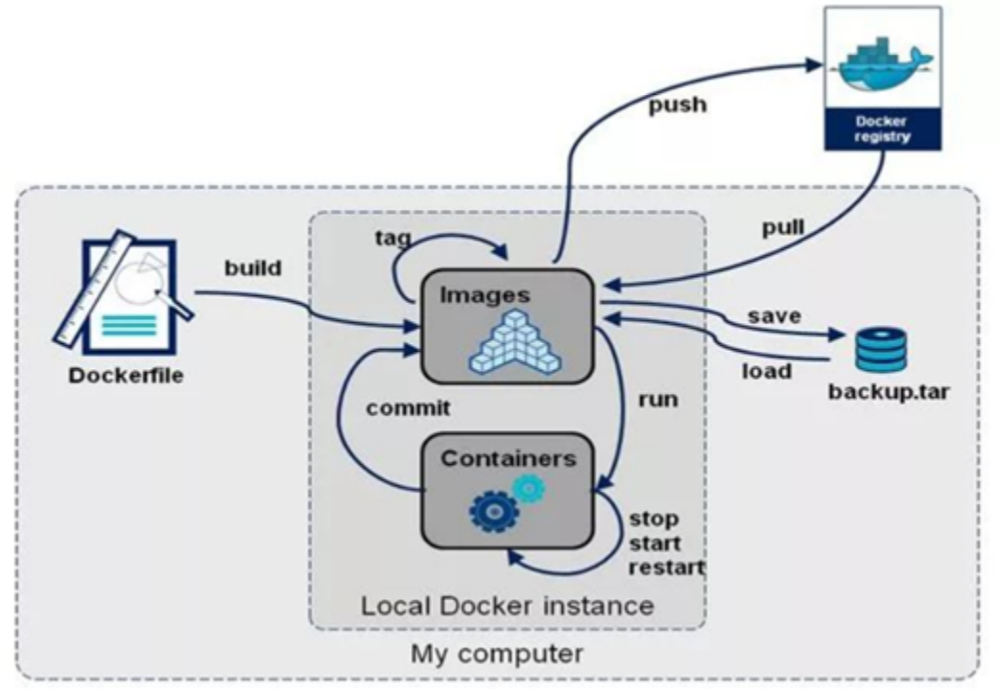

# 0.Docker概述

## 0.1.Docker简介

> Docker是一个开源的应用容器引擎，基于Go语言开发。Docker可以让开发者打包他们的应用以及依赖包到一个轻量级、可移植的容器中，然后发布到任何流行的Linux机器上，也可以实现虚拟化。容器是完全使用沙箱机制，相互之间不会有任何接口（类似iPhone的app）,更重要的是容器性能开销极低。

- Docker应用场景
  - Web应用的自动化打包和发布
  - 自动化测试和持续集成、发布
  - 在服务型环境中部署和调整数据库或其他的后台应用

使用Docker可以实现开发人员的开发环境、测试人员的测试环境、运维人员的生产环境的一致性。


> Docker借鉴了标准集装箱的概念。标准集装箱将货物运往世界各地，Docker将这个模型运用到自己的设计中，唯一不同的是：集装箱运输货物，而Docker运输软件。

## 0.2.Docker容器与传统虚拟机比较

- 传统虚拟机


传统虚拟机技术基于安装在主操作系统上的虚拟机管理系统（如：VirtualBox和VMWare等），创建虚拟机（虚拟出各种硬件），在虚拟机上安装从操作系统，在从操作系统中安装部署各种应用。

- Docker


> Docker容器是在操作系统层面上实现虚拟化，直接复用本地主机的操作系统，而传统虚拟机则是在硬件层面实现虚拟化。与传统的虚拟机相比，Docker优势体现为启动速度快、占用体积小。

## 0.3.Docker组成部分


| 名称                          | 说明                                                         |
| ----------------------------- | ------------------------------------------------------------ |
| Docker镜像(Images)            | Docker镜像是用于创建Docker容器的模板。镜像是基于联合文件系统的一种层式结构，由一系列指令一步一步构建出来。 |
| Docker容器(Container)         | 容器是独立运行的一个或一组应用。镜像相当于类，容器相当于类的实例 |
| Docker客户端(Client)          | Docker客户端通过命令行或者其他工具使用DockerAPI与Docker的守护进程通信。 |
| Docker主机(Host)              | 一个物理或者虚拟的机器用于执行Docker守护进程和容器。         |
| Docker守护进程                | 是Docker服务器端进程，负责支撑Docker容器的运行以及镜像的管理。 |
| Docker仓库DockerHub(Registry) | Docker仓库用来保存镜像，可以理解为代码控制中的代码仓库。DockerHub提供了庞大的镜像集合供使用。用户也可以将自己本地的镜像推送到Docker仓库供其他人下载。 |

# 1.Docker安装

## 1.1.安装Docker

> Docker可以运行在MAC、Windows、CentOS、DEBIAN、UBUNTU等操作系统上，提供社区版和企业版，本课程基于CentOS安装Docker。CentOS6对docker支持的不好，使用docker建议使用CentOS7。

>环境查看

```shell
# 系统内核是3.10以上的
[root@centos-7-test1 ~]# uname -r
3.10.0-1127.el7.x86_64
```

```	shell
# 系统版本
[root@centos-7-test1 ~]# cat /etc/os-release 
NAME="CentOS Linux"
VERSION="7 (Core)"
ID="centos"
ID_LIKE="rhel fedora"
VERSION_ID="7"
PRETTY_NAME="CentOS Linux 7 (Core)"
ANSI_COLOR="0;31"
CPE_NAME="cpe:/o:centos:centos:7"
HOME_URL="https://www.centos.org/"
BUG_REPORT_URL="https://bugs.centos.org/"

CENTOS_MANTISBT_PROJECT="CentOS-7"
CENTOS_MANTISBT_PROJECT_VERSION="7"
REDHAT_SUPPORT_PRODUCT="centos"
REDHAT_SUPPORT_PRODUCT_VERSION="7"
```

>安装Docker

帮助文档：https://docs.docker.com/engine/install/centos/

```shell
# 1、卸载旧的Docker版本
sudo yum remove docker \
                  docker-client \
                  docker-client-latest \
                  docker-common \
                  docker-latest \
                  docker-latest-logrotate \
                  docker-logrotate \
                  docker-engine
# 2、需要的安装包
sudo yum install -y yum-utils

#3、设置镜像的仓库
sudo yum-config-manager \
    --add-repo \
    https://download.docker.com/linux/centos/docker-ce.repo # 默认是国外的下载超级慢！

sudo yum-config-manager \
--add-repo \
http://mirrors.aliyun.com/docker-ce/linux/centos/docker-ce.repo # 阿里云的镜像

# 更新yum软件包索引
yum makecache fast

# 4、安装docker相关的软件 docker-ce社区版 docker-ee企业版
sudo yum install docker-ce docker-ce-cli containerd.io

# 5、启动docker
sudo systemctl start docker

# 6、测试docker安装成功？
docker version

# 7、永远的 [HelloWorld] ^_^ 能够成功拉取image表示docker安装成功！
docker run hello-world
```

```shell
# docker踩到的坑:运行[docker run hello-world]遇到的坑？会报错？
docker: Error response from daemon: Get https://registry-1.docker.io/v2/library/hello-world/manifests/latest: Get https://auth.docker.io/token?scope=repository%3Alibrary%2Fhello-world%3Apull&service=registry.docker.io: net/http: TLS handshake timeout.

# 解决办法：在/etc/docker下创建daemon.json文件。拷贝如下代码:
{
  "registry-mirrors":["https://registry.docker-cn.com","http://hub-mirror.c.163.com"]
}
# 保存退出！
# 重启docker服务：service docker restart
```

> 卸载Docker

```shell
# 1、卸载依赖
sudo yum remove docker-ce docker-ce-cli containerd.io

# 2、删除资源
sudo rm -rf /var/lib/docker

# /var/lib/docker是Docker默认的工作路径！！！
```

## 1.2.阿里云镜像加速

> 设置阿里云镜像步骤

1、登录[阿里云--->控制台]找到容器服务。


2、找到镜像加速地址。


3、配置加速器使用

```shell
sudo mkdir -p /etc/docker

sudo tee /etc/docker/daemon.json <<-'EOF'
{
  "registry-mirrors": ["https://phapqiqc.mirror.aliyuncs.com"]
}
EOF

sudo systemctl daemon-reload

sudo systemctl restart docker
```


> dockerrun的运行流程图


## 1.3.底层原理

> docker是怎么工作的？

Docker是一个Client-Server结构的系统，Docker的守护进程运行在主机上，通过Socket从客户端访问。

Docker-Server接收到Docker-Client的指令，就会执行这个命令。


>docker为什么比VM快？

1、Docker有着比虚拟机更少的抽象层。

2、Docker利用的是宿主机的内核。所以说新建一个容器的时候，docker不需要像虚拟机一样重新加载个操作系统内核。


# 2.Docker的常用命令

## 2.1.帮助命令

```shell
docker version	#显示docker的版本信息
docker info		#显示Docker的系统信息，包括镜像和容器的数量
docker [命令] --help	#docker帮助信息
```

Docker帮助文档地址：https://docs.docker.com/reference/


## 2.2.镜像命令

> dockerimages查看所有本地的主机上的镜像

```shell
[root@centos-7-test1 ~]# docker images
REPOSITORY          TAG                 IMAGE ID            CREATED             SIZE
hello-world         latest              bf756fb1ae65        5 months ago        13.3kB

#解释
REPOSITORY	镜像的仓库源
TAG			镜像的标签
IMAGE ID	镜像的ID
CREATED		镜像的创建时间
SIZE		镜像的大小

#可选项
  -a, --all             #列出所有的镜像
  -q, --quiet           #只显示镜像的id
```

> dockersearch去dockerhub搜索镜像

```shell
[root@centos-7-test1 ~]# docker search mysql

#可选项
--filter=stars=3000	#搜索出来的镜像就是stars大于3000的
[root@centos-7-test1 ~]# docker search nginx --filter=stars=3000
NAME                DESCRIPTION                STARS               OFFICIAL            AUTOMATED
nginx               Official build of Nginx.   13323               [OK] 
```

> dockerpoll	下载镜像

```shell
# 下载镜像 docker pull [镜像名] [:tag]
[root@centos-7-test1 ~]# docker pull mysql
Using default tag: latest # 如果不写tag，默认就下载lastest最新版本
latest: Pulling from library/mysql
8559a31e96f4: Pull complete # 分层下载，docker image的核心，联合文件系统
d51ce1c2e575: Pull complete 
c2344adc4858: Pull complete 
fcf3ceff18fc: Pull complete 
16da0c38dc5b: Pull complete 
b905d1797e97: Pull complete 
4b50d1c6b05c: Pull complete 
c75914a65ca2: Pull complete 
1ae8042bdd09: Pull complete 
453ac13c00a3: Pull complete 
9e680cd72f08: Pull complete 
a6b5dc864b6c: Pull complete 
Digest: sha256:8b7b328a7ff6de46ef96bcf83af048cb00a1c86282bfca0cb119c84568b4caf6 # 签名(防伪标志)
Status: Downloaded newer image for mysql:latest
docker.io/library/mysql:latest # 真实地址

#等价于
docker pull mysql
docker pull docker.io/library/mysql:latest

#指定版本下载 
[root@centos-7-test1 ~]# docker pull mysql:5.7
5.7: Pulling from library/mysql
8559a31e96f4: Already exists # 下载的mysql5.7和之前下载的mysql可以部分文件可以共用
d51ce1c2e575: Already exists 
c2344adc4858: Already exists 
fcf3ceff18fc: Already exists 
16da0c38dc5b: Already exists 
b905d1797e97: Already exists 
4b50d1c6b05c: Already exists 
d85174a87144: Pull complete 
a4ad33703fa8: Pull complete 
f7a5433ce20d: Pull complete 
3dcd2a278b4a: Pull complete 
Digest: sha256:32f9d9a069f7a735e28fd44ea944d53c61f990ba71460c5c183e610854ca4854
Status: Downloaded newer image for mysql:5.7
docker.io/library/mysql:5.7
```

> dockerrmi	删除image

```shell
# 根据image ID删除指定的image
[root@centos-7-test1 ~]# docker rmi -f 9cfcce23593a
Untagged: mysql:5.7
Untagged: mysql@sha256:32f9d9a069f7a735e28fd44ea944d53c61f990ba71460c5c183e610854ca4854
Deleted: sha256:9cfcce23593a93135ca6dbf3ed544d1db9324d4c40b5c0d56958165bfaa2d46a
Deleted: sha256:98de3e212919056def8c639045293658f6e6022794807d4b0126945ddc8324be
Deleted: sha256:17e8b88858e400f8c5e10e7cb3fbab9477f6d8aacba03b8167d34a91dbe4d8c1
Deleted: sha256:c04c087c2af9abd64ba32fe89d65e6d83da514758923de5da154541cc01a3a1e
Deleted: sha256:ab8bf065b402b99aec4f12c648535ef1b8dc954b4e1773bdffa10ae2027d3e00

# 递归删除所有image
[root@centos-7-test1 ~]# docker rmi -f $(docker images -aq)

#删除多个image
docker rmi -f [image id1] [image id2]....
```

## 2.3.容器命令

**说明：我们有了image才可以创建容器，下载一个centos镜像来测试和学习。**

> dockerrun	新建容器并启动

```shell
# docker run [可选参数] image

# 参数说明
--name="Name"   # 给容器取名字
-d				# 后台运行容器并且输出容器的id
-it				# 使用交互方式运行，进入容器查看内容
-p				# (小写的p)容器的端口和Linux主机端口的映射 
	-p 主机端口:容器端口(常用)
	-p ip:主机端口:容器端口
	
-P				# (大写的P)随机指定端口

# 测试，启动centos image并进入容器
[root@centos-7-test1 ~]# docker run -it --name="centos-test1" 470671670cac /bin/bash
[root@91f0881f5e49 /]# ls 
bin  dev  etc  home  lib  lib64  lost+found  media  mnt  opt  proc  root  run  sbin  srv  sys  tmp  usr

# 退出容器命令
[root@91f0881f5e49 /]# exit
exit
[root@centos-7-test1 /]# ls
bin  boot  dev  etc  home  lib  lib64  media  mnt  opt  proc  root  run  sbin  srv  sys  tmp  usr  var
```

> dockerps	列出所有的容器

```shell
# 列出所有正在运行的容器
docker ps [可选参数]

# 可选参数
-a	# 列出所有的容器(包括历史运行的容器)
-n	# 显示n个最后创建的容器
-q 	# 只显示容器的id

# 显示最后一个创建的容器
[root@centos-7-test1 /]# docker ps -n=1
CONTAINER ID        IMAGE               COMMAND             CREATED             STATUS                     PORTS               NAMES
91f0881f5e49        470671670cac        "/bin/bash"         11 minutes ago      Exited (0) 8 minutes ago                       centos-test1

# 列出所有的容器(包括历史运行的容器)
docker ps -a
```

> 退出容器

```shell
exit	# 直接退出容器并退出
ctrl + P + Q 	# 容器不停止退出
```

> dockerrm	删除容器

```shell
# 按照容器id删除容器 不能删除正在运行的容器，如果要强制删除，需要使用 rm -f
docker rm [容器id]

# 删除所有容器
docker rm -f $(docker ps -aq)

docker ps -aq | xargs docker rm		# 删除所有的容器
```

> 启动和停止容器的操作

```shell
docker start [容器id]		# 启动容器
docker restart [容器id]	# 重新启动容器
docker stop [容器id] 		# 停止当前正在运行的容器
docker kill [容器id]		# 强制停止运行容器
```

```shell
#启动docker服务：
systemctl start docker
#停止docker服务：
systemctl stop docker
#重启docker服务：
systemctl restart docker
#查看docker服务状态：
systemctl status docker
#设置开机启动docker服务：
systemctl enable docker
```


## 2.4.其他常用命令

> 后台启动容器

```shell
# docker run -d [image]

# 问题：docker ps 之后，返现容器停止运行了？why？

# 常见的坑，docker 容器使用后台运行，就必须要有一个前台的进程，docker发现没有应用，就会自动停止。
```

> 查看日志

```shell
docker logs -f -t --tail [number] [容器id]

# 参数说明
-f	# 跟踪日志输出
-t	# 显示时间戳
--tail	# 显示最近number条日志
```

> 查看容器中进程信息

```shell
docker top [容器id]

[root@centos-7-test1 ~]# docker top db1f61a0c5c9
UID                 PID                 PPID                C                   STIME               TTY      root                7196                7177                0                   22:33               pts/0   
```

> 查看容器的元数据

```shell
docker inspect [containerId]
```

> 进入当前正在运行的容器

```shell
# 容器通常都是后台运行的，需要进入容器 

# 方式一：docker exec
docker exec -it [containerId] [bashshell]

[root@centos-7-test1 ~]# docker exec -it db1f61a0c5c9 /bin/bash
[root@db1f61a0c5c9 /]# ls
bin  dev  etc  home  lib  lib64  lost+found  media  mnt  opt  proc  root  run  sbin  srv  sys  tmp  usr 

# 方式二：docker attach
docker attach [containerId]

# 问题：docker exec 和 docker attach 的区别？
docker exec		# 进入容器后开启一个新的终端，exit后不会关闭容器(常用)
docker attach 	# 进入容器正在执行的终端，不会启动新的进程，exit后容器会stop。
```

> 从容器内拷贝文件到主机上

```shell
# 命令docker cp
docker cp containerID:容器内路径 目的主机路径


# 测试将centos容器内 /etc/profile 文件拷贝到主机 /opt/ 目录下
[root@centos-7-test1 ~]# docker ps 
CONTAINER ID        IMAGE               COMMAND             CREATED             STATUS              PORTS    db1f61a0c5c9        470671670cac        "/bin/bash"         25 minutes ago      Up 2 minutes                            
[root@centos-7-test1 ~]# docker cp db1f61a0c5c9:/etc/profile /opt/
[root@centos-7-test1 ~]# cd /opt/
[root@centos-7-test1 opt]# ll
total 4
drwxr-xr-x. 3 root root   72 Jun 11 14:53 activemq
drwx--x--x. 4 root root   28 Jun 12 16:01 containerd
drwxr-xr-x. 3 root root   60 Jun 11 10:20 java
-rw-r--r--. 1 root root 2078 Sep 10  2018 profile
drwxr-xr-x. 2 root root    6 Oct 31  2018 rh
drwxr-xr-x. 3 root root   61 Jun 11 10:23 zookeeper
```

## 2.5.小结

```shell
attach	Attach to a running container            		# 当前shell下进入到指定的正在运行的container中
build 	Build an image from a Dockerfile           		# 通过Dockerfile构建镜像
commit	Create a new image from a container‘s changes		# 提交当前容器为新的镜像
cp   	Copy files/folders between a container and the local filesystem		# 从容器中拷贝文件到宿主机指定路径
create	Create a new container							# 创建一个新的容器,同run，但是不会启动容器
diff	Inspect changes to file on container 			# 查看容器文件的变化
events 	Get real time events from the server			# 从docker服务获取容器实时事件
exec	Run a command in a running container			# 在一个已经运行的容器内执行命令
export	Export a container’s filesystem as a tar archive	# 导出容器的内容流作为一个tar归档文件[对应 import]
history	show the history of an image					# 展示一个镜像形成历史
images	List images										# 列出系统中当前的镜像
import	Import the contents form a tarball to create a filesystem image	# 从tar包中的内容创建一个新的文件系统镜像[对应 export]
info	Display system-wide information					# 展示出系统相关信息
inspect	Return low-level information on a container		# 查看容器详细信息
kill	kill one or more running containers				# 强制停止一个或多个正在运行的容器
load	load an image from a tar archive				# 从一个tar包中加载镜像[对应 save]
login	Registy or login to the docker registry server	# 注册或者登陆一个docker源服务器
logout	Logout from a Docker registy server				# 从当前的docker registry server退出
logs	Fetch the logs of a container					# 显示容器的日志
port	show port mappings for a container				# 查看容器端口的映射
pause	Pause all process within the container			# 暂停容器
ps  	List containers									# 列出当前系统中的容器列表
pull	Pull an image from a registry					# 从docker源服务器中拉取镜像
push	Push an image or repository to a registry 		# 推送指定镜像或镜像库到docker源服务器
restart	Restart one or more containers					# 重启一个或多个容器
stop	Stop one or more running containers				# 停止一个或多个正在运行的容器
tag   	Tag an image into a repository             		# 给源镜像中打标签
top   	Display the running process of a container		# 展示容器中正在运行的进程列表
unpause	Unpause all processes within a container		# 取消暂停容器
version	Show the docker version information     		# 展示Docker版本信息
wait	Block until one or more containers stop,then print their exit codes		# 截取容器停止时的退出状态
```

# 3.Docker镜像

## 3.1.镜像是什么？

镜像是一种轻量级，可执行的独立软件包，用来打包软件运行环境和基于运行环境开发的软件，它包含运行某个软件所需的所有内容，包括代码、运行时、库、环境变量和配置文件。

所有的应用直接打包成为Docker镜像，就可以直接跑起来！

如何得到镜像：

- 从远程仓库下载。
- 朋友拷贝给你。
- 自己制作镜像DockerFile。

**镜像**

> Docker镜像是由文件系统叠加而成（是一种文件的存储形式）；是docker中的核心概念，可以认为镜像就是对某些运行环境或者软件打的包，用户可以从docker仓库中下载基础镜像到本地，比如开发人员可以从docker仓库拉取（下载）一个只包含centos7系统的基础镜像，然后在这个镜像中安装jdk、mysql、Tomcat和自己开发的应用，最后将这些环境打成一个新的镜像。开发人员将这个新的镜像提交给测试人员进行测试，测试人员只需要在测试环境下运行这个镜像就可以了，这样就可以保证开发人员的环境和测试人员的环境完全一致。


- Docker提供的关于镜像的操作有
  - 查看镜像
  - 搜索镜像
  - 拉取镜像
  - 删除镜像

## 3.2.Docker镜像加载原理

> UnionFS（联合文件系统）

UnionFS（联合文件系统）：Union文件系统（UnionFS）是一种分层、轻量级并且高性能的文件系统，它支持対文件系统的修改作为一次提交来一层层的叠加，同时可以将不同目录挂载到同一个虚拟文件系统下。Union文件系统是Docker镜像的基础。镜像可以通过分层来继承，基于基础镜像，可以制作各种具体的应用镜像。

特性：一次同时加载多个文件系统，但是从外面看来，只能看到一个文件系统，联合加载会把各层文件叠加起来，这样最终的文件系统会包含所有底层的文件和目录。

> 镜像加载原理

- docker 的镜像实际上由一层一层的文件系统组成，这种层级的文件系统UnionFS。
- bootfs(boot file system) 主要包含bootloader和kernel，bootloader 主要是引导加载kernel，Linux刚启动时会加载bootfs文件系统，在Docker镜像的最底层是bootfs。这一层与我们典型的Linux/Unix系统是一样的，包含boot加载器和内核。当boot加载完成之后整个内核就存在内存中了，此时内存的使用权已由bootfs转交给内核，此时系统也会卸载bootfs。

- roorfs （root file system），在bootfs之上。包含的就是典型Linux系统中的 /dev ，/proc，/bin ，/etx 等标准的目录和文件。rootfs就是各种不同的操作系统发行版。比如Ubuntu，Centos等等。

- 对于一个精简的OS，rootfs可以很小，只需要包括最基本的命令、工具和程序库就可以了，因为底层直接用Host（宿主机）的kernel，自己只需要提供rootfs就行了，由此可见对于不同的Linux发行版，bootfs基本是一致的，rootfs会有差别，因此不同的发行版可以公用bootfs。


> 镜像分层

- 所有的Docker镜像都起始于一个基础的镜像层，当进行修改或增加新的内容时，就会在当前的镜像层上，创建新的镜像层。
- 举一个简单的例子，例如基于CentOS7创建新的镜像，这就是镜像的第一层，如果在该镜像中添加`Java`包，就会在基础镜像层上创建第二个镜像层；如果继续添加一个安全补丁，就会创建第三个镜像层。


## 3.3.Commit镜像

```shell
docker commit 提交容器成为一个新的镜像

# docker commit基本语法
docker commit -m="描述信息" -a="作者名字" 目标镜像ID:[TAG]
```

# 4.容器数据卷

## 4.1.什么是容器数据卷

- 将应用和环境打包成一个镜像！数据？如果数据都在容器中，那么我们将容器删除，数据就会消失。
- 需求：为了解决数据持久化的问题，可以容器数据存储在本地磁盘中，容器之间可以有一个数据共享的技术！
- Docker容器中的数据可以同步到本地，删除容器后数据不会丢失，这就是容器数据卷技术。
- **一句话：容器的数据的持久化和容器间数据的共享。**

## 4.2.使用数据卷

```shell
# -v的基本使用
docker run -d -p 主机端口:容器内端口 -v 主机目录:容器目录 镜像id

# 查看容器数据卷的挂载状态
docker inspect 容器id
```

## 4.3.容器部署

### 4.3.1.MySQL8

**目标**：拉取mysql镜像，启动容器，操作容器中的mysql

**分析**：

1. 拉取mysql镜像；

2. 创建并启动守护式容器；

3. 在容器中操作mysql；

4. 使用图形界面工具（windows）操作在docker中安装的mysql；在创建mysql容器的时候使用-p指定端口映射实现连接

   在创建容器的时候mysql的root用户可以指定远程访问的密码。

**小结**：

> 在创建容器的时候指定环境变量MYSQL_ROOT_PASSWORD表示使用root进行远程连接时候的密码。如果需要进行远程连接的话可以使用-p进行端口映射。

```shell
docker run --name mysql -d -p 3306:3306 \
-v /root/mysql/data:/var/lib/mysql \
-v /root/mysql/conf:/etc/mysql \
-e MYSQL_ROOT_PASSWORD=333 \
mysql:5.7
```

```shell
docker run \
    -p 3306:3306 \
    -e MYSQL_ROOT_PASSWORD=333 \
    -v /root/mysql8/data:/var/lib/mysql \
    -v /root/mysql8/log:/var/log/mysql \
    -v /root/mysql8/config:/etc/mysql \
    -v /etc/localtime:/etc/localtime \
    -v /root/mysql8/mysql-files:/var/lib/mysql-files \
    --name mysql8 \
    -d mysql:8.0.26
```

### 4.3.2.Tomcat容器部署

**目标**：拉取tomcat镜像，启动容器，操作容器中的tomcat

**分析**：

- 将项目文件上传到容器中的tomcat目录（webapps）

  创建容器的时候可以指定-v进行目录挂载，tomcat在容器中的目录（/usr/local/tomcat/webapps）

- 可以通过外部浏览器访问容器中的项目

  创建容器的时候可以指定-p进行端口映射

1. 拉取tomcat镜像；`dockerpulltomcat`
2. 创建并启动tomcat容器；

```sh
docker run -di --name=mytomcat-p9000:8080 -v/usr/local/tomcat/webapps:/usr/local/tomcat/webappstomcat
```


3. 访问容器中tomcat

   http://192.168.76.128:9000

   

**小结**：

> 上传项目文件可以使用容器的目录挂载功能，外部访问可以使用端口映射

### 4.3.3Redis容器部署

**目标**：拉取redis镜像，启动容器，操作容器中的redis

**分析**：

1. 拉取redis镜像；
2. 创建并启动redis容器；默认端口是6379，如果需要外部访问则可以使用端口映射；
3. 连接redis:①使用命令行客户端②使用图形界面工具

**小结**：

```sh
#创建容器
docker run -di--name=myredis-p6379:6379 redis

#进入容器
docker exec-it myredis/bin/bash
```

### 4.3.4.Nginx容器部署

**目标**：拉取nginx镜像，启动容器，访问nginx

**分析**：

nginx的默认访问端口是：80

在创建容器的时候需要进行端口映射，指定-p，映射的端口80

1. 拉取nginx镜像；
2. 创建并启动nginx容器；
3. 在浏览器上访问容器中nginx，http://192.168.76.128

**小结**：

> 如果被占用了80端口，那么在指定映射的时候可以改变宿主机的端口映射，在访问时也需要带上端口号。

## 4.4.具名挂载和匿名挂载

> 匿名挂载和具名挂载展示

```shell
# 1、匿名挂载
docker run -d -p --name nginx01 \
-v /etc/nginx \
nginx:6.1

# 查看所有的volume情况
docker volume ls

[root@mingyu bin]# docker volume ls
DRIVER              VOLUME NAME
local               6831db4e060f8452a51fc56b52af0605c944bb0ab16c778a96469233794783ea

# 发现VOLUME NAME这里是一串乱码，这就是匿名挂载，我们在-v时只写了容器内的路径，没有写容器外的路径。

# 2、具名挂载(-v 卷名:容器内路径) 注意这里是卷名而不是容器外路径
docker run -d -p 3307:3306 --name mysql-test \
-v mysql-volume:/etc/mysql \
-e MYSQL_ROOT_PASSWORD=333 \
mysql:5.7

# 查看具名挂载卷的位置
[root@mingyu bin]# docker inspect mysql-test
"Mounts": [
{
"Type": "volume",
"Name": "mysql-volume",
"Source": "/var/lib/docker/volumes/mysql-volume/_data",
"Destination": "/etc/mysql",
"Driver": "local",
"Mode": "z",
"RW": true,
"Propagation": ""
},
```

所有的Docker容器的容器卷，没有指定目录的情况下都是在`/var/lib/docker/volumes/xxx/_data`。

我们通过具名挂载可以方便的找到我们的一个卷，大多数情况在使用的`具名挂载`。

> 如何区分匿名挂载，还是具名挂载，还是指定路径挂载？

- 匿名挂载：`-v容器内路径`。
- 具名挂载：`-v卷名:容器内路径`。
- 指定路径挂载：`-v/宿主机路径:容器内路径`。

> 扩展

```shell
# 通过 -v 容器内路径:ro rw改变读写权限
ro readonly	# 只读
rw readwrite	# 可读可写 

# 只要这个设置了容器权限，容器对我们挂载的数据卷内容就有限定了！
docker run -d -p 3307:3306 --name mysql-test \
-v mysql-volume:/etc/mysql:ro \
-e MYSQL_ROOT_PASSWORD=333 \
mysql:5.7

# ro 说明这个路径只能通过宿主机来操作，容器内部是无法操作的！
```

## 4.5.初识Dockefile

Dockerfile就是用来构建dockerimage的文件！就是命令脚本！

通过这个脚本可以生成镜像，镜像是一层一层的，脚本一个个的命令，每个命令就是一层。

```shell
# 1、创建一个dockerfile文件，名字可以随意

# 文件中的内容	指令(大写)  参数	
FROM centos
VOLUME ["volume01","volume02"]
CMD echo "---end---"
CMD /bin/bash

# 这里每个命令就是镜像的一层

# 2、docker build生成镜像 
[root@mingyu docker-test-volume]# docker build -f /root/docker-test-volume/dockerfile1 -t mingyu/centos:1.0 . # 这里的这个点表示当前路径下！一定要加
Sending build context to Docker daemon  2.048kB
Step 1/4 : FROM centos
latest: Pulling from library/centos
6910e5a164f7: Pull complete 
Digest: sha256:4062bbdd1bb0801b0aa38e0f83dece70fb7a5e9bce223423a68de2d8b784b43b
Status: Downloaded newer image for centos:latest
 ---> 831691599b88
Step 2/4 : VOLUME ["volume01","volume02"]
 ---> Running in 2431f66d812c
Removing intermediate container 2431f66d812c
 ---> d7d82437e882
Step 3/4 : CMD echo "---end---"
 ---> Running in 61e1c1e347f4
Removing intermediate container 61e1c1e347f4
 ---> 9941580f890a
Step 4/4 : CMD /bin/bash
 ---> Running in c6985be4aaed
Removing intermediate container c6985be4aaed
 ---> 8adb23ccb590
Successfully built 8adb23ccb590
Successfully tagged mingyu/centos:1.0

# 3、启动自己写的容器
docker run -it --name mycentos mingyu/centos:1.0 /bin/bash

# 在容器内部可以看到我们自己定义的容器卷
[root@26c568f61497 /]# ls
bin  dev  etc  home  lib  lib64  lost+found  media  mnt  opt  proc  root  run  sbin  srv  sys  tmp  usr  var  volume01	volume02


# 4、查看容器的数据卷的挂载位置
[root@mingyu ~]# docker inspect mycentos
"Mounts": [
{
"Type": "volume",
"Name": "ec18f8b7f9a2284071501133ec17c5094093200e372dcf6c5b2bd13fbf4c9f06",
"Source": "/var/lib/docker/volumes/ec18f8b7f9a2284071501133ec17c5094093200e372dcf6c5b2bd13fbf4c9f06/_data",
"Destination": "volume01",
"Driver": "local",
"Mode": "",
"RW": true,
"Propagation": ""
},
{
"Type": "volume",
"Name": "8adb94c9d27174623e188e48652d932889a7d84c33466ab96d2548ee7f9fea72",
"Source": "/var/lib/docker/volumes/8adb94c9d27174623e188e48652d932889a7d84c33466ab96d2548ee7f9fea72/_data",
"Destination": "volume02",
"Driver": "local",
"Mode": "",
"RW": true,
"Propagation": ""
}
],
```

这种方式我们未来使用的十分多，因为我们通常会自己构建自己的镜像！

建设构建镜像时没有挂载卷，需要手动挂载`-v卷名:容器内路径`。

## 4.6.数据卷容器

```shell
# mycentos01容器继承mycentos的容器数据卷
# mycentos01容器也有mycentos的数据了！
docker run -it --name mycentos01 --volumes-from mycentos mingyu/centos:1.0 /bin/bash

# 测试删除mycentos容器，mycentos01容器仍然可以访问数据卷的数据
```

## 4.7.结论

- 容器之间信息的传递，数据卷的生命周期一直持续到没有容器使用为止。
- 但是一旦将数据持久化到本地磁盘，本地文件是不会消失的！

# 5.DockerFile

## 5.1 什么是Dockerfile文件

> Dockerfile其实就是一个文本文件，由一系列命令和参数构成，Docker可以读取Dockerfile文件并根据Dockerfile文件的描述来构建镜像。

- Dockerfile文件内容一般分为4部分：
  - 基础镜像信息
  - 维护者信息
  - 镜像操作指令
  - 容器启动时执行的指令

## 5.2.DockerFile构建过程

### 5.2.0.Docker镜像的构建步骤

- 编写一个dockerfile文件。
- `dockerbuild`构建成为一个镜像。
- `dockerrun`运行镜像。
- `dockerpush`发布镜像（DockerHub、阿里云镜像）。

### 5.2.1.基础知识

- 每个保留关键字（指令）都是必须大写字母。
- 执行从上到下顺序执行。
- #表示注释。
- 每一个指令都会创建提交一个新的镜像层，并提交。


dockerfile是面向开发的，我们以后要发布项目，做镜像，就要编写dockerfile文件，这个文件十分简单！

Docker镜像主键成为企业交付的标准，必须掌握！

### 5.2.2.DockerFile、镜像和容器的关系

DockerFile：构建文件，定义了一切的步骤，相当于源代码。

DockerImages：通过DockerFile生成的镜像，最终发布和运行的产品。

DockerContainer：容器就是镜像运行起来提供服务的。

## 5.3.DockerFile指令

```shell
FROM                       # 基础镜像，一切从这里开始构建
MAINTAINER                 # 镜像是谁写的，姓名+邮箱
RUN                        # 镜像构建的时候需要运行的命令
ADD                        # 添加内容(自动解压)
WORKDIR                    # 镜像的工作目录
VOLUME                     # 容器卷的挂载位置
EXPOSE                     # 暴露端口
CMD                        # 指定容器启动的时候要运行的命令，只有最后一个会生效，可被替代
ENTRYPOINT                 # 指定容器启动的时候要运行的命令，可以追加命令
ONBUILD                    # 当构建一个被继承 DockerFile 这个时候就会运行ONBUILD指令
COPY                       # 类似ADD，将文件拷贝到镜像中
ENV                        # 构建的时候设置环境变量
```


## 5.4.实战：创建一个自己的CentOS

```shell
# 1、编写dockerfile文件
[root@mingyu dockerfile]# vim dockerfile-centos
FROM centos
MAINTAINER mingyu<1466637477@qq.com>

ENV MYPATH /usr/local
WORKDIR $MYPATH

RUN yum -y install vim
RUN yum -y install net-tools

EXPOSE 80

CMD echo $MYPATH
CMD echo "---end---"
CMD /bin/bash

# 2、docker build构建镜像
# 语法：docker build -f dockerfile文件路径 -t 镜像名:版本号 .
docker build -f dockerfile-centos -t mingyu/centos:2.0 .

# 3、查看我们自己构建的镜像
[root@mingyu dockerfile]# docker images
REPOSITORY          TAG                 IMAGE ID            CREATED              SIZE
mingyu/centos       2.0                 bab722ff73fc        About a minute ago   287MB

# 4、测试运行
docker run -it --name mycentos mingyu/centos:2.0

# 原生的CentOS并没有vim和ifconfig命令，我们自己构建的CentOS是可以用的！

# 5、docker history 可以查看镜像的构建步骤
[root@mingyu dockerfile]# docker history mingyu/centos:2.0
IMAGE               CREATED             CREATED BY                                      SIZE               
bab722ff73fc        8 minutes ago       /bin/sh -c #(nop)  CMD ["/bin/sh" "-c" "/bin…   0B                 
84744206026b        8 minutes ago       /bin/sh -c #(nop)  CMD ["/bin/sh" "-c" "echo…   0B                 
1da4606efdce        8 minutes ago       /bin/sh -c #(nop)  CMD ["/bin/sh" "-c" "echo…   0B                 
cd5031824201        8 minutes ago       /bin/sh -c #(nop)  EXPOSE 80                    0B                 
773c8a4d5a68        8 minutes ago       /bin/sh -c yum -y install net-tools             14.3MB             
023728153f3b        8 minutes ago       /bin/sh -c yum -y install vim                   57.1MB             
72a357865b33        8 minutes ago       /bin/sh -c #(nop) WORKDIR /usr/local            0B                 
c248625c78e6        8 minutes ago       /bin/sh -c #(nop)  ENV MYPATH=/usr/local        0B                 
6fb94cf1eadc        8 minutes ago       /bin/sh -c #(nop)  MAINTAINER mingyu<1466637…   0B                 
831691599b88        10 days ago         /bin/sh -c #(nop)  CMD ["/bin/bash"]            0B                 
<missing>           10 days ago         /bin/sh -c #(nop)  LABEL org.label-schema.sc…   0B                 
<missing>           10 days ago         /bin/sh -c #(nop) ADD file:84700c11fcc969ac0…   215MB   
```

## 5.5.CMD和ENTRYPOINT

> 测试CMD

```shell
CMD                        # 指定容器启动的时候要运行的命令，只有最后一个CMD会生效，可被替代
ENTRYPOINT                 # 指定容器启动的时候要运行的命令，可以追加命令

# 1、写dockerfile文件
[root@mingyu dockerfile]# vim dockerfile-cmd-test
FROM centos
CMD ["ls","-a"]

# 2、构建测试镜像
docker build -f dockerfile-cmd-test -t test/cmd:1.0 .

# 3、查看构建好的镜像
[root@mingyu dockerfile]# docker images
REPOSITORY          TAG                 IMAGE ID            CREATED             SIZE
test/cmd            1.0                 df29f1d322e7        4 minutes ago       215MB

# 4、启动测试镜像 发现我们ls -a命令生效
[root@mingyu dockerfile]# docker run -it --name test-cmd test/cmd:1.0
.   .dockerenv	dev  home  lib64       media  opt   root  sbin	sys  usr
..  bin		etc  lib   lost+found  mnt    proc  run   srv	tmp  var

# 5、测试追加命令 结果失败 o(╥﹏╥)o
[root@mingyu dockerfile]# docker run -it --name test-cmd test/cmd:1.0 -l
docker: Error response from daemon: OCI runtime create failed: container_linux.go:349: starting container process caused "exec: \"-l\": executable file not found in $PATH": unknown.

# 6、原因：用CMD的情况下 -l 替换了 CMD ["ls","-a"]，-l不是命令所以就报错了！
```

> 测试ENTRYPOINT

```shell
CMD                        # 指定容器启动的时候要运行的命令，只有最后一个CMD会生效，可被替代
ENTRYPOINT                 # 指定容器启动的时候要运行的命令，可以追加命令

# 1、写dockerfile文件
[root@mingyu dockerfile]# vim dockerfile-entrypoint-test
FROM centos
ENTRYPOINT ["ls","-a"]

# 2、构建测试镜像
docker build -f dockerfile-entrypoint-test -t test/entrypoint:1.0 .

# 3、查看构建好的镜像
[root@mingyu dockerfile]# docker images
REPOSITORY          TAG                 IMAGE ID            CREATED             SIZE
test/entrypoint     1.0                 6ede8cb2383f        31 seconds ago      215MB

# 4、启动测试镜像 发现我们ls -a命令生效
[root@mingyu dockerfile]# docker run --name test-entrypoint -it test/entrypoint:1.0
.   .dockerenv	dev  home  lib64       media  opt   root  sbin	sys  usr
..  bin		etc  lib   lost+found  mnt    proc  run   srv	tmp  var

# 5、测试追加命令 成功了 (*^▽^*)
[root@mingyu dockerfile]# docker run --name test-entrypoint1 -it test/entrypoint:1.0 -l
total 56
drwxr-xr-x  1 root root 4096 Jun 27 05:58 .
drwxr-xr-x  1 root root 4096 Jun 27 05:58 ..
-rwxr-xr-x  1 root root    0 Jun 27 05:58 .dockerenv
lrwxrwxrwx  1 root root    7 May 11  2019 bin -> usr/bin
```

## 5.6.实战：Tomcat镜像

```shell
# 1、准备jdk压缩包和tomcat压缩包
jdk-8u251-linux-x64.tar.gz
apache-tomcat-9.0.36.tar.gz

# 2、编写dockerfile文件
FROM centos
MAINTAINER mingyu<1466637477@qq.com>

ADD /opt/java/jdk-8u251-linux-x64.tar.gz /usr/local/
ADD /opt/tomcat/apache-tomcat-9.0.36.tar.gz /usr/local/

RUN yum -y install vim

ENV MYPATH /usr/local
WORKDIR $MYPATH

ENV JAVA_HOME /usr/local/jdk1.8.0_251
ENV CLASSPATH $JAVA_HOME/lib/dt.jar:$JAVA_HOME/lib/tools.jar

ENV CATALINA_HOME /usr/local/apache-tomcat-9.0.36
ENV CATALINA_BASH /usr/local/apache-tomcat-9.0.36
ENV PATH $PATH:$JAVA_HOME/bin:$CATALINA_HOME/lib:$CATALINA_HOME/bin

EXPOSE 8080

CMD /usr/local/apache-tomcat-9.0.36/bin/startup.sh 
```


# 6.Docker网络

## 6.1.理解Docker网络

> 查看网络环境

```shell
[root@mingyu tomcat]# ifconfig
docker0: flags=4163<UP,BROADCAST,RUNNING,MULTICAST>  mtu 1500
        inet 172.18.0.1  netmask 255.255.0.0  broadcast 172.18.255.255
        ether 02:42:f4:c7:a9:d2  txqueuelen 0  (Ethernet)
        RX packets 615374  bytes 214760761 (204.8 MiB)
        RX errors 0  dropped 0  overruns 0  frame 0
        TX packets 1059269  bytes 132175026 (126.0 MiB)
        TX errors 0  dropped 0 overruns 0  carrier 0  collisions 0

eth0: flags=4163<UP,BROADCAST,RUNNING,MULTICAST>  mtu 1500
        inet 172.17.95.30  netmask 255.255.240.0  broadcast 172.17.95.255
        ether 00:16:3e:34:40:89  txqueuelen 1000  (Ethernet)
        RX packets 1358134  bytes 713636205 (680.5 MiB)
        RX errors 0  dropped 0  overruns 0  frame 0
        TX packets 1049543  bytes 319209059 (304.4 MiB)
        TX errors 0  dropped 0 overruns 0  carrier 0  collisions 0

lo: flags=73<UP,LOOPBACK,RUNNING>  mtu 65536
        inet 127.0.0.1  netmask 255.0.0.0
        loop  txqueuelen 1  (Local Loopback)
        RX packets 1387986  bytes 260874723 (248.7 MiB)
        RX errors 0  dropped 0  overruns 0  frame 0
        TX packets 1387986  bytes 260874723 (248.7 MiB)
        TX errors 0  dropped 0 overruns 0  carrier 0  collisions 0
```

- `docker0`：docker的地址。
- `lo`：本机地址。
- `eth0`：阿里云内网地址。

> 原理

- 我们只要安装了docker就会安装一个网卡docker0，每启动一个docker容器，docker就会给docker容器分配一个ip,桥接模式。
- 启动的容器带来的网卡都是一对对的。
- `veth-pair`技术就是一对虚拟设备接口，他们都是成对出现的，一端连着协议，一端彼此相连。
- 正因为有`veth-pair`的特性，`veth-pair`可以充当桥梁，连接各种虚拟网络设备。


## 6.2.查看Docker网络

```shell
# 1、docker network ls 查看所有的docker网络
[root@mingyu ~]# docker network ls
NETWORK ID          NAME                DRIVER              SCOPE
8ae116b000e5        bridge              bridge              local
18feddce366c        host                host                local
5cfab10d71d0        none                null                local

# 2、查看具体的docker网络信息
docker network inspect [NETWORK ID]
```

## 6.3.自定义网络

### 6.3.1.网络模式

- `bridge`：桥接模式（默认，自定义网络也用桥接模式）。
- `none`：不配网络，一般不用。
- `host`：主机模式，和宿主机共享网络。
- `container`：容器间直接连通（用的少）。

### 6.3.2.创建网络

```shell
# 1、我们直接启动的命令 --net bridge，这个就是我们的docker0
docker run -d p --name tomcat01 --net bridge tomcat

# 2、docker0特点：默认，域名不能访问

# 3、自定义网络
# --driver	网络模式
# --subnet	子网掩码
# --gateway	默认网关
docker network create --driver bridge --subnet 192.168.0.0/16 --gateway 192.168.0.1 mynetwork

# 4、查看自己创建的网络
[root@mingyu ~]# docker network ls
NETWORK ID          NAME                DRIVER              SCOPE
8ae116b000e5        bridge              bridge              local
18feddce366c        host                host                local
625963e16231        mynetwork           bridge              local
5cfab10d71d0        none                null                local
```

### 6.3.3.自定义网络的好处

- 使用docker0网络，容器和容器之间只能通过IP地址来ping通，不能使用容器名字来ping。
- 我们自定义网络，容器之间不仅可以使用IP地址来通信，而且可以使用容器名字来通信。

- 不同的集群可以使用不同的网络，保证集群式安全和健康的。

## 6.4.网络联通

```shell
# docker network connect
[root@mingyu ~]# docker network --help
Usage:	docker network COMMAND
Manage networks
Commands:
  connect     Connect a container to a network

# docker network connect 语法
docker network connect NETWORK CONTAINER

# 联通之后就是将CONTAINER放到了NETWORK下

# 一个容器两个IP
```

# 7. 迁移与备份


- 其中涉及到的命令有：
  - docker commit 将容器保存为镜像
  - docker save 将镜像备份为tar文件
  - docker load 根据tar文件恢复为镜像

## 7.1 将Docker容器保存为镜像

使用docker commit命令可以将容器保存为镜像。 命令形式：docker commit 容器名称 镜像名称

```shell
# 保存nginx容器为镜像
docker commit mynginx mynginx
```

此镜像的内容就是当前容器的内容，接下来你可以用此镜像再次运行新的容器

## 7.2. 镜像备份

使用docker save命令可以将已有镜像保存为tar 文件。 命令形式：docker save –o tar文件名 镜像名

```shell
# 保存镜像为文件
docker save -o mynginx.tar mynginx
```


## 7.3. 镜像恢复与迁移

使用docker load命令可以根据tar文件恢复为docker镜像。 命令形式：docker load -i tar文件名

```shell
# 停止mynginx容器
docker stop mynginx
# 删除mynginx容器
docker rm mynginx
# 删除mynginx镜像
docker rmi mynginx
# 加载恢复mynginx镜像
docker load -i mynginx.tar
# 在镜像恢复之后，基于该镜像再次创建启动容器
docker run -di --name=mynginx -p 80:80 mynginx
```


> 注意：在执行docker load命令恢复镜像时，需要先删除原镜像。

# 8.私有仓库搭建与配置

> Docker官方的Docker hub（https://hub.docker.com）是一个用于管理公共镜像的仓库，我们可以从上面拉取镜像 到本地，也可以把我们自己的镜像推送上去。但是，有时候我们的服务器无法访问互联网，或者你不希望将自己的镜 像放到公网当中，那么我们就需要搭建自己的私有仓库来存储和管理自己的镜像。

## 8.1 私有仓库搭建步骤

```shell
 #1、拉取私有仓库镜像
docker pull registry
# 2、启动私有仓库容器
docker run -di --name=registry -p 5000:5000 registry
# 3、打开浏览器 输入地址http://宿主机ip:5000/v2/_catalog，看到{"repositories":[]} 表示私有仓库
搭建成功
# 4、修改daemon.json
vi /etc/docker/daemon.json
# 在上述文件中添加一个key，保存退出。此步用于让 docker 信任私有仓库地址；注意将宿主机ip修改为自己宿主
机真实ip
{"insecure-registries":["宿主机ip:5000"]}
# 5、重启docker 服务
systemctl restart docker
docker start registry

```


## 8.2.将镜像上传至私有仓库

**目标**：将制作的jdk1.8的镜像上传到私有仓库

**操作步骤**

```shell
# 1、标记镜像为私有仓库的镜像
docker tag jdk1.8 宿主机IP:5000/jdk1.8
# 2、再次启动私有仓库容器
docker restart registry
# 3、上传标记的镜像
docker push 宿主机IP:5000/jdk1.8
# 4、输入网址查看仓库效果
```


**小结**：

将本地镜像打标签（标记本地镜像为一个私有仓库中的镜像）；将打了标签的镜像推送到私有仓库。

## 8.3.从私有仓库拉取镜像

**目标**：将私有仓库中的jdk1.8镜像拉取到本地

### 8.3.1. 私有仓库所在服务器拉取镜像

若是在私有仓库所在的服务器上去拉取镜像；那么直接执行如下命令：

```shell
# 因为私有仓库所在的服务器上已经存在相关镜像；所以先删除；请指定镜像名，不是id
docker rmi 服务器ip:5000/jdk1.8
#拉取镜像
docker pull 服务器ip:5000/jdk1.8
#可以通过如下命令查看 docker 的信息；了解到私有仓库地址
docker info
```


执行 docker info 命令之后显示内容：


> 在仓库所在服务器上去拉取镜像是比较少有的操作；作为了解即可。

**小结**：

- 私有仓库与拉取镜像的服务器是在同一台机器上：直接拉取镜像；`dockerpull私有仓库地址/镜像名称`
- 私有仓库与拉取镜像的服务器是不在同一台机器上：需要去修改docker的配置文件，指定私有仓库地址；再执行拉取镜像的命令。

> 如果本地存在同名的镜像需要先删除镜像后拉取

### 8.3.2. 其它服务器拉取私有仓库镜像

> 大多数情况下，都是某台服务器部署了私有镜像仓库之后；到其它服务器上从私有仓库中拉取镜像，若要拉取私有仓 库镜像需要去修改docker的配置文件，设置启动时候的仓库地址。

```shell
# 打开配置文件
vi /usr/lib/systemd/system/docker.service
# 在打开的上述文件中按照下面的图，添加如下的内容；注意修改下面内容中的ip地址
--add-registry=192.168.12.135:5000 --insecure-registry=192.168.12.135:5000 \
# 修改完后需要重新加载docker配置文件并重启docker
systemctl daemon-reload
systemctl restart docker
```


在重启之后；那么则可以去拉取私有仓库中的镜像：

```shell
# 执行拉取镜像命令并查看
docker pull jdk1.8
docker images
```


整体docker的私有仓库运作形如下图：



# 9.Docker Compose

## 9.1. Compose简介

### 9.1.1. 概念

> Compose项目是Docker官方的开源项目，负责实现对Docker容器集群的快速编排。它是一个定义和运行多容器的docker应用工具。使用compose，你能通过YMAL文件配置你自己的服务，然后通过一个命令，你能使用配置文件创建和运行所有的服务。

### 9.1.2.组成

> Docker-Compose将所管理的容器分为三层，分别是工程（project），服务（service）以及容器（container）。Docker-Compose运行目录下的所有文件（docker-compose.yml，extends文件或环境变量文件等）组成一个工程，若无特殊指定工程名即为当前目录名。一个工程当中可包含多个服务，每个服务中定义了容器运行的镜像，参数，依赖。一个服务当中可包括多个容器实例。

- 服务（service）
  - 一个应用的容器，实际上可以包括若干运行相同镜像的容器实例。每个服务都有自己的名 字、使用的镜像、挂载的数据卷、所属的网络、依赖哪些其他服务等等，即以容器为粒度，用户需要Compose 所完成的任务。 
- 项目（project）
  - 由一组关联的应用容器组成的一个完成业务单元，在docker-compose.yml中定义。即是 Compose的一个配置文件可以解析为一个项目，Compose通过分析指定配置文件，得出配置文件所需完成的所 有容器管理与部署操作。

> Docker-Compose的工程配置文件默认为docker-compose.yml，可通过环境变量COMPOSE_FILE或-f参数自定义配 置文件，其定义了多个有依赖关系的服务及每个服务运行的容器。 使用一个Dockerfile模板文件，可以让用户很方便的定义一个单独的应用容器。在工作中，经常会碰到需要多个容器 相互配合来完成某项任务的情况。例如：要部署一个Web项目，除了Web服务容器，往往还需要再加上后端的数据 库服务容器，甚至还包括负载均衡容器等。

## 9.2. 安装与卸载

> Compose目前已经完全支持Linux、Mac OS和Windows，在我们安装Compose之前，需要先安装Docker。下面我 们以编译好的二进制包方式安装在Linux系统中。

### 9.2.1. 安装与卸载

**安装**

```shell
curl -L "https://github.com/docker/compose/releases/download/1.24.0/dockercompose-$(uname -s)-$(uname -m)" -o /usr/local/bin/docker-compose
# 设置文件可执行权限
chmod +x /usr/local/bin/docker-compose
# 查看版本信息
docker-compose -version
```


**卸载**

```shell
# 二进制包方式安装的，删除二进制文件即可
rm /usr/local/bin/docker-compose
```

## 9.3. Compose常用命令参考

使用Compose前，可以通过执行 docker-compose --help|-h 来查看Compose基本命令用法。 也可以通过执行 docker-compose [COMMAND] --help 或者 docker-compose --help [COMMAND] 来查看某个具体的使 用格式。

可以知道Compose命令的基本的使用格式为：

```shell
 docker-compose [-f 参数...] [options] [COMMAND] [ARGS...]
```

命令选项如下：

```shell
-f，–file FILE指定使用的Compose模板文件，默认为docker-compose.yml，可以多次指定。
-p，–project-name NAME指定项目名称，默认将使用所在目录名称作为项目名。
-x-network-driver 使用Docker的可拔插网络后端特性（需要Docker 1.9 及以后版本）
-x-network-driver DRIVER指定网络后端的驱动，默认为bridge（需要Docker 1.9 及以后版本）
-verbose输出更多调试信息
-v，–version打印版本并退出
```

Docker Compose常用命令列表如下：

| 命令    | 说明                                                         |
| ------- | ------------------------------------------------------------ |
| build   | 构建项目中的服务容器                                         |
| help    | 构建项目中的服务容器                                         |
| kill    | 构建项目中的服务容器                                         |
| config  | 验证和查看compose文件配置                                    |
| create  | 为服务创建容器。只是单纯的create，还需要使用start启动compose |
| down    | 停止并删除容器，网络，镜像和数据卷                           |
| exec    | 在运行的容器中执行一个命令                                   |
| logs    | 查看服务容器的输出                                           |
| pause   | 暂停一个服务容器                                             |
| port    | 打印某个容器端口所映射的公共端口                             |
| ps      | 列出项目中目前的所有容器                                     |
| pull    | 拉取服务依赖的镜像                                           |
| push    | 推送服务镜像                                                 |
| restart | 重启项目中的服务                                             |
| rm      | 删除所有（停止状态的）服务容器                               |
| run     | 在指定服务上执行一个命令                                     |
| scale   | 设置指定服务运行的容器个数                                   |
| start   | 启动已经存在的服务容器                                       |
| stop    | 停止已经处于运行状态的容器，但不删除它                       |
| top     | 显示运行的进程                                               |
| unpause | 恢复处于暂停状态中的服务                                     |
| up      | 自动完成包括构建镜像、创建服务、启动服务并关闭关联服务相关容器的一些列操作 |
| version | 打印版本信息                                                 |

**9.3.1. up**

格式为：

```shell
 docker-compose up [options] [--scale SERVICE=NUM...] [SERVICE...]
```

up命令十分强大，它尝试自动完成包括构建镜像，（重新）创建服务，启动服务，并关联服务相关容器的一些列操 作。链接的服务都将会被自动启动，除非已经处于运行状态。

多数情况下我们可以直接通过该命令来启动一个项目。

选项包括：

```shell
-d 在后台运行服务容器 
–no-color 不使用颜色来区分不同的服务的控制输出 
–no-deps 不启动服务所链接的容器 
–force-recreate 强制重新创建容器，不能与
–no-recreate同时使用
–no-recreate 如果容器已经存在，则不重新创建，不能与
–force-recreate同时使用 
–no-build 不自动构建缺失的服务镜像 
–build 在启动容器前构建服务镜像
–abort-on-container-exit 停止所有容器，如果任何一个容器被停止，不能与-d同时使用
-t, --timeout TIMEOUT 停止容器时候的超时（默认为10秒） 
–remove-orphans 删除服务中没有在compose文件中定义的容器 
–scale SERVICE=NUM 设置服务运行容器的个数，将覆盖在compose中通过scale指定的参数
```

**9.3.2. ps**

格式为：

```shell
docker-compose ps [options] [SERVICE...]
```

列出项目中目前的所有容器。

选项包括：

```shell
-q 只打印容器的ID信息
```

**9.3.3. stop**

格式为：

```shell
docker-compose stop [options] [SERVICE...]
```

停止已经处于运行状态的容器，但不删除它。

选项包括：

```shell
-t, --timeout TIMEOUT 停止容器时候的超时（默认为10秒）
```

**9.3.4. down**

格式为：

```shell
docker-compose down [options]
```

停止和删除容器、网络、卷、镜像，这些内容是通过docker-compose up命令创建的. 默认值删除 容器 网络，可以 通过指定 rmi 、volumes参数删除镜像和卷。

选项包括：

```shell
–rmi type 删除镜像，类型必须是: ‘all’: 删除compose文件中定义的所以镜像；‘local’: 删除镜像名为空的 镜像 
-v, --volumes 删除已经在compose文件中定义的和匿名的附在容器上的数据卷 
–remove-orphans 删除服务中没有在compose中定义的容器
```

**9.3.5. restart**

格式为：

```shell
docker-compose restart [options] [SERVICE...]
```

重启项目中的服务。

选项包括：

```shell
-t, --timeout TIMEOUT 指定重启前停止容器的超时（默认为10秒）
```

**9.3.6. rm**

格式为：

```shell
 docker-compose rm [options] [SERVICE...]
```

删除所有（停止状态的）服务容器。

选项包括：

```shell
–f, --force 强制直接删除，包括非停止状态的容器 -v 删除容器所挂载的数据卷
```

**9.3.7. start**

格式为：

```shell
docker-compose start [SERVICE...]
```

启动已经存在的服务容器。

**9.3.8. run**

格式为：

```shell
docker-compose run [options] [-v VOLUME...] [-p PORT...] [-e KEY=VAL...] SERVICE [COMMAND] [ARGS...]
```

在指定服务上执行一个命令。

例如：

```shell
docker-compose run ubuntu ping www.baidu.com
```

将会执行一个ubuntu容器，并执行ping www.baidu.com命令。

默认情况下，如果存在关联，则所有关联的服务将会自动被启动，除非这些服务已经在运行中。该命令类似于启动容 器后运行指定的命令，相关卷、链接等都会按照配置自动创建。有两个不同点：

1. 给定命令将会覆盖原有的自动运行命令 

2. 不会自动创建端口，以避免冲突

如果不希望自动启动关联的容器，可以使用–no-deps选项，例如：

```shell
docker-compose run --no-deps web
```

将不会启动web容器关联的其他容器。

选项包括：

```shell
-d 在后台运行服务容器
–name NAME 为容器指定一个名字
–entrypoint CMD 覆盖默认的容器启动指令
-e KEY=VAL 设置环境变量值，可多次使用选项来设置多个环境变量
-u, --user="" 指定运行容器的用户名或者uid
–no-deps 不自动启动管理的服务容器
–rm 运行命令后自动删除容器，d模式下将忽略
-p, --publish=[] 映射容器端口到本地主机
–service-ports 配置服务端口并映射到本地主机
-v, --volume=[] 绑定一个数据卷，默认为空
-T 不分配伪tty，意味着依赖tty的指令将无法运行
-w, --workdir="" 为容器指定默认工作目录
```

**9.3.9. config**

格式为：

```shell
docker-compose config [options]
```

验证并查看compose文件配置。

选项包括：

```shell
–resolve-image-digests 将镜像标签标记为摘要
-q, --quiet 只验证配置，不输出。 当配置正确时，不输出任何内容，当文件配置错误，输出错误信息
–services 打印服务名，一行一个
–volumes 打印数据卷名，一行一个
```

**9.3.10. kill**

格式为：

```shell
docker-compose kill [options] [SERVICE...]
```

通过发送SIGKILL信号来强制停止服务容器。 支持通过-s参数来指定发送的信号，例如：通过如下指令发送SIGINT信 号：

```shell
docker-compose kill -s SIGINT
```

**9.3.11. create**

格式为：

```shell
docker-compose create [options] [SERVICE...]
```

为服务创建容器.只是单纯的create，还需要使用start启动compose。

选项包括：

```shell
–force-recreate 重新创建容器，即使它的配置和镜像没有改变，不兼容–no-recreate参数
–no-recreate 如果容器已经存在，不需要重新创建. 不兼容–force-recreate参数
–no-build 不创建镜像，即使缺失
–build 创建容器前，生成镜像
```

**9.3.12. exec**

格式为：

```shell
docker-compose exec [options] SERVICE COMMAND [ARGS...]
```

与 docker exec 命令功能相同，可以通过service name登陆到容器中。

选项包括：

```shell
-d 分离模式，后台运行命令.
–privileged 获取特权.
–user USER 指定运行的用户.
-T 禁用分配TTY. By default docker-compose exec分配 a TTY.
–index=index 当一个服务拥有多个容器时，可通过该参数登陆到该服务下的任何服务，例如：docker-compose
exec --index=1 web /bin/bash ，web服务中包含多个容器
```

## 9.4. Compose模版文件

模板文件是使用Compose的核心，涉及的指令关键字也比较多，大部分指令与 docker run 相关参数的含义都是类 似的。默认的模板文件名称为docker-compose.yml，格式为YAML格式。

比如一个Compose模板文件：

```yml
version: "2"
services:
web:
images: nginx
ports:
- "8080:80"
volumes:
- /usr/local/abc:/usr/local/cba
#volumes:
#networks:
```

Docker Compose的模板文件主要分为3个区域，如下：

- services

服务，在它下面可以定义应用需要的一些服务，每个服务都有自己的名字、使用的镜像、挂载的数据卷、所属的网 络、依赖哪些其他服务等等。

- volumes

数据卷，在它下面可以定义的数据卷（名字等等），然后挂载到不同的服务下去使用。

- networks

应用的网络，在它下面可以定义应用的名字、使用的网络类型等等。

Docker Compose常用模板文件主要命令：

| 指令             | 功能                                                         |
| ---------------- | ------------------------------------------------------------ |
| build            | 指定服务镜像Dockerfile所在路径                               |
| cap_add,cap_drop | 指定容器的内核能力（capacity）分配                           |
| command          | 覆盖容器启动后默认执行的命令                                 |
| cgroup_parent    | 指定父cgroup组，意味着将基础该组的资源限制                   |
| container_name   | 指定容器名称。默认将会使用项目名称服务名称序号这样的格式     |
| devices          | 指定设置映射关系                                             |
| dns              | 自定义DNS服务器。可以是一个值，也可以是一个列表              |
| dns_search       | 配置DNS搜索域。可以是一个值，也可以是一个列表                |
| dockerfile       | 指定额外编译镜像的Dockerfile文件，可以通过该指令来指定       |
| env_file         | 从文件中获取环境变量，可以为单独的文件路径或列表             |
| environment      | 设置环境变量，可以使用数组或字典两种格式                     |
| expose           | 暴露端口                                                     |
| external_links   | 链接到docker-compose.yml外部的容器，甚至可以是非Compose管理的外部容器 |
| extra_hosts      | 指定额外的host名称映射信息                                   |
| image            | 指定为镜像名称或镜像ID。如果镜像在本地不存在，Compose将会尝试拉取这个镜像 |
| labels           | 指定服务镜像Dockerfile所在路径                               |
| links            | 链接到其他服务中的容器                                       |
| log_driver       | 指定日志驱动类型，类似于Docker中的–log-driver参数。目前支持三种日志驱动类型： log_driver:“json-file”、log_driver:“syslog”、log_driver:“none |
| log_opt          | 日志驱动的相关参数                                           |
| net              | 设置网络模式。参数类似于docker clinet的–net参数一样          |
| pid              | 跟主机系统共享进程命名空间。打开该选项的容器之间，以及容器和宿主机系统之间可以 通过进程ID来相互访问和操作 |
| ports            | 暴露端口信息                                                 |
| security_opt     | 指定容器模板标签（label）机制的默认属性（如用户、角色、类型、级别等） |
| ulimits          | 指定容器的ulimits限制值                                      |
| ulimits          | 数据卷所挂载路径设置。可以设置宿主机路径（HOST:CONTAINER）或加上访问模式 （HOST:CONTAINER:ro) |

## 9.5. Compose应用

需求：编写compose模版文件，实现同时启动tomcat、mysql和redis容器。

### 9.5.1. 编写模版文件

```shell
# 创建文件夹
mkdir -p /usr/local/mycompose
#进入文件夹
cd /usr/local/mycompose
#创建 docker-compose.yml文件；内容如下
vi docker-compose.yml
```

docker-compose.yml文件内容如下（文件内容请从 资料\配置文件\docker-compose.yml 复制）：

```shell
version: '3'
services:
redis1:
image: redis
ports:
- "6379:6379"
container_name: "redis1"
networks:
- dev
mysql1:
image: centos/mysql-57-centos7
environment:
MYSQL_ROOT_PASSWORD: "root"
ports:
- "3306:3306"
container_name: "mysql1"
networks:
- dev
web1:
image: tomcat
ports:
- "9090:8080"
container_name: "web1"
networks:
- dev
- pro
networks:
dev:
driver: bridge
pro:
driver: bridge

```

上面我们声明了3个服务；分别是：redis1、mysql1、web1；并且对3个服务都指定了对应的docker 镜像和端口。

### 9.5.2. 启动

```shell
#启动前最好把docker重启，不然原来的tomcat/mysql/redis容器也是启动状态的话，那么端口会冲突而启动失败
systemctl restart docker
cd /usr/local/mycompose
docker-compose up
# 如果后台启动则使用如下命令
docker-compose up -d
# 若要停止
docker-compose stop
```

可以查看到命令中，创建了两个自定义的网络（mycompose_dev和mycompose_pro），然后创建容器，并 「Attaching to …」，将网络应用到服务上。

可以查看一下具体的网络，使用docker network ls 如下：


查看启动的容器：


### 5.5.3. 测试

在windows下访问启动的3个服务进行测试都可以；如下面访问9090的tomcat如下：


