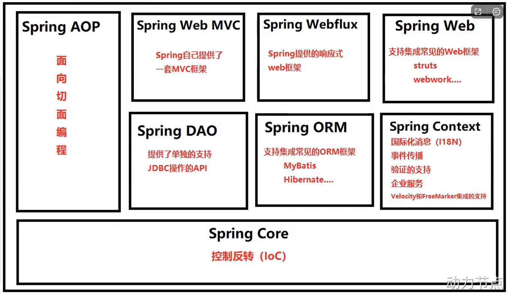
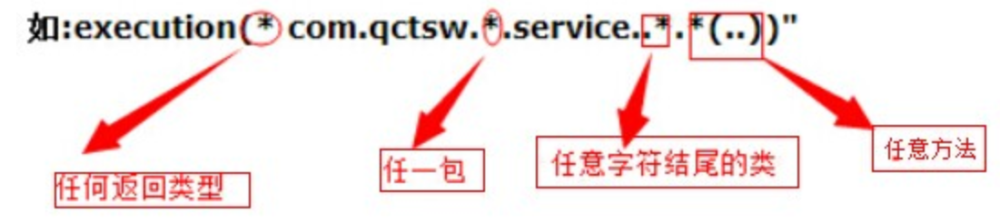

Tips: SSM框架

S：Spring

S：Spring MVC

M：MyBatis：操作数据库

# 1.软件界的七大原则

## 1.1 OCP开闭原则

- **什么是OCP**
  - OCP是软件七大开发原则当中最基本的一个原则：开闭原则
  - 对什么开？对扩展开放
  - 对什么闭？对修改关闭

- OCP原则是最核心的、最基本的，其他的六个原则都是为这个原则服务

- OCP开闭原则的核心是什么？
  - 只要你在扩展系统功能的时候，没有修改以前写好的代码，那么你就是符合OCP原则
  - 反之，如果在扩展系统功能的时候，你修改了之前的代码，那么这个设计师失败的，违背OCP原则

- 当系统功能扩展的时候，如果动了之前稳定的程序，修改了之前的程序，之前所有程序都需要重新测试，这是不想看到的，因为非常麻烦

1.2 依赖倒置原则（DIP原则）

- 什么是依赖倒置原则？
  - 面向接口编程，面向抽象编程，不要面向具体编程
- 依赖倒置原则的目的？
  - 降低程序的耦合度，提高扩展力
- 什么叫做符合依赖倒置？
  - 上 不依赖 下 就是符合


- 什么叫做违背依赖倒置？
  - 上 依赖 下 就是违背
  - 只要“下”一改动，“上”就受到牵连


2 什么是控制反转（IoC）

> 控制反转：IoC（Inversion of Control）

反转是什么呢？

- 反转的是两件事：
  - 第一件事：我不在程序中采用硬编码的方式来new对象了（new对象的权利交出去了）
  - 第二件事：我不在程序中采用硬编码的方式来维护对象的关系了（对象之间的维护权交出去了）
- 控制反转
  - 是一种编程思想，或者叫做一种新型的设计模式。由于出现的比较新，没有被纳入GoF23种设计模式范围内

# 2 Spring概述

## 2.1 什么是Spring

Spring是一个开源框架，2003 年兴起的一个轻量级的Java 开发框架，作者：Rod Johnson 。

**Spring是为了解决企业级应用开发的复杂性而创建的，简化开发。**

**Spring框架**

* Spring框架实现了控制反转IOC这种思想

- Spring框架可以帮你new对象。
- Spring框架可以帮你维护对象和对象之间的关系

- Spring是一个实现了IoC思想的容器。

* 控制反转的实现方式有多种，其中比较重要的叫做：依赖注入(Dependency Injection，简称DI)
* 控制反转是思想。依赖注入是这种思想的具体实现。
* 依赖注入DI，又包括常见的两种方式:

- 第一种: set注入（执行set方法给属性赋值）
- 第二种:构造方法注入（执行构造方法给属性赋值）

* 依赖注入中 “依赖”是什么意思？“注入”是什么意思?

- 依赖: A对象和B对象的关系。
- 注入:是一种手段，通过这种手段，可以让A对象和B对象产生关系。
- 依赖注入:对象A和对象B之间的关系，靠注入的手段来维护。而注入包括: set注入和构造注入。

- 注意术语:
  - OCP:开闭原则（开发原则）
  - DIP:依赖倒置原则 （开发原则）
  - IoC: 控制反转 （一种思想，一种新型的设计模式）
  - DI: 依赖注入（控制反转思想的具体实现方式）

## 2.2 Spring8大模块



## 2.3 Spring特点

1）轻量

- 从大小与开销两方面而言Spring都是轻量的。完整的Spring框架可以在一个大小只有1MB多的JAR文件里发布。并且Spring所需的处理开销也是微不足道的。
- Spring是非侵入式的：Spring应用中的对象不依赖于Spring的特定类

2）控制反转

- Spring通过一种称作控制反转（IoC）的技术促进了松耦合。当应用了IoC，一个对象依赖的其他对象通过被动的方式传递进来，而不是这个对象自己创建或者查找依赖对象。你可以认为IoC于JND相反：不是对象从容器中查找依赖，而是容器在对象初始化时不等对象请求就主动将依赖传递给它。

3）面向切面

- Spring提供了面向切面编程的丰富支持，允许通过分离应用的业务逻辑于系统服务（例如审计（auditing）和事务（transaction）管理）进行内聚性的开发。应用对象只实现它们应该做的：完成业务逻辑，仅此而已。它们并不负责（甚至是意识）其它的系统级关注点，例如日志或事务支持、

4）容器

- Spring包含管理应用对象的配置和生命周期，在这个意义上它是一种容器，你可以配置你的每个bean如何被创建：基于一个可配置原型（prototype），你的bean可以创建一个单独的实例或者每次需要时都生成一个新的实例：以及它们是如何相互关联的。然而，Spring不应该被混同于传统的重量级的EJB容器，它们经常是庞大与笨重的，难以使用。

5）框架

- Spring可以将简单的组件配置、组合成为复杂的应用。在Spring中，应用对象被声明式地组合，典型地是在一个XML文件里。Spring也提供了很多基础功能（事务管理、持久化框架集成等等），将应用逻辑的开发留给了你。

所有Spring的这些特征使你能够编写更干净、更可管理、并且更易于测试的代码。它们也为Spring中的各种模块提供了基础支持。

## 2.4 Spring是如何简化Java开发的

为了降低Java开发的复杂性，Spring采用了以下4种关键策略：

1、基于POJO的轻量级和最小侵入性编程，所有东西都是bean；

2、通过IOC，依赖注入（DI）和面向接口实现松耦合；

3、基于切面（AOP）和惯例进行声明式编程；

4、通过切面和模版减少样式代码，RedisTemplate，xxxTemplate；

# 4.Spring对IoC的实现

## 4.1 IoC控制反转

- 控制反转是一种思想
- 控制反转是为了减低程序耦合度，提高程序扩展力，达到OCP预测，达到DIP原则
- 控制反转，反转的是什么？
  - 将对象的创建权利交出去，交给第三方容器负责
  - 将对象和对象之间关系的维护权交出去，交给第三方容器负责
- 控制反转这种思想如何实现呢？
  - DI（Dependency Injection）:依赖注入

## 4.2 依赖注入

依赖注入实现了控制反转的思想：

==Spring通过依赖注入的方式来完成Bean管理的==

==Bean管理说的是：Bean对象的创建，以及Bean对象中属性的赋值（或者叫做Bean对象之间关系的维护）==

依赖注入：

- 依赖指的是对象和对象之间的关联关系
- 注入指的是一种数据传递行为，通过注入行为来让对象和对象产生关系

依赖注入常见的实现方式包括两种：

- 第一种：set注入
- 第二种：构造注入

## 4.3 P命名空间注入

**目的：**简化配置

使用p命名空间注入的前提条件包括两个：

- 第一：在XML头部信息中添加p命名空间的配置信息：xmlns:p="http://www.springframework.org/schema/p"
- 第二：p命名空间注入是基于setter方法的，所以需要对应的属性提供setter方法

## 4.4 C命名空间注入

c命名空间是简化构造方法注入的

使用C命名空间的两个前提条件：

- 第一：需要在XML配置文件头部添加信息：xmlns:c="http://www.springfamework.org/schema/c"
- 第二：需要提供构造方法

## 4.5 util命名空间注入

使用util命名空间可以让==配置复用==

使用util命名空间的前提是：在Spring配置文件头部添加配置信息。

## 4.6 基于XML的自动装配

Spring还可以完成自动化注入，自动化注入又被称为自动装配，它可以根据**名字**进行自动装配，也可以根据**类型**进行自动装配

# 5 Bean的作用域

5.1 singleton

5.2 prototype

5.3其他scope

scope属性的值不止两个，它一共包括8个选项:

- singleton: 默认的，单例。
- prototype: 原型。每调用一次getBean()方法则获取一个新的Bean对象。或每次注入的时候都是新对象
- request: 一个请求对应一个Bean。==仅限于在WEB应用中使用==
- session:一个会话对应一个Bean。==仅限于在WEB应用中使用==
- global session: ==portlet应用中专用的==。如果在Servlet的WEB应用中使用gobal session的话，和session一个效果。(protlet和servlet都是规范，servet运行在servlet容器中，例如Tomcat。portlet运行在portlet容器中。)
- application：一个应用对应一个Bean。==仅限于在WEB应用中使用==
- websocket：一个websocket生命周期对应一个Bean。==仅限于在WEB应用中使用==
- 自定义scope：很少使用

# 6 GoF之工厂模式

## 6.1工厂模式简介

- 设计模式：一种可以被重复利用的解决方案
- GoF (Gang of Four)，中文名--四人组。
- 《Design Patterns: Elements of Reusable ObjectOriented Software》（即《设计模式》一书） , 1995由 Erch Gamma 、Richard Helm、Ralph Jonson 和Jon Vissides 合著，这几位作者常被称为"四人组Gang of Four)"。
- 该书中描述了23种设计模式。我们平常所说的设计模式就是指这23种设计模式。
- 不过除了GoF23种设计模式之外，还有其它的设计模式，比如: JavaEE的设计模式(DAO模式、MVC模式等)。

## 6.2GoF23种设计模式分类

==GoF23==种设计模式可分为三大类：

- 创建型（5个）：解决对象创建问题
  - 单例模式
  - 工厂方法模式
  - 抽象工厂模式
  - 建造者模式
  - 原型模式
- 结构型（7个）：一些类或对象组合在一起的经典结构
  - 代理模式
  - 装饰模式
  - 适配器模式
  - 组合模式
  - 享元模式
  - 外观模式
  - 桥接模式

- 行为型（11个）：解决类或对象之间的交互问题
  - 策略模式
  - 模板方法模式
  - 责任链模式
  - 观察者模式
  - 迭代子模式
  - 命令模式
  - 备忘录模式
  - 状态模式
  - 访问者模式
  - 中介者模式
  - 解释器模式

工厂模式是解决对象创建问题的，所以工厂模式属于创建型设计模式。

这里为什么学习工厂模式呢？

- 这是因为Spring框架底层使用了大量的工厂模式

## 6.3 工厂模式的三种形态

- 第一种：简单工厂模式（Simple Factory）：不属于23种设计模式之一。简单工厂模式又叫做：静态工厂方法模式。简单工厂模式是工厂方法模式的一种特殊实现
- 第二种：工厂方法模式（Factory Method）：是23种设计模式之一。
- 第三种：抽象工厂模式（Abstract Factory）：是23种设计模式之一。

# 7 Bean的实例化

Spring为Bean提供了多种实例化方式，通常包括4种方式。（也就是说在Spring中为Bean对象的创建者准备了多种方案，目的是：更加灵活）

- 第一种：通过构造方法实例化
- 第二种：通过简单工厂模式实例化
- 第三种：通过factory-bean实例化
- 第四种：通过FactoryBean接口实例化

## 7.1 通过FactoryBean接口实例化

以上的第三种方式中，factory-bean是我们自定义的，factory-method也是我们自己定义的

在Spring中，当你编写的类直接实现FactoryBean接口之后，factory-bean不需要指定了，factory-method也不需要指定了。factory-bean会自动实现FactoryBean接口的类，factory-method会自动指向getObject（）方法。

## 7.2 BeanFactory和FactoryBean的区别

**7.2.1 BeanFactory**

Spring IoC容器的顶级对象，BeanFactory被翻译为“Bean工厂”，在Spring的IoC容器中，“Bean工厂”负责创建Bean对象，BeanFactory是工厂

**7.2.2 FactoryBean**

FactoryBean：它是一个Bean，是一个能够==辅助Spring==实例化其它Bean对象的一个Bean。

在Spring中，Bean可以分为两类：

- 第一类：普通Bean
- 第二类：工厂Bean（记住：工厂Bean也是一种Bean，只不过这种Bean比较特殊，它可以辅助Spring实例化其它Bean对象）

# 8 Bean的生命周期

## 8.1 什么是Bean的生命周期

Spring其实就是一个管理Bean对象的工厂。它负责对象的创建，对象的销毁等。

所谓的生命周期就是：对象从创建开始到最终销毁的整个过程

什么时候创建Bean对象？
创建Bean对象的前后会调用什么方法？

Bean对象什么时候销毁？
Bean对象的销毁前后调用什么方法？

## 8.2 为什么要知道Bean的生命周期

其实生命周期的本质是：在那个时间点上调用了那个类的那个方法。

我们需要充分的了解在这个生命线上，都有哪些特殊的时间节点。

只有我们知道了特殊的时间节点都在那，到时我们才可以确定代码写到哪。

我们可能需要再某个特殊的时间点上执行一段特定的代码，这段代码就可以放到这个节点上。当生命线走到这里的时候，自然会被调用。

## 8.3 Bean生命周期之5步

Bean生命周期的管理，可以参考Spring的源码：AbstractAutowireCapableBeanFactory类的doCreateBean()方法。

Bean生命周期可以粗略的划分为五大步：

- 第一步：实例化Bean（调用无参构造方法）
- 第二步：Bean属性赋值（调用set方法）
- 第三步：初始化Bean（会调用Bean的init方法。注意：这个init方法需要自己写，自己配）
- 第四步：使用Bean
- 第五步：销毁Bean（会调用Bean的destroy方法。注意：这个destroy方法需要自己写，自己配）


## 8.4Bean生命周期之7步

Bean生命周期七步：比五步添加的那两步在哪里？==在初始化Bean的前和后==

- 第一步：实例化Bean
- 第二步：Bean的属性赋值
- 第三步：执行“Bean后处理器”的before方法
- 第四步：初始化Bean
- 第五步：执行“Bean后处理器”的after方法
- 第六步：使用Bean
- 第七步：销毁Bean


## 8.5 Bean生命周期之10步

Bean生命周期十步：比七步加的那三步在哪里？

- 点位1：在“Bean后处理器”before方法之前
  - 干了什么事？
    - 检查Bean是否实现了Aware相关的接口，如果实现了接口则调用这些接口中的方法
    - 然后调用这些方法的目的是为了给你传递一些数据，让你更加方便使用
- 点位2：在“Bean后处理器”before方法之后
  - 干了什么事？
    - 检查Bean是否实现了InitializingBean接口，如果实现了，则调用接口中的方法
- 点位3：使用Bean之后，或者说销毁Bean之前
  - 干了什么事？
    - 检查Bean是否实现了DisposableBean接口，如果实现了，则调用接口中的方法

添加的这三个点位的特点：都是在检查你这个Bean是否实现了某些特定的接口，如果实现了这些接口，则Spring容器会调用这个接口中的方法。


## 8.6 Bean的作用域不同，管理方式不同

Spring根据Bean的作用域来选择管理方式：

- 对于singletion作用域的Bean，Spring能够精确地知道该Bean何时被创建，何时初始化完成，以及何时被销毁
- 而对于prototype作用域的Bean，Spring只负责创建，当容器创建了Bean的实例后，Bean的实例就交给了客户端代码管理，Spring容器将不再跟踪其生命周期。

# 9 Bean的循环依赖问题

## 9.1什么是Bean的循环依赖

A对象中有B属性。B对象中有A属性。这就是循环依赖。我依赖你，你也依赖我

比如：丈夫类（Husband），妻子类（Wife）。Husband中有Wife的引用，Wife中有Husband的引用


## 9.2 Spring解决循环依赖的机理

Spring为什么可以解决set + singleton模式下循环依赖?

- 根本的原因在于：这种方式可以做到将“实例化Bean”和“给Bean属性赋值”这两个动作分开去完成。

- 实例化Bean的时候：调用无参数构造方法来完成==。此时可以先不给属性赋值，可以提前将该Bean对象“曝光”给外界==。

- 给Bean属性赋值的时候：调用setter方法来完成。
- 两个步骤是完全可以分离开去完成的，并且这两步不要求在同一个时间点上完成，也就是说，Bean都是单例的，我们可以先把所有的单例Bean实化出来，放到一个集合当中（我们称之为缓存），所有的单例Bean全部实例化完成之后，以后我们再慢慢的调用setter方法给属性赋值。这样就解决了循环依赖的问题。

**源码分析:**
DefaultSingletonBeanRegistry类中有三个比较重要的缓存:

| 方法                                                         | 说明     |
| ------------------------------------------------------------ | -------- |
| private final Map<String, Object> singletonObjects           | 一级缓存 |
| private final Map<String, Object> earlySingletonObjects      | 二级缓存 |
| private final Map<String， ObjectFactory<?>> singletonFactories | 三级缓存 |

这三个缓存都是Map集合。
Map集合的key存储的都是bean的name (bean id)

- 一级缓存存储的是：单例Bean对象。完整的单例Bean对象，也就是说这个缓存中的Bean对象的属性都已经赋值了。是一个完整的Bean对象。
- 二级缓存存储的是：早期的单例Bean对象。这个缓存中的单例Bean对象的属性没有赋值。只是一个早期的实例对象。
- 三级缓存存储的是:单例工厂对象。这个里面存储了大量的“工厂对象"，每一个单例Bean对象都会对应一个单例工厂对象。这个集合中存储的是，创建该单例对象时对应的那个单例工厂对象。

# 10 Spring IoC注解式开发

## 10.1 声明Bean的注解

负责生命Bean的注解，常见的包括四个：

- @Component
- @Controller
- @Service
- @Repository

## 10.2 Spring注解的使用

如何使用以上的注解呢？

第一步：加入aop的依赖

第二步：在配置文件中添加context命名空间

第三步：在配置文件中指定扫描的包

第四步：在Bean类上使用注解

## 10.3 负责注入的注解

@Component @Controller @Service @Repository这四个注解是用来声明Bean的，声明后这些Bean将被实例化。接下来我们看一下，如何给Bean的属性赋值，给Bean属性赋值需要用到的这些注解：

- @Value
- @Aotowired
- @Qualifier
- @Resource

**10.3.1 @Value**

当属性的类型是简单类型时，可以使用@Value注解进行注入

**10.3.2 @Autowired和@Qualifier**

@Autowired注解可以用来注入==非简单类型==。被翻译为：自动连线，或者自动装配

单独使用@Autowired注解，==默认根据类型装配==。【默认是byType】

源码中有两处需要注意：

- 第一处：该注解可以标注在哪里？
  - 构造方法上
  - 方法上
  - 形参上
  - 属性上
  - 主街上
- 第二处：该注解有一个required属性，默认值是true，表示在注入的时候要求被注入的Bean必须是存在的，如果不存在则报错。如果required属性设置为false，表示注入的Bean存在或者不存在都没关系，存在的话就注入，不存在的话，也不报错。

**10.3.3 @Resource**

@Resource注解也可以完成非简单类型注入。那它和@Autowired注解有什么区别？

- @Resource注解是JDK扩展包中的，也就是说属于JDK的一部分。所以该注解是标准注解，更加具有通用性。（JSR-250标准中制定的注解类型。JSR是Java规范提案）
- @Autowired注解是Spring框架自己的
- ==@Resource注解默认根据名称装配byName,未指定name时，使用属性名作为name。通过name找不到的话会自动启动通过类型byType装配==
- ==@Autowired注解默认根据类型装配byType，如果想根据名称装配，需要配合@Qualifier注解一起使用==
- @Resource注解用在属性上、setter方法上
- @Autowired注解用在属性上、setter方法上、构造方法上、构造方法参数上

# 11. GoF之代理模式

> 代理，就是你委托别人帮你办事，所以代理模式也有人称作委托模式的。
>
> 比如领导要做什么事，可以委托他的秘书去帮忙做，这时就可以把秘书看做领导的代理。
>
> 代理模式又分为静态代理和动态代理。

[参考文档](https://www.cnblogs.com/joy99/p/10865391.html)

## 11.1 对代理模式的理解

> 生活场景1：牛村的牛二看上了隔壁村小花，牛二不好意直接找小花，于是牛二找来了煤婆王妈妈，这里面就有一个非常经典的代理模式。牛二不和小花直接对接，只能找一个中间人。其中王妈妈是==代理类==，牛二是==目标类==。王妈妈代替牛二和小花先见个面。 (现实生活中的婚介所)【在程序中，对象A和对象B无法直接交互时。】
>
> 生活场景2:你刚到北京，要租房子，可以自已找，也可以找链家帮你找，其中链家是==代理类==，你是==目标类==，你们两个都有共同的行为：找房子。不过链家除了满足你找房子，另外会收取一些费用的。（现实生活中的房产中介)【在程序中，功能需要增强时。】
>
> 西游记场景:八戒和高小姐的故事，八戒要抢民女高翠兰，悟空得知此事之后怎么做的？悟空幻化成高小姐的模样，代替高小姐与八戒约会，其中八戒是==客产端程序==。悟空是==代理类==，高小姐是==目标类==，那天夜里，在八就眼里，眼前的就是高小姐，对于八戒来说，他是不知道眼前的高小姐是悟空幻化的，在他内心里这就是高小姐。所以悟空代替了高小姐和八戒亲了嘴儿。这是非常典型的代理算式实现的保护有制。代==理模式中有一个非常重要的特点:对于客户端程序来说，使用代理对象时就像在使用目标对象一样==。【在程序中，目标需要被保护时】
>
> 业务场景：系统中有A、B、C三个模块，使用这些模块的前提是需要用户登录，也就是说在A模块中要编写判断登录的代码，B模块中也要编写，C模块中还要编写，这些判断登录的代码反复出现。显然代码没有得到复用，可以为A、B、C三个模央提供一个代理，在代理当中写一次登录判断即可。代理的逻辑是：:请求来了之后，判断用户是否登录了，如果已经登录了，则执行对应的目标，如果没有登录则跳转到登录页面。【在程序中，目标不但受到保护，并且代码也得到了复用。】

代理模式是GoF23种设计模式之一。属于结构型设计模式
==代理模式的作用是==：为其他对象提供一种代理以控制对这个对象的访问。在某些情况下，一个客户不想或者不能直接引用一个对象，可以通过一个称之为“代理”的第三者来实现间接引用。代理对象可以在客广端和目标对象之间起到中介的作用，并且可以通过代理对象去掉客户不应该看到的内容和服务或者添动客户需要的额外服务，通过引人一个新的对象来实现对真实对象的操作或者将新的对象作为真实对象的一个替身，这种实现机制即为代理模式，通过引入代理对象来间接访问一个对象，这就是代理模式的模式动机。

- 代理模式中的角色:
  - 代理类 (代理主题)
  - 目标类 (真实主题)
  - 代理类和目标类的公共接口(抽象主题)：客户端在使用代理类时就像在使用目标类，不被客户端所察觉，所以代理类和目标类要有共同的行为，也就是实现共同的接口。


**代理模式的类图**


代理模式在代码实现上，包括两种形式：

- 静态代理
- 动态代理


## 11.2. 静态代理

**静态代理的使用**：

静态代理，代理类和被代理的类实现了同样的接口，代理类同时持有被代理类的引用，这样，当我们需要调用被代理类的方法时，可以通过调用代理类的方法来做到。

**先定义接口**：

```java
public interface Work {
    void meeting();
    int evaluate(String name);
}
```

**然后定义领导类**：

```java
public class Leader implements Work {
    @Override
    public void meeting() {
        System.out.println("领导早上要组织会议");
    }
    @Override
    public int evaluate(String name) {
        // 生成 0-20 的随机数 + 80
        int score = new Random(System.currentTimeMillis()).nextInt(20) + 80;
        System.out.println(String.format("领导给%s的考评为%s分", name, score));
        return score;
    }
}
```

**再定义秘书类**：

```java
public class Secretary implements Work {

    private Leader leader = new Leader();

    @Override
    public void meeting() {
        System.out.println("秘书先给老板准备材料");
        leader.meeting();
    }

    @Override
    public int evaluate(String name) {
        return leader.evaluate(name);
    }
}
```

**测试**：

```java
@Test
public void secretaryProxyLeader() {
    Secretary secretary = new Secretary();
    secretary.meeting();
    secretary.evaluate("Tom");
}
```

```java
// 运行结果
秘书先给老板准备材料
领导早上要组织会议
领导给Tom的考评为83分
```


> **代理模式与装饰着模式的区别**？
>
> 实际上，在装饰器模式和代理模式之间还是有很多差别的。
>
> - 装饰器模式关注于在一个对象上动态的添加方法，然而代理模式关注于控制对对象的访问。
> - 换句话说，用代理模式，代理类（proxy class）可以对它的客户隐藏一个对象的具体信息。因此，当使用代理模式的时候，我们常常在一个代理类中创建一个对象的实例。并且，当我们使用装饰器模式的时候，我们通常的做法是将原始对象作为一个参数传给装饰者的构造器。
>
> 我们可以用另外一句话来总结这些差别：静态代理是一种编译期增强，还没运行就已经知道增强的目标对象。装饰者是运行时增强，只有运行时才知道具体增强的目标。

其实代理模式和装饰者模式侧重点不一样，代理模式重点在于明确了被代理的类。如上例中，秘书很明确要代理的是的领导。而装饰者模式侧重于拓展类的方法。

## 11.3 动态代理

在程序运行阶段，在内存中动态生产代理类，被称为动态代理，目的是为了减少代理类的数量，解决代码复用的问题

在内存当中动态生成类的技术常见的包括：

- JDK动态代理技术：只能代理接口
- CGLIB动态代理技术：CGLIB（Code Generation Library）是一个开源项目。是一个强大的、高性能、高质量的Code生成类库，它可以在运行期扩展Java类于实现Java接口。它就可以代理接口，又可以代理类，底层是通过继承的方式实现的。性能比JDK动态代理要好（底层有一个小而快的字节码处理框架ASM）
- javassist动态代理技术：Javassist是一个开源的分析、编辑和创建Java字节码的类库。是由东京工业大学的数学和计算机科学家系的Shigeru Chiba（千叶滋）所创建的。它已加入了开放源代码Jboss应用服务器项目，通过使用Javassist对字节码操作为Jboss实现动态”AOP“框架。

### 11.3.1 JDK动态代理

动态代理的根据实现方式的不同可以分为 JDK 动态代理和 CGlib 动态代理。

1. JDK 动态代理：利用反射机制生成一个实现代理接口的类，在调用具体方法前调用InvokeHandler来处理。

2. CGlib 动态代理：利用ASM（开源的Java字节码编辑库，操作字节码）开源包，将代理对象类的class文件加载进来，通过修改其字节码生成子类来处理。

区别：JDK代理只能对实现接口的类生成代理；CGlib是针对类实现代理，对指定的类生成一个子类，并覆盖其中的方法，这种通过继承类的实现方式，不能代理final修饰的类。

还是以上面的例子为例：
**首先，定一个类实现 InvocationHandler 接口，并实现 invoke 方法**：

> 1.为什么强行要求你必须实现InvocationHandler接口?
>
> - 因为一个类实现接口就必须实现接口中的方法。
> - 以下这个方法必须是invoke()，因为JDK在底层调用invoke()方法的程序已经提前写好了
> - 注意： invoke 方法不是我们程序员负责调用的，是JDK负责调用的invoke方法
>
> 2.什么时候被调用呢?
>
> - 当代理对象调用代理方法的时候，注册在InvocationHandler 调用处理器当中的invoke()方法被调用
>
> 3.invoke 方法的三个参数:
>
> - invoke 方法是JDK负责调用的，所以JDK 调用这个方法的时候会自动给我们传过来这三个参数
> - 我们可以在invoke 方法的大括号中直接使用。
> - 第一个参数: object proxy 代理对象的引用。这个参数使用较少。
> - 第二个参数: Method method 目标对象上的目标方法。 (要执行的目标方法就是它。)
> - 第三个参数: object[] args 目标方法上的实参。

```java
/**
 * InvocationHandler是由代理实例的调用处理程序实现的接口 。
 * 每个代理实例都有一个关联的调用处理程序。
 * 当在代理实例上调用方法时，方法调用将分派到其调用处理程序的invoke()方法。
 *
 * @author Ringo
 * @date 2021/4/29 19:21
 */
@Slf4j
public class WorkInvocationHandler implements InvocationHandler {

    // 被代理对象
    private Leader leader;

    public WorkInvocationHandler(Leader leader) {
        this.leader = leader;
    }

    /**
     * 执行被代理对象每个方法前都会调用 invoke
     * proxy: 代理对象。
     * method: 接口中的方法。
     * args：方法的参数。
     *
     * @author Ringo
     * @date 2021/4/29
     */
    @Override
    public Object invoke(Object proxy, Method method, 
                         Object[] args) throws Throwable {
        if ("meeting".equals(method.getName())) {
            // 在执行目标方法前的操作
            System.out.println("代理先准备会议材料...");
            
            // 执行目标方法 
            return method.invoke(leader, args);
        }

        if ("evaluate".equals(method.getName())) {
            log.info("evaluate(String name)的name:" + args[0]);
            return method.invoke(leader, args);
        }

        return null;
    }
}
```

**测试**：

```java
@Test
public void dynamicProxy() {
    Leader leader = new Leader();
    Work proxy = (Work) Proxy.newProxyInstance(
        Leader.class.getClassLoader(),
        new Class[]{Work.class},
        new WorkInvocationHandler(leader));
    proxy.meeting();
    proxy.evaluate("Tom");
}

// loader: 类加载器
// interfaces: 被代理对象实现的接口
// h: InvocationHandler 实现类, 用于增强被代理对象
public static Object newProxyInstance(ClassLoader loader,
                                      Class<?>[] interfaces,
                                      InvocationHandler h);
```

```java
// 测试结果
代理先准备会议材料...
领导早上要组织会议
com.ymy.proxy.dynamic.WorkInvocationHandler - evaluate(String name)的name:Tom
领导给Tom的考评为81分
```


### 11.3.2 CGlib动态代理

**添加 cglib 依赖**：

```xml
<dependency>
    <groupId>cglib</groupId>
    <artifactId>cglib</artifactId>
    <version>3.3.0</version>
</dependency>
```


**cglib 针对类进行代理，我们以上面的 Leader 类为例，先创建一个类实现 MethodInterceptor 接口**:

```java
/**
 * cglib动态代理
 *
 * @author Ringo
 * @date 2021/4/29 20:23
 */
@Slf4j
public class LeaderMethodInterceptor implements MethodInterceptor {
    /**
     * obj: 增强的代理对象(继承自被代理对象)
     * method: 拦截的方法(被代理对象需要执行的方法)
     * args: 拦截方法的参数
     * proxy: 触发父类的方法对象(执行父类的方法)
     * 需要注意的是，实际调用是 methodProxy.invokeSuper()。
     * 如果使用 invoke() 方法，则需要传入被代理的类对象，否则出现死循环，造成 stackOverflow 。
     *
     * @author Ringo
     * @date 2021/4/29
     */
    @Override
    public Object intercept(Object obj, 
                            Method method, Object[] args, 
                            MethodProxy proxy) throws Throwable {
        if ("meeting".equals(method.getName())) {
            // 执行目标方法前的业务
            System.out.println("代理先准备会议材料...");

            // 执行目标方法
            return proxy.invokeSuper(obj, args);
        }

        if ("evaluate".equals(method.getName())) {
            log.info("evaluate(String name)的name:" + args[0]);
            return proxy.invokeSuper(obj, args);
        }
        return null;
    }
}
```

**测试**：

```java
@Test
public void cglibDynamicProxy() {
    //1. 创建字节码增强器, 用来对被代理的类扩展。
    Enhancer enhancer = new Enhancer();
    //2. 告诉cglib,生成的子类需要继承那个父类。
    enhancer.setSuperclass(Leader.class);
    //3. 设置回调
    enhancer.setCallback(new LeaderMethodInterceptor());
    //4. 生成源代码,编译成class文件,加载到jvm,并返回代理对象。
    Leader proxy = (Leader)enhancer.create();

    proxy.meeting();
    proxy.evaluate("Tom");
}
```

```java
// 测试结果
代理先准备会议材料...
领导早上要组织会议
com.ymy.proxy.dynamic.LeaderMethodInterceptor - 
    evaluate(String name)的name:Tom
领导给Tom的考评为99分

```


# 12. 面相切面编程AOP

IoC使软件组件松耦合，AOP让你能够捕捉系统中经常使用的功能，把它转化成组件

AOP（Aspect Oriented Programing）：面向切面编程，面向方面编程（AOP是一种编程技术）

AOP是对OOP的补充延伸

AOP底层使用的就是动态代理来实现的

Spring的AOP使用的动态代理是：JDK动态代理+CGLIB动态代理技术。Spring在这两种动态代理中灵活切换，如果是代理接口，会默认使用JDK动态代理，如果是代理某个类，这个类没有实现接口，就会切换使用CGLIB。当然，你也可以强调通过一些配置让Spring只使用CGLIB

## 12.1. AOP介绍

[参考文档](https://www.cnblogs.com/joy99/p/10941543.html)

AOP 领域中的特性术语：

- 通知（Advice）: AOP 框架中的增强处理。通知描述了切面何时执行以及如何执行增强处理。
- 连接点（join point）: 连接点表示应用执行过程中能够插入切面的一个点，这个点可以是方法的调用、异常的抛出。在 Spring AOP 中，连接点总是方法的调用。
- 切点（PointCut）: 可以插入增强处理的连接点。
- 切面（Aspect）: 切面是通知和切点的结合。
- 引入（Introduction）：引入允许我们向现有的类添加新的方法或者属性。
- 织入（Weaving）: 将增强处理添加到目标对象中，并创建一个被增强的对象，这个过程就是织入。

> AOP 框架有很多种， AOP 框架的实现方式有可能不同， Spring 中的 AOP 是通过动态代理实现的。不同的 AOP 框架支持的连接点也有所区别，例如，AspectJ 和 JBoss, 除了支持方法切点，它们还支持字段和构造器的连接点。而 Spring AOP 不能拦截对对象字段的修改，也不支持构造器连接点,我们无法在 Bean 创建时应用通知。

一般一个系统当中都会有一些系统服务，例如：日志、事务管理、安全等。这些系统服务被称为：==交叉服务==

这些交叉服务几乎是通用的，不管你是做银行账户转账，还是删除用户数据。日志、事务管理、安全，这些都是需要做的。

如果在每一个业务处理过程当中，都掺杂这些交叉业务代码进去的话存在两方面的问题：

- 第一：交叉业务代码在多个业务流程中反复出现，显然这个交叉业务代码没有得到复用，并且修改这些交叉业务代码的话，需要修改多处。
- 第二：程序员无法专注核心业务代码的编写，在编写核心业务代码的同时还需要处理这些交叉业务

使用AOP可以很轻松的解决以上问题。

==快速理解AOP的思想：==


用一句话总结AOP：将与核心业务无关的代码独立的抽取出来，形成一个独立的组件，然后以横向交叉的方式应用到业务流程当中的过程被称为AOP

AOP的优点：

- 第一：代码复用性增强
- 第二：代码易维护
- 第三：使开发者更关注业务逻辑

AOP的七大术语：

- 连接点Joinpoint
  - 在程序的整个执行流程中，可以织入切面的位置。方法的执行前后，异常抛出之后等位置。
- 切点Pointcut
  - 在程序执行流程中，真正织入切面的方法（一个切点对应多个连接点）

- 通知Advice
  - 通知又叫曾强，就是具体你要织入的代码
  - 通知包括：
    - 前置通知
    - 后置通知
    - 环绕通知
    - 异常通知
    - 最终通知
- 切面Aspect
  - 切点+通知就是切面
- 织入Weaving
  - 把通知应用到目标对象上的过程
- 代理对象Proxy
  - 一个目标对象被织入通知后产生的新对象
- 目标对象Target
  - 被织入通知的对象

AOP的七大术语：


## 12.2 切入点表达式

切点表达式用来定义通知 (Advice) 往哪些方法上切入

切入点表达式语法格式

```java
execution([访问控制权限修饰符] 返回值类型 [全限定类名]方法名(形式参数列表)[异常])
```

访问控制权限修饰符。

- 可选项
- 没写，就是4个权限都包括
- 写public就表示只包括公开的方法

返回值类型:

- 必填项
- *表示返回值类型任意

全限定类名

- 可选项。
- 两个点“..”代表当前包以及子包下的所有类
- 省略时表示所有的类

方法名

- 必填项
- *表示所有方法。
- set*表示所有的set方法

形式参数列表:

- 必填项
- ()表示没有参数的方法
- (..)参数类型和个数随意的方法
- (*)只有一个参数的方法
- (*,String)第一个参数类型随意，第二个参数是String的。

异常：

- 可选项
- 省略时表示任意异常类型

## 12.3 使用Spring的AOP

Spring对AOP的实现包括一下三种方式：

- ==第一种方式：Spring框架结合Aspect框架实现的AOP，基于注解方式==
- ==第二种方式：Spring框架结合Aspect框架实现的AOP，基于XML方式==
- 第三种方式：Spring框架自己实现的AOP，基于XML配置方式

> 实际开发中，都是Spring+AspectJ来实现AOP，所以AspectJ框架是独立于Spring框架之外的一个框架，Spring框架用了AspectJ
>
> 什么是AspectJ? (Edipse组织的一个支持AOP的框架。AspectJ框架是独立于Spring框架之外的一个框架，Spring框架用了AspectJ）Aspectu项目起源于帕洛网阿尔托(Palo Ato） 研究中心（缩写为PAR)  该中心Xerox集团资助，Gregor kczaes须导，从1997年致力于AspectJ的开发，1998年第一次发布给外部用户，2001年发布1.0 release，为了推动AspectJ技术和社团的发展，PARC在2003年3月正式将AspetJ项移交给了Eclipse组织，因为Aspectl的发展和受关注程度大大超出了PARC的预期，他们已经无力继续维持它的发展。

## 12.4. Spring AOP通知

**Spring AOP 中有 5 种通知类型，分别如下**：

| 类型     | 注解            | 通知                                                         |
| -------- | --------------- | ------------------------------------------------------------ |
| 前置通知 | @Before         | 目标方法执行调用之前的通知                                   |
| 后置通知 | @AfterReturning | 目标方法执行调用之后的通知                                   |
| 环绕通知 | @Around         | 目标方法执行调用之前添加通知，同时目标方法执行调用之后添加通知 |
| 异常通知 | @AfterThrowing  | 发生异常之后执行的通知                                       |
| 最终通知 | @After          | 放在finally语句块中的通知                                    |

> **spring aop execution表达式:**
>
> execution **中第一个\*表示任何返回类型.** 
>
> **要注意一点,类名需要用一个.占位**。



## 12.5. 注解配置Spring AOP

**声明一个接口和它的实现类**：

```java
public interface IBuy {
    void buy();
}

@Component
public class Boy implements IBuy {

    @Override
    public void buy() {
        System.out.println("男孩买了一个游戏机！");
    }
}

@Component
public class Girl implements IBuy {

    @Override
    public void buy() {
        System.out.println("女孩买了一条裙子！");
    }
}
```

**声明切面**：

```java
@Aspect
@Component
public class BuyAspectJ {
    
    // 切入点
    @Pointcut("execution(* com.ymy.aop.IBuy.buy(..))")
    public void point() {
    }

    // 前置通知
    @Before("point()")
    public void before() {
        System.out.println("before");
    }

    // 后置通知
    @After("point()")
    public void after() {
        System.out.println("after");
    }

    // 环绕通知
    @Around("point()")
    public void around(ProceedingJoinPoint pjp) {
        try {
            System.out.println("around before");
            pjp.proceed();
            System.out.println("around after");
        } catch (Throwable throwable) {
            throwable.printStackTrace();
        }
    }
}
```

**测试**：

```java
@SpringBootTest
public class TestAop {
    @Resource
    private Boy boy;

    @Resource
    private Girl girl;

    @Test
    public void test() {
        boy.buy();
        System.out.println("---- 分隔符 ---- ");
        girl.buy();
    }
}
```

```java
// 测试结果
around before
before
男孩买了一个游戏机！
after
around after
---- 分隔符 ---- 
around before
before
女孩买了一条裙子！
after
around after
```


```java
@Pointcut("execution(* com.sharpcj.aopdemo.test1.IBuy.buy(..))")
public void point(){}
```

声明了一个切点表达式，该方法 point 的内容并不重要，方法名也不重要，实际上它只是作为一个标识，供通知使用。

## 12.6. 注解处理通知的参数

```java
@Aspect
@Component
public class BuyAspectJ {
    @Pointcut("execution(* com.ymy.aop.IBuy.buy(double)) && args(price)")
    public void point1(double price) {

    }

    @Before("point1(price)")
    public void before(double price) {
        System.out.println(price);
    }
}
```

# 13 Spring对事务的支持

## 13.1事务概述

什么是事务：

- 在一个业务流程当中，通常需要多条DML（insert delete update）语句共同联合才能完成，这多条DML语句必须同时成功，或者同时失败，这样才能保证数据的安全
- 多条DML要么同时成功，要么同时失败，这叫做事务
- 事务：Transaction（tx）

事务的四个处理过程：

- 第一步：开启事务（start transaction）
- 第二步：执行核心业务代码
- 第三步：提交事务（如果核心业务处理过程中没有出现异常）（commit transaction）
- 第四步：回滚事务（如果核心业务处理过程中出现异常）（rollback transaction）

事务的四个特性：

- A原子性：事务是最小的工作单元，不可再分
- C一致性：事务要求要么同时成功，要么同时失败，事务前事务后的总量不变
- I隔离性：事务和事务之间因为有隔离性，才可以保证互不干扰
- D持久性：持久性是事务结束的标志


## 13.2 事务的传播行为

什么是事务的传播行为？

在Service类中有a()方法和b()方法，a()方法上有事务，b()方法上也有事务，当a()方法执行过程中调用了b()方法，事务是如何传递的？合并到一个事务里？还是开启一个新的事物？这就是事物传播行为

事务传播行为在Spring框架中被定义为枚举类型

```java
package org.springframework.transaction.annotation;

public enum Propagation{
    //支持当前事务，如果不存在就新建一个（默认）【没有就新建，有就加入】
    REQUIRED(0);
    //支持当前事务，如果当前没有事务，就以非事务方式执行【有就加入，没有就不管了】
    SUPPORTS(1);
    //必须运行在一个事务中，如果当前没有事务正在发生，将抛出一个异常【有就加入，没有就抛异常】
    MANDATORY(2);
    //开启一个新的事物，如果一个事务已经存在，则将这个存在的事物挂起【不管有没有，直接开启一个新的事务，开启的新事务和之前的事务不存在嵌套关系，之前事务被挂起】
    REQUIRES_NEW(3);
    //以非事务方式运行，如果有事务存在，挂起当前事务【不支持事务，存在就挂起】
    NOT_SUPPORTED(4);
    //不支持事务，存在就抛异常
    NEVER(5);
    //如果当前正有一个事务在进行中，则该方法应当运行在一个嵌套式事务可以独立于外层事务进行提交或回滚，如果外层事务不存在，行为就像REQUIRED一样。【有事务的话，就在这个事务里再嵌套一个完全独立的事务，嵌套的事务可以独立的提交和回滚，没有事务就和REQUIRED一样】
    NESTED(6)
}
//在代码中设置事务的传播行为
@Transactional(propagation = Propagation.REQUIRED)
```

## 13.3事务隔离级别

事务隔离级别类似于教室A和教室B之间的那道墙，隔离级别越高表示墙体越厚。隔音效果越好数据库中读取数据存在的三大问题: (三大读问题)

- 脏读: 读取到没有提交到数据库的数据，叫做脏读
- 不可重复读: 在同一个事务当中，第一次和第二次读取的数据不一样。
- 幻读: 读到的数据是假的。

事务隔离级别包括四个级别:

- 读未提交: READ_UNCOMMITTED
  - 这种隔离级别，存在脏读问题，所谓的脏读(dirty read)表示能够读取到其它事务未提交的数据。

- 读提交: READ_COMMITTED
  - 解决了脏读问题，其它事务提交之后才能读到，但存在不可重复读问题。

- 可重复读: REPEATABLE_READ
  - 解决了不可重复读，可以达到可重复读效果，只要当前事务不结束，读取到的数据一直都是一样的。但存在幻读问题

- 序列化: SERIALIZABLE。
  - 解决了幻读问题，事务排队执行。不支持并发。

| 隔离级别 | 脏读 | 不可重复读 | 幻读 |
| -------- | ---- | ---------- | ---- |
| 读未提交 | 有   | 有         | 有   |
| 读提交   | 无   | 有         | 有   |
| 可重复读 | 无   | 无         | 有   |
| 序列化   | 无   | 无         | 无   |

**服务超时**

代码如下

```java
@Transactional(timeout = 10)
```

以上代码表示设置事务的超时时间为10秒

表示超过10秒如果该事务中的==所以DML语句==（最后一条DML结束）没有执行完毕的话，最终结果会选择回滚

默认值-1，表示没有时间限制

事务的超时时间指的是那段时间？

- 在当前事务中，最后一条DML语句执行之前的时间。如果最后一条DML语句后面还有很多业务逻辑，这些业务代码执行的时间不被计入超时时间

**只读事务：**

代码如下：

```java
@Transactional(readOnly = true)
```

将当前事务设置为只读事务，在该事务执行过程中只允许select语句执行，delete insert update均不可执行。

该特性的作用是：启动Spring的优化策略，提高select语句执行效率

如果该事务中确实没有增删改操作，建议设置为只读事务

**设置哪些异常回滚事务：**

代码如下：

```java 
Transactional(rollbackFor = RuntimeException.class)
```

表示只有发生RuntimeException异常或该异常的子类异常才回滚

**设置哪些异常不回滚事务：**

代码如下

```java
@Transactional(noRollbackFor = NullPointerException.class)
```

表示发生NullPointerException或该异常的子类异常不回滚，其他异常则回滚

# 14 Spring6集成MyBatis3.5

实现步骤：

- 第一步：准备数据库表
  - 使用t_+act（账户表）
- 第二步：在IDEA中创建一个模块，并引入依赖
  - spring-context
  - spring-jdbc
  - mysql驱动
  - mybatis
  - mybatis-spring：mybatis提供的与Spring框架集成的依赖
  - 德鲁伊连接池
  - junit
- 第三步：基于三层架构实现，所以提前创建好所有的包
  - com.linrushao.bank.mapper
  - com.linrushao.bank.service
  - com.linrushao.bank.service.impl
  - com.linrushao.bank.pojo
- 第四步：编写pojo
  - Account，属性私有化，提供公开的setter，getter和toString
- 第五步：编写mapper接口
  - AccountMapper接口，定义方法
- 第六步：编写Mapper配置文件
  - 在配置文件中配置命名空间，以及每一个方法对应的SQL
- 第七步：编写service接口和service接口实现类
  - AccountService
  - AccountServiceImpl
- 第八步：编写jdbc.properties配置文件
  - 数据库连接池相关信息
- 第九步：编写mabatis-config.xml配置文件
  - 该文件可以没有，大部分的配置可以转移到spring配置文件中
  - 如果遇到mybatis相关的系统级配置，还是需要这个文件。

- 第十步：编写spring.xml文件
  - 组件扫描
  - 引入外部的属性文件
  - 数据源
  - SqlsessionFactory配置
    - 注入mybatis核心配置文件路径
    - 指定别名包
    - 注入数据源
  - Mapper扫描配置器
    - 指定扫描的包
  - 事务管理器DataSourceTransactionManager
    - 注入数据源
  - 启用事务注解
    - 注入事务管理器
- 第十一步：编写测试程序，并添加事务，进行测试

# 15 Spring中的八大模式

**15.1 简单工厂模式**

BeanFactory的getBean()方法，通过唯一标识来获取Bean对象，是典型的简单工厂模式（静态工厂模式）

**15.2工厂方法模式**

FactoryBean是典型的工厂方法模式。在配置文件中通过factory-method属性来指定工厂方法，该方法是一个实例方法

**15.3单例模式**

Spring用的是双重判断加锁的单例模式，

**15.4代理模式**

Spring的AOP就是使用动态代理实现的

**15.5装饰器模式**

JavaSE中的IO流就是非常经典的装饰器模式

Spring中高配置DataSource的时候，这些dataSource可能是各种不同类型的，比如不同的数据库：Oracle,SQL server、MySQL等，也可能是不同的数据源，比如Apache提供的org.apache.commons.dbcp.BasicDataSource、Spring提供的org.springframework.jndi.JndiObjectFactoryBean等。这时，能否在尽可能少修改原有类代码下的情况，做到动态切换不同的数据源？此时就可能用到装饰器模式。

Spring工具每次请求的不同，将dataSource属性设置成不同的数据源，已达到切换数据源的目的

Spring中类名中带有：Decorator和Wrapper单词的类，都是装饰器模式

**15.6观察者模式**

定义对象间的一对多的关系，当一个对象的状态发生改变时，所有依赖于它的对象都得到通知并自动更新，Spring中观察者模式一般用在listener的实现

Spring中的事件编程模式就是观察者模式的实现，在Spring中定义了一个Application接口，用来监听Application其实就是ApplicationContext，ApplicationContext内置了几个事件，其中比较容易理解的是：ContextRefreshedEvent、ContextStartedEvent、ContextStoppedEvent、ContextCloseEvent

>Servlet中的ServletContextListener就是一个观察者模式
>
>观察者：ServletContextListener
>
>被观察者：ServletContext
>
>事件：ServletContext对象被创建，或ServletContext对象被销毁

**15.7策略模式**

策略模式是行为性模式，调用不同方法，适应行为的变化，强调父类的调用子类的特性

getHandler是HandlerMapping接口中唯一方法，用于根据请求找到匹配的处理器

比如我们自己写了AccountDao接口，然后这个接口有不同的实现类：AccountDaoForMySQL、AccountDaoForOracle。对于service来说不需要关系底层具体的实现，只需要面向AccountDao接口调用，底层可以灵活切换实现，这就是策略模式

**15.8模版方法模式**

Spring中的JdbcTemplate类就是一个模板类，它就是一个模板方法设计模式的体现，在模板类的模板方法execute中编写核心算法，具体的实现步骤在子类中完成

