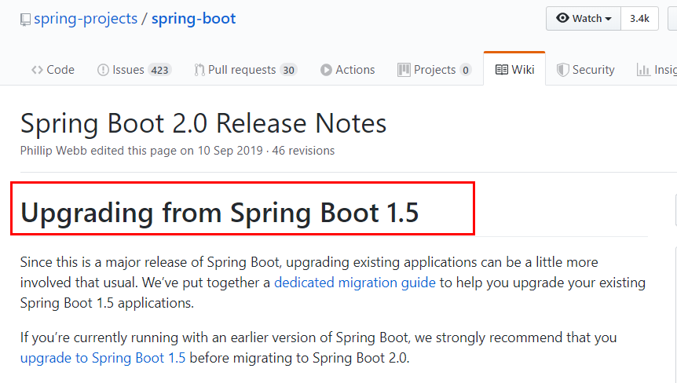
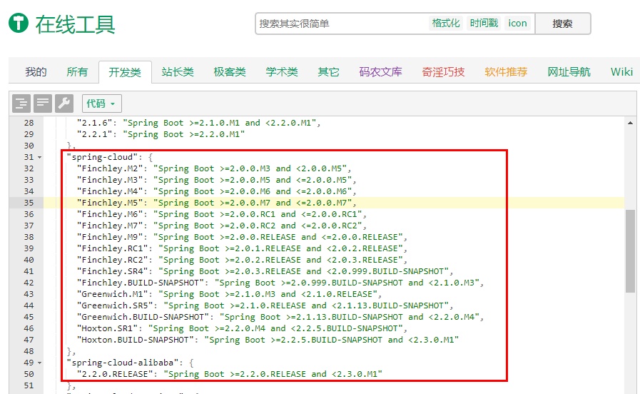
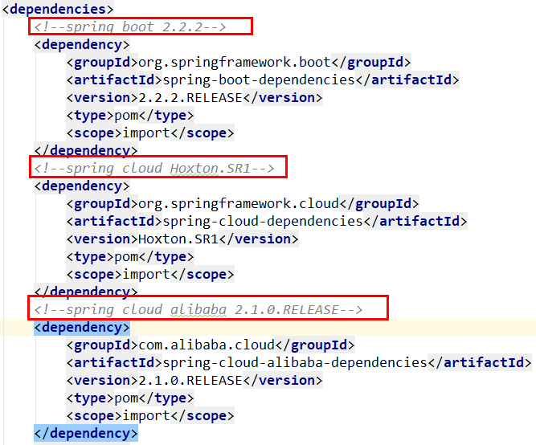

## 1 微服务架构零基础理论入门

### 1.1 从2.2.x和H版开始说起

#### 1.1.1 Springboot版本选择

git源码地址：https://github.com/spring-projects/spring-boot/releases/


**SpringBoot2.0新特性**

SpringBoot官网：https://github.com/spring-projects/spring-boot/wiki/Spring-Boot-2.0-Release-Notes



SpringBoot版本的更新


#### 1.1.2 Springcloud版本选择

git源码地址：https://github.com/spring-projects/spring-cloud

SpringCloud官网：https://spring.io/projects/spring-cloud

SpringCloud中文文档：https://www.bookstack.cn/read/spring-cloud-docs/docs-index.md

SpringClout命名规则

> SpringCloud的版本关系
>
> Spring Cloud 采用了英国伦敦地铁站的名称来命名，并由地铁站名称字母A-Z依次类推的形式来发布迭代版本
> SpringCloud是一个由许多子项目组成的综合项目，各子项目有不同的发布节奏。为了管理SpringCloud与各子项目的版本依赖关系，发布了一个清单，其中包括了某个SpringCloud版本对应的子项目版本。为了避免SpringCloud版本号与子项目版本号混淆，SpringCloud版本采用了名称而非版本号的命名，这些版本的名字采用了伦敦地铁站的名字，根据字母表的顺序来对应版本时间顺序。例如Angel是第一个版本, Brixton是第二个版本。
> 当SpringCloud的发布内容积累到临界点或者一个重大BUG被解决后，会发布一个"service releases"版本，简称SRX版本，比如Greenwich.SR2就是SpringCloud发布的Greenwich版本的第2个SRX版本。


#### 1.1.3 Springcloud和Springboot之间的依赖关系如何看

依赖：

Finchley 是基于 Spring Boot 2.0.x 构建的不再 Boot 1.5.x
Dalston 和 Edgware 是基于 Spring Boot 1.5.x 构建的，不支持 Spring Boot 2.0.x
Camden 构建于 Spring Boot 1.4.x，但依然能支持 Spring Boot 1.5.x



1.1.4 SpringCloud工程版本

| 框架                | 版本          |
| ------------------- | ------------- |
| SpringCloud         | Hoxton.SR1    |
| SpringBoot          | 2.2.2.RELEASE |
| SpringCloud alibaba | 2.1.0.RELEASE |
| java                | Java8         |
| maven               | 3.5及以上     |
| mysql               | 5.7及以上     |

2.X版本常用的组件pom



### 1.2 关于Cloud各种组件的停更/升级/替换

以前


2020年


### 1.3 系统架构演变概述

**目标**：了解项目架构的演变历程

**小结**：


### 1.4 微服务架构说明

**目标**：了解SOA与微服务架构的区别以及说出微服务架构的特点

**分析**：

SOA使用了ESB组件的面向服务架构：ESB自身实现复杂；应用服务粒度较大，所有服务之间的通信都经过ESB会降低通信速度；部署、测试ESB比较麻烦。

**小结**：

**微服务架构**：是一套使用小服务或者单一业务来开发单个应用的方式或途径。

微服务架构特点：

- 单一职责
- 服务粒度小
- 面向服务（对外暴露REST api）
- 服务之间相互独立

与使用ESB的SOA架构的区别：微服务架构没有使用ESB，有服务治理注册中心；业务粒度小。


### 1.5 服务调用方式说明

**目标**：能够说出服务调用方式种类

**小结**：

- RPC：基于socket，速度快，效率高；webservice、dubbo
- HTTP：基于TCP，封装比较臃肿；对服务和调用方没有任何技术、语言的限定，自由灵活；RESTful，Spring Cloud

## 2 Spring Cloud概述

**目标**：Spring Cloud整合的组件和版本特征

**小结**：

- 整合的组件可以有很多组件；常见的组件有：eureka注册中心，Gateway网关，Ribbon负载均衡，Feign服务调用，Hystrix熔断器。在有需要的时候项目添加对于的启动器依赖即可。
- 版本特征：以英文单词命名（伦敦地铁站名）

### 2.1 创建微服务工程

**目标**：创建微服务父工程heima-springcloud、用户服务工程user-service、服务消费工程consumer-demo

**分析**：

需求：查询数据库中的用户数据并输出到浏览器

- 父工程heima-springcloud：添加spring boot父坐标和管理其它组件的依赖
- 用户服务工程user-service：整合mybatis查询数据库中用户数据；提供查询用户服务
- 服务消费工程consumer-demo：利用查询用户服务获取用户数据并输出到浏览器

**小结**：

```xml
            <!-- springCloud -->
            <dependency>
                <groupId>org.springframework.cloud</groupId>
                <artifactId>spring-cloud-dependencies</artifactId>
                <version>${spring-cloud.version}</version>
                <type>pom</type>
                <scope>import</scope>
            </dependency>

```

通过 `scope` 的import可以继承 `spring-cloud-dependencies` 工程中的依赖

### 2.2 搭建配置user-service工程

**目标**：配置user-service工程并能够根据用户id查询数据库中用户

**分析**：

需求：可以访问http://localhost:9091/user/8输出用户数据

实现步骤：

1. 添加启动器依赖（web、通用Mapper）；
2. 创建启动引导类和配置文件；
3. 修改配置文件中的参数；
4. 编写测试代码（UserMapper，UserService，UserController）；
5. 测试

**小结**：

- 添加启动器依赖

```xml
    <dependencies>
        <dependency>
            <groupId>org.springframework.boot</groupId>
            <artifactId>spring-boot-starter-web</artifactId>
        </dependency>
        <!-- 通用Mapper启动器 -->
        <dependency>
            <groupId>tk.mybatis</groupId>
            <artifactId>mapper-spring-boot-starter</artifactId>
        </dependency>
        <!-- mysql驱动 -->
        <dependency>
            <groupId>mysql</groupId>
            <artifactId>mysql-connector-java</artifactId>
        </dependency>

    </dependencies>

```


- 编写配置文件

```yml
server:
  port: 9091
spring:
  datasource:
    driver-class-name: com.mysql.jdbc.Driver
    url: jdbc:mysql://localhost:3306/springcloud
    username: root
    password: root

mybatis:
  type-aliases-package: com.itheima.user.pojo

```


### 2.3 搭建配置consumer-demo工程

**目标**：编写测试类使用restTemplate访问user-service的路径根据id查询用户

**分析**：

需求：访问http://localhost:8080/consumer/8 使用RestTemplate获取http://localhost:9091/user/8的数据

实现步骤：

1. 添加启动器依赖；
2. 创建启动引导类（注册RestTemplate）和配置文件；
3. 编写测试代码（ConsumerController中使用restTemplate访问服务获取数据）
4. 测试

**小结**：

- 服务管理
  如何自动注册和发现
  如何实现状态监管
  如何实现动态路由
- 服务如何实现负载均衡
- 服务如何解决容灾问题
- 服务如何实现统一配置

上述的问题都可以通过Spring Cloud的各种组件解决。

## 3 Eureka注册中心说明

**目标**：说出Eureka的主要功能

**小结**：

Eureka的主要功能是进行服务管理，定期检查服务状态，返回服务地址列表。


### 3.1 搭建eureka-server工程

**目标**：添加eureka对应依赖和编写引导类搭建eureka服务并可访问eureka服务界面

**分析**：

Eureka是服务注册中心，只做服务注册；自身并不提供服务也不消费服务。可以搭建web工程使用Eureka，可以使用Spring Boot方式搭建。

搭建步骤：

1. 创建工程；
2. 添加启动器依赖；
3. 编写启动引导类（添加Eureka的服务注解）和配置文件；
4. 修改配置文件（端口，应用名称...）；
5. 启动测试

**小结**：

- 启动器依赖

```xml
        <dependency>
            <groupId>org.springframework.cloud</groupId>
            <artifactId>spring-cloud-starter-netflix-eureka-server</artifactId>
        </dependency>
```


- 配置文件

```yml
server:
  port: 10086
spring:
  application:
    name: eureka-server
eureka:
  client:
    service-url:
      # eureka 服务地址，如果是集群的话；需要指定其它集群eureka地址
      defaultZone: http://127.0.0.1:10086/eureka
    # 不注册自己
    register-with-eureka: false
    # 不拉取服务
    fetch-registry: false
```


### 3.2 服务注册与发现

**目标**：将user-service的服务注册到eureka并在consumer-demo中可以根据服务名称调用

**分析**：

- 服务注册：在服务提供工程user-service上添加Eureka客户端依赖；自动将服务注册到EurekaServer服务地址列表。
  - 添加依赖；
  - 改造启动引导类；添加开启Eureka客户端发现的注解；
  - 修改配置文件；设置Eureka 服务地址
- 服务发现：在服务消费工程consumer-demo上添加Eureka客户端依赖；可以使用工具类根据服务名称获取对应的服务地址列表。
  - 添加依赖；
  - 改造启动引导类；添加开启Eureka客户端发现的注解；
  - 修改配置文件；设置Eureka 服务地址；
  - 改造处理器类ConsumerController，可以使用工具类DiscoveryClient根据服务名称获取对应服务地址列表。

**小结**：

- 添加Eureka客户端依赖；

```xml
        <dependency>
            <groupId>org.springframework.cloud</groupId>
            <artifactId>spring-cloud-starter-netflix-eureka-client</artifactId>
        </dependency>

```

- 添加启动引导类注解；

  

- 修改配置

```yml
spring:
  application:
    name: consumer-demo
eureka:
  client:
    service-url:
      defaultZone: http://127.0.0.1:10086/eureka
```


### 3.3 Eureka Server高可用配置

**目标**：可以启动两台eureka-server实例；在eureka管理界面看到两个实例

**分析**：

Eureka Server是一个web应用，可以启动多个实例（配置不同端口）保证Eureka Server的高可用。

**小结**：

**高可用配置**：将Eureka Server作为一个服务注册到其它Eureka Server，这样多个Eureka Server之间就能够互相发现对方，同步服务，实现Eureka Server集群。

### 3.4 Eureka客户端与服务端配置

**目标**：配置eureka客户端user-service的注册、续约等配置项，配置eureka客户端consumer-demo的获取服务间隔时间；了解失效剔除和自我保护

**分析**：

- Eureka客户端工程
  - user-service 服务提供
    - 服务地址使用ip方式
    - 续约
  - consumer-demo 服务消费
    - 获取服务地址的频率
- Eureka服务端工程 eureka-server
  - 失效剔除
  - 自我保护

**小结**：

- user-service 

```yml
eureka:
  client:
    service-url:
      defaultZone: http://127.0.0.1:10086/eureka
  instance:
    # 更倾向使用ip地址，而不是host名
    prefer-ip-address: true
    # ip地址
    ip-address: 127.0.0.1
    # 续约间隔，默认30秒
    lease-renewal-interval-in-seconds: 5
    # 服务失效时间，默认90秒
    lease-expiration-duration-in-seconds: 5
```


- consumer-demo 

```yml
eureka:
  client:
    service-url:
      defaultZone: http://127.0.0.1:10086/eureka
    # 获取服务地址列表间隔时间，默认30秒
    registry-fetch-interval-seconds: 10
```


- eureka-server

```yml
eureka:
  server:
    # 服务失效剔除时间间隔，默认60秒
    eviction-interval-timer-in-ms: 60000
    # 关闭自我保护模式（默认是打开的）
    enable-self-preservation: false
```


## 4 负载均衡Ribbon简介

**目标**：描述负载均衡和ribbon的作用

**分析**：

负载均衡是一个算法，可以通过该算法实现从地址列表中获取一个地址进行服务调用。

在Spring Cloud中提供了负载均衡器：Ribbon


**小结**：

Ribbon提供了轮询、随机两种负载均衡算法（默认是轮询）可以实现从地址列表中使用负载均衡算法获取地址进行服务调用。

### 4.1 Ribbon负载均衡应用

**目标**：配置启动两个用户服务，在consumer-demo中使用服务名实现根据用户id获取用户

**分析**：

需求：可以使用RestTemplate访问http://user-service/user/8获取服务数据。

可以使用Ribbon负载均衡：在执行RestTemplate发送服务地址请求的时候，使用负载均衡拦截器拦截，根据服务名获取服务地址列表，使用Ribbon负载均衡算法从服务地址列表中选择一个服务地址，访问该地址获取服务数据。

实现步骤：

1. 启动多个user-service实例（9091,9092）；
2. 修改RestTemplate实例化方法，添加负载均衡注解；
3. 修改ConsumerController；
4. 测试

**小结**：

在实例化RestTemplate的时候使用@LoadBalanced，服务地址直接可以使用服务名。

## 5 熔断器Hystrix简介

**目标**：了解熔断器Hystrix的作用

**小结**：

Hystrix是一个延迟和容错库，用于隔离访问远程服务，防止出现级联失败。

### 5.1 线程隔离&服务降级

**目标**：了解什么是线程隔离和服务降级

**分析**：

Hystrix解决雪崩效应：

- 线程隔离：用户请求不直接访问服务，而是使用线程池中空闲的线程访问服务，加速失败判断时间。
- 服务降级：及时返回服务调用失败的结果，让线程不因为等待服务而阻塞。

**小结**：

- consumer-demo中添加依赖

```xml
        <dependency>
            <groupId>org.springframework.cloud</groupId>
            <artifactId>spring-cloud-starter-netflix-hystrix</artifactId>
        </dependency>
```

- 开启熔断

   

- 降级逻辑

```java
@RestController
@RequestMapping("/consumer")
@Slf4j
@DefaultProperties(defaultFallback = "defaultFallback")
public class ConsumerController {

    @Autowired
    private RestTemplate restTemplate;

    @Autowired
    private DiscoveryClient discoveryClient;

    @GetMapping("/{id}")
    //@HystrixCommand(fallbackMethod = "queryByIdFallback")
    @HystrixCommand
    public String queryById(@PathVariable Long id){
        /*String url = "http://localhost:9091/user/"+id;
        
        //获取eureka中注册的user-service的实例
        List<ServiceInstance> serviceInstances = discoveryClient.getInstances("user-service");
        ServiceInstance serviceInstance = serviceInstances.get(0);

        url = "http://" + serviceInstance.getHost() + ":" + serviceInstance.getPort() + "/user/" + id;*/
        String url = "http://user-service/user/" + id;
        return restTemplate.getForObject(url, String.class);
    }

    public String queryByIdFallback(Long id){
        log.error("查询用户信息失败。id：{}", id);
        return "对不起，网络太拥挤了！";
    }

    public String defaultFallback(){
        return "默认提示：对不起，网络太拥挤了！";
    }
}

```


- 修改超时配置

```yml
hystrix:
  command:
    default:
      execution:
        isolation:
          thread:
            timeoutInMilliseconds: 2000
```


### 5.2 服务熔断演示

**目标**：了解熔断器工作原理

**小结**：


可以通过配置服务熔断参数修改默认：

```yml
hystrix:
  command:
    default:
      execution:
        isolation:
          thread:
            timeoutInMilliseconds: 2000
      circuitBreaker:
        errorThresholdPercentage: 50 # 触发熔断错误比例阈值，默认值50%
        sleepWindowInMilliseconds: 10000 # 熔断后休眠时长，默认值5秒
        requestVolumeThreshold: 10 # 熔断触发最小请求次数，默认值是20
```

## 6 Feign应用

**目标**：Feign的作用；使用Feign实现consumer-demo代码中调用服务

**分析**：

1. 导入启动器依赖；
2. 开启Feign功能；
3. 编写Feign客户端；
4. 编写一个处理器ConsumerFeignController，注入Feign客户端并使用；
5. 测试

**小结**：

Feign主要作用：自动根据参数拼接http请求地址。

- 启动器依赖；

```xml
        <dependency>
            <groupId>org.springframework.cloud</groupId>
            <artifactId>spring-cloud-starter-openfeign</artifactId>
        </dependency>

```


- Feign客户端：

```java
//声明当前类是一个Feign客户端，指定服务名为user-service
@FeignClient("user-service")
public interface UserClient {

    //http://user-service/user/123
    @GetMapping("/user/{id}")
    User queryById(@PathVariable Long id);
}

```


### 6.1 Feign负载均衡及熔断

**目标**：可以配置Feign内置ribbon配置项和Hystrix熔断的Fallback配置

**分析**：

- 负载均衡
- 服务熔断
- 请求压缩
- 日志级别

都可以通过配置项在Feign中开启使用。

**小结**：

在服务消费工程consumer-demo中的配置文件：

```yml
ribbon:
  ConnectTimeout: 1000 # 连接超时时长
  ReadTimeout: 2000 # 数据通信超时时长
  MaxAutoRetries: 0 # 当前服务器的重试次数
  MaxAutoRetriesNextServer: 0 # 重试多少次服务
  OkToRetryOnAllOperations: false # 是否对所有的请求方式都重试
feign:
  hystrix:
    enabled: true # 开启Feign的熔断功能
  compression:
    request:
      enabled: true # 开启请求压缩
      mime-types: text/html,application/xml,application/json # 设置压缩的数据类型
      min-request-size: 2048 # 设置触发压缩的大小下限
    response:
      enabled: true
logging:
  level:
    com.itheima: debug
```


## 7 Spring Cloud Gateway网关简介

**目标**：Spring Cloud Gateway网关的作用

**小结**：

Spring Cloud Gateway的核心就是一系列的过滤器，可以将客户端的请求转发到不同的微服务。主要作用：过滤和路由。

### 7.1 Spring Cloud Gateway入门

**目标**：搭建网关服务工程测试网关服务作用

**分析**：

需求：通过网关系统heima-gateway将包含有 /user 的请求 路由到 http://127.0.0.1:9091/user/用户id 

实现步骤：

1. 创建工程；
2. 添加启动器依赖；
3. 编写启动引导类和配置文件；
4. 修改配置文件，设置路由信息；
5. 启动测试

http://127.0.0.1:10010/user/8 --> http://127.0.0.1:9091/user/8


**小结**：

- 启动器依赖

```xml
    <dependencies>
        <dependency>
            <groupId>org.springframework.cloud</groupId>
            <artifactId>spring-cloud-starter-gateway</artifactId>
        </dependency>
        <dependency>
            <groupId>org.springframework.cloud</groupId>
            <artifactId>spring-cloud-starter-netflix-eureka-client</artifactId>
        </dependency>
    </dependencies>

```


- 配置文件

```yml
server:
  port: 10010
spring:
  application:
    name: api-gateway
  cloud:
    gateway:
      routes:
        # 路由id，可以任意
        - id: user-service-route
          # 代理的服务地址
          uri: http://127.0.0.1:9091
          # 路由断言： 可以匹配映射路径
          predicates:
            - Path=/user/**

eureka:
  client:
    service-url:
      defaultZone: http://127.0.0.1:10086/eureka
  instance:
    prefer-ip-address: true
```


### 7.2 面向服务的路由

**目标**：使用在eureka注册的服务作为路由地址

**分析**：

如果将路由服务地址写死明显是不合理的；在Spring Cloud Gateway中可以通过配置动态路由解决。

**小结**：

面向服务的路由；只需要在配置文件中指定路由路径类似： `lb://user-service`

> lb 之后编写的服务名必须要在eureka中注册才能使用

### 7.3 路由前缀处理

**目标**：可以对请求到网关服务的地址添加或去除前缀

**分析**：

提供服务的地址：http://127.0.0.1:9091/user/8

- 添加前缀：对请求地址添加前缀路径之后再作为代理的服务地址；

http://127.0.0.1:10010/8 --> http://127.0.0.1:9091/user/8 添加前缀路径/user

- 去除前缀：将请求地址中路径去除一些前缀路径之后再作为代理的服务地址；

http://127.0.0.1:10010/api/user/8 --> http://127.0.0.1:9091/user/8 去除前缀路径/api

**小结**：

客户端的请求地址与微服务的服务地址如果不一致的时候，可以通过配置路径过滤器实现路径前缀的添加和去除。


### 7.4 过滤器简介

**目标**：Gateway默认过滤器的用法和过滤器类型

**小结**：

- 用法：在配置文件中指定要使用的过滤器名称；
- 类型：局部、全局；
- 使用场景：请求鉴权、异常处理、记录调用时长等。

### 7.5 自定义局部过滤器

**目标**：按照默认过滤器编写并配置一个自定义局部过滤器，该过滤器可以通过配置文件中的参数名称获取请求的参数值

**分析**：

需求：在过滤器（MyParamGatewayFilterFactory）中将http://localhost:10010/api/user/8?name=itcast中的参数name的值获取到并输出到控制台；并且参数名是可变的，也就是不一定每次都是name；需要可以通过配置过滤器的时候做到配置参数名。

实现步骤：

1. 配置过滤器；
2. 编写过滤器；
3. 测试

**小结**：

- 配置；与其他过滤器的配置一致。

- 实现过滤器

```java
package com.itheima.gateway.filter;

import org.springframework.cloud.gateway.filter.GatewayFilter;
import org.springframework.cloud.gateway.filter.factory.AbstractGatewayFilterFactory;
import org.springframework.http.server.reactive.ServerHttpRequest;
import org.springframework.stereotype.Component;

import java.util.Arrays;
import java.util.List;

@Component
public class MyParamGatewayFilterFactory extends AbstractGatewayFilterFactory<MyParamGatewayFilterFactory.Config> {

    static final String PARAM_NAME = "param";

    public MyParamGatewayFilterFactory() {
        super(Config.class);
    }

    public List<String> shortcutFieldOrder() {
        return Arrays.asList(PARAM_NAME);
    }

    @Override
    public GatewayFilter apply(Config config) {
        return (exchange, chain) -> {
            // http://localhost:10010/api/user/8?name=itcast   config.param ==> name
            //获取请求参数中param对应的参数名 的参数值
            ServerHttpRequest request = exchange.getRequest();
            if(request.getQueryParams().containsKey(config.param)){
                request.getQueryParams().get(config.param).
                        forEach(value -> System.out.printf("------------局部过滤器--------%s = %s------", config.param, value));
            }
            return chain.filter(exchange);
        };
    }


    public static class Config{
        //对应在配置过滤器的时候指定的参数名
        private String param;

        public String getParam() {
            return param;
        }

        public void setParam(String param) {
            this.param = param;
        }
    }
}

```


### 7.6 自定义全局过滤器

**目标**：定义一个全局过滤器检查请求中是否携带有token参数

**分析**：

需求：编写全局过滤器，在过滤器中检查请求地址是否携带token参数。如果token参数的值存在则放行；如果token的参数值为空或者不存在则设置返回的状态码为：未授权也不再执行下去。

实现步骤：

1. 编写全局过滤器；
2. 测试

**小结**：

```java
@Component
public class MyGlobalFilter implements GlobalFilter, Ordered {
    @Override
    public Mono<Void> filter(ServerWebExchange exchange, GatewayFilterChain chain) {
        System.out.println("--------------全局过滤器MyGlobalFilter------------------");
        String token = exchange.getRequest().getQueryParams().getFirst("token");
        if(StringUtils.isBlank(token)){
            //设置响应状态码为未授权
            exchange.getResponse().setStatusCode(HttpStatus.UNAUTHORIZED);
            return exchange.getResponse().setComplete();
        }
        return chain.filter(exchange);
    }

    @Override
    public int getOrder() {
        //值越小越先执行
        return 1;
    }
}

```


### 7.7 Gateway其它配置说明

**目标**：Gateway网关的负载均衡和熔断参数配置

**小结**：

网关服务配置文件：

```yml
server:
  port: 10010
spring:
  application:
    name: api-gateway
  cloud:
    gateway:
      routes:
        # 路由id，可以任意
        - id: user-service-route
          # 代理的服务地址
          #uri: http://127.0.0.1:9091
          # lb表示从eureka中获取具体服务
          uri: lb://user-service
          # 路由断言： 可以匹配映射路径
          predicates:
            #- Path=/user/**
            #- Path=/**
            - Path=/api/user/**
          filters:
            # 添加请求路径的前缀
            #- PrefixPath=/user
            #1表示过滤1个路径，2表示两个路径，以此类推
            - StripPrefix=1
            - MyParam=name
      # 默认过滤器，对所有路由都生效
      default-filters:
        - AddResponseHeader=X-Response-Foo, Bar
        - AddResponseHeader=abc-myname,heima
      globalcors:
        corsConfigurations:
          '[/**]':
            #allowedOrigins: * # 这种写法或者下面的都可以，*表示全部
            allowedOrigins:
              - "http://docs.spring.io"
            allowedMethods:
              - GET
eureka:
  client:
    service-url:
      defaultZone: http://127.0.0.1:10086/eureka
  instance:
    prefer-ip-address: true
hystrix:
  command:
    default:
      execution:
        isolation:
          thread:
            timeoutInMilliseconds: 6000
ribbon:
  ConnectTimeout: 1000
  ReadTimeout: 2000
  MaxAutoRetries: 0
  MaxAutoRetriesNextServer: 0
```

> Gateway网关一般直接给终端请求使用；Feign一般用在微服务之间调用。

## 8 Spring Cloud Config分布式配置中心简介

**目标**：分布式配置中心的作用

**小结**：


spring cloud config作用：可以通过修改在git仓库中的配置文件实现其它所有微服务的配置文件的修改。

### 8.1 搭建配置中心微服务

**目标**：创建码云的远程公开git仓库，搭建配置中心微服务config-server

**分析**：

- 创建git仓库：在码云上创建仓库
- 搭建配置中心config-server：使用spring boot方式搭建和配置

**小结**：

- 配置中心依赖

```xml
    <dependencies>
        <dependency>
            <groupId>org.springframework.cloud</groupId>
            <artifactId>spring-cloud-starter-netflix-eureka-client</artifactId>
        </dependency>
        <dependency>
            <groupId>org.springframework.cloud</groupId>
            <artifactId>spring-cloud-config-server</artifactId>
        </dependency>
    </dependencies>

```


- 配置中心的配置文件

```yml
server:
  port: 12000
spring:
  application:
    name: config-server
  cloud:
    config:
      server:
        git:
          uri: https://gitee.com/goheima/heima-config.git
eureka:
  client:
    service-url:
      defaultZone: http://127.0.0.1:10086/eureka
```

> 在gitee中修改了配置文件会在配置中心服务及时更新。

### 8.2 获取配置中心配置

**目标**：改造用户微服务user-service，配置文件信息不再由微服务项目提供，而是从配置中心获取

**分析**：

需求：将服务提供工程user-service的application.yml配置文件删除，修改为从配置中心config-server中获取。

实现步骤：

1. 添加启动器依赖；
2. 修改配置文件；
3. 启动测试

**小结**：

将原来的application.yml删除；然后添加bootstrap.yml配置文件，该文件也是spring boot的默认配置文件，其内容经常配置一些项目中固定的配置项。如果是项目经常变动的应该配置到application.yml中，现在使用了配置中心则应该配置到git仓库中对于的配置文件。

- 依赖

```xml
        <dependency>
            <groupId>org.springframework.cloud</groupId>
            <artifactId>spring-cloud-starter-config</artifactId>
            <version>2.1.1.RELEASE</version>
        </dependency>
```


- 配置文件bootstrap.yml

```yml
spring:
  cloud:
    config:
      # 要与仓库中的配置文件的application保持一致
      name: user
      # 要与仓库中的配置文件的profile保持一致
      profile: dev
      # 要与仓库中的配置文件所属的版本（分支）一样
      label: master
      discovery:
        # 使用配置中心
        enabled: true
        # 配置中心服务名
        service-id: config-server

eureka:
  client:
    service-url:
      defaultZone: http://127.0.0.1:10086/eureka
```


## 9 Spring Cloud Bus简介

**目标**：了解Spring Cloud Bus作用

**小结**：

Spring Cloud Bus作用：将git仓库的配置文件更新，在不重启系统的情况下实现及时同步到各个微服务。

**Spring Cloud Bus应用**

**目标**：启动RabbitMQ通过修改码云中的配置文件后发送Post请求实现及时更新用户微服务中的配置项

**分析**：

需求：在码云的git仓库中修改user-dev.yml配置文件，实现不重启user-service的情况下可以及时更新配置文件。

实现步骤：

1. 启动RabbitMQ；
2. 修改配置中心config-server；
3. 修改服务提供工程user-service；
4. 测试

**小结**：

- config-server的依赖添加内容

```xml
        <dependency>
            <groupId>org.springframework.cloud</groupId>
            <artifactId>spring-cloud-bus</artifactId>
        </dependency>
        <dependency>
            <groupId>org.springframework.cloud</groupId>
            <artifactId>spring-cloud-stream-binder-rabbit</artifactId>
        </dependency>

```


- config-server的配置文件添加内容

```yml
server:
  port: 12000
spring:
  application:
    name: config-server
  cloud:
    config:
      server:
        git:
          uri: https://gitee.com/goheima/heima-config.git
  # 配置rabbitmq信息；如果是都与默认值一致则不需要配置
  rabbitmq:
    host: localhost
    port: 5672
    username: guest
    password: guest
eureka:
  client:
    service-url:
      defaultZone: http://127.0.0.1:10086/eureka
management:
  endpoints:
    web:
      exposure:
        # 暴露触发消息总线的地址
        include: bus-refresh
```


- user-service的依赖添加内容

```xml
        <dependency>
            <groupId>org.springframework.cloud</groupId>
            <artifactId>spring-cloud-bus</artifactId>
        </dependency>
        <dependency>
            <groupId>org.springframework.cloud</groupId>
            <artifactId>spring-cloud-stream-binder-rabbit</artifactId>
        </dependency>
        <dependency>
            <groupId>org.springframework.boot</groupId>
            <artifactId>spring-boot-starter-actuator</artifactId>
        </dependency>

```


- user-service的配置文件添加内容

```yml
  # 配置rabbitmq信息；如果是都与默认值一致则不需要配置
  rabbitmq:
    host: localhost
    port: 5672
    username: guest
    password: guest

```


- UserController的修改

 

## 10 Spring Cloud 体系技术综合应用说明

**目标**：了解Spring Cloud中的Eureka、GateWay、Config、Bus、Feign等技术的综合应用

**小结**：

.png)

