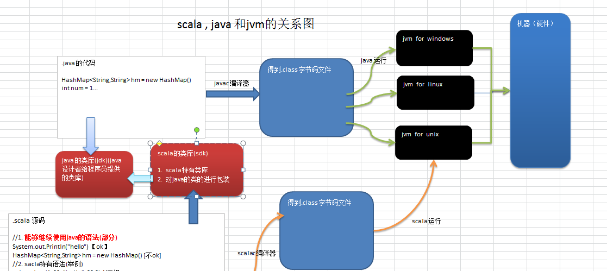

# Scala

## 1 Scala入门

> 1. Spark—新一代内存级大数据计算框架，是大数据的重要内容。Spark就是使用Scala编写的。因此为了更好的学习Spark, 需要掌握Scala这门语言。
> 2. `Scala 是 Scalable Language 的简写`，是一门多范式`(范式/编程方式[面向对象/函数式编程]`)的编程语言
> 3. 联邦理工学院洛桑（EPFL）的Martin Odersky于2001年开始设计Scala。
>
> 4. Spark的兴起，带动Scala语言的发展！

### 1.1 Scala语言诞生小故事

> 1. `创始人马丁·奥德斯基（Martin Odersky）`是编译器及编程的狂热爱好者，长时间的编程之后，希望发明一语言，能够让写程序这样的基础工作变得高效，简单。所以当接触到JAVA语言后，对JAVA这门便携式，运行在网络，且存在垃圾回收的语言产生了极大的兴趣，所以决定将函数式编程语言的特点融合到JAVA中，由此`发明了两种语言（Pizza & Scala）`。
>    - 
> 2. `Pizza和Scala极大地推动了Java编程语言的发展。`[如何理解?]
>    - jdk5.0 的泛型，for循环增强, 自动类型转换等，都是从Pizza 引入的新特性。
>    - jdk8.0 的类型推断，Lambda表达式就是从scala引入的特性。
> 3. 且现在主流JVM的javac编译器就是马丁·奥德斯基编写出来的。Jdk5.0 Jdk8.0的编译器就是马丁·奥德斯基写的，因此马丁·奥德斯基 一个人的战斗力抵得上一个Java开发团队。

### 1.2 Scala和 Java以及jvm的关系

> 一般来说，学Scala的人，都会Java，而Scala是基于Java的，因此我们需要将Scala和Java以及JVM之间
> 的关系搞清楚，否则学习Scala会蒙圈。



~~~scala
.scala  源码

// 1. 能够继续使用java的语法(部分)
System.out.Println("hello") [ok]
HashMap<String,String> hm = new HashMap() [不ok]

//2. sacla特有语法(举例)
val  tuple = (1, 20, "hello", 23.9) //元组
val  map = Map(("no",10)， ("no2", 40)) //  map

//3. 增加功能,比如 函数式编程
//（1） 偏函数
// (2) 函数的柯里化
// (3) 高阶函数。。。
// (4) 将函数作为参数传递

//4. 从形式上看，是scala 的类，但是这个类是对java的类/接口进行包装,比如
var  arr  = new Array[Int](10) 
// 表示我定义了一个数组，该数组存放Int,  10个元素
~~~

### 1.3 Scala 语言的特点

> Scala 是一门以 java 虚拟机（JVM）为运行环境并`将面向对象和函数式编程的最佳特性结合在一起的静态类型编程语言。`
>
> 1. Scala 是一门`多范式 (multi-paradigm) 的编程语言`，Scala 支持面向对象和函数式编程。
> 2. Scala 源代码(.scala)会被编译成 Java 字节码(.class)，然后运行于 JVM 之上，并可以调用现有的Java 类库，实现两种语言的无缝对接。
> 3. scala 单作为一门语言来看， 非常的简洁高效 （三元运算， ++ ， --）
> 4. Scala 在设计时，马丁·奥德斯基 是参考了 Java 的设计思想，可以说 Scala 是源于 java，同时马丁·奥德斯基 也加入了自己的思想，将函数式编程语言的特点融合到 JAVA 中, 因此，对于学习过Java 的同学，只要在学习 Scala 的过程中，`搞清楚 Scala 和 java 相同点和不同点`，就可以快速的掌握Scala 这门语言。、
> 5. 快速有效掌握 Scala 的三点建议 
>    1. 学习 scala 法 的特有的语法。 
>    2. 区别 scala 和 Java 。
>    3. 如何规范使用 scala。

### 1.4 Windows下搭建Scala开发环境

> 具体的步骤
>
> 1. 首先把 jdk1.8 安装
> 2. 下载对应的 scala 安装文件 [scala-2.11.8.zip](https://oss-blogs.oss-cn-hangzhou.aliyuncs.com/blogs/hadoop/scala/scala-2.11.8.zip)
> 3. 
> 4. 配置 scala 的环境变量
> 5. 
> 6. 测试一下, 输入 scala 的指令看看效果：
> 7. 

### 1.5 Linux下搭建Scala开发环境

> 在实际开发中，我们的项目是部署到 linux,因此，我们需要在 Linux 下搭建 scala 的环境。具体的步骤如下：
>
> 1. 下载对应的 scala 的安装软件scala-2.11.8.tgz
>
> 2. 通过远程登录工具，将安装软件上传到对应的Linux 系统/opt/software目录下
>
> 3. `tar -zxvf scala-2.11.8.tgz -C  /opt/module` 将安装文件解压，并且移动到
>    /opt/module下
>
> 4. 配置环境变量 `vim /etc/profile`
>
> 5. ~~~shell
>    export SCALA_HOME=/opt/module/scala-2.11.8
>    export PATH=$PATH:$SCALA_HOME/bin
>    ~~~
>
> 6. `source /etc/profile`
>
> 7. 

#### 1.5.1Scala的REPL

> 1. 介绍
>    - 上面打开的 scala 命令行窗口，我们称之为 REPL，是指：Read->Evaluation->Print->Loop，也称之为`交互式解释器。`
> 2. 说明
>    - 在命令行窗口中输入 scala 指令代码时，解释器会读取指令代码(R)并计算对应的值(E)，然后将结果打印出来(P)，接着循环等待用户输入指令(L)。`从技术上讲，这里其实并不是一个解释器，而是指令代码被快速的编译成 Java 字节码并被 JVM 加载执行。`最终将执行结果输出到命令行中。

### 1.6 Scala 开发工具的介绍

> idea中Scala 插件安装
>
> 
>
> `scala 的开发的快速入门`
>
> 1. 同Java开发一样先创建一个Maven工程。
>
> 2. 默认下，maven 不支持 scala 的开发，需要引入 scala 框架：`右键项目点击-> add framework support在下图选择 scala`。、
>
> 3. 创建项目的源文件目录：`右键 main 目录->创建一个 diretory -> 写个名字（比如 scala）-> 右键 scala 目录->mark directory -> 选择 source root 即可。`
>
> 4. 
>
> 5. `开发一个 HelloScala.scala 的程序`
>
>    ~~~~scala
>    package com.atguigu.chapter01
>    
>    /**
>      * @Date 2020/8/13 19:01
>      * @Version 10.21
>      * @Author DuanChaojie
>      */
>    object HelloScala {
>      def main(args: Array[String]): Unit = {
>        println("hello scala!")
>      }
>    }
>    ~~~~

### 1.7 Scala程序反编译-说明Scala程序的执行流程

> 下面我们说明一下 scala 程序的一执行流程：
>
> 1. object 在底层会`生成两个类 HelloScala , HelloScala$`
> 2. HelloScala 中有个 main 函数，`调用 Hello$ 类的一个静态对象 MODULES$`

#### 1.7.1 HelloScala

~~~~scala
package com.atguigu.chapter01;

import scala.reflect.ScalaSignature;

@ScalaSignature(bytes="\006\001%:Q!\001\002\t\002%\t!\002S3mY>\0346-\0317b\025\t\031A!A\005dQ\006\004H/\032:1c)\021QAB\001\bCR<W/[4v\025\0059\021aA2p[\016\001\001C\001\006\f\033\005\021a!\002\007\003\021\003i!A\003%fY2|7kY1mCN\0211B\004\t\003\037Ii\021\001\005\006\002#\005)1oY1mC&\0211\003\005\002\007\003:L(+\0324\t\013UYA\021\001\f\002\rqJg.\033;?)\005I\001\"\002\r\f\t\003I\022\001B7bS:$\"AG\017\021\005=Y\022B\001\017\021\005\021)f.\033;\t\013y9\002\031A\020\002\t\005\024xm\035\t\004\037\001\022\023BA\021\021\005\025\t%O]1z!\t\031cE\004\002\020I%\021Q\005E\001\007!J,G-\0324\n\005\035B#AB*ue&twM\003\002&!\001")
public final class HelloScala{
  public static void main(String[] paramArrayOfString){
    // HelloScala$.MODULE$. 对象是静态的，通过该对象调用 HelloScala$的 main 函数
    HelloScala$.MODULE$.main(paramArrayOfString);
  }
}
~~~~

#### 1.7.2 HelloScala$

~~~~scala
package com.atguigu.chapter01;

import scala.Predef.;

public final class HelloScala${
  public static final HelloScala$ MODULE$;

  static{
    MODULE$ = new HelloScala$();
  }
  // 可以理解我们在 main 中写的代码在放在 HelloScala$ 的main,在底层执行scala编译器做了一个包装
  public void main(String[] args){ 
  	  Predef..MODULE$.println("hello scala!");
  }
  private HelloScala$() { 
      MODULE$ = this; 
  }

}
~~~~

### 1.8 Scala 程序开发注意事项(重点)

> 1. ==Scala 源文件以 “.scala" 为扩展名==。
> 2. Scala 程序的执行入口是 main()函数。
> 3. `Scala 语言严格区分大小写。`
> 4. Scala 方法由一条条语句构成，每个语句后不需要分号(Scala 语言会在每行后自动加分号)，这也体现出Scala 的简洁性。
> 5. `如果在同一行有多条语句，除了最后一条语句不需要分号，其它语句需要分号。`

###  1.9 Scala语言输出的三种方式

> 1. 字符串通过+号连接（类似 java）。
> 2. `printf 用法 （类似 C 语言）字符串通过 % 传值。`
> 3. 字符串通过$引用(类似 PHP）。

~~~~scala
/**
  * @Date 2020/9/8 23:00
  * @Version 10.21
  * @Author DuanChaojie
  */
object TestPrint {
  def main(args: Array[String]): Unit = {
    var name : String = "mm"
    var age : Double = 18

    // 使用 +
    println("hello" + age + name )

    // 使用格式化的方式 printf
    printf("name=%s day=%f\n", name, age)

    //使用$引用的方式，输出变量，类似 php
    println(s"第三种方式 name=$name age = ${age + 1}")
  }
}
~~~~

### 1.10 Scala 源码的查看的关联

> 在使用 scala 过程中，为了搞清楚 scala 底层的机制，需要查看源码，下面看看如果关联和查看 Scala的源码包。查看源码, 选择要查看的方法或者类, 输入 `ctrl + b`
>
> 1. 将我们的源码包拷贝到 `scala/lib 文件夹`下[scala-sources-2.12.4](https://oss-blogs.oss-cn-hangzhou.aliyuncs.com/blogs/hadoop/scala/scala-sources-2.12.4.tar)
> 2. 关联即可,选中这个文件夹，进行关联, 最后，可以看到源码。

### 1.11 注释

用于注解说明解释程序的文字就是注释，注释提高了代码的阅读性；

`注释是一个程序员必须要具有的良好编程习惯`。将自己的思想通过注释先整理出来，再用代码去体现。

Scala中的类型注释(同Java)：

1. 单行注释 
2. 多行注释
3. `文档注释`

对一下代码使用scaladoc生成说明文档：

~~~~scala
package com.atguigu.chapter01

/**
  * @Date 2020/8/13 19:01
  * @Version 10.21
  * @Author DuanChaojie
  */
object HelloScala {

  def main(args: Array[String]): Unit = {

    println("hello scala!")
  }

  /**
    * 文档注释：使用scaladoc命令生成文档说明
    * 
    * @param a  参数1
    * @param b  参数2
    * @return   返回值
    */
  def sum(a: Int, b: Int): Int = {
    return a + b
  }
}
~~~~

使用以下命令

~~~~cmd
scaladoc -d E:/file/scala HelloScala.scala
~~~~

结果：


### 1.12 Scala编码风格

#### 1.12.1 正确的缩进和空白（同Java）

1. 使用一次 tab操作，实现缩进，默认整体向右边移动，时候用shift+tab整体向左移
2. 或者使用ctrl + alt +L来进行格式化
3. 运算符两边习惯性各加一个空格。`比如：2 + 4 * 5。`
4. 一行最长不超过80个字符，超过的请使用换行展示，尽量保持格式优雅

#### 1.12.2 Scala官方编程指南


### 1.13 本章小结

Scala程序的编写、编译、运行步骤是什么？

1. 编写：就是使用工具，开发scala程序
2. 编译：就是使用scalac命令将.scala文件编译成.class
3. 运行：就是使用scala来将.class文件加载到jvm并运行

能否一步执行？

- 可以直接运行.scala，但是速度慢.cmd 	---->	`scala xx.scala`

## 2 Scala变量

> 不论是使用哪种高级程序语言编写程序，变量都是其程序的基本组成单位。

### 2.1 变量的快速入门

> 1. 变量相当于内存中一个数据存储空间的表示，你可以把变量看做是一个房间的门牌号，通过门牌号我们可以找到房间，而通过变量名可以访问到变量(值)。
> 2. 声明/定义变量(`scala要求变量声明时初始化`)，然后使用它
> 3. Scala变量快速入门代码如下：

~~~~scala
/**
  * @Date 2021/3/21 16:38
  * @Version 10.21
  * @Author DuanChaojie
  */
object ScalaVarDemo01 {
  def main(args: Array[String]): Unit = {
    var a: Int = 10
    var b: Int = 20
    b = 30;
    println("a=" + a)
    println("b=" + b)

    var age: Int = 10
    var sal: Double = 11.2
    var name: String = "tom"
    var isPass: Boolean = true

    // 在Scala中，小数默认为Double,整数默认为Int
    var score : Float = 99.99F
    println(s"$name 今年 $age 岁了 ，薪资为$sal 绩效为 $score 是否涨工资 $isPass")
  }
}
~~~~

#### 2.1.1 变量的使用说明：

~~~scala
// 基本语法：
var | val 变量名 [: 变量类型] = 变量值
~~~

> 1. 声明变量时，类型可以省略（编译器自动推导，即类型推导)
> 2. 类型确定后，就不能修改，说明Scala是强数据类型语言（同Java）
> 3. 在声明/定义一个变量时，可以使用var或者 val来修饰， var修饰的变量可改变，val修饰的变量不可改。
> 4. val修饰的变量在编译后，等同于加上 final。
> 5. var 修饰的对象引用可以改变，val修饰的则不可改变，但对象的状态(值)却是可以改变的。(比如：自定义对象、数组、集合等等)
> 6. 变量声明时，需要初始值。

~~~~scala
/**
  * @Date 2021/3/21 17:17
  * @Version 10.21
  * @Author DuanChaojie
  */
object ScalaVarDemo02 {
  def main(args: Array[String]): Unit = {

    // 类型推导，这个时候age是Int类型
    var age = 18

    /**
      * 有两种方式我们可以age是Int类型的：
      *   1. idea提示
      *   2. println(age.isInstanceOf[Int]) 结果为true
      */

    // 类型确定后，就不能修改，说明Scala是强数据类型语言
    // age = 2.1 编译器报错

    // age可以修改，因为age是var声明的
    age = 19
    val sal = 200
    // sal是val声明的，所以不可变
    // sal = 10000  编译器报错

    /**
      * Scala设计者为什么设计 var 和 val 呢？
      * 1、在实际编程，我们更多的需求是获取/创建一个对象后，读取该对象的属性，或者是修改对象的属性值，但是我们很少去改变这个对象本身。
      *     var dog = new Dog()
      *     dog.age = 99
      *     dog = new Dog()
      *   这时我们就可以使用val定义dog
      *     val dog = new Dog()
      *     dog.age = 99
      * 2、因为val 没有线程安全问题，因此效率高，scala的设计者推荐我们val
      * 3、如果对象需要改变，则使用var
      */
    val dog = new Dog()
    // 0
    println(dog.age)

    println(dog.name)

    // 这里我们就不能有下面的操作了
    // dog = new Dog()

  }
}

/**
  * 声明一个Dog类
  */
class Dog {
  // 声明一个age属性,给了一个默认值 _
  var age: Int = _
  var name: String = "小花"
}
~~~~

#### 2.1.2 程序中 + 的使用：

> 1. 当左右两边都是数值型时，则做加法运算
> 2. 当左右两边有一方为字符串，则做拼接运算

### 2.2 Scala数据类型

> 1. Scala 与Java有着相同的数据类型，==在Scala中数据类型都是对象==，也就是说scala没有java中的原生类型
> 2. Scala数据类型分为两大类AnyVal（值类型）和 AnyRef（引用类型），注意：不管是AnyVal还是AnyRef都是对象。
> 3. 相对于java的类型系统，Scala要复杂些！`也正是这复杂多变的类型系统才让面向对象编程和函数式编程完美的融合在了一起。`

~~~~scala
/**
  * @Date 2021/3/21 18:48
  * @Version 10.21
  * @Author DuanChaojie
  */
object ScalaTypeDemo01 {
  def main(args: Array[String]): Unit = {
    
    var num: Int = 10
      
    /*
      因为Int是一个类，因此他的一个实例，就是可以使用很多方法
      在 scala中，如果一个方法，没有形参，则可以省略()
     */
    println(num.toDouble + "\n" + num.toString + "\n" + 10.toString)

    var isPass = true
    println(isPass.toString)

    // 这两种方法的调用都可以
    sayHi()
    sayHi
  }

  def sayHi(): Unit = {
    println("say hi~")
  }

}
~~~~

#### 2.2.1 Scala 数据类型体系一览图


>对上面图的小结和整理
>
>1. 在Scala中有一个根类型Any ,他是所有类的父类。
>2. Scala中一切皆为对象，分为两大类AnyVal(值类型)，AnyRef(引用类型)，他们都是Any子类
>3. Null类型是Scala 的特别类型，它只有一个值null，他是 bottom class ,是所有AnyRef 类型的子类。
>4. Nothing类型也是bottom class ,他是所有类的子类，在开发中通常可以将Nothing类型的值返回给任意变量或者函数，这里抛出异常使用很多。
>5. 在Scala中仍然遵守，低精度的值，向高精度的值自动转换(implicit conversion)隐式转换。

~~~~scala
/**
  * @Date 2021/3/21 19:04
  * @Version 10.21
  * @Author DuanChaojie
  */
object ScalaTypeDemo02 {
  def main(args: Array[String]): Unit = {

    // 默认为double
    var num1 = 1.2
    var num2 = 1.7f
    //在scala中仍然遵守，低精度的值，向高精度的值自动转换(implicit conversion)隐式转换

    //num2 = num1,错误
    num2 = num2.toFloat
    println(num2)

    //false
    println(num2.isInstanceOf[Double])
    // true
    println(num2.isInstanceOf[Float])

    println(sayHello)
  }

  /**
    * 比如开发中，我们有一个方法，就会异常中断，这时就可以返回Nothing
    * 即当我们Nothing 做返回值，就是明确说明该方法有没有正常返回值
    * @return Nothing
    */
  def sayHello: Nothing = {
    throw new Exception("抛出异常")
  }
}
~~~~

#### 2.2.2 Scala数据类型列表


##### 整数类型

Scala 的整数类型就是用于存放整数值的，比如 12, 30,3456等等。


> 整形的使用细节：
>
> 1. Scala各整数类型有固定的表数范围和字段长度，不受具体OS的影响，以保证Scala程序的可移植性。
> 2. Scala的整型 常量/字面量  默认为 Int 型，声明Long型 常量/字面量 须后`加‘l’或‘L’` 
> 3. Scala程序中变量常声明为Int型，除非不足以表示大数，才使用Long

~~~scala
/**
  * @Date 2021/3/21 19:31
  * @Version 10.21
  * @Author DuanChaojie
  */
object ScalaTypeDemo03 {
  def main(args: Array[String]): Unit = {
    println("Int的最大值：" + Int.MaxValue)
    println("Int的最小值：" + Int.MinValue)
    println("Long的最大值：" + Long.MaxValue)
    println("Long的最小值：" + Long.MinValue)

    var i = 10
    var j = 10L

    // 报错，因为超过了Int的范围
    //var k = 9223372036854775807
  }
}
~~~

##### 浮点类型

Scala的浮点类型可以表示一个小数，`比如 123.4f，7.8 ，0.12等等。`


> 浮点数的使用细节：
>
> 1. 与整数类型类似，Scala 浮点类型也有固定的表数范围和字段长度，不受具体OS的影响。
>
> 2. Scala的浮点型常量默认为Double型，声明Float型常量，须后`加‘f’或‘F’`。
>
> 3. 浮点型常量有两种表示形式：
>
>    ~~~~scala
>    十进制数形式：如：5.12       512.0f        .512   (必须有小数点）
>    科学计数法形式:如：5.12e2  = 5.12乘以10的2次方     5.12E-2  = 5.12除以10的2次方  
>    ~~~~
>
> 4. 通常情况下，应该使用Double型，因为它比Float型更精确

~~~~scala
/**
  * @Date 2021/3/21 19:31
  * @Version 10.21
  * @Author DuanChaojie
  */
object ScalaTypeDemo03 {
  def main(args: Array[String]): Unit = {
    var num1: Float = 2.2345678910f
    var num2: Double = 2.2345678910

    /**
      * num1=2.2345679
      * num2=2.234567891
      */
    println("num1=" + num1)
    println("num2=" + num2)
  }
}
~~~~

##### 字符类型

字符类型可以表示单个字符，字符类型是Char， 16位无符号Unicode字符(2个字节)，`区间值为 U+0000 到 U+FFFF`

~~~scala
/**
  * @Date 2021/3/21 19:46
  * @Version 10.21
  * @Author DuanChaojie
  */
object ScalaCharDemo {
  def main(args: Array[String]): Unit = {

    var char1: Char = 97

    /** 当我们输出一个char类型，
      * 他会输出该数字对应的字符（码值表unicode）/unicode码值表包括ascii
      */

    // char1 = a
    println("char1 = " + char1)

    // char可以当做数字进行运行
    var char2: Char = 'a'
    var num = 10 + char2
    // num = 107
    println("num = " + num)

    /**
      * 原因和分析：
      * 1、当把一个计算的结果赋值一个变量,则编译器会进行类型转换及判断(即会看范围+类型)
      * 2、当把一个字面量赋值一个变量，则编译器会进行范围的判定
      */
    //var c2: Char = 'a' + 1
    //var c3: Char = 97 + 1
    var c4: Char = 98
    // c4 = b
    println("c4 = " + c4)
  }
}
~~~

> 字符类型使用细节：
>
> 1. 字符常量是用单引号(‘ ’)括起来的单个字符。例如：`var c1 = 'a‘   var c2 = '中‘  var c3 =  '9'` 
>
> 2. Scala 也允许使用`转义字符‘\’`来将其后的字符转变为特殊字符型常量。例如：`var c3 = ‘\n’`  
>
>    
>
> 3. 可以直接给Char赋一个整数，然后输出时，会按照对应的 `unicode` 字符输出。
>
> 4. Char类型是可以进行运算的，相当于一个整数，因为它都对应有Unicode码. 
>
> 5. 字符型 存储到 计算机中，需要将字符对应的码值（整数）找出来
>
>    1. 存储：字符——>码值——>二进制——>存储
>    2. 读取：二进制——>码值——> 字符——>读取
>
> 6. 字符和码值的对应关系是通过字符编码表决定的(是规定好)， 这一点和Java一样。

##### 布尔类型

> 1. 布尔类型也叫Boolean类型，Booolean类型数据只允许取值true和false
> 2. boolean类型占1个字节。
> 3. boolean 类型适于逻辑运算，一般用于程序流程控制：
>    1. if条件控制语句；                  
>    2. while循环控制语句；
>    3. do-while循环控制语句；      
>    4. for循环控制语句

##### Unit类型、Null类型和Nothing类型


> 使用细节和注意事项：
>
> 1. Null类只有一个实例对象，null，类似于Java中的null引用。null可以赋值给任意引用类型(AnyRef)，但是不能赋值给值类型(AnyVal：比如 Int, Float, Char, Boolean, Long, Double, Byte, Short)
> 2. Unit类型用来标识过程，也就是没有明确返回值的函数。由此可见，Unit类似于Java里的void。Unit只有一个实例，`()`，这个实例也没有实质的意义
> 3. Nothing，可以作为没有正常返回值的方法的返回类型，非常直观的告诉你这个方法不会正常返回，而且由于Nothing是其他任意类型的子类，他还能跟要求返回值的方法兼容。

~~~~scala
/**
  * @Date 2021/3/21 20:06
  * @Version 10.21
  * @Author DuanChaojie
  */
object UnitNullNothingDemo {
  def main(args: Array[String]): Unit = {
    val res = sayHello()
    // res = ()
    println("res = " + res)

    /**
      * Null类只有一个实例对象,null类似于Java中的null引用
      * null可以赋值给任意引用类型(AnyRef),但是不能赋值给值类型(AnyVal:比如 Int, Float, Char， Boolean, Long,Double, Byte, Short)
      */
    val dog: Dog = null
    println("ok1~~~")
    //val char: Char = null  运行会报错
    println("ok1~~~")

  }

  /**
    * Unit等于Java的void，只有一个实例值()
    */
  def sayHello(): Unit = {

  }
}

class Dog {

}
~~~~

### 2.3 值类型转换

> 1. 当Scala程序在进行赋值或者运算时，`精度小的类型自动转换为精度大的数据类型`，这个就是自动类型转换(隐式转换)。
>
> 2. 数据类型按精度(容量)大小排序为：
>
>    

#### 2.3.1 值类型隐式转换

> 1. 有多种类型的数据混合运算时，系统首先自动将所有数据转换成容量最大的那种数据类型，然后再进行计算。 5.6 + 10 = >double
> 2. 当我们把精度(容量)大的数据类型赋值给精度(容量)小 的数据类型时，就会报错，反之就会进行自动类型转换。
> 3. `(byte, short) 和 char之间不会相互自动转换。`
> 4. byte，short，char  他们三者可以计算，在计算时首先转换为int类型。
> 5. 自动提升原则： 表达式结果的类型自动提升为操作数中最大的类型。

~~~~scala
/**
  * @Date 2021/3/22 14:09
  * @Version 10.21
  * @Author DuanChaojie
  */
object ScalaDataConvertDemo01 {
  def main(args: Array[String]): Unit = {
    var n1 = 10
    var n2 = 1.1f
    /**
      * 有多种类型的数据混合运算时，
      * 系统首先自动将所有数据转换成容量最大的那种数据类型，
      * 然后再进行计算
      * n3是Float类型的
      */
    var n3 = n1 + n2

    //(byte, short) 和 char之间不会相互自动转换。
    var n4: Byte = 10
    //var char1: Char = n4 ，报错，因为byte不能自动转换char
  }
}
~~~~

#### 2.3.2 高级隐式转换和隐式函数

Scala还提供了非常强大的隐式转换机制(隐式函数，隐式类等等)，我们放在高级部分专门用一个章节来讲解。

#### 2.3.3 强制类型转换

> 1. `自动类型转换的逆过程`，将容量大的数据类型转换为容量小的数据类型。使用时要加上强制转函数，但可能造成精度降低或溢出,格外要注意。
>
> 2. 特别注意：
>
>    ~~~~scala
>    java
>    		int num = (int)2.5
>    scala
>    		var num : Int =  2.7.toInt  //对象
>    ~~~~
>
> 3. 强制类型转换细节说明：
>
>    1. 当进行数据的 从 大——>小，就需要使用到强制转换
>    2. 强转符号只针对于`最近的操作数有效`，往往会`使用小括号提升优先级`
>    3. `Char类型可以保存 Int的常量值，但不能保存Int的变量值，需要强转`
>    4. Byte和Short类型在进行运算时，当做Int类型处理。

~~~~scala
/**
  * @Date 2021/3/22 14:25
  * @Version 10.21
  * @Author DuanChaojie
  */
object ScalaDataConvertDemo02 {
  def main(args: Array[String]): Unit = {
    val num1: Int = 10 * 3.5.toInt + 6 * 1.5.toInt
    println("num1 = " + num1) // 36
    var num2: Int = (10 * 3.5 + 6 * 1.5).toInt
    println("num2 = " + num2) // 44


    var char1: Char = 1
    var num3 = 1
    // val char2: Char = num3，报错：
    // 因为Char类型可以保存 Int的常量值，但不能保存Int的变量值，需要强转
  }
}

~~~~

#### 2.3.4 值类型转换

~~~~scala
// 判断是否能够通过编译,并说明原因
var s : Short  = 5 // ok
s = s-2    //  error  Int -> Short                
var b : Byte  = 3    // ok
b = b + 4              // error Int ->Byte     
b = (b+4).toByte       // ok ，使用强制转换
var c : Char  = 'a'  //ok
var  i : Int = 5 //ok
var d : Float = .314F //ok
var result : Double = c+i+d     //ok Float->Double
var b : Byte  = 5 // ok
var s : Short  = 3 //ok
var t : Short = s + b // error Int->Short
var t2 = s + b   // ok, 使用类型推导
~~~~

#### 2.3.5 值类型和String类型的转换

在程序开发中，我们经常需要将基本数据类型转成String 类型。或者将String类型转成基本数据类型。

##### 基本类型转String类型

>  `将基本类型的值+"" 即可`

##### String类型转基本数据类型

> `通过基本类型的String的toXxx方法即可`

##### 注意事项

> 1. 在将String 类型转成 基本数据类型时，要确保String类型能够转成有效的数据，比如 我们可以把 "123" , 转成一个整数，但是不能把 "hello" 转成一个整数。
>
> 2. 思考就是要把 "12.5" 转成 Int ？

~~~~scala
/**
  * @Date 2021/3/22 14:36
  * @Version 10.21
  * @Author DuanChaojie
  */
object ScalaStringToOther {
  def main(args: Array[String]): Unit = {
    var str = "12.5"

    //在scala中，不是将小数点后的数据进行截取，而是会抛出异常
    //println(str.toInt) 报错

    println(str.toDouble)//12.5

    // 思考就是要把"12.5"转成Int
    println(str.toDouble.toInt)
  }
}
~~~~

### 2.4 标识符的命名规范

> 1. ==Scala 对各种变量、方法、函数等命名时使用的字符序列称为标识符。==
> 2. 凡是自己可以起名字的地方都叫标识符。

#### 标识符的命名规则(记住)

> 1. ==Scala中的标识符声明，基本和Java是一致的==，但是细节上会有所变化。
> 2. 首字符为字母，后续字符任意字母和数字，美元符号，可后接下划线_
> 3. 数字不可以开头。
> 4. `首字符为操作符(比如+ - * / )，后续字符也需跟操作符 ,至少一个`
> 5. 操作符(比如+-*/)不能在标识符中间和最后。
> 6. 用反引号``....``包括的任意字符串，即使是关键字(39个)也可以 [true]

~~~~scala
/**
  * @Date 2021/3/22 14:51
  * @Version 10.21
  * @Author DuanChaojie
  */
object ScalaIdenDemo01 {
  def main(args: Array[String]): Unit = {
    val ++ = "Hello Scala"
    println(++)

    val -+*/ = 90
    println(-+*/)

    //其实编译器是进行以下处理的：
    // ++ ==>  $plus$plus

    //val +a = "abc" 报错

    var `boolean` = "true"
    println(`boolean`)
    val Int = 90.44

    println(Int) //Double类型

    // 不能使用 _ 做标识符
    var _ = "jack"
    //println(_)
  }
}
~~~~

#### 标识符举例说明

~~~scala
hello    // ok
hello12 // ok
1hello  // error
h-b   // error
x h   // error
h_4   // ok
_ab   // ok
Int    // ok, 在scala中，Int 不是关键字，而是预定义标识符,可以用，但是不推荐
Float  // ok
_   // 不可以，因为在scala中，_ 有很多其他的作用，因此不能使用
Abc    // ok
+*-   // ok
+a  // error
~~~

#### 标识符命名注意事项

~~~~scala
//包名：尽量采取有意义的包名，简短，有意义。
//变量名、函数名 、方法名 采用驼峰法。
~~~~

#### Scala有39个关键字

~~~scala
package, import, class, object, trait, extends, with, type, forSome
private, protected, abstract, sealed, final, implicit, lazy, override
try, catch, finally, throw 
if, else, match, case, do, while, for, return, yield
def, val, var 
this, super
new
true, false, null
~~~

## 3 Scala运算符

> 运算符是一种特殊的符号，用以表示数据的运算、赋值和比较等。
>
> 1. 算术运算符
> 2. 赋值运算符 
> 3. 比较运算符(关系运算符)
> 4. 逻辑运算符
> 5. `位运算符`

### 3.1 算术运算符

> 1. 算术运算符(arithmetic)是对`数值类型的变量`进行运算的，在Scala程序中使用的非常多。
>
> 2. 算术运算符一览图：
>
>    
>
> 3. 案例演示算术运算符的使用`(Operator.scala)`：
>
>    1. `+, - , * , / , %  重点讲解 /、%`
>    2. `+、-、* 是一个道理，完全可以类推。`
>    3. ==算数运算符的运算规则和Java一样。==
>
> 4. 细节说明：
>
>    1. 对于除号“/”，它的整数除和小数除是有区别的：整数之间做除法时，只保留整数部分而舍弃小数部分。 `例如：var x : Int = 10/3 ,结果是  3`
>    2. 当对一个数取模时，可以等价 `a%b=a-a/b*b` ， 这样我们可以看到取模的一个本质运算(==和java 的取模规则一样==)。
>    3. ==Scala中没有++、--操作符，需要通过+=、-=来实现同样的效果==。

~~~~scala
/**
  * @Date 2021/3/22 20:05
  * @Version 10.21
  * @Author DuanChaojie
  */
object ArithoperDemo01 {
  def main(args: Array[String]): Unit = {
    /** / 号的使用
      * r1 = 3
      * r2 = 3.0
      * r3 = 3.3333333333333335
      * r3 = 3.33
      */
    var r1: Int = 10 / 3
    println("r1 = " + r1)
    var r2: Double = 10 / 3
    println("r2 = " + r2)
    var r3: Double = 10.0 / 3
    println("r3 = " + r3)
    println("r3 = " + r3.formatted("%.2f"))

    /** %的使用
      * 1
      * -1
      * -1
      * 1
      */
    println(10 % 3)
    println(-10 % 3)
    println(-10 % -3)
    println(10 % -3)

    /** ++ 和 --
      * 在scala中没有 ++ 和 --，而使用 +=1 和 -=1
      */
    var num1 = 10
    // num1++ 错误
    num1 += 1
    num1 -= 1
    println(num1) //10


  }
}
~~~~

#### 课堂练习

> 1. 假如还有97天放假，问：xx个星期零xx天
> 2. 定义一个变量保存华氏温度，华氏温度转换摄氏温度的公式为：5/9*(华氏温度-100),请求出华氏温度对应的摄氏温度。[测试：232.5]

~~~~scala
/**
  * @Date 2021/3/22 20:17
  * @Version 10.21
  * @Author DuanChaojie
  */
object ArithoperExercise01 {
  def main(args: Array[String]): Unit = {
    /**
      * 假如还有97天放假，问：xx个星期零xx天
      */
    val days = 97

    // 13个星期零6天
    printf("%d个星期零%d天", days / 7, days % 7)

    println()
    /**
      * 定义一个变量保存华氏温度，
      * 华氏温度转换摄氏温度的公式为：5/9*(华氏温度-100),
      * 请求出华氏温度对应的摄氏温度。[测试：232.5]
      */
    val huashi = 232.5
    val sheshi = 5.0 / 9 * (huashi - 100)
    printf("232.5华氏度等于%.2f摄氏度", sheshi)

  }
}
~~~~

### 3.2 关系运算符(比较运算符)

> 1. 关系运算符的结果都是Boolean型，也就是要么是true，要么是false
>
> 2. 关系表达式 经常用在 if结构的条件中或循环结构的条件中
>
> 3. `关系运算符的使用和java一样`
>
> 4. 关系运算符一览图：
>
>    
>
> 5. 案例说明：

~~~~scala
    var a = 9
    var b = 8
    println(a > b) // true
    println(a >= b) // true
    println(a <= b) // false
    println(a < b) // false
    println(a == b) // false
    println(a != b) // true
    var flag: Boolean = a > b // true
~~~~

> 细节说明：
>
> 1. 关系运算符的结果都是Boolean型，也就是要么是true，要么是false。
> 2. 关系运算符组成的表达式，我们称为关系表达式。 a > b 
> 3. 比较运算符“==”不能误写成“=”
> 4. 使用陷阱: 如果两个浮点数进行比较，应当保证数据类型一致。

### 3.3 逻辑运算符

> 1. 用于连接多个条件（一般来讲就是关系表达式），最终的结果也是一个Boolean值。 
>
> 2. 逻辑运算符一览图：
>
>    

### 3.4 赋值运算符

赋值运算符就是将某个运算后的值，赋给指定的变量。

#### 3.4.1 赋值运算符的分类

==这部分的赋值运算涉及到二进制相关知识，其运行的规则和Java一样。==


~~~~scala
/**
  * @Date 2021/3/22 20:32
  * @Version 10.21
  * @Author DuanChaojie
  */
object AssignoperDemo01 {

  def main(args: Array[String]): Unit = {
    var num = 2
    // 左移2位后赋值
    num <<= 2
    println(num)
    num >>= 3
    println(num) //1

    // 在scala 中支持代码块，返回值
    val res = {
      if (num > 1) "hello scala" else 100
    }
    println("res = " + res) //100

    swap()
    exchange()

  }


  /**
    * 不使用第三个值交换两个数的值
    */
  def swap(): Unit = {
    var a = 10
    var b = 20
    a = a + b
    b = a - b
    a = a - b
    println("a =" + a)
    println("b =" + b)
  }

  /**
    * 位运算
    */
  def exchange(): Unit = {
    var a = 10
    var b = 20
    a = a ^ b
    println(a)
    b = a ^ b
    println(b)
    a = a ^ b
    println(a)
  }
}
~~~~

#### 3.4.2 赋值运算符特点

> 1. 运算顺序从右往左
> 2. 赋值运算符的左边 只能是变量,右边 可以是变量、表达式、常量值/字面量
> 3. 复合赋值运算符等价于下面的效果 ==> 比如：a+=3 等价于a=a+3

#### 3.4.3 位运算符

==位运算符的规则和Java一样==


#### 3.4.4 运算符的特别说明

> Scala不支持三目运算符 , 在Scala 中使用 if – else 的方式实现。
>
> - `val num = 5 > 4 ? 5 : 4  //没有`
> - `val num = if (5>4) 5 else 4`
>
> ==Scala的设计理念：一种事情尽量只有一种方法完成，这样可以让代码风格更加统一。==

#### 3.4.5 课堂练习

> 案例1：求两个数的最大值
>
> 案例2：求三个数的最大值

~~~~scala
/**
  * @Date 2021/3/22 20:49
  * @Version 10.21
  * @Author DuanChaojie
  */
object NoticeDemo01 {
  def main(args: Array[String]): Unit = {
    /**
      * 案例1：求两个数的最大值
      * 案例2：求三个数的最大值
      */
    println(max(1,2))
    println(max(4,3))
    println(max(1,2,3))
    println(max(6,5,4))

  }

  def max(n1: Int, n2: Int): Int = {
    if (n1 > n2) return n1 else n2
  }

  def max(n1: Int, n2: Int, n3: Int): Int = {
    var res = if (n1 > n2) n1 else n2
    res = if (n3 > res) n3 else res
    return res
  }
}
~~~~

### 3.5 运算符的优先级

> 1. 运算符有不同的优先级，所谓优先级就是表达式运算中的运算顺序。如右表，上一行运算符总优先于下一行。 
> 2. 只有单目运算符、赋值运算符是从右向左运算的。
> 3. 运算符的优先级和Java一样。
> 4. 小结运算符的优先级
>    1. () []
>    2. 单目运算
>    3. 算术运算符
>    4. 移位运算
>    5. 比较运算符(关系运算符)
>    6. 位运算
>    7. 关系运算符
>    8. 赋值运算
>    9. `,`


### 3.6 键盘输入语句

> 1. 在编程中，需要接收用户输入的数据，就可以使用键盘输入语句来获取。
> 2. 要求：可以从控制台接收用户信息，【姓名，年龄，薪水】。

~~~~scala
import scala.io.StdIn

/**
  * @Date 2021/3/22 21:00
  * @Version 10.21
  * @Author DuanChaojie
  *         trait Animal //Animal是特质，等价于Java中的interface + abstract class
  */
object InputConDemo01 {
  def main(args: Array[String]): Unit = {
    /**
      * 要求:可以从控制台接收用户信息，【姓名，年龄，薪水】
      */
    println("请输入姓名：")
    val name = StdIn.readLine()
    println("请输入年龄")
    val age = StdIn.readInt()
    println("请输入薪水：")
    val salary = StdIn.readDouble()
    printf("用户的信息为：name=%s, age=%d，salary=%.2f", name, age, salary)

  }
}
~~~~

## 4 Scala流程控制语句

> 1. 在程序中，程序运行的流程控制决定程序是如何执行的，是我们必须掌握的，主要有三大流程控制语句。
> 2. ==Scala语言中控制结构和Java语言中的控制结构基本相同==，在不考虑特殊应用场景的情况下，代码书写方式以及理解方式都没有太大的区别。
>    1. 顺序控制
>    2. 分支控制
>    3. 循环控制

### 4.1 顺序控制

> 程序从上到下逐行地执行，中间没有任何判断和跳转。
>
> ~~~scala
> //Scala中定义变量时采用合法的前向引用。如：
> def main(args : Array[String]) : Unit = {
>      var num1 = 12
>      var num2 = num1 + 2
> }
> //错误形式：
> def main(args : Array[String]) : Unit = {
>      var num2 = num1 + 2
>      var num1 = 12
> }
> ~~~
>
> 

### 4.2 分支控制

> 让程序有选择的的执行,分支控制有三种（与Java相同）：
>
> 1. 单分支 
> 2. 双分支 
> 3. 多分支

#### 4.2.1 单分支和双分支

~~~scala
import scala.io.StdIn
/**
  * @Date 2021/3/23 16:33
  * @Version 10.21
  * @Author DuanChaojie
  */
object IfDemo01 {
  /**
    * 小技巧：如何乍看某个包下包含的内容？
    *  1、比如我们想看 scala.io 包有什么内容的话
    *  2、强光标放在io上即可，输入ctrl + b
    *  3、强光标放在StdIn上即可，输入ctrl + b看的是StdIn源码
    * @param args
    */
  def main(args: Array[String]): Unit = {

    println("请输入年龄：")
    val age = StdIn.readInt()
    if (age > 18) {
      println("您已经成年！")
    } else {
      println("小屁孩一个")
    }
  }
}
~~~

> 单分支和双分支课后题

~~~scala
/**
  * @Date 2021/3/23 16:40
  * @Version 10.21
  * @Author DuanChaojie
  */
object IfElseExercise01 {
  def main(args: Array[String]): Unit = {
    test1(11, 111)
    test2(111.0, 11.0)
    test3(12, 3)
    test4(2000)
  }


  /**
    * 编写程序，声明2个Int型变量并赋值。判断两数之和，如果大于等于50，打印“hello world!”
    *
    * @param n1
    * @param n2
    */
  def test1(n1: Int, n2: Int): Unit = {
    if (n1 + n2 >= 50) {
      println("hello world!")
    }
  }

  /**
    * 编写程序，声明2个Int型变量并赋值。判断两数之和，如果大于等于50，打印“hello world!”
    *
    * @param d1
    * @param d2
    */
  def test2(d1: Double, d2: Double): Unit = {
    if (d1 > 10.0 && d2 < 20.0) {
      println(d1 + d2)
    }
  }

  /**
    * 定义两个变量Int，判断二者的和，是否既能被3又能被5整除，打印提示信息
    *
    * @param n1
    * @param n2
    */
  def test3(n1: Int, n2: Int): Unit = {
    var sum = n1 + n2
    if (sum % 3 == 0 && sum % 5 == 0) {
      println(s"$n1+$n2 既能被3整除又能被5整除")
    }
  }

  /**
    * 判断一个年份是否是闰年，闰年的条件是符合下面二者之一：
    * (1)年份能被4整除，但不能被100整除；(2)能被400整除
    *
    * @param year
    */
  def test4(year: Int): Unit = {
    if (year < 0) {
      println("请输入合理的年份！")
    } else {
      if (year % 4 == 0 && year % 100 != 0 || year % 400 == 0) {
        println(s"$year 年是闰年")
      }
    }
  }
}
~~~

#### 4.2.2 多分支

~~~~scala
import scala.io.StdIn

/**
  * @Date 2021/3/23 16:54
  * @Version 10.21
  * @Author DuanChaojie
  */
object IfDemo02 {
  def main(args: Array[String]): Unit = {
    /**
      * 岳小鹏参加scala考试，他和父亲岳不群达成承诺：
      * 如果：
      * 成绩为100分时，奖励一辆BMW；
      * 成绩为(80，99]时，奖励一台iphone7plus；
      * 当成绩为[60,80]时，奖励一个 iPad；
      * 其它时，什么奖励也没有。
      * 成绩是从控制台输入
      **/
    println("请输入成绩")
    val score = StdIn.readDouble()
    if (score == 100) {
      println("成绩为100分时，奖励一辆BMW")
      //写法1使用范围，写法2就是严格的判断
    } else if (score > 80 && score <= 99) {
      println("成绩为(80，99]时，奖励一台iphone7plus")
    } else if (score >= 60 && score <= 80) {
      println("奖励一个 iPad")
    } else {
      println("没有任何奖励")
    }
  }
}
~~~~

> 多分支课后题：
>
> ~~~~scala
> /*
> 求ax2+bx+c=0方程的根。a,b,c分别为函数的参数，
> 如果：
> 	b2-4ac>0，则有两个解；
> 	b2-4ac=0，则有一个解；
> 	b2-4ac<0，则无解； 
> 	[a=3 b=100 c=6]
> 提示1：
> 	x1=(-b+sqrt(b2-4ac))/2a
> 	X2=(-b-sqrt(b2-4ac))/2a
> 提示2：
> 	sqrt(num)  在 scala 包中(默认引入的) 的math 的包对象有很多方法直接可用.
> */
> ~~~~

~~~~scala
/**
  * @Date 2021/3/23 17:02
  * @Version 10.21
  * @Author DuanChaojie
  */
object IfElseExercise02 {
  def main(args: Array[String]): Unit = {

    /**
      思路的分析
      1. 定义三个变量a,b,c
      2. 使用多分支完成
      3. 因为 b2-4ac会多次使用，因此我们可以先计算，并保持到变量中
      4. 判断，写逻辑
    */

    val a = 3
    val b = 100
    val c = 6
    val m = b * b - 4 * a * c
    var x1 = 0.0
    var x2 = 0.0

    if (m > 0) {
      x1 = (-b + Math.sqrt(m)) / 2 * a
      x2 = (-b - Math.sqrt(m)) / 2 * a
      println("有两个解: \nx1=" + x1.formatted("%.2f") + "\nx2=" + x2.formatted("%.2f"))
    } else if (m == 0) {
      x1 = (-b + Math.sqrt(m)) / 2 * a
      println("有一个解 x1=" + x1)
    } else {
      println("无解..")
    }
  }
}
~~~~

#### 4.2.3 分支控制if-else 注意事项

> 1. `如果大括号{}内的逻辑代码只有一行，大括号可以省略, 这点和java 的规定一样。`
> 2. Scala中任意表达式都是有返回值的，也就意味着if else表达式其实是有返回结果的，具体返回结果的值取决于满足条件的代码体的最后一行内容。
> 3. Scala中是没有三元运算符，因为  Scala 的if-else 是有返回值的，因此，本身这个语言也不需要三元运算符了，并且可以写在同一行，类似 三元运算

~~~scala
/**
  * @Date 2021/3/23 17:11
  * @Version 10.21
  * @Author DuanChaojie
  */
object IfElseExercise03 {
  def main(args: Array[String]): Unit = {
    var sumVal = 9
    val result = if (sumVal > 20) {
      "结果大于20"
    }
    //返回的是() 即 Unit
    println("res=" + result)
  }
}
~~~

#### 4.2.4 嵌套分支

> 在一个分支结构中又完整的嵌套了另一个完整的分支结构，里面的分支的结构称为内层分支外面的分支结构称为外层分支。==嵌套分支不要超过3层==
>
> 案例一：

~~~scala
/**
  * @Date 2021/3/23 17:13
  * @Version 10.21
  * @Author DuanChaojie
  */
object IfElseExercise04 {
  def main(args: Array[String]): Unit = {
    /**
      * 参加百米运动会，如果用时8秒以内进入决赛，否则提示淘汰。
      * 并且根据性别提示进入男子组或女子组。
      * 【可以让学员先练习下5min】, 输入成绩和性别，进行判断。
      */
    println("请输入运动员的成绩：")
    val speed = StdIn.readDouble()
    if (speed <= 8) {
      println("请输入性别")
      val gender = StdIn.readChar()
      if (gender == '男') {
        println("进入男子组")
      } else {
        println("进入女子组")
      }
    } else {
      println("你被淘汰...")
    }
  }
}
~~~

> 案例二：

~~~scala
/**
  * @Date 2021/3/23 17:16
  * @Version 10.21
  * @Author DuanChaojie
  */
object IfElseExercise05 {
  def main(args: Array[String]): Unit = {

    /**
      应用案例2
      出票系统：根据淡旺季的月份和年龄，打印票价 [考虑学生先做5min]
      4_10 旺季：
        成人（18-60）：60
        儿童（<18）:半价
        老人（>60）:1/3
      淡季：
        成人：40
        其他：20
      思路分析
        1. 定义至少三个变量 month , age, ticket
        2. 逻辑上有月份和年龄的判断因此，会使用嵌套分支
        3. 根据对应的业务逻辑完成代码
     */
    println("输入月份")
    val month = StdIn.readInt()
    println("输入年龄")
    val age = StdIn.readInt()
    val tikcet = 60

    if (month >= 4 && month <= 10) {
      if (age >= 18 && age <= 60) {
        println("你的票价是" + tikcet)
      } else if (age < 18) {
        println("你的票价是" + tikcet / 2)
      } else {
        println("你的票价是" + tikcet / 3)
      }
    } else {
      if (age >= 18 && age <= 60) {
        println("你的票价是" + 40)
      } else {
        println("你的票价是" + 20)
      }
    }
  }
}
~~~

#### 4.2.5 switch分支结构TODO

> 在Scala中没有switch，而是使用`模式匹配`来处理。
>
> 模式匹配涉及到的知识点较为综合，因此我们放在==后面讲解。==

### 4.3 循环控制

#### 4.3.1 ☆for循环控制☆

> ==Scala 也为for 循环这一常见的控制结构提供了非常多的特性==，这些for 循环的特性被称为for 推导式（for comprehension）或for 表达式（for expression）
>
> 范围数据循环方式1

~~~~scala
/**
  * @Date 2021/3/23 17:34
  * @Version 10.21
  * @Author DuanChaojie
  */
object ForDemo01 {
  def main(args: Array[String]): Unit = {
    //输出10句 "hello,尚硅谷!"
    val start = 1
    val end = 10
    //说明
    //1. start 从哪个数开始循环
    //2. to 是关键字
    //3. end 循环结束的值
    //4. start to end 表示前后闭合
    for (i <- start to end) {

      println("你好，尚硅谷" + i)
    }

    //说明for 这种推导时，也可以直接对集合进行遍历
    var list = List("hello", 10, 30, "tom")
    for (item <- list) {
      println("item=" + item)
    }

  }
}
~~~~

> 范围数据循环方式2

~~~scala
/**
  * @Date 2021/3/23 17:38
  * @Version 10.21
  * @Author DuanChaojie
  */
object ForUntilDemo02 {
  def main(args: Array[String]): Unit = {
    //输出10句 "hello,尚硅谷!"
    val start = 1
    val end = 11
    // 循环的范围是 start --- （end - 1）
    for (i <- start until end) {
      println("你好，尚硅谷" + i)
    }
  }
}
~~~

> `循环守卫，即循环保护式（也称条件判断式，守卫）。保护式为true则进入循环体内部，为false则跳过，类似于continue`

~~~scala
object ForGuard {
  def main(args: Array[String]): Unit = {
    for (i <- 1 to 3 if i != 2) {
      println("i = " + i)
    }
  }
}
~~~

> 引入变量

~~~scala
object ForVar {
  def main(args: Array[String]): Unit = {
    for (i <- 1 to 3; j = 4 - i) {
      println("j = " + j)
    }
  }
}
~~~

> 嵌套循环

~~~~scala
object ForMulti {
  def main(args: Array[String]): Unit = {
    for (i <- 1 to 3; j <- 1 to 3) {
      println("i = " + i + "\tj = " + j)
    }

    println("----------------------------")
    // 上面的写法也可以写成：
    for (i <- 1 to 3) {
      for (j <- 1 to 3) {
        println("i = " + i + "\tj = " + j)
      }
    }
  }
}
~~~~

> 循环返回值：
>
> - 将遍历过程中处理的结果返回到一个新Vector集合中，使用yield关键字
> - `val res = for(i <- 1 to 10) yield i`

~~~~scala
object ForYield {
  def main(args: Array[String]): Unit = {
    /**
      * 说明 val res = for(i <- 1 to 10) yield i 含义
      *     1. 对1 to 10 进行遍历
      *     2. yield i 将每次循环得到i 放入到集合Vector中，并返回给res
      *     3. i 这里是一个代码块，这就意味我们可以对i进行处理
      *     4. 下面的这个方式，就体现出scala一个重要的语法特点，就是将一个集合中个各个数据
      * 进行处理，并返回给新的集合
      */
    val res = for(i <- 1 to 10) yield {
                if(i % 2 == 0){
                  i
                }else{
                  "不是偶数"
                }
              }
    // Vector(不是偶数, 2, 不是偶数, 4, 不是偶数, 6, 不是偶数, 8, 不是偶数, 10)
    println(res)
  }
}
~~~~

> `使用花括号{}代替小括号()`
>
> ~~~scala
> //基本案例
> for(i <- 1 to 3; j =  i * 2) {
> println(" i= " + i + " j= " + j)
> }
> 
> //可以写成
> for{
>    i <- 1 to 3
>    j = i * 2} {
>    println(" i= " + i + " j= " + j)
> }
> ~~~
>
> 对基本案例说明
>
> 1. {}和()对于for表达式来说都可以
> 2. for 推导式有一个不成文的约定：当for 推导式仅包含单一表达式时使用圆括号，当其包含多个表达式时使用大括号
> 3. 当使用{} 来换行写表达式时，分号就不用写了
>
> 注意事项和细节说明
>
> 1. ==Scala 的for循环形式和java是较大差异，这点请同学们注意，但是基本的原理还是一样的。==
> 2. 思考题：如何使用循环守卫控制步长？

~~~scala
/**
  * @Date 2021/3/23 20:42
  * @Version 10.21
  * @Author DuanChaojie
  */
object ForStep {
  def main(args: Array[String]): Unit = {
    
    for (i <- 1 to 10) {
      println("i=" + i)
    }
    
    //步长控制为2
    println("-------------")

    /**
      * Range(1,10,2)的对应的构建方法是
      * def apply(start: Int, end: Int, step: Int): Range = new Range(start, end, step)
      */
    for (i <- Range(1, 10, 2)) {
      println("i=" + i)
    }

    //控制步长的第二种方式-for循环守卫
    println("**************************")
    for (i <- 1 to 10 if i % 2 == 1) {
      println("i=" + i)
    }
  }
}
~~~

> For循环练习题

~~~scala
/**
  * @Date 2021/3/23 19:08
  * @Version 10.21
  * @Author DuanChaojie
  */
object ForExercise01 {
  def main(args: Array[String]): Unit = {
    /**
    for循环练习题：
      打印1~100之间所有是9的倍数的整数的个数及总和.
      完成下面的表达式输出
    */
    val start = 1
    val end = 100
    var count = 0
    var sum = 0

    for (i <- start to end) {
      if (i % 9 == 0) {
        count += 1
        sum += i
      }
    }
    printf("count=%d, sum=%d\n", count, sum)

    //输出加法的循环表达式
    val num = 6
    for (i <- 0 to num) {
      printf("%d + %d = %d\n", i, (num - i), num)
    }

    var list = List(1,2)
  }
}
~~~

#### 4.3.2 while循环控制

~~~~scala
object WhileDemo01 {
  def main(args: Array[String]): Unit = {
    var i = 0
    while(i < 10){
      println("Hello 尚硅谷" + i)
      // 循环变量迭代
      i += 1
    }
  }
}
~~~~

> 注意事项和细节说明
>
> 1. 循环条件是返回一个布尔值的表达式
> 2. while循环是先判断再执行语句
> 3. 与If语句不同，While语句本身没有值，即整个While语句的结果是Unit类型的()
> 4. 因为while中没有返回值,所以当要用该语句来计算并返回结果时,就不可避免的使用变量 ，而变量需要声明在while循环的外部，那么就等同于循环的内部对外部的变量造成了影响，`所以不推荐使用，而是推荐使用for循环。`

#### 4.3.3 do..while循环控制

~~~scala
object DoWhileDemo01 {
  def main(args: Array[String]): Unit = {
    var i = 0
    do {
      println(i + "Hello Scala")
      i += 1
    } while (i < 10)
  }
}
~~~

> 注意事项和细节说明：
>
> 1. 循环条件是返回一个布尔值的表达式
> 2. do..while循环是先执行，再判断
> 3. 和while 一样，因为do…while中没有返回值,所以当要用该语句来计算并返回结果时,就不可避免的使用变量 ，而变量需要声明在do...while循环的外部，那么就等同于循环的内部对外部的变量造成了影响`，所以不推荐使用，而是推荐使用for循环`

#### 4.3.4 多重循环控制

> 1. 将一个循环放在另一个循环体内，就形成了嵌套循环。其中，for ,while ,do…while均可以作为外层循环和内层循环。`【建议一般使用两层，最多不要超过3层】`
> 2. 实质上，嵌套循环就是把内层循环当成外层循环的循环体。当只有内层循环的循环条件为false时，才会完全跳出内层循环，才可结束外层的当次循环，开始下一次的循环。
> 3. 设外层循环次数为m次，内层为n次， 则内层循环体实际上需要执行m*n=mn次。
>
> `案例一：`

~~~~scala
object Exercise01 {
  /**
    *应用实例：
    *1.统计三个班成绩情况，每个班有5名同学，求出各个班的平均分和所有班级的平均分[学生的成绩从键盘输入]。
    * 分析思路
    * (1) classNum 表示 班级个数 , stuNum 表示学生个数
    * (2) classScore 表示各个班级总分 totalScore 表示所有班级总分
    * (3) score 表示各个学生成绩
    * (4) 使用循环的方式输入成绩
    *2.统计三个班及格人数，每个班有5名同学。
    *3.打印出九九乘法表
    */

  def main(args: Array[String]): Unit = {
    val classNum = 3
    val stuNum = 5
    var score = 0.0 //分数
    var classScore = 0.0 //班级的总分
    var totalScore = 0.0 //所有班级总分

    for (i <- 1 to classNum) {
      //先将 classScore 清0
      classScore = 0.0
      for (j <- 1 to stuNum) {
        printf("请输入第%d班级的第%d个学生的成绩\n", i, j)
        score = StdIn.readDouble()
        classScore += score
      }
      //累计 totalScore
      totalScore += classScore
      printf("第%d班级的平均分为%.2f\n", i, classScore / stuNum)
    }
    printf("所有班级的平均分为%.2f", totalScore / (stuNum * classNum))
  }
}
~~~~

> 案例二：

```scala
object Exercise02 {
  def main(args: Array[String]): Unit = {
    /**
      * 2.统计三个班及格人数，每个班有5名同学。
      */
    val classNum = 3
    val stuNum = 5
    var score = 0.0 //分数
    var classScore = 0.0 //班级的总分
    var totalScore = 0.0 //所有班级总分
    var passNum = 0 //统计及格人数
    for (i <- 1 to classNum) {
      //先将 classScore 清0
      classScore = 0.0
      for (j <- 1 to stuNum) {
        printf("请输入第%d班级的第%d个学生的成绩\n", i, j)
        score = StdIn.readDouble()
        if (score >= 60) {
          passNum += 1
        }
        classScore += score
      }
      //累计 totalScore
      totalScore += classScore
      printf("第%d班级的平均分为%.2f\n", i, classScore / stuNum)
    }
    printf("所有班级的平均分为%.2f", totalScore / (stuNum * classNum))
    printf("所有班级的及格人数为%d", passNum)
  }
}
```

> 案例三：

~~~~scala
/**
  * @Date 2021/3/23 19:44
  * @Version 10.21
  * @Author DuanChaojie
  */
object Exercice03 {
  def main(args: Array[String]): Unit = {
    //3.打印出九九乘法表
    var num = 9
    for (i <- 1 to num) {
      for (j <- 1 to i) {
        print(s"$j * $i = ${i * j} \t")
      }
      println()
    }
  }
}
~~~~

#### 4.3.5 while循环的中断

==Scala内置控制结构特地去掉了break和continue，是为了更好的适应函数化编程，推荐使用函数式的风格解决break和contine的功能，而不是一个关键字。==

~~~~scala
package com.atguigu.chapter04

import util.control.Breaks._

/**
  * @Date 2021/3/23 19:48
  * @Version 10.21
  * @Author DuanChaojie
  */
object WhileBreak {
  def main(args: Array[String]): Unit = {
    //breakable()函数
    //说明
    //1. breakable 是一个高阶函数：可以接收函数的函数就是高阶函数（后面详解）

    //2. def breakable(op: => Unit) {
    //    try {
    //      op
    //    } catch {
    //      case ex: BreakControl =>
    //        if (ex ne breakException) throw ex
    //    }
    //  }
    // (1) op: => Unit 表示接收的参数是一个没有输入，也没有返回值的函数
    // (2) 即可以简单理解可以接收一段代码块
    // 3. breakable 对break()抛出的异常做了处理,代码就继续执行
    // 4. 当我们传入的是代码块，scala程序员会将() 改成{}
      
    var n = 0
    breakable {
      while (n <= 20) {
        n += 1
        println("n = " + n)
        if (n == 18) {
          break()
        }
      }
    }
  }
}
~~~~

> 如何实现continue的效果?Scala内置控制结构特地也去掉了continue，是为了更好的适应函数化编程，可以
>
> `使用if – else 或是循环守卫实现continue的效果。`

~~~~scala
object ContinueDemo {
  def main(args: Array[String]): Unit = {
    /**
      * 1. 1 to 10
      * 2. 循环守卫 if (i != 2 && i != 3) 这个条件为ture
      *    才执行循环体,即当i ==2 或者 i == 3时，就跳过
      */
    for (i <- 1 to 10 if (i != 2 && i != 3)) {
      println("i=" + i)
    }

    //也可以写成如下的形式
    for (i <- 1 to 10) {
      if (i != 2 && i != 3) {
        println("i=" + i)
      }
    }
  }
}
~~~~

## 5 Scala函数式编程基础

### 5.1 函数式编程内容

> 1. `函数式编程基础`
>    1. 函数定义/声明
>    2. 函数运行机制
>    3. 递归
>       - `难点 [最短路径，邮差问题，迷宫问题, 回溯]`
>    4. 过程
>    5. 惰性函数和异常
> 2. `函数式编程高级`
>    1. 值函数(函数字面量) 
>    2. 高阶函数 
>    3. 闭包 
>    4. 应用函数 
>    5. 柯里化函数，抽象控制...
> 3. 在Scala中，函数式编程和面向对象编程融合在一起，学习函数式编程式需要OOP的知识，同样学习OOP需要函数式编程的基础。
> 4. 学习顺序`： 函数式编程基础->面向对象编程->函数式编程高级；`

### 5.2 函数式编程介绍

> 在学习Scala中将`方法、函数、函数式编程和面向对象编程`明确一下：
>
> 1. 在scala中，方法和函数几乎可以等同(比如他们的定义、使用、运行机制都一样的)，`只是函数的使用方式更加的灵活多样`。
>
> 2. 函数式编程是从编程方式(范式)的角度来谈的，可以这样理解：`函数式编程把函数当做一等公民`，充分利用函数、 支持的函数的多种使用方式。
>
>    1. 比如：在Scala当中，函数是一等公民，像变量一样，既可以作为函数的参数使用，也可以将函数赋值给一个变量. ，函数的创建不用依赖于类或者对象，而在Java当中，函数的创建则要依赖于类、抽象类或者接口。
>
> 3. 面向对象编程是以对象为基础的编程方式。
>
> 4. 在Scala中函数式编程和面向对象编程融合在一起了 。
>
> 5. 在学习Scala中将方法、函数、函数式编程和面向对象编程关系分析图：
>
>    
>
> 6. 小结：
>
>    1. "函数式编程"是一种"编程范式"（programming paradigm）。
>    2. 它属于"结构化编程"的一种，主要思想是把运算过程尽量写成一系列嵌套的函数调用。
>    3. 函数式编程中，将函数也当做数据类型，因此可以接受函数当作输入（参数）和输出（返回值）。
>    4. 函数式编程中，最重要的就是函数。

### 5.3 函数定义/声明

为完成某一功能的程序指令(语句)的集合,称为函数。

~~~~scala
def 函数名 ([参数名: 参数类型], ...)[[: 返回值类型] =] {
	语句...
	return 返回值
}
~~~~

> 1. 函数声明关键字为def  (definition)
> 2. [参数名: 参数类型], ...：表示函数的输入(就是参数列表), 可以没有。 如果有，多个参数使用逗号间隔
> 3. 函数中的语句：表示为了实现某一功能代码块
> 4. 函数可以有返回值,也可以没有
>    1. 返回值形式1:    `: 返回值类型  =` 
>    2. 返回值形式2:    `=`  表示返回值类型不确定，使用类型推导完成
>    3. 返回值形式3:    表示没有返回值，return 不生效
> 5. `如果没有return ,默认以执行到最后一行的结果作为返回值。`
> 6. 快速入门案例：

~~~~scala
/**
  * @Date 2021/3/24 20:31
  * @Version 10.21
  * @Author DuanChaojie
  */
object FunDemo01 {
  def main(args: Array[String]): Unit = {
    val n1 = 10
    val n2 = 20
    val oper = '-'
    val unit = getRes(n1, n2, oper)
    println(unit)
  }

  def getRes(n1: Int, n2: Int, oper: Char) = {
    if (oper == '+') {
    } else if (oper == '-') {
      println("res=" + (n1 - n2))
    }
    null
  }
}
~~~~

### 5.4 函数运行机制

为了让大家更好的理解函数调用机制, 看一个案例，并画出示意图，这个很重要，比如`getSum` 计算两个数的和，并返回结果。


### 5.5 ☆递归☆

> 函数递归需要遵守的重要原则（总结）:
>
> 1. 程序执行一个函数时，就创建一个新的受保护的独立空间(新函数栈)
> 2. 函数的局部变量是独立的，不会相互影响
> 3. 递归必须向退出递归的条件逼近，否则就是无限递归，死龟了:) 
> 4. 当一个函数执行完毕，或者遇到return，就会返回，遵守谁调用，就将结果返回给谁。

#### 5.5.1 Scala递归课堂练习题

~~~~scala
/**
  * @Date 2021/3/24 20:41
  * @Version 10.21
  * @Author DuanChaojie
  */
object RecursiveExercise {
  def main(args: Array[String]): Unit = {
    val res1 = fib(6)
    println(res1) //8
    val res2 = fun(2)
    println(res2) //7
    val res3 = peach(1)
    println(res3) //1534
  }

  /**
    * 题1：斐波那契数
    * 请使用递归的方式，求出斐波那契数1,1,2,3,5,8,13...
    * 给你一个整数n，求出它的斐波那契数是多少？
    */
  def fib(n: Int): Int = {
    if (n == 1 || n == 2) {
      return 1
    }
    return fib(n - 1) + fib(n - 2)
  }

  /**
    * 题2：求函数值
    * 已知 f(1)=3; f(n) = 2*f(n-1)+1;
    * 请使用递归的思想编程，求出 f(n)的值?
    */
  def fun(n: Int): Int = {
    if (n == 1) {
      return 3
    }
    return 2 * fun(n - 1) + 1
  }

  /**
    * 题3：猴子吃桃子问题有一堆桃子，猴子第一天吃了其中的一半，并再多吃了一个！
    * 以后每天猴子都吃其中的一半，然后再多吃一个。
    * 当到第十天时，想再吃时（还没吃），发现只有1个桃子了。问题：最初共多少个桃子？
    */
  def peach(day: Int): Int = {
    if (day == 10) {
      return 1
    } else {
      return (peach(day + 1) + 1) * 2
    }
  }

}
~~~~

### 5.6 Scala函数注意事项和细节讨论☆

> 1. 函数的形参列表可以是多个, 如果函数没有形参，调用时 可以不带() 
>
> 2. 形参列表和返回值列表的数据类型可以是值类型和引用类型。
>
>    ~~~~scala
>    /**
>      * @Date 2021/3/24 20:57
>      * @Version 10.21
>      * @Author DuanChaojie
>      */
>    object FunDetails01 {
>      def main(args: Array[String]): Unit = {
>        val pig1 = new Pig
>        val pig2 = toPig(19,pig1)
>        println(pig2.name)
>    
>        //true
>        println(pig1.hashCode() == pig2.hashCode())
>      }
>    
>      def toPig(n: Int, pig: Pig): Pig = {
>        if (n >= 18) {
>          pig.name = "大胖猪"
>        }
>        return pig
>      }
>    }
>    
>    class Pig {
>      var name = "小胖猪"
>    }
>    ~~~~
>
> 3. Scala中的函数可以根据函数体最后一行代码自行推断函数返回值类型。那么在这种情况下，return关键字可以省略。
>
>    ~~~scala
>      def getSum1(n1: Int, n2: Int): Int = {
>        n1 + n2
>      }
>    ~~~
>
> 4. 因为Scala可以自行推断，所以在省略return关键字的场合，返回值类型也可以省略
>
>    ~~~~scala
>      def getSum1(n1: Int, n2: Int) = {
>        n1 + n2
>      }
>    ~~~~
>
> 5. 如果函数明确使用return关键字，那么函数返回就不能使用自行推断了,这时要明确写成 : 返回类型 =  ，当然如果你什么都不写，即使有return 返回值为()
>
>    ~~~~scala
>    /**
>      * @Date 2021/3/24 21:04
>      * @Version 10.21
>      * @Author DuanChaojie
>      */
>    object FunDetails02 {
>      def main(args: Array[String]): Unit = {
>        val sum1 = getSum1(1, 2)
>        println(sum1)
>        val res = getRes(3, 4)
>        //返回为 ()
>        println(res)
>        val sum2 = getSum2(5, 6)
>        //返回为 ()
>        println(sum2)
>      }
>    
>      // 如果写了return ,返回值类型就不能省略
>      def getSum1(n1: Int, n2: Int): Int = {
>        return n1 + n2
>      }
>    
>      /**
>        * 如果返回值这里什么什么都没有写，即表示该函数没有返回值
>        * 这时return无效
>        */
>      def getRes(n1: Int, n2: Int) {
>        return n1 + n2
>      }
>    }
>    ~~~~
>
> 6. 如果函数明确声明无返回值（声明Unit），那么函数体中即使使用return关键字也不会有返回值。
>
>    ~~~~scala
>      /**
>        * 如果函数明确声明无返回值(声明Unit)，那么函数体中即使使用return 关键字也不会有返回值
>        */
>      def getSum2(n1: Int, n2: Int): Unit = {
>        return n1 + n2
>      }
>    ~~~~
>
> 7. 如果明确函数无返回值或不确定返回值类型，那么返回值类型可以省略(或声明为Any)
>
> 8. Scala语法中任何的语法结构都可以嵌套其他语法结构(灵活)，即：函数中可以再声明/定义函数，类中可以再声明类 ，方法中可以再声明/定义方法。
>
>    ~~~~scala
>    /**
>      * @Date 2021/3/24 21:15
>      * @Version 10.21
>      * @Author DuanChaojie
>      */
>    object FunDetails03 {
>      def main(args: Array[String]): Unit = {
>    
>        // 底层private final
>        def main(): Unit = {
>          println("main ~")
>        }
>    
>        println("~~~~~~~~~~~~~~~~~~~~~~~~~~~")
>    
>        // 底层 private final sayHello$1()
>        def sayHello(): Unit = {
>          println("main say hello")
>    
>          // 底层 private final sayHello$2()
>          def sayHello(): Unit = {
>            println("say hello hello")
>          }
>        }
>    
>      }
>    
>      def sayHello(): Unit = {
>        println("say hello")
>      }
>    }
>    ~~~~
>
> 9. Scala函数的形参，在声明参数时，直接赋初始值(默认值)，这时调用函数时，如果没有指定实参，则会使用默认值。如果指定了实参，则实参会覆盖默认值。
>
>    ~~~scala
>    /**
>      * @Date 2021/3/24 22:08
>      * @Version 10.21
>      * @Author DuanChaojie
>      */
>    object FunDetails04 {
>      def main(args: Array[String]): Unit = {
>        println(sayOK())
>        println(sayOK("tom"))
>      }
>    
>      def sayOK(name: String = "jack"): String = {
>        return name + "\tok!"
>      }
>    }
>    ~~~
>
> 10. 如果函数存在多个参数，每一个参数都可以设定默认值，那么这个时候，传递的参数到底是覆盖默认值，还是赋值给没有默认值的参数，就不确定了(默认按照声明顺序[从左到右])。在这种情况下，可以采用带名参数。
>
>     ~~~~scala
>     /**
>       * @Date 2021/3/24 22:10
>       * @Version 10.21
>       * @Author DuanChaojie
>       */
>     object FunDetails05 {
>       def main(args: Array[String]): Unit = {
>         mysqlCon()
>         println("--------------------------")
>         // 从左到右覆盖
>         mysqlCon("127.0.0.1", 777)
>         println("--------------------------")
>         // 如果我们希望指定覆盖某个默认值，则使用带名参数即可,比如修改用户名和密码
>         mysqlCon(user = "ddaimm", pwd = "1021")
>     
>     
>         println("**************************")
>     
>         // fun("v2") 报错
>         fun(p2 = "v2")
>       }
>     
>       def mysqlCon(add: String = "localhost", port: Int = 3306,
>                    user: String = "root", pwd: String = "root"): Unit = {
>         println("add=" + add)
>         println("port=" + port)
>         println("user=" + user)
>         println("pwd=" + pwd)
>       }
>     
>       def fun(p1: String = "v1", p2: String) {
>         println(p1 + p2)
>       }
>     }
>     ~~~~
>
> 11. Scala 函数的形参默认是val的，因此不能在函数中进行修改。
>
> 12. Scala函数支持可变参数。
>
>     ~~~~scala
>     /**
>       *  args 是集合, 通过 for循环 可以访问到各个值。
>       *  案例演示： 编写一个函数sum ,可以求出  1到多个int的和
>       *  可变参数需要写在形参列表的最后。
>       */
>     object FunVarParameters {
>       def main(args: Array[String]): Unit = {
>         val res = sum(1, 2, 3, 4, 5, 5)
>         println(res)
>       }
>     
>       /**
>         *
>         * @param n
>         * @param args 可变参数需要放到最后
>         * @return
>         */
>       def sum(n: Int, args: Int*): Int = {
>         println("args.length = " + args.length)
>         var sum = n
>         for (item <- args) {
>           sum += item
>         }
>         sum
>       }
>     }
>     ~~~~
>
> 13. 函数练习题
>
>     ~~~~scala
>     object FunDetails06 {
>       def main(args: Array[String]): Unit = {
>         println(f1)
>         println(f2)
>       }
>     
>       //输出 venassa
>       def f1 = "venassa" //等价于
>     
>       def f2() = {
>         "venassa"
>       }
>     }
>     ~~~~

### 5.7 过程

> 1. `将函数的返回类型为Unit的函数称之为过程(procedure)`，如果明确函数没有返回值，那么等号可以省略。
> 2. 注意事项和细节说明：
>    1. 注意区分: 如果函数声明时没有返回值类型，但是有 = 号，可以进行类型推断最后一行代码。这时这个函数实际是有返回值的，该函数并不是过程。
>    2. 开发工具的自动代码补全功能，虽然会自动加上Unit，但是考虑到Scala语言的简单，灵活，最好不加。

### 5.8 惰性函数

> 1. `惰性计算`（尽可能延迟表达式求值）是许多函数式编程语言的特性。惰性集合在需要时提供其元素，无需预先计算它们，这带来了一些好处。首先，您可以将耗时的计算推迟到绝对需要的时候。其次，您可以创造无限个集合，只要它们继续收到请求，就会继续提供元素。函数的惰性使用让您能够得到更高效的代码。==Java 并没有为惰性提供原生支持，Scala提供了。==
>
> 2. 大数据推荐系统：
>
>    

#### 5.8.1 Java实现懒加载的代码

~~~scala
/**
 * @Date 2021/3/25 15:30
 * @Version 10.21
 * @Author DuanChaojie
 * 比如常用的单例模式懒汉式实现时就使用了上面类似的思路实现
 */
public class LazySingleton {
    private String property; //属性也可能是一个数据库连接，文件等资源 

    public String getProperty() {
        if (property == null) {//如果没有初始化过，那么进行初始化
            property = initProperty();
        }
        return property;
    }

    private String initProperty() {
        return "property";
    }
}
~~~

#### 5.8.2 惰性函数

==当函数返回值被声明为lazy时，函数的执行将被推迟，直到我们首次对此取值，该函数才会执行。==这种函数我们称之为惰性函数，在Java的某些框架代码中称之为懒加载(延迟加载)。

~~~~scala
/**
  * @Date 2021/3/24 22:31
  * @Version 10.21
  * @Author DuanChaojie
  */
object LazyDemo01 {
  def main(args: Array[String]): Unit = {
    lazy val res = sum(10, 20)
    println("-----------------")
    println("res=" + res) //在要使用res前，才执行
  }
  def sum(n1: Int, n2: Int): Int = {
    println("sum() 执行了..")
    return n1 + n2
  }
}
~~~~

> 注意事项和细节：
>
> 1. `lazy 不能修饰 var 类型的变量。`
> 2. 不但是 在调用函数时，加了 lazy ,会导致函数的执行被推迟，我们在声明一个变量时，如果给声明了 lazy，那么变量值得分配也会推迟。 比如 `lazy val i = 10`

### 5.9 异常

> 1. Scala提供try和catch块来处理异常。try块用于包含可能出错的代码。catch块用于处理try块中发生的异常。可以根据需要在程序中有任意数量的try...catch块。
>
> 2. `语法处理上和Java类似，但是又不尽相同`
>
> 3. Java异常处理：
>
>    ~~~~java
>    public class JavaExceptionDemo01 {
>        public static void main(String[] args) {
>            try {
>                // 可疑代码
>                int i = 0;
>                int b = 10;
>                int c = b / i; // 执行代码时，会抛出ArithmeticException异常
>            } catch (Exception e) {
>                e.printStackTrace();
>            } finally {
>                // 最终要执行的代码
>                System.out.println("java finally");
>            }
>    
>        }
>    }
>    ~~~~
>
> 4. Java异常处理的注意点：
>
>    1. java语言按照try—catch-catch...—finally的方式来处理异常
>    2. 不管有没有异常捕获，都会执行finally, 因此通常可以在finally代码块中释放资源。
>    3. 可以有多个catch，分别捕获对应的异常，这时需要把范围小的异常类写在前面，把范围大的异常类写在后面，否则编译错误。会提示 "`Exception 'java.lang.xxxxxx' has already been caught`"【案例演示】
>
> 5. Scala异常处理举例：
>
>    ~~~~scala
>    /**
>      * @Date 2021/3/24 22:45
>      * @Version 10.21
>      * @Author DuanChaojie
>      */
>    object ScalaExceptionDemo01 {
>      def main(args: Array[String]): Unit = {
>        //说明
>        //1. 在scala中只有一个catch
>        //2. 在catch中有多个case, 每个case可以匹配一种异常 case ex: ArithmeticException
>        //3. => 关键符号，表示后面是对该异常的处理代码块
>        //4. finally 最终要执行的
>        try {
>          val r = 10 / 0
>        } catch {
>          case ex: ArithmeticException => {
>            println("捕获了除数为零的算数异常")
>            ex.printStackTrace()
>          }
>          case ex: Exception => println("捕获了异常")
>        } finally {
>          // 最终要执行的代码
>          println("scala finally...")
>        }
>      }
>    }
>    ~~~~

#### 5.9.1 Scala异常处理小结

> 1. 我们将`可疑代码封装在try块中`。 在try块之后使用了一个catch处理程序来捕获异常。如果发生任何异常，catch处理程序将处理它，程序将不会异常终止。
> 2. Scala的异常的工作机制和Java一样，`但是Scala没有“checked(编译期)”异常`，即Scala没有编译异常这个概念，异常都是在运行的时候捕获处理。
> 3. 用`throw关键字，抛出一个异常对象`。所有异常都是Throwable的子类型。throw表达式是有类型的，就是Nothing，因为Nothing是所有类型的子类型，所以throw表达式可以用在需要类型的地方。
> 4. 在Scala里，借用了模式匹配的思想来做异常的匹配，因此，在catch的代码里，是一系列case子句来匹配异常。【`前面案例可以看出这个特点, 模式匹配我们后面详解`】，当匹配上后 => 有多条语句可以换行写，类似 java 的 switch case x: 代码块..
> 5. 异常捕捉的机制与其他语言中一样，如果有异常发生，catch子句是按次序捕捉的。因此，在catch子句中，`越具体的异常越要靠前，越普遍的异常越靠后`，如果把越普遍的异常写在前，把具体的异常写在后，`在scala中也不会报错，但这样是非常不好的编程风格。`
> 6. finally子句用于执行不管是正常处理还是有异常发生时都需要执行的步骤，一般用于对象的清理工作，这点和Java一样。
> 7. Scala提供了throws关键字来声明异常。可以使用方法定义声明异常。 它向调用者函数提供了此方法可能引发此异常的信息。 它有助于调用函数处理并将该代码包含在try-catch块中，以避免程序异常终止。在Scala中，可以使用throws注释来声明异常

~~~~scala
object ThrowsComment {
  def main(args: Array[String]): Unit = {
    f11()
  }

  @throws(classOf[NumberFormatException]) //等同于Java NumberFormatException.class
  def f11() = {
    "abc".toInt
  }
}
~~~~

### 5.10 函数的课题练习

~~~~scala
/**
  * @Date 2021/3/24 22:52
  * @Version 10.21
  * @Author DuanChaojie
  */
object FunExercise {
  def main(args: Array[String]): Unit = {
    getTriangle(4)

    getMuTable(11)
  }

  /**
    * 函数可以没有返回值案例，编写一个函数,从终端输入一个整数打印出对应的金子塔。
    */
  def getTriangle(n: Int): Unit = {
    for (i <- 1 to n) {
      for (j <- 1 to n - i) {
        print(" ")
      }
      for (k <- 1 to 2 * i - 1) {
        print("*")
      }
      println()
    }
  }

  /**
    * 编写一个函数,从终端输入一个整数(1—9),打印出对应的乘法表
    */
  def getMuTable(n: Int): Unit = {
    for (i <- 1 to n) {
      for (j <- 1 to i) {
        print(s"$j * $i = ${i * j}\t")
      }
      println()
    }
  }
}
~~~~


## 6 Scala面向对象编程

> Scala语言是面向对象的：
>
> 1. Java是面向对象的编程语言，由于历史原因，`Java中还存在着非面向对象的内容：基本类型 ，null，静态方法等。` 
> 2. Scala语言来自于Java，所以天生就是面向对象的语言，而且==Scala是纯粹的面向对象的语言，即在Scala中，一切皆为对象。==
> 3. 在面向对象的学习过程中可以对比着Java语言学习。

### 6.1 类与对象

> 1. `类`是抽象的，概念的，代表一类事物，比如人类,猫类等
> 2. `对象`是具体的，实际的，代表一个具体事物
> 3. `类`是对象的模板，`对象`是类的一个个体，对应一个实例
> 4. Scala中类和对象的区别和联系和Java是一样的。

~~~~scala
/**
  * @Date 2021/3/25 17:29
  * @Version 10.21
  * @Author DuanChaojie
  */
object OopCatDemo {
  def main(args: Array[String]): Unit = {
    val cat = new Cat

    /**
      * 说明
      *  1. cat.name = "小白" 其实不是直接访问属性，而是  cat.name_$eq("小白")
      *  2. cat.name 等价于 cat.name()
      */
    cat.name = "小白"
    cat.age = 10
    cat.color = "白色"

    printf("\n小猫的信息如下: %s %d %s", cat.name, cat.age, cat.color)

  }
}

/**
  * 定义一个类Cat
  * 一个class Cat 对应的字节码文件只有一个 Cat.class ,默认是public
  */
class Cat {
  /**
    * 定义/声明三个属性
    * 说明
    *  1. 当我们声明了 var name :String时, 在底层对应 private name
    *  2. 同时会生成 两个public方法 name() <=类似=> getter  public name_$eq() => setter
    */
  var name: String = "" //给初始值
  var age: Int = _ // _ 表示给age 一个默认的值 ，如果Int 默认就是0
  var color: String = _ // _ 给 color 默认值，如果String ,默认是就是null
}

/** 反编译后得到的结果如下：
  * public class Cat{
  * private String name = "";
  * private int age;
  * private String color;
  * *
  * public String name(){return this.name;}
  * public void name_$eq(String x$1) { this.name = x$1; }
  * *
  * public int age() { return this.age; }
  * public void age_$eq(int x$1) { this.age = x$1; }
  * *
  * public String color() { return this.color; }
  * public void color_$eq(String x$1) { this.color = x$1; }
  * }
  */
~~~~

> Scala如何定义类：
>
> - ~~~~scala
>   [修饰符] class 类名 {
>       类体
>   } 
>   ~~~~
>
> Scala定义类的注意事项：
>
> 1. Scala语法中，类并不声明为public，所有这些类都具有公有可见性(即默认就是public)，[修饰符在后面再详解]。
> 2. 一个Scala源文件可以包含多个类。

#### 6.1.1 属性

> 属性是类的一个组成部分，一般是值数据类型，也可是引用类型。比如我们前面定义猫类 的 age  就是属性。
>
> 属性注意事项和细节说明：
>
> 1. 属性的定义语法同变量，示例：`[访问修饰符] var 属性名称 [：类型] = 属性值`
>
> 2. 属性的定义类型可以为任意类型，包含值类型或引用类型
>
> 3. Scala中声明一个属性，必须显示的初始化，然后根据初始化数据的类型自动推断，属性类型可以省略，==这点和Java不同==。
>
> 4. 如果赋值为null，则一定要加类型，因为不加类型, 那么该属性的类型就是Null类型。
>
> 5. 如果在定义属性时，暂时不赋值，也可以使用符号`_`(下划线)，让系统分配默认值。
>
>    
>
> 6. 不同对象的属性是独立，互不影响，一个对象对属性的更改，不影响另外一个。这点和java完全一样
>
> 7. 属性的高级部分：属性的高级部分和构造器(构造方法/函数) 相关，我们把属性高级部分放到构造器那里讲解。

#### 6.1.2 方法

> Scala中的方法其实就是函数，声明规则请参考函数式编程中的函数声明。

~~~~scala
def 方法名(参数列表) [：返回值类型] = { 
	方法体
}
~~~~

> 给DogSon类添加cal方法，可以计算两个数的和

~~~~scala
/**
  * @Date 2021/3/25 18:48
  * @Version 10.21
  * @Author DuanChaojie
  */
object MethodDemo01 {
  def main(args: Array[String]): Unit = {
    val dogSon = new DogSon
    println(dogSon.cal(10,11))
  }
}

class DogSon {

  //属性
  private var sal: Double = _
  var food: String = _

  //方法
  def cal(n1: Int, n2: Int): Int = {
    n1 + n2
  }
}
~~~~

> 方法的调用机制原理：
>
> 1. 当我们Scala开始执行时，先在栈区开辟一个main栈。main栈是最后被销毁
> 2. 当Scala程序在执行到一个方法时，总会开一个新的栈。
> 3. 每个栈是独立的空间，变量（基本数据类型）是独立的，相互不影响（引用类型除外）
> 4. 当方法执行完毕后，该方法开辟的栈就会被jvm机回收。
>
> 课堂练习题：

~~~~scala
/**
  * @Date 2021/3/25 18:56
  * @Version 10.21
  * @Author DuanChaojie
  */
object MethodExercise {
  def main(args: Array[String]): Unit = {
    method01()

    val matrix = new Matrix
    matrix.width = 2.2
    matrix.length = 2.51
    val res1 = matrix.method()
    println(res1.formatted("%.2f"))

    method02(4, 2)

    val res2 = method03(4.22, 3.11)
    println(res2.formatted("%.2f"))

    val res3 = method05(9, 3, '/')
    println(res3)
  }


  /**
    * 编程一个方法，方法不需要参数，
    * 在方法中打印一个 10*8 的矩形，在main方法中调用该方法。
    */
  def method01(): Unit = {
    for (i <- 1 to 10) {
      for (j <- 1 to 8) {
        print("*")
      }
      println()
    }
  }

  def method02(m: Int, n: Int): Unit = {
    for (i <- 1 to m) {
      for (j <- 1 to n) {
        print("*")
      }
      println()
    }
  }

  /**
    * 修改上一个程序，编写一个方法，提供m和n两个参数，
    * 方法中打印一个m*n的矩形，再编写一个方法算该矩形的面积(可以接收长length，和宽width)， 
    * 将其作为方法返回值。在main方法中调用该方法，接收返回的面积值并打印。
    *
    * @param width
    * @param length
    * @return
    */
  def method03(width: Double, length: Double): Double = {
    width * length
  }

  /**
    * 判断一个数是奇数odd还是偶数
    */
  def method04(n: Int): Unit = {
    if (n % 2 == 0) {
      println("是偶数")
    } else {
      println("是奇数")
    }
  }

  /**
    * 定义小小计算器类(Calcuator)，实现加减乘除四个功能
    * 用一个方法搞定
    */
  def method05(m: Int, n: Int, oper: Char): Int = {
    if (oper == '+') {
      m + n
    } else if (oper == '-') {
      m - n
    } else if (oper == '*') {
      m * n
    } else {
      m / n
    }
  }

}

class Matrix {
  var length: Double = _
  var width: Double = _
  /**
    * 修改上一个程序，编写一个方法中，方法不需要参数，计算该矩形的面积，
    * 并将其作为方法返回值。在main方法中调用该方法，接收返回的面积值并打印(结果保留小数点2位)。
    */
  def method(): Double = {
    length * width
  }
}
~~~~

#### 6.1.3 创建对象

> ~~~scala
> val | var 对象名 [：类型]  = new 类型()
> ~~~
>
> 1. 如果我们不希望改变对象的引用(即：内存地址)，`应该声明为val 性质的，否则声明为var, Scala设计者推荐使用val ,因为一般来说，在程序中，我们只是改变对象属性的值，而不是改变对象的引用。`
> 2. Scala在声明对象变量时，可以根据创建对象的类型自动推断，所以类型声明可以省略，`但当类型和后面new 对象类型有继承关系即多态时，`就必须写了

~~~~scala
/**
  * @Date 2021/3/25 18:33
  * @Version 10.21
  * @Author DuanChaojie
  */
object OopCreateObj {
  def main(args: Array[String]): Unit = {
    // emp1类型就是Emp
    val emp1 = new Emp

    // 如果我们希望将子类对象，交给父类的引用，这时就需要写上类型
    val emp2: Person = new Emp
  }
}


class Person {

}

class Emp extends Person {

}
~~~~

#### 6.1.4 类与对象应用实例

> 小狗案例：
>
> 1. 编写一个Dog类，包含name(String)、age(Int)、weight(Double)属性。
> 2. 类中声明一个say方法，返回String类型，方法返回信息中包含所有属性值。
> 3. 在另一个TestDog类中的main方法中，创建Dog对象，并访问say方法和所有属性，将调用结果打印输出。

~~~~scala
/**
  * @Date 2021/3/25 19:41
  * @Version 10.21
  * @Author DuanChaojie
  */
object DogCaseTest {
  def main(args: Array[String]): Unit = {
    val dog = new Dog
    dog.name = "tomcat"
    dog.age = 2
    dog.weigth = 6
    println(dog.say())
  }
}

/**
  * 小狗案例：
  * 编写一个Dog类，包含name(String)、age(Int)、weight(Double)属性
  * 类中声明一个say方法，返回String类型，方法返回信息中包含所有属性值。
  * 在另一个DogCaseTest类中的main方法中，创建Dog对象，并访问say方法和所有属性，将调用结果打印输出。
  */
class Dog {
  var name = ""
  var age = 0
  var weigth = 0.0

  def say(): String = {
    "小狗信息如下: name=" + this.name + "\t age=" + this.age + "\t weight=" + this.weigth
  }
}
~~~~

#### 6.1.5 类和对象的内存分配策略

~~~~scala
/**
  * @Date 2021/3/25 18:37
  * @Version 10.21
  * @Author DuanChaojie
  */
object OopMemState {
  def main(args: Array[String]): Unit = {
    val p1 = new PersonTo
    p1.name = "jack"
    p1.age = 10
    var p2 = p1
    println(p1.toString)
    p2.name = "tom"
    println(p1.toString)

  }
}

class PersonTo {
  var name = ""
  // 如果是使用 _ 方式给默认值，则属性必须指定类型
  var age: Int = _

  override def toString: String = {
    "name = " + name + "\nage = " + age
  }
}
~~~~


### 6.2 构造器

> 1. 前面我们在创建Person的对象时，是先把一个对象创建好后，再给他的年龄和姓名属性赋值，如果现在我要求，在创建人类的对象时，就直接指定这个对象的年龄和姓名，该怎么做? 这时就可以使用构造方法/构造器。
> 2. `构造器(constructor)又叫构造方法，是类的一种特殊的方法，它的主要作用是完成对新对象的初始化。`

#### 6.2.1 回顾Java构造器

~~~~java
[修饰符] 方法名(参数列表){
	构造方法体
}
~~~~

> Java构造器的特点：
>
> 1. 在Java中一个类可以定义多个不同的构造方法，构造方法重载
> 2. 如果程序员没有定义构造方法，系统会自动给类生成一个默认无参构造方法(也叫默认构造器)，比如 Person (){}
> 3. 一旦定义了自己的构造方法（构造器），默认的构造方法就覆盖了，就不能再使用默认的无参构造方法，除非显示的定义一下，即:  Person(){};
>
> Java构造器的案例：
>
> 1. Java构造器的案例在前面定义的Person类中添加两个构造器：
> 2. 第一个无参构造器：利用构造器设置所有人的age属性初始值都为18
> 3. 第二个带name和age两个参数的构造器：使得每次创建Person对象的同时初始化对象的age属性值和name属性值。

~~~~java
class Person{
    public String name;
    public int age;
    public String getInfo(){
        return name+"\t"+age;
    }
    public Person(){
        age = 18;
    }
    public Person(String name,int age){
        this.name = name;
        this.age = age;
    }
}
~~~~

#### 6.2.2 Scala构造器

> 1. 和Java一样，Scala构造对象也需要调用构造方法，并且可以有任意多个构造方法（即scala中构造器也支持重载）。
>
> 2. Scala类的构造器包括： ==主构造器 和 辅助构造器==
>
> 3. ~~~~scala
>    class 类名(形参列表) {  // 主构造器
>        
>       // 类体
>        
>       def  this(形参列表) {  // 辅助构造器
>       }
>        
>       def  this(形参列表) {  //辅助构造器可以有多个...
>       }
>    } 
>    ~~~~
>
> 4. 辅助构造器 函数的名称this, 可以有多个，编译器通过不同参数来区分。
>
> 5. Scala构造器的快速入门
>
>    - 创建PersonA对象的同时初始化对象的age属性值和name属性值。

~~~~scala
/**
  * @Date 2021/3/25 20:16
  * @Version 10.21
  * @Author DuanChaojie
  */
object ConstructorDemo01 {
  def main(args: Array[String]): Unit = {
    //val person = new PersonA("tom",99)//不会走主构造器
    val person = new PersonA("tom")
    println(person)

    val a1 = new A
    val a2 = new A()
  }
}

/**
  * 构造器的快速入门
  * 创建Person对象的同时初始化对象的age属性值和name属性值
  */
class PersonA(inName: String, inAge: Int) {
  var name: String = inName
  var age: Int = inAge
  age += 10

  println("age=" + age)

  def this(name: String) {
    //辅助构造器，必须在第一行显式调用主构造器(可以是直接，也可以是间接)
    this("jack", 10)
    println("------------------")
    //this
    this.name = name //重新赋值
  }

  //重写了toString，便于输出对象的信息
  override def toString: String = {
    "name=" + this.name + "\t age" + this.age
  }
}

class A() {

}
~~~~

> Scala构造器注意事项和细节：
>
> 1. Scala构造器作用是完成对新对象的初始化，构造器没有返回值。
> 2. 主构造器的声明直接放置于类名之后 [反编译]。
> 3. 主构造器会执行类定义中的所有语句，这里可以体会到Scala的函数式编程和面向对象编程融合在一起，即：构造器也是方法（函数），传递参数和使用方法和前面的函数部分内容没有区别【案例演示+反编译】
> 4. 如果主构造器无参数，小括号可省略，构建对象时调用的构造方法的小括号也可以省略。

```scala
/**
  * @Date 2021/3/25 21:47
  * @Version 10.21
  * @Author DuanChaojie
  */
object ConstructorDemo02 {
  def main(args: Array[String]): Unit = {
    val a = new AA("jack")
    //输出的顺序是
    //1. BB~~~ 父类
    //2. AA~~~ 主构造器
    //3. AA this(name:String) 辅助构造器
  }
}

class BB() {
  println("BB~~~")
}

class AA() extends BB() {
  println("AA~~~")

  def this(name: String) {
    this
    println("AA this(name:String)")
  }
}
```

> 5. ==辅助构造器名称为this（这个和Java是不一样的）==，多个辅助构造器通过不同参数列表进行区分， 在底层就是f构造器重载。

```scala
/**
  * @Date 2021/3/25 21:50
  * @Version 10.21
  * @Author DuanChaojie
  */
object ConstructorDemo03 {
  def main(args: Array[String]): Unit = {
    val person = new PersonT("jack")
    person.showInfo()
  }
}

/**
  * 定义了一个PersonT类
  * PersonT 有几个构造器?四个
  */
class PersonT private() {
  var name: String = _
  var age: Int = _

  def this(name: String) {
    //辅助构造器无论是直接或间接，最终都一定要调用主构造器，执行主构造器的逻辑
    //而且需要放在辅助构造器的第一行
    // [这点和java一样，java中一个构造器要调用同类的其它构造器，也需要放在第一行]
    this() //直接调用主构造器
    this.name = name
  }

  //辅助构造器
  def this(name: String, age: Int) {
    this() //直接调用主构造器
    this.name = name
    this.age = age
  }

  def this(age: Int) {
    this("匿名") //调用主构造器,因为 def this(name : String) 中调用了主构造器!
    this.age = age
  }

  def showInfo(): Unit = {
    println("PersonT信息如下:")
    println("name=" + this.name)
    println("age=" + this.age)
  }
}
```

> 6. 如果想让主构造器变成私有的，`可以在()之前加上private`，这样用户只能通过辅助构造器来构造对象了【反编译】
> 7. 辅助构造器的声明不能和主构造器的声明一致,会发生错误(即构造器名重复)

### 6.3 属性高级

前面我们讲过属性了，这里我们再对属性的内容做一个加强。

#### 6.3.1 构造器参数

> 1. Scala类的主构造器的形参未用任何修饰符修饰，那么这个参数是局部变量。
> 2. 如果参数使用val关键字声明，那么Scala会将参数作为类的私有的只读属性使用 【案例+反编译】
> 3. 如果参数使用var关键字声明，那么那么Scala会将参数作为类的成员属性使用，`并会提供属性对应的xxx()[类似getter]/xxx_$eq()[类似setter]方法`，即这时的成员属性是私有的，但是可读写。

```scala
/**
  * @Date 2021/3/25 21:54
  * @Version 10.21
  * @Author DuanChaojie
  */
object ConstructorDemo04 {
  def main(args: Array[String]): Unit = {
    val worker1 = new Worker("smith1")
    //不能访问 inName
    //println(worker1.inName)

    val worker2 = new Worker2("smith2")
    //可以访问 inName
    println(worker2.inName)
    val worker3 = new Worker3("smith3")
    worker3.inName = "mary"

    println(worker3.inName)
  }
}

//1. 如果 主构造器是Worker(inName: String) ，那么  inName就是一个局部变量
class Worker(inName: String) {
  var name = inName
}

//2.如果 主构造器是Worker2(val inName: String) ，那么  inName就是Worker2的一个private的只读属性
class Worker2(val inName: String) {
  var name = inName
}

//3.如果 主构造器是Worker3(var inName: String) ，那么  inName就是Worker3的一个
// 一个private 的可以读写属性
class Worker3(var inName: String) {
  var name = inName
}
```

#### 6.3.2 Bean属性

> 1. JavaBeans规范定义了Java的属性是像getXxx（）和setXxx（）的方法。许多Java工具（框架）都依赖这个命名习惯。为了Java的互操作性。`将Scala字段加@BeanProperty时，这样会自动生成规范的 setXxx/getXxx 方法。这时可以使用 对象.setXxx() 和 对象.getXxx() 来调用属性。`
> 2. 注意：给某个属性加入@BeanPropetry注解后，会生成getXXX和setXXX的方法
> 3. `并且对原来底层自动生成类似xxx(),xxx_$eq()方法，没有冲突，二者可以共存。`

```scala
import scala.beans.BeanProperty

/**
  * @Date 2021/3/25 22:05
  * @Version 10.21
  * @Author DuanChaojie
  */
object BeanPropertDemo {
  def main(args: Array[String]): Unit = {
    val car = new Car
    car.name = "宝马"
    println(car.name)

    //使用 @BeanProperty 自动生成 getXxx 和 setXxx
    car.setName("奔驰")
    println(car.name)
    println(car.getName())
  }
}

class Car {
  @BeanProperty var name: String = null
}
```

### 6.4 Scala对象的创建流程

~~~~scala
class Person {
    var age: Short = 90 
    var name: String = _  
    def this(n: String, a: Int) {
        this()
     	this.name = n
     	this.age = a
    }
}

//var p : Person = new Person("小倩",17)
~~~~

> 流程分析(面试题-写出)
>
> 1. 加载类的信息(属性信息，方法信息)
> 2. 在内存中(堆)开辟空间
> 3. 使用父类的构造器(主和辅助)进行初始
> 4. 使用主构造器对属性进行初始化 【age:90, naem null】
> 5. 使用辅助构造器对属性进行初始化 【 age:17, naem 小倩 】
> 6. 将开辟的对象的地址赋给 p 这个引用。

### 6.5 Scala包详解☆

#### 6.5.1 回顾Java中的包

> 现在有两个程序员共同开发一个项目，程序员xiaoming希望定义一个类取名 Dog ，程序员xiaoqiang也想定义一个类也叫 Dog。两个程序员为此还吵了起来，怎么办？
>
> 使用Java包解决问题：
>
> 1. Java包的三大作用
>
>    1. 区分相同名字的类
>    2. 当类很多时,可以很好的管理类
>    3. 控制访问范围
>
> 2. Java打包命令
>
>    1. 打包基本语法：package com.atguigu;
>
> 3. Java如何引入包
>
>    1. 语法: import  包
>
>    2. ~~~java
>       import java.awt.*;
>       ~~~
>
>    3. 我们引入一个包的主要目的是要使用该包下的类
>
>    4. `比如 import java.util.Scanner;  就只是引入一个类Scanner。`
>
> 4. Java包的特点
>
>    1. java中包名和源码所在的系统文件目录结构要一致，并且编译后的字节码文件路径也和包名保持一致。
>
> 5. 打包的本质分析
>
>    1. 实际上就是创建不同的文件夹来保存类文件
>    2. 使用打包技术来解决上面的问题，不同包下Dog类
>
> 小红的老虎

~~~~java
package com.atguigu.chapter07.javapackage.xh;

/**
 * @Date 2021/3/27 17:56
 * @Version 10.21
 * @Author DuanChaojie
 */
public class Tiger {
    public String name = "xh--Tiger";
}
~~~~

> 小明的老虎

~~~~java
package com.atguigu.chapter07.javapackage.xm;

/**
 * @Date 2021/3/27 17:56
 * @Version 10.21
 * @Author DuanChaojie
 */
public class Tiger {
    public String name = "xm--Tiger";
}`
~~~~

> 测试

~~~java
package com.atguigu.chapter07.javapackage;

import com.atguigu.chapter07.javapackage.xh.Tiger;

/**
 * @Date 2021/3/27 17:57
 * @Version 10.21
 * @Author DuanChaojie
 */
public class TestTiger {
    public static void main(String[] args) {
        // xh的Tiger
        Tiger tiger1 = new com.atguigu.chapter07.javapackage.xh.Tiger();
        // xm的Tiger
        com.atguigu.chapter07.javapackage.xm.Tiger tiger2 = new com.atguigu.chapter07.javapackage.xm.Tiger();

        //xh--Tiger
        System.out.println(tiger1.name);
        //xm--Tiger
        System.out.println(tiger2.name);
    }
}
~~~

#### 6.5.2 Scala包入门

> 和Java一样，Scala中管理项目可以使用包，但Scala中的包的功能更加强大，使用也相对复杂些，下面我们学习Scala包的使用和注意事项。
>
> Scala包快速入门
>
> - 使用打包技术来解决上面的问题，不同包下Dog类
>
> 小红的老虎

~~~~scala
package com.atguigu.chapter07.scalapackage.xh

/**
  * @Date 2021/3/27 18:00
  * @Version 10.21
  * @Author DuanChaojie
  */
class Tiger {
  val name: String = "xh---Tiger"
}
~~~~

> 小明的老虎

~~~scala
package com.atguigu.chapter07.scalapackage.xm

/**
  * @Date 2021/3/27 18:01
  * @Version 10.21
  * @Author DuanChaojie
  */
class Tiger {
  val name: String = "xm---Tiger"
}
~~~

> 测试

~~~~scala
package com.atguigu.chapter07.scalapackage
/**
  * @Date 2021/3/27 18:02
  * @Version 10.21
  * @Author DuanChaojie
  */
object TestTiger {
  def main(args: Array[String]): Unit = {
    val tiger1 = new com.atguigu.chapter07.scalapackage.xh.Tiger()
    val tiger2 = new com.atguigu.chapter07.javapackage.xm.Tiger()
    //xh---Tiger
    println(tiger1.name)
    //xm--Tiger
    println(tiger2.name)
  }
}
~~~~

#### 6.5.3 Scala包特点☆

> 1. 基本语法：`package 包名`
>
> 2. Scala包的四大作用(和Java一样)
>
>    1. 区分相同名字的类
>    2. 当类很多时,可以很好的管理类
>    3. 控制访问范围
>    4. `可以对类的功能进行扩展`
>
> 3. ==Scala中包名和源码所在的系统文件目录结构要可以不一致==，但是编译后的字节码文件路径和包名会保持一致（这个工作由编译器完成）。
>
> 4. 包的命名：
>
>    1. `命名规则：`
>       1. 只能包含数字、字母、下划线、`小圆点.` 但不能用数字开头, 也不要使用关键字。
>          1. demo.class.exec1  //错误 , 因为class是关键字
>          2. demo.12a    // 错误，因为不能以数字开头
>    2. `命名规范：`
>       1. `一般是小写字母+小圆点一般是` 
>       2. `com.公司名.项目名.业务模块名`，比如：`com.atguigu.oa.controller`
>
> 5. Scala会自动引入常用包
>
>    

#### 6.5.4 Scala包使用细节

> 1. scala进行package 打包时，可以有如下形式。
>
> 2. 包也可以像嵌套类那样嵌套使用（包中有包）, 这个在前面的第三种打包方式已经讲过了，在使用第三种方式时的好处是：程序员可以在同一个文件中，将类(class / object)、trait 创建在不同的包中，这样就非常灵活了。
>
> 3. `作用域原则：`可以直接向上访问。即: ==Scala中子包中直接访问父包中的内容, 大括号体现作用域。==(`提示：Java中子包使用父包的类，需要import`)。在子包和父包 类重名时，默认采用就近原则，如果希望指定使用某个类，则带上包名即可。
>
> 4. 父包要访问子包的内容时，需要import对应的类等
>
> 5. 可以在同一个.scala文件中，声明多个并列的package`(建议嵌套的pakage不要超过3层)`
>
>    ~~~~scala
>    /** 代码说明
>      * 1. package com.atguigu{}  表示我们创建了包 com.atguigu ,在{}中
>      * 我们可以继续写它的子包 scala //com.atguigu.scala,
>      * 还可以写类,特质trait,还可以写object
>      * 2. 即sacla支持，在一个文件中，可以同时创建多个包，以及给各个包创建类,trait和object
>      */
>    package com.atguigu {
>    
>      import com.atguigu.scala.Person
>      object Test {
>        def main(args: Array[String]): Unit = {
>          // 父包要访问子包的内容时，需要import对应的类等
>          val person = new Person
>          println(person.name)
>        }
>      }
>      /**包对象后面详解
>        *说明
>        * 1. 在包中直接写方法，或者定义变量，就错误==>使用包对象的技术来解决
>        * 2. package object scala 表示创建一个包对象 scala, 他是 com.atguigu.scala这个包对应的包对象
>        * 3. 每一个包都可以有一个包对象
>        * 4. 包对象的名字需要和子包一样
>        * 5. 在包对象中可以定义变量，方法
>        * 6. 在包对象中定义的变量和方法，就可以在对应的包中使用
>        * 7. 在底层这个包对象会生成两个类 package.class  和 package$.class
>        */
>      package object scala {
>        var name = "king"
>    
>        def sayHiv(): Unit = {
>          println("package object scala sayHI~")
>        }
>      }
>    
>      package scala {
>        class Person {
>          val name: String = "mm"
>    
>          def eat(): Unit = {
>            println(this.name + "吃吃吃~~~")
>          }
>        }
>    
>        import com.atguigu.java.Catt
>    
>        object Test {
>          def main(args: Array[String]): Unit = {
>            val p = new Person()
>            println(p.eat())
>            println("Object Test")
>            val c = new Catt
>            println(c.name)
>    
>            println(name)//king
>          }
>        }
>    
>      }
>    
>      package java {
>    
>        class Catt {
>          val name = "小甜心"
>        }
>        package test {
>    
>          object Test {
>            def main(args: Array[String]): Unit = {
>              val cat = new Catt
>              println(cat.name)
>            }
>          }
>        }
>      }
>    }
>    ~~~~
>
> 6. 包名可以相对也可以绝对，比如，访问BeanProperty的绝对路径是：`_root_. scala.beans.BeanProperty` ，在一般情况下：我们使用相对路径来引入包，只有当包名冲突时，使用绝对路径来处理。
>
>    ~~~~scala
>    package com.atguigu.chapter07.scalapackage
>    
>    /**
>      * @Date 2021/3/27 18:49
>      * @Version 10.21
>      * @Author DuanChaojie
>      */
>    object TestBean {
>      def main(args: Array[String]): Unit = {
>        val m = new Manager("jack")
>        println("m.age = " + m.age3)
>      }
>    }
>    
>    class Manager(var name: String) {
>    
>      import scala.beans.BeanProperty
>    
>      //第一种形式 [使用相对路径引入包]
>      @BeanProperty var age: Int = _
>      //第二种形式, 和第一种一样，都是相对路径引入
>      @scala.beans.BeanProperty var age2: Int = _
>      //第三种形式, 是绝对路径引入，可以解决包名冲突
>      @_root_.scala.beans.BeanProperty var age3: Int = _
>    }
>    ~~~~

#### 6.5.5 Scala的包对象

包可以包含类、对象和特质trait，`但不能包含函数/方法或变量的定义。`这是Java虚拟机的局限。为了弥补这一点不足，scala提供了包对象的概念来解决这个问题。

~~~~scala
/** 代码说明
  * 1. package com.atguigu{}  表示我们创建了包 com.atguigu ,在{}中
  * 我们可以继续写它的子包 scala //com.atguigu.scala,
  * 还可以写类,特质trait,还可以写object
  * 2. 即sacla支持，在一个文件中，可以同时创建多个包，以及给各个包创建类,trait和object
  */
package com.atguigu {

  import com.atguigu.scala.Person
  object Test {
    def main(args: Array[String]): Unit = {
      // 父包要访问子包的内容时，需要import对应的类等
      val person = new Person
      println(person.name)
    }
  }
  /**包对象后面详解
    *说明
    * 1. 在包中直接写方法，或者定义变量，就错误==>使用包对象的技术来解决
    * 2. package object scala 表示创建一个包对象 scala, 他是 com.atguigu.scala这个包对应的包对象
    * 3. 每一个包都可以有一个包对象
    * 4. 包对象的名字需要和子包一样
    * 5. 在包对象中可以定义变量，方法
    * 6. 在包对象中定义的变量和方法，就可以在对应的包中使用
    * 7. 在底层这个包对象会生成两个类 package.class  和 package$.class
    */
  package object scala {
    var name = "king"

    def sayHiv(): Unit = {
      println("package object scala sayHI~")
    }
  }

  package scala {
    class Person {
      val name: String = "mm"
      def eat(): Unit = {
        println(this.name + "吃吃吃~~~")
      }
    }
  }
}
~~~~

> 包对象的底层实现机制分析：
>
> - 一个包对象会生成两个类package和 package$
> - 
>   - 说明了包去使用包对象的变量或者方法的原理
>   - 当创建包对象后，在该包下生成 `public final class package 和 public final class package$`
>   - 通过 package$ 的一个静态实例完成对包对象中的属性和方法的调用。
>
> 包对象的注意事项：
>
> - 每个包都可以有一个包对象。你需要在父包中定义它。
> - 包对象名称需要和包名一致，一般用来对包的功能补充

#### 6.5.6 包的可见性

##### Java

> java提供四种访问控制修饰符号控制方法和变量的访问权限（范围）:
>
> 1. 公开级别：用public 修饰,对外公开
> 2. 受保护级别：用protected修饰,对子类和同一个包中的类公开
> 3. 默认级别：没有修饰符号,向同一个包的类公开
> 4. 私有级别：用private修饰,只有类本身可以访问,不对外公开
>
> 
>
> Java访问修饰符使用注意事项
>
> 1. 修饰符可以用来修饰类中的属性，成员方法以及类
> 2. 只有默认的和public才能修饰类！，并且遵循上述访问权限的特点。

##### Scala

在Java中，访问权限分为: public，private，protected和默认。在Scala中，你可以通过类似的修饰符达到同样的效果。但是使用上有区别。

~~~~scala
package com.atguigu.chapter07.scalavisit

/**
  * @Date 2021/3/27 19:05
  * @Version 10.21
  * @Author DuanChaojie
  */
object TestVisit {
  def main(args: Array[String]): Unit = {
    val clerk = new Clerk
    clerk.showInfo()
    Clerk.test(clerk)
  }
}

/**
  * 类
  */
class Clerk {
  var name: String = "jack"
  private var sal: Double = 9999.9
  protected var age = 10
  var job: String = "大数据工程师"

  def showInfo(): Unit = {
    //在本类可以使用私有的
    println(" name " + name + " sal= " + sal)
  }
}

/**
  *当一个文件中出现了 class Clerk 和 object Clerk
  * 1. class Clerk 称为伴生类
  * 2. object Clerk 的伴生对象
  * 3. 因为scala设计者将static拿掉, 他就是设计了 伴生类和伴生对象的概念
  * 4. 伴生类 写非静态的内容 伴生对象 就是静态内容
  */
object Clerk {
  def test(c: Clerk): Unit = {
    //这里体现出在伴生对象中，可以访问c.sal
    println("test() name=" + c.name + " sal= " + c.sal)
  }
}
~~~~

> Scala中包的可见性和访问修饰符的使用
>
> 1. 当属性访问权限为默认时，从底层看属性是private的，`但是因为提供了xxx_$eq()[类似setter]/xxx()[类似getter] 方法`，因此从使用效果看是任何地方都可以访问)
> 2. 当方法访问权限为默认时，默认为public访问权限
> 3. `private为私有权限，只在类的内部和伴生对象中可用` 【案例演示】
> 4. ==protected为受保护权限，scala中受保护权限比Java中更严格，只能子类访问，同包无法访问 (编译器)==
> 5. 在scala中没有public关键字，即不能用public显式的修饰属性和方法。
> 6. 包访问权限（表示属性有了限制。同时包也有了限制），这点和Java不一样，体现出Scala包使用的灵活性
>
> ~~~scala
> class Person {
>   /**
>     * 这里我们增加一个包访问权限
>     * 下面private[scalavisit] ：
>     *  1，仍然是private
>     *  2. 在scalavisit包(包括子包)下也可以使用name ,相当于扩大访问范围
>     */
>   protected[scalavisit] val name = "jack"
> }
> ~~~

#### 6.5.7 包的引入

> 1. Scala引入包也是使用import, 基本的原理和机制和Java一样，但是Scala中的import功能更加强大，也更灵活。
> 2. 因为Scala语言源自于Java，所以`java.lang包中的类会自动引入到当前环境中，而Scala中的scala包和Predef包的类也会自动引入到当前环境中，`即起其下面的类可以直接使用。
> 3. 如果想要把其他包中的类引入到当前环境中，需要使用import
>
> Scala引入包的细节和注意事项：
>
> 1. ==在Scala中，import语句可以出现在任何地方==，并不仅限于文件顶部，import语句的作用一直延伸到包含该语句的块末尾。这种语法的好处是：在需要时在引入包，`缩小import 包的作用范围`，提高效率。
> 2. Java中如果想要导入包中所有的类，`可以通过通配符*，Scala中采用下 _`  
> 3. 如果不想要某个包中全部的类，而是其中的几个类，可以采用选取器（大括号）
> 4. 如果引入的多个包中含有相同的类，那么可以将不需要的类进行重命名进行区分，这个就是重命名。
> 5. 如果某个冲突的类根本就不会用到，那么这个类可以直接隐藏掉。

~~~scala
package com.atguigu.chapter07.scalapackage

import scala.collection.mutable

/**
  * @Date 2021/3/27 19:48
  * @Version 10.21
  * @Author DuanChaojie
  */
object TestImport {
  def main(args: Array[String]): Unit = {
    // 可以使用选择器，选择引入包的内容，这里，我们只引入HashMap, HashSet
    import scala.collection.mutable.{HashMap, HashSet}
    var map = new HashMap()
    var set = new HashSet()
  }

  def testImport1(): Unit = {
    // 下面的含义是将java.util.HashMap重命名为JavaHashMap
    import java.util.{HashMap => JavaHashMap}
    import scala.collection.mutable._
    var map = new HashMap() //此时的HashMap指向的是scala中的HashMap
    var jMap = new JavaHashMap() //此时使用的java 中hashMap的别名

  }

  def testImport2(): Unit = {
    import java.util.{HashMap=>_,_}
    // 含义为引入java.util 包的所有类，但是忽略HahsMap类
    var map = new mutable.HashMap()
  }

}
~~~

### 6.6 Scala面向对象编程☆

> 面向对象编程方法—抽象
>
> 那么怎么理解抽象呢？
>
> 我们在前面去定义一个类时候，实际上就是把一类事物的共有的属性和行为提取出来，形成一个物理模型(模板)。这种研究问题的方法称为抽象。
>
> 

~~~~scala
package com.atguigu.chapter07.scalaoop

/**
  * @Date 2021/3/27 20:00
  * @Version 10.21
  * @Author DuanChaojie
  */
object BankDemo {
  def main(args: Array[String]): Unit = {
    val acc = new Account("1021", 999999, "1015")
    acc.query("1015")

    val balance = acc.withDraw("1015", 9999)
    println("取出后的余额：" + balance)
  }
}

/**
  * 编写一个Account类
  *
  * @param inAccount 主构造器形参
  * @param inBalance 主构造器形参
  * @param inPwd     主构造器形参
  */
class Account(inAccount: String, inBalance: Double, inPwd: String) {
  /**
    * 属性：账号，余额，密码
    * 方法:查询,取款,存款
    */
  private val accountNo = inAccount
  private var balance = inBalance
  private var pwd = inPwd

  /**
    * 查询账号余额的方法
    *
    * @param pwd 根据密码进行查询余额
    */
  def query(pwd: String): Unit = {
    if (!this.pwd.equals(pwd)) {
      println("密码错误")
      return
    }

    printf("账号为%s 当前余额是%.2f\n", this.accountNo, this.balance)
  }

  /**
    * 取款的方法
    *
    * @param pwd   根据密码取钱
    * @param money 取多少钱
    * @return
    */
  def withDraw(pwd: String, money: Double): Any = {
    if (!this.pwd.equals(pwd)) {
      println("密码错误")
      return
    }
    //判断money是否合理
    if (this.balance < money) {
      println("余额不足")
      return
    }
    this.balance -= money
    this.balance
  }
}
~~~~

> ==面向对象编程有三大特征：封装、继承和多态==。下面我们一一为同学们进行详细的讲解。

#### 6.6.1 封装

> `封装(encapsulation)`就是把抽象出的数据和对数据的操作封装在一起,数据被保护在内部，程序的其它部分只有通过被授权的操作(成员方法)，才能对数据进行操作。
>
> 封装的理解和好处：
>
> 1. 隐藏实现细节
> 2. 提可以对数据进行验证，保证安全合理
> 3. 同时可以加入业务逻辑	
>
> 如何体现封装：
>
> 1. 对类中的属性进行封装
> 2. 通过成员方法，包实现封装
>
> 封装的实现步骤：
>
> ~~~~scala
> //1、将属性进行私有化
> //2、提供一个公共的set方法，用于对属性判断并赋值
> def  setXxx(参数名 : 类型) : Unit = {	
>     //加入数据验证的业务逻辑	
>     属性 = 参数名   
> }
> 
> //3、提供一个公共的get方法，用于获取属性的值
> def getXxx() [: 返回类型] = {
> 	return 属性
> }
> ~~~~
>
> 快速入门案例：
>
> 那么在Scala中如何实现这种类似的控制呢？请大家看一个小程序(TestEncap.scala)，不能随便查看人的年龄，工资等隐私，并对输入的年龄进行合理的验证[要求1-120之间]
>
> ~~~~scala
> class Person {
>   var name: String = _
>   //var age ; //当是public时，可以随意的进行修改，不安全
>   private var age: Int = _
>   private var salary: Float = _
>   private var job: String = _
>     
>   def setAge(age: Int): Unit = {
>     if (age >= 0 && age <= 120) {
>       this.age = age
>     } else {
>       println("输入的数据不合理");
>       //可考虑给一个默认值
>       this.age = 17
>     }
>   }
> }
> 
> ~~~~
>
> Scala封装的注意事项和细节：
>
> 前面讲的Scala的封装特性，大家发现和Java是一样的，下面我们看看Scala封装还有哪些特点。
>
> 1. Scala中为了简化代码的开发，当声明属性时，本身就自动提供了对应setter/getter方法，如果属性声明为private的，那么自动生成的setter/getter方法也是private的，如果属性省略访问权限修饰符，那么自动生成的setter/getter方法是public的[案例+反编译+说明]
>
>    
>
> 2. 因此我们如果只是对一个属性进行简单的set和get ，只要声明一下该属性(属性使用默认访问修饰符) 不用写专门的get/set，默认会创建，访问时，直接对象.变量。这样也是为了保持访问一致性 [案例]
>
> 3. 从形式上看 dog.food 直接访问属性，其实底层仍然是访问的方法,  看一下反编译的代码就明白
>
> 4. 有了上面的特性，目前很多新的框架，在进行反射时，也支持对属性的直接反射。

#### 6.6.2 继承

> Java继承回顾：

~~~java
class 子类名 extends 父类名 { 类体 }
//子类继承父类的属性和方法
~~~

> 继承可以解决代码复用，让我们的编程更加靠近人类思维。当多个类存在相同的属性(变量)和方法时，可以从这些类中抽象出父类(比如Student)，在父类中定义这些相同的属性和方法，所有的子类不需要重新定义这些属性和方法，只需要通过extends语句来声明继承父类即可。
>
> 和Java一样，Scala也支持类的单继承

~~~scala
//Scala继承的基本语法
class 子类名 extends 父类名  { 类体 }
~~~

> 编写一个Student 继承 Person的案例，体验一下Scala继承的特点：

~~~~scala
package com.atguigu.chapter07.scalaoop

/**
  * @Date 2021/3/27 20:18
  * @Version 10.21
  * @Author DuanChaojie
  */
object Extends01 {
  def main(args: Array[String]): Unit = {
    val student = new Student
    // 调用了student.name() ，是从Person继承过来的
    student.name = "dd"
    student.studying()
    student.showInfo()
  }
}

class Person { //Person类
  var name: String = _
  var age: Int = _

  def showInfo(): Unit = {
    println("学生信息如下：")
    println("名字：" + this.name)
  }
}

/**
  * Student类继承Person
  */
class Student extends Person {
  def studying(): Unit = {
    //这里可以使用父类的属性
    println(this.name + "学习 scala中....")
  }
}
~~~~

> Scala继承给编程带来的便利
>
> 1. 代码的复用性提高了
> 2. 代码的扩展性和维护性提高了【面试官问：当我们修改父类时，对应的子类就会继承相应的方法和属性】
>
> scala子类继承了什么，怎么继承了?
>
> 1. 子类继承了所有的属性，只是私有的属性不能直接访问，需要通过公共的方法去访问

~~~~scala
package com.atguigu.chapter07.scalaoop

/**
  * @Date 2021/3/27 20:36
  * @Version 10.21
  * @Author DuanChaojie
  */
object Extends02 {
  def main(args: Array[String]): Unit = {
    //1. 在scala中，子类继承了父类的所有属性
    //2. 但是private的属性和方法无法访问
    val sub = new Sub
    sub.sayOk()
    // sub.test200() 编译不通过
  }

}

/**
  * 父类(基类)
  */
class Base {
  var n1: Int = 1 //public n1() , public n1_$eq()
  protected var n2: Int = 2
  private var n3: Int = 3 // private n3() , private n3_$eq()

  def test100(): Unit = { // 默认 public test100()
    println("base 100")
  }

  protected def test200(): Unit = { // public
    println("base 200")
  }

  private def test300(): Unit = { //private
    println("base 300")
  }

  //编译原理->业务逻辑->性能优化
}

/**
  * Sub 继承 Base
  */
class Sub extends Base {

  def sayOk(): Unit = {
    this.n1 = 20 //这里访问本质this.n1_$eq()
    this.n2 = 40

    println("范围" + this.n1 + this.n2)

    test100() //
    test200() //在子类中使用protected
  }
}
~~~~

##### 重写方法

scala明确规定，==重写一个非抽象方法需要用override修饰符==，调用超类的方法使用super关键字 

```scala
package com.atguigu.chapter07.scalaoop

/**
  * @Date 2021/3/27 20:44
  * @Version 10.21
  * @Author DuanChaojie
  */
object MethodOverride01 {
  def main(args: Array[String]): Unit = {
    val emp = new Emp100
    emp.printName()
  }
}

/**
  * Person类
  */
class Person100 {
  var name: String = "tom"

  def printName() { //输出名字
    println("Person printName() " + name)
  }

  def sayHi(): Unit = {
    println("sayHi...")
  }
}

/**
  * 这里我们继承Person
  */
class Emp100 extends Person100 {
  /**
    * 这里需要显式的使用override
    */
  override def printName() {
    println("Emp printName() " + name)
    //在子类中需要去调用父类的方法,使用super
    super.printName()
    sayHi()
  }
}
```

##### Scala中类型检查和转换

> 要测试某个对象是否属于某个给定的类，`可以用isInstanceOf方法。用asInstanceOf方法将引用转换为子类的引用。classOf获取对象的类名。`
>
> 1. `classOf[String]就如同Java的 String.class 。`
> 2. `obj.isInstanceOf[T]`就如同`Java的obj instanceof T` 判断obj是不是T类型。
> 3. `obj.asInstanceOf[T]`就如同`Java的(T)obj` 将obj强转成T类型。

```scala
/**
  * @Date 2021/3/27 20:47
  * @Version 10.21
  * @Author DuanChaojie
  */
object TypeConvert01 {
  def main(args: Array[String]): Unit = {
    // ClassOf的使用，可以得到类名
    println(classOf[String])

    val str = "king"
    // 使用反射机制
    println(str.getClass.getName)

    // isInstanceOf asInstanceOf
    var person = new Person200
    var emp = new Emp200
    
    //将子类引用给父类(向上转型,自动)
    person = emp

    //将父类的引用重新转成子类引用(多态),即向下转型
    var emp200 = person.asInstanceOf[Emp200]
    emp200.sayHello()
  }
}

/**
  * Person200类
  */
class Person200 {
  var name: String = "tom"

  def printName() { //输出名字
    println("Person printName() " + name)
  }

  def sayHi(): Unit = {
    println("sayHi...")
  }
}

/**
  * 这里我们继承Person200
  */
class Emp200 extends Person200 {
  //这里需要显式的使用override
  override def printName() {
    println("Emp printName() " + name)
    //在子类中需要去调用父类的方法,使用super
    super.printName()
    sayHi()
  }

  def sayHello(): Unit = {
    println("say hello ~~")
  }
}
```

> 最佳实践：
>
> 类型检查和转换的最大价值在于：可以判断传入对象的类型，然后转成对应的子类对象，进行相关操作，这
>
> 里也体现出多态的特点。

```scala
package com.atguigu.chapter07.scalaoop

/**
  * @Date 2021/3/27 20:55
  * @Version 10.21
  * @Author DuanChaojie
  */
object TypeConvert02 {
  def main(args: Array[String]): Unit = {
    val stu = new Student400
    val emp = new Emp400
    convert(stu)
    convert(emp)
  }

  /**
    * 写了一个参数多态代码
    * 因为在oop中一个父类的引用可以接收所有子类的引用,多态(参数多态)
    */
  def convert(person: Person400): Unit = {
    //使用Scala中类型检查和转换
    if (person.isInstanceOf[Emp400]) {
      //person.asInstanceOf[Emp400],对p的类型没有任何变化，而是返回的是Emp400
      person.asInstanceOf[Emp400].showInfo()
    } else if (person.isInstanceOf[Student400]) {
      person.asInstanceOf[Student400].cry()
    } else {
      println("转换失败~")
    }
  }
}

/**
  * Person400
  */
class Person400 {
  def printName(): Unit = {
    println("Person400 printName")
  }

  def sayOk(): Unit = {
    println("Person400 sayOk")
  }
}

/**
  * Student400
  */
class Student400 extends Person400 {
  val stuId = 100

  override def printName(): Unit = {
    println("Student400 printName")
  }

  def cry(): Unit = {
    println("学生的id=" + this.stuId)
  }
}

/**
  * Emp400
  */
class Emp400 extends Person400 {
  val empId = 800

  override def printName(): Unit = {
    println("Emp400 printName")
  }

  def showInfo(): Unit = {
    println("雇员的id=" + this.empId)
  }
}
```

##### Scala中超类的构造

回顾-Java中超类的构造

从代码可以看出：在Java中，创建子类对象时，子类的构造器总是去调用一个父类的构造器(显式或者隐式调用)。

~~~~java
package com.atguigu.chapter07.scalaoop;

/**
 * @Date 2021/3/29 13:14
 * @Version 10.21
 * @Author DuanChaojie
 */
public class JavaBaseConstractor {
    public static void main(String[] args) {
        //A()
        //B()
        B b = new B();

        //A(String name)mm
        //B(String name)mm
        B mm = new B("mm");

    }
}

class A {
    public A() {
        System.out.println("A()");
    }

    public A(String name) {
        System.out.println("A(String name)" + name);
    }
}

class B extends A {
    public B() {
        //这里会隐式调用super(); 就是无参的父类构造器A()
        //super();
        System.out.println("B()");
    }

    public B(String name) {
        super(name);
        System.out.println("B(String name)" + name);
    }
}
~~~~

> Scala超类的构造说明：
>
> 1. 类有一个主构器和任意数量的辅助构造器，而每个辅助构造器都必须先调用主构造器(也可以是间接调用.)，这点在前面我们说过了。
> 2. 只有主构造器可以调用父类的构造器。辅助构造器不能直接调用父类的构造器。在Scala的构造器中，你不能调用super(params)

~~~scala
/**
  * @Date 2021/3/27 22:27
  * @Version 10.21
  * @Author DuanChaojie
  */
object ScalaBaseConstrator {
  def main(args: Array[String]): Unit = {
    // Person...
    // Emp ....
    val emp1 = new Emp700("dd",17)

    println("-------------------------------------")
    //Person...
    //Emp ....
    //Emp 辅助构造器~
    val emp2 = new Emp700("mm")
  }
}

/**
  *  父类Person
  */
class Person700(pName:String) {
  var name = pName
  println("Person...")

  def this() {
    this("默认的名字")
    println("默认的名字")

  }
}

/**
  * 子类Emp继承Person
  * @param eName
  * @param eAge
  */
class Emp700(eName:String,eAge:Int) extends Person700(eName) {

  println("Emp ....")

  //辅助构造器
  def this(name: String) {

    this(name,100) // 必须调用主构造器
    //this 的话打印以下流程：
    // Person...
    // 默认的名字
    // Emp ....
    // Emp 辅助构造器~
    this.name = name
    println("Emp 辅助构造器~")
  }

  def showInfo(): Unit = {
    println("雇员的名字 ", name)
  }
}
~~~

##### 覆写字段

> 1. 在Scala中，子类改写父类的字段，我们称为覆写/重写字段。覆写字段需使用 override修饰。
> 2. 回顾：在Java中只有方法的重写，没有属性/字段的重写，准确的讲，是隐藏字段代替了重写。
> 3. 回顾-Java另一重要特性: 动态绑定机制
>    1. 如果调用的是方法，则Jvm机会将该方法和对象的内存地址绑定
>    2. 如果调用的是一个属性，则没有动态绑定机制，在哪里调用，就返回对应值

~~~~java
/**
 * @Date 2021/3/27 22:42
 * @Version 10.21
 * @Author DuanChaojie
 */
public class JavaDaynamicBind {
    public static void main(String[] args) {
        /**
         * 将一个子类的对象地址，交给了一个AA(父类的)引用
         * java的动态绑定机制的小结
         *    1.如果调用的是方法，则Jvm机会将该方法和对象的内存地址绑定
         *    2.如果调用的是一个属性，则没有动态绑定机制，在哪里调用，就返回对应值
         */
        AA obj = new BB();
        System.out.println(obj.sum());  //40 //? 30
        System.out.println(obj.sum1()); //30 //? 20
    }
}
class AA {
    public int i = 10;
    public int sum() {
        return getI() + 10;
    }
    public int sum1() {
        return i + 10;
    }
    public int getI() {
        return i;
    }
}

class BB extends AA {
    public int i = 20;
//    public int sum() {
//        return i + 20;
//    }
    public int getI() {
        return i;
    }
//    public int sum1() {
//        return i + 10;
//    }
}
~~~~

> Scala覆写字段快速入门：
>
> 我们看一个关于覆写字段的案例。

~~~~scala
/**
  * @Date 2021/3/29 13:19
  * @Version 10.21
  * @Author DuanChaojie
  */
object ScalaFiledOverride {
  def main(args: Array[String]): Unit = {
    val obj1: AAA = new BBB
    val obj2: BBB = new BBB
    println(obj1.age)//20
    println(obj2.age)//20
  }
}

class AAA {
  // 如果把val age 改成var报错
  val age: Int = 10 // 会生成 public age()
}

class BBB extends AAA {
  override val age: Int = 20 // 会生成 public age()
}
~~~~


> 覆写字段的注意事项和细节
>
> 1. def只能重写另一个def(即：方法只能重写另一个方法)
> 2. val只能重写另一个val 属性 或 重写不带参数的def
> 3. var只能重写另一个抽象的var属性 

```scala
/**
  * @Date 2021/3/29 13:27
  * @Version 10.21
  * @Author DuanChaojie
  */
object ScalaFieldOverrideDetail01 {
  def main(args: Array[String]): Unit = {
    val b1 = new BBBBB()
    println(b1.sal) //0

    val b2: AAAAA = new BBBBB()
    println(b2.sal()) //0
  }
}

class AAAAA {
  def sal(): Int = {
    return 10
  }
}

class BBBBB extends AAAAA {
  // 重写不带参数的def
  override val sal: Int = 0 //底层 public sal
}
```

> var只能重写另一个抽象的var属性 

~~~~scala
/**
  * @Date 2021/3/29 13:29
  * @Version 10.21
  * @Author DuanChaojie
  */
object ScalaFieldOverrideDetail02 {
  def main(args: Array[String]): Unit = {
    //var 只能重写另一个抽象的var属性
  }
}

/**
  * 在A03中，有一个抽象的字段(属性)
  *  1. 抽象的字段(属性):就是没有初始化的字段(属性)
  *  2. 当一个类含有抽象属性时，则该类需要标记为abstract
  *  3. 对于抽象的属性，在底层不会生成对应的属性声明，而是生成两个对应的抽象方法(name name_$eq)
  */
abstract class A03 {
  var name : String  //抽象
  var age: Int = 10
}

class Sub_A03 extends A03 {
  /**
    * 说明
    *  1. 如果我们在子类中去重写父类的抽象属性，本质是实现了抽象方法
    *  2. 因此这里我们可以写override ，也可以不写
    */
  override var name : String = ""
}
~~~~

> 抽象属性：声明未初始化的变量就是抽象的属性,抽象属性在抽象类
>
> var重写抽象的var属性小结：
>
> 1. 一个属性没有初始化，那么这个属性就是抽象属性
> 2. 抽象属性在编译成字节码文件时，属性并不会声明，但是会自动生成抽象方法，所以类必须声明为抽象类
> 3. 如果是覆写一个父类的抽象属性，那么override 关键字可省略 [原因：父类的抽象属性，生成的是抽象方法，因此就不涉及到方法重写的概念，因此override可省略]

##### 抽象类

`在Scala中，通过abstract关键字标记不能被实例化的类。方法不用标记abstract，只要省掉方法体即可。抽象类可以拥有抽象字段，抽象字段/属性就是没有初始值的字段`

快速入门案例：我们看看如何把Animal做成抽象类, 包含一个抽象的方法cry()

~~~~scala
/**
  * @Date 2021/3/29 13:49
  * @Version 10.21
  * @Author DuanChaojie
  */
object AbstractDemo01 {
  def main(args: Array[String]): Unit = {
    println("通过jd-gui查看反编译后的代码")
  }
}

/**
  * 抽象类
  */
abstract class Animal {
  var name: String //抽象的字段
  var age: Int // 抽象的字段
  var color: String = "black" //普通属性
  def cry() //抽象方法,不需要标记 abstract
}
~~~~

> 抽象类的价值更多是在于设计，是设计者设计好后，让子类继承并实现抽象类(即：实现抽象类的抽象方法)
>
> Scala抽象类使用的注意事项和细节讨论：
>
> 1. 抽象类不能被实例
>
>    ~~~~scala
>    /**
>      * @Date 2021/3/29 13:54
>      * @Version 10.21
>      * @Author DuanChaojie
>      */
>    object AbstractClassDetail01 {
>      def main(args: Array[String]): Unit = {
>        /**
>          * 默认情况下，一个抽象类是不能实例化的，但是你实例化时，
>          * 动态的实现了抽象类的所有抽象方法，也可以
>          */
>        val animal = new Animal03 {
>          override def sayHello(): Unit = {
>            println("say Hello ~")
>          }
>    
>          override var food: String = _
>        }
>        animal.sayHello()
>      }
>    }
>    ~~~~
>
> 2. 抽象类不一定要包含abstract方法。也就是说，抽象类可以没有abstract方法
>
>    ~~~~scala
>    abstract class Animal02 {
>      //在抽象类中可以有实现的方法
>      def sayHi(): Unit = {
>        println("xxx")
>      }
>    }
>    ~~~~
>
> 3. 一旦类包含了抽象方法或者抽象属性，则这个类必须声明为abstract
>
> 4. 抽象方法不能有主体，不允许使用abstract修饰。
>
> 5. 如果一个类继承了抽象类，则它必须实现抽象类的所有抽象方法和抽象属性，除非它自己也声明为abstract类。【案例演示+反编译】
>
>    ~~~scala
>    abstract class Animal03 {
>      def sayHello()
>    
>      var food: String
>    }
>    
>    
>    class Dog extends Animal03 {
>      override def sayHello(): Unit = {
>        println("小狗汪汪叫！")
>      }
>    
>      override var food: String = ""
>    }
>    ~~~
>
> 6. 抽象方法和抽象属性不能使用private、final 来修饰，因为这些关键字都是和重写/实现相违背的。
>
> 7. 抽象类中可以有实现的方法。
>
> 8. 子类重写抽象方法不需要override，写上也不会错

##### 匿名子类

和Java一样，可以通过包含带有定义或重写的代码块的方式创建一个匿名的子类

```java
/**
 * @Date 2021/3/29 13:59
 * @Version 10.21
 * @Author DuanChaojie
 */
public class NoNameDemo01 {
    public static void main(String[] args) {
        //在java中去创建一个匿名子类对象
        A2 a2 = new A2() {
            @Override
            public void cry() {
                System.out.println("cry...");
            }
        };
        a2.cry();
    }
}

abstract class A2 {
    abstract public void cry();
}
```

> scala匿名子类案例

~~~scala
/**
  * @Date 2021/3/29 14:07
  * @Version 10.21
  * @Author DuanChaojie
  */
object ScalaNoNameDemo01 {
  def main(args: Array[String]): Unit = {
    val monster = new Monster {
      override var name: String = _

      override def cry(): Unit = {
        println("妖怪嗷嗷叫...:)")
      }
    }

    monster.cry()
  }
}

abstract class Monster {
  var name: String

  def cry()
}
~~~

##### 继承层级


> 继承层级图小结：
>
> 1. 在scala中，所有其他类都是AnyRef的子类，类似Java的Object。
> 2. AnyVal和AnyRef都扩展自Any类。Any类是根节点
> 3. Any中定义了isInstanceOf、asInstanceOf方法，以及哈希方法等。
> 4. Null类型的唯一实例就是null对象。可以将null赋值给任何引用，但不能赋值给值类型的变量[案例演示]。
> 5. Nothing类型没有实例。它对于泛型结构是有用处的，举例：空列表Nil的类型是List[Nothing]，它是List[T]的子类型，T可以是任何类。

#### 6.6.3 多态

##### 静态属性和静态方法

> 有一群小孩在玩堆雪人,不时有新的小孩加入,请问如何知道现在共有多少人在玩?请使用面向对象的思想，编写程序解决。
>
> Scala中静态的概念-伴生对象
>
> - Scala语言是完全面向对象(万物皆对象)的语言，所以并没有静态的操作(即在Scala中没有静态的概念)。但是为了能够和Java语言交互(因为Java中有静态概念)，就产生了一种特殊的对象来模拟类对象，我们称之为类的伴生对象。这个类的所有静态内容都可以放置在它的伴生对象中声明和调用。

~~~~scala
package com.atguigu.chapter08

/**
  * @Date 2021/3/30 17:13
  * @Version 10.21
  * @Author DuanChaojie
  */
object AccompanyObject {
  def main(args: Array[String]): Unit = {
    println(ScalaPerson.sex) //true 在底层等价于 ScalaPerson$.MODULE$.sex()
    ScalaPerson.sayHi() //在底层等价于 ScalaPerson$.MODULE$.sayHi()
  }
}

/**
  * 说明
  *  1. 当在同一个文件中，有 class ScalaPerson 和 object ScalaPerson
  *  2. class ScalaPerson 称为伴生类,将非静态的内容写到该类中
  *  3. object ScalaPerson 称为伴生对象,将静态的内容写入到该对象(类)
  *  4. class ScalaPerson 编译后底层生成 ScalaPerson类 ScalaPerson.class
  *  5. object ScalaPerson 编译后底层生成 ScalaPerson$类 ScalaPerson$.class
  *  6. 对于伴生对象的内容，我们可以直接通过 ScalaPerson.属性 或者方法
  */

//伴生类
class ScalaPerson { //
  var name: String = _
}

//伴生对象
object ScalaPerson { //
  var sex: Boolean = true

  def sayHi(): Unit = {
    println("object ScalaPerson sayHI~~")
  }
}
~~~~


> 伴生对象的小结：
>
> 1. Scala中伴生对象采用object关键字声明，伴生对象中声明的全是 "静态"内容，可以通过伴生对象名称直接调用。
> 2. 伴生对象对应的类称之为伴生类，伴生对象的名称应该和伴生类名一致。
> 3. 伴生对象中的属性和方法都可以通过伴生对象名(类名)直接调用访问
> 4. 从语法角度来讲，所谓的伴生对象其实就是类的静态方法和成员的集合
> 5. 从技术角度来讲，scala还是没有生成静态的内容，只不过是将伴生对象生成了一个新的类，实现属性和方法的调用。[反编译看源码]
> 6. 从底层原理看，伴生对象实现静态特性是依赖于 public static final  MODULE$ 实现的。 
> 7. 伴生对象的声明应该和伴生类的声明在同一个源码文件中`(如果不在同一个文件中会运行错误!)`，但是如果没有伴生类，也就没有所谓的伴生对象了，所以放在哪里就无所谓了。
> 8. 如果 class A 独立存在，那么A就是一个类， 如果 object A 独立存在，那么A就是一个"静态"性质的对象[即类对象], 在 object A中声明的属性和方法可以通过 A.属性 和 A.方法 来实现调用。
> 9. 当一个文件中，存在伴生类和伴生对象时，文件的图标会发生变化
>
> 
>
> 伴生对象解决小孩游戏问题
>
> 如果，设计一个var total Int表示总人数,我们在创建一个小孩时，就把total加1,并且 total是所有对象共享的就ok了!，我们使用伴生对象来解决！

```scala
/**
  * @Date 2021/3/30 17:21
  * @Version 10.21
  * @Author DuanChaojie
  */
object ChildJoinGame {
  def main(args: Array[String]): Unit = {

    // 创建三个小孩
    val child0 = new Child("白骨精")
    val child1 = new Child("蜘蛛精")
    val child2 = new Child("黄鼠狼精")

    Child.joinGame(child0)
    Child.joinGame(child1)
    Child.joinGame(child2)

    Child.showNum()
  }
}


/**
  * 伴生类，
  *
  * @param cName
  */
class Child(cName: String) {
  var name = cName
}

/**
  * 伴生对象，静态内容
  */
object Child {

  // 统计共有多少小孩的属性
  var totalChildNum = 0

  def joinGame(child: Child): Unit = {
    printf("%s 小孩加入了游戏\n", child.name)
    // totalChildNum 加1
    totalChildNum += 1
  }

  def showNum(): Unit = {
    printf("当前有%d小孩玩游戏\n", totalChildNum)
  }
}
```

> 伴生对象 apply 方法
>
> - 在伴生对象中定义apply方法，可以实现： 类名(参数) 方式来创建对象实例。

~~~~scala
/**
  * @Date 2021/3/30 17:31
  * @Version 10.21
  * @Author DuanChaojie
  */
object ApplyDemo01 {
  def main(args: Array[String]): Unit = {
    val pig1 = new Pig("小花")

    // 使用apply方法来创建对象
    val pig2 = Pig("小黑猪") //自动  apply(pName: String)
    val pig3 = Pig() // 自动触发 apply()

    println("pig2.name=" + pig2.name) //小黑猪
    println("pig3.name=" + pig3.name) //匿名猪猪
  }
}

/**
  * 伴生类，演示apply方法
  *
  * @param pName
  */
class Pig(pName: String) {
  var name: String = pName
}

object Pig {
  // 编写一个apply方法
  def apply(pName: String): Pig = new Pig(pName)

  def apply(): Pig = new Pig("匿名猪猪")
}

~~~~

==Scala单例对象这个部分我们放在scala设计模式专题进行讲解==

##### Java接口interface回顾

声明接口

- `interface 接口名`

实现接口

- `class 类名 implements 接口名1，接口2`

Java接口的使用小结：

- 在Java中, 一个类可以实现多个接口。
- 在Java中，接口之间支持多继承
- 接口中属性都是常量
- 接口中的方法都是抽象的

Scala接口的介绍：

- 从面向对象来看，接口并不属于面向对象的范畴，Scala是纯面向对象的语言，在Scala中，没有接口。
- ==Scala语言中，采用特质trait（特征）来代替接口的概念，也就是说，多个类具有相同的特征（特征）时，就可以将这个特质（特征）独立出来，采用关键字trait声明。 理解trait 等价于(interface + abstract class)==
- 

##### 特质trait

trait 的声明

~~~~scala
// trait 命名 一般首字母大写
trait 特质名 {
	trait体
}
~~~~

在scala中，java中的接口可以当做特质使用。Serializable： 就是scala的一个特质。

~~~~scala
/**
  * @Date 2021/3/30 17:41
  * @Version 10.21
  * @Author DuanChaojie
  */
object TraitDemo01 {
  def main(args: Array[String]): Unit = {

  }
}
//trait Serializable extends Any with java.io.Serializable
//在scala中，java的接口都可以当做trait来使用(如上面的语法)
trait T1 extends Serializable{

}

trait T2 extends Cloneable{

}
~~~~

> Scala中trait 的使用：
>
> 一个类具有某种特质（特征），就意味着这个类满足了这个特质（特征）的所有要素，所以在使用时，也采用了extends关键字，如果有多个特质或存在父类，那么需要采用with关键字连接。

~~~~scala
//没有父类
class  类名   extends   特质1   with    特质2   with   特质3 ..

//有父类
class  类名   extends   父类   with  特质1   with   特质2   with 特质3
~~~~

> 特质的快速入门案例：
>
> 1. 可以把特质可以看作是对继承的一种补充
> 2. Scala的继承是单继承，也就是一个类最多只能有一个父类，这种单继承的机制可保证类的纯洁性，比c++中的多继承机制简洁。但对子类功能的扩展有一定影响。
> 3. 所以我们认为: Scala引入trait特征 第一可以替代Java的接口,  第二个也是对单继承机制的一种补充 
> 4. 

~~~~scala
/**
  * @Date 2021/3/30 17:44
  * @Version 10.21
  * @Author DuanChaojie
  */
object TraitDemo02 {
  def main(args: Array[String]): Unit = {
    val c = new C
    val f = new F
    // 连接mysql数据库...
    c.getConnect()
    // 连接oracle数据库..
    f.getConnect()
  }
}


/**
  * 按照要求定义一个trait
  */
trait Trait01 {
  // 定义一个规范
  def getConnect()
}

/**
  * 先将六个类的关系写出
  */
class A {}

class B extends A {}

class C extends A with Trait01 {
  override def getConnect(): Unit = {
    println("连接mysql数据库...")
  }
}

class D {}

class E extends D {}

class F extends D with Trait01 {
  override def getConnect(): Unit = {
    println("连接oracle数据库..")
  }
}
~~~~

> 特质trait 的再说明：
>
> Scala提供了特质（trait），特质可以同时拥有抽象方法和具体方法，一个类可以实现/继承多个特质。【案例演示+反编译】

~~~scala
/**
  * @Date 2021/3/30 17:48
  * @Version 10.21
  * @Author DuanChaojie
  */
object TraitDemo03 {
  def main(args: Array[String]): Unit = {
    // 创建sheep
    val sheep = new Sheep
    sheep.sayHi()
    sheep.sayHello()
  }
}

/**
  * 当一个trait有抽象方法和非抽象方法时：
  *   1. 一个trait在底层对应两个 Trait03.class 接口
  *   2. 还对应 Trait03$class.class Trait03$class抽象类
  */
trait Trait03 {
  // 抽象方法
  def sayHi()

  // 普通方法
  def sayHello(): Unit = {
    println("say Hello~")
  }
}

/**
  * 当trait有接口和抽象类是
  *  1.class Sheep extends Trait03 在底层 对应
  *  2.class Sheep implements  Trait03
  *  3.当在 Sheep 类中要使用 Trait03的实现的方法，就通过  Trait03$class
  */
class Sheep extends Trait03 {
  override def sayHi(): Unit = {
    println("say Hi~")
  }
}
~~~


> 2. 特质中没有实现的方法就是抽象方法。类通过extends继承特质，通过with可以继承多个特质
> 3. 所有的java接口都可以当做Scala特质使用 【案例演示+小结】
>
> 带有特质的对象，动态混入：
>
> 1. 除了可以在类声明时继承特质以外，还可以在构建对象时混入特质，扩展目标类的功能【反编译看动态混入本质】
> 2. 此种方式也可以应用于对抽象类功能进行扩展
> 3. ==动态混入是Scala特有的方式（java没有动态混入），可在不修改类声明/定义的情况下，扩展类的功能，非常的灵活，耦合性低 。==
> 4. 动态混入可以在不影响原有的继承关系的基础上，给指定的类扩展功能。[如何理解]
> 5. 如果抽象类中有 抽象的方法，如何动态混入特质?

~~~~scala
/**
  * @Date 2021/3/30 18:14
  * @Version 10.21
  * @Author DuanChaojie
  */
object MixInDemo01 {
  def main(args: Array[String]): Unit = {
    // ocp原则
    // 在不修改 类的定义基础，让他们可以使用trait方法
    val oracleDB = new OracleDB with Operate3
    oracleDB.insert(100)

    val mySQL = new MySQL3 with Operate3
    mySQL.insert(200)

    //如果一个抽象类有抽象方法，如何动态混入特质
    val mySql_ = new MySQL3_ with Operate3 {
      override def say(): Unit = {
        println("say~")
      }
    }

    mySql_.insert(999)
    mySql_.say()
  }
}

trait Operate3 { //特质
  def insert(id: Int): Unit = { //方法（实现）
    println("插入数据 = " + id)
  }
}

class OracleDB { //空
}

abstract class MySQL3 {
}

abstract class MySQL3_ {
  def say()
}
~~~~

> 在Scala中创建对象共有几种方式？
>
> 1. new 对象
> 2. apply 创建
> 3. 匿名子类方式
> 4. 动态混入
>
> 回顾一下：在Java中创建对象共有几种方式？
>
> 1. new对象
> 2. 反射创建对象
> 3. 反序列化的方式
> 4. clone对象的方式
>
> 叠加特质
>
> 构建对象的同时如果混入多个特质，称之为叠加特质，==那么特质声明顺序从左到右，方法执行顺序从右到左。==
>
> 叠加特质应用案例：
>
> - `目的：分析叠加特质时，对象的构建顺序，和执行方法的顺序`

~~~~scala
/**
  * @Date 2021/3/30 18:34
  * @Version 10.21
  * @Author DuanChaojie
  */
object AddTraits {
  def main(args: Array[String]): Unit = {
    /** 创建 MySQL4实例时，动态的混入 DB4 和 File4
      * 第一个问题：初始化流程：
      *   1. Operate4...
      *   2. Data4
      *   3. DB4
      *   4. File4
      * Scala在叠加特质的时候，会首先从后面的特质开始执行(即从左到右)
      */
    val mysql = new MySQL4 with DB4 with File4
    println("------------------------------------------------------")

    /**
      * 当我们执行一个动态混入对象的方法，其执行顺序是：
      *   1. 向文件
      * [2. 向数据库] ,如果File4类中insert方法是这个 super.insert(id) ，则有第二步
      *   3. 插入数据 = 100000
      * 顺序是：
      * (1) 从右到左开始执行
      * (2) 当执行到super时，是指的左边的特质
      * (3) 如果左边没有特质了，则super就是父特质
      */
    mysql.insert(100000)


    println("------------------------------------------------------")
    /**
      * 练习题：
      * 初始化流程：
      *     1. Operate4...
      *     2. Data4
      *     3. File4
      *     4. DB4
      * 方法执行顺序：
      *     1. 向数据库
      *     2. 向文件
      *     3. 插入数据 = 1111111
      */

    val mySQL4 = new MySQL4 with File4 with DB4

    mySQL4.insert(1111111)
  }
}


trait Operate4 {
  println("Operate4...")

  // 抽象方法
  def insert(id: Int)
}

/**
  * 特质，继承了Operate4
  */
trait Data4 extends Operate4 {
  println("Data4")

  // 实现/重写 Operate4 的insert
  override def insert(id: Int): Unit = {
    println("插入数据 = " + id)
  }
}

/**
  * 特质，继承 Data4
  */
trait DB4 extends Data4 {
  println("DB4")

  // 重写 Data4 的insert
  override def insert(id: Int): Unit = {
    println("向数据库")
    super.insert(id)
  }
}

/**
  * 特质，继承 Data4
  */
trait File4 extends Data4 {
  println("File4")

  // 重写 Data4 的insert
  override def insert(id: Int): Unit = {
    println("向文件")
    //super.insert(id) //调用了insert方法(难点)，这里super在动态混入时，不一定是父类
    //如果我们希望直接调用Data4的insert方法，可以指定，如下
    //说明：super[?] ?的类型，必须是当前的特质的直接父特质(超类)
    super[Data4].insert(id)
  }
}

class MySQL4 {} //普通类
~~~~

> 叠加特质注意事项和细节：
>
> 1. 特质声明顺序从左到右。
> 2. Scala在执行叠加对象的方法时，会首先从后面的特质(从右向左)开始执行
> 3. Scala中特质中如果调用super，并不是表示调用父特质的方法，而是向前面（左边）继续查找特质，如果找不到，才会去父特质查找
> 4. 如果想要调用具体特质的方法，可以指定：`super[特质].xxx(…).`其中的泛型必须是该特质的直接超类类型
>
> 当作富接口使用的特质
>
> 富接口：即该特质中既有抽象方法，又有非抽象方法

~~~~scala
trait Operate {
    def insert( id : Int ) //抽象
    def pageQuery(pageno:Int, pagesize:Int): Unit = { //实现
        println("分页查询")
    }
}
~~~~

> 特质中的具体字段
>
> 特质中可以定义具体字段，如果初始化了就是具体字段，如果不初始化就是抽象字段。混入该特质的类就具有了该字段，字段不是继承，而是直接加入类，成为自己的字段。

```scala
/**
  * @Date 2021/3/30 19:18
  * @Version 10.21
  * @Author DuanChaojie
  */
object MixInPro {
  def main(args: Array[String]): Unit = {
    val mySql = new MySQL6 with DB6 {
      override var sal = 11
    }
  }
}

trait DB6 {
  // 抽象字段
  var sal: Int

  var opertype: String = "insert"

  def insert(): Unit = {

  }
}

class MySQL6 {}
```

反编译后的代码


> 特质中的抽象字段
>
> - 特质中未被初始化的字段在具体的子类中必须被重写。
>
> 特质构造顺序
>
> - 特质也是有构造器的，构造器中的内容由“字段的初始化”和一些其他语句构成。具体实现请参考“特质叠加”
> - 第一种特质构造顺序(声明类的同时混入特质)
> - 第二种特质构造顺序(在构建对象时，动态混入特质)
>
> 分析两种方式对构造顺序的影响
>
> - 第1种方式实际是构建类对象, 在混入特质时，该对象还没有创建。
> - 第2种方式实际是构造匿名子类，可以理解成在混入特质时，对象已经创建了。

~~~~scala
/**
  * @Date 2021/3/30 19:31
  * @Version 10.21
  * @Author DuanChaojie
  */
object MixInSeq {
  def main(args: Array[String]): Unit = {
    /**
      * 这时FF是这样 形式 class FF extends EE with CC with DD
      * 调用当前类的超类构造器
      * 第一个特质的父特质构造器
      * 第一个特质构造器
      * 第二个特质构造器的父特质构造器, 如果已经执行过，就不再执行
      * 第二个特质构造器
      * .......重复4,5的步骤(如果有第3个，第4个特质)
      * 当前类构造器
      *   E...
      *   A...
      *   B....
      *   C....
      *   D....
      *   F....
      */
    val ff = new FF
    println("----------------------------")
    /** 这时我们是动态混入
      * 先创建 new KK 对象，然后再混入其它特质
      * 调用当前类的超类构造器
      * 当前类构造器
      * 第一个特质构造器的父特质构造器
      * 第一个特质构造器.
      * 第二个特质构造器的父特质构造器, 如果已经执行过，就不再执行
      * 第二个特质构造器
      * .......重复5,6的步骤(如果有第3个，第4个特质)
      * 当前类构造器   [案例演示]
      *  E...
      *  K....
      *  A...
      *  B....
      *  C....
      *  D....
      */

    val kk = new KK with CC with DD
  }
}


trait AA {
  println("A...")
}

trait BB extends AA {
  println("B....")
}

trait CC extends BB {
  println("C....")
}

trait DD extends BB {
  println("D....")
}

//普通类
class EE {
  println("E...")
}

/**
  * 先继承了EE类，然后再继承CC 和DD
  */
class FF extends EE with CC with DD {
  println("F....")
}

/**
  * KK直接继承了普通类EE
  */
class KK extends EE {
  println("K....")
}

~~~~

> 扩展类的特质
>
> 1. 特质可以继承类，以用来拓展该类的一些功能
> 2. 所有混入该特质的类，会自动成为那个特质所继承的超类的子类
> 3. 如果混入该特质的类，已经继承了另一个类(A类)，则要求A类是特质超类的子类，否则就会出现了多继承现象，发生错误。

```scala
/**
  * @Date 2021/3/30 19:48
  * @Version 10.21
  * @Author DuanChaojie
  */
object ExtendTraitDemo01 {
  def main(args: Array[String]): Unit = {
    println("-----------------------")
  }
}

/**
  * 说明
  *  1. LoggedException 继承了 Exception
  *  2. LoggedException 特质就可以  Exception 功能
  */
trait LoggedException extends Exception {
  def log(): Unit = {
    // 方法来自于Exception类
    println(getMessage())
  }
}

/**
  * 因为 UnhappyException 继承了 LoggedException
  * 而 LoggedException 继承了  Exception
  * UnhappyException 就成为 Exception子类
  */
class UnhappyException extends LoggedException{
  // 已经是Exception的子类了，所以可以重写方法
  override def getMessage = "错误消息！"
}

/**
  * 如果混入该特质的类，已经继承了另一个类(A类)，则要求A类是特质超类的子类
  * 否则就会出现了多继承现象，发生错误。
  */
class UnhappyException2 extends IndexOutOfBoundsException with LoggedException{
  // 已经是Exception的子类了，所以可以重写方法
  override def getMessage = "错误消息！"
}

class CCC {}

/**
  * 错误的原因是 CCC 不是 Exception子类
  */
//class UnhappyException3 extends CCC with LoggedException{
//  // 已经是Exception的子类了，所以可以重写方法
//  override def getMessage = "错误消息！"
//}
```

> 自身类型
>
> - 自身类型：主要是为了解决特质的循环依赖问题，同时可以确保特质在不扩展某个类的情况下，依然可以做到限制混入该特质的类的类型。
> - 举例说明自身类型特质，以及如何使用自身类型特质

~~~~scala
/**
  * @Date 2021/3/30 20:04
  * @Version 10.21
  * @Author DuanChaojie
  */
object SelfTypeDemo {
  def main(args: Array[String]): Unit = {
    println("-------------------------------------- ")
  }
}

/**
  * Logger就是自身类型特质,当这里做了自身类型后，那么
  * trait Logger extends Exception,要求混入该特质的类也是 Exception子类
  */
trait Logger {
  // 明确告诉编译器，我就是Exception,如果没有这句话，下面的getMessage不能调用
  this: Exception =>
  def log(): Unit ={
    // 既然我就是Exception, 那么就可以调用其中的方法
    println(getMessage)
  }
}

//class Console extends  Logger {} //对吗? 错误
class Console extends Exception with Logger {}//对吗?
~~~~

##### 嵌套类

> 在Scala中，你几乎可以在任何语法结构中内嵌任何语法结构。如在类中可以再定义一个类，这样的类是嵌套类，其他语法结构也是一样。
>
> 嵌套类类似于Java中的内部类。
>
> 面试题：Java中，类共有五大成员，请说明是哪五大成员
>
> 1. 属性
> 2. 方法
> 3. 内部类
> 4. 构造器
> 5. 代码块
>
> Java内部类的简单回顾
>
> 在Java中，一个类的内部又完整的嵌套了另一个完整的类结构。被嵌套的类称为内部类(inner class)，嵌套其他类的类称为外部类。内部类最大的特点就是可以直接访问私有属性，并且可以体现类与类之间的包含关系 

```java
/**
 * @Date 2021/3/30 20:12
 * @Version 10.21
 * @Author DuanChaojie
 */
public class JavaInnerClass {
    public static void main(String[] args) {

        //使用
        //创建一个外部类对象
        OuterClass outer1 = new OuterClass();
        //创建一个外部类对象
        OuterClass outer2 = new OuterClass();

        // 创建Java成员内部类
        // 说明在Java中，将成员内部类当做一个属性，因此使用下面的方式来创建 outer1.new InnerClass().
        OuterClass.InnerClass inner1 = outer1.new InnerClass();
        OuterClass.InnerClass inner2 = outer2.new InnerClass();

        //下面的方法调用说明在java中，内部类只和类型相关，也就是说,只要是
        //OuterClass.InnerClass 类型的对象就可以传给 形参 InnerClass ic
        inner1.test(inner2);
        inner1.test(inner1);

        inner2.test(inner1);

        // 创建Java静态内部类
        // 因为在java中静态内部类是和类相关的，使用 new OuterClass.StaticInnerClass()
        OuterClass.StaticInnerClass staticInner = new OuterClass.StaticInnerClass();
    }
}

/**
 * 外部类
 */
class OuterClass {
    class InnerClass { //成员内部类
        //test方法可以接收 InnerClass实例
        public void test(InnerClass ic) {
            System.out.println(ic);
        }
    }

    static class StaticInnerClass { //静态内部类
    }
}
```

> Scala嵌套类的使用1
>
> 请编写程序，定义Scala 的成员内部类和静态内部类，并创建相应的对象实例

~~~~scala
/**
  * @Date 2021/3/30 20:24
  * @Version 10.21
  * @Author DuanChaojie
  */
object ScalaInnerClassDemo {
  def main(args: Array[String]): Unit = {
    // 创建外部类
    val outer1:ScalaOuterClass1 = new ScalaOuterClass1();
    val outer2:ScalaOuterClass1 = new ScalaOuterClass1();

    // Scala创建内部类的方式和Java不一样，将new 关键字放置在前
    // 使用 对象.内部类 的方式创建
    val inner1 = new outer1.ScalaInnerClass1
    val inner2 = new outer2.ScalaInnerClass1

    // 创建静态内部类对象
    val staticInner = new ScalaOuterClass1.ScalaStaticInnerClass
    println(staticInner)

  }
}

/**
  * 伴生对象
  */
class ScalaOuterClass1{
  // 成员内部类
  class ScalaInnerClass1{

  }
}

/**
  * 伴生对象
  */
object ScalaOuterClass1{
  // 静态内部类
  class ScalaStaticInnerClass{

  }
}
~~~~

> Scala嵌套类的使用2
>
> 请编写程序，在内部类中访问外部类的属性。
>
> - 方式1：内部类如果想要访问外部类的属性，可以通过外部类对象访问。即：访问方式：==外部类名.this.属性名==

```scala
/**
  * 外部类
  * 内部类访问外部类的属性的方法1
  * 外部类名.this.属性
  */
class ScalaOuterClass2 {
  //定义两个属性
  var name = "scoot"
  private var sal = 30000.9

  class ScalaInnerClass { //成员内部类,

    def info() = {
      // 访问方式：外部类名.this.属性名
      // 怎么理解 ScalaOuterClass.this 就相当于是 ScalaOuterClass 这个外部类的一个实例,
      // 然后通过 ScalaOuterClass.this 实例对象去访问 name 属性
      // 只是这种写法比较特别，学习java的同学可能更容易理解 ScalaOuterClass.class 的写法.
      println("name = " + ScalaOuterClass2.this.name
        + " sal =" + ScalaOuterClass2.this.sal)
    }
  }

}
```

> 方式2：内部类如果想要访问外部类的属性，也可以通过外部类别名访问(推荐)。即：访问方式：外部类名别名.属性名   【外部类名.this  等价 外部类名别名】
>
> 

```scala
/**
  * 外部类
  *  内部类访问外部类的属性的方法2 使用别名的方式
  *  1. 将外部类属性，写在别名后面
  */
class ScalaOuterClass3 {
  // 这里我们可以这里理解 外部类的别名 看做是外部类的一个实例
  myouter => class ScalaInnerClass3 { //成员内部类,

    def info() = {
      // 访问方式：外部类别名.属性名
      // 只是这种写法比较特别，学习java的同学可能更容易理解 ScalaOuterClass.class 的写法.
      println("name~ = " + myouter.name
        + " sal~ =" + myouter.sal)
    }
    //这里有一个方法,可以接受ScalaInnerClass实例
    //下面的 ScalaOuterClass#ScalaInnerClass 类型投影的作用就是屏蔽 外部对象对内部类对象的影响
    def test(ic: ScalaOuterClass3#ScalaInnerClass3): Unit = {
      System.out.println("使用了类型投影" + ic)
    }

  }
  //定义两个属性
  var name = "jack"
  private var sal = 800.9
}

object ScalaOuterClass3 { //伴生对象
  class ScalaStaticInnerClass3{ //静态内部类
  }
}
```

> 解决方式-使用类型投影
>
> 类型投影是指：在方法声明上，如果使用  `外部类#内部类`  的方式，表示忽略内部类的对象关系，等同于Java中内部类的语法操作，我们将这种方式称之为 类型投影（即：忽略对象的创建方式，只考虑类型）【案例演示】
>
> 完整代码：

~~~~scala
/**
  * @Date 2021/3/30 20:24
  * @Version 10.21
  * @Author DuanChaojie
  */
object ScalaInnerClassDemo {
  def main(args: Array[String]): Unit = {
    // 创建外部类
    val outer1:ScalaOuterClass1 = new ScalaOuterClass1();
    val outer2:ScalaOuterClass1 = new ScalaOuterClass1();

    // Scala创建内部类的方式和Java不一样，将new 关键字放置在前
    // 使用 对象.内部类 的方式创建
    val inner1 = new outer1.ScalaInnerClass1
    val inner2 = new outer2.ScalaInnerClass1

    // 创建静态内部类对象
    val staticInner = new ScalaOuterClass1.ScalaStaticInnerClass
    println(staticInner)

  }
}

/**
  * 伴生对象
  */
class ScalaOuterClass1{
  // 成员内部类
  class ScalaInnerClass1{

  }
}

/**
  * 伴生对象
  */
object ScalaOuterClass1{
  // 静态内部类
  class ScalaStaticInnerClass{

  }
}


/**
  * 外部类
  * 内部类访问外部类的属性的方法1
  * 外部类名.this.属性
  */
class ScalaOuterClass2 {
  //定义两个属性
  var name = "scoot"
  private var sal = 30000.9

  class ScalaInnerClass { //成员内部类,

    def info() = {
      // 访问方式：外部类名.this.属性名
      // 怎么理解 ScalaOuterClass.this 就相当于是 ScalaOuterClass 这个外部类的一个实例,
      // 然后通过 ScalaOuterClass.this 实例对象去访问 name 属性
      // 只是这种写法比较特别，学习java的同学可能更容易理解 ScalaOuterClass.class 的写法.
      println("name = " + ScalaOuterClass2.this.name
        + " sal =" + ScalaOuterClass2.this.sal)
    }
  }

}


/**
  * 外部类
  *  内部类访问外部类的属性的方法2 使用别名的方式
  *  1. 将外部类属性，写在别名后面
  */
class ScalaOuterClass3 {
  // 这里我们可以这里理解 外部类的别名 看做是外部类的一个实例
  myouter => class ScalaInnerClass3 { //成员内部类,

    def info() = {
      // 访问方式：外部类别名.属性名
      // 只是这种写法比较特别，学习java的同学可能更容易理解 ScalaOuterClass.class 的写法.
      println("name~ = " + myouter.name
        + " sal~ =" + myouter.sal)
    }
    //这里有一个方法,可以接受ScalaInnerClass实例
    //下面的 ScalaOuterClass#ScalaInnerClass 类型投影的作用就是屏蔽 外部对象对内部类对象的影响
    def test(ic: ScalaOuterClass3#ScalaInnerClass3): Unit = {
      System.out.println("使用了类型投影" + ic)
    }

  }
  //定义两个属性
  var name = "jack"
  private var sal = 800.9
}
object ScalaOuterClass3 { //伴生对象
  class ScalaStaticInnerClass3{ //静态内部类
  }
}

~~~~


## 7 Scala隐式转换和隐式值

先看一段代码，引出隐式转换的实际需要：指定某些数据类型的相互转化

~~~scala
object ScalaConversionDemo01 {
  def main(args: Array[String]): Unit = {
    //var num:Int = 3.5 //error 高精度->低精度
    //println(num)
  }
}
~~~

### 7.1 隐式转换

> 1. `隐式转换函数是以implicit关键字声明的带有单个参数的函数`。这种函数将会自动应用，将值从一种类型转换为另一种类型
> 2. 使用隐式函数可以优雅的解决数据类型转换，以前面的案例入门

~~~~scala
/**
  * @Date 2021/3/31 16:12
  * @Version 10.21
  * @Author DuanChaojie
  */
object ScalaConversionDemo01 {
  def main(args: Array[String]): Unit = {
    //var num:Int = 3.5 //error 高精度->低精度
    //println(num)

    /**
      * 隐式转换函数，隐式函数应当在作用域才能生效
      *
      * @param double —> Int
      * @return Int
      */
    implicit def fun1(double: Double): Int = {
      double.toInt
    }

    // 底层编译 fun$(3.5)
    val num1: Int = 3.5
    println(num1)
  }
}
~~~~

> 反编译后的代码：`ScalaConversionDemo01$`

~~~~java
public final class ScalaConversionDemo01${
  public static final  MODULE$;

  static{
    new ();
  }
  public void main(String[] args){
    int num = fun$1(3.5D);
    Predef..MODULE$.println(BoxesRunTime.boxToInteger(num));
  }
    
  private final int fun$1(double double){
    return (int)double;
  }
    
  private ScalaConversionDemo01$(){
    MODULE$ = this;
  }
}
~~~~

> 隐式转换的注意事项和细节：
>
> 1. 隐式转换函数的函数名可以是任意的，`隐式转换与函数名称无关`，只与函数签名（函数参数类型和返回值类型）有关。
> 2. 隐式函数可以有多个(即：隐式函数列表)，但是需要保证在当前环境下，只有一个隐式函数能被识别。

~~~~scala
package com.atguigu.chapter09

/**
  * @Date 2021/3/31 16:12
  * @Version 10.21
  * @Author DuanChaojie
  */
object ScalaConversionDemo01 {
  def main(args: Array[String]): Unit = {
    //var num:Int = 3.5 //error 高精度->低精度
    //println(num)

    /**
      * 隐式转换函数，隐式函数应当在作用域才能生效
      *
      * @param double —> Int
      * @return Int
      */
    implicit def fun1(double: Double): Int = {
      double.toInt
    }

    // 底层编译 fun$(3.5)
    val num1: Int = 3.5
    println(num1)

    implicit def fun2(float: Float): Int = {
      println("fun2执行了....")
      float.toInt
    }

    val num2: Int = 4.6f
    println(num2)
  }
}
~~~~

> 隐式转换丰富类库功能
>
> - 如果需要为一个类增加一个方法，可以通过隐式转换来实现。（动态增加功能）比如想为MySQL类增加一个delete方法

```scala
/**
  * @Date 2021/3/31 16:22
  * @Version 10.21
  * @Author DuanChaojie
  */
object ScalaImplicitDemo02 {
  def main(args: Array[String]): Unit = {
    /**
      * 隐式函数，丰富MYSQL功能
      * @param mysql
      * @return
      */
    implicit def addDelete(mysql: MySQL): DB = {
      new DB
    }

    // 创建mysql对象
    val mysql = new MySQL
    mysql.insert()

    // 编译器工作，addDelete$1(mysql).delete()
    mysql.delete()
    mysql.update()


  }
}

class MySQL {
  def insert(): Unit = {
    println("insert")
  }
}

class DB {
  def delete(): Unit = {
    println("delete")
  }

  def update(): Unit = {
    println("update")
  }
}

class Dog {
}
```

### 7.2 隐式值

> 隐式值也叫隐式变量，将某个形参变量标记为implicit，所以编译器会在方法省略隐式参数的情况下去搜索作用域内的隐式值作为缺省参数

~~~scala
/**
  * @Date 2021/3/31 16:27
  * @Version 10.21
  * @Author DuanChaojie
  */
object ScalaImplicitValDemo01 {
  def main(args: Array[String]): Unit = {
    // 这个就是隐式值
    implicit val str: String = "tom"

    def hello(implicit name:String): Unit ={
      println(name + "~ hello")
    }

    // 底层hello$1.(str)
    hello
  }
}
~~~

> `隐式值，默认值，传值的优先级`

~~~~scala
/**
  * @Date 2021/3/31 16:39
  * @Version 10.21
  * @Author DuanChaojie
  */
object ScalaImplicitValDemo02 {
  /**
    * 小结
    *  1. 当在程序中，同时有 隐式值，默认值，传值
    *  2. 编译器的优先级为 传值 > 隐式值 > 默认值
    *  3. 在隐式值匹配时，不能有二义性
    *  4. 如果三个 （隐式值，默认值，传值） 一个都没有，就会报错
    *
    * @param args
    */
  def main(args: Array[String]): Unit = {
    //test1() error 因为在隐式值匹配时，不能有二义性
    test2() //Hello Scala

    test3() //hello jack

    // test4() // error
  }

  def test1(): Unit = {
    // 隐式变量（值）
    implicit val name: String = "Scala"
    //implicit val name1: String = "World"

    def hello(implicit content: String = "jack"): Unit = {
      println("Hello " + content)
    }
    //调用hello
    hello
  }

  def test2(): Unit = {
    // 隐式遍历
    implicit val name: String = "Scala"

    //当同时有implicit 值和默认值，implicit 优先级高
    def hello2(implicit content: String = "jack"): Unit = {
      println("Hello " + content)
    }
    //调用hello
    hello2
  }

  def test3(): Unit = {
    //当一个隐式参数匹配不到隐式值，仍然会使用默认值
    implicit val name: Int = 10

    def hello3(implicit content: String = "jack"): Unit = {
      println("Hello " + content)
    }
    //调用hello
    hello3
  }

  def test4(): Unit = {
    //当没有隐式值，没有默认值，又没有传值，就会报错
    def hello4(implicit content: String): Unit = {
      println("Hello4 " + content)
    }

    //调用hello
    // hello4 error
  }
}
~~~~

### 7.3 隐式类

> `在Scala2.10后提供了隐式类`，可以使用implicit声明类，隐式类的非常强大，同样可以扩展类的功能，比前面使用隐式转换丰富类库功能更加的方便，在集合中隐式类会发挥重要的作用。
>
> 隐式类使用有如下几个特点：
>
> 1. 其所带的构造参数有且只能有一个。
> 2. 隐式类必须被定义在`“类”`或`“伴生对象”`或`“包对象”`里，`即隐式类不能是 顶级的(top-level  objects)。`
> 3. 隐式类不能是case class（case class在后续介绍 样例类）
> 4. 作用域内不能有与之相同名称的标识符。

```scala
/**
  * @Date 2021/3/31 16:49
  * @Version 10.21
  * @Author DuanChaojie
  */
object ImplicitClassDemo {
  def main(args: Array[String]): Unit = {
    /**
      * DB1会对应生成隐式类
      * DB1是一个隐式类, 当我们在该隐式类的作用域范围，创建MySQL1实例
      * 该隐式类就会生效, 这个工作仍然编译器完成
      * 看底层.. //ImplicitClassDemo$DB1$2
      */
    implicit class DB1(val m: MySQL1) {
      def addSuffix(): String = {
        m + " scala"
      }
    }
    val mysql1 = new MySQL1
    mysql1.sayOk()

    //如何关联到 DB1$1(mySQL).addSuffix();
    mysql1.addSuffix()
  }
}

class DB1 {}


class MySQL1 {
  def sayOk(): Unit = {
    println("sayOk")
  }
}
```

### 7.4 隐式的转换时机

> 1. 当方法中的参数的类型与目标类型不一致时。
> 2. 当对象调用所在类中不存在的方法或成员时，编译器会自动将对象进行隐式转换（根据类型）。
>
> 隐式解析机制：
>
> 即编译器是如何查找到缺失信息的，解析具有以下两种规则：
>
> 1. 首先会在当前代码作用域下查找隐式实体（隐式方法、隐式类、隐式对象）。(一般是这种情况)
> 2. 如果第一条规则查找隐式实体失败，会继续在隐式参数的类型的作用域里查找。类型的作用域是指与该类型相关联的全部伴生模块，一个隐式实体的类型T它的查找范围如下(第二种情况范围广且复杂在使用时，应当尽量避免出现)：
>    1. 如果T被定义为T with A with B with C,那么A,B,C都是T的部分，在T的隐式解析过程中，它们的伴生对象都会被搜索。
>    2. 如果T是参数化类型，那么类型参数和与类型参数相关联的部分都算作T的部分，比如List[String]的隐式搜索会搜索List的伴生对象和String的伴生对象。
>    3. 如果T是一个单例类型p.T，即T是属于某个p对象内，那么这个p对象也会被搜索。
>    4. 如果T是个类型注入S#T，那么S和T都会被搜索。
>
> 在进行隐式转换时，需要遵守两个基本的前提：
>
> 1. 不能存在二义性
> 2. 隐式操作不能嵌套使用 `// [举例：]如:隐式转换函数`


## 8 Scala集合基础

> 1. Scala同时支持不可变集合和可变集合，不可变集合可以安全的并发访问。Scala默认采用不可变集合，对于几乎所有的集合类，Scala都同时提供了可变(mutable)和不可变(immutable)的版本。
> 2. 两个主要的包：
>    1. 不可变集合：`scala.collection.immutable`
>    2. 可变集合：  `scala.collection.mutable`
> 3. Scala的集合有三大类：`序列Seq、集Set、映射Map`，所有的集合都扩展自`Iterable特质`，在Scala中集合有可变（mutable）和不可变（immutable）两种类型。 
> 4. 可变集合和不可变集合举例：
>    1. 不可变集合：Scala不可变集合，就是这个集合本身不能动态变化。(类似java的数组，是不可以动态增长的)
>    2. 可变集合：可变集合，就是这个集合本身可以动态变化的。(比如：ArrayList , 是可以动态增长的) 

```java
package com.atguigu.chapter10;

import java.util.ArrayList;

/**
 * @Date 2021/4/1 15:07
 * @Version 10.21
 * @Author DuanChaojie
 */
public class JavaCollection {
    public static void main(String[] args) {
        // 不可变集合类似java的数组
        int[] nums = new int[3];
        nums[2] = 11; 
        nums[2] = 22;
        //nums[3] = 90; //报错

        String[] names = {"bj", "sh"};
        System.out.println(nums + " " + names);

        //可变集合举例
        ArrayList al = new ArrayList<String>();
        al.add("zs");
        al.add("zs2");

        System.out.println(al + " 地址= " + al.hashCode()); //地址
        al.add("zs3");
        System.out.println(al + " 地址2=" + al.hashCode()); //地址
    }
}
```

### 8.1 Scala不可变集合继承关系一览图


> 对上图的总结：
>
> 1. Set、Map是Java中也有的集合
> 2. Seq是Java没有的，我们发现List归属到Seq了，因此这里的List就和java不是同一个概念了
> 3. 我们前面的for循环有一个 1 to 3 ,就是IndexedSeq 下的Vector
> 4. String也是属于IndexedSeq
> 5. 我们发现经典的数据结构比如Queue 和 Stack被归属到LinearSeq
> 6. 大家注意Scala中的Map体系有一个SortedMap，说明Scala的Map可以支持排序
> 7. IndexSeq 和 LinearSeq 的区别
>    1. IndexSeq是通过索引来查找和定位，因此速度快，比如String就是一个索引集合，通过索引即可定位
>    2. LineaSeq 是线型的，即有头尾的概念，这种数据结构一般是通过遍历来查找，它的价值在于应用到一些具体的应用场景 (电商网站, 大数据推荐系统 ——最近浏览的10个商品)

### 8.2 Scala可变集合继承关系一览图☆


> 对上图的小结：
>
> 1. 在可变集合中比不可变集合更加丰富
> 2. 在Seq集合中，增加了Buffer 集合，将来开发中，我们常用的有ArrayBuffer和 ListBuffer
> 3. 如果涉及到线程安全可以选择使用syn..开头的集合
> 4. 其它的说明参考不可变集合

### 8.3 Scala数组Array和ArrayBuffer

#### 定长数组Array

> 1. 第一种方式定义数组
> 2. 这里的数组等同于Java中的数组,中括号的类型就是数组的类型
> 3. `val arr1 = new Array[Int](10)`
> 4. 赋值——集合元素采用小括号访问 `arr1(1) = 7` 

~~~~scala
/**
  * @Date 2021/4/1 15:13
  * @Version 10.21
  * @Author DuanChaojie
  */
object ArrayDemo01 {
  def main(args: Array[String]): Unit = {
    /**
      * 说明
      *  1. 创建了一个Array对象,
      *  2. [Int] 表示泛型，即该数组中，只能存放Int
      *  3. [Any] 表示 该数组可以存放任意类型
      *  4. 在没有赋值情况下，各个元素的值 0
      *  5.  arr(3) = 10 表示修改 第4个元素的值
      */
    val arr = new Array[Int](4) //底层 int[] arr = new int[4]
    println(arr.length) // 4

    println("arr01(0)=" + arr(0)) // 0
    //数据的遍历

    for (i <- arr) {
      println(i)
    }

    println("--------------------")

    arr(3) = 10 //修改
    for (i <- arr) {
      println(i)
    }
  }
}
~~~~

> 1. 第二种方式定义数组
> 2. 在定义数组时，直接赋值
> 3. 使用apply方法创建数组对象 `val arr1 = Array(1, 2)`

~~~~scala
/**
  * @Date 2021/4/1 15:18
  * @Version 10.21
  * @Author DuanChaojie
  */
object ArrayDemo02 {
  def main(args: Array[String]): Unit = {
    /**
      * 说明
      *  1. 使用的是 object Array 的apply方法
      *  2. 直接初始化数组，这时因为你给了 整数和 "", 这个数组的泛型就Any
      *  3. 遍历方式一样
      */
    var arr = Array(1, 3, "xx")
    arr(1) = "xx"

    // 遍历
    for (i <- arr) {
      println(i)
    }

    // 可以使用我们传统的方式遍历，使用下标的方式遍历
    for (index <- 0 until arr.length) {
      printf("arr(%d) = %s", index, arr(index) + "\t")
    }
  }
}
~~~~

#### 变长数据ArrayBuffer

> 基本使用和应用案例
>
> 1. 声明`val arr2 = ArrayBuffer`
> 2. 追元素 `arr2.append(7)`
> 3. 重新赋值 `arr2(0) = 7`
>
> ==学习集合的流程(创建-->查询-->修改-->删除)==

```scala
/**
  * @Date 2021/4/1 15:59
  * @Version 10.21
  * @Author DuanChaojie
  */
object ArrayBufferDemo01 {
  def main(args: Array[String]): Unit = {
    // 创建ArrayBuffer
    val arrBuf = ArrayBuffer[Any](3, 2, 5)

    // 通过下标访问数据
    println("arrBuf(1) = " + arrBuf(1))
    // 遍历arrBuf
    for(item <- arrBuf){
      println(item)
    }

    // arrBuf的长度
    println(arrBuf.length)
    println(arrBuf.hashCode())

    // 使用append方法追加数据，append支持可变参数
    arrBuf.append(11,12,13)

    println("------------------------------------")
    arrBuf(4) = 999
    // 再次遍历arrBuf
    for(item <- arrBuf){
      println(item)
    }

    // 根据下标删除数据
    arrBuf.remove(5)

    println("------------------------------------")

    // 再次遍历arrBuf
    for(item <- arrBuf){
      println(item)
    }
  }
}
```

> 变长数组分析小结： 
>
> 1. ArrayBuffer是变长数组，类似java的ArrayList
> 2. `val arr2 = ArrayBuffer[Int]()` 也是使用的apply方法构建对象
> 3. `def append(elems: A*) { appendAll(elems) }` 接收的是可变参数
> 4. 每append一次，arr在底层会重新分配空间，进行扩容，arr2的内存地址会发生变化，也就成为新的ArrayBuffer

#### Array与ArrayBuffer的转换

> 在开发中，我们可能使用对定长数组和变长数组，进行转换：
>
> 1. `arr1.toBuffer`：定长数组转可变数组， arr1本身没有变化
> 2. `arr2.toArray` ：定长数组转可变数组， arr2本身没有变化

~~~scala
package com.atguigu.chapter10.array

import scala.collection.mutable.ArrayBuffer

/**
  * @Date 2021/4/1 18:13
  * @Version 10.21
  * @Author DuanChaojie
  */
object ArrayToToArrayBuffer {
  def main(args: Array[String]): Unit = {
    val arrBuf = new ArrayBuffer[Int]()
    arrBuf.append(1, 2, 3, 4)
    // ArrayBuffer(1, 2, 3, 4)
    println(arrBuf)

    /** ArrayBuffer转Array
      * 1. arrBuf.toArray 调用 arrBuf 的方法 toArray
      * 2. 将 ArrayBuffer ---> Array
      * 3. arrBuf本身没有任何变化
      */
    val arr = arrBuf.toArray
    for (item <- arr) {
      println(item)
    }
    println("arr.length = " + arr.length)

    println("--------------------------------------------------")
    val array = new Array[Int](4)
    for (index <- 0 until array.length) {
      array(index) = index
    }

    for (item <- array) {
      println(item)
    }

    println("-------------------------------------------------")
    /**
       Array 转 ArrayBuffer 底层的实现
       override def toBuffer[A1 >: A]: mutable.Buffer[A1] = {
          val result = new mutable.ArrayBuffer[A1](size)
          copyToBuffer(result)
          result
       }
     */
    val buffer = array.toBuffer
    buffer.append(5, 6, 7, 8)
    for (item <- buffer) {
      println(item)
    }
      
  }
}
~~~

#### 多维数组的定义和使用

> 1. 定义 `val arr = Array.ofDim[T](3,4)`
> 2. 说明：二维数组中有三个一维数组，每个一维数组中有四个元素
> 3. 赋值： `arr(1)(1) = 11.11`

```scala
package com.atguigu.chapter10.array

/**
  * @Date 2021/4/1 18:22
  * @Version 10.21
  * @Author DuanChaojie
  */
object MultiplyArray {
  def main(args: Array[String]): Unit = {
    //声明一个二维数组，三行四列
    val arr = Array.ofDim[Int](3, 4)

    // 修改值
    for (i <- 0 until arr.length) {
      for (j <- 0 until arr(i).length) {
        arr(i)(j) = i * j
      }
    }

    // 遍历二维数据arr
    for (i1 <- arr) { //取出二维数组的各个元素（一维数组）
      for (i2 <- i1) {
        print(i2)
      }
      println()
    }

    println("-------------------------------------")
    println(arr(2)(3))

  }
}
```

#### Scala数组与Java的List互相转换 

~~~~scala
/**
  * @Date 2021/4/1 18:36
  * @Version 10.21
  * @Author DuanChaojie
  */
object ArrayBufferToJavaList {
  def main(args: Array[String]): Unit = {
    // Scala集合 和 Java集合互相转换
    val arr = ArrayBuffer("1", "2", "3")
    /**
        implicit def bufferAsJavaList[A](b : scala.collection.mutable.Buffer[A]) : java.util.List[A] = { /* compiled code */ }
     */
    // ProcessBuilder对象，因为这里使用到上面的bufferAsJavaList
    import scala.collection.JavaConversions.bufferAsJavaList
    val javaArr = new ProcessBuilder(arr)
    // 这里arrList 就是java中的List
    val arrList = javaArr.command()

    println(arrList)

    /** asScalaBuffer 是一个隐式函数
    implicit def asScalaBuffer[A](l : java.util.List[A]) : scala.collection.mutable.Buffer[A] = { /* compiled code */ }
     */

    import scala.collection.JavaConversions.asScalaBuffer
    // java.util.List ==> Buffer
    val scalaArr:mutable.Buffer[String] = arrList
    scalaArr.append("jack")
    scalaArr.append("tom")
    scalaArr.remove(0)

    println(scalaArr)

    // 删除
    scalaArr.remove(0)
    println(scalaArr)
  }
}
~~~~

### 8.4 Scala元组Tuple

> 1. 元组也是可以理解为一个容器，可以存放各种相同或不同类型的数据。说的简单点，就是将多个无关的数据封装为一个整体，称为元组, 最多的特点灵活,对数据没有过多的约束。
>
> 2. `注意：元组中最大只能有22个元素`
>
> 3. 元组的创建：
>
>    1. `val tuple = (1, 2, 3, "hello", 4)`
>
>    2. ~~~scala
>       // Tuple3
>       final case class Tuple3[+T1, +T2, +T3](_1: T1, _2: T2, _3: T3) 
>       extends Product3[T1, T2, T3] {
>         override def toString() = "(" + _1 + "," + _2 + "," + _3 + ")"
>       }
>       ~~~
>
> 4. 访问元组中的数据：
>
>    1. 可以采用顺序号（`_顺序号`）
>    2. 也可以通过索引（`productElement`）访问。
>
> 5. Tuple是一个整体，遍历需要调其迭代器`tuple.productIterator`。

```scala
package com.atguigu.chapter10.tuple

/**
  * @Date 2021/4/1 19:29
  * @Version 10.21
  * @Author DuanChaojie
  */
object TupleDemo01 {
  def main(args: Array[String]): Unit = {

    /**
      * 说明
      * 1. tuple 就是一个Tuple类型是Tuple5
      * 2. 简单说明: 为了高效的操作元组 ， 编译器根据元素的个数不同，对应不同的元组类型
      * 3. 分别 Tuple1----Tuple22
      * 4. 元组是只读的不可修改
      */
    val tuple = (1, 2, 3, "hello", 4)


    // 访问元组
    println(tuple)
    // 访问元组的第一个元素，从1开始
    println(tuple._1)
    println(tuple._4)

    /** 访问元组的第一个元素，从0开始
      *
      * @throws(classOf[IndexOutOfBoundsException])
      * override def productElement(n: Int) = n match {
      * case 0 => _1
      * case 1 => _2
      * case 2 => _3
      * case 3 => _4
      * case 4 => _5
      * case _ => throw new IndexOutOfBoundsException(n.toString())
      * }
      */
    println(tuple.productElement(4))

    println("==================遍历元组=========================")
    //遍历元组, 元组的遍历需要使用到迭代器
    for (item <- tuple.productIterator) {
      println(item)
    }

  }
}
/*
final case class Tuple3[+T1, +T2, +T3](_1: T1, _2: T2, _3: T3)
extends Product3[T1, T2, T3] {
  override def toString() = "(" + _1 + "," + _2 + "," + _3 + ")"
}*/
```

### 8.5 Scala列表List和ListBuffer

#### List

> 1. Scala中的List 和Java List 不一样，在Java中List是一个接口，真正存放数据是ArrayList，而Scala的List可以直接存放数据，就是一个object，`默认情况下Scala的List是不可变的，List属于序列Seq。`
> 2. `val List = scala.collection.immutable.List`
> 3. `object List extends SeqFactory[List]`
> 4. 创建List应用小结：
>    1. List默认为不可变的集合
>    2. List 在 scala包对象声明的,因此不需要引入其它包也可以使用`val List = scala.collection.immutable.List`
>    3. List 中可以放任何数据类型，`比如 arr1的类型为 List[Any]`
>    4. 如果希望得到一个空列表，可以使用`Nil对象`, 在 Scala包对象声明的,因此不需要引入其它包也可以使用`val Nil = scala.collection.immutable.Nil`
> 5. List的元素追加：
>    1. 向列表中增加元素, 会返回新的列表/集合对象。注意：Scala中List元素的追加形式非常独特，和Java不一样。
>    2. `:+` 元素
>    3. `+:` 集合
>    4. `::` 表示向集合中添加元素（最后生成新集合）。
>    5. `:::`运算符是将集合中的每一个元素加入到空集合中去
>    6. `::`和`:::`注意事项
>       1. 运算时，集合对象一定要放置在最右边。
>       2. 运算规则，从右向左。

```scala
/**
  * @Date 2021/4/1 19:41
  * @Version 10.21
  * @Author DuanChaojie
  */
object ListDemo01 {
  def main(args: Array[String]): Unit = {
    /**
      * 说明
      *  1. 在默认情况下 List 是scala.collection.immutable.List,即不可变
      *  2. 在scala中,List就是不可变的，如需要使用可变的List,则使用ListBuffer
      *  3. List 在 package object scala 做了 val List = scala.collection.immutable.List
      *  4. val Nil = scala.collection.immutable.Nil // List()
      */
    // 创建时，直接分配元素
    val list = List(1, 2, 4)
    // List(1, 2, 4)
    println(list)

    // 空集合
    val nil = Nil
    //List()
    println(nil)

    // 取出list的第二个元素
    println(list(1))

    // 目前list(1,3,4)
    println("----------------list追加元素后的效果-------------------------")
    /**
      * 通过 :+ 和 +: 给list追加元素，生成新的集合，源集合没有变化
      */
    val list1 = list :+ 5

    // List(1, 2, 4, 5)
    println(list1)
    val list2 = 0 +: list1
    // List(0, 1, 2, 4, 5)
    println(list2)

    println("----------------:: 符号的使用-------------------------")
    /**
      * :: 符号的使用
      */
    val list4 = List(1, 2, 3, "abc")
    //说明 val list5 = 4 :: 5 :: 6 :: list4 :: Nil 步骤
    //1. List()
    //2. List(List(1, 2, 3, "abc"))
    //3. List(6,List(1, 2, 3, "abc"))
    //4. List(5,6,List(1, 2, 3, "abc"))
    //5. List(4,5,6,List(1, 2, 3, "abc"))
    val list5 = 4 :: 5 :: 6 :: list4 :: Nil
    println("list5=" + list5)

    //说明 val list6 = 4 :: 5 :: 6 :: list4 ::: Nil 步骤
    //1. List()
    //2. List(1, 2, 3, "abc")
    //3. List(6,1, 2, 3, "abc")
    //4. List(5,6,1, 2, 3, "abc")
    //5. List(4,5,6,1, 2, 3, "abc")
    val list6 = 4 :: 5 :: 6 :: list4 ::: Nil
    println("list6=" + list6)
    println("注意::和:::的区别！")
  }
}
```


#### ListBuffer

> ListBuffer是可变的list集合，可以添加，删除元素，ListBuffer属于序列。`Seq var listBuffer = ListBuffer(1,2)`

~~~~scala
package com.atguigu.chapter10.list

import scala.collection.mutable.ListBuffer

/**
  * @Date 2021/4/1 20:01
  * @Version 10.21
  * @Author DuanChaojie
  */
object ListBufferDemo01 {
  def main(args: Array[String]): Unit = {

    // 创建ListBuffer
    val listBuf1 = ListBuffer[Int](1, 2, 3)
    // 遍历listBuf,有序
    for (item <- listBuf1) {
      println(item)
    }
    println(listBuf1(2))
    println("listBuf1 = " + listBuf1)

    println("--------------ListBuffer添加元素----------------")
    // 动态的增加元素，listBuf1就会变化
    val listBuf2 = new ListBuffer[Int] // 空的ListBuffer
    listBuf2 += 4
    println("listBuf2 = " + listBuf2)
    listBuf2.append(5)
    println("listBuf2 = " + listBuf2)

    // ListBuffer(1, 2, 3) listBuf1
    //    +
    // ListBuffer(4, 5) listBuf2
    //    ||
    // ListBuffer(4, 5, 1, 2, 3)
    listBuf2 ++= listBuf1
    println("listBuf2 = " + listBuf2)

    val listBuf3 = listBuf1 ++ listBuf2
    // ListBuffer(1, 2, 3, 4, 5, 1, 2, 3)
    println("listBuf3 = " + listBuf3)
    val listBuf4 = listBuf3 :+ 4
    println("listBuf4 = " + listBuf4)

    println("----------------------listBuf4.remove(4)----------------------------")
    listBuf4.remove(4)
    println("listBuf4 = " + listBuf4)


  }
}
~~~~

### 8.6 Scala队列Queue

> 队列的应用场景——银行排队的案例
>
> 
>
> 队列的说明：
>
> 1. 队列是一个有序列表，在底层可以用数组或是链表来实现。
> 2. 其输入和输出要遵循先入先出的原则。即：先存入队列的数据，要先取出。后存入的要后取出
> 3. 在Scala中，由设计者直接给我们提供队列类型使用。
> 4. `在scala中, 有 scala.collection.mutable.Queue 和 scala.collection.immutable.Queue , 一般来说，我们在开发中通常使用可变集合中的队列。` 

```scala
package com.atguigu.chapter10.queue

import scala.collection.mutable
/**
  * @Date 2021/4/1 20:17
  * @Version 10.21
  * @Author DuanChaojie
  */
object QueueDemo01 {
  def main(args: Array[String]): Unit = {
    // 创建队列
    val queue1 = new mutable.Queue[Any]
    // 给队列增加元素
    queue1 += 9
    println("queue1 = " + queue1)
    // 直接加在队列后面
    queue1 ++= List(8, 7)
    // queue1 = Queue(9,8,7)
    println("queue1 = " + queue1)

    //queue1 += List(6, 5) // 将List(6,5)作为一个元素加入到队列中
    //queue1 = Queue(9, 8, 7, List(6, 5))

    //queue1.enqueue(1,3,4)
    //queue1.dequeue()
    
    println("queue1 = " + queue1)

    queue1 ++= List(6, 5)
    println("============Queue返回队列的元素=================")
    //队列 Queue返回队列的元素

    //1. 获取队列的第一个元素
    println(queue1.head) //对queue1没有任何影响

    //2. 获取队列的最后一个元素
    println(queue1.last) // 对queue1没有任何影响

    //3. 取出队尾的数据 ,即：返回除了第一个以外剩余的元素，可以级联使用
    println(queue1.tail) //Queue(8, 7, 6, 5)
    println(queue1.tail.tail.tail) // Queue(6, 5)

  }
}
```

> 1. Queue创建： `val queue1 = new mutable.Queue[Any]`
> 2. Queue追加元素：
>    1. 向队列中追加单个元素和List
>       1. `+=`
>       2. `++=`
>    2. 按照进入队列的顺序删除元素（队列先进先出）`queue1.dequeue()`
>    3. 按照队列的算法，会将数据添加到队列的最后。`queue1.enqueue(9, 8, 7)`
> 3. Queue查看元素：
>    1. 返回队列的第一个元素`queue1.head`
>    2. 返回队列最后一个元素`queue1.last`
>    3. 返回队列的尾部`queue1.tail`
>       1. 返回除了第一个以外剩余的元素， 可以级联使用，这个在递归时使用较多。
>       2. 也可以这样使用`queue1.tail.tail`

### 8.7 Scala映射Map

> `HashMap 是一个散列表(数组+链表)`，它存储的内容是键值对(key-value)映射，`Java中的HashMap是无序的`，key不能重复。

~~~~java
public class JavaHashMap {
    public static void main(String[] args) {

        HashMap<String, Integer> hm = new HashMap();

        hm.put("no1", 100);
        hm.put("no2", 200);
        hm.put("no3", 300);
        hm.put("no4", 400);
        hm.put("no1", 500); //更新

        // {no2=200, no1=500, no4=400, no3=300}
        System.out.println(hm);//无序的
        System.out.println(hm.get("no2"));

    }
}
~~~~

> Scala中的Map介绍：
>
> 1. Scala中的Map 和Java类似，也是一个散列表，它存储的内容也是键值对(key-value)映射，Scala中不可变的Map(scala.collection.immutable.Map) 是有序的，可变的Map(scala.collection.mutable.Map)是无序的。
> 2. 构建Map的四种方式：
>    1. Scala中的不可变Map是有序，构建Map中的元素底层是Tuple2类型。
>    2. Scala中的可变Map是无序，构建Map中的元素底层是Tuple2类型。
>    3. 创建空的映射 `val map = new scala.collection.mutable.HashMap[String, Int]`
>    4. 对偶元组——即创建包含键值对的二元组， 和第一种方式等价，只是形式上不同而已。对偶元组就是只含有两个数据的元组。
> 3. Map取值：
>    1. 方式一：`使用map(key)`
>       1. 如果key存在，则返回对应的值
>       2. 如果key不存在，则抛出异常`[java.util.NoSuchElementException]`
>       3. 在Java中，如果key不存在则返回null
>    2. 方式二：`使用contains方法检查是否存在key`
>       1. 如果key存在，则返回true
>       2. 如果key不存在，则返回false
>       3. `map.contains("B")` 
>       4. 使用containts先判断在取值，可以防止异常，并加入相应的处理逻辑
>    3. 方式三：`使用map.get(key).get取值` 
>       1. 通过 `映射.get(键)` 这样的调用返回一个Option对象，要么是Some，要么是None
>       2. map.get方法会将数据进行包装
>       3. 如果 map.get(key) key存在返回some,如果key不存在，则返回None
>       4. 如果 map.get(key).get  key存在，返回key对应的值,否则，抛出异常 `java.util.NoSuchElementException: None.get`
>    4. 方式四：`使用map.getOrElse()取值`
>       1. 如果key存在，返回key对应的值。
>       2. 如果key不存在，返回默认值。在java中底层有很多类似的操作。
>    5. 如何选择取值方式建议：
>       1. 如果我们确定map有这个key ,则应当使用map(key), 速度快
>       2. 如果我们不能确定map是否有key ,而且有不同的业务逻辑，使用`map.contains()` 先判断在加入逻辑 
>       3. 如果只是简单的希望得到一个值，使用`map.getOrElse("ip","127.0.0.1")`

~~~scala
package com.atguigu.chapter10.map

import scala.collection.mutable

/**
  * @Date 2021/4/1 20:33
  * @Version 10.21
  * @Author DuanChaojie
  */
object MapDemo01 {
  def main(args: Array[String]): Unit = {
    /**
      * 1.默认map是immutable.Map
      * 2.key-value 类型支持Any
      * 3.在Map的底层，每对key-value 是Tuple2类型
      * 3.有序
      */
    val map1 = Map("dd" -> 18, "mm" -> 19, "tom" -> 22)
    println("map1 = " + map1)

    /**
      * 无序
      */
    val map2 = mutable.Map("dd" -> 18, "mm" -> 19, "tom" -> 22)
    println("map2 = " + map2)

    // 创建空的映射
    val map3 = new mutable.HashMap[String, Int]
    println("map3 = " + map3)

    /**
      * 对偶元组
      */
    val map4 = mutable.Map(("dd", 18), ("mm", 19), ("tom", 22))
    println("map4 = " + map4)

    println("------------------------Map中取值--------------------------------")

    //方式1-使用map(key)
    println(map4("dd")) // 18

    //抛出异常（java.util.NoSuchElementException: key not found:）
    //println(map4("DD"))

    //方式2-使用contains方法检查是否存在key
    if (map4.contains("dd")) {
      println("key存在，值=" + map4("dd"))
    } else {
      println("key不存在:)")
    }

    /**
      * 方式3-使用map.get(key).get取值
      * 1. 如果key存在 map.get(key) 就会返回Some(值)  ,然后Some(值).get就可以取出
      * 2. 如果key不存在 map.get(key) 就会返回None
      */

    println(map4.get("dd").get)
    println(map4.get("DD"))
    //println(map4.get("DD").get)  // 抛出异常

    //方式4-使用map4.getOrElse()取值
    println(map4.getOrElse("DD", "默认的值 鱼 <・)))><<"))
  }
}
~~~

> 4. 更新Map的元素：
>    1. map 是可变的，才能修改，否则报错
>    2. 如果key存在：则修改对应的值，key不存在,等价于添加一个key-val
>    3. 增加单个元素`map += ( "D" -> 4 )`
>    4. 增加多个元素
>       1. `map4 += ("EE"->1, "FF"->3)`  
>       2. `val map5 = map4 + ("E"->1, "F"->3)`
> 5. 删除Map的元素：
>    1. `map -= ("A", "B")`
>    2. "A","B" 就是要删除的key, 可以写多个
>    3. 如果key存在，就删除，如果key不存在，也不会报错
> 6. Map的遍历：
>    1. 每遍历一次，返回的元素是`Tuple2`
>    2. 取出的时候，可以按照元组的方式来取

~~~~scala
package com.atguigu.chapter10.map

import scala.collection.mutable

/**
  * @Date 2021/4/1 20:45
  * @Version 10.21
  * @Author DuanChaojie
  */
object MapDemo02 {
  def main(args: Array[String]): Unit = {
    val map5 = mutable.Map(("A", 1), ("B", "北京"), ("C", 3))
    map5("A") = 20 //修改
    println("map5=" + map5)

    map5 += ("A" -> 100) //修改
    println("map5=" + map5)

    map5 -= ("A", "B", "AAA") //删除map元素，如果没有这个key则忽略
    println("map5=" + map5)

    println("-------------map的遍历-------------------------------")
    val map6 = mutable.Map(("A", 1), ("B", "北京"), ("C", 3))

    println("----(k, v) <- map6--------")
    for ((k, v) <- map6) {
      println(k + "-" + v)
    }

    println("----k <- map6.keys--------")
    for (k <- map6.keys) {
      println(k)
    }
    println("----v <- map6.values--------")
    for (v <- map6.values) {
      println(v)
    }

    //这样取出方式 v 类型是 Tuple2
    println("----v <- map6--------")
    for (v <- map6) {
      println(v + "\t key =" + v._1 + " val=" + v._2) //v是Tuple?
    }

  }
}
~~~~

### 8.8 Scala集Set

> 1. `集是不重复元素的结合。集不保留顺序，默认是以哈希集实现。`
> 2. java中，HashSet是实现`Set<E>`接口的一个实体类，数据是以哈希表的形式存放的，里面的不能包含重复数据。Set接口是一种不包含重复元素的 collection，HashSet中的数据也是没有顺序的。 

~~~~java
public class JavaHashSet {
    public static void main(String[] args) {
        // java中的Set的元素 没有顺序，不能重复
        HashSet hs = new HashSet<String>();
        hs.add("jack");
        hs.add("tom");
        hs.add("jack");
        hs.add("jack2");

        // [jack2, tom, jack]
        System.out.println(hs);

    }
}
~~~~

> 默认情况下，Scala 使用的是不可变集合，如果你想使用可变集合，需要引用 `scala.collection.mutable.Set 包`
>
> 1. Set的创建：
>    1. `val set1 = Set(1, 2, 3) // 不可变`
>    2. `val set2 = mutable.Set(1, 2, "Hello") // 可变`
> 2. Set的元素追加：
>    1. `set2.add("tom")`
>    2. `set2 += 3`
>    3. `set2.+=(4)`
>    4. 如果添加的对象已经存在，则不会重复添加，也不会报错
> 3. Set元素的删除：
>    1. `set2 -= 4`
>    2. `set2.remove("hello")`
> 4. Set集合的遍历

~~~scala
package com.atguigu.chapter10.set

import scala.collection.mutable

/**
  * @Date 2021/4/1 20:51
  * @Version 10.21
  * @Author DuanChaojie
  */
object SetDemo01 {
  def main(args: Array[String]): Unit = {
    val set1 = Set(1, 2, 3) // 不可变
    println("set1 = " + set1)
    println("set1.max = " + set1.max)
    println("set1 min = " + (set1 min))

    val set2 = mutable.Set(1, 2, "Hello") // 可变
    println("set2 = " + set2)

    println("-------------Set添加元素--------------------")
    // 添加元素的三种方式
    set2.add("tom")
    set2 += 3
    set2.+=(4)
    // set2 = Set(1, 2, 3, tom, 4, Hello)
    println("set2 = " + set2)
    println("-------------Set删除元素--------------------")

    set2 -= 4
    println("set2 = " + set2)
    // 方法的形式，scala的Set可以直接删除值
    // 如果删除的对象不存在，则不生效，也不报错
    set2.remove("hello")
    println("set2 = " + set2)

    println("-------------Set集合遍历--------------------")
    for (item <- set2) {
      println(item)
    }
  }
}
~~~

> 集Set的更多操作：
>
> 
>
> 查看Scala其它集合的更多使用方法，可以查看相关的文档。


## 9 Scala集合的操作

### 9.1 集合元素的映射操作

> 1. 看一个实际需求
>    - 要求：请将List(3,5,7) 中的所有元素都 * 2 ，将其结果放到一个新的集合中返回，即返回一个新的List(6,10,14), 请编写程序实现。
>    - 上面提出的问题，其实就是一个关于集合元素映射操作的问题。
> 2. `在Scala中可以通过map映射操作来解决：将集合中的每一个元素通过指定功能（函数）映射（转换）成新的`
> 3. `结果集合这里其实就是所谓的将函数作为参数传递给另外一个函数，这是函数式编程的特点。`
> 4. 以HashSet为例说明：
>    1. `def map[B](f: (A) ⇒ B): HashSet[B]`   //map函数的签名
>    2. 这个就是map映射函数集合类型都有
>    3. [B] 是泛型
>    4. `map 是一个高阶函数`(可以接受一个函数的函数，就是高阶函数)
>    5. HashSet[B] 就是返回的新的集合
> 5. 主要学习map和flatmap这两种映射操作。

#### 传统方式解决

~~~~scala
/**
  * @Date 2021/4/2 14:32
  * @Version 10.21
  * @Author DuanChaojie
  */
object MapOperateDemo01 {
  def main(args: Array[String]): Unit = {
    /**
      * 请将List(3,5,7) 中的所有元素都 * 2
      * 将其结果放到一个新的集合中返回，
      * 即返回一个新的List(6,10,14), 请编写程序实现
      */

    val list1 = List(3, 5, 7) //集合
    var list2 = List[Int]() //新的集合，准备放入新的内容

    for (item <- list1) {
      // 对元素*2 ，然后加入list2集合
      list2 = list2 :+ item * 2
    }

    println("list2=" + list2) //List(6,10,14)

    /**
      * 对上面传统的方法来解决问题的小结
      * 1. 优点
      * （1） 处理方法比较直接，好理解
      * 2. 缺点
      * (1) 不够简洁，高效
      * (2) 没有体现函数式编程特点： 集合——>函数——>新的集合——>函数
      * (3) 不利于处理复杂的数据处理业务
      */
  }
}
~~~~

#### map映射函数解决

> 我们首先需要搞明白什么是高阶函数，下面我们看两个案例
>
> 案例一：

~~~~scala
/**
  * @Date 2021/4/2 14:41
  * @Version 10.21
  * @Author DuanChaojie
  */
object HighOrderFunDemo01 {
  def main(args: Array[String]): Unit = {
    // 高阶函数的学习
    // 可以把一个函数直接赋给一个变量,但是不执行函数 _
    val fun = myPrint _
    fun()

    /**
      * 请将List(3,5,7) 中的所有元素都 * 2
      * 将其结果放到一个新的集合中返回
      * 即返回一个新的List(6,10,14), 请编写程序实现
      **/
    val res = test(sum, 3.5)
    println("res = " + res)

  }

  /**
    * 普通的函数
    */
  def myPrint(): Unit = {
    println("Hello Scala!")
  }

  /**
    * 高阶函数
    * @param fun 该方法可以接收一个函数，其函数可以接收Double,返回Double
    * @param n1 普通参数Double类型
    * @return fun(n1) 执行你传入的函数
    */
  def test(fun: Double => Double, n1: Double) = {
    fun(n1)
  }

  /**
    * 普通的函数
    * @param d 接受一个Double
    * @return 返回Double
    */
  def sum(d: Double): Double = {
    d + d
  }
}
~~~~

> 案例二：

~~~~scala
/**
  * @Date 2021/4/2 15:01
  * @Version 10.21
  * @Author DuanChaojie
  */
object HighOrderFunDemo02 {
  def main(args: Array[String]): Unit = {
    test(sayOk)
  }

  /**
    * 高阶函数，可以接受一个没有输入，返回为Unit的函数
    * @param fun
    */
  def test(fun: () => Unit) = {
    fun()
  }

  def sayOk() = {
    println("say Ok~~~")
  }

  def sub(n1: Int): Unit = {
  }
}
~~~~

> 真正搞懂高阶函数，并使用高阶函数解决上述问题：

~~~~scala
package com.atguigu.chapter11

/**
  * @Date 2021/4/2 15:09
  * @Version 10.21
  * @Author DuanChaojie
  */
object MapOperateDemo02 {
  def main(args: Array[String]): Unit = {
    val list1 = List(3, 5, 7, 9)

    /**
      * 请将List(3,5,7) 中的所有元素都 * 2
      * 将其结果放到一个新的集合中返回，
      * 即返回一个新的List(6,10,14), 请编写程序实现
      *
      * 说明 list.map(multiple) 做了什么
      *  1. 将list这个集合的元素 依次遍历
      *  2. 将各个元素传递给 multiple 函数 => 新Int
      *  3. 将得到新Int ,放入到一个新的集合并返回
      *  4. 因此multiple 函数调用3
      */
    val list2 = list1.map(multiple)

    // list2 = List(6, 10, 14, 18)
    println("list2 = " + list2)


    //深刻理解map映射函数的机制-模拟实现
    val myList1 = MyList()
    val myList2 = myList1.map(multiple)
    println("myList2 = " + myList2)
  }

  def multiple(n: Int): Int = {
    2 * n
  }
}

/**
  * 深刻理解map映射函数的机制-模拟实现
  */
class MyList {
  val list1 = List(3, 5, 7, 9)
  // 新的集合
  var list2 = List[Int]()

  // 写map
  def map(f: Int => Int): List[Int] = {
    // 遍历集合
    for (item <- this.list1) {
      list2 = list2 :+ (item * 2)
    }
    list2
  }
}

object MyList {
  def apply(): MyList = new MyList()
}
~~~~

#### map课堂练习

> 请将`val names = List("dd","mm","dm")`中所有的单词，全部转成字母大写，返回到新的List集合中

~~~~scala
/**
  * @Date 2021/4/2 15:21
  * @Version 10.21
  * @Author DuanChaojie
  */
object Exercise01 {
  def main(args: Array[String]): Unit = {
    /**
      * 请将val names = List("dd","mm","dm")中所有的单词，全部转成字母大写，返回到新的List集合中
      */
    val names = List("dd", "mm", "dm")
    val list2 = names.map(upper)
    // list2 = List(DD, MM, DM)
    println("list2 = " + list2)
  }

  def upper(str: String): String = {
    str.toUpperCase
  }
}
~~~~

#### flatmap映射

> `flat即压扁，压平，扁平化，效果就是将集合中的每个元素的子元素映射到某个函数并返回新的集合。`

~~~~scala
/**
  * @Date 2021/4/2 15:25
  * @Version 10.21
  * @Author DuanChaojie
  */
object FlatMapDemo01 {
  def main(args: Array[String]): Unit = {
    val names = List("dd", "mm", "dm")

    // 将List集合中的所有元素，进行扁平化操作，即把所有的元素打散
    val names2 = names.flatMap(upper)
    // names2 = List(D, D, M, M, D, M)
    println("names2 = " + names2)

  }


  def upper(str: String): String = {
    str.toUpperCase
  }
}
~~~~

### 9.2 集合的一系列操作

对集合元素的操作主要有==过滤filter，化简reduce，折叠fold，扫描scan，拉链zip，迭代器==

#### 过滤filter

> 1. `filter：将符合要求的数据(筛选)放置到新的集合中。`
> 2. 应用案例：将  `val names = List("Alice", "Bob", "Nick")` 集合中首字母为'A'的筛选到新的集合。

~~~~scala
/**
  * @Date 2021/4/2 16:30
  * @Version 10.21
  * @Author DuanChaojie
  */
object FilterDemo01 {
  def main(args: Array[String]): Unit = {
    /**
      * 选出首字母为A的元素
      */
    val names = List("Alice", "Bob", "Nick")
    val names2 = names.filter(startA)

    println("names=" + names)
    println("names2=" + names2)

  }

  def startA(str:String): Boolean = {
    str.startsWith("A")
  }

}
~~~~

#### 化简reduce

> 1. `化简：将二元函数引用于集合中的函数。`
> 2. 看一个需求：`val list = List(1, 20, 30, 4 ,5)` , 求出list的和。
> 3. 上面的问题当然可以使用遍历list方法来解决，这里我们使用Scala的化简方式来完成。

~~~~scala
/**
  * @Date 2021/4/2 16:39
  * @Version 10.21
  * @Author DuanChaojie
  */
object ReduceDemo01 {
  def main(args: Array[String]): Unit = {
    /**
      * 使用化简的方式来计算list集合的和
      */
    val list = List(1, 20, 30, 4, 5)
    // 接收一个函数时，也可以直接传入一个匿名函数
    val res = list.reduceLeft(sum)

    //执行的流程分析
    //步骤 1 (1 + 20)
    //步骤 2 (1 + 20) + 30
    //步骤 3 ((1 + 20) + 30) + 4
    //步骤 4 (((1 + 20) + 30) + 4) + 5 = 60
    println("res=" + res) // 60
  }

  def sum(n1: Int, n2: Int): Int = {
    /**
      * 1 + 20 = 21
      * 21 + 30 = 51
      * 51 + 4 = 55
      * 55 + 5 = 60
      */
    println(s"$n1 + $n2 = ${n1 + n2}")
    n1 + n2
  }
}
~~~~

> 对`reduceLeft`的运行机制的说明：
>
> 1. `def reduceLeft[B >: A](@deprecatedName('f) op: (B, A) => B): B`
> 2. ``reduceLeft(f) 接收的函数需要的形式为 op: (B, A) => B): B`
> 3. `reduceleft(f)` 的运行规则是 从左边开始执行将得到的结果返回给第一个参数，然后继续和下一个元素运行，将得到的结果继续返回给第一个参数，继续...
>
> 化简的课堂练习：

~~~~scala
package com.atguigu.chapter11

/**
  * @Date 2021/4/2 16:44
  * @Version 10.21
  * @Author DuanChaojie
  */
object ReduceExercise01 {
  def main(args: Array[String]): Unit = {
    val list = List(1, 2, 3, 4, 5)

    /** (((1-2) - 3) - 4) - 5 = -13
      * 1 - 2 = -1
      * -1 - 3 = -4
      * -4 - 4 = -8
      * -8 - 5 = -13
      */
    println(list.reduceLeft(minus))

    /** 1 - (2 - (3 -(4 - 5))) = 3
      * 4 - 5 = -1
      * 3 - -1 = 4
      * 2 - 4 = -2
      * 1 - -2 = 3
      */
    println(list.reduceRight(minus))

    // reduce等价于 reduceLeft
    println(list.reduce(minus))

    // 求list中的最小值 1
    println(list.reduce(min))

  }

  def minus(n1: Int, n2: Int): Int = {
    println(s"$n1 - $n2 = ${n1 - n2}")
    n1 - n2
  }

  def min(n1: Int, n2: Int): Int = {
    if (n1 > n2) {
      n2
    } else {
      n1
    }
  }
    
}
~~~~

#### 折叠fold

> fold函数将上一步返回的值作为函数的第一个参数继续传递参与运算，直到list中的所有元素被遍历。
>
> 可以把reduceLeft看做简化版的foldLeft，如何理解:
>
> ~~~~scala
> override /*TraversableLike*/
> def reduceLeft[B >: A](@deprecatedName('f) op: (B, A) => B): B =
>  if (isEmpty) {
>      throw new UnsupportedOperationException("empty.reduceLeft")
>  }else {
>      tail.foldLeft[B](head)(op)
>  }
> ~~~~
>
> 大家可以看到`reduceLeft`就是调用的`foldLeft[B](head)`，并且是默认从集合的head元素开始操作的。
>
> 相关函数：`fold，foldLeft，foldRight`，可以参考reduce的相关方法理解。

~~~~scala
/**
  * @Date 2021/4/2 16:51
  * @Version 10.21
  * @Author DuanChaojie
  */
object FoldDemo01 {
  def main(args: Array[String]): Unit = {
    val list = List(1, 2, 3, 4)


    /**
      * 说明
      * 1. 折叠的理解和化简的运行机制几乎一样.
      * 理解 list.foldLeft(5)(minus) 理解成 list(5,1, 2, 3, 4) list.reduceLeft(minus)
      */

    //步骤  (5-1)
    //步骤  ((5-1) - 2)
    //步骤  (((5-1) - 2) - 3)
    //步骤  ((((5-1) - 2) - 3)) - 4 = - 5

    println(list.foldLeft(5)(minus)) // 函数的柯里化

    // 理解 list.foldRight(5)(minus) 理解成 list(1, 2, 3, 4, 5) list.reduceRight(minus)
    // 步骤 (4 - 5)
    // 步骤 (3- (4 - 5))
    // 步骤 (2 -(3- (4 - 5)))
    // 步骤 1- (2 -(3- (4 - 5))) = 3
    println(list.foldRight(5)(minus)) 
  }

  def minus(n1: Int, n2: Int): Int = {
    n1 - n2
  }
}
~~~~

> `foldLeft和foldRight 缩写方法分别是：/:和:\`

~~~~scala
/**
  * @Date 2021/4/2 16:54
  * @Version 10.21
  * @Author DuanChaojie
  */
object FoldDemo02 {
  def main(args: Array[String]): Unit = {
    val list = List(1, 9)

    // 这种写法等价于 val res1 = list.foldLeft(4)(minus)
    val res1 = (4 /: list) (minus)
    println("res1 = " + res1) // -6

    // 这种写法等价于 val res1 = list.foldRight(5)(minus)
    val res2 = (list :\ 5) (minus)
    println("res2 = " + res2) // -3
  }

  def minus(n1: Int, n2: Int): Int = {
    n1 - n2
  }
}
~~~~

#### 扫描scan

扫描，即对某个集合的所有元素做fold操作，但是会把产生的所有中间结果放置于一个集合中保存。

~~~~scala
/**
  * @Date 2021/4/2 16:59
  * @Version 10.21
  * @Author DuanChaojie
  */
object ScanDemo01 {
  def main(args: Array[String]): Unit = {
    val res1 = (1 to 5).scanLeft(5)(minus)
    // res1 = Vector(5, 4, 2, -1, -5, -10)
    println("res1 = " + res1)


    val res2 = (1 to 5).scanRight(5)(add)
    // res2 = Vector(20, 19, 17, 14, 10, 5)
    println("res2 = " + res2)


  }


  def minus(n1: Int, n2: Int): Int = {
    n1 - n2
  }

  def add(n1: Int, n2: Int): Int = {
    n1 + n2
  }
}
~~~~

#### 拉链zip

> 在开发中，当我们需要将两个集合进行 对偶元组合并，可以使用拉链。

~~~~scala
/**
  * @Date 2021/4/2 18:13
  * @Version 10.21
  * @Author DuanChaojie
  */
object ZipDemo01 {
  def main(args: Array[String]): Unit = {
    // 拉链
    val list1 = List(1, 2, 3)
    val list2 = List(4, 5, 6)
    val res = list1.zip(list2)
    println("res = " + res)

    println("-------------遍历---------------")
    for (item <- res) {
      println(item._1 + "——" + item._2)
    }
  }
}
~~~~

> 注意事项：
>
> 1. 拉链的本质就是两个集合的合并操作，合并后每个元素是一个 对偶元组。
>
> 2. 操作的规则下图：
>
>    
>
> 3. 如果两个集合个数不对应，会造成数据丢失。
>
> 4. 集合不限于List, 也可以是其它集合比如 Array
>
> 5. 如果要取出合并后的各个对偶元组的数据，可以遍历

#### 迭代器iterator

> 通过iterator方法从集合获得一个迭代器，通过while循环和for表达式对集合进行遍历(学习使用迭代器来遍历)

~~~~scala
/**
  * @Date 2021/4/2 18:17
  * @Version 10.21
  * @Author DuanChaojie
  */
object IteratorDemo01 {
  def main(args: Array[String]): Unit = {
    // 获得迭代器
    val iterator = List(1, 2, 3, 4).iterator

    println("-------------------遍历方式一 while------------------------")

    /**
      * while (iterator.hasNext) {
      * println(iterator.next())
      * }
      */
    println("-------------------遍历方式一 for------------------------")
    for (item <- iterator) {
      println(item)
    }

    /** 这里我们看看iterator 的继承关系
      * def iterator: Iterator[A] = new AbstractIterator[A] {
      * var these = self
      * def hasNext: Boolean = !these.isEmpty
      * def next(): A = if (hasNext) {val result = these.head; these = these.tail; result} else Iterator.empty.next()
      * // ......
      * }
      */

  }
}
~~~~

> 迭代器小结：
>
> 1. iterator 的构建实际是 AbstractIterator 的一个匿名子类
> 2. 该AbstractIterator 子类提供了 hasNext 和 next 等方法
> 3. 因此，我们可以使用 while的方式，使用hasNext 和 next 方法遍历

#### 集合综合应用案例

> 练习一：`val sentence = "AAAAAAAAAABBBBBBBBCCCCCDDDDDDD"`，将sentence 中各个字符，通过foldLeft存放到 一个ArrayBuffer中。

```scala
/**
  * @Date 2021/4/2 17:04
  * @Version 10.21
  * @Author DuanChaojie
  */
object Exercise02 {
  def main(args: Array[String]): Unit = {
    val sentence = "AAAAAAAAAABBBBBBBBCCCCCDDDDDDD"
    val arrayBuffer = new ArrayBuffer[Char]()

    // 理解折叠的第一个传入的arrayBuffer 含义
    sentence.foldLeft(arrayBuffer)(putArray)
    println("arrayBuffer=" + arrayBuffer)
  }

  def putArray(arr: ArrayBuffer[Char], c: Char): ArrayBuffer[Char] = {
    //将c 放入到arr 中
    arr.append(c)
    arr
  }
}
```

> 练习二：`val sentence = "AAAAAAAAAABBBBBBBBCCCCCDDDDDDD"`，使用映射集合，统计一句话中，各个字母出现的次数。
>
> Java实现的版本：
>
> ~~~~java
> package com.atguigu.chapter11;
> 
> import java.util.HashMap;
> import java.util.Map;
> 
> /**
>  * @Date 2021/4/2 17:08
>  * @Version 10.21
>  * @Author DuanChaojie
>  */
> public class JavaExercise {
>     public static void main(String[] args) {
>         // 统计各个字母出现的次数
>         String sentence = "AAAAAAAAAABBBBBBBBCCCCCDDDDDDD";
> 
>         Map map = new HashMap<Character, Integer>();
> 
>         char[] chars = sentence.toCharArray();
> 
>         for (int i = 0; i < chars.length; i++) {
>             char temp = chars[i];
>             if (map.containsKey(temp)) {
>                 Integer count = (Integer) map.get(temp);
>                 map.put(temp, count + 1);
>             } else {
>                 map.put(temp, 1);
>             }
>         }
>         // {A=10, B=8, C=5, D=7}
>         System.out.println(map);
>     }
> }
> ~~~~
>
> Scala实现的版本：

~~~~scala
/**
  * @Date 2021/4/2 17:16
  * @Version 10.21
  * @Author DuanChaojie
  */
object Exercise03 {
  def main(args: Array[String]): Unit = {
    val sentence = "AAAAAAAAAABBBBBBBBCCCCCDDDDDDD"
    val map1 = Map[Char, Int]()

    // 先创建一个可变map,作为左折叠的第一个参数
    val res1 = sentence.foldLeft(map1)(charCount1)
    //res1 = Map(A -> 10, B -> 8, C -> 5, D -> 7)
    println("res1 = " + res1)

    // 使用可变的map效率更高
    val map2 = mutable.Map[Char, Int]()
    val res2 = sentence.foldLeft(map2)(charCount2)
    // res2 = Map(D -> 7, A -> 10, C -> 5, B -> 8)
    println("res2 = " + res2)
  }

  /**
    * @param map 不可变的map
    * @param char
    * @return
    */
  def charCount1(map: Map[Char, Int], char: Char): Map[Char, Int] = {
    map + (char -> (map.getOrElse(char, 0) + 1))
  }

  /**
    * @param map 可变的map
    * @param char
    * @return
    */
  def charCount2(map: mutable.Map[Char, Int], char: Char): mutable.Map[Char, Int] = {
    map += (char -> (map.getOrElse(char, 0) + 1))
  }
}
~~~~

> 练习三：大数据中经典的`wordcount`案例：`val lines = List("atguigu han hello ", "atguigu han aaa aaa aaa ccc ddd uuu")`，使用映射集合，list中，各个单词出现的次数，并按出现次数排序。

```scala
import scala.collection.mutable

/**
  * @Date 2021/4/2 17:42
  * @Version 10.21
  * @Author DuanChaojie
  */
object Exercise04 {
  def main(args: Array[String]): Unit = {
    val lines = List("atguigu han hello", "atguigu han aaa aaa aaa ccc ddd uuu")
    val res = lines.foldLeft(mutable.Map[String, Int]())(wordCount)
    // _._1 根据key排序，_._2根据value排序，默认都是升序
    //println(res.toSeq.sortBy(_._2))
    println(res.toSeq.sortWith(_._2 > _._2))
  }

  def wordCount(map: mutable.Map[String, Int], str: String): mutable.Map[String, Int] = {
    val strs = str.split(" ")
    for (word <- strs) {
      if (map.contains(word)) {
        val count = map.get(word).get
        map += (word -> (count + 1))
      } else {
        map += (word -> 1)
      }
    }
    map
  }

}
```

> 解决方案二：

~~~~scala
package com.atguigu.chapter11

/**
  * @Date 2021/4/2 20:22
  * @Version 10.21
  * @Author DuanChaojie
  */
object Exercise05 {
  def main(args: Array[String]): Unit = {
    val lines = List("atguigu han hello ", "atguigu han aaa aaa aaa ccc ddd uuu")

    val res1 = lines.flatMap(_.split(" "))
    println("res1=" + res1)
    /**
      * 1. 使用map，返回对偶元组 形式为
      * List((hello,1), (tom,1), (hello,1), (jerry,1), (hello,1), (jerry,1), (hello,1), (kitty,1))
      */
    val res2 = res1.map((_, 1))
    println("res2=" + res2)
    
    /**
      * res2.groupBy(_._1)
      *  1. 分组的根据是以元素来分组
      *  2. _._1 中的第一个 _ 表示取出的各个对偶元组比如 (hello,1)
      *  3. _._1 中的_1, 表示对偶元组的第一个元素，比如 hello
      *  4. 因此 _._1 表示我们分组的标准是按照对偶元组的第一个元素进行分组
      *  5. 返回的形式为 Map(tom -> List((tom,1)), kitty -> List((kitty,1)), jerry -> List((jerry,1), (jerry,1)), hello -> List((hello,1), (hello,1), (hello,1), (hello,1)))
      */
    val res3 = res2.groupBy(_._1)
    println("res3=" + res3)

    /**
      * x=>(x._1, x._2.size) 传入一个匿名函数，完成统计
      *  1.x 表示传入的Map中的各个元素，比如 jerry -> List((jerry,1), (jerry,1))
      *  2.x._1 表示 jerry
      *  3.x._2.size，表示对 List((jerry,1), (jerry,1))求size,是多少就是多少
      *  4.结果是 res4=Map(han -> 2, atguigu -> 2, hello -> 1)
      *  5.到此结果就出来了，但是没有排序
      */
    val res4 = res3.map(x=>(x._1, x._2.size))
    println("res4=" + res4 )

    /**
      * res4.toList.sortBy(_._2)
      *  1. toList先将map转成 list,为了下一步排序
      *  5. sortBy就是排序,以对偶元组的第二个值排序，就是大小排序
      */
    val res5 = res4.toList.sortBy(_._2)
    println("res5=" + res5)

    //如果希望从大到小排序，执行reverse即可
    val res6 = res5.reverse
  }
}
~~~~

### 9.3 集合的扩展知识

==流Stream，视图View，并行集合par，操作符==

#### 流Stream

> 1. Stream是一个集合，这个集合可以用于存放无穷多个元素，但是这个无穷个元素并不会一次性生产出来，而是需要用到多大的区间，就会动态的生产，`末尾元素遵循lazy规则`（即：要使用结果才进行计算的）。
> 2. 创建Stream：`def stream(n: BigInt): Stream[BigInt] = n #:: stream(n + 1)`
> 3. 说明：
>    1. Stream 集合存放的数据类型是`BigInt`
>    2. stream是自定义的一个函数，函数名是程序员指定的。
>    3. 创建的集合的第一个元素是 n , 后续元素生成的规则是 n + 1
>    4. 后续元素生成的规则是可以程序员指定的 ，比如 `stream( n * 4)...`
>    5. 如果使用流集合，就不能使用last属性，如果使用last集合就会进行无限循环

~~~~scala
/**
  * @Date 2021/4/2 18:25
  * @Version 10.21
  * @Author DuanChaojie
  */
object StreamDemo01 {
  def main(args: Array[String]): Unit = {
    // 创建Stream
    def stream(n: BigInt): Stream[BigInt] = n #:: stream(n + 1)

    val stream1 = stream(1)
    println(stream1)
    // 取出第一个元素
    println("stream1.head = " + stream1.head)

    // 当对流执行tail操作时，就会生成一个新的数据
    println("stream1.tail = " + stream1.tail)
    println(stream1)

  }
}
~~~~

#### 视图View

> Stream的懒加载特性，也可以对其他集合应用view方法来得到类似的效果，具有如下特点：
>
> 1. view方法产出一个总是被懒执行的集合。
> 2. view不会缓存数据，每次都要重新计算，比如遍历View时。
>
> 请找到1-100 中，数字倒序排列 和它本身相同的所有数。

~~~~scala
/**
  * @Date 2021/4/2 18:30
  * @Version 10.21
  * @Author DuanChaojie
  */
object ViewDemo01 {
  def main(args: Array[String]): Unit = {
    // 没有使用view
    val res1 = (1 to 100).filter(eq)
    // res = Vector(1, 2, 3, 4, 5, 6, 7, 8, 9, 11, 22, 33, 44, 55, 66, 77, 88, 99)
    println("res1 = " + res1)

    /**
      * 使用view，来完成这个问题,程序中，对集合进行map,filter,reduce,fold...
      * 你并不希望立即执行，而是在使用到结果才执行，则可以使用view来进行优化.
      */
    val res2 = (1 to 100).view.filter(eq)
    // res2 = SeqViewF(...)
    println("res2 = " + res2)

    for (item <- res2) {
      print(item + "\t")
    }
    println("\nres2 = " + res2)
  }


  def eq(n: Int): Boolean = {
    n.toString.equals(n.toString.reverse)
  }
}
~~~~

> 所有线程安全的集合都是以Synchronized开头的集合：
>
> 1. SynchronizedBuffer
> 2. SynchronizedMap
> 3. SynchronizedPriorityQueue
> 4. SynchronizedQueue
> 5. SynchronizedSet
> 6. SynchronizedStack

#### 并行集合par

> Scala为了充分使用多核CPU，提供了并行集合（有别于前面的串行集合），用于多核环境的并行计算。
>
> 主要用到的算法有： 
>
> 1. Divide and conquer : 分治算法，Scala通过splitters(分解器)，combiners（组合器）等抽象层来实现，主要原理是将计算工作分解很多任务，分发给一些处理器去完成，并将它们处理结果合并返回
> 2. Work stealin算法【学数学】，主要用于任务调度负载均衡（load-balancing），通俗点完成自己的所有任务之后，发现其他人还有活没干完，主动（或被安排）帮他人一起干，这样达到尽早干完的目的。

~~~scala
/**
  * @Date 2021/4/2 18:57
  * @Version 10.21
  * @Author DuanChaojie
  */
object ParDemo01 {
  def main(args: Array[String]): Unit = {
    (1 to 5).foreach(println(_))
    println()
    (1 to 5).foreach(println(_))
      
    val res1 = (0 to 100).map { case_ => Thread.currentThread().getName }.distinct
    val res2 = (0 to 100).par.map { case_ => Thread.currentThread().getName }.distinct

    println("res1 = " + res1)
    println("res2 = " + res2)
  }
}
~~~

#### 操作符

> 这部分内容没有必要刻意去理解和记忆，语法使用的多了，自然就会熟练的使用，该部分内容了解一下即可。
>
> 1. 如果想在变量名、类名等定义中使用语法关键字（保留字），可以配合反引号反引号 
>
>    ~~~~scala
>    val `val` = 42
>    ~~~~
>
> 2. 中置操作符：`A 操作符 B` 等同于 `A.操作符(B)`  
>
> 3. 后置操作符：`A操作符` 等同于 `A.操作符`，如果操作符定义的时候不带()则调用时不能加括号
>
> 4. 前置操作符，`+、-、！、~等操作符A`等同于`A.unary_操作符` 
>
> 5. 赋值操作符，`A 操作符= B` 等同于 `A = A 操作符 B`  ，比如 A += B 等价 A = A + B

~~~~scala
package com.atguigu.chapter11

/**
  * @Date 2021/4/2 19:02
  * @Version 10.21
  * @Author DuanChaojie
  */
object OperatorDemo01 {
  def main(args: Array[String]): Unit = {
    val n1 = 1
    val n2 = 2
    val res1 = n1 + n2
    println("res1 = " + res1)
    val res2 = n1.+(n2)
    println("res2 = " + res2)

    // 测试操作的重载
    val monster = new Monster
    monster + 10
    monster.+(10)

    println("monster.money=" + monster.money) // 20

    {
      monster ++
    }
    {
      monster.++
    }

    println("monster.money=" + monster.money) // 22

    !monster
    println("monster.money=" + monster.money) // -22
  }
}

class Monster {
  var money: Int = 0

  // 对操作符进行重载（中置操作符）
  def +(n: Int): Unit = {
    this.money += n
  }

  //对操作符进行重载(后置操作符)
  def ++(): Unit = {
    this.money += 1
  }

  //对操作符进行重载(前置操作符，一元运算符)
  def unary_!(): Unit = {
    this.money = -this.money
  }
}
~~~~


## 10 Scala模式匹配

> Scala中的模式匹配`类似于Java中的switch语法`，但是更加强大。
>
> 模式匹配语法中，采用==match关键字声明==，每个分支==采用case关键字==进行声明，当需要匹配时，会从第一个case分支开始，如果匹配成功，那么执行对应的逻辑代码，如果匹配不成功，继续执行下一个分支进行判断。如果所有case都不匹配，那么会执行`case _ 分支`，类似于Java中default语句。

### 10.1 Scala模式匹配快速入门

~~~~scala
/**
  * @Date 2021/4/3 14:55
  * @Version 10.21
  * @Author DuanChaojie
  */
object MatchDemo01 {
  def main(args: Array[String]): Unit = {
    val oper = '+'
    val n1 = 20
    val n2 = 10
    var res = 0

    /**
      * 说明
      *  1. match (类似java switch) 和  case 是关键字
      *  2. 如果匹配成功， 则执行 => 后面的代码块.
      *  3. 匹配的顺序是从上到下，匹配到一个就执行对应的 代码
      *  4. => 后面的代码块 不要写 break,会自动的退出match
      *  5. 如果一个都没有匹配到，则执行 case _ 后面的代码块
      */
    oper match {
      case '+' => res = n1 + n2
      case '-' => res = n1 - n2
      case '*' => res = n1 * n2
      case '/' => res = n1 / n2
      case '%' => res = n1 % n2
      case _ => println("oper error")
    }

    println("res = " + res)
  }
}
~~~~

> match的细节和注意事项：
>
> 1. 如果所有case都不匹配，那么会执行case _ 分支，类似于Java中default语句
> 2. 如果所有case都不匹配，又没有写case _ 分支，那么会抛出MatchError
> 3. 每个case中，不用break语句，自动中断case
> 4. 可以在match中使用其它类型，而不仅仅是字符
> 5. `=>` 等价于 java swtich 的 `:`
> 6. `=>` 后面的代码块到下一个 case， 是作为一个整体执行，可以使用{} 扩起来，也可以不扩。 

#### 条件守卫

如果想要表达匹配某个范围的数据，就需要在模式匹配中增加条件守卫。

```scala
/**
  * @Date 2021/4/3 15:21
  * @Version 10.21
  * @Author DuanChaojie
  */
object MatchIfDemo01 {
  def main(args: Array[String]): Unit = {
    /**
      * 是对"+-3!" 遍历
      */
    for (ch <- "+-3!") {

      var sign = 0
      var digit = 0
      // 模式匹配
      ch match {
        case '+' => sign = 1
        case '-' => sign = -1

        /**
          * 如果 case 后有 条件守卫即if ,那么这时的 _ 不是表示默认匹配
          * 表示忽略传入的 ch
          */
        case _ if ch.toString.equals("3") => digit = 3
        case _ if (ch > 1110 || ch < 120) => println("ch > 10")
        case _ => sign = 2
      }

      /**
        * 分析
        * + 1 0
        * - -1 0
        * 3 0 3
        * ! 2 0
        * ch + "" + sign + " " + digit
        */
      println(s"\nch = $ch \nsign = $sign \ndigit = $digit")
    }
  }
}
```

#### 课堂练习

> 练习一：

~~~~scala
/**
  * @Date 2021/4/3 15:40
  * @Version 10.21
  * @Author DuanChaojie
  */
object MatchExercise01 {
  def main(args: Array[String]): Unit = {

    for (ch <- "+-3!") {
        
      var sign = 0
      var digit = 0

      ch match {
        case '+' => sign = 1
        case '-' => sign = -1
        // 可以有多个 默认匹配，但是后面的默认匹配无效，编译器没有报错
        case _ => digit = 3
        case _ => sign = 2
      }

      /**
        * + 1 0
        * - -1 0
        * 3 0 3
        * ! 0 3
        */
      println(s"\nch = $ch \nsign = $sign \ndigit = $digit")
    }
  }
}
~~~~

> 练习二：

~~~~scala
/**
  * @Date 2021/4/3 16:00
  * @Version 10.21
  * @Author DuanChaojie
  */
object MatchExercise02 {
  def main(args: Array[String]): Unit = {
    for (ch <- "+-3!") {

      var sign = 0
      var digit = 0

      ch match {
        case _ if ch > 10000  => digit = 3
        case '+' => sign = 1
        case '-' => sign = -1
        // 说明..
        case _ => println("没有任何匹配~~~")
      }

      /**
        * 结果分析
        * + 1 0
        * - -1 0
        * 没有任何匹配~~~ 3 0 0
        * 没有任何匹配~~~ ！ 0 0
        */
      println(s"\nch = $ch \nsign = $sign \ndigit = $digit")
    }
  }
}
~~~~

#### 模式中的变量

> 如果在case关键字后跟变量名，那么match前表达式的值会赋给那个变量

~~~~scala
/**
  * @Date 2021/4/3 16:05
  * @Version 10.21
  * @Author DuanChaojie
  */
object MatchVarDemo01 {
  def main(args: Array[String]): Unit = {
    val ch = 'U'
    // 模式匹配
    ch match {
      case '+' => println("ok~")
      // 下面 case mychar 含义是 mychar = ch
      case mychar => println("ok~" + mychar)
      case _ => println("ok~~")
    }

    val ch1 = '+'
    /**
      * match是一个表达式，因此可以有返回值
      * 返回值就是匹配到的代码块的最后一句话的值
      */
    val res = ch1 match {
      case '+' => ch1 + " hello "
      // 下面 case mychar 含义是 mychar = ch
      case _ => println("ok~~")
    }

    println("res = " + res)
  }
}
~~~~

> 变量声明中的模式：match中每一个case都可以单独提取出来，意思是一样的。

~~~~scala
/**
  * @Date 2021/4/3 16:52
  * @Version 10.21
  * @Author DuanChaojie
  */
object MatchVarDemo02 {
  def main(args: Array[String]): Unit = {
    val (x, y, z) = (1, 2, "Hello")

    /**
      * x = 1
      * y = 2
      * z = Hello
      */
    println(s"x = $x\ny = $y\nz = $z\n")
    /**
      * i = BigInt(10)/3
      * j = BigInt(10)%3
      */
    val (i, j) = BigInt(10) /% 3

    /**
      * i = 3
      * j = 1
      */
    println(s"i = $i\nj = $j")
    val arr = Array(1, 3, 5, 7, 9)
    // 提出 arr 的前两个元素
    val Array(first, second, _*) = arr

    /**
      * first = 1
      * second = 3
      */
    println(s"first = $first \nsecond = $second")
  }
}
~~~~

#### For表达式中的模式

for表达式中的模式

~~~~scala
/**
  * @Date 2021/4/3 17:18
  * @Version 10.21
  * @Author DuanChaojie
  */
object MatchForDemo01 {
  def main(args: Array[String]): Unit = {

    val map = Map("A" -> 1, "B" -> 0, "C" -> 3)

    // 出来三个key-value ("A"->1), ("B"->0), ("C"->3)
    for ((k, v) <- map) {
      println(k + " -> " + v)
    }

    /**
      * 说明 : 只遍历出 value = 0 的key-value ,其它的过滤掉
      */
    println("--------------(k, 0) <- map-------------------")
    for ((k, 0) <- map) {
      println(k + " --> " + 0)
    }

    /**
      * 说明：这个就是上面代码的另外写法，只是下面的用法灵活和强大
      */
    println("--------------(k, v) <- map if v == 0-------------------")
    for ((k, v) <- map if v >= 1) {
      println(k + " ---> " + v)
    }
  }
}
~~~~

### 10.2 Scala模式匹配详解

#### 类型匹配

> 可以匹配对象的任意类型，这样做避免了使用isInstanceOf和asInstanceOf方法

~~~~scala
/**
  * @Date 2021/4/3 16:09
  * @Version 10.21
  * @Author DuanChaojie
  */
object MatchTypeDemo01 {
  def main(args: Array[String]): Unit = {
    val a = 8
    // 说明 obj 实例的类型 根据 a 的值来返回
    val obj = if (a == 1) 1
    else if (a == 2) "2"
    else if (a == 3) BigInt(3)
    else if (a == 4) Map("aa" -> 1)
    else if (a == 5) Map(1 -> "aa")
    else if (a == 6) Array(1, 2, 3)
    else if (a == 7) Array("aa", 1)
    else if (a == 8) Array("aa")

    /**
      * 根据 obj的类型来匹配
      */
    val result = obj match {
      case a: Int => a
      case b: Map[String, Int] => "对象是一个字符串-数字的Map集合"
      case c: Map[Int, String] => "对象是一个数字-字符串的Map集合"
      case d: Array[String] => d //"对象是一个字符串数组"
      case e: Array[Int] => "对象是一个数字数组"
      case f: BigInt => Int.MaxValue
      case y: Float => println("xx")
      case _ => "啥也不是"
    }

    println(result)
  }
}
~~~~

> 类型匹配注意事项：
>
> 1. Map[String, Int] 和Map[Int, String]是两种不同的类型，其它类推。
>
> 2. 在进行类型匹配时，编译器会`预先检测是否有可能的匹配`，如果没有则报错。
>
> 3. 一个说明
>
>    ~~~~scala
>    // case i : Int => i 表示 将 i = obj (其它类推)，然后再判断类型
>    val result = obj match {  
>        case i : Int => i
>    } 
>    ~~~~
>
>    
>
> 4. 如果 case _ 出现在match 中间，则表示隐藏变量名，即不使用，而不是表示默认匹配。

#### 匹配数组

> 1. Array(0) 匹配只有一个元素且为0的数组。
> 2. Array(x,y) 匹配数组有两个元素，并将两个元素赋值为x和y。当然可以依次类推Array(x,y,z) 匹配数组有3个元素的等等....
> 3. Array(0,_*) 匹配数组以0开始

~~~scala
import scala.collection.mutable.ArrayBuffer

/**
  * @Date 2021/4/3 16:14
  * @Version 10.21
  * @Author DuanChaojie
  */
object MatchArrDemo01 {
  def main(args: Array[String]): Unit = {

    // 这里arrs仅仅是一个数据
    val arrs = Array(
      Array(0), Array(1, 0),
      Array(0, 1, 0), Array(1, 1, 0),
      Array(1, 1, 0, 1)
    )

    // 遍历数据，arrs总共有五个元素
    for (arr <- arrs) {
      // 开始模式匹配
      val result = arr match {
        case Array(0) => "0"
        case Array(x, y) => x + " = " + y
        case Array(0, _*) => "以0开头和数组"
        case _ => "什么集合都不是"
      }

      /** 对结果分析：
        * result = 0
        * result = 1 = 0
        * result = 以0开头和数组
        * result = 什么集合都不是
        * result = 什么集合都不是
        */
      println("result = " + result)
    }

    println("--------------------匹配数组练习-------------------------")
    /**
      * 给你一个数组集合，如果该数组时  Array(10,20) , 请使用默认匹配，返回Array(20,10)
      */
    val arrs2 = Array(
                        Array(0),
                        Array(1, 0),
                        Array(0, 1, 0), Array(1, 1, 0),
                        Array(1, 1, 0, 1)
                      )

    for (arr <- arrs2) {
      val result = arr match {
        case Array(x, y) => ArrayBuffer(y, x) //Array(y,x).toBuffer //? ArrayB(y,x)
        case _ => "不处理~~"
      }

      println("result = " + result) //ArrayBuffer(0,1)
    }
  }
}
~~~

#### 匹配列表

~~~~scala
/**
  * @Date 2021/4/3 16:21
  * @Version 10.21
  * @Author DuanChaojie
  */
object MatchListDemo01 {
  def main(args: Array[String]): Unit = {
    val array = Array(
                        List(0),
                        List(1, 0),
                        List(88),
                        List(0, 0, 0), List(1, 0, 0)
                      )

    for (list <- array) {

      // 进行模式匹配
      val result = list match {
        case 0 :: Nil => "0" //
        case x :: y :: Nil => x + " " + y

        // "以0开头的数组"
        case 0 :: tail => "0 ..." //
        case x :: Nil => x
        case _ => "something else"
      }

      /**
        * result = 0
        * result = 1 0
        * result = 88
        * result = 0 ...
        * result = something else
        */
      println("result = " + result)
    }
  }
}
~~~~

#### 匹配元组

~~~~scala
/**
  * @Date 2021/4/3 16:27
  * @Version 10.21
  * @Author DuanChaojie
  */
object MatchTupleDemo01 {
  def main(args: Array[String]): Unit = {
    val array = Array((0, 1), (1, 0), (10, 30), (1, 1), (1, 0, 2))

    /**
      * 如果要匹配 (10, 30) 这样任意两个元素的对偶元组，应该如何写
      */
    for (pair <- array) {
      // 开始模式匹配
      val result = pair match {
        case (0, _) => "0 ..."
        case (y, 0) => y
        case (x, y) => (y, x) //"匹配到(x,y)" + x + " " + y
        case _ => "other"
      }

      /**
        * result = 0 ...
        * result = 1
        * result = (30,10)
        * result = (1,1)
        * result = other
        */
      println("result = " + result)
    }
  }
}
~~~~

#### 匹配对象

> 对象匹配，什么才算是匹配呢？规则如下：
>
> case中对象的unapply方法(对象提取器)返回Some集合则为匹配成功，返回none集合则为匹配失败。
>
> 快速入门案例：

~~~~scala
/**
  * @Date 2021/4/3 16:32
  * @Version 10.21
  * @Author DuanChaojie
  */
object MatchObjectDemo01 {
  def main(args: Array[String]): Unit = {
    val number: Double = Square(6.0)
    println(number)
    number match {
      /**
        * 说明 case Square(arg) 的运行的机制
        * 1. 当匹配到 case Square(arg)
        * 2. 调用Square 的 unapply(arg: Double),arg的值就是 number
        * 3. 如果对象提取器 unapply(arg: Double) 返回的是Some(6.0) ,
        *    则表示匹配成功，同时将6.0 赋给 Square(arg) 的 arg
        * 4. 果对象提取器 unapply(arg: Double) 返回的是None ,则表示匹配不成功
        */
      case Square(arg) => println(s"匹配成功arg = $arg")
      case _ => println("nothing matched")
    }
  }
}

object Square {
  /**
    * unapply方法是对象提取器
    *
    * @param arg 接收的Double类型的参数
    * @return 返回类型是Option[Double]，
    *         返回值是Some(math.sqrt(arg))，返回arg的开平方的值并放入到Some()中
    */
  def unapply(arg: Double): Option[Double] = {
    Some(math.sqrt(arg))
  }

  def apply(arg: Double): Double = arg * arg
}

~~~~

> 应用案例二：

~~~scala
/**
  * @Date 2021/4/3 16:48
  * @Version 10.21
  * @Author DuanChaojie
  */
object MatchObjectDemo2 {
  def main(args: Array[String]): Unit = {

    val namesString = "Alice,Bob,Thomas"
    // 开始模式匹配
    namesString match {
      /**
        * 当执行case Names(first, second, third)
        * 1. 会调用 unapplySeq（str）,把 "Alice,Bob,Thomas" 传入给 str
        * 2. 如果 返回的是 Some("Alice","Bob","Thomas"),分别给 （first, second, third）
        *    注意，这里的返回的值的个数需要和 （first, second, third）要一样
        * 3. 如果返回的None ,表示匹配失败
        */
      case Names(first, second, third) => {
        // the string contains three people's names
        // Alice Bob Thomas
        println("the string contains three people's names")
        // 打印字符串
        println(s"$first $second $third")
      }
      case _ => println("nothing matched")
    }
  }
}

object Names {
  //当构造器是多个参数时，就会触发这个对象提取器
  def unapplySeq(str: String): Option[Seq[String]] = {
    if (str.contains(",")) {
      Some(str.split(","))
    } else {
      None
    }
  }
}
~~~

> 1. 当case 后面的对象提取器方法的参数为多个，则会默认调用`def unapplySeq()` 方法
> 2. 如果`unapplySeq`返回是Some，获取其中的值,判断得到的sequence中的元素的个数是否是三个，如果是三个，则把三个元素分别取出，赋值给first，second和third
> 3. 其它的规则不变。

### 10.3 样例类

> 1. 样例类仍然是类
> 2. 样例类用case关键字进行声明。
> 3. `样例类是为模式匹配而优化的类`。
> 4. 构造器中的每一个参数都成为val——除非它被显式地声明为var（不建议这样做）
> 5. 在样例类对应的伴生对象中提供apply方法让你不用new关键字就能构造出相应的对象提供unapply方法让模式匹配可以工作
> 6. 将自动生成toString、equals、hashCode和copy方法(有点类似模板类，直接给生成，供程序员使用)
> 7. 除上述外，样例类和其他类完全一样。你可以添加方法和字段，扩展它们。

#### 样例类快速入门

~~~~scala
package com.atguigu.chapter12.caseclass

/**
  * @Date 2021/4/3 17:23
  * @Version 10.21
  * @Author DuanChaojie
  */
object CaseClassDemo01 {
  def main(args: Array[String]): Unit = {
    println("-------------------------------")

    /**
      * 类型（对象）--序列化---字符串：
      *   1.可以保存到文件中
      *   2.反序列化
      *   3.网络传输
      */
  }
}

abstract class Amount

/**
  * 样例类
  * @param value
  */
case class Dollar(value: Double) extends Amount

/**
  * 样例类
  * @param value
  * @param unit
  */
case class Currency(value: Double, unit: String) extends Amount

/**
  * 样例类
  */
case object NoAmount extends Amount
~~~~

#### 样例类最佳实践

> 样例类最佳实践一：当我们有一个类型为Amount的对象时，可以用模式匹配来匹配他的类型，并将属性值绑定到变量(即：把样例类对象的属性值提取到某个变量,该功能有用)

~~~~scala
package com.atguigu.chapter12.caseclass

/**
  * @Date 2021/4/3 18:15
  * @Version 10.21
  * @Author DuanChaojie
  */
object CaseClassDemo02 {
  def main(args: Array[String]): Unit = {
    val array = Array(Dollar2(1000.0), Currency2(1000.0, "RMB"), NoAmount2)
    for (amt <- array) {
      val result = amt match {
        case Dollar2(v) => "$" + v
        case Currency2(v, u) => v + " " + u
        case NoAmount2 => ""
      }
      println("amt = " + amt)
      println("result =" + result)
    }
  }
}

abstract class Amount2

/**
  * 样例类
  *
  * @param value
  */
case class Dollar2(value: Double) extends Amount2

/**
  * 样例类
  *
  * @param value
  * @param unit
  */
case class Currency2(value: Double, unit: String) extends Amount2

/**
  * 样例类
  */
case object NoAmount2 extends Amount2
~~~~

> 样例类最佳实践二：
>
> 1. 样例类的copy方法和带名参数
> 2. copy创建一个与现有对象值相同的新对象，并可以通过带名参数来修改某些属性。

~~~~scala
/**
  * @Date 2021/4/3 18:30
  * @Version 10.21
  * @Author DuanChaojie
  */
object CaseClassDemo03 {
  def main(args: Array[String]): Unit = {
    val amt1 = new Currency3(3000.0, "RMB")
    // 克隆，创建的对象和amt的属性一样
    val amt2 = amt1.copy()

    // amt2.value = Currency3(3000.0,RMB).value 	 amt2.unit = Currency3(3000.0,RMB).unit
    println(s"amt2.value = $amt2.value \t amt2.unit = $amt2.unit")

    val amt3 = amt1.copy(value = 8000.0)
    // amt3 = Currency3(8000.0,RMB)
    println("amt3 = " + amt3)

    val amt4 = amt1.copy(unit = "美元")
    // amt4 = Currency3(3000.0,美元)
    println("amt4 = " + amt4)
  }
}

abstract class Amount3

/**
  * 样例类
  *
  * @param value
  */
case class Dollar3(value: Double) extends Amount3

/**
  * 样例类
  *
  * @param value
  * @param unit
  */
case class Currency3(value: Double, unit: String) extends Amount3

/**
  * 样例类
  */
case object NoAmount3 extends Amount3
~~~~

#### case语句的中置(缀)表达式

> 什么是中置表达式？1 + 2，这就是一个中置表达式。如果unapply方法产出一个元组，你可以在case语句中使用中置表示法。比如可以匹配一个List序列

~~~~scala
/**
  * @Date 2021/4/3 18:38
  * @Version 10.21
  * @Author DuanChaojie
  */
object MidCase {
  def main(args: Array[String]): Unit = {
    List(1, 3, 5, 9) match {
      /**
        * 修改并测试
        * 1.两个元素间::叫中置表达式,至少first，second两个匹配才行.
        * 2.first 匹配第一个 second 匹配第二个, rest 匹配剩余部分(5,9)
        */
      case first :: second :: rest => println(first + " " + second  + "\nrest.length = "+ rest.length + "\n" + rest) //
      case _ => println("匹配不到...")
    }
  }
}
~~~~

#### 匹配嵌套结构

> 操作原理类似于正则表达式
>
> 最佳实践案例——商品捆绑打折出售
>
> 1. 现在有一些商品，请使用Scala设计相关的样例类，完成商品捆绑打折出售。
> 2. 要求商品捆绑可以是单个商品，也可以是多个商品。
> 3. 打折时按照折扣x元进行设计
> 4. 能够统计出所有捆绑商品打折后的最终价格。
>
> 样例类的设计：

~~~~scala
/**
  * 设计样例类
  */
abstract sealed class Item

case class Book(description: String, price: Double) extends Item

case class Food(description: String, price: Double) extends Item

/**
  * Bundle 捆 ， discount: Double 折扣 ， item: Item*
  *
  * @param description 描述
  * @param discount    折扣的价格
  * @param item
  */
case class Bundle(description: String, discount: Double, item: Item*) extends Item
~~~~

> 完成这个案例需要有以下知识储备：
>
> 1. 如果我们进行对象匹配时，不想接受某些值，则使用_ 忽略即可，_* 表示所有
> 2. 通过@表示法将嵌套的值绑定到变量。_*绑定剩余Item到rest
> 3. 不使用_*绑定剩余Item到rest

~~~~scala
/**
  * @Date 2021/4/3 18:43
  * @Version 10.21
  * @Author DuanChaojie
  */
object CaseClassExercise {
  def main(args: Array[String]): Unit = {
    /**
      * 这里给出了一个具体的打折的案例
      */
    val sale = Bundle("书籍", 10, Book("漫画", 40),
      Bundle("文学作品", 20, Book("《阳关》", 80), Book("《围城》", 30), Book("天龙八部", 100)))

    /** 完成上面例子之前需要学习三个知识点：
      * 知识点1 ：使用case语句，得到 "漫画"
      */
    val res1 = sale match {
      /**
        * 如果我们进行对象匹配时，不想接受某些值，则使用_ 忽略即可，_* 表示所有
        */
      case Bundle(_, _, Book(desc, _), _*) => desc
    }
    // res1 = 漫画
    println("res1 = " + res1)

    /**
      * 知识点2-通过@表示法将嵌套的值绑定到变量。_*绑定剩余Item到rest
      */
    val res2 = sale match {
      //如果我们进行对象匹配时，不想接受某些值，则使用_ 忽略即可，_* 表示所有
      case Bundle(_, _, art@Book(_, _), rest@_*) => (art, rest)
    }
    // res2 = (Book(漫画,40.0),WrappedArray(Bundle(文学作品,20.0,WrappedArray(Book(《阳关》,80.0), Book(《围城》,30.0), Book(天龙八部,100.0)))))
    println("res2 = " + res2)


    /**
      * 知识点3-不使用_*绑定剩余Item到rest
      */
    val res3 = sale match {
      // 如果我们进行对象匹配时，不想接受某些值，则使用_ 忽略即可，_* 表示所有
      case Bundle(_, _, art3@Book(_, _), rest3) => (art3, rest3)
    }
    // res3 = (Book(漫画,40.0),Bundle(文学作品,20.0,WrappedArray(Book(《阳关》,80.0), Book(《围城》,30.0), Book(天龙八部,100.0))))
    println("res3 = " + res3)
  }
}
~~~~

> 完成上面的案例：

~~~scala
/**
  * @Date 2021/4/3 18:43
  * @Version 10.21
  * @Author DuanChaojie
  */
object CaseClassExercise {
  def main(args: Array[String]): Unit = {
    /**
      * 这里给出了一个具体的打折的案例
      */
    val sale = Bundle("书籍", 10, Book("漫画", 40),
      Bundle("文学作品", 20, Book("《阳关》", 80), Book("《围城》", 30), Book("天龙八部", 100)))

    /**
      * 完成案例
      * price(sale) = 220.0
      */
    println("price(sale) = " + price(sale))

  }

  def price(it: Item): Double = {
    it match {
      case Book(_, p) => p
      case Bundle(_, disc, its@_*) => its.map(price).sum - disc
    }
  }
}
~~~

### 10.4 密闭类

> 1. 如果想让case类的所有子类都必须在申明该类的相同的源文件中定义，可以将样例类的通用超类声明为sealed，这个超类称之为密封类。
> 2. 密封就是不能在其他文件中定义子类。
> 3. 


## 11 Scala函数式编程高级

> 先看一个需求：
>
> 给你一个集合`val list = List(1, 2, 3, 4, "abc")` ，请完成如下要求：
>
> 1. 将集合list中的所有数字+1，并返回一个新的集合。
> 2. 要求忽略掉非数字的元素，即返回的新的集合形式为 `(2, 3, 4, 5)`
>
> 解决方式：
>
> 1. filter和map返回新的集合
> 2. 模式匹配

~~~~scala
package com.atguigu.chapter13

/**
  * @Date 2021/4/3 20:21
  * @Version 10.21
  * @Author DuanChaojie
  */
object PartialFunDemo01 {
  def main(args: Array[String]): Unit = {
    /**
      * 给你一个集合val list = List(1, 2, 3, 4, "abc") ，请完成如下要求:
      * 将集合list中的所有数字+1，并返回一个新的集合
      * 要求忽略掉 非数字 的元素，即返回的 新的集合 形式为 (2, 3, 4, 5)
      */
    /**
      * 思路1 filter + map 方式解决
      * 虽然可以解决问题，但是麻烦.
      */
    val list = List(1, 2, 3, 4, "hello")

    /** 方案一：
      * val res1 = list.filter(filterFun)
      * println("res1 = " + res1)
      *
      * val res2 = res1.map(anyToInt)
      * println("res2 = " + res2)
      *
      * val res3 = res2.map(funAddOne)
      * println("res3 = " + res3)
      */
    val res1 = list.filter(filterFun).map(anyToInt).map(funAddOne)
    println(res1)

    /**
      * 解决方案二：使用模式匹配
      */
    val res2 = list.map(addOne)
    println(res2)
  }

  def addOne(x: Any): Any = {
    x match {
      case n: Int => n + 1
      case _ =>
    }
  }

  /**
    * @param x 输入的类型为Any类型
    * @return 输入的x为Int类型才返回true
    */
  def filterFun(x: Any): Boolean = {
    x.isInstanceOf[Int]
  }

  /**
    * @param n Any类型的参数
    * @return 返回Int
    */
  def anyToInt(n: Any): Int = {
    n.asInstanceOf[Int]
  }

  /**
    * @param n
    * @return n + 1
    */
  def funAddOne(n: Int): Int = {
    n + 1
  }

}
~~~~

### 11.1. 偏函数

> 1. 在对符合某个条件，而不是所有情况进行逻辑操作时，使用偏函数是一个不错的选择。
> 2. 将包在大括号内的一组case语句封装为函数，我们称之为偏函数，它只对会作用于指定类型的参数或指定范围值的参数实施计算，超出范围的值会忽略（未必会忽略，这取决于你打算怎样处理）
> 3. 偏函数在Scala中是一个`特质PartialFunction`
> 4. 使用偏函数解决前面的问题：

~~~scala
/**
  * @Date 2021/4/3 20:36
  * @Version 10.21
  * @Author DuanChaojie
  */
object PartialFunDemo02 {
  def main(args: Array[String]): Unit = {
    //使用偏函数解决
    val list = List(1, 2, 3, 4, "hello")


    /**
      * 定义一个偏函数
      *  1. PartialFunction[Any,Int] 表示偏函数接收的参数类型是Any,返回类型是Int
      *  2. isDefinedAt(x: Any) 如果返回true ,就会去调用 apply 构建对象实例,如果是false,过滤
      *  3. apply 构造器 ,对传入的值 + 1,并返回（新的集合）
      */
    val partialFun = new PartialFunction[Any, Int] { // PartialFunction是一个特质
      override def isDefinedAt(x: Any): Boolean = {
        x.isInstanceOf[Int]
      }

      override def apply(v1: Any): Int = {
        v1.asInstanceOf[Int] + 1
      }
    }

    /**
      * 说明：如果是使用偏函数，则不能使用map,应该使用collect
      * 说明一下偏函数的执行流程
      *  1. 遍历list所有元素
      *  2. 然后调用 val element = if(partialFun-isDefinedAt(list单个元素)) {partialFun-apply(list单个元素) }
      *  3. 每得到一个 element,放入到新的集合，最后返回
      */

    val res = list.collect(partialFun)
    // List(2, 3, 4, 5)
    println(res)

  }
}
~~~

> 偏函数小结：
>
> 1. 使用构建特质的实现类(使用的方式是PartialFunction的匿名子类)
> 2. PartialFunction 是个特质(看源码)
> 3. 构建偏函数时，参数形式 [Any, Int]是泛型，第一个表示参数类型，第二个表示返回参数
> 4. 当使用偏函数时，会遍历集合的所有元素，编译器执行流程时先执行isDefinedAt()如果为true ,就会执行 apply, 构建一个新的Int 对象返回。
> 5. 执行isDefinedAt() 为false 就过滤掉这个元素，即不构建新的Int对象。
> 6. map函数不支持偏函数，因为map底层的机制就是所有循环遍历，无法过滤处理原来集合的元素
> 7. `collect函数支持偏函数。`

#### 偏函数简化形式

`声明偏函数，需要重写特质中的方法，有的时候会略显麻烦，而Scala其实提供了简单的方法`

~~~~scala
/**
  * @Date 2021/4/3 20:47
  * @Version 10.21
  * @Author DuanChaojie
  */
object PartialFunDemo03 {
  def main(args: Array[String]): Unit = {
    val list = List(1, 2, 3, 4, "hello")

    /**
      * 第一种简写方式：使用case
      * @return
      */
    def partialFun1: PartialFunction[Any, Int] = {
      case i: Int => i + 1
    }

    val res1 = list.collect(partialFun1)
    //res1 = List(2, 3, 4, 5)
    println("res1 = " + res1)

    /**
      * 第二种简写方式：
      */
    val res2 = list.collect {
      case i: Int => i + 1
    }
    // res2 = List(2, 3, 4, 5)
    println("res2 = " + res2)
  }
}
~~~~

#### 作为参数的函数

函数作为一个变量传入到了另一个函数中，那么该作为参数的函数的类型是：`function1`，即：`(参数类型) => 返回类型`

~~~~scala
/**
  * @Date 2021/4/3 20:55
  * @Version 10.21
  * @Author DuanChaojie
  */
object FunParameterDemo01 {
  def main(args: Array[String]): Unit = {
    def plus(x: Int) = 3 + x
    //val res = Array(3,6,9).map(plus(_))
    val res = Array(3,6,9).map(plus)
      
    // mkString(seq:String)方法是将原字符串使用特定的字符串seq分割。
    // 6,9,12
    println(res.mkString(","))

    /**
      * 在scala中，函数也是有类型，比如plus就是<function1>
      */
    println(plus _)
  }
}
~~~~

> 小结：
>
> 1. `map(plus(_))` 中的`plus(_)` 就是将plus这个函数当做一个参数传给了map，`_这里代表从集合中遍历出来的一个元素。`
> 2. `plus(_)` 这里也可以写成 plus 表示对 Array(1,2,3,4) 遍历，将每次遍历的元素传给plus的 x
> 3. 进行 3 + x 运算后，返回新的Int ，并加入到新的集合 res中
> 4. `def map[B, That](f: A => B)` 的声明中的 `f: A => B` 一个函数

### 11.2 匿名函数

> 没有名字的函数就是匿名函数，可以通过函数表达式来设置匿名函数。

~~~~scala
/**
  * @Date 2021/4/3 21:02
  * @Version 10.21
  * @Author DuanChaojie
  */
object AnonymousFunDemo01 {
  def main(args: Array[String]): Unit = {
    /**
      * 对匿名函数的说明
      *  1. 不需要写def函数名
      *  2. 不需要写返回类型，使用类型推导
      *  3.  =变成=>
      *  4. 如果有多行，则使用{} 包括
      */
    val triple = (x: Double) => {
      println("x = " + x)
      x * x
    }
    // triple(3) = 9.0
    println("triple(3) = " + triple(3))
  }
}
~~~~

> 课堂案例：请编写一个匿名函数，可以返回2个整数的和，并输出该匿名函数的类型

~~~~scala
/**
  * @Date 2021/4/3 21:41
  * @Version 10.21
  * @Author DuanChaojie
  */
object AnonymousFunDemo02 {
  def main(args: Array[String]): Unit = {
    val sum = (n1: Int, n2: Int) => {
      n1 + n2
    }

    // 36
    println(sum(21, 15))
    // sum函数的类型是：<function2>
    println("sum函数的类型是：" + sum)
  }
}
~~~~

### 11.3 高阶函数

> ==能够接受函数作为参数的函数，叫做高阶函数 (higher-order function)==。可使应用程序更加健壮。

~~~scala
/**
  * @Date 2021/4/3 21:44
  * @Version 10.21
  * @Author DuanChaojie
  */
object HigherOrderFunDemo01 {
  def main(args: Array[String]): Unit = {
    val res = hfun(fun1, fun2, 3.5)
    println("res = " + res)
  }

  /**
    * 高阶函数
    * @param f1
    * @param f2
    * @param n
    * @return 将n进行以下处理返回：(n+n).toInt
    */
  def hfun(f1: Double => Double, f2: Double => Int, n: Double) = {
    f2(f1(n))
  }


  /** 普通函数fun1
    * @param x 输入Double类型的值
    * @return x + x
    */
  def fun1(x: Double): Double = {
    x + x
  }

  /** 普通函数fun2
    * @param x 输入Double类型的值
    * @return 返回对应的Int
    */
  def fun2(x: Double): Int = {
    x.toInt
  }
}
~~~

> 高阶函数可以返回函数类型

~~~~scala
/**
  * @Date 2021/4/3 21:52
  * @Version 10.21
  * @Author DuanChaojie
  */
object HigherOrderFunDemo02 {
  def main(args: Array[String]): Unit = {
    /**
      * 这里返回的fun1就是minusxy里面的匿名函数：(y: Int) => 3 + y
      * 等价于 def fun1 = (y: Int) => 3 + y
      * 所以fun1(6)的结果为9
      * 也可以一步到位：minusxy(3)(6)
      */
    val fun1 = minusxy(3)
    // fun1 = <function1>
    println("fun1 = " + fun1)
    val res = fun1(6)
    // res = 9
    println("res = " + res)

    // minusxy(3)(6) = 9
    println("minusxy(3)(6) = " + minusxy(3)(6))

  }

  def minusxy(x: Int) = {
    // 匿名函数
    (y: Int) => x + y
  }
}
~~~~

### 11.4 类型推断

> 参数推断省去类型信息（在某些情况下[需要有应用场景]，参数类型是可以推断出来的，如`list=(1,2,3) list.map()`   map中函数参数类型是可以推断的)，同时也可以进行相应的简写。
>
> 参数类型推断写法说明：
>
> 1. `参数类型是可以推断时，可以省略参数类型`
> 2. `当传入的函数，只有单个参数时，可以省去括号`
> 3. `如果变量只在=>右边只出现一次，可以用_来代替`

~~~~scala
/**
  * @Date 2021/4/3 22:04
  * @Version 10.21
  * @Author DuanChaojie
  */
object ParameterInferDemo {
  /**
    * 参数类型是可以推断时，可以省略参数类型
    * 当传入的函数，只有单个参数时，可以省去括号
    * 如果变量只在=>右边只出现一次，可以用_来代替
    */
  def main(args: Array[String]): Unit = {
    val list = List(1, 2, 3, 4)

    println(list.map((x: Int) => x + 1)) // List(2, 3, 4, 5)
    println(list.map((x) => x + 1)) //List(2, 3, 4, 5)
    println(list.map(x => x + 1)) //List(2, 3, 4, 5)
    println(list.map(_ + 1)) //List(2, 3, 4, 5)


    println(list.reduce(fun1)) // 10
    println(list.reduce((n1: Int, n2: Int) => n1 + n2)) //10
    println(list.reduce((n1, n2) => n1 + n2)) //10
    println(list.reduce(_ + _)) //10
  }

  def fun1(n1: Int, n2: Int): Int = {
    n1 + n2
  }
}
~~~~

> 1. `map是一个高阶函数，因此也可以直接传入一个匿名函数，完成map`
> 2. `当遍历list时，参数类型是可以推断出来的，可以省略数据类型Int println(list.map((x)=>x + 1))`
> 3. `当传入的函数，只有单个参数时，可以省去括号 println(list.map(x=>x + 1))`
> 4. `如果变量只在=>右边只出现一次，可以用_来代替 println(list.map(_ + 1))`

### 11.5 闭包

闭包就是==一个函数==和==与其相关的引用环境==组合的一个==整体==(实体)。

通过一个例子了解闭包：

~~~~scala
object Demo {
  def main(args: Array[String]): Unit = {
    val fun1 = minusxy(3)
    val res1 = fun1(6)
    val res2 = fun1(9)
  }

  def minusxy(x: Int) = {
    // 匿名函数
    (y: Int) => x + y
  }
}
~~~~

> 1. `(y: Int) => x + y`返回的是一个匿名函数 ，因为该函数引用到到函数外的 x,那么该函数和x整体形成一个闭包如：`这里 val fun1 = minusxy(3) 的fun1函数就是闭包` 
> 2. 你可以这样理解，返回函数是一个对象，而x就是该对象的一个字段，他们共同形成一个闭包
> 3. 当多次调用fun1时（可以理解多次调用闭包），发现使用的是同一个x, 所以x不变。
> 4. 在使用闭包时，主要搞清楚返回函数引用了函数外的哪些变量，因为他们会组合成一个整体(实体)，形成一个闭包。

#### 闭包的最佳实践

> 请编写一个程序，具体要求如下：
>
> 1. 编写一个函数 `makeSuffix(suffix: String)`  可以接收一个文件后缀名(比如.png)，并返回一个闭包
> 2. 调用闭包，可以传入一个文件名，如果该文件名没有指定的后缀(比如.png) ,则返回 文件名.png, 如果已经有`.png`后缀，则返回原文件名。
> 3. 要求使用闭包的方式完成
> 4. `String.endsWith(xx)`

~~~~scala
/**
  * @Date 2021/4/3 22:13
  * @Version 10.21
  * @Author DuanChaojie
  */
object ClosureDemo01 {
  def main(args: Array[String]): Unit = {
    val fun = makeSuffix(".png")

    // dog.png
    println(fun("dog.png"))
    // cat.png
    println(fun("cat"))
  }

  /**
    * @param suffix 传入
    * @return
    */
  def makeSuffix(suffix: String) = {
    // 返回一个匿名函数，会使用到suffix
    (filename: String) => {
      if (filename.endsWith(suffix)) {
        filename
      } else {
        filename + suffix
      }
    }
  }
}
~~~~

> 体会闭包的好处：
>
> 1. 返回的匿名函数和 makeSuffix (suffix string) 的 suffix 变量 组合成一个闭包，因为返回的函数引用到suffix这个变量
> 2. 我们体会一下闭包的好处，如果使用传统的方法，也可以轻松实现这个功能，但是传统方法需要每次都传入 后缀名，比如 .png ,而闭包因为可以保留上次引用的某个值，所以我们传入一次就可以反复使用。大家可以仔细的体会一把。

### 11.6 函数柯里化(curry)

> 1. `函数编程中，接受多个参数的函数都可以转化为接受单个参数的函数，这个转化过程就叫柯里化。`
> 2. 柯里化就是证明了函数只需要一个参数而已。其实我们刚才的学习过程中，已经涉及到了柯里化操作。
> 3. 不用设立柯里化存在的意义这样的命题。柯里化就是以函数为主体这种思想发展的必然产生的结果。(即：柯里化是面向函数思想的必然产生结果)

#### 函数柯里化快速入门

> 编写一个函数，接收两个整数，可以返回两个数的乘积，要求:
>
> 1. 使用常规的方式完成
> 2. 使用闭包的方式完成
> 3. 使用函数柯里化完成

```scala
/**
  * @Date 2021/4/3 22:20
  * @Version 10.21
  * @Author DuanChaojie
  */
object CurryDemo01 {
  def main(args: Array[String]): Unit = {

    // 使用常规的方式完成
    def curry1(x: Int, y: Int) = x * y
    println(curry1(10, 10))

    // 使用闭包的方式完成
    def curry2(x: Int) = (y: Int) => x * y
    println(curry2(10)(10))

    // 使用函数柯里化完成
    def curry3(x: Int)(y: Int) = x * y
    println(curry3(10)(10))
  }
}
```

#### 函数柯里化最佳实践

> 比较两个字符串在忽略大小写的情况下是否相等，注意，这里是两个任务：
>
> 1. 全部转大写（或小写）
> 2. 比较是否相等
>
> 针对这两个操作，我们用一个函数去处理的思想，其实也变成了两个函数处理的思想（柯里化）

```scala
/**
  * @Date 2021/4/3 22:23
  * @Version 10.21
  * @Author DuanChaojie
  */
object CurryDemo02 {
  def main(args: Array[String]): Unit = {
    val str = "ddaimm"
    // false
    println(str.compareStr("HELLO")(fun))

    // true
    println(str.compareStr("ddaimm")(_.equals(_)))
  }

  /**
    * 可以接收两个字符串，比较是否相等
    */
  def fun(str1: String, str2: String): Boolean = {
    str1.equals(str2)
  }

  /**
    * 隐式类
    */
  implicit class compare(str1: String) {
    /**
      * 体现了将比较字符串的事情，分解成两个任务完成
      * 1. compareStr 转换大小写
      * 2. fun函数完成比较任务
      */
    def compareStr(str2: String)(fun: (String, String) => Boolean): Boolean = {
      fun(str2.toUpperCase(), str1.toUpperCase())
    }
  }

}
```

### 11.7 控制抽象

> `如何实现将一段代码(从形式上看)，作为参数传递给高阶函数，在高阶函数内部执行这段代码.，其使用的形式如 breakable{} 。`

~~~~scala
    var n = 10
    breakable {
        while (n <= 20) {
            n += 1
            if (n == 18) {
              break()
            }
        }
    }
~~~~

> 控制抽象是这样的函数，满足如下条件
>
> 1. `参数是函数`
> 2. `函数参数没有输入值也没有返回值`

~~~~scala
/**
  * @Date 2021/4/3 22:37
  * @Version 10.21
  * @Author DuanChaojie
  */
object AbstractControlDemo01 {
  def main(args: Array[String]): Unit = {
    /**
      * myRunInThread 就是一个抽象控制
      * 是没有输入， 也没有输出的函数 f1: () => Unit
      */
    def myRunInThread(f1: () => Unit) = {
      new Thread {
        override def run(): Unit = {
          f1() //只写了 f1
        }
      }.start()
    }

    myRunInThread { () => {
      println("mm干活咯！5秒完成...")
      Thread.sleep(5000)
      println("mm干完咯！")
    }
    }

    //简写形式
    def myRunInThread2(f1: => Unit) = {
      new Thread {
        override def run(): Unit = {
          f1 //只写了 f1
        }
      }.start()
    }

    // 对于没有输入，也没有返回值函数，可以简写成如下形式
    myRunInThread2 {
      println("dd干活咯！5秒完成...")
      Thread.sleep(5000)
      println("dd干完咯！")
    }

  }
}
~~~~

> `进阶用法：实现类似while的until函数`

~~~~scala
/**
  * @Date 2021/4/3 22:44
  * @Version 10.21
  * @Author DuanChaojie
  */
object AbstractControlDemo02 {
  def main(args: Array[String]): Unit = {

    var x = 10

    until(x == 0) {
      x -= 1
      println("x=" + x)
    }

  }

  /** 说明
    * 1 函数名为 until , 实现了类似 while循环的效果
    * 2. condition: => Boolean 是后一个没有输入值，返回Boolean类型函数
    * 3. block: => Unit 没有输入值，也没有返回值的韩
    */
  def until(condition: => Boolean)(block: => Unit): Unit = {
    //类似while循环，递归
    if (!condition) {
      block // x= 9 ,x = 8 x =7 ....
      until(condition)(block)
    }

  }
}
~~~~


## 12 Scala递归编程练习

> Scala 是运行在 Java 虚拟机（Java Virtual Machine）之上，因此具有如下特点：
>
> 1. 轻松实现和丰富的 Java 类库互联互通。
> 2. 它既支持面向对象的编程方式，又支持函数式编程。
> 3. 它写出的程序像动态语言一样简洁，但事实上它确是严格意义上的静态语言。
> 4. Scala 就像一位武林中的集大成者，将过去几十年计算机语言发展历史中的精萃集于一身，化繁为简，为程序员们提供了一种新的选择。设计者`马丁·奥得斯基` 希望程序员们将编程作为`简洁，高效，令人愉快的工作`。同时也让程序员们进行关于编程思想的新的思考。

### 12.1 编程范式

> 1. 在所有的编程范式中，面向对象编程（Object-Oriented Programming）无疑是最大的赢家。
> 2. 但其实面向对象编程并不是一种严格意义上的编程范式，严格意义上的编程范式分为：命令式编程（Imperative Programming）、函数式编程（Functional Programming）和逻辑式编程（Logic Programming）。`面向对象编程只是上述几种范式的一个交叉产物`，更多的还是继承了`命令式编程`的基因。
> 3. 在传统的语言设计中，只有命令式编程得到了强调，那就是程序员要告诉计算机应该怎么做。而递归则通过灵巧的函数定义，告诉计算机做什么。因此在使用命令式编程思维的程序中，是现在多数程序采用的编程方式，递归出镜的几率很少，而在函数式编程中，大家可以随处见到递归的方式。
> 4. ==Scala提倡函数式编程(递归思想)==
> 5. scala中循环不建议使用while和do...while,而建议使用递归。

### 12.2 应用实例

#### 实例一

> 使用while求1-100000000（一亿）的求和

~~~~scala
  /**
    * 使用while求1-100000000（一亿）的求和
    */
  def getRes(): Unit = {
    var res = BigInt(0)
    var num = BigInt(1)

    // 一亿条数据
    var maxVal = BigInt(100000000)
    while (num <= maxVal) {
      res += num
      num += 1
    }
    println(res)
  }
~~~~

> 使用递归完成：测试发现超10000就会报SOF

~~~scala
  /**
    * 使用递归完成
    * @param n
    * @param max
    * @return
    */
  def getRecurisveRes(n: BigInt, max: BigInt): BigInt = {
    if (n == max) {
      n
    } else {
      n + getRecurisveRes(n + 1, max)
    }
  }
~~~

#### 实例二

> 使用递归求List中的最大值：

~~~~scala
  /**
    * 使用递归完成求List中的最大值
    * @param list
    * @return
    */
  def getMax(list: List[Int]): Int = {
    if (list.isEmpty) {
      throw new java.util.NoSuchElementException
    }
    if (list.size == 1) {
      list.head
    } else if (list.head > getMax(list.tail)) {
      list.head
    } else {
      getMax(list.tail)
    }
  }
~~~~

#### 实例三

> 使用递归完成字符串的反转

~~~~scala
  /**
    * 使用递归完成字符串的反转
    * @param str 输入的字符串
    * @return 
    */
  def strReverse(str: String): String = {
    if (str.length == 1) {
      str
    } else {
      strReverse(str.tail) + str.head
    }
  }
~~~~

#### 实例四

> 递归求阶乘

```scala
/**
  * 递归求阶乘
  * @param n
  * @return
  */
def getFactorial(n: BigInt): BigInt = {
  if (n == 1) {
    n
  } else {
    n * getFactorial(n - 1)
  }
}
```

#### 实例五

> 递归求斐波那契数列

~~~~scala
  /**
    * 递归求斐波那契数列
    * @param n
    * @return
    */
  def getFib(n: Int): Int = {
    count += 1
    if (n == 1 || n == 2) {
      1
    } else {
      getFib(n - 1) + getFib(n - 2)
    }
  }
~~~~

### 12.3 测试代码

~~~~scala
import java.util.Date
import java.text.SimpleDateFormat

/**
  * @Date 2021/4/4 15:55
  * @Version 10.21
  * @Author DuanChaojie
  */
object RecursiveDemo01 {
  var count = 1

  def main(args: Array[String]): Unit = {
    val start: Date = new Date()
    val dateFormat: SimpleDateFormat = new SimpleDateFormat("yyyy-MM-dd HH:mm:ss")
    val startDate = dateFormat.format(start)
    println(startDate)

    //getRes()
    //println(getRecurisveRes(1, BigInt(1000)))
    //println(getMax(List(1, 2, 3, 4, 5, 6, 7, 8, 9, 35, 3, 5)))
    //println(strReverse("HELLO"))
    //println(getFactorial(13))
    /**
      * 1 1 2  ...
      * 分析函数都调用了多少次
      *
      * 输入数：4 5  6  7  8   9  10  11  12   13   14   15    21       40
      * 结  果：3 5  8 13  21  34 55  89  144  233  377  610   10946   102334155
      * 调用数：6 10 16 26 42  68 110 178 288  466  754  1220  21892   204668310
      */
    println(getFib(40))
    println(count)

    val end: Date = new Date()
    val endDate = dateFormat.format(end)
    println(endDate)

  }
}
~~~~


## 13 Scala项目-客户信息管理系统

### 13.1 项目开发流程


### 13.2 项目需求分析

> 1. 模拟实现基于文本界面的《客户信息管理系统》。
> 2. 该系统Scala能够实现对客户对象的插入、修改和删除、显示，查询（用ArrayBuffer或者ListBuffer实现），并能够打印客户明细表。
> 3. 我们使用ListBuffer实现！

### 13.3 项目界面

#### 主界面


#### 添加客户界面


#### 修改客户界面


#### 删除客户界面


#### 查询客户界面


### 13.4 项目框架图

> 程序框架图：设计系统有多少个文件，以及文件(一般来说，一个文件对应一个类)之间的调用关系，可以帮助程序员实现模块的设计(清晰)，便于程序员之间对项目交流分析（业务，优化，设计方案）


### 13.5 项目功能实现

> 根据项目框架图依次实现功能模块

#### 数据层Customer

~~~~scala
package com.atguigu.chapter15.dao

/**
  * @Date 2021/4/4 18:49
  * @Version 10.21
  * @Author DuanChaojie
  */
class Customer {
  /**
    * 客户信息
    */
  var id: Int = _
  var age: Int = _
  var name: String = _
  var gender: Char = _
  var phone: String = _
  var email: String = _

  /**
    * 辅助构造器
    * @param id
    * @param age
    * @param name
    * @param gender
    * @param phone
    * @param email
    */
  def this(id: Int, age: Int, name: String, gender: Char, phone: String, email: String) {
    this
    this.id = id
    this.age = age
    this.name = name
    this.gender = gender
    this.phone = phone
    this.email = email
  }

  /**
    * 辅助构造器
    * @param age
    * @param name
    * @param gender
    * @param phone
    * @param email
    */
  def this(age: Int, name: String, gender: Char, phone: String, email: String) {
    this
    this.age = age
    this.name = name
    this.gender = gender
    this.phone = phone
    this.email = email
  }

  /**
    * 重写toString方法
    * @return
    */
  override def toString: String = {
    this.id + "\t\t" + this.age + "\t\t" + this.name + "\t\t" + this.gender + "\t\t" + this.phone + "\t\t" + this.email
  }
}
~~~~

#### 业务逻辑层CustomerService

```scala
package com.atguigu.chapter15.service

import com.atguigu.chapter15.dao.Customer

import scala.collection.mutable.ListBuffer
import scala.io.StdIn
import util.control.Breaks._

/**
  * @Date 2021/4/4 18:49
  * @Version 10.21
  * @Author DuanChaojie
  */
class CustomerService {

  val customer1 = new Customer(1, 18, "tom", '男', "14725836995", "tom@qq.com")
  val customer2 = new Customer(2, 18, "jac", '男', "15869951472", "jac@qq.com")

  var customerInfo = new ListBuffer[Customer]()
  var customerId = 3

  // 添加数据
  customerInfo.append(customer1)
  customerInfo.append(customer2)

  /**
    * 获取顾客信息：
    */
  def getCustomerInfo(): Unit = {
    println(Console.BLUE + "客户列表：")
    println("编号\t\t年龄\t\t姓名\t\t性别\t\t电话\t\t邮箱")
    for (customer <- customerInfo) {
      println(customer.toString)
    }
    println("客户列表显示完毕...\n.....................................")
  }

  /**
    * 添加顾客信息
    */
  def addCustomerInfo(): Unit = {
    println(Console.GREEN + "添加客户：")
    println("请依次输入用户信息：")
    println("姓名：")
    val name = StdIn.readLine()
    println("年龄：")
    val age = StdIn.readShort()
    println("性别：")
    val gender = StdIn.readChar()
    println("电话：")
    val tel = StdIn.readLine()
    println("邮箱：")
    val email = StdIn.readLine()
    //构建对象
    val customer = new Customer(customerId, age, name, gender, tel, email)
    customerId += 1
    customerInfo.append(customer)
    println("添加客户信息完成！\n")
  }

  /**
    * 删除顾客信息
    */
  def delCustomerInfo(): Unit = {
    println(Console.YELLOW + "删除客户操作:")
    println("请选择待删除客户编号(-1退出)：")
    val id = StdIn.readInt()
    if (id == -1) {
      println("退出删除操作")
      return
    }
    println("确认是否删除(Y/N)：")
    var choice = ' '
    breakable {
      do {
        choice = StdIn.readChar().toLower
        if (choice == 'y' || choice == 'n') {
          break()
        }
      } while (true)
    }

    if (choice == 'y') {
      if (del(id)) {
        println("删除完成！")
        return
      }
    }

    println("删除失败！")
  }

  /**
    * @param id 根据id删除用户信息
    * @return
    */
  def del(id: Int): Boolean = {
    val index = findIndexById(id)
    if (index == -1) {
      false
    } else {
      customerInfo.remove(index)
      true
    }
  }

  /**
    * 根据id找到customerInfo的index
    *
    * @param id
    * @return
    */
  def findIndexById(id: Int) = {
    //默认-1,如果找到就改成对应,如果没有找到，就返回-1
    var index = -1
    // 遍历customerInfo
    breakable {
      for (i <- 0 until customerInfo.length) {
        // 找到
        if (customerInfo(i).id == id) {
          index = i
          break()
        }
      }
    }
    index
  }

  def updateCustomerInfo(): Unit = {
    println(Console.CYAN + "修改客户操作:")
    println("请选择待修改客户编号(-1退出)：")
    val id = StdIn.readInt()
    if (id == -1) {
      println("退出修改操作")
      return
    }
    val index = findIndexById(id)
    if (index == -1) {
      println("请输入正确的客户id!")
      return
    } else {
      println("请依次输入新的用户信息：")
      println("姓名(" + customerInfo(index).name + ")：")
      customerInfo(index).name = StdIn.readLine()

      println("年龄(" + customerInfo(index).age + ")：")
      customerInfo(index).age = StdIn.readShort()

      println("性别(" + customerInfo(index).gender + ")：")
      customerInfo(index).gender = StdIn.readChar()

      println("电话(" + customerInfo(index).phone + ")：")
      customerInfo(index).phone = StdIn.readLine()

      println("邮箱(" + customerInfo(index).email + ")：")
      customerInfo(index).email = StdIn.readLine()
      println("修改用户信息完成！")
      return
    }
  }
}
```

#### ☆界面层CustomerView

```scala
package com.atguigu.chapter15.view

import com.atguigu.chapter15.service.CustomerService

import scala.io.StdIn

/**
  * @Date 2021/4/4 18:49
  * @Version 10.21
  * @Author DuanChaojie
  */
class CustomerView {


  var flag = true
  private val customerService = new CustomerService()

  /**
    * 主菜单
    */
  def mainMenu(): Unit = {
    do {
      println(Console.RED + "客户信息管理系统：")
      println("\t1 添加客户")
      println("\t2 修改客户")
      println("\t3 删除客户")
      println("\t4 查询客户")
      println("\t5 退出系统")
      println("\t请输入(1-5)__")

      val operNum = StdIn.readInt()
      operNum match {
        case 1 => customerService.addCustomerInfo()
        case 2 => customerService.updateCustomerInfo()
        case 3 => customerService.delCustomerInfo()
        case 4 => customerService.getCustomerInfo()
        case 5 => flag = false
      }
    } while (flag)
    println("已经退出系统....")
  }


}
```

#### 程序入口CustomerMain

~~~~scala
/**
  * @Date 2021/4/4 18:48
  * @Version 10.21
  * @Author DuanChaojie
  */
object CustomerMain {

  def main(args: Array[String]): Unit = {
    // 程序的入口
    new CustomerView().mainMenu()
  }
}
~~~~


## 14 Scala泛型和上下界

### 14.1 Scala泛型

> 1. 如果我们要求函数的参数可以接受任意类型。可以使用`泛型`，这个类型可以代表任意的数据类型。 
> 2. 例如 List，在创建 List 时，可以传入整型、字符串、浮点数等等任意类型。那是因为 List 在 类定义时引用了泛型。`比如在Java中：public interface List<E> extends Collection<E>`

#### Scala泛型案例一

> 1. 编写一个Message类
> 2. 可以构建Int类型的Message，也可以构建String类型的Message。
> 3. 要求使用泛型来完成设计(说明：不能使用Any)

```scala
/**
  * @Date 2021/4/5 18:25
  * @Version 10.21
  * @Author DuanChaojie
  */
object GenericDemo01 {
  def main(args: Array[String]): Unit = {
    val message1 = new Message[Int](10)
    val message2 = new Message[String]("str")
    println(message1.toString())
    println(message2.toString())
  }
}

class Message[T](inMes: T) {
  var mes = inMes
  override def toString = {
    "重写的toString方法...." + mes
  }
}
```

#### Scala泛型案例二

> 1. 请设计一个`EnglishClass` (英语班级类)，在创建EnglishClass的一个实例时，需要指定`[ 班级开班季节(spring,autumn,summer,winter)、班级名称、班级类型]`
> 2. 开班季节只能是指定的，班级名称为String，班级类型是(字符串类型 "高级班", "中级班", "初级班") 或者是 Int 类型(1, 2, 3 等)
> 3. 请使用泛型来完成本案例
> 4. [Scala枚举详解...](https://pedrorijo.com/blog/scala-enums/)

~~~~scala
package com.atguigu.chapter16

import com.atguigu.chapter16.SeasonEnum.SeasonEnum

/**
  * @Date 2021/4/5 18:32
  * @Version 10.21
  * @Author DuanChaojie
  */
object GenericDemo02 {
  def main(args: Array[String]): Unit = {
    val scalaClass = new EnglishClass[String, Int, String]("春天", 4, "Scala班")
    println(scalaClass.toString())

    val javaClass = new EnglishClass[SeasonEnum, String, String](SeasonEnum.spring, "Java", "5班")
    println(javaClass.toString)
  }
}

class EnglishClass[A, B, C](inSeason: A, inClassName: B, inClassType: C) {
  var season: A = inSeason
  var className: B = inClassName
  var classType: C = inClassType

  override def toString: String = {
    s"season = $season\nclassType = $classType\nclassName = $className 班"
  }
}

/**
  * 枚举类SeasonEnum
  */
object SeasonEnum extends Enumeration {
  type SeasonEnum = Value
  val spring, summer, autumn, winter = Value
}
~~~~

#### Scala泛型案例三

> 1. 定义一个函数，可以获取各种类型的 List 的中间index的值
> 2. 使用泛型完成

~~~~scala
/**
  * @Date 2021/4/5 19:21
  * @Version 10.21
  * @Author DuanChaojie
  */
object GenericDemo03 {
  def main(args: Array[String]): Unit = {
    val list1 = List[String]("dd", "ai", "mm")
    val list2 = List[Int](1, 2, 3)
    println(midValue(list1))
    println(midValue(list2))
  }

  def midValue[T](list: List[T]): T = {
    list(list.length / 2)
  }
}
~~~~

### 14.2 Scala类型约束

#### 测试上下界用到的公共类

~~~~scala
package com.atguigu.chapter16

/**
  * @Date 2021/4/5 20:03
  * @Version 10.21
  * @Author DuanChaojie
  */
object BoundsCommonClass {
  // Scala上界和下界测试用到的类
}

/**
  * Earth 类
  */
class Earth {
  def sound() {
    println("hello Earth !")
  }
}

/**
  * Animal类
  */
class Animal extends Earth {
  //重写了Earth的方法sound()
  override def sound() = {
    println("animal sound")
  }
}

/**
  * Bird类
  */
class Bird extends Animal {
  // 将Animal的方法重写
  override def sound() = {
    println("bird sounds")
  }
}

class Moon{
  def sound() = {
    println("Moon Moon ~")
  }
}

class MyCat(val name: String, val age: Int) {
  override def toString: String = {
    s"name = $name \nage = $age"
  }
}
~~~~

#### 上界(Upper Bounds)

> ==Java中上界：==在 Java 泛型里表示某个类型是 A 类型的子类型，使用 extends 关键字，这种形式叫 `upper bounds(上限或上界)`，语法如下：

~~~~java
<T extends A>
//或用通配符的形式：
<? extends A>
~~~~

> ==Scala中上界：==在 Scala 里表示某个类型是 A 类型的子类型，也称上界或上限，使用 `<: 关键字`，语法如下：

~~~scala
[T <: A]
//或用通配符:
[_ <: A]
~~~

> Scala上界应用案例：
>
> 1. 编写一个通用的类，可以进行Int之间、Float之间、等实现了Comparable接口的值直接的比较。
> 2. 分别使用传统方法和上界的方式来完成，体会上界使用的好处。
>    1. 传统方法：`class MyCompare1(inX: Int, inY: Int){...}`
>    2. 使用上界：`class MyCompare2[T <: Comparable[T]](inX: T, inY: T) {...}`

~~~~scala
package com.atguigu.chapter16

/**
  * @Date 2021/4/5 19:27
  * @Version 10.21
  * @Author DuanChaojie
  */
object UpperBoundsDemo01 {
  def main(args: Array[String]): Unit = {
    val myCompare1 = new MyCompare1(8, 9)
    println(myCompare1.max)

    /**
      * 注意Scala中Int不是Comparable的子类
      */
    val myCompare2 = new MyCompare2[Integer](8, 9)
    println(myCompare2.max)
    val myCompare22 = new MyCompare2[java.lang.Float](8.4f, 8.6f)
    println(myCompare22.max)
  }
}

/**
  * 传统方式解决
  *
  * @param inX
  * @param inY
  */
class MyCompare1(inX: Int, inY: Int) {
  var x = inX
  var y = inY

  def max = if (x > y) x else y
}

/**
  * 使用Scala上界来完成
  * 1. [T <: Comparable[T]] 表示T类型是Comparable 子类型
  * 2. 即你传入的T类要继承Comparable接口
  * 3. 这样就可以使用compareTo方法
  * 4. 这样的写法(使用上界的写法)通用性比传统的好
  */
class MyCompare2[T <: Comparable[T]](inX: T, inY: T) {
  var x = inX
  var y = inY

  /**
    * x.compareTo(y) 将此对象与指定对象进行比较。
    * 负数--->  x < y
    * 0   --->  x == y
    * 正数--->  x > y
    */
  def max = if (x.compareTo(y) > 0) x else y
}
~~~~

> Scala中上界课程测试题(理解上界含义)
>
> - `案例中使用到的类，见BoundsCommonClass.scala`

~~~~scala
package com.atguigu.chapter16

/**
  * @Date 2021/4/5 19:49
  * @Version 10.21
  * @Author DuanChaojie
  */
object UpperBoundsDemo02 {
  def main(args: Array[String]): Unit = {
    getSound(Seq(new Bird,new Bird))
    println("-----------")
    getSound(Seq(new Animal,new Animal))
    println("-----------")
    getSound(Seq(new Bird,new Animal))
    println("-----------")
    //getSound(Seq(new Earth,new Earth)) 报错，因为Earth不是Animal的子类
    //getSound(Seq(new Moon)) 报错
  }

  def getSound[T <: Animal](seq: Seq[T]) = {
    seq.map(_.sound())
  }
}
~~~~

#### 下界(lower bounds)

> ==Java中下界：==在 Java 泛型里表示某个类型是 A类型的父类型，使用 `super 关键字`，语法如下：

~~~~java
<T super A>
//或用通配符的形式：
<? super A>
~~~~

> ==Scala中下界：==在 Scala 的下界或下限，使用 `>: 关键字`，语法如下：

~~~~scala
[T >: A]
//或用通配符:
[_ >: A]
~~~~

> Scala中下界应用实例

~~~~scala
/**
  * @Date 2021/4/5 20:01
  * @Version 10.21
  * @Author DuanChaojie
  */
object LowerBoundsDemo01 {
  def main(args: Array[String]): Unit = {
    getSound(Seq(new Earth,new Earth)).map(_.sound())
    println("-------------------")
    getSound(Seq(new Animal,new Animal)).map(_.sound())
    println("-------------------")
    // 可以使用，而且打印的是bird sounds，原因见小结
    getSound(Seq(new Bird,new Bird)).map(_.sound())
    println("-------------------")
    val seq = getSound(Seq(new Moon)) // seq是Object类型的
    // val moon = seq.asInstanceOf[Moon] 报错
    // moon.sound()
  }

  def getSound[T >: Animal](seq: Seq[T]) = seq
}
~~~~

> Scala中下界的使用小结：
>
> 1. 对于下界，可以传入任意类型。
> 2. `传入和Animal直系的，是Animal父类的还是父类处理，是Animal子类的按照Animal处理。`
> 3. `和Animal无关的，一律按照Object处理。`
> 4. 也就是下界，可以随便传，只是处理是方式不一样。
> 5. 不能使用上界的思路来类推下界的含义。

#### 视图界定

> 1. `<% 的意思是“view bounds”(视界)，它比<:适用的范围更广，除了所有的子类型，还允许隐式转换类型。`
> 2. 视图界定应用案例：
> 3. 使用视图界定的方式，比较两个Person对象的年龄大小。

~~~scala
/**
  * @Date 2021/4/5 20:16
  * @Version 10.21
  * @Author DuanChaojie
  */
object ViewBoundsDemo01 {

  //  隐士函数
  implicit def MyImplicit(cat: MyCat) = new Ordered[MyCat] {
    override def compare(that: MyCat) = {
      cat.age - that.age
    }
  }


  def main(args: Array[String]): Unit = {
    val tom = new MyCat("tom", 18)
    val jack = new MyCat("jack", 2)

    val myCompare3 = new MyCompare3(tom, jack)
    println(myCompare3.max)
  }
}


/**
  * Ordered和Ordering的区别？
  * Ordering中的方法：def compare(x: T, y: T): Int
  * Orderd中有这个方法：  def compareTo(that: A): Int = compare(that)
  * 1.  T <% Ordered[T] 表示T是Ordered子类型 java.lang.Comparable
  * 2.  这里调用的compareTo方法是 T这个类型的方法
  */
class MyCompare3[T <% Ordered[T]](x: T, y: T) {
  def max = if (x.compareTo(y) > 0) x else y
}
~~~

#### 上下文界定

> 1. 与 view bounds 一样 context bounds(上下文界定)也是隐式参数的语法糖。为语法上的方便， 引入了”上下文界定”这个概念。
> 2. 上下文界定应用实例
>    1. 使用上下文界定+隐式参数的方式，比较两个Person对象的年龄大小
>    2. 使用Ordering实现比较。

~~~~scala
package com.atguigu.chapter16

/**
  * @Date 2021/4/5 20:53
  * @Version 10.21
  * @Author DuanChaojie
  */
object ContextBoundsDemo01 {
  /**
    * 这里我定义一个隐式值  Ordering[MyCat]类型
    */
  implicit val catComparetor = new Ordering[MyCat] {
    override def compare(cat1: MyCat, cat2: MyCat): Int =
      cat1.age - cat2.age
  }

  def main(args: Array[String]): Unit = {
    val tom = new MyCat("tom", 18)
    val jack = new MyCat("jack", 2)
    val myCompare4 = new MyCompare4(tom, jack)
    println(myCompare4.max)

    println("-----------------")
    val myCompare5 = new MyCompare5(tom, jack)
    println(myCompare5.max)
    println("-----------------")
    val myCompare6 = new MyCompare6(tom, jack)
    println(myCompare6.max)
  }
}


/**
  * 方式1
  * 1. [T: Ordering] 泛型
  * 2. o1: T, o2: T 接受T类型的对象
  * 3. implicit comparetor: Ordering[T] 是一个隐式参数
  */
class MyCompare4[T: Ordering](o1: T, o2: T)(implicit comparetor: Ordering[T]) {
  def max = if (comparetor.compare(o1, o2) > 0) o1 else o2
}

/**
  * 方式2,将隐式参数放到方法内
  */
class MyCompare5[T: Ordering](o1: T, o2: T) {
  def max = {
    //返回一个数字
    def fun(implicit comparetor: Ordering[T]) = comparetor.compare(o1, o2)
    //如果f1返回的值>0,就返回o1,否则返回o2
    if (fun > 0) o1 else o2
  }

  def lowwer = {
    def f1(implicit cmptor: Ordering[T]) = cmptor.compare(o1, o2) //返回一个数字
    //如果f1返回的值>0,就返回o1,否则返回o2
    if (f1 > 0) o2 else o1
  }
}

/**
  * 方式3,使用implicitly语法糖，最简单(推荐使用)
  */
class MyCompare6[T: Ordering](o1: T, o2: T) {
  def max = {
    /**
      * 这句话就是会发生隐式转换，获取到隐式值 personComparetor
      * 底层仍然使用编译器来完成绑定(赋值的)工作
      */
    val comparetor = implicitly[Ordering[T]]
    //println("comparetor hashcode=" + comparetor.hashCode())
    if (comparetor.compare(o1, o2) > 0) o1 else o2
  }
}
~~~~

### 14.3 Scala协变、逆变和不变

> 1. `Scala的covariant协变(+)，contravariant逆变(-)，不可变invariant。`
> 2. 在Java里，泛型类型都是invariant，比如 List<String> 并不是 List<Object> 的子类型。而Scala支持，可以在定义类型时声明(用加号表示为协变，减号表示逆变)，如: trait List[+T] // 在类型定义时声明为协变这样会把List[String]作为List[Any]的子类型。

#### 应用实例

> 在这里引入关于这个符号的说明，在声明Scala的泛型类型时，`“+”表示协变，而“-”表示逆变` 
>
> 1. `C[+T]：如果A是B的子类，那么C[A]是C[B]的子类，称为协变` 
> 2. `C[-T]：如果A是B的子类，那么C[B]是C[A]的子类，称为逆变` 
> 3. `C[T]：无论A和B是什么关系，C[A]和C[B]没有从属关系。称为不变。`

~~~~scala
package com.atguigu.chapter16

/**
  * @Date 2021/4/5 21:13
  * @Version 10.21
  * @Author DuanChaojie
  */
object LastDemo01 {
  /**
    * C[+T]：如果A是B的子类，那么C[A]是C[B]的子类，称为协变 
    * C[-T]：如果A是B的子类，那么C[B]是C[A]的子类，称为逆变 
    * C[T]：无论A和B是什么关系，C[A]和C[B]没有从属关系。称为不变
    */
  def main(args: Array[String]): Unit = {

    val t4: Temp4[Super] = new Temp4[Sub]("hello"); //协变

    val t5: Temp5[Sub] = new Temp5[Super]("hello"); //逆变

    val t6: Temp6[Sub] = new Temp6[Sub]("hello"); //不变

  }
}

//协变
class Temp4[+A](title: String) {
  override def toString: String = {
    title
  }
}

//逆变
class Temp5[-A](title: String) {
  override def toString: String = {
    title
  }
}

//不变
class Temp6[A](title: String) {
  override def toString: String = {
    title
  }
}

// 支持协变
class Super

//Sub是Super的子类
class Sub extends Super
~~~~


## 15 Scala并发编程模型Akka

### 15.1 Akka简介

#### Akka是什么？

> 1. Akka是JAVA虚拟机JVM平台上构建高并发、分布式和容错应用的工具包和运行时，你可以理解成Akka是编写并发程序的框架。
> 2. Akka用Scala语言写成，同时提供了Scala和JAVA的开发接口。
> 3. Akka主要解决的问题是：可以轻松的写出高效稳定的并发程序，程序员不再过多的考虑线程、锁和资源竞争等细节。
> 4. 

#### Actor 模型解决什么问题？

> 1. 处理并发问题关键是要保证共享数据的一致性和正确性，因为程序是多线程时，多个线程对同一个数据进行修改，若不加同步条件，势必会造成数据污染。但是当我们对关键代码加入同步条件synchronized 后，实际上大并发就会阻塞在这段代码，对程序效率有很大影响。
> 2. 若是用单线程处理，不会有数据一致性的问题，但是系统的性能又不能保证。
> 3. Actor 模型的出现解决了这个问题，简化并发编程，提升程序性能。 你可以这里理解：`Actor 模型是一种处理并发问题的解决方案，很牛!`

### 15.2 Akka中Actor模型

#### Actor模型及其说明

> 
>
> 1. Akka 处理并发的方法基于 Actor 模型。(示意图)
> 2. 在基于 Actor 的系统里，所有的事物都是 Actor，就好像在面向对象设计里面所有的事物都是对象一样。
> 3. Actor 模型是作为一个并发模型设计和架构的。Actor与Actor 之间只能通过消息通信，如图的信封。
> 4. Actor 与 Actor 之间只能用消息进行通信，当一个 Actor 给另外一个 Actor发消息，消息是有顺序的(消息队列)，只需要将消息投寄的相应的邮箱即可。
> 5. 怎么处理消息是由接收消息的Actor决定的，发送消息Actor可以等待回复，也可以异步处理【ajax】
> 6. ActorSystem 的职责是负责创建并管理其创建的Actor， ActorSystem 是单例的(可以ActorSystem是一个工厂，专门创建Actor)，一个 JVM 进程中有一个即可，而 Acotr 是可以有多个的。
> 7. Actor模型是对并发模型进行了更高的抽象。
> 8. Actor模型是`异步、非阻塞、高性能`的事件驱动编程模型。[异步、非阻塞, 最经典的案例：就是ajax异步请求处理 ]
> 9. Actor模型是轻量级事件处理（1GB 内存可容纳百万级别个 Actor），因此处理大并发性能高。

#### Actor模型工作机制说明


> `Actor模型工作机制说明(对照工作机制示意图理解)`
>
> 1. ActorySystem创建Actor
> 2. `ActorRef:可以理解成是Actor的代理或者引用。`消息是通过ActorRef来发送,而不能通过Actor 发送消息，通过哪个ActorRef 发消息，就表示把该消息发给哪个Actor
> 3. 消息发送到`Dispatcher Message (消息分发器)`，它得到消息后，会将消息进行分发到对应的MailBox。(注: Dispatcher Message 可以理解成是一个线程池, MailBox 可以理解成是消息队列，可以缓冲多个消息，遵守FIFO)
> 4. Actor 可以通过 receive方法来获取消息，然后进行处理。
>
> `Actor间传递消息机制(对照工作机制示意图理解)`
>
> 1. 每一个消息就是一个Message对象。Message 继承了Runable， 因为Message就是线程类。
> 2. 从Actor模型工作机制看上去很麻烦，但是程序员编程时只需要编写Actor就可以了，其它的交给Actor模型完成即可。
> 3. `A Actor要给B Actor 发送消息，那么A Actor 要先拿到(也称为持有) B Actor 的 代理对象ActorRef 才能发送消息。` 

### 15.3 Actor模型快速入门

> 1. 编写一个SayHelloActor
> 2. SayHelloActor 可以给自己发送消息 
> 3. 要求使用Maven的方式来构建项目,这样可以很好的解决项目开发包的依赖关系。

#### SayHelloActor

~~~~scala
package com.atguigu.akka01.actor

import akka.actor.{Actor}
/**
  * @Date 2021/4/6 14:13
  * @Version 10.21
  * @Author DuanChaojie
  * 继承Actor后，SayHelloActor就是一个Actor
  * 重写核心方法receive
  */
class SayHelloActor extends Actor {
  /**
    * 1、receive方法，会被该SayHelloActor的MailBox调用
    * 2、当该SayHelloActor的MailBox接收到消息，就会调用receive方法
    * 3、type Receive = scala.PartialFunction[scala.Any, scala.Unit]，即Receive表示偏函数接收的参数类型是Any,返回类型是Unit
    * 4、isDefinedAt(x: Any) 如果返回true ,就会去调用 apply 构建对象实例,如果是false,过滤
    *
    * @return Receive
    */
  override def receive: Receive = {
    case "Hello" => println("SayHelloActor：Hello tom")
    case "Ok" => println("SayHelloActor：Ok jack")
    case "exit" => {
      println("SayHelloActor：退出系统...")
      // 停止actoref
      /**

        */

      /** 1、context.stop(xxx)阻止被指定的Actor，这是一个异步操作，即涉及一个消息发送。
        * 2、如果此方法应用于来自参与者内部的"self"引用，
        *  则该参与者保证不会在此调用后处理任何其他消息；
        *  请注意，当前消息的处理将继续，此方法不会立即终止此参与者。
        * 3、The 'self' field holds the ActorRef for this actor
        * 4、self可用于向自身发送消息，格式为：self ! message
        */
      context.stop(self)

      /**
        * Terminates this actor system
        */
      context.system.terminate()
    }
    case _ => println("SayHelloActor：匹配失败！")
  }

}
~~~~

#### SayHelloActorDemo

~~~~scala
package com.atguigu.akka01.main

import akka.actor.{ActorRef, ActorSystem, Props}
import com.atguigu.akka01.actor.SayHelloActor

import scala.io.StdIn
import scala.util.control.Breaks.{break, breakable}

/**
  * @Date 2021/4/6 15:42
  * @Version 10.21
  * @Author DuanChaojie
  */
object SayHelloActorDemo {
  // 1、创建一个ActorSystem,专门用于创建Actor
  private val actorFactory = ActorSystem("actorFactory")

  /**
    * 创建SayHelloActor的同时，返回SayHelloActor的sayHelloActorRef
    * 1、Props[SayHelloActor] 通过反射创建一个SayHelloActor实例
    * 2、给创建的Actor（SayHelloActor）取名为sayHelloActor
    * 3、sayHelloActorRef: ActorRef 就是 Props[SayHelloActor] 的ActorRef
    * 4、创建的SayHelloActor实例被ActorSystem接管
    */
  private val sayHelloActorRef: ActorRef = actorFactory.actorOf(Props[SayHelloActor], "sayHelloActor")


  def main(args: Array[String]): Unit = {

    // 向sayHelloActorRef发送消息
    breakable {
      while (true) {
        println(Console.GREEN + "请输入你想发的消息（提示输入完毕按回车）：")
        val command = StdIn.readLine()
        sayHelloActorRef ! command
        Thread.sleep(1000)
        if (command == "exit") {
          break()
        }
      }
    }

  }
}
~~~~

#### 效果如图：


#### 小结和说明：

> 1. 当程序执行 `private val sayHelloActorRef: ActorRef = actorFactory.actorOf(Props[SayHelloActor], "sayHelloActor")`，会完成如下任务 [这是非常重要的方法]
> 2. actorFactory 是 ActorSystem("actorFactory")这样创建的。
> 3. 这里的 Props[SayHelloActor]会使用反射机制，创建一个SayHelloActor对象，如果是`actorFactory.actorOf(Props(new SayHelloActor), "sayHelloActor") 形式`，就是使用new 的方式创建一个SayHelloActor对象, 注意Props() 是小括号。
> 4. 会创建一个SayHelloActor对象的代理对象 sayHelloActorRef, 使用sayHelloActorRef才能发送消息
> 5. 会在底层创建 Dispather Message ，是一个线程池，用于分发消息， 消息是发送到对应的Actor的 MailBox
> 6. 会在底层创建SayHelloActor的MailBox 对象，该对象是一个队列，可接收Dispatcher Message 发送的消息
> 7. MailBox 实现了Runnable 接口，是一个线程，一直运行并调用Actor的receive 方法，因此当Dispather 发送消息到MailBox时，Actor 在receive 方法就可以得到信息
> 8. `sayHelloActorRef!  "hello"`, 表示把hello消息发送到sayHelloActorRef的mailbox （通过Dispatcher Message 转发）

### 15.4 Actor模型应用实例-Actor间通讯

> 1. 编写2个 Actor , 分别是  DdActor和 MmActor
> 2. DdActor和MmActor之间可以相互发送消息
> 3. 加强对Actor传递消息机制的理解

#### DdActor

```scala
package com.atguigu.akka02.actor

import akka.actor.{Actor, ActorRef}

/**
  * @Date 2021/4/6 15:38
  * @Version 10.21
  * @Author DuanChaojie
  */
class DdActor(mmActorRef: ActorRef) extends Actor {
  val myMmActorRef = mmActorRef

  override def receive: Receive = {
    case "Go!" => {
      println("3s后开启世界大战！")
      Thread.sleep(3000)
      myMmActorRef ! "DD"
    }
    case "MM" => {
      Thread.sleep(1000)
      println("MM：一起喵喵喵喵喵~")
      myMmActorRef ! "DD"
    }
  }
}
```

#### MmActor

~~~~scala
package com.atguigu.akka02.actor

import akka.actor.Actor

/**
  * @Date 2021/4/6 15:38
  * @Version 10.21
  * @Author DuanChaojie
  */
class MmActor extends Actor {
  override def receive: Receive = {
    case "DD" => {
      Thread.sleep(1000)
      println("DD：我们一起学猫叫~")
      sender() ! "MM"
    }
  }
}
~~~~

#### Main

```scala
package com.atguigu.akka02.main

import akka.actor.{ActorRef, ActorSystem, Props}
import com.atguigu.akka02.actor.{DdActor, MmActor}

import scala.io.StdIn

/**
  * @Date 2021/4/6 15:40
  * @Version 10.21
  * @Author DuanChaojie
  */
object Main extends App {
  private val actorFactory = ActorSystem("actorFactory")

  private val mmActorRef: ActorRef = actorFactory.actorOf(Props[MmActor], "mmActor")
  private val ddActorRef: ActorRef = actorFactory.actorOf(Props(new DdActor(mmActorRef)), "ddActor")

  println(Console.GREEN + "请输入Start...")

  val command = StdIn.readLine()

  if (command.toLowerCase == "start") {
    ddActorRef ! "Go!"
  }
}
```

#### 效果图：


#### 小结：

> 1. 两个Actor通讯机制和Actor 自身发消息机制基本一样，只是要注意如下
> 2. 如果DdActor 在需要给MmActor 发消息，则需要持有MmActor 的 ActorRef，可以通过创建时，传入MmActor的 代理对象(ActorRef)
> 3. 当MmActor 在receive 方法中接收到消息，需要回复时，可以通过sender() 获取到发送Actor的 代理对象。

### 15.5 Akka网络编程

> Akka支持面向大并发后端服务程序，网络通信这块是服务端程序重要的一部分。
>
> 网络编程有两种：
>
> 1. `TCP socket编程`，是网络编程的主流。之所以叫Tcp socket编程，是因为底层是基于Tcp/ip协议的. 比如: QQ聊天 [示意图]
> 2. `B/S结构的Http编程`，我们使用浏览器去访问服务器时，使用的就是Http协议，而http底层依旧是用tcp socket实现的。 比如: 京东商城 【属于 web 开发范畴 】

#### 网络编程基础知识

##### TCP/IP模型

> 1. 
>
> 
>
> 2. 深入理解：qq间相互通讯的案例
> 3. 
> 4. tracert的使用案例：
> 5. 

##### IP地址

> 每个internet上的主机和路由器都有一个ip地址，它包括网络号和主机号，ip地址有ipv4(32位)或者ipv6(128位). 可以通过ipconfig 来查看

##### 端口port

> 1. 我们这里所指的端口不是指物理意义上的端口，而是特指TCP/IP协议中的端口，是逻辑意义上的端口。
> 2. 如果把IP地址比作一间房子，端口就是出入这间房子的门。真正的房子只有几个门，但是一个IP地址的端口可以有`65535`（即：`256×256-1`）个之多！端口是通过端口号来标记的。(端口号 0：Reserved)
> 3. ==端口port的分类==
>    - 0号是保留端口
>    - 1-1024是固定端口，又叫有名端口,即被某些程序固定使用，一般程序员不使用
>      - 22: SSH远程登录协议  
>      - 23: telnet使用  
>      - 21: ftp使用	 
>      - 25: smtp服务使用     
>      - 80: iis使用	
>      - 7: echo服务
>    - 1025-65535是动态端口，这些端口，程序员可以使用。
> 4. 端口port使用注意
>    1. 在计算机(尤其是做服务器)要尽可能的少开端口
>    2. 一个端口只能被一个程序监听( )
>    3. 如果使用 netstat –an 可以查看本机有哪些端口在监听
>    4. 可以使用 netstat –anb 来查看监听端口的pid,在结合任务管理器关闭不安全的端口。

#### Akka网络编程-小黄鸡客服案例

> 需求分析：
>
> 1. 服务端进行监听(8888)
> 2. 客户端可以通过键盘输入，发送咨询问题给小黄鸡客服(服务端)
> 3. 小黄鸡(服务端) 回答客户的问题

##### 服务端--ServerMain

```scala
package com.atguigu.akka03.server

import akka.actor.{ActorRef, ActorSystem, Props}
import com.typesafe.config.ConfigFactory

/**
  * @Date 2021/4/6 16:18
  * @Version 10.21
  * @Author DuanChaojie
  */
object ServerMain extends App{
  val serverHost = "127.0.0.1"
  val serverPort = 8888

  /**
    * 对于此字符串中的每一行：
    * 从行中删除由空格或控制字符('|')组成的前导前缀。
    * 创建config对象,指定协议类型，监听的ip和端口
    */
  val config = ConfigFactory.parseString(
    s"""
       |akka.actor.provider="akka.remote.RemoteActorRefProvider"
       |akka.remote.netty.tcp.hostname=$serverHost
       |akka.remote.netty.tcp.port=$serverPort
        """.stripMargin)

  private val serverActorFactory = ActorSystem("serverActorFactory",config)

  private val yellowChickenServerRef: ActorRef = serverActorFactory.actorOf(Props[YellowChickenServer],"yellowChickenServer")

  // ServerMain启动
  yellowChickenServerRef ! "start".toLowerCase
}
```

##### 服务端--YellowChickenServer

```scala
package com.atguigu.akka03.server

import akka.actor.Actor
import com.atguigu.akka03.common.{ClientMessage, ServerMessage}

/**
  * @Date 2021/4/6 16:17
  * @Version 10.21
  * @Author DuanChaojie
  */
class YellowChickenServer extends Actor {
  override def receive: Receive = {
    case "start" => println(Console.BLUE + "YellowChickenServer已经启动....")
    case ClientMessage(msg) => {
      // TODO match模糊匹配
      msg match {
        case "java" => sender() ! ServerMessage("Java 是由 Sun Microsystems 公司于 1995 年 5 月推出的高级程序设计语言。")
        case "javascript" => sender() ! ServerMessage("JavaScript在1995年由Netscape公司的Brendan Eich，在网景导航者浏览器上首次设计实现而成。因为Netscape与Sun合作，Netscape管理层希望它外观看起来像Java，因此取名为JavaScript。但实际上它的语法风格与Self及Scheme较为接近。")
        case "大数据" => sender() ! ServerMessage("大数据（big data），IT行业术语，是指无法在一定时间范围内用常规软件工具进行捕捉、管理和处理的数据集合，是需要新处理模式才能具有更强的决策力、洞察发现力和流程优化能力的海量、高增长率和多样化的信息资产。")
        case "作者" => sender() ! ServerMessage("https://blog.csdn.net/weixin_45267102/article/details/111472987")
        case _ => println("Nothing~")
      }
    }
  }
}
```

##### 客户端--ClientMain

```scala
package com.atguigu.akka03.client

import akka.actor.{ActorRef, ActorSystem, Props}
import com.atguigu.akka01.main.SayHelloActorDemo.sayHelloActorRef
import com.typesafe.config.ConfigFactory

import scala.io.StdIn
import scala.util.control.Breaks.{break, breakable}

/**
  * @Date 2021/4/6 16:18
  * @Version 10.21
  * @Author DuanChaojie
  */
object ClientMain extends App {
  val (clientHost, clientPort, serverHost, serverPort) = ("127.0.0.1", 6666, "127.0.0.1", 8888)

  /**
    * 对于此字符串中的每一行：
    * 从行中删除由空格或控制字符('|')组成的前导前缀。
    * 创建config对象,指定协议类型，监听的ip和端口
    */
  val config = ConfigFactory.parseString(
    s"""
       |akka.actor.provider="akka.remote.RemoteActorRefProvider"
       |akka.remote.netty.tcp.hostname=$clientHost
       |akka.remote.netty.tcp.port=$clientPort
        """.stripMargin)
  val clientActorFactory = ActorSystem("clientActorFactory", config)
  val yellowChickenClientRef: ActorRef = clientActorFactory.actorOf(Props(new YellowChickenClient(serverHost, serverPort)), "yellowChickenClient")

  // ClientMain启动
  yellowChickenClientRef ! "start".toLowerCase

  // 向yellowChickenClientRef发送消息
  breakable {
    while (true) {
      Thread.sleep(1000)
      println(Console.GREEN + "请输入你咨询的问题（提示输入完毕按回车）：")
      val command = StdIn.readLine()
      yellowChickenClientRef ! command
      if (command == "exit") {
        break()
      }
    }
  }
}
```

##### 客户端--YellowChickenClient

```scala
package com.atguigu.akka03.client

import akka.actor.{Actor, ActorSelection}
import com.atguigu.akka03.common.{ClientMessage, ServerMessage}


/**
  * @Date 2021/4/6 16:18
  * @Version 10.21
  * @Author DuanChaojie
  */
class YellowChickenClient(serverHost: String, serverPort: Int) extends Actor {

  var yellowChickenServerRef: ActorSelection = _

  /**
    * 1、在Actor中有一个方法PreStart方法，他会在actor运行前执行
    * 2、在akka的开发中，通常将初始化的工作，放在preStart方法
    */
  override def preStart(): Unit = {
    /** 注意：
      * serverActorFactory 是server端 ActorSystem("serverActorFactory",config)
      * user/后面是  serverActorFactory.actorOf(Props[YellowChickenServer],"yellowChickenServer")
      */
    yellowChickenServerRef = context.actorSelection(s"akka.tcp://serverActorFactory@${serverHost}:${serverPort}/user/yellowChickenServer")
    println(yellowChickenServerRef)
  }

  override def receive: Receive = {
    case "start" => println(Console.BLUE + "YellowChickenClient已经启动....")
    // 将咨询的问题发送到Server端
    case msg: String => {
      yellowChickenServerRef ! ClientMessage(msg.toLowerCase)
    }
    case ServerMessage(msg) => {
      println(s"YellowChickenServer: $msg")
    }
  }

}
```

##### MessageProtocol

```scala
/**
  * @Date 2021/4/6 16:19
  * @Version 10.21
  * @Author DuanChaojie
  */
class MessageProtocol {
}
/**
  * 使用样例类来构建协议
  * 客户端发给服务器协议(序列化的对象)
  * @param mes
  */
case class ClientMessage(mes: String)

/**
  * 服务端发给客户端的协议(样例类对象)
  * @param mes
  */
case class ServerMessage(mes: String)
```

##### 项目结构图：


##### 效果图：


### 15.6 Spark Master Worker 进程通讯项目

#### 项目意义：

> 1. 深入理解Spark的Master和Worker的通讯机制
> 2. 为了方便同学们看Spark的底层源码，命名的方式和源码几乎保持一致(如： 通讯消息类命名就是一样的)
> 3. ==加深对主从服务心跳检测机制(HeartBeat)的理解==，方便以后spark源码二次开发。

#### 项目需求分析：


> 1. worker注册到Master, Master完成注册，并回复worker注册成功
> 2. worker定时发送心跳，并在Master接收到
> 3. Master接收到worker心跳后，要更新该worker的最近一次发送心跳的时间
> 4. 给Master启动定时任务，定时检测注册的worker有哪些没有更新心跳,并将其从workers(HashMap)中删除
> 5. master worker 进行分布式部署(Linux系统)

#### 功能实现：

##### SparkMaster

```scala
package com.atguigu.spark.master

import akka.actor.{Actor, ActorSystem, Props}
import com.atguigu.spark.common.{HeartBeat, RegisterWorkerInfo, RegisteredWorkerInfo, RemoveTimeOutWorker, StartTimeOutWorker, WorkerInfo}
import com.typesafe.config.ConfigFactory
import scala.concurrent.duration._
import scala.collection.mutable

/**
  * @Date 2021/4/6 18:35
  * @Version 10.21
  * @Author DuanChaojie
  */
class SparkMaster extends Actor {

  /**
    * SparkMaster维护一个SparkWorker的mutable.map(id,WorkerInfo(id, cpu, ram))
    */
  val workers = mutable.Map[String, WorkerInfo]()


  override def receive: Receive = {
    case "start" => {
      println(Console.BLUE + "SparkMaster启动了...")
      self ! StartTimeOutWorker
    }
    case RegisterWorkerInfo(id, cpu, ram) => {
      // SparkMaster处理注册信息
      if (!workers.contains(id)) {
        val workerInfo = new WorkerInfo(id, cpu, ram)
        // 将wokerInfo加入到workers中
        workers += (id -> workerInfo)
        // 告诉SparkWorker注册成功
        sender() ! RegisteredWorkerInfo
      }
      println("workers = " + workers)
    }
    case HeartBeat(id) => {
      val workerInfo = workers(id)
      workerInfo.lastHeartBeat = System.currentTimeMillis()
      println("SparkMaster更新了id = " + id + "的心跳时间为：" + workerInfo.lastHeartBeat)
    }
    case StartTimeOutWorker => {
      import context.dispatcher
      context.system.scheduler.schedule(0 millis, 9000 millis, self, RemoveTimeOutWorker)
    }
    case RemoveTimeOutWorker => {
      //拿到所有的workerInfo
      val workerInfos = workers.values
      val deadWorkerInfos = workerInfos.filter(workerInfo => (System.currentTimeMillis() - workerInfo.lastHeartBeat) > 6000)
      deadWorkerInfos.foreach(workerInfo => workers.remove(workerInfo.id))
      println(s"当前有${workers.size}个sparkWorker存活~")
    }
  }
}

object SparkMaster {
  /**
    * @param args (0) serverHost args(1) serverPort
    */
  def main(args: Array[String]): Unit = {

    val masterHost = args(0)
    val masterPort = args(1).toInt

    /** 创建config对象,指定协议类型，监听的ip和端口 */
    val config = ConfigFactory.parseString(
      s"""
         |akka.actor.provider="akka.remote.RemoteActorRefProvider"
         |akka.remote.netty.tcp.hostname=$masterHost
         |akka.remote.netty.tcp.port=$masterPort
        """.stripMargin)

    val sparkMasterSystem = ActorSystem("sparkMasterSystem", config)
    val sparkMaster = sparkMasterSystem.actorOf(Props[SparkMaster], "sparkMaster")

    sparkMaster ! "start"
  }
}
```

##### SparkWorker

```scala
package com.atguigu.spark.worker

import akka.actor.{Actor, ActorSelection, ActorSystem, Props}
import com.atguigu.spark.common.{HeartBeat, RegisterWorkerInfo, RegisteredWorkerInfo, SendHeartBeat}
import com.typesafe.config.ConfigFactory
import scala.concurrent.duration._

/**
  * @Date 2021/4/6 18:36
  * @Version 10.21
  * @Author DuanChaojie
  */
class SparkWorker(masterHost: String, masterPort: Int) extends Actor {

  var sparkMaster: ActorSelection = _

  override def preStart(): Unit = {
    sparkMaster = context.actorSelection(s"akka.tcp://sparkMasterSystem@${masterHost}:${masterPort}/user/sparkMaster")
  }

  // 使用UUID生成sparkWorker的id
  private val id: String = java.util.UUID.randomUUID().toString

  override def receive: Receive = {
    case "start" => {
      println(Console.BLUE + "SparkMaster启动了...")
      println("正在向SparkMaster注册自己...")
      //RegisterWorkerInfo(id: String, cpu: Int, ram: Int)
      sparkMaster ! RegisterWorkerInfo(id, 4, 256 * 1024)
    }
    case RegisteredWorkerInfo => {
      println("已经向SparkMaster注册成功！")

      import  context.dispatcher
      context.system.scheduler.schedule(0 millis, 3000 millis, self, SendHeartBeat)
    }

    case SendHeartBeat => {
      println("给SparkMaster发送心跳~")
      sparkMaster ! HeartBeat(id)
    }
  }
}

object SparkWorker {
  /**
    * @param args
    *       workerHost       args(0)
    *       workerPort       args(1)
    *       masterHost       args(2)
    *       masterPort       args(3)
    */
  def main(args: Array[String]): Unit = {

    val (workerHost, workerPort, masterHost, masterPort) = (args(0),args(1).toInt,args(2),args(3).toInt)
    /** 创建config对象,指定协议类型，监听的ip和端口 */
    val config = ConfigFactory.parseString(
      s"""
         |akka.actor.provider="akka.remote.RemoteActorRefProvider"
         |akka.remote.netty.tcp.hostname=$workerHost
         |akka.remote.netty.tcp.port=$workerPort
        """.stripMargin)
    val sparkWorkerSystem = ActorSystem("sparkWorkerSystem", config)
    val sparkWorker = sparkWorkerSystem.actorOf(Props(new SparkWorker(masterHost, masterPort)), "sparkWorker")

    sparkWorker ! "start"
  }
}
```

##### MessageProtocol

~~~~scala
package com.atguigu.spark.common

/**
  * @Date 2021/4/6 18:37
  * @Version 10.21
  * @Author DuanChaojie
  * MessageProtocol.scala
  */
class MessageProtocol {
}

/**
  * worker注册信息
  * @param id
  * @param cpu
  * @param ram
  */
case class RegisterWorkerInfo(id: String, cpu: Int, ram: Int)


/**
  * 这个是WorkerInfo, 这个信息将来是保存到master的 hm(该hashmap是用于管理worker)
  * 将来这个WorkerInfo会扩展（比如增加worker上一次的心跳时间）
  * @param id
  * @param cpu
  * @param ram
  */
class WorkerInfo(val id: String, val cpu: Int, val ram: Int) {
  var lastHeartBeat : Long = System.currentTimeMillis()
}

/**
  * 当worker注册成功，服务器返回一个RegisteredWorkerInfo 对象
  */
case object RegisteredWorkerInfo

/**
  * worker每隔一定时间由定时器发给自己的一个消息
  */
case object SendHeartBeat

/**
  * worker每隔一定时间由定时器触发，而向master发现的协议消息
  * @param id
  */
case class HeartBeat(id: String)


/**
  * master给自己发送一个触发检查超时worker的信息
  */
case object StartTimeOutWorker

/**
  * master给自己发消息，检测worker,对于心跳超时的
  */
case object RemoveTimeOutWorker
~~~~

##### 项目结构图：


##### 项目效果图：


、

##### 进行分布式部署(Linux系统)

> 打包


> 更名后上传到服务器（linux）上：

~~~SHELL
#依次执行以下命令
java -jar SparkMaster.jar 127.0.0.1 7777

java -jar SparkWorker.jar 127.0.0.1 6666 127.0.0.1 7777
java -jar SparkWorker.jar 127.0.0.1 5555 127.0.0.1 7777
java -jar SparkWorker.jar 127.0.0.1 4444 127.0.0.1 7777
~~~

> 效果图如下：


## 16 作业

### 作业1

1、在`Scala REPL(read->evaluateion->print->loop)`中，计算3的平方根，然后再对该值求平方。现在，这个结果与3相差多少？ `提示：scala.math 找相应的方法`

~~~~scala
val res0 = scala.math.sqrt(3)
val res1 = res0 * res0
// 4.440892098500626E-16
println(3 - res1)
~~~~

> 


2、Scala语言的sdk是什么?

> 开发工具包

3、Scala环境变量配置及其作用？

> windows系统下，假如我们安装了某一款软件，安装结束后，在安装目录会生成一个该软件的.exe文件，双击该文件，我们就能启动软件。但是难道我们每次要运行该软件的时候都要先找到该.exe文件所在的路径，然后双击吗，显然是不可能的，因为安装的软件太多，我们根本不可能记住所有已安装软件的路径。这时候就需要环境变量了。

4、Scala程序的编写、编译、运行步骤是什么? 能否一步执行?

> 1. 编写：就是使用工具，开发scala程序
> 2. 编译：就是使用scalac命令将.scala文件编译成.class
> 3. 运行：就是使用scala来将.class文件加载到jvm并运行
>
> 能否一步执行？
>
> - 可以直接运行.scala，但是速度慢.cmd 	---->	`scala xx.scala`

5、Scala程序编写的规则。

> 基本和Java一样，区别有：
>
> 1. 不用加;
> 2. 声明变量使用var和val

6、简述：在配置环境、编译、运行各个步骤中常见的错误

7、如何检测一个变量是val还是var? 

> 定义一个val和var变量，然后通过赋值就可以看出来是不是val

8、Scala允许你用数字去乘一个字符串，去`REPL`中试一下`"crazy"*3`。这个操作做什么？在`Scaladoc`中如何找到这个操作? 

> 
>
> 

9、10 max 2的含义是什么？max方法定义在哪个类中？ 

> 
>
> ~~~scala
> //也可以写成10.max(2)
> ~~~
>
> 
>
> 
>
> ~~~~~scala
>  val res3 = 10 max 2
>  // 10
>  println(res3)
>  val res4 = 10.max(11)
>  // 11
>  println(res4)
> ~~~~~

10、用BigInt计算2的1024次方?提示：在BigInt 找相应的方法

 ~~~scala
val res5 = BigInt(2).pow(1024)
println(res5)
 ~~~

11、在Scala中如何获取字符串“Hello”的首字符和尾字符？ 提示: 在String中找相应的方法

~~~~scala
    val str = "hello"

    // h
    println(str.take(1))

    // o
    println(str.takeRight(1))

    // o
    println(str.reverse.take(1))
~~~~

#### 作业所有代码

~~~~scala
/**
  * @Date 2021/3/22 19:25
  * @Version 10.21
  * @Author DuanChaojie
  * 
  */
object Work01 {
  def main(args: Array[String]): Unit = {

    val res0 = scala.math.sqrt(3)
    val res1 = res0 * res0
    // 4.440892098500626E-16
    println(3 - res1)

    val res2 = "ddaimm" * 3
    // ddaimmddaimmddaimm
    println(res2)

    val res3 = 10 max 2
    // 10
    println(res3)
    val res4 = 10.max(11)
    // 11
    println(res4)

    val res5 = BigInt(2).pow(1024)
    println(res5)

    val str = "hello"

    // h
    println(str.take(1))

    // o
    println(str.takeRight(1))

    // o
    println(str.reverse.take(1))
  }
}
~~~~

### 作业2

1、统计三个班成绩情况，每个班有5名同学，求出各个的平均分和所有班级的平均分[学生的成绩从键盘输入]。

~~~~scala
  /**
    * 1.统计三个班成绩情况，每个班有5名同学，
    * 求出各个的平均分和所有班级的平均分[学生的成绩从键盘输入]。
    */
  def getClassScore(): Unit = {
    // 统计总的
    var result = 0.0
    var classSum = 0

    // 外层循环控制班级个数
    for (i <- 1 to 3) {
      var sum = 0.0
      var index = 0
      // 内层循环控制学生格式
      for (j <- 1 to 5) {
        printf("请输入第%d个班级第%d个学生的成绩：\n", i, j)
        val score = StdIn.readDouble()
        sum += score
        index += 1
      }
      printf("第%d个班的平均成绩为：%.2f \n", i, sum / index)
      result += sum
      classSum += index
      sum = 0
      index = 0
    }
    printf("这%d个班的平均成绩为：%.2f\n", classSum, result / classSum)
  }
~~~~

2、统计三个班及格人数，每个班有5名同学。

~~~~scala
  /**
    * 2.统计三个班及格人数，每个班有5名同学。
    */
  def getPassNum(): Unit = {
    var classNum = 3

    // 使用定长的Array，存储信息
    val arr = new Array[Int](classNum)

    // 外层循环控制班级个数
    for (i <- 1 to classNum) {
      var index = 0
      // 内层循环控制学生格式
      for (j <- 1 to 5) {
        printf("请输入第%d个班级第%d个学生的成绩：\n", i, j)
        val score = StdIn.readDouble()
        if (score >= 60.00) {
          index += 1
        }
      }
      printf("第%d个班的及格人数为为：%d \n", i, index)
      arr(i - 1) = index
      index = 0
    }

    // 表示第几个班级
    var index = 1
    // 统计总及格人数
    var sum = 0

    // 遍历输出每个班的情况
    for (item <- arr) {
      printf(s"第 $index 个班级有 $item 个同学及格！\n")
      index += 1
      sum += item
    }

    printf(s"这 $index 个班公用 $sum 个人及格！")
  }
~~~~

3、编写一个函数,从终端输入一个整数(1—9),打印出对应的乘法表

~~~~scala
  /**
    * 3.编写一个函数,从终端输入一个整数(1—9),打印出对应的乘法表
    */
  def getMuTable(n: Int): Unit = {
    for (i <- 1 to n) {
      for (j <- 1 to i) {
        print(s"$j * $i = ${i * j}\t")
      }
      println()
    }
  }
~~~~

4、100以内的数求和，求出当和 第一次大于20的当前数【for】

~~~~scala
  /**
    * 4. 100以内的数求和，求出当和 第一次大于20的当前数【for】
    */
  def getResult(): Unit = {
    import util.control.Breaks._
    var sum = 0
    breakable {
      for (i <- 1 to 100) {

        sum += i
        if (sum > 20) {
          println("i = " + i)
          break()
        }
      }
    }
    println("sum = " + sum)
  }
~~~~

5、实现登录验证，有三次机会，如果用户名为”喵喵” ,密码”888”提示登录成功，否则提示还有几次机会，请使用for 循环完成

~~~~scala
  /**
    * 5.实现登录验证，有三次机会，
    * 如果用户名为”喵喵” ,密码”888”提示登录成功，
    * 否则提示还有几次机会，请使用for 循环完成
    */
  def loginCheck(): Unit = {

    var flag = false

    for (i <- 1 to 3) {
      println("请输出用户名：\n")
      val username = StdIn.readLine()
      println("请输出密码：\n")
      val pwd = StdIn.readLine()

      if (username == "喵喵" && pwd == "888") {
        flag = true
        println("登陆成功！")
      } else if (username != "喵喵") {
        println("提示：\n请输入正确的用户名！您还有" + (3 - i) + "次机会！")
      } else if (pwd != "888") {
        println("提示：\n请输入正确的密  码！您还有" + (3 - i) + "次机会！")
      }
    }

    if (!flag) {
      println("登陆失败！")
    }
  }
~~~~

6、某人有100,000元,每经过一次路口，需要交费,规则如下:

- 当现金>50000时,每次交5%
- 当现金<=50000时,每次交1000
- 编程计算该人可以经过多少次路口,使用 方式完成

~~~~scala
  /**
    * 6. 某人有100,000元,每经过一次路口，需要交费,规则如下:
    * 当现金>50000时,每次交5%
    * 当现金<=50000时,每次交1000
    * 编程计算该人可以经过多少次路口,使用 方式完成
    */
  def throughRoute(): Unit = {
    // 总费用
    var money = 100000.00
    // 每次需要交的费用
    var temp = 0.00
    // 统计经过的路口数
    var times = 0
    while (money > 0) {
      if (money > 50000) {
        temp = money * 0.05
        money -= temp
        times += 1
      } else {
        money -= 1000
        times += 1
      }
    }
    println("该同志的100000.00元，被" + times + "个路口抢劫一空！")
  }
~~~~

#### 作业所有代码

~~~~scala
import scala.io.StdIn

/**
  * @Date 2021/3/31 10:20
  * @Version 10.21
  * @Author DuanChaojie
  */
object Work02 {
  def main(args: Array[String]): Unit = {
    throughRoute
  }

  /**
    * 1.统计三个班成绩情况，每个班有5名同学，
    * 求出各个的平均分和所有班级的平均分[学生的成绩从键盘输入]。
    */
  def getClassScore(): Unit = {
    // 统计总的
    var result = 0.0
    var classSum = 0

    // 外层循环控制班级个数
    for (i <- 1 to 3) {
      var sum = 0.0
      var index = 0
      // 内层循环控制学生格式
      for (j <- 1 to 5) {
        printf("请输入第%d个班级第%d个学生的成绩：\n", i, j)
        val score = StdIn.readDouble()
        sum += score
        index += 1
      }
      printf("第%d个班的平均成绩为：%.2f \n", i, sum / index)
      result += sum
      classSum += index
      sum = 0
      index = 0
    }
    printf("这%d个班的平均成绩为：%.2f\n", classSum, result / classSum)
  }

  /**
    * 2.统计三个班及格人数，每个班有5名同学。
    */
  def getPassNum(): Unit = {
    var classNum = 3

    // 使用定长的Array，存储信息
    val arr = new Array[Int](classNum)

    // 外层循环控制班级个数
    for (i <- 1 to classNum) {
      var index = 0
      // 内层循环控制学生格式
      for (j <- 1 to 5) {
        printf("请输入第%d个班级第%d个学生的成绩：\n", i, j)
        val score = StdIn.readDouble()
        if (score >= 60.00) {
          index += 1
        }
      }
      printf("第%d个班的及格人数为为：%d \n", i, index)
      arr(i - 1) = index
      index = 0
    }

    // 表示第几个班级
    var index = 1
    // 统计总及格人数
    var sum = 0

    // 遍历输出每个班的情况
    for (item <- arr) {
      printf(s"第 $index 个班级有 $item 个同学及格！\n")
      index += 1
      sum += item
    }

    printf(s"这 $index 个班公用 $sum 个人及格！")
  }


  /**
    * 3.编写一个函数,从终端输入一个整数(1—9),打印出对应的乘法表
    */
  def getMuTable(n: Int): Unit = {
    for (i <- 1 to n) {
      for (j <- 1 to i) {
        print(s"$j * $i = ${i * j}\t")
      }
      println()
    }
  }

  /**
    * 4. 100以内的数求和，求出当和 第一次大于20的当前数【for】
    */
  def getResult(): Unit = {
    import util.control.Breaks._
    var sum = 0
    breakable {
      for (i <- 1 to 100) {

        sum += i
        if (sum > 20) {
          println("i = " + i)
          break()
        }
      }
    }
    println("sum = " + sum)
  }

  /**
    * 5.实现登录验证，有三次机会，
    * 如果用户名为”喵喵” ,密码”888”提示登录成功，
    * 否则提示还有几次机会，请使用for 循环完成
    */
  def loginCheck(): Unit = {

    var flag = false

    for (i <- 1 to 3) {
      println("请输出用户名：\n")
      val username = StdIn.readLine()
      println("请输出密码：\n")
      val pwd = StdIn.readLine()

      if (username == "喵喵" && pwd == "888") {
        flag = true
        println("登陆成功！")
      } else if (username != "喵喵") {
        println("提示：\n请输入正确的用户名！您还有" + (3 - i) + "次机会！")
      } else if (pwd != "888") {
        println("提示：\n请输入正确的密  码！您还有" + (3 - i) + "次机会！")
      }
    }

    if (!flag) {
      println("登陆失败！")
    }
  }


  /**
    * 6. 某人有100,000元,每经过一次路口，需要交费,规则如下:
    * 当现金>50000时,每次交5%
    * 当现金<=50000时,每次交1000
    * 编程计算该人可以经过多少次路口,使用 方式完成
    */
  def throughRoute(): Unit = {
    // 总费用
    var money = 100000.00
    // 每次需要交的费用
    var temp = 0.00
    // 统计经过的路口数
    var times = 0
    while (money > 0) {
      if (money > 50000) {
        temp = money * 0.05
        money -= temp
        times += 1
      } else {
        money -= 1000
        times += 1
      }
    }
    println("该同志的100000.00元，被" + times + "个路口抢劫一空！")
  }

}
~~~~

### 作业3

1、一个数字如果为正数，则它的signum为1;如果是负数,则signum为-1;如果为0,则signum为0.编写一个函数来计算这个值

~~~~scala
  /**
    * 1、一个数字
    * 如果为正数，则它的signum为1;
    * 如果是负数,则signum为-1;
    * 如果为0,则signum为0
    * 编写一个函数来计算这个值
    */
  def getSignum(num: Int) = {
    if (num > 0) {
      1
    } else if (num == 0) {
      0
    } else {
      -1
    }
  }
~~~~

2、一个空的块表达式{}的值是什么？类型是什么？

~~~scala
  /**
    * 2、一个空的块表达式{}的值是什么？类型是什么？
    * private val unit: Unit = {}
    * println(unit)
    * 类型是Unit
    * 值为()
    */
~~~

3、针对下列Java循环编写一个Scala版本: `for(int i=10;i>=0;i–)System.out.println(i);` 

~~~~scala
  /**
    * 3、针对下列Java循环编写一个Scala版本:
    * for(int i=10;i>=0;i--)System.out.println(i);
    */
  def getScalaFor(): Unit = {
    for (i <- 0 to 10 reverse) {
      println(i)
    }
  }
~~~~

4、编写一个过程countdown(n:Int)，打印从n到0的数字 

~~~scala
  /**
    * 4、编写一个过程countdown(n:Int)，打印从n到0的数字
    * Scala过程和函数的区别？过程返回值为Unit
    */
  def countdown(n: Int): Unit = {
    for (i <- n to 0 reverse) {
      println(i)
    }
  }
~~~

5、编写一个for循环,计算字符串中所有字母的Unicode代码（toLong方法）的乘积。举例来说，"Hello"中所有字符串的乘积为9415087488L 

~~~~scala
  /**
    * 5、编写一个for循环,计算字符串中所有字母的Unicode代码（toLong方法）的乘积。
    * 举例来说，"Hello"中所有字符串的乘积为9415087488L
    */
  def getStrUnicode(str: String): Unit = {
    var sum: Long = 1
    for (item <- str) {
      sum *= item.toLong
    }
    println(sum)
  }
~~~~

6、同样是解决前一个练习的问题，  请用StringOps的foreach方式解决。 

~~~~scala
 /**
    * 6、同样是解决前一个练习的问题，请用StringOps的foreach方式解决。
    */
  def getStringOpsUnicode(str: String): Unit = {
    var sum: Long = 1
    str.foreach(sum *= _.toLong)
    println(sum)
  }
~~~~

7、编写一个函数product(s:String)，计算字符串中所有字母的Unicode代码（toLong方法）  的乘积  ，  使用递归函数完成。

~~~~scala
  /**
    * 7、编写一个函数product(s:String)，计算字符串中所有字母的Unicode代码（toLong方法）的乘积，使用递归函数完成。
    */
  def product(s: String): Long = {
    if (s.length == 1) {
      s.charAt(0).toLong
    } else {
      s.take(1).charAt(0).toLong * product(s.drop(1))
    }
  }
~~~~

 8、编写函数计算  ,其中n是整数，使用如下的递归定义: 

-   = x\ * ,如果n是正数的话 

-   = 1 

-   = 1/  ，如果n是负数的话 ，不得使用return语句 

~~~~scala
  /**
    * 8、编写函数计算xn,其中n是整数，使用如下的递归定义:
    * xn=y2,如果n是正偶数的话，这里的y=x(n/2)
    * xn = x*x(n-1),如果n是正数的话
    * x0 = 1
    * xn = 1/x(-n),如果n是负数的话
    * 不得使用return语句
    */
  def myPow(x: Double, n: Int): Double = {
    if (n == 0) {
      1
    } else if (n > 0) {
      x * myPow(x, n - 1)
    } else {
      1 / myPow(x, -n)
    }
  }
~~~~

#### 作业所有代码

~~~~scala
package com.atguigu.task

/**
  * @Date 2021/3/31 11:25
  * @Version 10.21
  * @Author DuanChaojie
  */
object Work03 {
  def main(args: Array[String]): Unit = {
    // println(getSignum(-1))
    // getScalaFor()
    // countdown(10)
    getStrUnicode("Hello")
    getStringOpsUnicode("Hello")
    println(product("Hello"))
    println(myPow(2, -2))
  }

  /**
    * 1、一个数字
    * 如果为正数，则它的signum为1;
    * 如果是负数,则signum为-1;
    * 如果为0,则signum为0
    * 编写一个函数来计算这个值
    */
  def getSignum(num: Int) = {
    if (num > 0) {
      1
    } else if (num == 0) {
      0
    } else {
      -1
    }
  }

  /**
    * 2、一个空的块表达式{}的值是什么？类型是什么？
    * private val unit: Unit = {}
    * println(unit)
    * 类型是Unit
    * 值为()
    */

  /**
    * 3、针对下列Java循环编写一个Scala版本:
    * for(int i=10;i>=0;i--)System.out.println(i);
    */
  def getScalaFor(): Unit = {
    for (i <- 0 to 10 reverse) {
      println(i)
    }
  }

  /**
    * 4、编写一个过程countdown(n:Int)，打印从n到0的数字
    * Scala过程和函数的区别？过程返回值为Unit
    */
  def countdown(n: Int): Unit = {
    for (i <- n to 0 reverse) {
      println(i)
    }
  }

  /**
    * 5、编写一个for循环,计算字符串中所有字母的Unicode代码（toLong方法）的乘积。
    * 举例来说，"Hello"中所有字符串的乘积为9415087488L
    */
  def getStrUnicode(str: String): Unit = {
    var sum: Long = 1
    for (item <- str) {
      sum *= item.toLong
    }
    println(sum)
  }

  /**
    * 6、同样是解决前一个练习的问题，请用StringOps的foreach方式解决。
    */
  def getStringOpsUnicode(str: String): Unit = {
    var sum: Long = 1
    str.foreach(sum *= _.toLong)
    println(sum)
  }

  /**
    * 7、编写一个函数product(s:String)，计算字符串中所有字母的Unicode代码（toLong方法）的乘积，使用递归函数完成。
    */
  def product(s: String): Long = {
    if (s.length == 1) {
      s.charAt(0).toLong
    } else {
      s.take(1).charAt(0).toLong * product(s.drop(1))
    }
  }

  /**
    * 8、编写函数计算xn,其中n是整数，使用如下的递归定义:
    * xn=y2,如果n是正偶数的话，这里的y=x(n/2)
    * xn = x*x(n-1),如果n是正数的话
    * x0 = 1
    * xn = 1/x(-n),如果n是负数的话
    * 不得使用return语句
    */
  def myPow(x: Double, n: Int): Double = {
    if (n == 0) {
      1
    } else if (n > 0) {
      x * myPow(x, n - 1)
    } else {
      1 / myPow(x, -n)
    }
  }

}
~~~~

### 作业4

1、编写一个Time类，加入只读属性hours和minutes，和一个检查某一时刻是否早于另一时刻的方法before(other:Time):Boolean。Time对象应该以new Time(hrs,min)方式构建。

~~~~scala
/**
  * 1、编写一个Time类，加入只读属性hours和minutes，
  * 和一个检查某一时刻是否早于另一时刻的方法before(other:Time):Boolean。
  * Time对象应该以new Time(hrs,min)方式构建。
  */
class Time(inHours: Int, inMinutes: Int) {
  val hours: Int = inHours
  val minutes: Int = inMinutes

  def before(other: Time): Boolean = {
    if (this.hours < other.hours) {
      return true
    } else if (this.hours == other.hours) {
      if (this.minutes < other.minutes) {
        return true
      }
      return false
    }
    return false
  }
}
~~~~

2、创建一个Student类，加入可读写的JavaBeans属性name(类型为String)和id(类型为Long)。有哪些方法被生产？(用javap查看。)你可以在Scala中调用JavaBeans的getter和setter方法吗？

~~~~scala
/**
  * 2、创建一个Student类，加入可读写的JavaBeans属性name(类型为String)和id(类型为Long)。有哪些方法被生产？(用javap查看。)
  * 你可以在Scala中调用JavaBeans的getter和setter方法吗？
  * 不可以使用stu.id()调用会报错
  */
class Student {
  var id: Long = 11
  var name: String = "dd"
}

/** Student类反编译后的代码
  * public class Student{
  * private long id;
  * private String name;
  * *
  * public long id(){return this.id;}
  * public void id_$eq(long x$1) { this.id = x$1; }
  * public String name() { return this.name; }
  * public void name_$eq(String x$1) { this.name = x$1; }
  * }
  */
~~~~

#### 包和引入

1、练习使用包的各种声明方式，并查看他们的不同

2、编写一段程序,将Java哈希映射中的所有元素拷贝到Scala哈希映射。用引入语句重命名这两个类。

~~~~scala
  /**
    * 3、练习使用包的各种声明方式，并查看他们的不同
    * 4、编写一段程序,将Java哈希映射中的所有元素拷贝到Scala哈希映射。用引入语句重命名这两个类。
    */
  def javaToScalaMap(): Unit = {
    import java.util.{HashMap => JavaHashMap}
    import collection.mutable.{HashMap => ScalaHashMap, Map => ScalaMap}
    val javaHashMap = new JavaHashMap[String, String]()
    javaHashMap.put("name", "mm")
    javaHashMap.put("age", "17")
    javaHashMap.put("height", "12cm")

    //
    val scalaHashMap = new ScalaHashMap[String, String]()
    for (key <- javaHashMap.keySet().toArray()) {
      scalaHashMap += (key.asInstanceOf[String] -> javaHashMap.get(key))
    }
    println(scalaHashMap.mkString(" "))
  }
~~~~

#### 作业所有代码

~~~~scala
package com.atguigu.task

/**
  * @Date 2021/3/31 14:03
  * @Version 10.21
  * @Author DuanChaojie
  */
object Work04 {
  def main(args: Array[String]): Unit = {
    val time1 = new Time(12, 12)
    val time2 = new Time(12, 13)
    println(time2.before(time1))
    val stu = new Student
    stu.id = 12
    println(stu.id)

    javaToScalaMap()
  }

  /**
    * 3、练习使用包的各种声明方式，并查看他们的不同
    * 4、编写一段程序,将Java哈希映射中的所有元素拷贝到Scala哈希映射。用引入语句重命名这两个类。
    */
  def javaToScalaMap(): Unit = {
    import java.util.{HashMap => JavaHashMap}
    import collection.mutable.{HashMap => ScalaHashMap, Map => ScalaMap}
    val javaHashMap = new JavaHashMap[String, String]()
    javaHashMap.put("name", "mm")
    javaHashMap.put("age", "17")
    javaHashMap.put("height", "12cm")

    //
    val scalaHashMap = new ScalaHashMap[String, String]()
    for (key <- javaHashMap.keySet().toArray()) {
      scalaHashMap += (key.asInstanceOf[String] -> javaHashMap.get(key))
    }
    println(scalaHashMap.mkString(" "))
  }
}

/**
  * 1、编写一个Time类，加入只读属性hours和minutes，
  * 和一个检查某一时刻是否早于另一时刻的方法before(other:Time):Boolean。
  * Time对象应该以new Time(hrs,min)方式构建。
  */
class Time(inHours: Int, inMinutes: Int) {
  val hours: Int = inHours
  val minutes: Int = inMinutes

  def before(other: Time): Boolean = {
    if (this.hours < other.hours) {
      return true
    } else if (this.hours == other.hours) {
      if (this.minutes < other.minutes) {
        return true
      }
      return false
    }
    return false
  }
}

/**
  * 2、创建一个Student类，加入可读写的JavaBeans属性name(类型为String)和id(类型为Long)。有哪些方法被生产？(用javap查看。)
  * 你可以在Scala中调用JavaBeans的getter和setter方法吗？
  * 不可以使用stu.id()调用会报错
  */
class Student {
  var id: Long = 11
  var name: String = "dd"
}

/** Student类反编译后的代码
  * public class Student{
  * private long id;
  * private String name;
  * *
  * public long id(){return this.id;}
  * public void id_$eq(long x$1) { this.id = x$1; }
  * public String name() { return this.name; }
  * public void name_$eq(String x$1) { this.name = x$1; }
  * }
  */
~~~~

### 作业5

#### 对象

1、编写一个Conversions对象，加入 `inchesToCentimeters,gallonsToLiters和 milesToKilometers` 方法。

```scala
/**
  * 1、编写一个Conversions对象，
  * 加入 inchesToCentimeters,gallonsToLiters和 milesToKilometers 方法
  */
class Conversions {
  /**
    * 英寸到厘米：1 英寸=2.54 厘米
    *
    * @param inches 输入的英寸
    * @return 返回厘米
    */
  def inchesToCentimeters(inches: Double) = {
    inches * 2.54
  }

  /**
    * 加仑转公升：1 美制加仑(加仑)=3.79 升(公升)
    */
  def gallonsToLiters(gallons: Double) = {
    gallons * 3.79
  }

  /**
    * 英里到公里：1 英里=1.61千米(公里)
    */
  def milesToKilometers(miles: Double) = {
    miles * 1.61
  }
}
```

2、定义一个 Point 类和一个伴生对象，使得我们可以不用 new 而直接用 Point(3,4)来构造Point实例apply方法的使用。

```scala
/**
  * 2、定义一个 Point 类和一个伴生对象,
  * 使得我们可以不用 new 而直接用 Point(3,4)来构造Point实例apply方法的使用
  */
class Point(inX: Int, inY: Int) {
  var x: Int = inX
  var y: Int = inY
}

object Point {
  def apply(inX: Int, inY: Int): Point = new Point(inX, inY)
}
```

3、编写一个 Scala 应用程序,使用 App 特质，以反序打印命令行参数,用空格隔开。举例来说：`scala Reverse Hello World 应该打印 World Hello`

```scala
/**
  * 3、编写一个 Scala 应用程序,使用 App 特质,
  * 以反序打印命令行参数,用空格隔开。
  * 举例来说：scala Reverse Hello World 应该打印 World Hello
  */
object Reverse extends App {
  for (word <- args.reverse) {
    println(word + "")
  }
}
```

 4、编写一个扑克牌 4 种花色的枚举，让其 toString 方法分别返回♣,♦,♥,♠，并实现一个函数，检查某张牌的 花色是否为红色。

```scala
/**
  * 4、编写一个扑克牌 4 种花色的枚举,
  * 让其 toString 方法分别返回♣,♦,♥,♠，并实现一个函数，检查某张牌的 花色是否为红色。
  */
object Card extends Enumeration {

  type Card = Value
  val M = Value("♣")
  val T = Value("♠")
  val H = Value("♥")
  val F = Value("♦")

  def color(c: Card.Value) {
    if (c == Card.M || c == Card.T) {
      println("Black")
    } else {
      println("Red")
    }
  }

  def main(args: Array[String]): Unit = {
    color(Card.H)

    for (elem <- Card.values) {
      println(elem)
    }
  }

}
```

#### **继承**

1、扩展如下的`BankAccount`类，新类`CheckingAccount`对每次存款和取款都收取1块钱的手续费。

```scala
class BankAccount(initialBalance: Double) {
  private var balance = initialBalance

  def deposit(amount: Double) = {
    balance += amount;
    balance
  }

  def withdraw(amount: Double) = {
    balance -= amount;
    balance
  }
}

/**
  * 1、扩展如下的BankAccount类，新类CheckingAccount对每次存款和取款都收取1块钱的手续费
  * 如果参数使用var关键字声明，那么那么Scala会将参数作为类的成员属性使用，并会提供属性对应的xxx()[类似getter]/xxx_$eq()[类似setter]方法，即这时的成员属性是私有的，但是可读写。
  */
class CheckingAccount(var initialBalance: Double) extends BankAccount(initialBalance) {

  // 存钱
  override def deposit(amount: Double): Double = {
    super.deposit(amount) - 1
  }

  // 取钱
  override def withdraw(amount: Double): Double = {
    super.withdraw(amount) - 1
  }
}
```

2、扩展前一个练习的BankAccount类，新类SavingsAccount每个月都有利息产生(earnMonthlyInterest方法被调用)，并且有每月三次免手续费的存款或取款。在earnMonthlyInterest方法中重置交易计数。

```scala
/**
  * 2、扩展前一个练习的BankAccount类，
  * 新类SavingsAccount每个月都有利息产生(earnMonthlyInterest方法被调用)，
  * 并且有每月三次免手续费的存款或取款。在earnMonthlyInterest方法中重置交易计数。
  */
class SavingsAccount(var initialBalance: Double) extends BankAccount(initialBalance) {

  // 默认为3
  var count = 3

  // 存钱
  override def deposit(amount: Double): Double = {
    if (count >= 1) {
      count -= 1
      super.deposit(amount)
    } else {
      super.deposit(amount) - 1
    }
  }

  // 取钱
  override def withdraw(amount: Double): Double = {
    if (count >= 1) {
      count -= 1
      super.withdraw(amount)
    } else {
      super.withdraw(amount) - 1
    }
  }

  def earnMonthlyInterest(): Unit = {
    // 初始化
    count = 3
    // 利息
    initialBalance = initialBalance * 1.04
  }
}
```

3、设计一个PointD类，其x和y坐标可以通过构造器提供。提供一个子类 LabeledPoint，其构造器接受一个标签值和x,y坐标，比如:new LabeledPoint(“Black Thursday”,1929,230.07)

```scala
/**
  * 3、设计一个PointD类，其x和y坐标可以通过构造器提供。
  * 提供一个子类 LabeledPoint，其构造器接受一个标签值和x,y坐标,
  * 比如:new LabeledPoint(“Black Thursday”,1929,230.07)
  */
class PointD(val x: Int, var y: Int) {}

/**
  * 扩展父类时，x,y不能用val,var修饰，会被认为override
  * override时，需要同名
  * val可被val复写
  * var只有在抽象时被var复写
  * 无参的def，可被val/var/def复写
  */
class LabledPoint(var name: String, override val x: Int, y: Int) extends PointD(x, y) {
}
```

4、定义一个抽象类Shape，一个抽象方法centerPoint，以及该抽象类的子类Rectangle和Circle。为子类提供合适的构造器，并重写centerPoint方法

```scala
/**
  * 4、定义一个抽象类Shape，一个抽象方法centerPoint，
  * 以及该抽象类的子类Rectangle和Circle。
  * 为子类提供合适的构造器，并重写centerPoint方法
  */
abstract class Shape {
  def centerPoint: String
}

class Rectangle extends Shape {
  override def centerPoint: String = {
    "Rectangle centerPoint"
  }
}

class Circle extends Shape {
  override def centerPoint: String = {
    "Rectangle centerPoint"
  }
}
```

 5 、提供一个Square类，扩展自`java.awt.Rectangle`并且是三个构造器：

  * 一个以给定的端点和宽度构造正方形，
  * 一个以(0,0)为端点和给定的宽度构造正方形，
  * 一个以(0,0)为端点,0为宽度构造正方形

```scala
/**
  * 5 、提供一个Square类，扩展自java.awt.Rectangle并且是三个构造器：
  * 一个以给定的端点和宽度构造正方形，
  * 一个以(0,0)为端点和给定的宽度构造正方形，
  * 一个以(0,0)为端点,0为宽度构造正方形
  */
class Square(x: Int, y: Int, width: Int) extends java.awt.Rectangle {

  def this(width: Int) {
    this(0, 0, width)
  }

  def this() {
    this(0, 0, 0)
  }
}
```

### 作业6

#### 特质trait

1、java.awt.Rectangle类有两个很有用的方法translate和grow，但可惜的是像java.awt.geom.Ellipse2D这样的类没有。在Scala中，你可以解决掉这个问题。定义一个RenctangleLike特质，加入具体的translate和grow方法。提供任何你需要用来实现的抽象方法，以便你可以像如下代码这样混入该特质：

~~~~scala
val egg = new java.awt.geom.Ellipse2D.Double(5,10,20,30) with RectangleLike
egg.translate(10,-10)
egg.grow(10,20)
~~~~

代码如下：

```scala
/**
  * @Date 2021/4/9 14:21
  * @Version 10.21
  * @Author DuanChaojie
  */
object Work06 {
  def main(args: Array[String]): Unit = {
    val egg = new java.awt.geom.Ellipse2D.Double(5, 10, 20, 30) with RectangleLike
    egg.translate(10, -10)
    egg.grow(10, 20)

    println(s"x = ${egg.x} \ny = ${egg.y}")
  }
}

import java.awt.geom.Ellipse2D

trait RectangleLike {

  this: Ellipse2D.Double =>
  def translate(x: Double, y: Double) {
    this.x = x
    this.y = y
  }

  def grow(x: Double, y: Double) {
    this.x += x
    this.y += y
  }
}
```


