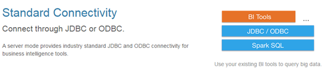

# Spark

## 1 Spark概述

### 1.1 什么是Spark

Spark是一种快速、通用、可扩展的大数据分析引擎，2009年诞生于加州大学伯克利分校AMPLab，2010年开源，2013年6月成为Apache孵化项目，2014年2月成为Apache顶级项目。目前，Spark生态系统已经发展成为一个包含多个子项目的集合，其中包含**SparkSQL、Spark Streaming、GraphX、MLlib**等子项目，Spark是基于内存计算的大数据并行计算框架。Spark基于内存计算，提高了在大数据环境下数据处理的实时性，同时保证了高容错性和高可伸缩性，允许用户将Spark部署在大量廉价硬件之上，形成集群。

### 1.2 为什么要学Spark

**中间结果输出**：基于MapReduce的计算引擎通常会将中间结果输出到磁盘上，进行存储和容错。出于任务管道承接的考虑，当一些查询翻译到MapReduce任务时，往往会产生多个Stage，而这些串联的Stage又依赖于底层文件系统（如HDFS）来存储每一个Stage的输出结果


- Spark是MapReduce的替代方案，而且兼容HDFS、Hive，可融入Hadoop的生态系统，以弥补MapReduce的不足
- Spark可以将中间结果缓存到内存中，后续在内存中再计算，而Map Reduce是将中间结果放在磁盘中，后续再计算时是重新从磁盘中读取数据

### 1.3 Spark特点

- 快

与Hadoop的MapReduce相比，Spark基于内存的运算要快100倍以上，基于硬盘的运算也要快10倍以上。Spark实现了高效的DAG执行引擎，可以通过基于内存来高效处理数据流。


- 易用

Spark支持Java、Python和Scala的API，还支持超过80种高级算法，使用户可以快速构建不同的应用。而且Spark支持交互式的Python和Scala的shell，可以非常方便地在这些shell中使用Spark集群来验证解决问题的方法。


- 通用

Spark提供了统一的解决方案。Spark可以用于批处理、交互式查询（Spark SQL）、实时流处理（Spark Streaming）、机器学习（Spark MLlib）和图计算（GraphX）。这些不同类型的处理都可以在同一个应用中无缝使用。Spark统一的解决方案非常具有吸引力，毕竟任何公司都想用统一的平台去处理遇到的问题，减少开发和维护的人力成本和部署平台的物力成本。

- 兼容性

Spark可以非常方便地与其他的开源产品进行融合。比如，Spark可以使用Hadoop的YARN和Apache Mesos作为它的资源管理和调度器，并且可以处理所有Hadoop支持的数据，包括HDFS、HBase和Cassandra等。这对于已经部署Hadoop集群的用户特别重要，因为不需要做任何数据迁移就可以使用Spark的强大处理能力。Spark也可以不依赖于第三方的资源管理和调度器，它实现了Standalone作为其内置的资源管理和调度框架，这样进一步降低了Spark的使用门槛，使得所有人都可以非常容易地部署和使用Spark。此外，Spark还提供了在EC2上部署Standalone的Spark集群的工具。


## 2 弹性分布式数据集RDD

### 2.1 RDD概述

#### 2.1.1  什么是RDD

RDD（Resilient Distributed Dataset）叫做弹性分布式数据集，是Spark中最基本的数据抽象，它代表一个不可变、可分区、里面的元素可并行计算的集合。RDD具有数据流模型的特点：自动容错、位置感知性调度和可伸缩性。RDD允许用户在执行多个查询时显式地将工作集缓存在内存中，后续的查询能够重用工作集，这极大地提升了查询速度。

1. RDD是一个基本的抽象，操作RDD就像操作一个本地集合一样，降低了编程的复杂度
2. RDD的算子分为两类，一类是**Transformation**（lazy），一类是**Action**（触发任务执行）
3. RDD不存真正要计算的数据，而是记录了RDD的转换关系（调用了什么方法，传入什么函数）

- RDD的简介


- RDD的计算逻辑


- RDD的进一步说明


#### 2.1.2 RDD的属性


- 1）一组分片（Partition），即数据集的基本组成单位。对于RDD来说，每个分片都会被一个计算任务处理，并决定并行计算的粒度。用户可以在创建RDD时指定RDD的分片个数，如果没有指定，那么就会采用默认值。默认值就是程序所分配到的CPU Core的数目。
- 2）一个计算每个分区的函数。Spark中RDD的计算是以分片为单位的，每个RDD都会实现compute函数以达到这个目的。compute函数会对迭代器进行复合，不需要保存每次计算的结果。
- 3）RDD之间的依赖关系。RDD的每次转换都会生成一个新的RDD，所以RDD之间就会形成类似于流水线一样的前后依赖关系。在部分分区数据丢失时，Spark可以通过这个依赖关系重新计算丢失的分区数据，而不是对RDD的所有分区进行重新计算。
- 4）一个Partitioner，即RDD的分片函数。当前Spark中实现了两种类型的分片函数，一个是基于哈希的HashPartitioner，另外一个是基于范围的RangePartitioner。只有对于key-value的RDD，才会有Partitioner，非key-value的RDD的Parititioner的值是None。Partitioner函数不但决定了RDD本身的分片数量，也决定了parent RDD Shuffle输出时的分片数量。
- 5）一个列表，存储存取每个Partition的优先位置（preferred location）。对于一个HDFS文件来说，这个列表保存的就是每个Partition所在的块的位置。按照“移动数据不如移动计算”的理念，Spark在进行任务调度的时候，会尽可能地将计算任务分配到其所要处理数据块的存储位置。

RDD的5个特点

 * A list of partitions  （一系列分区，一个RDD里面有多个分区，分区是有编号的，有顺序的）

 * A function for computing each split  （每一个切片都会有一个函数作业在上面用于对数据进行处理【会有一个函数作用在每个切片上】）

 * A list of dependencies on other RDDs  （RDD和RDD之间存在依赖关系（是父RDD调用什么方法，传入哪些函数得到的））

 * Optionally, a Partitioner for key-value RDDs (e.g. to say that the RDD is hash-partitioned)
   （可选，key value类型的RDD才有RDD[(K,V)]）如果是kv类型的RDD，会有一个分区器，默认是hash-partitioned【如果是RDD中装的是KV类型的，那么Shuffle时会有一个分区器。默认是HashPartitioner】

 * Optionally, a list of preferred locations to compute each split on (e.g. block locations for

   an HDFS file)（可选，如果是从HDFS中读取数据，会得到数据的最优位置（向Namenode请求元数据））【如果只从HDFS中读取数据，会感知数据的位置，将Executor启动在数据所在的机器上】

#### 2.1.3 RDD的分区

1）分区的介绍
分区partition,RDD内部的数据集合在逻辑上和物理上被划分成多个小的**子集合**,这样的每一个**子集合**我们将其称为分区,即是数据集的一个逻辑块。

RDD只是数据集的抽象,分区内部并不会存储具体的数据。Partition 类内包含一个 index 成员,表示该分区在 RDD 内的编号，通过 RDD 编号 + 分区编号可以唯一确定该分区对应的块编号,利用底层数据存储层提供的接口,就能从存储介质(如:HDFS、Memory)中提取出分区对应的数据。

2）分区的意义
RDD 是一种分布式的数据集,数据源多种多样,而且数据量也很大,在海量数据进行计算时,分区的个数会决定并行计算的粒度,一个partition被一个maptask处理,分区可以提高计算的并行度。

3）分区的原则
分区个数会对spark性能有影响。分区数不是越多越好,分区数太多意味着任务数太多,每次调度任务也是很耗时的,所以分区数太多会导致总体耗时增多。分区数太少的话,会导致一些结点没有分配到任务或者每个分区要处理的数据量会过大,从而对个别结点的内存要求就会提高。还有分区数不合理，会导致数据倾斜问题。


- RDD分区的数据取决于哪些因素？
  1.如果是将Driver端的Scala集合并行化创建RDD，并且没有指定RDD的分区，RDD的分区就是为该app分配的中的和核数
   2.如果是重hdfs中读取数据创建RDD，并且设置了最新分区数量是1，那么RDD的分区数据即使输入切片的数据，如果不设置最小分区的数量，即spark调用textFile时会默认传入2，那么RDD的分区数量会打于等于输入切片的数量

- mapPartitionsWithIndex 一次拿出一个分区（分区中并没有数据，而是记录要读取哪些数据，真正生成的Task会读取多条数据），并且可以将分区的编号取出来

  功能：取分区中对应的数据时，还可以将分区的编号取出来，这样就可以知道数据是属于哪个分区的（哪个区分对应的Task的数据）

  ```scala
  val func = (index: Int, it: Iterator[Int]) => {
      it.map(e => s"part: $index, ele: $e")
  }
  ```

### 2.2 创建RDD

- 创建RDD有哪些中方式呢？
  1.通过外部的存储系统创建RDD
   2.将Driver的Scala集合通过并行化的方式编程RDD（试验、测验）
   3.调用一个已经存在了的RDD的Transformation，会生成一个新的RDD

1）由一个已经存在的Scala集合创建。

val rdd1 = sc.parallelize(Array(1,2,3,4,5,6,7,8))

2）由外部存储系统的数据集创建，包括本地的文件系统，还有所有Hadoop支持的数据集，比如HDFS、Cassandra、HBase等

```shell
val rdd2 = sc.textFile("hdfs://node1.edu360.cn:9000/words.txt")
```

3）collect


#### 2.2.1 广播变量

- 广播变量


### 2.3 RDD中的两类算子

#### 2.3.1 Transformation

- RDD的Transformation的特点
  1.lazy
  2.生成新的RDD

RDD中的所有转换都是延迟加载的，也就是说，它们并不会直接计算结果。相反的，它们只是记住这些应用到基础数据集（例如一个文件）上的转换动作。只有当发生一个要求返回结果给Driver的动作时，这些转换才会真正运行。这种设计让Spark更加有效率地运行。

常用的Transformation：

| **转换**                                                 | **含义**                                                     |
| -------------------------------------------------------- | ------------------------------------------------------------ |
| **map**(func)                                            | 返回一个新的RDD，该RDD由每一个输入元素经过func函数转换后组成 |
| **filter**(func)                                         | 返回一个新的RDD，该RDD由经过func函数计算后返回值为true的输入元素组成 |
| **flatMap**(func)                                        | 类似于map，但是每一个输入元素可以被映射为0或多个输出元素（所以func应该返回一个序列，而不是单一元素） |
| **mapPartitions**(func)                                  | 类似于map，但独立地在RDD的每一个分片上运行，因此在类型为T的RDD上运行时，func的函数类型必须是Iterator[T] => Iterator[U] |
| **mapPartitionsWithIndex**(func)                         | 类似于mapPartitions，但func带有一个整数参数表示分片的索引值，因此在类型为T的RDD上运行时，func的函数类型必须是  (Int,  Interator[T]) => Iterator[U] |
| **sample**(withReplacement, fraction, seed)              | 根据fraction指定的比例对数据进行采样，可以选择是否使用随机数进行替换，seed用于指定随机数生成器种子 |
| **union**(otherDataset)                                  | 对源RDD和参数RDD求并集后返回一个新的RDD                      |
| **intersection**(otherDataset)                           | 对源RDD和参数RDD求交集后返回一个新的RDD                      |
| **distinct**([numTasks]))                                | 对源RDD进行去重后返回一个新的RDD                             |
| **groupByKey**([numTasks])                               | 在一个(K,V)的RDD上调用，返回一个(K, Iterator[V])的RDD        |
| **reduceByKey**(func, [numTasks])                        | 在一个(K,V)的RDD上调用，返回一个(K,V)的RDD，使用指定的reduce函数，将相同key的值聚合到一起，与groupByKey类似，reduce任务的个数可以通过第二个可选的参数来设置 |
| **aggregateByKey**(zeroValue)(seqOp, combOp, [numTasks]) |                                                              |
| **sortByKey**([ascending], [numTasks])                   | 在一个(K,V)的RDD上调用，K必须实现Ordered接口，返回一个按照key进行排序的(K,V)的RDD |
| **sortBy**(func,[ascending], [numTasks])                 | 与sortByKey类似，但是更灵活                                  |
| **join**(otherDataset, [numTasks])                       | 在类型为(K,V)和(K,W)的RDD上调用，返回一个相同key对应的所有元素对在一起的(K,(V,W))的RDD |
| **cogroup**(otherDataset, [numTasks])                    | 在类型为(K,V)和(K,W)的RDD上调用，返回一个(K,(Iterable<V>,Iterable<W>))类型的RDD |
| **cartesian**(otherDataset)                              | 笛卡尔积                                                     |
| **pipe**(command, [envVars])                             |                                                              |
| **coalesce**(numPartitions**)**                          |                                                              |
| **repartition**(numPartitions)                           |                                                              |
| **repartitionAndSortWithinPartitions**(partitioner)      |                                                              |

```scala
#常用Transformation(即转换，延迟加载)
#通过并行化scala集合创建RDD
val rdd1 = sc.parallelize(Array(1,2,3,4,5,6,7,8))
#查看该rdd的分区数量
rdd1.partitions.length
val rdd1 = sc.parallelize(List(5,6,4,7,3,8,2,9,1,10))
val rdd2 = sc.parallelize(List(5,6,4,7,3,8,2,9,1,10)).map(_*2).sortBy(x=>x,true)
val rdd3 = rdd2.filter(_>10)
val rdd2 = sc.parallelize(List(5,6,4,7,3,8,2,9,1,10)).map(_*2).sortBy(x=>x+"",true)
val rdd2 = sc.parallelize(List(5,6,4,7,3,8,2,9,1,10)).map(_*2).sortBy(x=>x.toString,true)
val rdd4 = sc.parallelize(Array("a b c", "d e f", "h i j"))
rdd4.flatMap(_.split(' ')).collect
val rdd5 = sc.parallelize(List(List("a b c", "a b b"),List("e f g", "a f g"), List("h i j", "a a b")))
List("a b c", "a b b") =List("a","b",))
rdd5.flatMap(_.flatMap(_.split(" "))).collect
#union求并集，注意类型要一致
val rdd6 = sc.parallelize(List(5,6,4,7))
val rdd7 = sc.parallelize(List(1,2,3,4))
val rdd8 = rdd6.union(rdd7)
rdd8.distinct.sortBy(x=>x).collect
#intersection求交集
val rdd9 = rdd6.intersection(rdd7)
val rdd1 = sc.parallelize(List(("tom", 1), ("jerry", 2), ("kitty", 3)))
val rdd2 = sc.parallelize(List(("jerry", 9), ("tom", 8), ("shuke", 7), ("tom", 2)))
#join(连接)
val rdd3 = rdd1.join(rdd2)
val rdd3 = rdd1.leftOuterJoin(rdd2)
val rdd3 = rdd1.rightOuterJoin(rdd2)
#groupByKey
val rdd3 = rdd1 union rdd2
rdd3.groupByKey
//(tom,CompactBuffer(1, 8, 2))
rdd3.groupByKey.map(x=>(x._1,x._2.sum))
groupByKey.mapValues(_.sum).collect
Array((tom,CompactBuffer(1, 8, 2)), (jerry,CompactBuffer(9, 2)), (shuke,CompactBuffer(7)), (kitty,CompactBuffer(3)))
#WordCount
sc.textFile("/root/words.txt").flatMap(x=>x.split(" ")).map((_,1)).reduceByKey(_+_).sortBy(_._2,false).collect
sc.textFile("/root/words.txt").flatMap(x=>x.split(" ")).map((_,1)).groupByKey.map(t=>(t._1, t._2.sum)).collect
#cogroup
val rdd1 = sc.parallelize(List(("tom", 1), ("tom", 2), ("jerry", 3), ("kitty", 2)))
val rdd2 = sc.parallelize(List(("jerry", 2), ("tom", 1), ("shuke", 2)))
val rdd3 = rdd1.cogroup(rdd2)
val rdd4 = rdd3.map(t=>(t._1, t._2._1.sum + t._2._2.sum))
#cartesian笛卡尔积
val rdd1 = sc.parallelize(List("tom", "jerry"))
val rdd2 = sc.parallelize(List("tom", "kitty", "shuke"))
val rdd3 = rdd1.cartesian(rdd2)
```

常用Transformation

| aggregateByKey        | 是Transformation |
| --------------------- | ---------------- |
| reduceByKey           | 是Transformation |
| filter                | 是Transformation |
| flatMap               | 是Transformation |
| map                   | 是Transformation |
| mapPartition          | 是Transformation |
| mapPartitionWithIndex | 是Transformation |

#### 2.3.2 Action

| **动作**                                          | **含义**                                                     |
| ------------------------------------------------- | ------------------------------------------------------------ |
| **reduce**(*func*)                                | 通过func函数聚集RDD中的所有元素，这个功能必须是课交换且可并联的 |
| **collect**()                                     | 在驱动程序中，以数组的形式返回数据集的所有元素               |
| **count**()                                       | 返回RDD的元素个数                                            |
| **first**()                                       | 返回RDD的第一个元素（类似于take(1)）                         |
| **take**(*n*)                                     | 返回一个由数据集的前n个元素组成的数组                        |
| **takeSample**(*withReplacement*,*num*, [*seed*]) | 返回一个数组，该数组由从数据集中随机采样的num个元素组成，可以选择是否用随机数替换不足的部分，seed用于指定随机数生成器种子 |
| **takeOrdered**(*n*, *[ordering]*)                |                                                              |
| **saveAsTextFile**(*path*)                        | 将数据集的元素以textfile的形式保存到HDFS文件系统或者其他支持的文件系统，对于每个元素，Spark将会调用toString方法，将它装换为文件中的文本 |
| **saveAsSequenceFile**(*path*)                    | 将数据集中的元素以Hadoop sequencefile的格式保存到指定的目录下，可以使HDFS或者其他Hadoop支持的文件系统。 |
| **saveAsObjectFile**(*path*)                      |                                                              |
| **countByKey**()                                  | 针对(K,V)类型的RDD，返回一个(K,Int)的map，表示每一个key对应的元素个数。 |
| **foreach**(*func*)                               | 在数据集的每一个元素上，运行函数func进行更新。               |

```scala
#spark action
val rdd1 = sc.parallelize(List(1,2,3,4,5), 2)
#collect
rdd1.collect
#reduce
val r = rdd1.reduce(_+_)
#count
rdd1.count
#top
rdd1.top(2)
#take
rdd1.take(2)
#first(similer to take(1))
rdd1.first
#takeOrdered
rdd1.takeOrdered(3)
```

常用Action

| collect          | 是Action |
| ---------------- | -------- |
| aggregate        | 是Action |
| saveAsTextFile   | 是Action |
| foreach          | 是Action |
| foreachPartition | 是Action |

#### 2.3.3 WordCount中的RDD


#### 2.3.4 练习

启动spark-shell

```shell
/usr/local/spark-1.5.2-bin-hadoop2.6/bin/spark-shell --master spark://node1.edu360.cn:7077 
```

练习1：

```scala
//通过并行化生成rdd
val rdd1 = sc.parallelize(List(5, 6, 4, 7, 3, 8, 2, 9, 1, 10))
//对rdd1里的每一个元素乘2然后排序
val rdd2 = rdd1.map(_ * 2).sortBy(x => x, true)
//过滤出大于等于十的元素
val rdd3 = rdd2.filter(_ >= 10)
//将元素以数组的方式在客户端显示
rdd3.collect
```

练习2：

```scala
val rdd1 = sc.parallelize(Array("a b c", "d e f", "h i j"))
//将rdd1里面的每一个元素先切分在压平
val rdd2 = rdd1.flatMap(_.split(' '))
rdd2.collect
```

练习3：

```scala
val rdd1 = sc.parallelize(List(5, 6, 4, 3))
val rdd2 = sc.parallelize(List(1, 2, 3, 4))
//求并集
val rdd3 = rdd1.union(rdd2)
//求交集
val rdd4 = rdd1.intersection(rdd2)
//去重
rdd3.distinct.collect
rdd4.collect
```

练习4：

```scala
val rdd1 = sc.parallelize(List(("tom", 1), ("jerry", 3), ("kitty", 2)))
val rdd2 = sc.parallelize(List(("jerry", 2), ("tom", 1), ("shuke", 2)))
//求jion
val rdd3 = rdd1.join(rdd2)
rdd3.collect
//求并集
val rdd4 = rdd1 union rdd2
//按key进行分组
rdd4.groupByKey
rdd4.collect
```

练习5：

```scala
val rdd1 = sc.parallelize(List(("tom", 1), ("tom", 2), ("jerry", 3), ("kitty", 2)))
val rdd2 = sc.parallelize(List(("jerry", 2), ("tom", 1), ("shuke", 2)))
//cogroup
val rdd3 = rdd1.cogroup(rdd2)
//注意cogroup与groupByKey的区别
rdd3.collect
```

练习6：

```scala
val rdd1 = sc.parallelize(List(1, 2, 3, 4, 5))
//reduce聚合
val rdd2 = rdd1.reduce(_ + _)
rdd2.collect
```

练习7：

```scala
val rdd1 = sc.parallelize(List(("tom", 1), ("jerry", 3), ("kitty", 2), ("shuke", 1)))
val rdd2 = sc.parallelize(List(("jerry", 2), ("tom", 3), ("shuke", 2), ("kitty", 5)))
val rdd3 = rdd1.union(rdd2)
//按key进行聚合
val rdd4 = rdd3.reduceByKey(_ + _)
rdd4.collect
//按value的降序排序
val rdd5 = rdd4.map(t => (t._2, t._1)).sortByKey(false).map(t => (t._2, t._1))
rdd5.collect
```

- spark rdd api【Spark Shell】

```scala
mapPartitionsWithIndex
val func = (index: Int, iter: Iterator[(String)]) => {
  iter.map(x => "[partID:" +  index + ", val: " + x + "]")
}
mapPartitionsWithIndex
val func = (index: Int, iter: Iterator[Int]) => {
  iter.map(x => "[partID:" +  index + ", val: " + x + "]")
}
val rdd1 = sc.parallelize(List(1,2,3,4,5,6,7,8,9), 2)
rdd1.mapPartitionsWithIndex(func).collect
-----------------------------------------------------------------------------------------
aggregate

def func1(index: Int, iter: Iterator[(Int)]) : Iterator[String] = {
  iter.toList.map(x => "[partID:" +  index + ", val: " + x + "]").iterator
}
val rdd1 = sc.parallelize(List(1,2,3,4,5,6,7,8,9), 2)
rdd1.mapPartitionsWithIndex(func1).collect
rdd1.aggregate(0)(math.max(_, _), _ + _)
rdd1.aggregate(5)(math.max(_, _), _ + _)
val rdd2 = sc.parallelize(List("a","b","c","d","e","f"),2)
def func2(index: Int, iter: Iterator[(String)]) : Iterator[String] = {
  iter.toList.map(x => "[partID:" +  index + ", val: " + x + "]").iterator
}
rdd2.aggregate("")(_ + _, _ + _)
rdd2.aggregate("=")(_ + _, _ + _)
val rdd3 = sc.parallelize(List("12","23","345","4567"),2)
rdd3.aggregate("")((x,y) => math.max(x.length, y.length).toString, (x,y) => x + y)
val rdd4 = sc.parallelize(List("12","23","345",""),2)
rdd4.aggregate("")((x,y) => math.min(x.length, y.length).toString, (x,y) => x + y)
val rdd5 = sc.parallelize(List("12","23","","345"),2)
rdd5.aggregate("")((x,y) => math.min(x.length, y.length).toString, (x,y) => x + y)
-----------------------------------------------------------------------------------------
aggregateByKey
val pairRDD = sc.parallelize(List( ("cat",2), ("cat", 5), ("mouse", 4),("cat", 12), ("dog", 12), ("mouse", 2)), 2)
def func2(index: Int, iter: Iterator[(String, Int)]) : Iterator[String] = {
  iter.map(x => "[partID:" +  index + ", val: " + x + "]")
}
pairRDD.mapPartitionsWithIndex(func2).collect
pairRDD.aggregateByKey(0)(math.max(_, _), _ + _).collect
pairRDD.aggregateByKey(100)(math.max(_, _), _ + _).collect
-----------------------------------------------------------------------------------------
checkpoint
sc.setCheckpointDir("hdfs://node-1.edu360.cn:9000/ck")
val rdd = sc.textFile("hdfs://node-1.edu360.cn:9000/wc").flatMap(_.split(" ")).map((_, 1)).reduceByKey(_+_)
rdd.checkpoint
rdd.isCheckpointed
rdd.count
rdd.isCheckpointed
rdd.getCheckpointFile
-----------------------------------------------------------------------------------------
coalesce, repartition
val rdd1 = sc.parallelize(1 to 10, 10)
val rdd2 = rdd1.coalesce(2, false)
rdd2.partitions.length
-----------------------------------------------------------------------------------------
collectAsMap
val rdd = sc.parallelize(List(("a", 1), ("b", 2)))
rdd.collectAsMap
-----------------------------------------------------------------------------------------
combineByKey
val rdd1 = sc.textFile("hdfs://node-1.edu360.cn:9000/wc").flatMap(_.split(" ")).map((_, 1))
val rdd2 = rdd1.combineByKey(x => x, (a: Int, b: Int) => a + b, (m: Int, n: Int) => m + n)
rdd2.collect
val rdd3 = rdd1.combineByKey(x => x + 10, (a: Int, b: Int) => a + b, (m: Int, n: Int) => m + n)
rdd3.collect
val rdd4 = sc.parallelize(List("dog","cat","gnu","salmon","rabbit","turkey","wolf","bear","bee"), 3)
val rdd5 = sc.parallelize(List(1,1,2,2,2,1,2,2,2), 3)
val rdd6 = rdd5.zip(rdd4)
val rdd7 = rdd6.combineByKey(List(_), (x: List[String], y: String) => x :+ y, (m: List[String], n: List[String]) => m ++ n)
-----------------------------------------------------------------------------------------
countByKey 
val rdd1 = sc.parallelize(List(("a", 1), ("b", 2), ("b", 2), ("c", 2), ("c", 1)))
rdd1.countByKey
rdd1.countByValue
-----------------------------------------------------------------------------------------
filterByRange
val rdd1 = sc.parallelize(List(("e", 5), ("c", 3), ("d", 4), ("c", 2), ("a", 1)))
val rdd2 = rdd1.filterByRange("b", "d")
rdd2.colllect
-----------------------------------------------------------------------------------------
flatMapValues
val a = sc.parallelize(List(("a", "1 2"), ("b", "3 4")))
rdd3.flatMapValues(_.split(" "))
-----------------------------------------------------------------------------------------
foldByKey
val rdd1 = sc.parallelize(List("dog", "wolf", "cat", "bear"), 2)
val rdd2 = rdd1.map(x => (x.length, x))
val rdd3 = rdd2.foldByKey("")(_+_)
val rdd = sc.textFile("hdfs://node-1.edu360.cn:9000/wc").flatMap(_.split(" ")).map((_, 1))
rdd.foldByKey(0)(_+_)
-----------------------------------------------------------------------------------------
foreachPartition
val rdd1 = sc.parallelize(List(1, 2, 3, 4, 5, 6, 7, 8, 9), 3)
rdd1.foreachPartition(x => println(x.reduce(_ + _)))
-----------------------------------------------------------------------------------------
keyBy
val rdd1 = sc.parallelize(List("dog", "salmon", "salmon", "rat", "elephant"), 3)
val rdd2 = rdd1.keyBy(_.length)
rdd2.collect
-----------------------------------------------------------------------------------------
keys values
val rdd1 = sc.parallelize(List("dog", "tiger", "lion", "cat", "panther", "eagle"), 2)
val rdd2 = rdd1.map(x => (x.length, x))
rdd2.keys.collect
rdd2.values.collect
-----------------------------------------------------------------------------------------
mapPartitions( it: Iterator => {it.map(x => x * 10)})
```

想要了解更多，访问下面的地址

http://homepage.cs.latrobe.edu.au/zhe/ZhenHeSparkRDDAPIExamples.html

### 2.4 RDD的依赖关系

RDD和它依赖的父RDD（s）的关系有两种不同的类型，即窄依赖（narrow dependency）和宽依赖（wide dependency）。


shuffle重要的依据：父RDD的一个分区的数据，要给子RDD的多个分区

#### 2.4.1 窄依赖

窄依赖指的是每一个父RDD的Partition最多被子RDD的一个Partition使用

总结：窄依赖我们形象的比喻为**独生子女**

#### 2.4.2 宽依赖

宽依赖指的是多个子RDD的Partition会依赖同一个父RDD的Partition

总结：窄依赖我们形象的比喻为**超生**

#### 2.4.3 Lineage

RDD只支持粗粒度转换，即在大量记录上执行的单个操作。将创建RDD的一系列Lineage（即血统）记录下来，以便恢复丢失的分区。RDD的Lineage会记录RDD的元数据信息和转换行为，当该RDD的部分分区数据丢失时，它可以根据这些信息来重新运算和恢复丢失的数据分区。


### 2.5 RDD的缓存

Spark速度非常快的原因之一，就是在不同操作中可以在内存中持久化或缓存个数据集。当持久化某个RDD后，每一个节点都将把计算的分片结果保存在内存中，并在对此RDD或衍生出的RDD进行的其他动作中重用。这使得后续的动作变得更加迅速。RDD相关的持久化和缓存，是Spark最重要的特征之一。可以说，缓存是Spark构建迭代式算法和快速交互式查询的关键。

#### 2.5.1  RDD缓存方式

RDD通过persist方法或cache方法可以将前面的计算结果缓存，但是并不是这两个方法被调用时立即缓存，而是触发后面的action时，该RDD将会被缓存在计算节点的内存中，并供后面重用。


通过查看源码发现cache最终也是调用了persist方法，默认的存储级别都是仅在内存存储一份，Spark的存储级别还有好多种，存储级别在object StorageLevel中定义的。


缓存有可能丢失，或者存储存储于内存的数据由于内存不足而被删除，RDD的缓存容错机制保证了即使缓存丢失也能保证计算的正确执行。通过基于RDD的一系列转换，丢失的数据会被重算，由于RDD的各个Partition是相对独立的，因此只需要计算丢失的部分即可，并不需要重算全部Partition。

### 2.6 DAG的生成

DAG(Directed Acyclic Graph)叫做有向无环图，原始的RDD通过一系列的转换就就形成了DAG，根据RDD之间的依赖关系的不同将DAG划分成不同的Stage，对于窄依赖，partition的转换处理在Stage中完成计算。对于宽依赖，由于有Shuffle的存在，只能在parent RDD处理完成后，才能开始接下来的计算，因此宽依赖是划分Stage的依据。


- DAG


- DAG 有向无环图（数据执行过程，有方法，无闭环）
- DAG描述多个RDD的转换过程，任务执行时，可以按照DAG的描述，执行真正的计算（数据被操作的一个过程）
- DAG是有边界的：开始（通过SparkContext创建的RDD），结束（触发Action，调用run Job就是一个完整的DAG就形成了，一旦触发Action就形成了一个完整的DAG）
- 一个RDD只是描述了数据计算过程中的一个环节，而DGA由一到多个RDD组成，描述了数据计算过程中的所有环节（过程）
- 一个Spark Application中是有多少个DAG：一到多个（取决于触发了多少次Action）
- 一个DAG中可能有产生多种不同类型和功能的Task，会有不同的阶段
- DAGScheduler：将一个DAG切分成一到多个Stage，DAGScheduler切分的依据是Shuffle（宽依赖）

### 2.7 RDD算子

#### 2.7.1 aggregateByKey


#### 2.7.2 combineByKey


#### 2.7.3 cache


- 什么是后进行cache
  1.要求的计算速度快
  2.集群的资源要足够大
  3.重要：cache的数据会多次的触发Action
  4.先进行过滤，然后将缩小范围的数据在cache到内存

```scala
val MEMORY_AND_DISK = new StorageLevel(true, true, false, true)
//第一个参数，放到磁盘
//第二个参数，放到内存
//第三个参数，磁盘中的数据，不是以java对象的方式保存
//第四个参数，内存中的数据，以java对象的方式保存
```

- OFF_HEAP:堆外内存 （Tachyon，分布式内存存储系统）

  Alluxio - Open Source Memory Speed Virtual Distributed Storage

#### 2.7.4 rangePartitioner


- 自定义分区器


#### 2.7.5 shuffle

shuffle的定义
	shuffle的含义是洗牌，将数据打散，父RDD一个分区中的数据如果给了子RDD的多个分区（只有存在这种可能），就是shuffle
	shuffle会有网络传输数据，但是有网络传输，并不意味着就是shuffle


#### 2.7.6 jdbcRDD


- rdd的groupBy


- RDD的join


- RDD特殊的join


### 2.8 RDD总结

RDD是spark中的一个最基本的抽象，代表着一个不可变、可分区、可以并行计算的分布式数据集

Spark的设计就是基于这个抽象的数据集（RDD），你操作RDD这个抽象的数据集，就像操作一个本地集合一样，Spark包底层的细节都隐藏起来的（任务调度、Task执行，任务失败重试等待），开发者使用起来更加方便简洁

操作RDD，其实是对每个分区进行操作，分区会生成Task，Task会调度Executor上执行相关的计算逻辑，进而对数据进操作

## 3 Spark执行原理

### 3.1 spark总体流程


- Spark 任务执行的流程

  四个步骤
  1.构建DAG（调用RDD上的方法）
  2.DAGScheduler将DAG切分Stage（切分的依据是Shuffle），将Stage中生成的Task以TaskSet的形式给TaskScheduler
  3.TaskScheduler调度Task（根据资源情况将Task调度到相应的Executor中）
  4.Executor接收Task，然后将Task丢入到线程池中执行

### 3.2 spark运行原理


### 3.3 Spark的运行架构

#### 3.3.1 Driver、master、worker、executor之间的关系


- driver可以运行在master上，也可以运行worker上（根据部署模式的不同）。driver首先会向集群管理者（standalone、yarn，mesos）申请spark应用所需的资源，也就是executor，然后集群管理者会根据spark应用所设置的参数在各个worker上分配一定数量的executor，每个executor都占用一定数量的cpu和memory。在申请到应用所需的资源以后，driver就开始调度和执行我们编写的应用代码了。driver进程会将我们编写的spark应用代码拆分成多个stage，每个stage执行一部分代码片段，并为每个stage创建一批tasks，然后将这些tasks分配到各个executor中执行。

- executor进程宿主在worker节点上，一个worker可以有多个executor。每个executor持有一个线程池，每个线程可以执行一个task，executor执行完task以后将结果返回给driver，每个executor执行的task都属于同一个应用。此外executor还有一个功能就是为应用程序中要求缓存的 RDD 提供内存式存储，RDD 是直接缓存在executor进程内的，因此任务可以在运行时充分利用缓存数据加速运算

#### 3.3.2 Spark的执行过程


1. Driver端会生成具体的任务，然后把任务通过网络发给Executor执行，其实一个excutor可以执行多个任务，这个任务是在Driver生成，然后发送到Excutor执行。
2. 先启动master，在启动worker，worker启动后会向master发送注册，master会把worker信息保存起来，然后master会向worker发送信息说保存成功，然后worker会定时发送心跳到master，发送心跳信息的目的是告诉master我还活着，然后通过客户端来提交计算任务【就是sparkSubmit，其通过脚本启动的，这个脚本会启动一个main方法，这个main类的名字就叫sparkSubmit】，启动完成后，这个SparkSubmit会向master进行通信，向master申请资源，master查看申请资源是否符合条件，如果满足，master会跟worker进行通信，然后让worker启动excutor，excutor启动完成，excutor在向Driver建立连接。
3. Excutor启动后会主动连接Driver（通过Master-》Worker-》Executor进而知道Driver在哪里）

### 3.4 SparkWordCount执行过程


### 3.5 Spark任务执行各对象创建的时机

1.SparkContext哪一端生成的？
	Driver端

2.DAG是在哪一端被构建的？
    Driver端
3.RDD是在哪一端生成的？
	Driver端

4.广播变量是在哪一端调用的方法进行广播的？
	Driver端

5.要广播的数据应该在哪一端先创建好再广播呢？ 
	Driver端

6.调用RDD的算子（Transformation和Action）是在哪一端调用的
	Driver端
7.RDD在调用Transformation和Action时需要传入一个函数，函数是在哪一端声明和传入的?
	Driver端

6.RDD在调用Transformation和Action时需要传入函数，请问传入的函数是在哪一端执行了函数的业务逻辑？
	Executor中的Task执行的

7.自定义的分区器这个类是在哪一端实例化的？
	Driver端

8.分区器中的getParitition方法在哪一端调用的呢？
	Executor中的Task中调用的

9.Task是在哪一端生成的呢？ 
	Driver端

10.DAG是在哪一端构建好的并被切分成一到多个State的
	Driver端

11.DAG是哪个类完成的切分Stage的功能？
	DAGScheduler
12.DAGScheduler将切分好的Stage以什么样的形式给TaskScheduler
	TaskSet

### 3.6 创建实例【在executor中执行时】


## 4 Spark SQL

### 4.1 Spark SQL概述

#### 4.1.1  什么是Spark SQL


Spark SQL是Spark用来处理结构化数据的一个模块，它提供了一个编程抽象叫做DataFrame并且作为分布式SQL查询引擎的作用。

#### 4.1.2  为什么要学习Spark SQL

我们已经学习了Hive，它是将Hive SQL转换成MapReduce然后提交到集群上执行，大大简化了编写MapReduce的程序的复杂性，由于MapReduce这种计算模型执行效率比较慢。所有Spark SQL的应运而生，它是将Spark SQL转换成RDD，然后提交到集群执行，执行效率非常快！

1.易整合

 

2.统一的数据访问方式

 

3.兼容Hive

 

4.标准的数据连接

 

### 4.2 DataFrames

#### 4.2.1  什么是DataFrames（1.3）

与RDD类似，DataFrame也是一个分布式数据容器。然而DataFrame更像传统数据库的二维表格，除了数据以外，还记录数据的结构信息，即schema。同时，与Hive类似，DataFrame也支持嵌套数据类型（struct、array和map）。从API易用性的角度上 看，DataFrame API提供的是一套高层的关系操作，比函数式的RDD API要更加友好，门槛更低。由于与R和Pandas的DataFrame类似，Spark DataFrame很好地继承了传统单机数据分析的开发体验。

 

#### 4.2.2  创建DataFrames

1.在本地创建一个文件，有三列，分别是id、name、age，用空格分隔，然后上传到hdfs上

```scala
hdfs dfs -put person.txt / 
```

2.在spark shell执行下面命令，读取数据，将每一行的数据使用列分隔符分割

```scala
val lineRDD = sc.textFile("hdfs://node1.xiaoniu.com:9000/person.txt").map(_.split(" "))
```

3.定义case class（相当于表的schema）

```scala
case class Person(id:Int, name:String, age:Int)
```

4.将RDD和case class关联

```scala
val personRDD = lineRDD.map(x => Person(x(0).toInt, x(1), x(2).toInt))
```

5.将RDD转换成DataFrame

```scala
val personDF = personRDD.toDF
```

6.对DataFrame进行处理

```scala
personDF.show
```

### 4.3 DataFrame常用操作

#### 4.3.1 DSL风格语法

```scala
//查看DataFrame中的内容
personDF.show
//查看DataFrame部分列中的内容
personDF.select(personDF.col("name")).show
personDF.select(col("name"), col("age")).show
personDF.select("name").show
//打印DataFrame的Schema信息
personDF.printSchema
//查询所有的name和age，并将age+1
personDF.select(col("id"), col("name"), col("age") + 1).show
personDF.select(personDF("id"), personDF("name"), personDF("age") + 1).show
//过滤age大于等于18的
personDF.filter(col("age") >= 18).show
//按年龄进行分组并统计相同年龄的人数
personDF.groupBy("age").count().show()
```

#### 4.3.2  SQL风格语法

```scala
//如果想使用SQL风格的语法，需要将DataFrame注册成表
personDF.registerTempTable("t_person")
//查询年龄最大的前两名
sqlContext.sql("select * from t_person order by age desc limit 2").show
//显示表的Schema信息
sqlContext.sql("desc t_person").show
```

### 4.4 以编程方式执行Spark SQL查询

#### 4.4.1 编写Spark SQL查询程序

前面我们学习了如何在Spark Shell中使用SQL完成查询，现在我们来实现在自定义的程序中编写Spark SQL查询程序。首先在maven项目的pom.xml中添加Spark SQL的依赖

```xml
<dependency>   
    <groupId>org.apache.spark</groupId>  
    <artifactId>spark-sql_2.10</artifactId>  
    <version>1.6.3</version>  
</dependency>
```

#### 4.4.2  通过反射推断Schema

创建一个object为cn.xiaoniu.spark.sql.InferringSchema

```scala
package cn.xiaoniu.spark.sql    
import org.apache.spark.{SparkConf, SparkContext}  
import org.apache.spark.sql.SQLContext  
object InferringSchema { 
        def main(args: Array[String]) {     
            //创建SparkConf()并设置App名称
            val conf = new SparkConf().setAppName("SQL-1") 
            //SQLContext要依赖SparkContext
            val sc = new SparkContext(conf)  
            //创建SQLContext 
            val sqlContext = new SQLContext(sc)  
            //从指定的地址创建RDD 
            val lineRDD = sc.textFile(args(0)).map(_.split(" "))    
            //创建case class    
            //将RDD和case class关联 
            val personRDD = lineRDD.map(x => Person(x(0).toInt, x(1), x(2).toInt))                   //导入隐式转换，如果不到人无法将RDD转换成DataFrame   
            //将RDD转换成DataFrame 
            import sqlContext.implicits._   
            val personDF = personRDD.toDF   
            //注册表 
            personDF.registerTempTable("t_person")  
            //传入SQL 
            val df = sqlContext.sql("select from t_person order by age desc limit 2")   
            //将结果以JSON的方式存储到指定位置
            df.write.json(args(1))   
            //停止Spark Context  
            sc.stop()  } }  
//case class一定要放到外面   
case class Person(id: Int, name: String, age: Int)
```

将程序打成jar包，上传到spark集群，提交Spark任务

```scala
/usr/local/spark-1.6.3-bin-hadoop2.6/bin/spark-submit \
--class cn.xiaoniu.spark.sql.InferringSchema \
--master spark://node1.xiaoniu.com:7077 \
/root/spark-mvn-1.0-SNAPSHOT.jar \
hdfs://node1.xiaoniu.com:9000/person.txt \
hdfs://node1.xiaoniu.com:9000/out
```

查看运行结果

```shell
hdfs dfs -cat hdfs://node1.xiaoniu.com:9000/out/part-r-*
```

#### 4.4.3 通过StructType直接指定Schema

创建一个object为cn.xiaoniu.spark.sql.SpecifyingSchema

```scala
package cn.xiaoniu.spark.sql  
import org.apache.spark.sql.{Row, SQLContext}  
import org.apache.spark.sql.types._  
import org.apache.spark.{SparkContext, SparkConf}
object SpecifSchema { 
    def main(args: Array[String]) {  
        //创建SparkConf()并设置App名称
        val conf = new SparkConf().setAppName("SQL-2")
        //SQLContext要依赖SparkContext
        val sc = new SparkContext(conf)  
        //创建SQLContext 
        val sqlContext = new SQLContext(sc)  
        //从指定的地址创建RDD 
        val personRDD = sc.textFile(args(0)).map(_.split(" "))   
        //通过StructType直接指定每个字段的schema
        val schema = StructType(   
            List(    
                StructField("id", IntegerType, true),  
                StructField("name", StringType, true),  
                StructField("age", IntegerType, true)   
            )  
        ) 
        //将RDD映射到rowRDD 
        val rowRDD = personRDD.map(p => Row(p(0).toInt, p(1).trim, p(2).toInt))   
        //将schema信息应用到rowRDD上 
        val personDataFrame = sqlContext.createDataFrame(rowRDD, schema) 
        //注册表  
        personDataFrame.registerTempTable("t_person")   
        //执行SQL  
        val df = sqlContext.sql("select * from t_person order by age desc limit 4")   
        //将结果以JSON的方式存储到指定位置
        df.write.json(args(1))  
        //停止Spark Context
        sc.stop()  } }
```

将程序打成jar包，上传到spark集群，提交Spark任务

```scala
/usr/local/spark-1.6.3-bin-hadoop2.6/bin/spark-submit \
--class cn.xiaoniu.spark.sql.InferringSchema \
--master spark://node1.xiaoniu.com:7077 \
/root/spark-mvn-1.0-SNAPSHOT.jar \
hdfs://node1.xiaoniu.com:9000/person.txt \
hdfs://node1.xiaoniu.com:9000/out1
```

查看结果

```shell
hdfs dfs -cat hdfs://node1.xiaoniu.com:9000/out1/part-r-*
```

### 4.5  数据源

#### 4.5.1 JDBC

Spark SQL可以通过JDBC从关系型数据库中读取数据的方式创建DataFrame，通过对DataFrame一系列的计算后，还可以将数据再写回关系型数据库中。

#### 4.5.2 从MySQL中加载数据（Spark Shell方式）

1.启动Spark Shell，必须指定mysql连接驱动jar包

```shell
/usr/local/spark-1.6.3-bin-hadoop2.6/bin/spark-shell \
--master spark://node1.xiaoniu.com:7077 \
--jars /usr/local/spark-1.6.3-bin-hadoop2.6/mysql-connector-java-5.1.35-bin.jar \
--driver-class-path /usr/local/spark-1.6.3-bin-hadoop2.6/mysql-connector-java-5.1.35-bin.jar
```

2.从mysql中加载数据

```scala
val jdbcDF = sqlContext.read.format("jdbc").options(Map("url" -> "jdbc:mysql://192.168.10.1:3306/bigdata", "driver" -> "com.mysql.jdbc.Driver", "dbtable" -> "person", "user" -> "root", "password" -> "123456")).load()
```

3.执行查询

```scala
jdbcDF.show()
```

#### 4.5.3 将数据写入到MySQL中（打jar包方式）

1.编写Spark SQL程序

```scala
package cn.xiaoniu.spark.sql
import java.util.Properties  
import org.apache.spark.sql.{SQLContext, Row}  
import org.apache.spark.sql.types.{StringType, IntegerType, StructField, StructType} import org.apache.spark.{SparkConf, SparkContext}   
object JdbcRDD {  
    def main(args: Array[String]) {  
    val conf = new SparkConf().setAppName("MySQL-Demo")   
        val sc = new SparkContext(conf)   
        val sqlContext = new SQLContext(sc)   
        //通过并行化创建RDD   
        val personRDD = sc.parallelize(Array("1 tom 5", "2 jerry 3", "3 kitty 6")).map(_.split(" "))
        //通过StructType直接指定每个字段的schema  
        val schema = StructType(    
            List(     
                StructField("id", IntegerType, true),   
                StructField("name", StringType, true),
                StructField("age", IntegerType, true) 
            ) 
        )   
        //将RDD映射到rowRDD   
        val rowRDD = personRDD.map(p => Row(p(0).toInt, p(1).trim, p(2).toInt))
        //将schema信息应用到rowRDD上   
        val personDataFrame = sqlContext.createDataFrame(rowRDD, schema)   
        //创建Properties存储数据库相关属性
        val prop = new Properties()   
        prop.put("user", "root")  
        prop.put("password", "123456")  
        //将数据追加到数据库
        personDataFrame.write.mode("append").jdbc("jdbc:mysql://192.168.10.1:3306/bigdata", "bigdata.person", prop)   
        //停止SparkContext
        sc.stop()  } }`` 
```

2.用maven将程序打包

3.将Jar包提交到spark集群

```shell
/usr/local/spark-1.6.3-bin-hadoop2.6/bin/spark-submit \
--class cn.xiaoniu.spark.sql.JdbcRDD \
--master spark://node1.xiaoniu.com:7077 \
--jars /usr/local/spark-1.6.3-bin-hadoop2.6/mysql-connector-java-5.1.35-bin.jar \
--driver-class-path /usr/local/spark-1.6.3-bin-hadoop2.6/mysql-connector-java-5.1.35-bin.jar \
/root/spark-mvn-1.0-SNAPSHOT.jar
```

#### 4.5.4 parquet文件格式


### 4.6 Spark整合Hive

1.安装MySQL并创建一个普通用户，并且授权
	CREATE USER 'bigdata'@'%' IDENTIFIED BY '123568'; 
	GRANT ALL PRIVILEGES ON hivedb.* TO 'bigdata'@'%' IDENTIFIED BY '123568' WITH GRANT OPTION;
	FLUSH PRIVILEGES;

2.添加一个hive-site.xml

```xml
<?xml version="1.0" encoding="UTF-8" standalone="no"?>
<?xml-stylesheet type="text/xsl" href="configuration.xsl"?>
<!--
   Licensed to the Apache Software Foundation (ASF) under one or more
   contributor license agreements.  See the NOTICE file distributed with
   this work for additional information regarding copyright ownership.
   The ASF licenses this file to You under the Apache License, Version 2.0
   (the "License"); you may not use this file except in compliance with
   the License.  You may obtain a copy of the License at  http://www.apache.org/licenses/LICENSE-2.0    Unless required by applicable law or agreed to in writing, software
   distributed under the License is distributed on an "AS IS" BASIS,
   WITHOUT WARRANTIES OR CONDITIONS OF ANY KIND, either express or implied.
   See the License for the specific language governing permissions and
   limitations under the License.
-->
<configuration>
  <property>
    <name>javax.jdo.option.ConnectionURL</name>
    <value>jdbc:mysql://node-6:3306/hivedb?createDatabaseIfNotExist=true</value>
    <description>JDBC connect string for a JDBC metastore</description>
  </property>

   <property>
    <name>javax.jdo.option.ConnectionDriverName</name>
    <value>com.mysql.jdbc.Driver</value>
    <description>Driver class name for a JDBC metastore</description>
  </property>

  <property>
    <name>javax.jdo.option.ConnectionUserName</name>
    <value>bigdata</value>
    <description>username to use against metastore database</description>
  </property>

  <property>
    <name>javax.jdo.option.ConnectionPassword</name>
    <value>123568</value>
    <description>password to use against metastore database</description>
  </property>

</configuration>
```

3.上传一个mysql连接驱动

```shell
./spark-sql --master spark://node-4:7077,node-5:7077 --driver-class-path /home/xiaoniu/mysql-connector-java-5.1.7-bin.jar
```

4.sparkSQL会在mysql上创建一个database，需要手动改一下DBS表中的DB_LOCATION_UIR改成hdfs的地址

5.重新启动SparkSQL的命令行

## 5 SparkStreaming

### 5.1 Spark Streaming概述

#### 5.1.1 DStream

1.Spark Streaming是一个基于Spark Core之上的实时计算框架，可以从很多数据源消费数据并对数据进行处理，
在Spark Streaing中有一个最基本的抽象叫DStream（代理），本质上就是一系列连续的RDD，DStream其实就是对RDD的封装
DStream可以任务是一个RDD的工厂，该DStream里面生产都是相同业务逻辑的RDD，只不过是RDD里面要读取数据的不相同

深入理解DStream:他是sparkStreaming中的一个最基本的抽象，代表了一下列连续的数据流，本质上是一系列连续的RDD，你对DStream进行操作，就是对RDD进行操作

DStream每隔一段时间生成一个RDD，你对DStream进行操作，本质上是对里面的对应时间的RDD进行操作

DSteam和DStream之间存在依赖关系，在一个固定的时间点，对个存在依赖关系的DSrteam对应的RDD也存在依赖关系，
每个一个固定的时间，其实生产了一个小的DAG，周期性的将生成的小DAG提交到集群中运行

- DStream说明


#### 5.1.2 sparkStream简单介绍


#### 5.1.3 socetStream


### 5.2 Spark Streaming 连接方式

#### 5.2.1 直连方式


#### 5.2.2 Receiver方式


#### 5.2.3 hashjoin


#### 5.2.4 sortmergejoin


### 5.3 spark-on-yarn

#### 5.3.1 官方文档

http://spark.apache.org/docs/latest/running-on-yarn.html

#### 5.3.2 配置安装

1.**安装hadoop**：需要安装HDFS模块和YARN模块，HDFS必须安装，spark运行时要把jar包存放到HDFS上。

2.**安装Spark**：解压Spark安装程序到一台服务器上，修改spark-env.sh配置文件，spark程序将作为YARN的客户端用于提交任务

```sh
export JAVA_HOME=/usr/local/jdk1.8.0_131
export HADOOP_CONF_DIR=/usr/local/hadoop-2.7.3/etc/hadoop
```

3.启动HDFS和YARN

#### 5.3.3 运行模式（cluster模式和client模式）

1.cluster模式

```shell
./bin/spark-submit --class org.apache.spark.examples.SparkPi \
--master yarn \
--deploy-mode cluster \
--driver-memory 1g \
--executor-memory 1g \
--executor-cores 2 \
--queue default \
lib/spark-examples*.jar \
10
```

```shell
./bin/spark-submit --class cn.edu360.spark.day1.WordCount \
--master yarn \
--deploy-mode cluster \
--driver-memory 1g \
--executor-memory 1g \
--executor-cores 2 \
--queue default \
/home/bigdata/hello-spark-1.0.jar \
hdfs://node-1.edu360.cn:9000/wc hdfs://node-1.edu360.cn:9000/out-yarn-1
```

2.client模式

```shell
./bin/spark-submit --class org.apache.spark.examples.SparkPi \
--master yarn \
--deploy-mode client \
--driver-memory 1g \
--executor-memory 1g \
--executor-cores 2 \
--queue default \
lib/spark-examples*.jar \
10
```

spark-shell必须使用client模式

```shell
./bin/spark-shell --master yarn --deploy-mode client
```

3.两种模式的区别

cluster模式：Driver程序在YARN中运行，应用的运行结果不能在客户端显示，所以最好运行那些将结果最终保存在外部存储介质（如HDFS、Redis、Mysql）而非stdout输出的应用程序，客户端的终端显示的仅是作为YARN的job的简单运行状况。

client模式：Driver运行在Client上，应用程序运行结果会在客户端显示，所有适合运行结果有输出的应用程序（如spark-shell）

4.原理

cluster模式:

     

Spark Driver首先作为一个ApplicationMaster在YARN集群中启动，客户端提交给ResourceManager的每一个job都会在集群的NodeManager节点上分配一个唯一的ApplicationMaster，由该ApplicationMaster管理全生命周期的应用。具体过程：

1. 由client向ResourceManager提交请求，并上传jar到HDFS上

这期间包括四个步骤：

a).连接到RM

b).从RM的ASM（ApplicationsManager ）中获得metric、queue和resource等信息。

c). upload app jar and spark-assembly jar

d).设置运行环境和container上下文（launch-container.sh等脚本)

2. ResouceManager向NodeManager申请资源，创建Spark ApplicationMaster（每个SparkContext都有一个ApplicationMaster）

3. NodeManager启动ApplicationMaster，并向ResourceManager AsM注册

4. ApplicationMaster从HDFS中找到jar文件，启动SparkContext、DAGscheduler和YARN Cluster Scheduler

5. ResourceManager向ResourceManager AsM注册申请container资源

6. ResourceManager通知NodeManager分配Container，这时可以收到来自ASM关于container的报告。（每个container对应一个executor）

7. Spark ApplicationMaster直接和container（executor）进行交互，完成这个分布式任务。

client模式：


在client模式下，Driver运行在Client上，通过ApplicationMaster向RM获取资源。本地Driver负责与所有的executor container进行交互，并将最后的结果汇总。结束掉终端，相当于kill掉这个spark应用。一般来说，如果运行的结果仅仅返回到terminal上时需要配置这个。

客户端的Driver将应用提交给Yarn后，Yarn会先后启动ApplicationMaster和executor，另外ApplicationMaster和executor都 是装载在container里运行，container默认的内存是1G，ApplicationMaster分配的内存是driver- memory，executor分配的内存是executor-memory。同时，因为Driver在客户端，所以程序的运行结果可以在客户端显 示，Driver以进程名为SparkSubmit的形式存在。

如果使用spark on yarn 提交任务，一般情况，都使用cluster模式，该模式，Driver运行在集群中，其实就是运行在ApplicattionMaster这个进程成，如果该进程出现问题，yarn会重启ApplicattionMaster（Driver），SparkSubmit的功能就是为了提交任务。

如果使用交换式的命令行，必须用Client模式，该模式，Driver是运行在SparkSubmit进程中，因为收集的结果，必须返回到命令行（即启动命令的那台机器上），该模式，一般测试，或者运行spark-shell、spark-sql这个交互式命令行是使用

注意：如果你配置spark-on-yarn的client模式，其实会报错。

修改所有yarn节点的yarn-site.xml，在该文件中添加如下配置

 ```xml
<property>
  <name>yarn.nodemanager.pmem-check-enabled</name>
  <value>false</value>
</property>

<property>
  <name>yarn.nodemanager.vmem-check-enabled</name>
  <value>false</value>
</property>
 ```

## 注意

- spark安装的时候为什么不用安装Scala
  - 因为在spark中已经把Scala打包成一个个jar包放在了spark中
  - 在spark的jars目录上可以找到关于Scala的jar包
  - 但是spark安装必须先安装jdk
  
- worker怎么知道master在哪里
  - 启动start-slave.sh的时候会读取配置文件【spark-env.sh】
  - 在spark-env.sh上配置了master的IP地址和端口号
  - 先建立连接后再注册
  
- master不会读数据，只有worker会读取数据，就是说在运行程序的时候，只是需要有worker的节点上有读数据的进程，在master节点上没有读数据的进程。

- Spark高可用的启动集群

  - 启动zookeeper集群
  - 启动spark集群，但是只会启动一个Master，另外一个Master需要手动启动【和Hadoop高可用中的ResurceManager一样】

- 提交一个spark程序到spark集群，会产生哪些进程？

  - SparkSubmint（Driver）提交任务
  - Executor 执行真正的计算任务的

  提交任务可以指定多个master地址，目的是为了提交任务高可用

  ```shell
   bin/spark-submit --master spark://node-4:7077,node-5:7077 --class org.apache.spark.examples.SparkPi --executor-memory 2048mb --total-executor-cores 12  examples/jars/spark-examples_2.11-2.2.0.jar 1000
  ```

- Yarn和Spark的StandAlone调度模式对比

  | ResouceManager    | Master      | 管理子节点、资源调度、接收任务请求                           |
  | ----------------- | ----------- | ------------------------------------------------------------ |
  | NodeManger        | Worker      | 管理当前节点，并管理子进程                                   |
  | YarnChild         | Executor    | 运行真正的计算逻辑的（Task）                                 |
  | Client            | SparkSubmit | Client + ApplicaitonMaster）提交app，管理该任务的Executor并将Task提交到（Executor） |
  | ApplicaitonMaster |             |                                                              |

- RDD的map方法，是Executor中执行时，是一条一条的将数据拿出来处理

- 一个excutor是一个进程，一个Task是一个线程

- Kafka的topic信息保存在zookeeper里面

- 1.RDD 与 普通的集合有哪些区别

RDD里面计入的是描述信息（从哪里读数据、以后对数据如何进行计算）、RDD的方法分为两类Transformation（lazy）、Action（生成Task，并发送到Executor中执行）
Scala存储的是真正要计算的数据、执行方法后立即回返回结果

- 一个分区对应一个Task（在同一个Stage），一个分区对应的Task只能在一台机器里面（在Executor），一台机器上可以有多个分区对应的Task

- 分组TopN
  1.聚合后按学科进行分组，然后在每个分组中进行排序（调用的是Scala集合的排序）
    	2.先按学科进行过滤，然后调用RDD的方法进行排序（多台机器+内存+磁盘），需要将任务提交多次
    	3.自定义分区，然后在每个分区中进行排序（patitionBy、mapPartitions）
    	4.在聚合是就用于自定义的分区，可以减少shuffle
    	5.自定义分区，mapPartitions，在调用mapPartitions方法里面定义一个可排序的集合（6）

- WordCount的执行流程
  6个RDD
  2个Stage

- 什么时候做checkpoint
  1.迭代计算，要求保证数据安全
    	2.对速度要求不高（跟cache到内存进行对比）
    	3.将中间结果保存到hdfs

  //设置checkpoint目录（分布式文件系统的目录hdfs目录）
  //经过复杂进行，得到中间结果
  //将中间结果checkpoint到指定的hdfs目录
  //后续的计算，就可以使用前面ck的数据了

- cache方法，没有生成新的RDD，也没有触发任务执行，只会标记该RDD分区对应的数据（第一次触发Action时）放入到内存

- checkpint方法，没有生成新的RDD，也是没有触发Action，也是标记以后触发Action时会将数据保存到HDFS中

- 根据IP地址计算归属地
  ip转换成十进制
    	二分法查找
    	广播变量（广播出去的内容一旦广播出去，就不能改变了）、如果需要实时改变的规则，可以将规则放到Redis
    	foreach、forechaPartition是Action，会触发任务提交（Action的特点是会触发任务，有数据计算出的结果产生）
    	collect、take、count（收集到Driver端的Action）


- 为什么要切分Stage？
  一个复杂的业务逻辑（将多台机器上具有相同属性的数据聚合到一台机器上：shuffle）
  	如果有shuffle，那么就意味着前面阶段产生的结果后，才能执行下一个阶段，下一个阶段的计算要依赖上一个阶段的数据。
  	在同一个Stage中，会有多个算子，可以合并在一起，我们称其为pipeline（流水线：严格按照流程、顺序执行）

- spark 1.x SQL的基本用法（两种）

  1.创建SparkContext
  2.创建SQLContext
  3.创建RDD
  4.创建一个类，并定义类的成员变量
  5.整理数据并关联class
  6.将RDD转换成DataFrame（导入隐式转换）
  7.将DataFrame注册成临时表
  8.书写SQL（Transformation）

  9.执行Action

  ------------------------------

  1.创建SparkContext
  2.创建SQLContext
  3.创建RDD
  4.创建StructType（schema）
  5.整理数据将数据跟Row关联
  6.通过rowRDD和schema创建DataFrame
  7.将DataFrame注册成临时表
  8.书写SQL（Transformation）
  9.执行Action

- SparkSQL是Spark上的高级模块，SparkSQL是一个SQL解析引擎，将SQL解析成特殊RDD（DataFrame），然后在Spark集群中运行SparkSQL是用来处理结构化数据的（先将非结构化的数据转换成结构化数据）

- SparkSQL支持两种编程API

  1.SQL方式
  2.DataFrame的方式（DSL）

  SparkSQL兼容hive（元数据库、SQL语法、UDF、序列化、反序列化机制）

  SparkSQL支持统一的数据源，课程读取多种类型的数据

  SparkSQL提供了标准的连接（JDBC、ODBC），以后可以对接一下BI工

- RDD和DataFrame的区别

  DataFrame里面存放的结构化数据的描述信息，DataFrame要有表头（表的描述信息），描述了有多少列，每一列数叫什么名字、什么类型、能不能为空？

  DataFrame是特殊的RDD（RDD+Schema信息就变成了DataFrame

- SparkSQL的第一个入门程序

首先在pom中添加sparkSQL的依赖

```xml
<!-- 导入spark sql的依赖 -->
<dependency>
    <groupId>org.apache.spark</groupId>
    <artifactId>spark-sql_2.11</artifactId>
    <version>${spark.version}</version>
</dependency>
```

- SparkSQL 1.x和2.x的编程API有一些变化，企业中都有使用，所以两种方式都将

- 先用1.x的方式：
  SQL方式
    		创建一个SQLContext
    			1.创建sparkContext，然后再创建SQLContext
    			2.先创建RDD，对数据进行整理，然后关联case class，将非结构化数据转换成结构化数据
    			3.显示的调用toDF方法将RDD转换成DataFrame
    			4.注册临时表
    			5.执行SQL（Transformation，lazy）
    			6.执行Action

- 1.创建sparkContext，然后再创建SQLContext
  2.先创建RDD，对数据进行整理，然后关联Row，将非结构化数据转换成结构化数据
    			3.定义schema
    			4.调用sqlContext的createDataFrame方法
    			5.注册临时表
    			6.执行SQL（Transformation，lazy）
    			7.执行Action
    	DSL（DatFrame API）

- 先用2.x的方式：
  	创建一个SparkSession
   
   ```scala
   val spark = SparkSession.builder()
       .appName("DataSetWordCount")
    .master("local[*]")
    	    .getOrCreate()
  ```
  
- Spark Core : RDD 
  Spark SQL : DataFrame , DataSet

- DataFrame是关联的schema信息的RDD
  DataSet相当于是优化过了的RDD

- UDF （user defined function）
  	UDF    输入一行，返回一个结果    一对一    ip2Province(123123111)   ->  辽宁省
    	UDTF   输入一行，返回多行（hive）一对多    spark SQL中没有UDTF，spark中用flatMap即可实现该功能 
    	UDAF   输入多行，返回一行 aggregate(聚合) count、sum这些是sparkSQL自带的聚合函数，但是复杂的业务，要自己定义

- Dateset是spark1.6以后推出的新的API，也是一个分布式数据集，于RDD相比，保存了跟多的描述信息，概念上等同于关系型数据库中的二维表，基于保存了跟多的描述信息，spark在运行时可以被优化。

- Dateset里面对应的的数据是强类型的，并且可以使用功能更加丰富的lambda表达式，弥补了函数式编程的一些缺点，使用起来更方便

- 在scala中，DataFrame其实就是Dateset[Row]

  Dataset的特点：
  	1.一系列分区
  	2.每个切片上会有对应的函数
  	3.依赖关系
  	4.kv类型shuffle也会有分区器
  	5.如果读取hdfs中的数据会感知最优位置
  	6.会优化执行计划
  	7.支持更加智能的数据源

  调用Dataset的方法先会生成逻辑计划，然后被spark的优化器进行优化，最终生成物理计划，然后提交到集群中运行！

- 实时计算相关技术
  	Strom / JStrom    Spark Streming       Flink     
    	   实时性高           有延迟             实时性高 
    	   吞吐量较低         吞吐量高            吞吐量高
    	   只能实时计算        离线+实时          离线+实时
    	   算子比较少          算子丰富           算子丰富
    	   	没有				 机器学习            没有
    	   	没有				 图计算              没有
    	   	使用比较少		 非常火              一般

  一个完整的生态是非常重要的，spark生态特别完善

- Hive On Spark （跟hive没太的关系，就是使用了hive的标准（HQL， 元数据库、UDF、序列化、反序列化机制））

- 在公司中使用hive还是非常多的，Hive原来的计算模型是MR,有点慢（将中间结果写入到HDFS中）

- Hive On Spark 使用RDD（DataFrame），然后运行在spark 集群上，真正要计算的数据是保存在HDFS中，mysql这个元数据库，保存的是hive表的描述信息，描述了有哪些database、table、以及表有多少列，每一列是什么类型，还要描述表的数据保存在hdfs的什么位置？

- hive跟mysql的区别？

    hive是一个数据仓库（存储数据并分析数据，分析数据仓库中的数据量很大，一般要分析很长的时间）
  mysql是一个关系型数据库（关系型数据的增删改查（低延迟））
  
-   hive的元数据库中保存怎知要计算的数据吗？
    	不保存，保存hive仓库的表、字段、等描述信息
  
-  真正要计算的数据保存在哪里了？
    	保存在HDFS中了

-   hive的元数据库的功能
    	建立了一种映射关系，执行HQL时，先到MySQL元数据库中查找描述信息，然后根据描述信息生成任务，然后将任务下发到spark集群中执行
    
- #spark sql 整合hive，将hive的sql写在一个文件中执行（用-f这个参数）
  
```scala
  /bigdata/spark-2.2.0-bin-hadoop2.7/bin/spark-sql --master spark://node-4:7077,node-5:7077 --driver-class-path /home/xiaoniu/mysql-connector-java-5.1.7-bin.jar -f hive-sqls.sql
```

  在idea中开发，整合hive

  ```xml
  <!-- spark如果想整合Hive，必须加入hive的支持 -->
<dependency>
   <groupId>org.apache.spark</groupId>
   <artifactId>spark-hive_2.11</artifactId>
   <version>2.2.0</version>
  </dependency>
  ```

  ```
  //如果想让hive运行在spark上，一定要开启spark对hive的支持
  val spark = SparkSession.builder()
    .appName("HiveOnSpark")
  .master("local[*]")
    .enableHiveSupport()//启用spark对hive的支持(可以兼容hive的语法了)
    .getOrCreate()
  ```

- 

  

- 