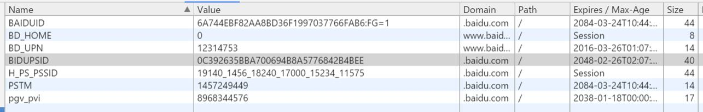
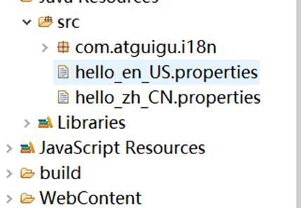

# 一、js

## 1、简介

> JavaScript是一门客户端脚本语言，主要运行在浏览器中，浏览器中负责运行JavaScript脚本代码的程序叫JavaScript引擎

## 2、基本语法

  js需要包括在<script>标签中，这个标签可以出现在页面的任何位置

Ø 变量

声明：使用var 如：var x=65; var y=”你好”;

①、变量的声明不需要指定数据类型，可以接受所有的数据类型

②、变量名区分大小写，abc和aBc是两个不同的变量

赋值：

  x=44;x=”abc”;x=new Date();

①、变量可以接受任何值

②、声明和赋值也可同时进行 如var x=”abc”;

Ø 函数

声明：使用function关键字，没有指定返回值一说！参数列表也没有指定参数类型一说，因为js所有类型都使用var来声明

第一种： var abc=function(a,b){ return a+b;}

   函数在js中也是一种对象，可以将函数的引用赋值给变量

第二种： function add(a,b){ return a+b;}

   为函数起个名字叫add

使用：调用函数方法

第一种：如果是声明方式第一种的，使用变量名+()的方式进行调用

   abc(1,2);

第二种：如果是声明方式第二种的，直接使用函数名调用；

   add(1,2);

注意：js调用函数的时候不会检查参数列表，所以js中没有重载一说，add(1,2)；add(1)；add(1,”abc”)；add(“abc”)；add(1,”666”,true);add()；都是调用的同一个方法。

Ø 对象

对象的创建：

第一种  var obj = new Object();

第二种  var obj = {};

为对象添加属性方法：js中动态的为对象添加属性和方法。

1、动态添加

obj.name = “张三”;

obj.age = 18;

obj.work = function(){

  alert(“我在工作！”);

}

​     2、创建时指定

​      obj = {

​        name:”张三”,

​        age:18,

​        work:function(){

  alert(“我在工作”)

}        

}

​     使用对象的属性或方法

​     alert(obj.name)

​     obj.work();

Ø 注释

js中也有j注释

//表示单行注释

/ /表示多行注释

Ø 其他语法

java中的for，while，if-else，switch，try-catch，break，continue，以及各种运算符，在js中也是按照同样的方式使用的。这里不再赘述。

## 3、js事件

Ø 思考：js脚本的嵌入方式

1、浏览器的加载顺序。遇到js执行js，执行完成后继续加载。可能会导致文档阻塞，加载不出内容

2、文档全部加载完成后再加载js。js中定义了一种window.onload事件可以解决以上问题

Ø 简介：什么是事件？

事件就是浏览器或者用户交互时触发的行为。比如按钮点击，表单提交，鼠标滑动等等…

Ø 事件的分类：

1、系统事件：如：文档加载完成。

2、用户事件：如：鼠标移入移出，单击双击等。

Ø 事件触发：

  系统事件会由系统触发，如window.onload事件，用户事件由用户行为触发如click事件。主要讲解的系统事件是window.onload，用户事件主要在操作html文档的时候触发。详细事件列表可参考w3c离线文档中的JavaScriptàdom事件

Ø 常见的事件

| 事件                                                         | 说明                                 |
| ------------------------------------------------------------ | ------------------------------------ |
| [onblur](mk:@MSITStore:F:\javaSE\API\W3School离线手册(2014.3.24).chm::/www.w3school.com.cn/jsref/event_onblur.asp) | 元素失去焦点。                       |
| [onchange](mk:@MSITStore:F:\javaSE\API\W3School离线手册(2014.3.24).chm::/www.w3school.com.cn/jsref/event_onchange.asp) | 域的内容被改变。                     |
| [onclick](mk:@MSITStore:F:\javaSE\API\W3School离线手册(2014.3.24).chm::/www.w3school.com.cn/jsref/event_onclick.asp) | 当用户点击某个对象时调用的事件句柄。 |
| [onfocus](mk:@MSITStore:F:\javaSE\API\W3School离线手册(2014.3.24).chm::/www.w3school.com.cn/jsref/event_onfocus.asp) | 元素获得焦点。                       |
| [onkeydown](mk:@MSITStore:F:\javaSE\API\W3School离线手册(2014.3.24).chm::/www.w3school.com.cn/jsref/event_onkeydown.asp) | 某个键盘按键被按下。                 |
| [onload](mk:@MSITStore:F:\javaSE\API\W3School离线手册(2014.3.24).chm::/www.w3school.com.cn/jsref/event_onload.asp) | 一张页面或一幅图像完成加载           |

Ø 事件响应：

  我们希望某个事件发生的时候我们可以做一些事情。这个称为事件的响应，比如用户点击了一个按钮，我弹出一个框告诉用户，你成功的点击了这个按钮。

 

事件触发后我们要执行的方法称为响应函数。如何将响应函数与事件关联起来。我们常使用为事件赋值函数的方法。如window.onload事件触发时我们执行弹出对话框

window.onload = function(){

  alert(“文档加载完成了！”)

}

 

我们也可以使用标签的事件属性来触发响应函数，如：

<a href="atguigu.com" onclick="gotoguigu()">尚硅谷</a>

//onclick会触发gotoguigu()函数

我们在<script></script>中定义这个函数

```js
<script type=”text/javascript”>
    function gotoguigu(){
    alert(“我要去上硅谷”)
}
</script>
```

Ø 取消事件的默认行为

默认行为：某些事件触发后，系统会有默认的响应处理。如：

1、超链接点击后会自动跳转 2、表单提交点击后会发送请求

取消默认行为的方式：

return false;即可

Ø 正确的js加载方式

文档加载完成后加载js

所以我们以后写js的时候，请把他包在window.onload 的响应函数里，表示文档加载完成后会执行函数里面的代码。

```javascript
<script type=”text/javascript”>
    window.onload = function(){
    //js代码
}
</script>
```

## 4、dom操作

Ø 什么是DOM：

> Document Object Modal(文档对象模型)，我们浏览器把整个网页会当成一个大的对象，利用面向对象的方式操作网页内容。

Ø DOM模型：


Ø document对象

document对象时window对象的一个属性，代表当前整个HTML文档，将这个文档抽象成了document对象，包含了整个dom树的所有内容。

其本质是window.document，而window.可以省略。直接使用document

Ø DOM查询\\\

元素查询

| 功能                                             | API                                             | 返回值             |
| ------------------------------------------------ | ----------------------------------------------- | ------------------ |
| ==在整个文档范围内查询元素节点==                 |                                                 |                    |
| 根据id值查询                                     | document.getElementById(“id值”)                 | 一个具体的元素节点 |
| 根据标签名查询                                   | document.getElementsByTagName(“标签名”)         | 元素节点数组       |
| 根据name属性值查询                               | document.getElementsByName(“name值”)            | 元素节点数组       |
|                                                  |                                                 |                    |
| ==在具体元素节点范围内查找子节点==               |                                                 |                    |
| 查找全部子节点                                   | element.childNodes【W3C考虑换行，IE≤9不考虑】   | 节点数组           |
| 查找第一个子节点                                 | element.firstChild【W3C考虑换行，IE≤9不考虑】   | 节点对象           |
| 查找最后一个子节点                               | element.lastChild【W3C考虑换行，IE≤9不考虑】    | 节点对象           |
| 查找指定标签名的子节点                           | element.getElementsByTagName(“标签名”)          | 元素节点数组       |
|                                                  |                                                 |                    |
| ==查找指定元素节点的父节点==：element.parentNode |                                                 |                    |
|                                                  |                                                 |                    |
| ==查找指定元素节点的兄弟节点==                   |                                                 |                    |
| 查找前一个兄弟节点                               | node.previousSibling【W3C考虑换行，IE≤9不考虑】 | 节点对象           |
| 查找后一个兄弟节点                               | node.nextSibling【W3C考虑换行，IE≤9不考虑】     | 节点对象           |

属性操作

​	[1]读取属性值

​		元素对象.属性名

​	[2]修改属性值

​		元素对象.属性名=新的属性值

文本操作

​	[1]读取文本值：element.firstChild.nodeValue

​	[2]修改文本值：element.firstChild.nodeValue=新文本值

Ø DOM增删改

| API                                      | 功能                                        |
| ---------------------------------------- | ------------------------------------------- |
| document.createElement(“标签名”)         | 创建元素节点并返回，但不会自动添加到文档中  |
| document.createTextNode(“文本值”)        | 创建文本节点并返回，但不会自动添加到文档中  |
|                                          |                                             |
| element.appendChild(ele)                 | 将ele添加到element所有子节点后面            |
| parentEle.insertBefore(newEle,targetEle) | 将newEle插入到targetEle前面                 |
|                                          |                                             |
| parentEle.replaceChild(newEle, oldEle)   | 用新节点替换原有的旧子节点                  |
| parentEle.removeChild(childNode)         | 删除指定的子节点                            |
|                                          |                                             |
| element.innerHTML                        | 读写HTML代码[非W3C标准，但主流浏览器都支持] |

# 二、jquery

## 1、简介

> jquery是目前最流行的一种JavaScript库。
>
> 所谓JavaScript库就是对JavaScript进行进一步封装和开发，然后将其打包为js文件方便重复调用。jquery也可称为JavaScript框架。
>
> jquery的主要功能是简化JavaScript的开发工作。并且基本解决了浏览器的兼容问题。

## 2、核心函数

$是jquery的核心函数。jquery的大部分功能都是核心函数来完成的

核心函数根据实参的不同，有四种不同的用法

  ①、传入一个函数作为参数

   如：$(function(){})

   作用：和window.onload = function(){}一样，在文档加载完成后调用

  ②、传入一个选择器的字符串

   如：$(“#id”)

   作用：和document.getElementById(“id”)一样，从文档查询需要的元素

  ③、传入一段HTML代码

   如：$(“<li>广州</li>”)

   作用：创建一个li对象

  ④、传一个DOM对象

   如：var ele=document.getElementById(“abc”);  var x= $(ele);

   作用：将一个js获取的dom对象转化为一个jquery对象。这样就可以使用jquery里面的方法了

 

## 3、jquery对象与dom对象

  dom对象是原生的网页文档对象。可以通过js获取到文档对象。然后进行增删改操作。

  jquery对象是使用jquery包装后的文档对象。只有这个对象才可以调用jquery的方法。dom对象不是jquery 的对象，所以我们不能调用jquery的方法，我们需要将其包装为jquery对象才可

 

​     ①DOM对象

​      \> 通过原生JS获取的对象是DOM对象

​     

​     ②jQuery对象

​      \> 通过jQuery核心函数包装过的对象叫做jQuery对象

​     

​     ③比较

​      \> 两种对象之间不能互相调用对方的方法

​      \> 命名上的区别：

​        jQuery对象命名时习惯加上$,加以区分。

​     

​     ④转换

​      DOM --> jQuery

​        $(DOM对象)

​      jQuery --> DOM

​        jQuery对象[索引]

​        jQuery对象的本质就是DOM对象的数组，所以可以通过给对象加下标的形式获取数组中的DOM对象

## 4、jquery选择器

\>jQuery的最厉害的地方就是它拥有众多的选择器。

\>jQuery的选择器主要是集合CSS和xPath部分语法。

\>选择器可以很方便的获取到页面中元素。

 

基本选择器

​       id选择器 $("#id")

​      类选择器 $(".class")

​      元素选择器 $("标签名")

​      选择所有元素 $("")

​      选择器分组 $("选择器1 , 选择器2 , 选择器N")

 

层次选择器

​       后代元素 $("祖先元素 后代元素")

​      子元素 $("父元素 > 子元素")

​      下一个兄弟元素 $("前一个 + 后一个")

​      下边所有兄弟元素 $("前一个 ~ 后边所有")

过滤选择器

​     参见jqueryAPI

 

## 5、jquery筛选

  以已经查到的元素为标准，再进行查询。DOM查询

### ·    过滤

[eq(index|-index)](mk:@MSITStore:F:\javaSE\API\jQueryAPI_1.7.1_CN.chm::/eq.html)    获取第N个元素   $(“p”).eq(1)；

[first()](mk:@MSITStore:F:\javaSE\API\jQueryAPI_1.7.1_CN.chm::/first.html)        获取第一个元素   $(“p”).first();

[last()](mk:@MSITStore:F:\javaSE\API\jQueryAPI_1.7.1_CN.chm::/last.html)         获取最后一个元素  $(“p”).last();

### ·    查找

[children([expr\])](mk:@MSITStore:F:\javaSE\API\jQueryAPI_1.7.1_CN.chm::/children.html)     获取所有的子元素（不包括孙子<后代元素>） $(“table”).children();

[find(expr|obj|ele)](mk:@MSITStore:F:\javaSE\API\jQueryAPI_1.7.1_CN.chm::/find.html)   找出所有的后代元素  $(“table”).find();

[next([expr\])](mk:@MSITStore:F:\javaSE\API\jQueryAPI_1.7.1_CN.chm::/next.html)      相邻后一个的元素

[parent([expr\])](mk:@MSITStore:F:\javaSE\API\jQueryAPI_1.7.1_CN.chm::/parent.html)     获取某元素的直接父元素

[parents([expr\])](mk:@MSITStore:F:\javaSE\API\jQueryAPI_1.7.1_CN.chm::/parents.html)      获取某元素的祖先元素，不包含根元素

[prev([expr\])](mk:@MSITStore:F:\javaSE\API\jQueryAPI_1.7.1_CN.chm::/prev.html)      获取元素的前一个元素

其余查看jquery文档

## 6、jquery事件

### 常见事件列表，事件详情参见jquery文档

[blur([[data\],fn])](mk:@MSITStore:F:\javaSE\API\jQueryAPI_1.7.1_CN.chm::/blur.html) 

[change([[data\],fn])](mk:@MSITStore:F:\javaSE\API\jQueryAPI_1.7.1_CN.chm::/change.html) 

[click([[data\],fn])](mk:@MSITStore:F:\javaSE\API\jQueryAPI_1.7.1_CN.chm::/click.html) 

[dblclick([[data\],fn])](mk:@MSITStore:F:\javaSE\API\jQueryAPI_1.7.1_CN.chm::/dblclick.html) 

[error([[data\],fn])](mk:@MSITStore:F:\javaSE\API\jQueryAPI_1.7.1_CN.chm::/error.html) 

[focus([[data\],fn])](mk:@MSITStore:F:\javaSE\API\jQueryAPI_1.7.1_CN.chm::/focus.html) 

[focusin([data\],fn)](mk:@MSITStore:F:\javaSE\API\jQueryAPI_1.7.1_CN.chm::/focusin.html) 

[focusout([data\],fn)](mk:@MSITStore:F:\javaSE\API\jQueryAPI_1.7.1_CN.chm::/focusout.html) 

[keydown([[data\],fn])](mk:@MSITStore:F:\javaSE\API\jQueryAPI_1.7.1_CN.chm::/keydown.html) 

[keypress([[data\],fn])](mk:@MSITStore:F:\javaSE\API\jQueryAPI_1.7.1_CN.chm::/keypress.html) 

[keyup([[data\],fn])](mk:@MSITStore:F:\javaSE\API\jQueryAPI_1.7.1_CN.chm::/keyup.html) 

[mousedown([[data\],fn])](mk:@MSITStore:F:\javaSE\API\jQueryAPI_1.7.1_CN.chm::/mousedown.html) 

[mouseenter([[data\],fn])](mk:@MSITStore:F:\javaSE\API\jQueryAPI_1.7.1_CN.chm::/mouseenter.html) 

[mouseleave([[data\],fn])](mk:@MSITStore:F:\javaSE\API\jQueryAPI_1.7.1_CN.chm::/mouseleave.html) 

[mousemove([[data\],fn])](mk:@MSITStore:F:\javaSE\API\jQueryAPI_1.7.1_CN.chm::/mousemove.html) 

[mouseout([[data\],fn])](mk:@MSITStore:F:\javaSE\API\jQueryAPI_1.7.1_CN.chm::/mouseout.html) 

[mouseover([[data\],fn])](mk:@MSITStore:F:\javaSE\API\jQueryAPI_1.7.1_CN.chm::/mouseover.html) 

[mouseup([[data\],fn])](mk:@MSITStore:F:\javaSE\API\jQueryAPI_1.7.1_CN.chm::/mouseup.html) 

[resize([[data\],fn])](mk:@MSITStore:F:\javaSE\API\jQueryAPI_1.7.1_CN.chm::/resize.html) 

[scroll([[data\],fn])](mk:@MSITStore:F:\javaSE\API\jQueryAPI_1.7.1_CN.chm::/scroll.html) 

[select([[data\],fn])](mk:@MSITStore:F:\javaSE\API\jQueryAPI_1.7.1_CN.chm::/select.html) 

[submit([[data\],fn])](mk:@MSITStore:F:\javaSE\API\jQueryAPI_1.7.1_CN.chm::/submit.html) 

[unload([[data\],fn])](mk:@MSITStore:F:\javaSE\API\jQueryAPI_1.7.1_CN.chm::/unload.html) 

 

### 事件绑定

  1、使用事件对应的函数进行绑定

​     如：$(“#btn”).click(function(){

   alert(“我被点击啦！”);

})

  2、使用bind()绑定事件：用法：元素.bind(事件名,[参数],回调方法)

如：$("p").bind("click", function(){

​     alert( $(this).text() );

   });

可以绑定多个事件，多个事件用空格隔开

如：$('#foo').bind('mouseenter mouseleave', function() {

   $(this).toggleClass('entered');

});

 

3、绑定一个一次性的事件，事件只会触发一次。one()；

如：$("p").one("click", function(){

   alert( $(this).text() );

});

  

4、为当前的对象以及以后创建的对象都绑定此事件

如：$("p").live("click", function(){

  alert(“我是p！”);

});

 

### 解除绑定

  使用unbind()方法解除事件绑定。

1、不传参数，取消当前元素的所有事件

如：$("p").unbind()

  2、传递参数，取消某个事件

​     如：$(“p”).unbind(“click”)

  3、传递多个参数，用空格隔开：取消一组事件

​     如：$(“p”).unbind(“click mouserover”);

 

### 事件冒泡

  例子：

```html
<div>
    <p>你好<p>
<div>
```

为div和p同时绑定点击事件。当点击p的时候，div的点击事件也会被触发

$(“div”).click(function(){alert(“我是div”)});

$(“p”).click(function(){alert(“我是p”)});

当我们点击p的时候,先弹出我是p，又弹出我是div

阻止事件冒泡：

return false；即可。

### 事件对象

  当我们事件触发的时候，事件触发的详细信息会被js封装为一个对象传入回调函数。而我们之前的回调函数没有设置接收他们的参数，所以我们没用到。我们只需要在返回函数中定义一个参数来接收即可;

  如：$(“p”).click(function(event){

​     alert(event.type)

})

 

event都有什么值，我们可以使用js的console.log(event)；就会在浏览器的控制台输出event对象的详细信息。

 

事件对象event的详细属性


 

 

事件对象的兼容性

在w3c标准浏览器中，事件对象为event，在部分ie版本中，事件对象为window.event

我们可以使用event = event || window.event；来解决兼容性问题

 

## 7、dom增删改

### 文档操作（对dom对象的增删改）

内部插入

[append(content|fn)](mk:@MSITStore:F:\javaSE\API\jQueryAPI_1.7.1_CN.chm::/append.html)：父.append(子)：父元素的最后插入子元素

[prepend(content|fn)](mk:@MSITStore:F:\javaSE\API\jQueryAPI_1.7.1_CN.chm::/prepend.html)：父.prepend(子)：父元素的最前面插入子元素

 

[appendTo(content)](mk:@MSITStore:F:\javaSE\API\jQueryAPI_1.7.1_CN.chm::/appendTo.html)：子.appendTo(父)：子元素添加到父元素的最后

[prependTo(content)](mk:@MSITStore:F:\javaSE\API\jQueryAPI_1.7.1_CN.chm::/prependTo.html)： 子.prependTo(父)：子元素添加到父元素的最前面

 

外部插入

[after(content|fn)](mk:@MSITStore:F:\javaSE\API\jQueryAPI_1.7.1_CN.chm::/after.html) ：A.after(B)：a的后边插入b

[insertAfter(content)](mk:@MSITStore:F:\javaSE\API\jQueryAPI_1.7.1_CN.chm::/insertAfter.html) ：A.insertAfter(B)：把a插入到b后边

 

[before(content|fn)](mk:@MSITStore:F:\javaSE\API\jQueryAPI_1.7.1_CN.chm::/before.html) ：A.before(B)：a的前边插入b

[insertBefore(content)](mk:@MSITStore:F:\javaSE\API\jQueryAPI_1.7.1_CN.chm::/insertBefore.html) ：A.insertBefore(B)：把a插入到b的前边

 

替换

[replaceWith(content|fn)](mk:@MSITStore:F:\javaSE\API\jQueryAPI_1.7.1_CN.chm::/replaceWith.html) ：A.replaceWith(B)：A被B替换（A不存在,B存在）

[replaceAll(selector)](mk:@MSITStore:F:\javaSE\API\jQueryAPI_1.7.1_CN.chm::/replaceAll.html) ：A.replaceAll(B)：A替换所有B（B不存在，A存在）

 

删除

[empty()](mk:@MSITStore:F:\javaSE\API\jQueryAPI_1.7.1_CN.chm::/empty.html) ：A.empty()：将A元素下面的子元素全部删除（将A置空，子元素没有，A还在）

[remove([expr\])](mk:@MSITStore:F:\javaSE\API\jQueryAPI_1.7.1_CN.chm::/remove.html) ：A.empty()：将A元素删除（A不存在）

 

复制

[clone([Even[,deepEven\]])](mk:@MSITStore:F:\javaSE\API\jQueryAPI_1.7.1_CN.chm::/clone.html) ：A.clone()：克隆A元素并选中克隆的副本

 

### 属性操作（对dom对象属性的增删改）

属性

[attr(name|pro|key,val|fn)](mk:@MSITStore:F:\javaSE\API\jQueryAPI_1.7.1_CN.chm::/attr.html) ：

获取属性值：$("img").attr("src");

设置属性值：$("img").attr("src","test.jpg");

设置多属性：$("img").attr({ src: "test.jpg", alt: "Test Image" });

[removeAttr(name)](mk:@MSITStore:F:\javaSE\API\jQueryAPI_1.7.1_CN.chm::/removeAttr.html) ： 移除属性：$("img").removeAttr("src");

[prop(name|pro|key,val|fn)](mk:@MSITStore:F:\javaSE\API\jQueryAPI_1.7.1_CN.chm::/prop.html)1.6+ ：一般用来操作内置属性

   获取属性值：$("input[type='checkbox']").prop("checked");

   设置属性值：$("input[type='checkbox']").prop("checked",true);

   设置多属性：$("input[type='checkbox']").prop({ disabled: true});

[removeProp(name)](mk:@MSITStore:F:\javaSE\API\jQueryAPI_1.7.1_CN.chm::/removeProp.html)1.6+ ：移除属性：$('div').removeProp('style')

CSS 类

[addClass(class|fn)](mk:@MSITStore:F:\javaSE\API\jQueryAPI_1.7.1_CN.chm::/addClass.html) ：A.addClass(“selected1 selected2”)：为A添加两个class

[removeClass([class|fn\])](mk:@MSITStore:F:\javaSE\API\jQueryAPI_1.7.1_CN.chm::/removeClass.html) ：

A.removeClass(“selected1 selected1”)：删除A的两个class，

A.removeClass()：删除A的所有class

[toggleClass(class|fn[,sw\])](mk:@MSITStore:F:\javaSE\API\jQueryAPI_1.7.1_CN.chm::/toggleClass.html) ：

A.toggleClass(“highlight”)：切换A的class，如果有highlight移除，如果没有添加

   

 

 

HTML代码/文本/值

[html([val|fn\])](mk:@MSITStore:F:\javaSE\API\jQueryAPI_1.7.1_CN.chm::/html.html) ：

   获取html内容：A.html()；

   设置html内容：A.html(“<a href='#'>链接</a>”)

[text([val|fn\])](mk:@MSITStore:F:\javaSE\API\jQueryAPI_1.7.1_CN.chm::/text.html)

   获取文本内容：$('p').text();

   设置文本内容：$("p").text("Hello world!");

[val([val|fn|arr\])](mk:@MSITStore:F:\javaSE\API\jQueryAPI_1.7.1_CN.chm::/val.html)

   获取表单元素值：$("input").val();

   设置表单元素值：$("input").val("hello world!");

 

 

### css操作（对dom对象样式的增删改）

CSS

[css(name|pro|[,val|fn\])](mk:@MSITStore:F:\javaSE\API\jQueryAPI_1.7.1_CN.chm::/css.html) ：

   获取css值：$("p").css("color");

   设置css值：

$("p").css({ color: "#ff0011", background: "blue" });

$("p").css("color","red");

 

位置

[offset([coordinates\])](mk:@MSITStore:F:\javaSE\API\jQueryAPI_1.7.1_CN.chm::/offset.html) 

[position()](mk:@MSITStore:F:\javaSE\API\jQueryAPI_1.7.1_CN.chm::/position.html) 

[scrollTop([val\])](mk:@MSITStore:F:\javaSE\API\jQueryAPI_1.7.1_CN.chm::/scrollTop.html) 

[scrollLeft([val\])](mk:@MSITStore:F:\javaSE\API\jQueryAPI_1.7.1_CN.chm::/scrollLeft.html) 

尺寸

[heigh([val|fn\])](mk:@MSITStore:F:\javaSE\API\jQueryAPI_1.7.1_CN.chm::/height.html) 

[width([val|fn\])](mk:@MSITStore:F:\javaSE\API\jQueryAPI_1.7.1_CN.chm::/width.html) 

[innerHeight()](mk:@MSITStore:F:\javaSE\API\jQueryAPI_1.7.1_CN.chm::/innerHeight.html) 

[innerWidth()](mk:@MSITStore:F:\javaSE\API\jQueryAPI_1.7.1_CN.chm::/innerWidth.html) 

[outerHeight([soptions\])](mk:@MSITStore:F:\javaSE\API\jQueryAPI_1.7.1_CN.chm::/outerHeight.html) 

[outerWidth([options\])](mk:@MSITStore:F:\javaSE\API\jQueryAPI_1.7.1_CN.chm::/outerWidth.html) 

 

 

## 8、jquery动画

基本

[show([speed,[easing\],[fn]])](mk:@MSITStore:F:\javaSE\API\jQueryAPI_1.7.1_CN.chm::/show.html) ：

显示隐藏的元素：

```html
("p").show()；
$("p").show("slow");
$("p").show("fast",function(){
$(this).text("Animation Done!");
});
$("p").show(4000,function(){
$(this).text("Animation Done...");
});
[hide([speed,[easing\],[fn]])](mk:@MSITStore:F:\javaSE\API\jQueryAPI_1.7.1_CN.chm::/hide.html) ：
```

  隐藏显示的元素

```html
$("p").hide()；
$("p").hide("slow");
$("p").hide("fast",function(){
$(this).text("Animation Done!");
});
$("p").hide(4000,function(){
$(this).text("Animation Done...");
});
```

[toggle([speed\],[easing],[fn])](mk:@MSITStore:F:\javaSE\API\jQueryAPI_1.7.1_CN.chm::/toggle.html) ：切换元素的显示状态

   用于绑定两个或多个事件处理器函数，以响应被选元素的轮流的 click 事件。

   如果元素是可见的，切换为隐藏的；如果元素是隐藏的，切换为可见的。

l $(‘p’).toggle(); //显示隐藏p

l $(‘p’).toggle("slow"); 

l $('#foo').toggle(showOrHide); // showOrHide是个true或者false值，如果这个参数为true ，那么匹配的元素将显示;如果false ，元素将隐藏

 

l $("p"). toggle ("fast",function(){

​    $(this).text("Animation Done!"); //动画完成后触发的函数

});

l $("p"). toggle (4000,function(){

​     $(this).text("Animation Done...");  

});

 

 

滑动

[slideDown([spe\],[eas],[fn])](mk:@MSITStore:F:\javaSE\API\jQueryAPI_1.7.1_CN.chm::/slideDown.html) 

[slideUp([speed,[easing\],[fn]])](mk:@MSITStore:F:\javaSE\API\jQueryAPI_1.7.1_CN.chm::/slideUp.html) 

[slideToggle([speed\],[easing],[fn])](mk:@MSITStore:F:\javaSE\API\jQueryAPI_1.7.1_CN.chm::/slideToggle.html) 

 

淡入淡出

[fadeIn([speed\],[eas],[fn])](mk:@MSITStore:F:\javaSE\API\jQueryAPI_1.7.1_CN.chm::/fadeIn.html) 

[fadeOut([speed\],[eas],[fn])](mk:@MSITStore:F:\javaSE\API\jQueryAPI_1.7.1_CN.chm::/fadeOut.html) 

[fadeTo([[spe\],opa,[eas],[fn]])](mk:@MSITStore:F:\javaSE\API\jQueryAPI_1.7.1_CN.chm::/fadeTo.html) 

[fadeToggle([speed,[eas\],[fn]])](mk:@MSITStore:F:\javaSE\API\jQueryAPI_1.7.1_CN.chm::/fadeToggle.html) 

自定义

[animate(param,[spe\],[e],[fn])](mk:@MSITStore:F:\javaSE\API\jQueryAPI_1.7.1_CN.chm::/animate.html) 

[stop([cle\],[jum])](mk:@MSITStore:F:\javaSE\API\jQueryAPI_1.7.1_CN.chm::/stop.html)1.7 

[delay(duration,[queueName\])](mk:@MSITStore:F:\javaSE\API\jQueryAPI_1.7.1_CN.chm::/delay.html) 

# 三、xml解析

## 1、xml简介

**什么是xml**

> eXtensible Markup Language可扩展标记语言——由W3C组织发布，目前推荐遵守的是W3C组织于2000年发布的XML1.0规范。
>
> XML的使命，就是以一个统一的格式，组织有关系的数据，为不同平台下的应用程序服务。

```xml
<?xml version="1.0" encoding="utf-8"?>
<中国>
	<北京>
		<海淀></海淀>
		<丰台></丰台>
	</北京>
	<湖南>
		<长沙></长沙>
		<岳阳></岳阳>
	</湖南>
	<湖北>
		<武汉></武汉>
		<荆州></荆州>
	</湖北>
</中国>
```


> 我们不同的平台有他自己的数据格式，但是不同平台之间如果相互想传递数据，那么就应该用同一种数据格式，这样大家都能读懂。就像加入WTO组织的各个国家一样。每个国家都有自己的语言和货币，但是如果大家都用自己的东西就很难沟通和衡量。那么我们就使用统一的方式，使用英语作为交流语言，使用美元作为

 

**主要用途**

xml就是一种数据保存的格式而已。按照他的规则你就知道数据之间的关系。

xml经常用在下面的情况中


- 为什么我们要使用xml保存数据呢？

比如c3p0的配置文件。因为有些数据是不会经常变化的数据，我们需要固定的保存起来，然而这些数据又是有某些关系的。我们希望也把他们直接的关系用简明易懂的格式保存起来，方便后来查看这些数据的时候一下就能看懂他们直接的关系。

## 2、xml规范

### xml文档结构


 

### 文档声明

①在编写XML文档时，必须在文件的第一行书写文档声明。

最简单的声明语法：<?xml version="1.0" ?>

 

②用encoding属性说明读取文档所用的解码的字符集：

<?xml version="1.0" encoding="utf-8" ?>

这样就要求保存文件时，必须用utf-8编码保存。此时要求XML文档的作者确认当前编辑器保存文档的编码方式。

eclipse会自动按照解码字符集进行编码保存

记事本需要另存为指定的字符集

 

### 语法规则

Ø 第一行必须为xml声明，顶格写

Ø 只能有一个根标签

Ø 标签必须正确结束，并不能交叉嵌套

Ø 严格区分大小，标签不能以数字开头

Ø 属性必须有值，且必须加双引号

 

### xml转义字符

| 特殊字符 | 替代符号 |
| -------- | -------- |
| <        | \&lt;    |
| >        | \&gt;    |
| &        | \&amp;   |
| “        | \&quot;  |
| ‘        | \&apos;  |

XML实体中不允许出现"&","<",">"等特殊字符,否则XML语法检查时将出错,如果编写的XML文件必须包含这些字符,则必须分别写成"\&amp;","\&lt;","\&gt;"再写入文件中。例如，如果在XML文档中使用类似"<" 的字符, 那么解析器将会出现错误，因为解析器会认为这是一个新元素的开始。所以不应该像下面那样书写代码: 

1. <age> age < 30 </age>  

2. 这种写法会解析出现错误，因为<,>等等都是关键字符，除过标签以外，不允许占用的。

3. <age> age &lt; 30 </age> 

### CDATA区

①当XML文档中需要写一些程序代码、SQL语句或其他不希望XML解析器进行解析的内容时，就可以写在CDATA区中

②XML解析器会将CDATA区中的内容原封不动的输出

③CDATA区的定义格式：<![CDATA[…]]>

例如：


 

### 注释

①Xml文件中的注释采用：“<!--注释-->” 格式。

注意：

●XML声明之前不能有注释

●注释不能嵌套

 

### 处理指令

①处理指令，简称PI （processing instruction）。处理指令用来指挥解析引擎如何解析XML文档内容。

 

②处理指令必须以“<?”作为开头，以“?>”作为结尾，XML声明语句就是最常见的一种处理指令。

 

例如，在XML文档中可以使用xml-stylesheet指令，通知XML解析引擎，应用css文件显示xml文档内容。

<?xml-stylesheet type="text/css" href="p.css"?>

 

## 3、xml解析

**解析方式**

Ø dom：(Document Object Model, 即文档对象模型) 是 W3C 组织推荐的处理 XML 的一种方式。

它下面有两个分支：jDom与dom4j

它们可都可以对xml文件进行增删改查的操作

 

Ø sax： (Simple API for XML) 不是官方标准，但它是 XML 社区事实上的标准，几乎所有的 XML 解析器都支持它。

​      只能进行解析（查询）

Ø pull: Pull解析和Sax解析很相似，都是轻量级的解析，它是一个第三方开源的Java项目，但在Android的内核中已经嵌入了Pull 。

只能进行解析（查询）

 

**解析技术体系**


 

 

## 4、dom4j解析

**简介**

Ø Dom4j是一个简单、灵活的开放源代码的库。Dom4j是由早期开发JDOM的人分离出来而后独立开发的。与JDOM不同的是，dom4j使用接口和抽象基类，虽然Dom4j的API相对要复杂一些，但它提供了比JDOM更好的灵活性。 

Ø Dom4j是一个非常优秀的Java XML API，具有性能优异、功能强大和极易使用的特点。现在很多软件采用的Dom4j，例如Hibernate。使用Dom4j开发，需下载dom4j相应的jar文件。

 

**使用**

dom4j解析xml文件主要有以下几个步骤：

0、导包，导包，导包，重要的事情说三遍！dom4j-1.6.1.jar

1、创建解析器，获取要解析的xml的文档对象，即document对象。

2、获取元素，进行操作。可操作属性，操作文本，获取元素信息等

3、如果document对象有改变。那么保存document对象为xml文件

代码示例：

```java
//1、创建saxreader对象
SAXReader reader = new SAXReader();

//2、读取xml文件,获得document对象
Document document = reader.read(new FileInputStream("web.xml"));

//3、获取到根元素，从根元素开始查找，修改
Element element = document.getRootElement();

//4、遍历所有元素
Iterator iterator = element.elementIterator();
while(iterator.hasNext()){
    Element next = (Element) iterator.next();
    System.out.println(next.getName()+"-->"+next.getText());
}

//5、获取element下的第一个子元素
/**
		 * 查询都是使用根元素的element往下开始查询,一层一层的查
		 * 各种元素查询的方法：
		 * //获取某个元素的指定名称的第一个子节点 
		 * 		Element element = element.element(“书名");
		 * //获取某个元素的指定名称的所有子元素的集合 
		 * 		List list = element.elements(“书名”); 
		 * //添加一个指定名称的子元素 
		 * 		Element childEle = parentEle.addElement(“书名”); 
		 * //删除某个元素指定的子元素  
		 * 		parentEle.remove(childEle);
		 */
Element element2 = element.element("servlet");
Element element3 = element2.element("servlet-name");
System.out.println(element3.getStringValue());

//6、元素的操作
/**
		 * 1、属性操作
		 * //获取某个元素的指定名称的属性对象 
		 * Attribute attr = element.attribute(“id”); 
		 * //获取某个元素的指定名称的属性值 
		 * String id = element.attributeValue(“id”); 
		 * //给元素添加属性或更新其值 
		 * Attribute attr = element.addAttribute(“id”,”123”); 
		 * //删除某个元素的指定属性 
		 * element.remove(attribute);
		 * 
		 * 2、文本操作
		 * //获取某个元素的文本内容 
		 * 		String text = element.getText(); 
		 * //给某个元素添加或更新文本内容 
		 * 		element.setText(“Tom”);
		 */

//7、保存document到xml
OutputFormat format = OutputFormat.createPrettyPrint();
XMLWriter writer = new XMLWriter(new FileOutputStream( "output.xml" ),format);
writer.write(document);
writer.close();
```

## 5、sax解析

**简介**

Ø 为什么会出现SAX解析？

 

在使用 DOM 解析 XML 文档时，需要读取整个 XML 文档，在内存中构架代表整个 DOM 树的Doucment对象，从而再对XML文档进行操作。此种情况下，如果 XML 文档特别大，就会消耗计算机的大量内存，并且容易导致内存溢出。

 

SAX解析允许在读取文档的时候，即对文档进行处理，而不必等到整个文档装载完才会文档进行操作。

 

注意：sax只能用于读取xml文件，无法作更新

Ø SAX采用事件处理的方式解析XML文件，利用 SAX 解析 XML 文档，

涉及两个部分：解析器和事件处理器(对象)：

  解析器可以使用JAXP的API创建，创建出SAX解析器后，就可以指定解析器去解析某个XML文档。

  解析器采用SAX方式在解析某个XML文档时，它只要解析到XML文档的一个组成部分，都会去调用事件处理器的一个方法，解析器在调用事件处理器的方法时，会把当前解析到的xml文件内容作为方法的参数传递给事件处理器。

  事件处理器由程序员编写，程序员通过事件处理器中方法的参数，就可以很轻松地得到sax解析器解析到的数据，从而可以决定如何对数据进行处理。

 

**使用**

sax解析步骤：

1、创建sax解析器工厂对象。

2、使用工厂对象创建sax解析器。

3、调用解析方法解析文件。

 

在3之前，我们还要自己编写一个Handler类，可以继承DefaultHandler，实现监听文档解析过程。DefaultHandler各方法含义如下：

 

void characters (char ch[], int start, int length)  接收元素中字符数据的通知。

void endDocument ()          接收文档结束的通知

void endElement (String uri, String localName, String qName) 接收元素结束的通知

void endPrefixMapping (String prefix)      接收名称空间映射结束的通知。

void error (SAXParseException e)       接收可恢复的解析器错误的通知。

void fatalError (SAXParseException e)     报告严重的 XML 解析错误

void ignorableWhitespace (char ch[], int start, int length)  接收元素内容中可忽略空白的通知

void notationDecl (String name, String publicId, String systemId) 接收注释声明的通知。

void processingInstruction (String target, String data)   接收处理指令的通知

InputSource resolveEntity (String publicId, String systemId) 解析外部实体

void setDocumentLocator (Locator locator)       接收文档事件的 Locator 对象

void skippedEntity (String name)            接收跳过的实体的通知。

void startDocument ()             接收文档开始的通知。

void startElement (String uri, String localName, String qName, Attributes attributes) 

接收元素开始的通知

void startPrefixMapping (String prefix, String uri)   接收名称空间映射开始的通知

unparsedEntityDecl(String name, String publicId, String systemId, String notationName)

​                       接收未解析实体声明的通知

warning(SAXParseException e)          接收解析器警告的通知

 

 

代码（自定义的Handler将解析的xml封装为对象）

```java
public class MyHandler2 extends DefaultHandler {

    //当前解析到的标签名
    private String tagName;

    //顶一个学生对象，用来封装信息
    private Student stu;

    @Override
    public void startElement(String uri, String localName, String qName,
                             Attributes attributes) throws SAXException {

        //为tagName赋值
        this.tagName = qName;

        //判断当前标签是否为student
        if("student".equals(qName)){

            //创建学生对象
            stu = new Student();

            //获取id属性
            String idStr = attributes.getValue("id");
            //System.out.println(idStr);

            //封装id属性
            stu.setId(Integer.parseInt(idStr));
        }
    }

    @Override
    public void endElement(String uri, String localName, String qName)
        throws SAXException {

        //读取到结束标签时，要将tagName设置为null
        this.tagName = null;

        //判断当前标签是否为student结束标签
        if("student".equals(qName)){
            System.out.println(stu);
        }
    }

    @Override
    public void characters(char[] ch, int start, int length)
        throws SAXException {
        //获取name age gender address

        if("name".equals(this.tagName)){
            String name = new String(ch, start, length);
            //System.out.println(name);
            stu.setName(name);

        }else if("age".equals(tagName)){
            String ageStr = new String(ch, start, length);
            //System.out.println(ageStr);
            stu.setAge(Integer.parseInt(ageStr));

        }else if("gender".equals(tagName)){
            String gender = new String(ch, start, length);
            //System.out.println(gender);
            stu.setGender(gender);

        }else if("address".equals(tagName)){
            String address = new String(ch, start, length);
            //System.out.println(address);
            stu.setAddress(address);
        }
    }
}

```

## 6、pull解析

**简介**

Pull解析与sax解析类似都是基于事件方法回调机制来实现对xml文件解析。

 

Sax解析不足：即使已经找到所要的数据，xml数据还是会全部加载进来并产生方法调用。程序员无法停止这些无用的操作，而pull解析解决了此问题。

 

Pull解析：加载每一部分数据产生方法调用，都必须通过程序员调用一个固定的方法才能进行下去，否则解析工作就停止了。Next()

 

注意：pull解析也只能用于读取xml文件，无法作更新

Pull解析依赖两个jar包：xmlpull_1_0_5.jar和kxml2-2.3.0.jar

 

**使用**

pull解析步骤：

0、导包，导包，导包。你懂得。

1、创建解析器工厂对象

2、使用工厂创建解析器对象

3、读取xml文档

4、解析之~~~

 

代码示例：

xml：


代码：

```java
public void testPULL2() throws Exception{
    //获取工厂类实例
    XmlPullParserFactory factory = XmlPullParserFactory.newInstance();
    //获取解析器类实例
    XmlPullParser parser = factory.newPullParser();
    //读写xml文档
    parser.setInput(new FileReader("stu.xml"));

    //声明一个空的student对象
    Student stu = null;
    //写一个while循环
    //循环运行的条件，只要当前事件类型不是 END_DOCUMENT 那么就继续循环
    while (parser.next() != XmlPullParser.END_DOCUMENT) {
        //获取当前事件类型
        int event = parser.getEventType();
        //获取当前的标签名
        String tagName = parser.getName();
        //判断当前标签是否为开始标签
        if(event == XmlPullParser.START_TAG){
            //判断当前标签名是否为student
            if("student".equals(tagName)){
                //创建学生对象
                stu = new Student();
                //获取id属性值
                String idStr = parser.getAttributeValue(null, "id");
                stu.setId(Integer.parseInt(idStr));
            }else if("name".equals(tagName)){
                //获取学生的name
                //nextText获取下一个文本值
                String name = parser.nextText();
                stu.setName(name);
            }else if("age".equals(tagName)){
                //获取年龄
                String ageStr = parser.nextText();
                stu.setAge(Integer.parseInt(ageStr));

            }else if("gender".equals(tagName)){
                //获取性别
                String gender = parser.nextText();
                stu.setGender(gender);
            }else if("address".equals(tagName)){
                //获取年龄
                String address = parser.nextText();
                stu.setAddress(address);
                //获取id为1的学生信息
                if(stu.getId() == 1){
                    //输出学生信息
                    System.out.println(stu);
                    //终止循环
                    break;
                }
            }
        }
    }
}

```

## 7、xpath

**简介**

XPath 是在 XML 文档中查找信息的语言 

XPath 是通过元素和属性进行查找

XPath简化了Dom4j查找节点的过程

使用XPath必须导入jaxen-1.1-beta-6.jar

否则出现

NoClassDefFoundError: org/jaxen/JaxenException

**语法**

XPath语法示例

| /students/student               | 从根元素开始逐层找，以”/”开头         |
| ------------------------------- | ------------------------------------- |
| //name                          | 直接获取所有name元素对象,以“//”开头   |
| //student/                      | 获取所有student元素的所有子元素对象   |
| //student[1]或//student[last()] | 获取所有student元素的第一个或最后一个 |
| //student[@id]                  | 获取所有带id属性的student元素对象     |
| //student[@id=‘002']            | 获取id等于002的student元素对象        |

**使用**

0、导包，导包，导包。谢谢。jaxen-1.1-beta-6.jar

1、dom4j怎么做就怎么做。只是在查找元素的时候可以使用xpath了

2、获取所有符合条件的节点

–   document.selectNodes(String xpathExpression) 返回List集合

获取符合条件的单个节点

–   document.selectSingleNode(String xpathExpression) 

返回一个Node对象。如果符合条件的节点有多个，那么返回第一个。

 

代码：

```java
public void testXpath() throws Exception{

    SAXReader reader = new SAXReader();
    Document document = reader.read("stu.xml");
    //我们使用selectNodes 或 selectSingleNode
    //查询id为2的学生
    Element stuEle = (Element) document.selectSingleNode("/students/student[@id='2']");
    //获取学生的信息
    String idStr = stuEle.attributeValue("id");
    String name = stuEle.elementText("name");
    String ageStr = stuEle.elementText("age");
    String gender = stuEle.elementText("gender");
    String address = stuEle.elementText("address");
    //封装为一个学生对象
    Student stu = new Student(Integer.parseInt(idStr), name, Integer.parseInt(ageStr), gender, address);
    System.out.println(stu);
}

```


# 四、http

## 1、简介

> HTTP超文本传输协议 (HTTP-Hypertext transfer protocol)，是一个属于应用层的面向对象的协议，由于其简捷、快速的方式，适用于分布式超媒体信息系统。它于1990年提出，经过几年的使用与发展，得到不断地完善和扩展。它是一种详细规定了浏览器和万维网服务器之间互相通信的规则，通过因特网传送万维网文档的数据传送协议。

 

HTTP协议的发展历程

> 超文本传输协议的前身是世外桃源(Xanadu)项目，超文本的概念是泰德˙纳尔森(Ted Nelson)在1960年代提出的。进入哈佛大学后，纳尔森一直致力于超文本协议和该项目的研究，但他从未公开发表过资料。1989年，蒂姆˙伯纳斯˙李(Tim Berners Lee)在CERN(欧洲原子核研究委员会 = European Organization for Nuclear Research)担任软件咨询师的时候，开发了一套程序，奠定了万维网(WWW = World Wide Web)的基础。1990年12月，超文本在CERN首次上线。1991年夏天，继Telnet等协议之后，超文本转移协议成为互联网诸多协议的一分子。
>
> 当时，Telnet协议解决了一台计算机和另外一台计算机之间一对一的控制型通信的要求。邮件协议解决了一个发件人向少量人员发送信息的通信要求。文件传输协议解决一台计算机从另外一台计算机批量获取文件的通信要求，但是它不具备一边获取文件一边显示文件或对文件进行某种处理的功能。新闻传输协议解决了一对多新闻广播的通信要求。而超文本要解决的通信要求是：在一台计算机上获取并显示存放在多台计算机里的文本、数据、图片和其他类型的文件；它包含两大部分：超文本转移协议和超文本标记语言(HTML)。HTTP、HTML以及浏览器的诞生给互联网的普及带来了飞跃。

再来看看我们web运行原理


我们浏览器和服务器要沟通，都是类似发信件的方式。很多的“信件”在网络之间传输。

这些信件必须按照一定的格式进行书写，才能被彼此之间识别，客户端服务器本来就是两个不同的东西。

这个国家的每个人都应学习编程,因为它教你如何思考。——乔布斯

tcp三次握手：

为什么要有tcp的三次握手，因为我们浏览器和服务器要通信，必须首先建立连接，在这个连接上进行数据发送工作。所以有三次握手。


就像两个陌生人见面要说话。

甲：你是那个xxx吗？

乙：哦，对，我是。你就是那个xxx吧。

甲：恩，是的。

（握手，开聊！）

## 2、请求报文

l HTTP请求

客户端连上服务器后，向服务器发出获取某个Web资源的消息，称之为客户端向服务器发送了一个HTTP请求。一个完整的HTTP请求包括如下内容：

①请求行

URL地址中如果包含中文，浏览器会自动对中文字符进行编码之后再发送

②若干消息头(请求头)

③实体内容(请求体) 有可能没有


## 3、响应报文

所谓响应其实就是服务器对请求处理的结果，或者如果浏览器请求的直接就是一个静态资源的话，响应的就是这个资源本身。

 

HTTP响应的组成

①响应状态行：包括协议版本、响应状态码、响应状态信息

②响应消息头：响应头

③实体内容：响应体


 

最常见的响应状态码

| 代码 | 表示   | 说明                                                         |
| ---- | ------ | ------------------------------------------------------------ |
| 200  | 成功   | 服务器已成功处理了请求。通常，这表示服务器提供了请求的网页。 |
| 302  | 重定向 | 代表让浏览器重新请求另一个资源                               |
| 404  | 找不到 | 找不到请求的资源，但有时请求路径正确也返回404往往是由于Web应用有配置方面的问题，例如按照配置文件中指定的组件的全类名找不到指定的类。 |
| 500  | 错误   | 服务器内部错误，例如服务器端程序运行时抛出异常。             |

●响应状态码以2开头的通常表示成功。

●响应状态码以3开头的通常表示转移。

●响应状态码以4开头的通常表示无法访问，其中包括找不到资源或没有权限等。

●响应状态码以5开头的通常表示服务器端程序运行出错。

 

响应消息头：简称响应头

●服务器发送给浏览器的数据，为了告诉浏览器一些情况。

| 代码                                                  | 说明                                                         |
| ----------------------------------------------------- | ------------------------------------------------------------ |
| Location: /day05/index.jsp                            | 告诉浏览器重新定向到指定的路径                               |
| Server:apache  tomcat                                 | 使用的什么web服务器                                          |
| Content-Encoding:  gzip                               | 告诉浏览器我传给你的数据用的压缩方式                         |
| Content-Length:  80                                   | 响应体的字节数                                               |
| Content-Language:  zh-cn                              | 响应体数据的语言                                             |
| content-type:  text/html; charset=GB2312              | 响应体内容的类型                                             |
| Last-Modified:  Tue, 11 Jul 2000 18:23:51 GMT         | 资源最后被修改的时间                                         |
| Refresh: 1                                            | 定时刷新                                                     |
| Content-Disposition:    attachment;  filename=aaa.zip | 文件下载                                                     |
| Set-Cookie:SS=Q0=5Lb_nQ;  path=/search                | 将cookie数据回送给ie                                         |
| Expires: -1                                           | 告诉浏览器不要缓存起来                                       |
| Cache-Control:  no-cache                              | 当HTTP1.1服务器指定 CacheControl = no-cache时，浏览器就不会缓存该网页 |
| Connection:  close/Keep-Alive                         | 是否保持连接                                                 |
| Date: Tue, 11  Jul 2000 18:23:51 GMT                  | 响应的时间                                                   |

 

1.1  响应体：服务器给出的响应结果的主体，通常是用来在页面上显示的。

1.2  HTTP内容类型：当前响应体的数据类型。

①需要指出的是在浏览器和服务器之间传输的数据类型并非都是文本类型，还包括图片、视频、音频等多媒体类型。这些多媒体类型是使用MIME类型定义的。

②MIME的英文全称是"Multipurpose Internet Mail Extensions" 多功能Internet 邮件扩充服务。MIME类型的格式是“大类型/小类型”，并与某一种文件的扩展名相对应。

③常见的MIME类型

| 文件               | MIME类型                           |
| ------------------ | ---------------------------------- |
| 超文本标记语言文本 | .html,.html  text/html             |
| 普通文本           | .txt text/plain                    |
| RTF文本            | .rtf  application/rtf              |
| GIF图形            | .gif image/gif                     |
| JPEG图形           | .jpeg,.jpg image/jpeg              |
| au声音文件         | .au audio/basic                    |
| MIDI音乐文件       | mid,.midi  audio/midi,audio/x-midi |
| RealAudio音乐文件  | .ra, .ram  audio/x-pn-realaudio    |
| MPEG文件           | .mpg,.mpeg  video/mpeg             |
| AVI文件            | .avi  video/x-msvideo              |
| GZIP文件           | .gz  application/x-gzip            |
| TAR文件            | .tar application/x-tar             |

 

## 4、get、post请求

l 请求方式

HTTP中定义了7种请求方式：POST、GET、HEAD、OPTIONS、DELETE、TRACE、PUT。其中最常用的是GET和POST

u GET请求

[1]从字面意思来说，GET请求是用来向服务器端获取信息而发送的请求。

[2]没有特殊设置，默认情况下浏览器发送的都是GET请求，例如点击超链接、在浏览器地址栏直接输入地址访问。

[3]GET请求也可以向服务器端发送请求参数，形式是在URL地址后面加上?，请求参数名和值用=连接，多个请求参数之间使用&分隔。例如：

GET /mail/1.html?name=abc&password=xyz HTTP/1.1

需要注意的是：GET方式所能够携带的数据是由限制的，其数据大小通常不能超过4K，不适于提交大量表单数据，故而在表单的提交方式中首选POST方式。

POST请求

 

u POST请求的字面含义是向服务器端发送数据，仅在表单中设置method=”post”时，请求方式为POST方式[另外在Ajax应用中，可以指定请求方式为POST]。

[2]POST请求会将请求参数放在请求体中，而不是URL地址后面，并且发送数据的大小是没有限制的。

 

l 请求消息头

①请求消息头简称请求头，用来向服务器报告浏览器端的一些基本信息。

②常用请求头

| 代码                                     | 说明                             |
| ---------------------------------------- | -------------------------------- |
| Accept:  text/html,image/                | 我支持的数据类型                 |
| Accept-Charset:  utf-8                   | 支持的数据的编码字符集           |
| Accept-Encoding:  gzip                   | 支持的压缩方式                   |
| Accept-Language:  en-us,zh-cn            | 支持的语言                       |
| Host: localhost:8888                     | 请求的主机名                     |
| Referer:  http://www.it315.org/index.jsp | 发送请求的界面对应的url 防盗链   |
| User-Agent:  Mozilla/4.0                 | 浏览器的相关信息                 |
| Connection:  keep-Alive                  | 请求完成后，到是断开呢还是连接着 |
| Date: Tue, 11  Jul 2000 18:23:51 GMT     | 发送请求的时间                   |
| Cookie: tt=123                           | 对具体客户端所做的标记           |

 

 

l 请求体

①GET请求没有请求体

②POST请求：如果form表单提交的方式为post,则表单项的数据以请求体的形式发送给服务器，没有大小限制

 

l get和post对比

|                    | GET请求                                                  | POST请求                                      |
| ------------------ | -------------------------------------------------------- | --------------------------------------------- |
| 含义               | 获取数据                                                 | 发送数据                                      |
| 发送请求参数的方式 | 附着在URL地址后面                                        | 放在请求体中                                  |
| 传送数据大小的限制 | 有限制，而且能传输的数据容量很小                         | 没有数据大小的限制                            |
| 数据安全           | 如果没有特殊处理，会将数据明文显示在浏览器地址栏         | 不会将数据显示是浏览器地址栏                  |
| 产生方式           | 点超链接、表单method=get、直接在浏览器地址栏输入地址访问 | 表单method=post在Ajax应用中指定请求方式为POST |

## 5、扩展知识

l HTTP的主要特点

n 支持客户端/服务器模式。

n 简单快速：客户向服务器请求服务时，只需传送请求方法和路径。请求方法常用的有GET、POST、HEAD等。每种方法规定了客户与服务器联系的类型不同。由于HTTP协议简单，使得HTTP服务器的程序规模小，因而通信速度很快。

n 灵活：HTTP允许传输任意类型的数据对象。正在传输的类型由Content-Type加以标记。

n 无连接：无连接的含义是连接双方在完成交互后不维持连接状态，当客户端发送新的请求后则开启新的连接。

n 无状态：HTTP协议是无状态协议。无状态是指协议对于事务处理没有记忆能力。缺少状态意味着如果后续处理需要前面的信息，则它必须重传，这样可能导致每次连接传送的数据量增大。另一方面，在服务器不需要先前信息时它的应答就较快。

l HTTP协议的会话方式

浏览器与服务器之间的通信过程要经历四个步骤


浏览器与WEB服务器的连接过程是短暂的，每次连接只处理一个请求和响应。对每一个页面的访问，浏览器与WEB服务器都要建立一次单独的连接。 

浏览器到WEB服务器之间的所有通讯都是完全独立分开的请求和响应对。

 

l HTTP1.0和HTTP1.1的区别

在HTTP1.0版本中，浏览器请求一个带有图片的网页，会由于下载图片而与服务器之间开启一个新的连接；但在HTTP1.1版本中，允许浏览器在拿到当前请求对应的全部资源后再断开连接，提高了效率。


# 五、cookie

## 1、cookie简介

### 1、什么是cookie

cookie，有时我们也用其复数形式cookies，是服务端保存在浏览器端的数据片段。以key/value的形式进行保存。每次请求的时候，请求头会自动包含本网站此目录下的cookie数据。网站经常使用这个技术来识别用户是否登陆等功能。

简单的说，cookie就是服务端留给计算机用户浏览器端的小文件。

 

Ø HTTP是无状态协议，服务器不能记录浏览器的访问状态，也就是说服务器不能区分中两次请求是否由一个客户端发出。这样的设计严重阻碍的Web程序的设计。如：在我们进行网购时，买了一条裤子，又买了一个手机。由于http协议是无状态的，如果不通过其他手段，服务器是不能知道用户到底买了什么。而Cookie就是解决方案之一。

Ø Cookie实际上就是服务器保存在浏览器上的一段信息。浏览器有了Cookie之后，每次向服务器发送请求时都会同时将该信息发送给服务器，服务器收到请求后，就可以根据该信息处理请求。

Ø 例如：我们上文说的网上商城，当用户向购物车中添加一个商品时，服务器会将这个条信息封装成一个Cookie发送给浏览器，浏览器收到Cookie，会将它保存在内存中(注意这里的内存是本机内存，而不是服务器内存)，那之后每次向服务器发送请求，浏览器都会携带该Cookie，而服务器就可以通过读取Cookie来判断用户到底买了哪些商品。当用户进行结账操作时，服务器就可以根据Cookie的信息来做结算。

 

Ø Cookie的用途：

网上商城的购物车

保持用户登录状态

 

Ø Cookie的缺点

Cookie做为请求或响应报文发送，无形中增加了网络流量。

Cookie是明文传送的安全性差。

Cookie中保存数据是不稳定的，用户可以随时清理cookie

各个浏览器对Cookie有限制，使用上有局限

 

### 2、庐山真面目

chrome的cookie位置：

C:\Users\lfy\AppData\Local\Google\Chrome\User Data\Default\Cookies

 

ie中cookie位置：

C:\Users\lfy\AppData\Local\Microsoft\Windows\InetCache

点击设置->查看对象即可


 

chrome中查看cookie



 

cookie如上图所示

从上图可以看出cookie是键值对的形式，有过期时间（Max-Age，session表示在这个会话期内有效）。

 

### 3、cookie原理

Ø Cookie的原理：

 

1、总的来看Cookie像是服务器发给浏览器的一张“会员卡”，浏览器每次向服务器发送请求时都会带着这张“会员卡”，当服务器看到这张“会员卡”时就可以识别浏览器的身份。

实际上这个所谓的“会员卡”就是服务器发送的一个响应头：


Ø 如图Set-Cookie这个响应头就是服务器在向服务器发“会员卡”，这个响应头的名字是Set-Cookie，后边JSESSIONID=95A92EC1D7CCB4ADFC24584CB316382E和 Path=/Test_cookie，是两组键值对的结构就是服务器为这个“会员卡”设置的信息。浏览器收到该信息后就会将它保存到内存或硬盘中。

2、当浏览器再次向服务器发送请求时就会携带这个Cookie信息：


这是浏览器发送的请求报文，中间画红框的就是Cookie信息，这里可以理解为浏览器这次带着“会员卡”再次访问服务器。于是服务器就可以根据Cookie信息来判断浏览器的状态。

原理图如下：


## 2、Cookie的使用

### 1、创建对象

cookie是由服务端创建的，由浏览器端保存的。所以创建对象我们应该在服务端创建cookie

cookie的创建方法：

 

Ø 创建一个CookieServlet

在Servlet的doPost()方法中编写如下代码：

  //创建一个Cookie对象  Cookie cookie = new Cookie("username", "zhangsan");  //将Cookie对象放入response对象中  response.addCookie(cookie);  

 

Ø 在浏览器中访问该Servlet，会发现响应头中出现如下内容：

Set-Cookie: username=zhangsan

如此就成功的向浏览器设置了一个Cookie，当我们在刷新页面时会发现浏览器的请求头中出现如下代码：

Cookie: username=zhangsan

 

Ø 同样我们还可以同时设置多个Cookie：

  //创建一个Cookie对象  Cookie cookie1 = new Cookie("username", "zhangsan");  Cookie cookie2 = new Cookie("password", "123456");  Cookie cookie3 = new Cookie("age", "20");  //将Cookie对象放入response对象中  response.addCookie(cookie1);  response.addCookie(cookie2);  response.addCookie(cookie3);  

 

浏览器会按以下形式发送Cookie：

Cookie: username=zhangsan; password=123456; age=20

 

Ø 设置Cookie就是两个步骤：

1、创建Cookie对象

2、将Cookie对象加入到response中

 

### 2、设置cookie

#### 1、cookie的有效时间

Ø 经过上边的介绍我们已经知道Cookie是存储在浏览器中的，但是可想而知一般情况下浏览器不可能永远保存一个Cookie，一来是占用硬盘空间，再来一个Cookie可能只在某一时刻有用没必要长久保存。

Ø 所以我们还需要为Cookie设置一个有效时间。

Ø 通过Cookie对象的setMaxAge()可以设置Cookie的有效时间。

其中setMaxAge()接收一个int型的参数，来设置有效时间。参数主要有一下四种情况：

Ø 设置为0，setMaxAge(0)

Cookie立即失效，下次浏览器发送请求将不会在携带该Cookie

Ø 设置大于0，setMaxAge(60)

表示有效的秒数60就代表60秒即1分钟，也就是Cookie在1分钟后失效。

Ø 设置小于0，setMaxAge(-1)

设置为负数表示当前会话有效。也就是关闭浏览器后Cookie失效

Ø 不设置

如果不设置失效时间，则默认当前会话有效。

#### 2、cookie的路径

Ø Cookie的路径指告诉浏览器访问那些地址时该携带该Cookie，我们知道浏览器会保存很多不同网站的Cookie，比如百度的Cookie，新浪的Cookie，腾讯的Cookie等等。那我们不可能访问百度的时候携带新浪的Cookie，也不可能访问每个网站时都带上所有的Cookie这是不现实的，所以往往我们还需要为Cookie设置一个Path属性，来告诉浏览器何时携带该Cookie。

Ø 我们同过Cookie的setPath()来设置路径，这个路径是由浏览器来解析的所以/代表服务器的根目录。

如：

l 设置为 /项目名/路径 à cookie.setPath(“/项目名/路径”) 

这样设置只有访问“/项目名/路径”下的的资源才会携带Cookie

如：/项目名/路径/1.jsp 、/项目名/路径/hello/2.jsp 等

l 如果不设置，默认会在访问“/项目名”下的资源时携带

如：“/项目名/index.jsp” 、 “/项目名/hello/index.jsp”

 

Cookie cookie = new Cookie("username", "abc");

   cookie.setMaxAge(606024);//秒为单位,一天后过期

   cookie.setPath(getServletContext().getContextPath()+"/");

   resp.addCookie(cookie);

   resp.sendRedirect(getServletContext().getContextPath()+"/index.jsp");

### 3、读取cookie

通过以上步骤，我们将cookie保存到了浏览器端。那么我们如何读取cookie中的值呢。

分析：

cookie被设置进入浏览器后，每次请求都会携带cookie的值，所以我们需要从request中取出cookie进行解析。

 

//从request中获取所有cookie

​     Cookie[] cookies = request.getCookies();

​     //遍历cookie

​     for(Cookie c:cookies){

​      String cName = c.getName();//获取cookie名

​      String cValue = c.getValue();//获取cookie值

​       System.out.println("cookie：" + cName + "=" +cValue);

​     }

 


 

# 六、session

### 1、session简介

session是我们jsp九大隐含对象的一个对象。

session称作域对象，他的作用是保存一些信息，而session这个域对象是一次会话期间使用同一个对象。所以这个对象可以用来保存共享数据。

Ø 使用Cookie有一个非常大的局限，就是如果Cookie很多，则无形的增加了客户端与服务端的数据传输量。而且由于浏览器对Cookie数量的限制，注定我们不能再Cookie中保存过多的信息，于是Session出现。

Ø Session的作用就是在服务器端保存一些用户的数据，然后传递给用户一个名字为JSESSIONID的Cookie，这个JESSIONID对应这个服务器中的一个Session对象，通过它就可以获取到保存用户信息的Session。

 

session是基于cookie的。

在用户第一次使用session的时候（访问jsp页面会获取session，所以一般访问index.jsp就算是第一次使用session了），服务器会为用户创建一个session域对象。使用jsessionid和这个对象关联，这个对象在整个用户会话期间使用。响应体增加set-cookie:jsessionid=xxx的项。用户下次以后的请求都会携带jsessionid这个参数，我们使用request.getSession()的时候，就会使用jsessionid取出session对象。

session原理图：


### 2、session使用

获取session对象

HttpSession session = request.getSession();

session是我们的四大域对象之一。用来保存数据。常用的方法

  session.setAttribute("user", new Object());

  session.getAttribute("user");

 session.setMaxInactiveInterval(606024);//秒为单位

  session.invalidate();//使session不可用

 

#### 1、Session时效

Ø 基本原则

Session对象在服务器端不能长期保存，它是有时间限制的，超过一定时间没有被访问过的Session对象就应该释放掉，以节约内存。所以Session的有效时间并不是从创建对象开始计时，到指定时间后释放——而是从最后一次被访问开始计时，统计其“空闲”的时间。

Ø 默认设置

在全局web.xml中能够找到如下配置：

   <!--  ==================== Default Session Configuration ================= -->   <!--  You can set the default session timeout (in minutes) for all newly  -->   <!--  created sessions by modifying the value below.            -->       <session-config>      <session-timeout>30</session-timeout>    </session-config>  

说明Session对象默认的最长有效时间为30分钟。

Ø 手工设置

session.setMaxInactiveInterval(int seconds)

session.getMaxInactiveInterval()

Ø 强制失效

session.invalidate()

Ø 可以使Session对象释放的情况

Session对象空闲时间达到了目标设置的最大值，自动释放

Session对象被强制失效

Web应用卸载

服务器进程停止

#### 2、URL重写

在整个会话控制技术体系中，保持JSESSIONID的值主要通过Cookie实现。但Cookie在浏览器端可能会被禁用，所以我们还需要一些备用的技术手段，例如：URL重写。

Ø URL重写其实就是将JSESSIONID的值以固定格式附着在URL地址后面，以实现保持JSESSIONID，进而保持会话状态。这个固定格式是：URL;jsessionid=xxxxxxxxx

例如：

  targetServlet;jsessionid=F9C893D3E77E3E8329FF6BD9B7A09957  

Ø 实现方式：

response.encodeURL(String)

response.encodeRedirectURL(String)

例如：

​     //1.获取Session对象     HttpSession session =  request.getSession();          //2.创建目标URL地址字符串     String url = "targetServlet";          //3.在目标URL地址字符串后面附加JSESSIONID的值     url = response.encodeURL(url);          //4.重定向到目标资源      response.sendRedirect(url);  

#### 3、Session的活化和钝化

Session机制很好的解决了Cookie的不足，但是当访问应用的用户很多时，服务器上就会创建非常多的Session对象，如果不对这些Session对象进行处理，那么在Session失效之前，这些Session一直都会在服务器的内存中存在。那么就，就出现了Session活化和钝化的机制。

Ø Session钝化：

Session在一段时间内没有被使用时，会将当前存在的Session对象序列化到磁盘上，而不再占用内存空间。

Ø Session活化：

Session被钝化后，服务器再次调用Session对象时，将Session对象由磁盘中加载到内存中使用。

如果希望Session域中的对象也能够随Session钝化过程一起序列化到磁盘上，则对象的实现类也必须实现java.io.Serializable接口。不仅如此，如果对象中还包含其他对象的引用，则被关联的对象也必须支持序列化，否则会抛出异常：java.io.NotSerializableException

 

 

### 3、表单重复提交问题

#### 1、什么是表单重复提交？

同一个表单中的数据内容多次提交到服务器。

危害？

服务器重复处理信息，负担加重。

如果是保存数据可能导致保存多份相同数据。

 

#### 2、几种重复提交

1、提交完表单后，直接刷新页面，会再次提交。

\- 根本原因：Servlet处理完请求以后，直接转发到目标页面。

\- 这样整一个业务，只发送了一次请求，那么当你在浏览器中点击刷新按钮或者狂按f5会一直都会刷新之前的请求

 

解决方案：使用重定向跳转到目标页面

​      

2、提交表单后，由于网速差等原因，服务器还未返回结果，连续点击提交按钮，会重复提交。

-根本原因：按钮可以多次点击

-解决方案：通过js，使得按钮只能提交一次。

$(“#form1”).submit(function(){

 $(“#sub_btn”).prop(“disabled”,true);

})

 

3、表单提交后，点击浏览器回退按钮，不刷新页面，点击提交按钮再次提交表单

\- 根本原因：服务器并不能识别请求是否重复。

\- 解决方案：使用token机制。

  1、页面生成时，产生一个唯一的token值。将此值放入session

  2、表单提交时，带上这个token值。

  3、服务端验证token值存在，则提交表单，然后移除此值。

   验证token不存在，说明是之前验证过一次被移除了，所以是重复请求。不予处理

原理：


 

代码：

Ø jsp页面

```jsp
<%
String token = System.currentTimeMillis() + "";
request.getSession().setAttribute(token, "");
%>
<div>
    <h1>测试表单重复提交</h1>
    <form action="login" method="get">
        用户名：<input name="username" type="text"/>
        密码：<input name="password" type="password">
        <input name="token" value="<%=token%>">
        <input type="submit">
    </form>
    <hr>
</div>

```

Ø Servlet

```java
protected void doPost(HttpServletRequest request, HttpServletResponse response) throws ServletException, IOException {
    HttpSession session = request.getSession();
    String token = request.getParameter("token");
    Object attribute = session.getAttribute(token);
    response.setContentType("text/html;charset=UTF-8");
    if(attribute!=null){
        session.removeAttribute(token);
        response.getWriter().write("请求成功！");
    }else{
        response.getWriter().write("请不要重复请求！");
    }
}

```


其实防止重复提交的核心就是让服务器有一个字段能来识别此次请求是否已经执行。

这个字段需要页面传递过来，因为只要回退回去的页面，字段都是一致的。不会变化，通过这个特性我们想到了token机制来防止重复提交


 

 


# 七、ajax&json

## 1、什么是ajax

Ø AJAX 是 Asynchronous JavaScript And XML 的简称。直译为，异步的JS和XML。

Ø AJAX的实际意义是，不发生页面跳转、异步载入内容并改写页面内容的技术。

Ø AJAX也可以简单的理解为通过JS向服务器发送请求。

Ø AJAX这门技术很早就被发明，但是直到2005年被谷歌的大量使用，才在市场中流行起来，可以说Google为AJAX的推广起到到推波助澜的作用。

Ø 异步处理：

n 同步处理：

u AJAX出现之前，我们访问互联网时一般都是同步请求，也就是当我们通过一个页面向服务器发送一个请求时，在服务器响应结束之前，我们的整个页面是不能操作的，也就是直观上来看他是卡主不动的。

u 这就带来了非常糟糕的用户体验。首先，同步请求时，用户只能等待服务器的响应，而不能做任何操作。其次，如果请求时间过长可能会给用户一个卡死的感觉。最后，同步请求的最大缺点就是即使整个页面中只有一小部分内容发生改变我们也要刷新整个页面。

n 异步处理：

u 而异步处理指的是我们在浏览网页的同时，通过AJAX向服务器发送请求，发送请求的过程中我们浏览网页的行为并不会收到任何影响，甚至主观上感知不到在向服务器发送请求。当服务器正常响应请求后，响应信息会直接发送到AJAX中，AJAX可以根据服务器响应的内容做一些操作。

u 使用AJAX的异步请求基本上完美的解决了同步请求带来的问题。首先，发送请求时不会影响到用户的正常访问。其次，即使请求时间过长，用户不会有任何感知。最后，AJAX可以根据服务器的响应信息局部的修改页面，而不需要整个页面刷新。

 

 

## 2、使用XmlHttpRequest对象发送请求

js中定义了一个可以发送异步请求的对象XMLHttpRequest。我们在网页中使用这个对象发送请求。我们来学习一下XmlHttpRequest对象。

### 1、创建XMLHttpRequest对象

由于这个对象并不是标准，但是基本所有浏览器都支持，所以针对不同的浏览器我们需要创建其对应的对象。

 

1、w3c标准浏览器，火狐、谷歌等

var xhr = new XMLHttpRequest();

 

2、ie6创建方式

var xhr = new ActiveXObject(“Msxml2.XMLHTTP”);

 

3、ie5.5创建方式

var xhr = new ActiveXObject("Microsoft.XMLHTTP");

 

所以为了兼容所有浏览器，我们可以创建一个公共的获取此对象的方法

```javascript
//获取XMLHttpRequest的通用方法
function getXMLHttpRequest(){
    var xhr;
    try{
        //大部分浏览器都支持
        xhr = new XMLHttpRequest();
    }catch(e){
        try{
            //如果不支持，在这里捕获异常并且采用IE6支持的方式
            xhr = new ActiveXObject("Msxml2.XMLHTTP");
        }catch(e){
            //如果还不支持，在这里捕获异常并采用IE5支持的方式
            xhr = new ActiveXObject("Microsoft.XMLHTTP");
        }
    }
    return xhr;
}

```


### 2、使用XMLHttpRequest

Ø open(method,url,async)

open()用于设置请求的基本信息，接收三个参数。

u method

请求的方法：get或post

接收一个字符串

u url

请求的地址，接收一个字符串

u Assync

发送的请求是否为异步请求，接收一个布尔值。

true 是异步请求

false 不是异步请求（同步请求）

Ø send(string)

send()用于将请求发送给服务器，可以接收一个参数

string参数

该参数只在发送post请求时需要。

string参数用于设置请求体

请求体参数使用键值对的形式，多个参数用&分割

如：“username=lll&password=lll”

Ø setRequestHeader(header,value)

用于设置请求头

header参数

字符串类型，要设置的请求头的名字

value参数

字符串类型，要设置的请求头的值

   post请求的时侯需要设置

xhr.setRequestHeader("Content-Type","application/x-www-form-urlencoded");

 

### 3、XMLHttpRequest对象的属性：

Ø readyState

描述XMLHttpRequest的状态

一共有五种状态分别对应了五个数字：

0 ：请求尚未初始化，open()尚未被调用

1 ：服务器连接已建立，send()尚未被调用

2 ：请求已接收，服务器尚未响应

3 ：请求已处理，正在接收服务器发送的响应

4 ：请求已处理完毕，且响应已就绪。

Ø status

请求的响应码

200 响应成功

404 页面为找到

500 服务器内部错误 

… … … …

Ø onreadystatechange

该属性需要指向一个函数

该函数会在readyState属性发生改变时被调用

Ø responseText

获得字符串形式的响应数据。

Ø responseXML（用的比较少）

获得 XML 形式的响应数据。

 

### 4、使用js发送ajax请求示例

1、发送get请求：

```js
//获取xhr对象
var xhr = getXMLHttpRequest();
//设置请求信息
xhr.open("get","AjaxServlet?&t="+Math.random(),true);
//发送请求
xhr.send();
//监听请求状态
xhr.onreadystatechange = function(){
    //当响应完成
    if(xhr.readyState == 4){
        //且状态码为200时
        if(xhr.status == 200){
            //接收响应信息（文本形式）
            var text = xhr.responseText;
            //弹出消息
            alert(text);
        }
    };
};

```


2、发送post请求

```js
//获取xhr对象
var xhr = getXMLHttpRequest();
//设置请求信息
xhr.open("post","2.jsp",true);
//设置请求头
xhr.setRequestHeader("Content-Type","application/x-www-form-urlencoded");
//发送请求
xhr.send("hello=123456");
//监听请求状态
xhr.onreadystatechange = function(){
    //当响应完成
    if(xhr.readyState == 4){
        //且状态码为200时
        if(xhr.status == 200){
            //接收响应信息（文本形式）
            var text = xhr.responseText;
            //弹出消息
            alert(text);
        }
    };

```


## 3、json数据

js对xml数据的操控性不是很好。例如，返回这段xml

<student><name>tomcat</name><age>20</age></student>

js的处理如下：

var ele = xhr.responseXml;

var nodeVal = ele.getElementsByTagName(“name”).firstChild.nodeValue;

这种处理方式很麻烦。而且xml虽然看起来很清晰，但是标签占据了基本1/3内容，比较浪费流量。

 

json就能解决上述问题。js也是原生支持json。操作很方便。

 

### 1、什么是json

json（JavaScript Object Notation（javascript对象表示法）），是一种轻量级的数据交换格式。有着自己独立简单的语法。

json经常被用来传递数据，他的数据信息集中，占用空间少，解析方便。

json的本质就是js对象。js中我们创建对象可以直接进行属性赋值操作,stu.name=”xx”;

 

### 2、json的语法规则

用键值对表示数据、数据由逗号分隔、花括号保存对象、方括号保存数组。

键值对的写法是： 键:值


如：{"firstName":"Brett","lastName":"McLaughlin","email":"aaaa"}

 

### 3、json的值可取范围

json的值可以是：

数字、字符串（使用双引号包裹）、逻辑值、数组（方括号中）、对象（在花括号中）、null.

 ```json
{
    "people":[
        {"firstName":"Brett","lastName":"McLaughlin","email":"aaaa"},
        {"firstName":"Jason","lastName":"Hunter","email":"bbbb"},
        {"firstName":"Elliotte","lastName":"Harold","email":"cccc"}
    ]
}

 ```

上面这个json表示的意思是。people的值是一个对象数组，里面有三个对象。每个对象里面有三个不同的属性。

 

## 4、js中的json使用

1、创建json对象

var json1 = {“name1”:”value1”,”name2”:”value2” , “name3”:[1,”str”,true]};

var json2 = [{“name1”:”value1”},{“name2”:”value2”}];

注意：创建的是json对象，不是字符串，不能在最前面和最后面加双引号

 

2、获取/设置json对象属性值。

获取：

alert(json1.name1)//value1

alert(json2[0].name1)//value1

设置：

json1.name1=”你好”;

json2[0].name1=”Hello”;

3、js中json对象与字符串的互转

 

将json对像转为字符串

JSON.stringify(JSON对象)

 

将字符串转换为json对象

JSON.prase(JSON字符串)

 

## 5、java中操作json

在Java中可以从文件中读取JSON字符串，也可以是客户端发送的JSON字符串，所以第一个问题，我们先来看如何将一个JSON字符串转换成一个Java对象。

 

首先解析JSON字符串我们需要导入第三方的工具，目前主流的解析JSON的工具大概有三种json-lib、jackson、gson。三种解析工具相比较json-lib的使用复杂，且效率较差。而Jackson和gson解析效率较高。使用简单，这里我们以gson为例讲解。

 

Gson是Google公司出品的解析JSON工具，使用简单，解析性能好。

Gson中解析JSON的核心是Gson的类，解析操作都是通过该类实例进行。

 

解析外部文本文件中的JSON：

 

1、JSON字符串转换为对象

```java
String json = "{\"name\":\"张三\",\"age\":18}";
Gson gson = new Gson();
//转换为集合
Map<String,Object> stuMap = gson.fromJson(json, Map.class);
//如果编写了相应的类也可以转换为指定对象
Student fromJson = gson.fromJson(json, Student.class);

```

2、对象转换为JSON字符串

```java
Student stu = new Student("李四", 23);
Gson gson = new Gson();
//{"name":"李四","age":23}
String json = gson.toJson(stu);

Map<String , Object> map = new HashMap<String, Object>();
map.put("name", "孙悟空");
map.put("age", 30);
//{"age":30,"name":"孙悟空"}
String json2 = gson.toJson(map);

List<Student> list = new ArrayList<Student>();
list.add(new Student("八戒", 18));
list.add(new Student("沙僧", 28));
list.add(new Student("唐僧", 38));
//[{"name":"八戒","age":18},{"name":"沙僧","age":28},{"name":"唐僧","age":38}]
String json3 = gson.toJson(list);

```


我们在以后的使用中，会经常使用json来传递数据，xml这种方式基本上已经不用来传递数据了。所以我们以后的ajax请求获取到的数据多为json格式，我们要熟练掌握js中json的解析操作。

## 6、jquery中的ajax

jquery使得js变得更加简单易用。那么在jquery中是如何发送ajax请求的呢？

主要讲解jquery以下的几个方法。

$.get()、$.post()、$.getJSON()、$.ajax();

 

#### 1、$.get()；

jquery中发送get请求的方法

 

方法签名：

$.get(url, [data], [callback], [type])

[]表示参数可选

 

参数解析：

url:发送的请求地址

data:待发送 Key/value 参数。

callback:请求成功时回调函数。

type:返回内容格式，xml, html, script, json, text, _default。

 

发送示例：

```js
$.get("user?method=login",{username:"lll",password:"lll"},function(data){
			alert(data.errCode);
		},"json");

```


$.get("user?method=login",{username:"lll",password:"lll"},function(data){

​     alert(data.errCode);

   },"json");

 

#### 2、$.post();

jquery中发送post请求的方法。

 

方法签名：

$.post(url, [data], [callback], [type])

[]表示可选参数

 

参数解析：

url:发送请求地址。

data:待发送 Key/value 参数。

callback:发送成功时回调函数。

type:返回内容格式，xml, html, script, json, text, _default。

 

发送示例：

```js
$.post("user?method=login",{username:"lll",password:"lll"},function(data){
			alert(data.errCode);
},"json");

```

#### 3、$.getJSON()；

jquery中返回json数据的get请求

 

方法签名:

$.getJSON(url, [data], [callback])

[]表示可选参数

 

参数解析:

url:发送请求地址。

data:待发送 Key/value 参数。

callback:载入成功时回调函数。

 

发送示例:

```js
$.getJSON("user?method=login",{username:"lll",password:"lll"},function(data){
			alert(data.errCode);
	})

```


#### 4、$.ajax()

jquery中底层的ajax请求方法，可以设置详细的参数

 

方法签名:

$.ajax(url,[settings]) 

[]表示可选参数

 

参数解析:

url:发送请求地址。

settings:其他详细设置。可设置项参加jquery文档

 

发送示例：

```js
$.ajax({
    type: "POST",
    url: "some.php",
    data: "name=John&location=Boston",
    success: function(msg){
        alert( "Data Saved: " + msg );
    };
    error:function(){
    alert(“请求失败”)
}
});

```

# 八、fileupload/download

## 1、文件上传

### 1、提出问题

客户需要将自己的文件上传给服务器怎么处理？

文件上传的时候是怎样提交给服务器的？

 

答：我们可以使用multipart/form-data表单处理文件上传

  文件的上传是以流的形式提交给服务器的

 

 

### 2、文件上传步骤

文件上传我们需要用到两个包。commons-fileupload-1.3.1.jar、commons-io-2.4.jar。

所以先导入包。然后进行文件上传测试

文件上传步骤：

Ø 修改表单enctype值为multipart/form-data，并且method=post

```html
<form action="upload" method="post" enctype="multipart/form-data">
    <input type="file" name="file">
    <input type="submit">
</form>

```

Ø 创建文件上传请求解析器

在doPost方法中创建ServletFileUpload对象，并传入DiskFileItemFactory工厂对象

DiskFileItemFactory factory = new DiskFileItemFactory();

   ServletFileUpload fileUpload = new ServletFileUpload(factory);

Ø 解析并上传文件

解析上传文件请求

```java
List<FileItem> list = fileUpload.parseRequest(request);
for(FileItem f : list){
    if(f.isFormField()){//普通表单项

    }else{ //文件表单项
        String name = f.getName();
        System.out.println(name);
        f.write(new File("D:/"+name));
    }
}

```

注意事项：

①、当文件上传表单的文件项未选择文件时，文件大小为0，应该做判断，当文件大小为0则不进行上传

②、使用fileItem.getName()获取文件名。在火狐谷歌下，为文件的名字。在ie下为文件的路径，因此要获取文件名需要进行处理

③、使用fileItem.getString(“utf-8”)，获取文件普通表单项的值

 

完整的文件上传代码：

```java
protected void doPost(HttpServletRequest request,HttpServletResponse response) throws ServletException, IOException {
    // 1、创建fileItem工厂
    DiskFileItemFactory factory = new DiskFileItemFactory();
    // 2、创建文件上传对象
    ServletFileUpload fileUpload = new ServletFileUpload(factory);
    // 3、解析文件上传请求
    try {
        List<FileItem> list = fileUpload.parseRequest(request);
        // 4、遍历解析出的每个FileItem文件
        for (FileItem f : list) {
            // 这是普通表单项
            if (f.isFormField()) {
                // 表单项的name值
                String fieldName = f.getFieldName();
                // 表单项value，使用编码取得中文
                String fieldValue = f.getString("utf-8");
                System.out.println(fieldName + ":" + fieldValue);

                // 表示文件表单项
            } else {
                //获取文件大小，有可能并没有上传文件
                long size = f.getSize();
                if(size == 0){
                    continue;
                }

                // 获取文件名字
                String name = f.getName();
                // ie下是全路径，火狐谷歌为文件名，需要不同处理
                if (name.contains("\\")) {
                    name = name.substring(name.lastIndexOf("\\") + 1);
                }

                //获取文件保存的服务端路径
                String realPath = request.getServletContext().getRealPath("/upload");
                File file = new File(realPath);
                if(!file.exists()){
                    file.mkdirs();
                }
                //生成一个唯一不重复的文件名
                name = UUID.randomUUID().toString().replace("-", "")+"-"+name;
                //将文件内容写入
                f.write(new File(realPath+"/"+name));
            }
        }
    } catch (FileUploadException e) {
        e.printStackTrace();
    } catch (Exception e) {
        e.printStackTrace();
    }
    response.setContentType("text/html;charset=UTF-8");
    response.getWriter().write("上传完成！");
}

```

其他注意：

fileUpload可以来限制文件的大小

```java
//设置当文件的大小为50KB
//fileUpload.setFileSizeMax(1024*50);

//设置多个文件的总大小为150KB
fileUpload.setSizeMax(1024*150);

```


当文件超出大小限制的时候会抛出异常，增加catch子句来处理

```java
catch (SizeLimitExceededException e) {
    response.setContentType("text/html;charset=UTF-8");
    response.getWriter().write("文件大小超出限制");
    return;
}

```

原理：

分析文件上传的请求我们会发现，文件上传的时候request的body会增加一个分界符，分界符用来分割正常的表单域和文件表单域，文件的内容在分界符的中间，以流的形式传递，文件上传的request请求如下：


以上是请求头；

 

下面是请求体携带的数据：


 

 

 

## 2、文件下载

### 1、提出问题

如何把服务器上的文件传输给客户端。href可以吗？href可以传送某些资源，当客户端不支持此资源的显示或者打开时，就会启动下载。但是如果客户端支持显示或者打开此资源。如：图片，视频，音频，文本文件等。浏览器会直接打开他们。我们需要浏览器进行下载操作。所以单纯的href已经不能操作了。

如果资源文件是比较重要的文件，我们需要放到WEB-INF下将其保护，那么href是链接不到的。

 

### 2、文件下载步骤

下载步骤：

1、设置响应体

response.setContentType(this.getServletContext().getMimeType("abc.txt"));

response.setHeader("Content-Disposition", "attachment;filename="+"abc.txt");

2、输出文件流

FileInputStream fis = new FileInputStream(this.getServletContext().getRealPath("/abc.txt"));

ServletOutputStream stream = response.getOutputStream();

IOUtils.copy(fis, stream); //使用commons.io工具输出流

fis.close();


存在的问题：

1、文件名为中文

Ø 使用URLEncoder.encode方法将文件名进行编码

```java
FileInputStream fis = new FileInputStream(this.getServletContext().getRealPath("/abc.txt"));
ServletOutputStream stream = response.getOutputStream();
IOUtils.copy(fis, stream); //使用commons.io工具输出流
fis.close();

```

​    火狐不支持，显示格式不正确

  火狐需要使用base64编码，加上utf-8标注。

```java
String fileName = "";
String header = request.getHeader("User-Agent");
if(header.contains("Firefox")){
    fileName = "=?utf-8?b?"+new BASE64Encoder().encode(name.getBytes("utf-8"))+"?=";
}else{
    fileName = URLEncoder.encode("中文.txt","utf-8");
}

```

Ø 先用GBK解码，再使用iso8859-1编码

```java
String fileName = new String(name.getBytes("gbk"),"iso8859-1");
response.setHeader("Content-Disposition", "attachment;filename="+fileName);
```

# 九、i18n

## 1、简介

i18n（Internationalization）国际化。

Ø 国际化（Internationalization）指的是同一个网站可以支持多种不同的语言，以方便不同国家，不同语种的用户访问。

Ø 关于国际化我们想到的最简单的方案就是为不同的国家创建不同的网站，比如苹果公司，他的英文官网是：http://www.apple.com而中国官网是http://www.apple.com/cn

Ø 苹果公司这种方案并不适合全部公司，而我们希望相同的一个网站，而不同人访问的时候可以根据用户所在的区域显示不同的语言文字，而网站的布局样式等不发生改变。

Ø 于是就有了我们说的国际化，国际化总的来说就是同一个网站不同国家的人来访问可以显示出不同的语言。但实际上这种需求并不强烈，一般真的有国际化需求的公司，主流采用的依然是苹果公司的那种方案，为不同的国家创建不同的页面。所以国际化的内容我们了解一下即可。

Ø 国际化的英文Internationalization，但是由于拼写过长，老外想了一个简单的写法叫做I18N，代表的是Internationalization这个单词，以I开头，以N结尾，而中间是18个字母，所以简写为I18N。以后我们说I18N和国际化是一个意思。

Ø 当然国际化不仅仅是语言的国际化，还包括日期、时间、数字等。

## 2、国际化基本原理

每个国家对货币，日期，数字，语言等都有自己不同的表示方法，我们的程序需要根据所在地区而显示当地的计数方法。国际化的原理就是获得当前所在地区，根据当前所在地区加载此地区的计数方法，加载预先编写好的语言文件。注意：国际化需要我们自己编写不同国家的语言文件，而数字计数不用管。java并不会自动帮你去翻译语言。

## 3、国际化中几个类的使用

#### 1、Locale类：代表当前国家/地区

1、创建对象

Locale locale = Locale.CHINA;

创建了中国的Locale对象。

2、方法使用

①获取国家信息

  getCounty()：返回国家/地区代号 ;CN

  getDisplayCountry()：返回适合用户显示的当前国家/地区名; 中国

②获取语言信息

  getLanguage():返回语言代号; zh

  getDisplayLanguage():获取当前环境显示的语言名; 中文

#### 2、DateFormat类：当前国家/地区格式化日期

1、创建对象

DateFormat format = new DateFormat(DateFormat.SHORT,Locale.CHINA);

创建这个日期格式化对象可以传入两个参数。

第一个代表日期类型。第二个代表国家/区域

常用的日期类型：

DateFormat.SHORT:短日期类型

DateFormat.MEDIUM:中日期类型

DateFormat.LONG:长日期类型

DateFormat.FULL:全日期类型

不同日期类型在各国家的显示

|       | SHORT    | MEDIUM       | LONG          | FULL                    |
| ----- | -------- | ------------ | ------------- | ----------------------- |
| CHINA | 16-3-15  | 2016-3-15    | 2016年3月15日 | 2016年3月15日 星期二    |
| US    | 3/15/16  | Mar 15, 2016 | Mar 15, 2016  | Tuesday, March 15, 2016 |
| JAPAN | 16/03/15 | 2016/03/15   | 2016/03/15    | 2016年3月15日           |

2、使用方法

将日期格式化为字符串

String format2 = format.format(new Date());

#### 3、NumberFormat类：当前国家/地区格式化数字

1、创建对象

NumberFormat format = NumberFormat.getInstance(Locale.CHINA);

2、使用方法

String format2 = format.format(123456789.123456789);

各国数字格式化结果

| CHINA(中国)     | US(美国)        | JAPAN(日本)     | KOREA(韩国)     |
| --------------- | --------------- | --------------- | --------------- |
| 123,456,789.123 | 123,456,789.123 | 123,456,789.123 | 123,456,789.123 |
|                 |                 |                 |                 |
| GERMANY(德国)   | FRENCH(法国)    | ITALY(意大利)   | UK(英国)        |
| 123.456.789,123 | 123 456 789,123 | 123.456.789,123 | 123,456,789.123 |

#### 4、MessageFormat类：格式化带占位符的字符串

1、创建对象

不需要创建对象，使用format静态方法。用来格式化带占位符的语句

2、使用方法

String partten = "{0} love {1},but {1} love {2}";

String format = MessageFormat.format(partten, "小明","小花","小白");

System.out.println(format);

输出结果：小明 love 小花,but 小花 love 小白

注意：

占位符写法为{}加数字索引。

索引从0开始，{0}表示第一个。 


#### 5、ResourceBundle类：加载资源包文件

ResourceBundle类可以按照不同的地区加载不同的资源文件，按照资源文件中的配置显示信息。

1、资源文件

我们所说的资源文件就是国际化资源文件，文件后缀名为.properties，文件内容是键值对。文件存储的是应用程序要显示的信息，按照不同的国家建立不同的文件。

文件的命名格式为：baseName_语言代号_国家代号.properties。

如：

login_en_US.properties//英文版

login_zh_CN.properties//中文版

login.properties//默认版本

资源文件的位置放在工程的类路径下。

2、资源文件的查找顺序

  ①按Locale对象指定的国家/地区查找

  ②以本地代号为标准查找

  ③使用默认的资源文件，默认的资源文件是baseName.properties

 

3、使用

Ø 创建properties文件，hello_en_US.properties、hello_zh_CN.properties



向hello_en_US.properties中写入 username=xiaoming

向hello_zh_CN.properties中写入 username=小明

Ø ResourceBundle绑定配置文件

ResourceBundle bundle = ResourceBundle.getBundle("hello");

Ø 获取文件中的属性值

String string = bundle.getString("username");

System.out.println(string);//小明

原理：

向ResourceBundle里面传入文件基类名。ResourceBundle会根据当前环境判断加载哪个文件。获取文件值时，ResourceBundle会按照键值对的取值方式将文件中的值取出来


 

## 4、web项目中页面的国际化

以登陆页面为示例，创建一个国际化的登陆页面，在浏览器上测试。

Ø 创建国际化文件，在类路径下


  

向两个文件中写入响应的键值对。


 

Ø 创建页面login.jsp，并使用国际化资源文件

```html
<body>
    <%	
       Locale locale = request.getLocale();
       ResourceBundle bundle = ResourceBundle.getBundle("login",locale);
       %>
        <form action="login.jsp" method="post">
            <label><%=bundle.getString("username") %></label>
                <input name="username" type="text"><br>

                <label><%=bundle.getString("password") %></label>
                    <input name="password" type="password"><br>

                    <button><%=bundle.getString("login") %></button>	
                        <button><%=bundle.getString("regist") %></button>
                            </form>

                        </body>

```

原理：我们每次请求页面的时候发现在请求体里面有


request.getLocale()可以获取当前的Locale对象。

## 5、使用jstl进行国际化

1、导入jstl包，在页面导入标签库


2、编写国际化页面

①设置Locale对象

<fmt:setLocale value="${pageContext.request.locale }"/>

②加载资源文件

<fmt:setBundle basename="i18n"/>

③从资源文件中读取数据

<fmt:message key="username" />

④为那些从资源文件中读取出来的数据填充占位符

<fmt:message key="welcomeWords" var="result">

​      <fmt:param value="${param.username }" />

​    </fmt:message>

⑤格式化日期

```jsp
<%--创建Date对象 --%>
<jsp:useBean id="now" class="java.util.Date"></jsp:useBean>
<%--格式化日期，保存到var声明的变量中 --%>
<fmt:formatDate value="${now }" dateStyle="LONG" var="today"/>
<fmt:message key="welcomeWords" var="result">
    <%-- 填充占位符时引用格式化日期对象 --%>
    <fmt:param value="${today }" />
</fmt:message>

```
