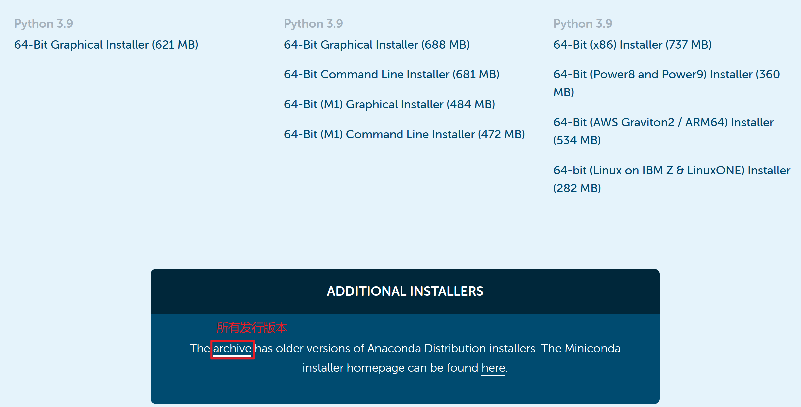

# 1 Anaconda的下载

## 1.1 官网下载 

官网下载地址：[Anaconda | The World's Most Popular Data Science Platform](https://www.anaconda.com/)

点击其他版本下载

点击archive，可以看到Anaconda的所有发行版本和不同操作系统版本

选择合适自己的版本下载即可

## 1.2  国内镜像下载

阿里巴巴镜像网站：[阿里巴巴开源镜像站-OPSX镜像站-阿里云开发者社区 (aliyun.com)](https://developer.aliyun.com/mirror/)

# 2 Anaconda的安装

2.1双击刚刚下载完成的文件

2.2 点击【Next】

2.3 点击【I Agree】

2.4 选择【All Users】（默认是【Just Me】 ）

根据用户选择，如果电脑有多个用户的时才需要考虑，但是一般我们的电脑都是一个用户，所以直接选择All Users即可。根据实际电脑的情况选择。

**注：**选择 All Users需要管理员权限

2.5 选择安装路径，默认为C盘，我选择为D盘，点击【Next】

**注：**，为防止后续出现问题，安装路径文件夹不要使用中文或者空格、特殊字符

2.6 高级选择

第一个选项意思就是将安装路径填入到系统环境变量中，这里勾选，后面使用着会出现问题，大家还是不要选，然后手动添加 **环境变量** 就可以了。默认不能勾选

第二个勾选默认的不用管。直接点击 【**Install**】

2.7 等待安装完成

2.8 安装完成，点击【Next】

点击【Next】

这里的选项选不选都可以

# 3 配置Anaconda环境变量

3.1 在电脑【设置】里搜索【环境变量】，然后选择【编辑系统环境变量】并打开。

3.2 在【高级】下，点击【环境变量】。

3.3 双击【系统变量】中的【Path】

3.4 点击【新建】，并依次加入下面四个变量，最后点击【确定】即可

**注意：**根据自己安装时选择的安装路径添加。

# 4 测试Anaconda是否配置成功

4.1 同时按Win和r键，打开运行对话框，输入【cmd】，并点击【确定】

4.2 输入【conda --version】，查看是否有conda环境

**注意：**是两条横杆【--】

4.3 输入【python】，查看是否有python环境

因为我之前已经配置过python环境，所以这里显示的是我之前的环境

**注意：**如果之前没有配置过python环境，那么这时python版本和conda关联的版本是一致的

4.4 输入【conda info】，查看对应的几个version是否存在

4.5 按win键，查看列表有没有Anaconda

至此，安装彻底结束！！