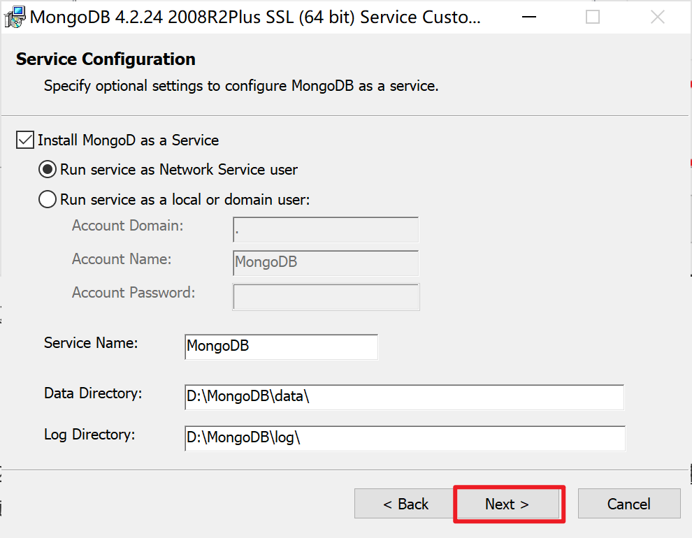
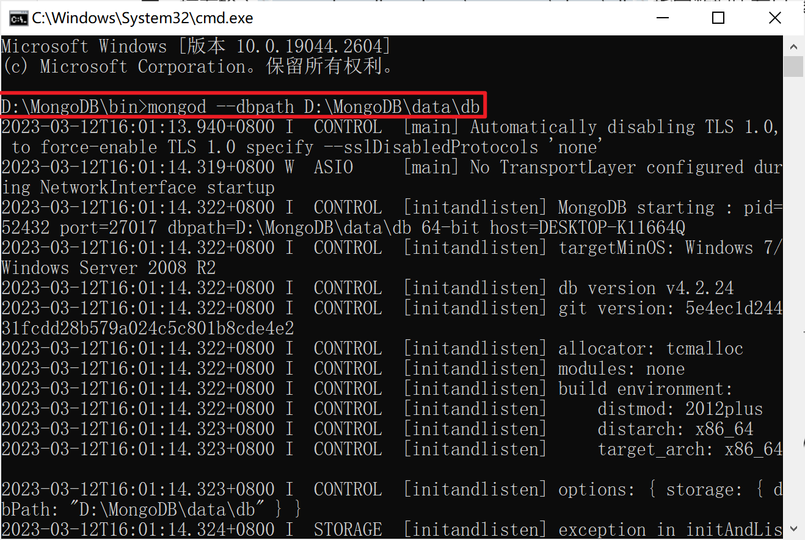

# 1 MongoDB下载

官网下载地址：[Download MongoDB Community Server | MongoDB](https://www.mongodb.com/try/download/community)

选择适合自己的版本下载即可

**注意：**建议选择中间数为双数的，因为双数为稳定版

# 2 MongoDB安装

2.1 双击刚刚下载的.msi文件，点击【Next】下一步

2.2 选择接受许可协议，点击【Next】下一步；

 2.3 点击【Custom（自定义）】按钮可选择指定安装目录

选择类型：选择【Complete（完整）】（建议大多数用户使用）或【Custom（自定义）】安装类型。

【完整设置】选项会将MongoDB和MongoDB工具安装到默认位置使用

 【自定义安装】选项可以指定要安装的可执行文件以及安装位置

2.4 点击【Browser】按钮可选择指定安装的目录文件夹，最好事先创建一个安装MongoDB的文件夹！注意路径，若Location位置显示的是如D:\MongoDB\，需要如上所述新建一个单独的文件夹用来作为具体的安装路径，接着点击Next进入下一步；

2.5 直接选择默认，点击【next】：

**说明：**

- 选择将MongoD作为服务安装将 MongoDB作为服务。
- 选择以下任一项：
  - 以网络服务用户身份运行服务（默认）：这是Windows内置的Windows用户帐户
  - 以本地或域用户身份运行服务
    - 对于现有的本地用户帐户，请`.`为“ 帐户域”指定一个句点（即），并为该用户指定“ 帐户名”和“ 帐户密码 ”。
    - 对于现有的域用户，请为该用户指定“ 帐户域”，“ 帐户名称”和“ 帐户密码 ”。
- 服务名称。指定服务名称。默认名称为`MongoDB`。如果您已经拥有使用指定名称的服务，则必须选择另一个名称。
- 数据目录。指定数据目录，它对应于 [`--dbpath`](https://mongodb.net.cn/manual/reference/program/mongod/#cmdoption-mongod-dbpath)。如果目录不存在，安装程序将创建目录并将目录访问权限设置为服务用户。
- 日志目录。指定日志目录，它对应于 [`--logpath`](https://mongodb.net.cn/manual/reference/program/mongod/#cmdoption-mongod-logpath)。如果目录不存在，安装程序将创建目录并将目录访问权限设置为服务用户。

2.6 取消勾选【[Install MongoDB Compass]】，一定要取消否则安装速度会很慢很慢很慢！，接着继续点击Next则进入最后的自动安装环节，等待安装完成即可。

注：MongoDB Compass为[MongoDB可视化管理工具](https://so.csdn.net/so/search?q=MongoDB可视化管理工具&spm=1001.2101.3001.7020)，这里不安装也是没有问题的，后期如有需要可单独安装，下载地址：https://www.mongodb.com/try/download/compass 。也可以自己去下载一个图形界面管理工具，比如[Robo3T](https://robomongo.org/)

2.7 点击安装【Install】

2.8 等待安装完成

2.9 点击完成【Finish】

# 3 配置MongoDB环境变量

3.1 在电脑【设置】里搜索【环境变量】，然后选择【编辑系统环境变量】并打开。

3.2 在【高级】下，点击【环境变量】。

3.3 双击【系统变量】中的【Path】

3.4 点击【新建】，并依次加入下面四个变量，最后点击【确定】即可

**注意：**根据自己安装时选择的安装路径添加。

# 4 启动服务

1）测试MongoDB是否安装成功

windows+R，输入cmd或者直接搜索打开cmd控制台，输入安装所在盘符的根目录接着就进入安装目录的bin文件夹，或者直接在D:\MongoDB\bin目录下输入cmd，按下回车

2）测试结果 

接着输入`mongod --dbpath D:\MongoDB\data\db` 指定数据所在目录，具体每步操作指令如下图所示；出现如下所示，说明安装完成。

3）浏览器输入查看返回信息

在浏览器中输入http://localhost:27017/可看到返回信息：

