# 一、web起步

## 1、web知识体系

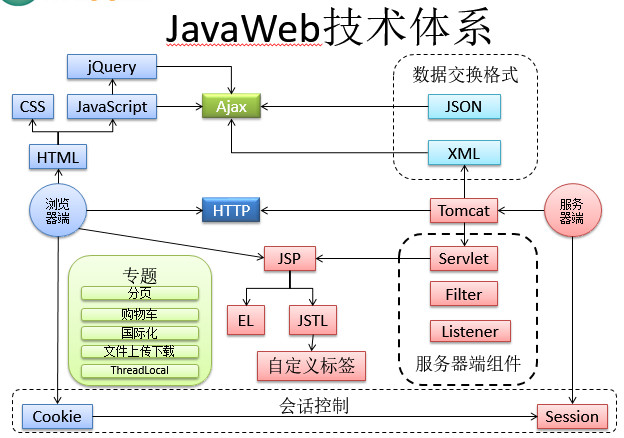

## 2、web应用运行原理

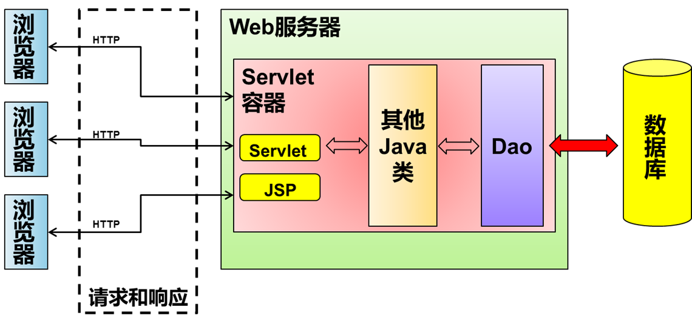

 

## 3、servlet容器

Servlet容器为JavaWeb应用提供运行时环境，它负责管理Servlet和JSP(JSP本质上是一个Servlet)的生命周期，以及管理它们的共享数据。

Servlet容器也称为JavaWeb应用容器，或者Servlet/JSP容器。

目前最流行的Servlet容器软件括：Tomcat（Apache）、WebLogic（Oracle）、WebSphere（IBM）等。

 

## 4、Tomcat

### 简介

Tomcat 是一个免费的开放源代码的Servlet容器，它是Apache软件基金会的一个顶级项目，由Apache，Sun和其他一些公司及个人共同开发而成。由于有了Sun的参与与支持，最新的Servlet和JSP规范总是能在Tomcat中的到体现。


 

### 其他项

#### 配置服务器端口

tomcat的默认端口号是8080；浏览器访问的时候使用localhost:8080，但是8080可能会被其他程序占用，因此可能需要更换端口号。步骤如下：

l 进入Tomcat解压后的根目录，到conf目录下找到server.xml文件，使用文本编辑器打开

l 找到Connector标签，将port="8080"改为port="8989"或其他值

l 注意：Tomcat服务器访问方式是http://localhost:端口号/

 

#### tomcat管理程序

l 输入localhost:8080进入tomcat服务器首页，点击TomcatManager会进入管理界面

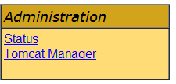

l 提示需要输入密码

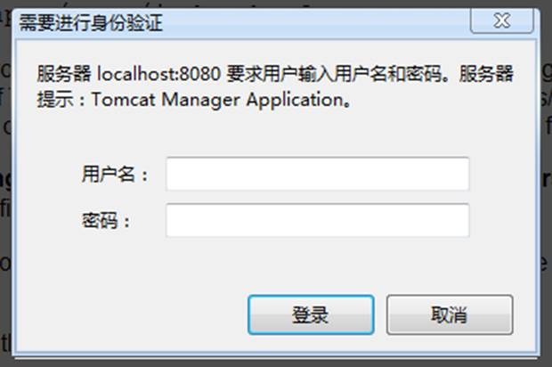

l 点取消得到提示


​                 在conf/tomcat-users.xml文件中进行配置                

​                    这个例子告诉我们如何进行配置  

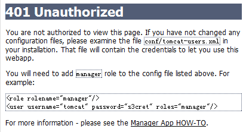


l 按照上面的提示，修改conf/tomcat-users.xml

```xml
<?xml version='1.0' encoding='utf-8'?>
<tomcat-users>
    <role rolename="manager"/>
    <user username="tomcat" password="admin" roles="manager"/>
</tomcat-users>
```

重启Tomcat，重新进入即可

# 二、servlet

## 什么是servlet

●从广义上来讲，Servlet规范是Sun公司制定的一套技术标准，包含与Web应用相关的一系列接口，是Web应用实现方式的宏观解决方案。而具体的Servlet容器负责提供标准的实现。

●从狭义上来讲，Servlet指的是javax.servlet.Servlet接口及其子接口，也可以指实现了Servlet接口的实现类。

●Servlet作为服务器端的一个组件，它的本意是“服务器端的小程序”。Servlet的实例对象由Servlet容器负责创建；Servlet的方法由容器在特定情况下调用；Servlet容器会在Web应用卸载时销毁Servlet对象的实例。

 

## HelloWorld

编写Servlet的三步；

1、创建自己的类HelloServlet，实现Servlet接口

2、实现service方法

3、在web.xml中配置servlet信息

测试：运行项目，在浏览器访问配置的url

 

代码：

1、创建HelloServlet类，并实现Servlet接口，实现service方法

```java
public class HelloServlet implements Servlet{
    @Override
    public void init(ServletConfig config) throws ServletException {
    }
    @Override
    public ServletConfig getServletConfig() {
        return null;
    }
    @Override
    public void service(ServletRequest req, ServletResponse res)
        throws ServletException, IOException {
        System.out.println("我是不是被执行了？");
    }
    @Override
    public String getServletInfo() {
        return null;
    }
    @Override
    public void destroy() {
    }

}

```


2、在web.xml中配置HelloServlet信息

```xml
<servlet>
    <servlet-name>helloServlet</servlet-name>
    <servlet-class>com.atguigu.listener.HelloServlet</servlet-class>
</servlet>
<servlet-mapping>
    <servlet-name>helloServlet</servlet-name>
    <url-pattern>/helloworld</url-pattern>
</servlet-mapping>
```

配置详解：

| 参数                                | 说明                                                         |
| ----------------------------------- | ------------------------------------------------------------ |
| <servlet></servlet>                 | 这个之间配置的是Servlet的类信息                              |
| <servlet-name>                      | 这是Servlet的别名，一个名字对应一个Servlet。相当于变量名     |
| <servlet-class>                     | Servlet的全类名，服务器会根据全类名找到这个Servlet           |
| <servlet-mapping></servlet-mapping> | 这个之间配置的是Servlet的请求映射信息                        |
| <servlet-name>                      | Servlet的别名，说明这个Servlet将会响应下面url-pattern的请求  |
| <url-pattern>                       | Servlet响应的请求路径。如果访问这个路径，这个Servlet就会响应。这个url-pattern可以配置多个，这时表示的就是访问这些url都会触发这个Servlet进行响应 |

3、运行浏览器，访问刚才配置的url路径，Servlet的service方法就会被调用

运行原理：

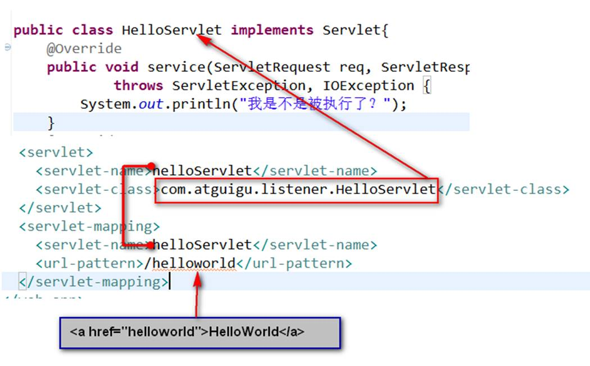

## Servlet技术体系

Servlet的层次关系

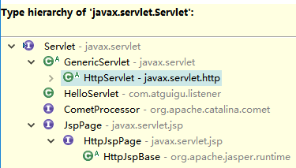

 

现在我们看一下Servlet、GenericServlet、HttpServlet

 

### Servlet

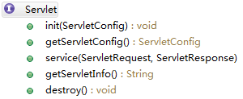

是所有Servlet的接口。是其他Servlet的规范

 

#### Servlet接口


是Servlet的规范。

| 参数                                             | 说明                                             |
| ------------------------------------------------ | ------------------------------------------------ |
| init(ServletConfig config)                       | Servlet初始化函数。初始化时ServletConfig会被传入 |
| ServletConfig getServletConfig()                 | 获取ServletConfig对象                            |
| service(ServletRequest req, ServletResponse res) | 收到请求后的执行方法                             |
| String getServletInfo()                          | 返回此Servlet的描述信息                          |
| void destroy()                                   | Servlet的销毁方法                                |

#### GenericServlet抽象类

public abstract class GenericServlet implements Servlet, ServletConfig,

​    java.io.Serializable

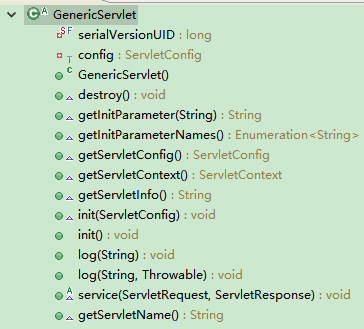

Servlet，ServletConfig的实现类。里面可以实现Servlet的功能，可以获取ServletConfig的信息

 

String getInitParameter(String name)：获取Servlet初始化参数值，初始化参数在web.xml的Servlet中配置，<init-param><param-name>user</param-name> <param-value>abc</param-value><init-param/>

Enumeration<String> getInitParameterNames()：获取Servlet初始化的所有参数name值

ServletConfig getServletConfig()：获取ServletConfig对象

ServletContext getServletContext()：获取ServletContext对象

String getServletInfo()：获取Servlet的描述信息

void init(ServletConfig config)：从Servlet实现的init方法，这里面调用了自己的init方法

void init()：自己的init方法

abstract void service：抽象方法，继承此类的子类必须自己实现此方法。每次请求都会调用此方法

String getServletName()：获取Servlet的名字

 

关于init()

  [1]在GenericServlet中，重写了init(ServletConfig config)方法，用来获取ServletConfig对象。此时如果GenericServlet的子类（通常是自定义Servlet）又重写了init(ServletConfig config)方法有可能导致ServletConfig对象获取不到，所以子类不应该重写带参数的这个init()方法。

  [2]如果想要进行初始化操作，可以重写GenericServlet提供的无参的init()方法，这样就不会影响ServletConfig对象的获取。

 

#### HttpServlet抽象类

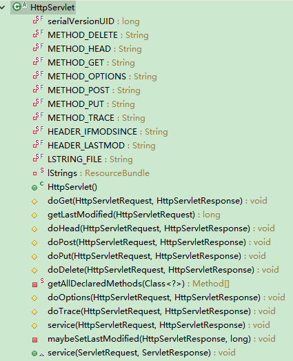

HttpServlet继承了GenericServlet，并实现了service方法。在service方法中，将ServletRequest和ServletResponse转换为了HttpServletRequest和HttpServletResponse，用来专门处理我们的Http请求。方法在完成对请求和响应的强转之后调用了方法，在被调用的方法中 对请求类型进行了判断，各种请求调用自己相应的doXXX方法。而我们常用的就是doGet()和doPost()方法。

 

在我们以后的使用中，都使用继承HttpServlet的方式，重写doGet和doPost方法即可。在浏览器发送请求的时候，如果是get请求，将会调用doGet()方法，如果是post请求，将会调用doPost()方法

 

新的Servlet写法：

```java
public class FirstServlet extends HttpServlet {
    private static final long serialVersionUID = 1L;
    /**
     * @see HttpServlet#HttpServlet()
     */
    public FirstServlet() {
        super();
    }
    /**
	 * @see HttpServlet#doGet(HttpServletRequest request, HttpServletResponse response)
	 */
    protected void doGet(HttpServletRequest request, HttpServletResponse response) throws ServletException, IOException {
        System.out.println("doGet()......");
    }
    /**
	 * @see HttpServlet#doPost(HttpServletRequest request, HttpServletResponse response)
	 */
    protected void doPost(HttpServletRequest request, HttpServletResponse response) throws ServletException, IOException {
        System.out.println("doPost()......");
    }
}
```

web.xml配置与之前相同

## Servlet生命周期

l 什么是生命周期：

应用程序中的对象不仅在空间上有层次结构的关系，在时间上也会因为处于程序运行过程中的不同阶段而表现出不同状态和不同行为——这就是对象的生命周期。

简单的叙述生命周期，就是对象在容器中从开始创建到销毁的过程。

 

l Servlet容器

Servlet对象是Servlet容器创建的，生命周期方法都是由容器调用的。这一点和我们之前所编写的代码有很大不同。在今后的学习中我们会看到，越来越多的对象交给容器或框架来创建，越来越多的方法由容器或框架来调用，开发人员要尽可能多的将精力放在业务逻辑的实现上。

 

l Servlet生命周期

我们在编写Servlet的HelloWorld的时候，我们发现服务器在启动后，访问配置的url的时候好像调用了Servlet的几个方法。到底Servlet在容器中是如何创建，使用，消亡的。我们探究一下：

 

主要步骤：

 

①Servlet对象的创建

默认情况下，Servlet容器第一次收到HTTP请求时创建对应Servlet对象。容器之所以能做到这一点是由于我们在注册Servlet时提供了全类名，容器使用反射技术创建了Servlet的对象。

②Servlet对象初始化

●Servlet容器创建Servlet对象之后，会调用init(ServletConfig config)方法，对其进行初始化。在javax.servlet.Servlet接口中，public void init(ServletConfig config)方法要求容器将ServletConfig的实例对象传入，这也是我们获取ServletConfig的实例对象的根本方法。

  [参考阅读]  ●这是依赖注入思想的一种实现，所谓依赖注入指的是程序中需要的对象不是由开发人员自己创建或获取，而是由“环境”——也就是容器主动“注入”到我们的程序中。这样做的好处是屏蔽复杂对象的创建细节或简化开发过程。这一思想在很多框架中都得到了体现，特别是Spring的IOC容器就是依赖注入思想的典型实现。  

●为了简化开发，GenericServlet抽象类中实现了init(ServletConfig config)方法，将init(ServletConfig config)方法获取到的ServletConfig对象赋值给了成员变量ServletConfig config，目的是使其它方法可以共享这个对象。这时有一个问题：如果子类重写了这个init(ServletConfig config)方法，有可能会导致成员变量config对象赋值失败。所以GenericServlet抽象类另外提供了一个无参的public void init()方法，并在init(ServletConfig config)方法中调用，作为子类进行初始化操作时重写使用。而这个无参的init()方法之所以没有设计成抽象方法，是为了避免子类继承时强制实现这个方法带来的麻烦，使用者可以根据需要选择是否要覆盖这个方法。

③处理请求

●在javax.servlet.Servlet接口中，定义了service(ServletRequest req, ServletResponse res)方法处理HTTP请求，同时要求容器将ServletRequest对象和ServletResponse对象传入。

●在HttpServlet抽象类中，service(ServletRequest req, ServletResponse res)方法将ServletRequest对象和ServletResponse对象强转为了HttpServletRequest、HttpServletResponse子类对象，这样更适合于HTTP请求的处理，所以在doGet()和doPost()方法中使用的就是HttpServletRequest、HttpServletResponse的实现类对象了。

④Servlet对象销毁

●Web应用卸载或服务器停止执行时会销毁Servlet对象，而销毁之前为了执行一些诸如释放缓存、关闭连接、保存数据等操作，所以设计了public void destroy()方法。

 

步骤总结：

[1]Servlet对象创建：接收到浏览器请求后，才创建对象

  [2]Servlet初始化

创建对象之后，会调用init()方法

   作用：是在Servlet对象创建后，执行一些初始化操作

   例如，读取一些资源文件，或建立某种连接

   init()方法只在创建对象时执行一次，以后再接到请求时，就不执行了

  [3]Servlet处理客户端请求

   接收到请求之后调用service()方法

   在每次接到请求后都会执行

  [4]Servlet面临对象的销毁

   当前Web应用卸载之前调用destroy()方法

   在应用卸载之前，可能需要释放一些资源，关闭某些连接

 

 

## ServletConfig接口

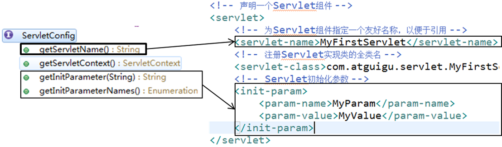

 

l ServletConfig接口封装了Servlet配置信息，这一点从接口的名称上就能够看出来。但同时，代表当前Web应用的ServletContext对象也封装到了ServletConfig对象中，使ServletConfig对象成为了获取ServletContext对象的一座桥梁。

 

l ServletConfig对象的主要功能

①获取Servlet名称

②获取Servlet初始化参数

③获取ServletContext对象

 

l Servlet初始化参数

  在Servlet注册信息中，指定的一个参数，有参数名和参数值。在servlet标签内加入如下配置信息

```xml
<!-- Servlet初始化参数 -->
<init-param>
    <!-- 初始化参数的参数名 -->
    <param-name>Status</param-name>
    <!-- 初始化参数的值 -->
    <param-value>open</param-value>
</init-param>
  
```

  对Servlet运行时如果想设置一些开关选项，就可以以配置文件的形式进行设置，在改变选项状态时，不需要修改源代码、重新编译，只需修改配置文件即可。

```java
  //获取初始化参数  String paramValue =  servletConfig.getInitParameter("Status"); 
```

l 获取ServletConfig对象

  [1]在GenericServlet中，由容器传入init(ServletConfig config)方法。

  [2]在GenericServlet中提供了public ServletConfig getServletConfig()方法用来获取ServletConfig对象。

  [3]如果继承了HttpServlet，则可以直接调用getServletConfig()方法获取ServletConfig对象

 

## ServletContext接口

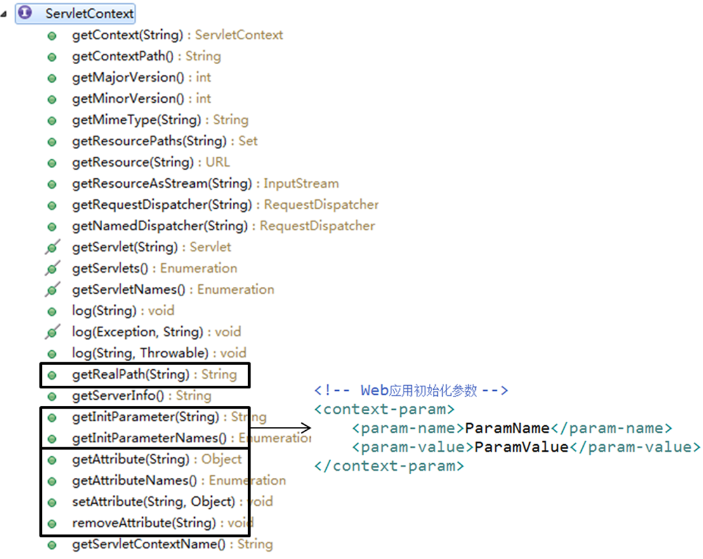

l web容器在启动时，他会为每个web应用都创建一个对应的ServletContext对象。注意：一个web应用对应的是一个ServletContext对象。就行每个web应用就像是不同的餐厅，而Servlet是餐厅服务员，可以有很多，ServletContext是这个餐厅的经理只能有一个。

l 由于一个web应用程序的所有Servlet都共享的是同一个ServletContext对象，所以ServletContext对象也被称为application对象（web应用程序对象）

l 在应用程序中能够获取运行环境或者容器信息的对象通常称之为“上下文对象”。

l ServletContext的主要功能

n 获取web应用程序的初始化参数

 

设置Web应用初始化参数的方式是在web.xml的根标签下加入如下代码

```xml
<!-- Web应用初始化参数 -->
<context-param>
    <param-name>ParamName</param-name>
    <param-value>ParamValue</param-value>
</context-param>  
```

获取Web应用初始化参数

```java
protected void doGet(HttpServletRequest request, HttpServletResponse response) throws ServletException, IOException {
    //1.获取ServletContext对象
    ServletContext context = this.getServletContext();
    //2.获取Web应用初始化参数
    String paramValue = context.getInitParameter("ParamName");
    System.out.println("paramValue="+paramValue);
}
```

n 获取虚拟路径所映射的本地路径

  虚拟路径：浏览器访问web应用中资源时所使用的路径

  本地路径：资源在文件系统中的实际保存路径

 ```java
protected void doGet(HttpServletRequest request, HttpServletResponse response) throws ServletException, IOException {
    //1.获取ServletContext对象
    ServletContext context = this.getServletContext();
    //2.获取index.html的本地路径
    //index.html的虚拟路径是“/index.html”,其中“/”表示当前Web应用的根目录，
    //即WebContent目录
    String realPath = context.getRealPath("/index.html");
    //realPath=D:\DevWorkSpace\MyWorkSpace\.metadata\.plugins\
    //org.eclipse.wst.server.core\tmp0\wtpwebapps\MyServlet\index.html
    System.out.println("realPath="+realPath);
}
 
 ```

application域范围的属性

## HttpServletRequest接口

该接口是ServletRequest接口的子接口，封装了HTTP请求的相关信息，由Servlet容器创建其实现类对象并传入service(ServletRequest req, ServletResponse res)方法中。我们请求的详细信息都可以通过HttpServletRequest接口的实现类对象获取。这个实现类对象一般都是容器创建的，我们不需要管理。

 

Ø HttpServletRequest主要功能

1、获取请求参数

l 什么是请求参数？

请求参数就是浏览器向服务器提交的数据

 

l 浏览器向服务器如何发送数据

①、附在url后面，如：http://localhost:8989/MyServlet/MyHttpServlet?userId=20

②、通过表单提交

```html
<form action="MyHttpServlet" method="post">
    你喜欢的足球队<br /><br />

    巴西<input type="checkbox" name="soccerTeam" value="Brazil" />
    德国<input type="checkbox" name="soccerTeam" value="German" />
    荷兰<input type="checkbox" name="soccerTeam" value="Holland" />
    <input type="submit" value="提交" />
</form>

```

l 使用HttpServletRequest对象获取请求参数

```java
protected void doGet(HttpServletRequest request, HttpServletResponse response) throws ServletException, IOException {
    //一个name对应一个值
    String userId = request.getParameter("userId");
    System.out.println("userId="+userId);
}

```

```java
protected void doPost(HttpServletRequest request, HttpServletResponse response) throws ServletException, IOException {
    //一个name对应一组值
    String[] soccerTeams = request.getParameterValues("soccerTeam");
    for(int i = 0; i < soccerTeams.length; i++){
        System.out.println("team "+i+"="+soccerTeams[i]);
    }
}

```


2、在请求域中保存数据：数据保存在请求域中，可以转发到其他Servlet或者jsp页面，这些Servlet或者jsp页面就会从请求中再取出数据

 ```java
protected void doGet(HttpServletRequest request, HttpServletResponse response) throws ServletException, IOException {
    //将数据保存到request对象的属性域中
    request.setAttribute("attrName", "attrValueInRequest");
    //两个Servlet要想共享request对象中的数据，必须是转发的关系
    request.getRequestDispatcher("/ReceiveServlet")
        .forward(request, response);
}

 ```

```java
protected void doGet(HttpServletRequest request, HttpServletResponse response) throws ServletException, IOException {
    //从request属性域中获取数据
    Object attribute = request.getAttribute("attrName");
    System.out.println("attrValue="+attribute);
}
```

3、转发页面

4、获取请求头相关信息

 

## HttpServletResponse接口

HttpServletResponse是ServletResponse接口的子接口，封装了HTTP响应的相关信息，由Servlet容器创建其实现类对象并传入service(ServletRequest req, ServletResponse res)方法中。

 

主要功能：

1、使用PrintWriter对象向浏览器输出数据

 

  //通过PrintWriter对象向浏览器端发送响应信息     PrintWriter writer = res.getWriter();     writer.write("Servlet response");     writer.close();  

 

2、实现请求重定向

 

## 请求转发与重定向

请求转发和重定向是web应用页面跳转的主要手段，应用十分广泛，所以我们一定要搞清楚他们的区别。

 

请求转发：

l 第一个Servlet接收到了浏览器端的请求，进行了一定的处理，然后没有立即对请求进行响应，而是将请求“交给下一个Servlet”继续处理，下一个Servlet处理完成之后对浏览器进行了响应。在服务器内部将请求“交给”其它组件继续处理就是请求的转发。对浏览器来说，一共只发了一次请求，服务器内部进行的“转发”浏览器感觉不到，同时浏览器地址栏中的地址不会变成“下一个Servlet”的虚拟路径。

l 在转发的情况下，两个Servlet可以共享Request对象中保存的数据

l 转发的情况下，可以访问WEB-INF下的资源

l 当需要将后台获取的数据传送到JSP上显示的时候，就可以先将数据存放到Request对象中，再转发到JSP从属性域中获取。此时由于是“转发”，所以它们二者共享Request对象中的数据。

 

请求重定向：

l 第一个Servlet接收到了浏览器端的请求，进行了一定的处理，然后给浏览器一个特殊的响应消息，这个特殊的响应消息会通知浏览器去访问另外一个资源，这个动作是服务器和浏览器自动完成的，但是在浏览器地址栏里面能够看到地址的改变，会变成下一个资源的地址。

l 对浏览器来说，一共发送两个请求，所以用户是能够感知到变化的。

l 在重定向的情况下，不能共享Request对象中保存的数据。

 

转发与重定向的区别：

|                | 转发                      | 重定向              |
| -------------- | ------------------------- | ------------------- |
| 浏览器地址栏   | 不会变化                  | 会变化              |
| Request        | 同一个请求                | 两次请求            |
| API            | Request对象               | Response对象        |
| 位置           | 服务器内部完成            | 浏览器完成          |
| WEB-INF        | 可以访问                  | 不能访问            |
| 共享请求域数据 | 可以共享                  | 不可以共享          |
| 目标资源       | 必须是当前Web应用中的资源 | 不局限于当前Web应用 |

 

图解转发和重定向

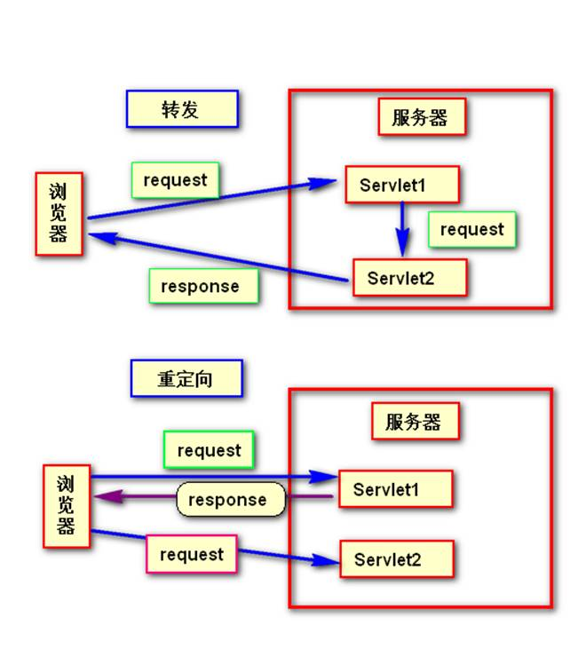

## 字符编码问题

我们web程序在接收请求并处理过程中，如果不注意编码格式及解码格式，很容易导致中文乱码，引起这个问题的原因到底在哪里？如何解决？我们这个小节将会讨论此问题。

 

说到这个问题我们先来说一说字符集。

什么是字符集，就是各种字符的集合，包括汉字，英文，标点符号等等。各国都有不同的文字、符号。这些文字符号的集合就叫字符集。

现有的字符集ASCII、GB2312、BIG5、GB18030、Unicode等

这些字符集，集合了很多的字符，然而，字符要以二进制的形式存储在计算机中，我们就需要对其进行编码，将编码后的二进制存入。取出时我们就要对其解码，将二进制解码成我们之前的字符。这个时候我们就需要制定一套编码解码标准。否则就会导致出现混乱，也就是我们的乱码。

 

l 编码与解码

u 编码：将字符转换为二进制数

| 汉字   | 编码方式 | 编码                          | 二进制              |
| ------ | -------- | ----------------------------- | ------------------- |
| ‘中’   | GB2312   | D6D0                          | 1101 0110-1101 0000 |
| UTF-16 | 4E2D     | 0100 1110-0010 1101           |                     |
| UTF-8  | E4B8AD   | 1110 0100-1011 1000-1010 1101 |                     |

​    

u 解码：将二进制数转换为字符

1110 0100-1011 1000-1010 1101 → E4B8AD → ’中’

​    

u 乱码：一段文本，使用A字符集编码，使用B字符集解码，就会产生乱码。所以解决乱码问题的根本方法就是统一编码和解码的字符集。


 

 

l 解决乱码：

 

解决方法就是统一字符编码。

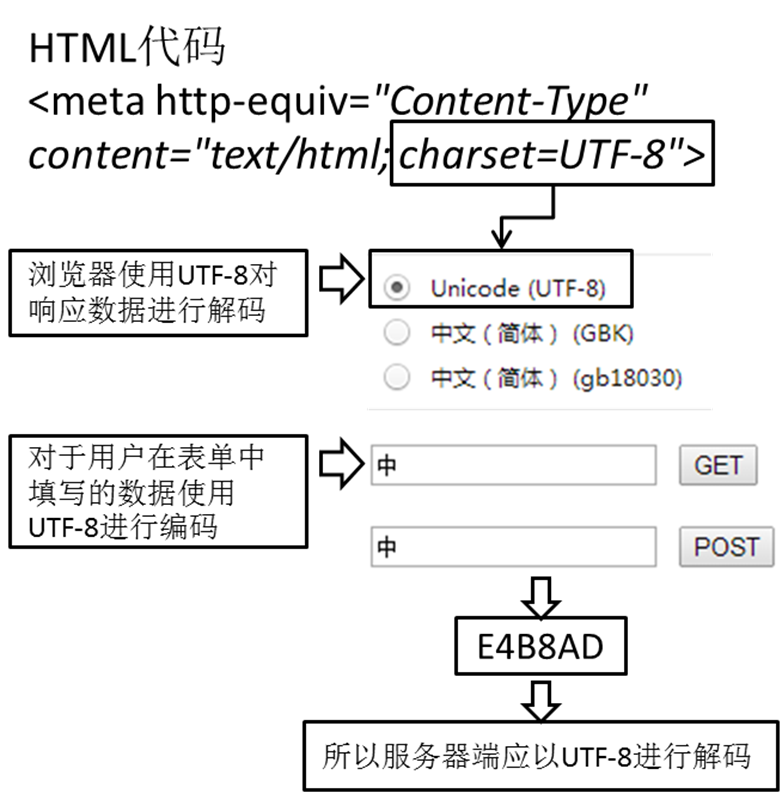

乱码情况：

1、接收中文请求参数

POST请求：post请求提交了中文。在获取参数值之前，设置请求的解码格式，使其和页面保持一致。我们以后都使用utf-8编码，它也称作万国码，集合了基本所有的字符。

​     解决方法：request.setCharacterEncoding("utf-8");

GET请求：GET请求参数是在地址后面的。不能使用上述方法。我们需要修改tomcat的配置文件。需要在Server.xml文件修改Connector标签，添加URIEncoding="utf-8"属性。

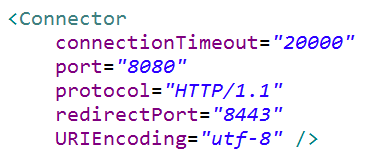

 

2、向浏览器发送有中文字符的响应

向浏览器发送响应的时候，要告诉浏览器，我使用的字符集是哪个，浏览器就会按照这种方式来解码。如何告诉浏览器响应内容的字符编码方案。很简单。

​     解决方法：response.setContentType("text/html;charset=utf-8");

或者使用这两句组合：

response.setCharacterEncoding("utf-8");

response.setHeader("Content-Type", "text/html;charset=utf-8");

 

我们一般使用response.setContentType("text/html;charset=utf-8");

 

## 路径问题

### 提出问题：

①创建Web应用Path，目录结构如图所示

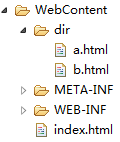

②在a.html中有超链接<a href="b.html">To b.html</a>

③如果先直接访问a.html，再通过超链接转到b.html没有问题。

④如果先通过TestServlet转发到a.html，则浏览器地址栏会变成：

http://localhost:8989/Path/TestServlet

此时再点击超链接<a href="b.html">To b.html</a>就会发生问题，找不到b.html。

⑤原因是超链接<a href="b.html">To b.html</a>使用的是相对路径，浏览器进行解析时，只能以当前浏览器地址栏里的路径为基准。例如，当前浏览器地址栏里的内容是：

http://localhost:8989/Path/TestServlet

那么经过浏览器解析后b.html的访问地址就成了：http://localhost:8989/Path/TestServlet b.html这显然无法访问到b.html。

 

### 完整的url构成

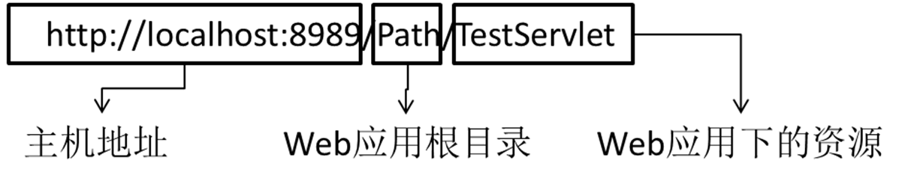

 

### 相对路径和绝对路径

相对路径：虚拟路径如果不以“/”开始，就是相对路径，浏览器会以当前资源所在的虚拟路径为基准对相对路径进行解析，从而生成最终的访问路径。此时如果通过转发进入其他目录，再使用相对路径访问资源就会出错。

 

绝对路径：虚拟路径以“/”开始，就是绝对路径。

①在服务器端：虚拟路径最开始的“/”表示当前Web应用的根目录。

例如：服务器端虚拟路径“/TestServlet”使用浏览器访问时，地址为

http://localhost:8989/Path

 

所以由服务器解析的路径，以”/”开头的都是以当前web路径为基准的。

由服务器解析的路径

<1>web.xml 文件中 url-pattern 中配置的URL，以“/”开头的

<2>转发操作：request.getRequestDispatcher("/xxx").forward(request,response);

​         <jsp:forward page="/xxx">

这些最后的访问路径都是

http://localhost:8989/Path/xxx

 

 

②在浏览器端：虚拟路径最开始的“/”表示当前主机地址。

例如：链接地址“/ Path/ dir/ b.html”经过浏览器解析后为：

相当于http://localhost:8989/ Path/ dir/ b.html

 

所以由浏览器解析的路径，以“/”开头的都是以当前的主机地址为基准的

由浏览器解析的路径

<1>重定向操作：response.sendRedirect("/xxx")

<2>所有HTML标签：<a href="/xxx">；<form action="/xxx"> ...

这些最后的访问路径都是

http://localhost:8989/xxx

 

所以我们可以看出，如果是浏览器解析的路径，我们必须加上项目名称才可以正确的指向资源。http://localhost:8989/Path/xxx

 

 

在由浏览器解析的地址中动态添加当前web应用根目录路径

[1]JSP表达式 <%= request.getContextPath() %> = /LessonPractice040

例：<a href="<%= request.getContextPath() %>/target.jsp">Target Page</a>

[2]EL表达式 ${pageContext.request.contextPath } = /LessonPractice040

例： <a href="${pageContext.request.contextPath }/target.jsp">Target Page</a>

 

 


 

# 三、jsp

## 1、现有技术不足

Servlet可以通过转发或重定向跳转到某个HTML文档。但HTML文档中的内容不受Servlet的控制。比如登录失败时，跳转回登录表单页面无法显示诸如“用户名或密码不正确”的错误消息，所以我们目前采用的办法是跳转到一个错误信息页面。如果通过Servlet逐行输出响应信息则会非常繁琐。

|      | Servlet                            | HTML               |
| ---- | ---------------------------------- | ------------------ |
| 长处 | 接收请求参数，访问域对象，转发页面 | 以友好方式显示数据 |
| 短处 | 以友好方式显示数据                 | 动态显示数据       |

那能否将Servlet和HTML二者的长处结合起来呢？

 

## 2、jsp简介

Java Server Page

  ①JSP的本质是一个Servlet，Servlet能做的事情JSP都能做。

  ②JSP能够以HTML页面的方式呈现数据，是一个可以嵌入Java代码的HTML。

③JSP不同于HTML，不能使用浏览器直接打开，而必须运行在Servlet容器中。

## 3、jsp运行原理

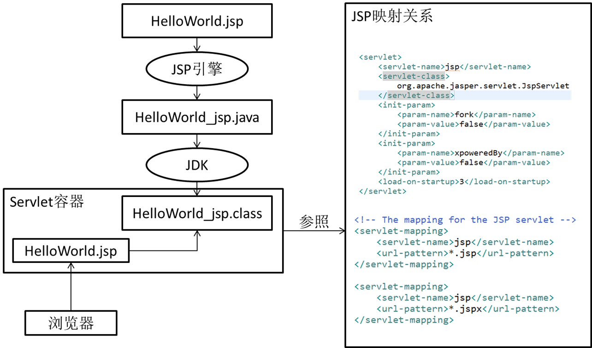

 

注意：JSP仅在第一次访问时执行“翻译”和“编译”，之后再请求时就直接运行.class文件了。

 

## 4、jsp基本语法

接下来看一下jsp的基本语法及规则

### 1、jsp模板元素

l JSP页面中的静态HTML内容称之为JSP模版元素，在静态的HTML内容之中可以嵌套JSP的其他各种元素来产生动态内容和执行业务逻辑。

l JSP模版元素定义了网页的基本骨架，即定义了页面的结构和外观

### 2、jsp表达式

●JSP表达式（expression）提供了将一个Java变量或表达式的计算结果输出到客户端的简化方式，它将要输出的变量或表达式直接封装在<%= 和 %>之中

举例：Current time: <%= new java.util.Date() %>

●JSP表达式中的变量或表达式的计算结果将被转换成一个字符串，然后被插入到整个JSP页面输出结果的相应位置处。

●JSP表达式中的变量或表达式后面不能有分号（;），JSP表达式被翻译成Servlet程序中的一条out.print(…)语句。

 

### 3、jsp脚本片段

l JSP脚本片断（scriptlet）是指嵌套在<% 和 %>之中的一条或多条Java程序代码。

l 在JSP脚本片断中，可以定义变量、执行基本的程序运算、调用其他Java类、访问数据库、访问文件系统等普通Java程序所能实现的功能。

l 在JSP脚本片断可以直接使用JSP提供的隐含对象来完成WEB应用程序特有的功能。

l JSP脚本片断中的Java代码将被原封不动地搬移进由JSP页面所翻译成的Servlet的_jspService()方法中。所以，JSP脚本片断之中只能是符合Java语法要求的程序代码，除此之外的任何文本、HTML标记、其他JSP元素都必须在脚本片断之外编写。

l JSP脚本片断中的Java代码必须严格遵循Java语法，例如，每条命令执行语句后面必须用分号（;）结束。

l 在一个JSP页面中可以有多个脚本片断（每个脚本片断代码嵌套在各自独立的一对<% 和 %>之间），在两个或多个脚本片断之间可以嵌入文本、HTML标记和其他JSP元素。

举例：

  <%    int x = 3;  %>  <p>这是一个HTML段落</p>  <%    out.println(x);  %>  

l 多个脚本片断中的代码可以相互访问，犹如将所有的代码放在一对<%%>之中的情况。

举例：上面的JSP内容与下面的JSP内容具有同样的运行效果

  <p>这是一个HTML段落</p>  <%     int x = 3;     out.println(x);  %>  

l 单个脚本片断中的Java语句可以是不完整的，但是，多个脚本片断组合后的结果必须是完整的Java语句，例如，涉及条件和循环处理时，多个脚本片断及其他元素组合的结果必须能形成完整的条件和循环控制语句。 

l 由于脚本片断中的Java代码将被原封不动地搬移进由JSP页面所翻译成的Servlet的_jspService()方法中，脚本片断之外的任何文本、HTML标记以及其他JSP元素也都会被转换成相应的Java程序代码插入进_jspService()方法中，且脚本片断和其他JSP元素的插入位置与它们在JSP页面中的原始位置相对应。 

l 在脚本片断中可以使用条件、循环、选择等流程控制语句来创建其周围的其他元素的执行逻辑，因此，在编写JSP页面时应考虑各个元素之间的先后顺序和相互关系，特别是将循环、条件判断等语句分布在若干个脚本片断中编写时对其邻近的其他JSP元素产生的影响。

举例1：

| JSP代码                                                      | _jspService()方法中的代码                                    |
| ------------------------------------------------------------ | ------------------------------------------------------------ |
| <%for (int i=1; i<5; i++) {%>    <h<%=i%>>www.atguigu.com</h<%=i%>>  <%}%> | for (int i=1; i<5; i++) {       out.write("\r\n");       out.write("\t\t<h");     out.print(i);       out.write(">www.atguigu.com</h");     out.print(i);       out.write(">\r\n");     out.write("\t");  } |

举例2：

| JSP代码                                                      | _jspService()方法中的代码                                    |
| ------------------------------------------------------------ | ------------------------------------------------------------ |
| <% if(age>65){  %>    可以退休  <%}else{ %>    不能退休  <%} %> | if(age>65){        out.write("\r\n");     out.write("\t\t可以退休\r\n");       out.write("\t");  }else{        out.write("\r\n");     out.write("\t\t不能退休\r\n");       out.write("\t");  } |

 

### 4、jsp声明

l 由于Java语法的限制，有很多语法成分不能在方法中使用，例如：其他方法、成员变量、静态代码块等等，所以这些成分在JSP脚步中同样不能使用。

l 如果希望JSP脚本中的代码出现在_jspService()方法外面，可以使用JSP声明。

l JSP声明的格式是：<%!   代码代码代码...   %>

l JSP隐含对象的作用域范围仅限于_jspService()方法，所以在JSP声明中不能使用这些隐含对象。

l 我们一般不使用jsp声明来写代码。

 

### 5、jsp注释

①JSP注释格式：<%-- 注释信息 --%>

②JSP注释生效的时间：JSP引擎在将JSP页面翻译成Servlet程序时，忽略JSP页面中被注释的内容。

③与HTML注释、Java注释对比

​    ●JSP的注释：jsp生成Java源文件时被忽略

​    ●Java的注释：运行class文件时被忽略

 ●HTML的注释：浏览器解析时被忽略

 

### 6、jsp指令

l JSP指令（directive）是为JSP引擎而设计的，它们并不直接产生任何可见输出，而只是告诉引擎如何处理JSP页面中的其余部分。

l JSP指令的基本语法格式：

  <%@ 指令名 属性名="值" %>

  举例：<%@ page contentType="text/html;charset=gb2312"%>

  注意：属性名部分是大小写敏感的

l 在目前的JSP2.0中，定义了page、include和taglib这三种指令，每种指令中又都定义了一些各自的属性。如果要在一个JSP页面中设置同一条指令的多个属性，可以使用多条指令语句单独设置每个属性，也可以使用同一条指令语句设置该指令的多个属性。

  第一种方式：

  <%@ page contentType="text/html;charset=gb2312"%>

  <%@ page import="java.util.Date"%>

   第二种方式：

  <%@ page contentType="text/html;charset=gb2312" import="java.util.Date"%>

Ø page指令

page指令用于定义JSP页面的各种属性，无论page指令出现在JSP页面中的什么地方，它作用的都是整个JSP页面。为了保持程序的可读性和遵循良好的编程习惯，page指令最好是放在整个JSP页面的起始位置

  JSP 2.0规范中定义的page指令的完整语法：  <%@ page       [  language="java" ]       [  extends="package.class" ]       [  import="{\package\.\class\ | \package\.\\},  ..." ]       [  session="true | false" ]       [  buffer="none | 8kb | sizekb" ]       [  autoFlush="true | false" ]       [  isThreadSafe="true | false" ]       [  info="text" ]       [  errorPage="relative_url" ]       [  isErrorPage="true | false" ]       [contentType="\mimeType\  [ ;charset=\characterSet\ ]" | "text/html ;  charset=ISO-8859-1" ]      [  pageEncoding="\characterSet\ | ISO-8859-1" ]       [  isELIgnored="true | false" ]   %>  

  [1]import属性：指定 JSP 页面转换成 Servlet时应该导入的包。

  [2]pageEncoding属性：设置JSP页面翻译成Servlet源文件时使用的字符集。

  [3]contentType属性：设置 Content-Type 响应报头，标明即将发送到客户程序的文档的 MIME 类型以及浏览器对响应内容的解码字符集。

  [4]errorPage属性：指定当前JSP抛出异常时的转发页面。

  [5]isErrorPage属性：指定当前页面是不是一个显示错误消息的页面，如果是，则会自动创建exception对象，否则就不会创建exception对象。

  [6]session属性：控制页面是否参与HTTP会话，其本质是要不要自动创建session隐含对象以供使用。

  [7]isELIgnored属性：指定当前页面是否忽略EL表达式，如果忽略，EL表达式的内容将会原封不动的输出到浏览器端。

Ø include指令

•  include指令用于通知JSP引擎在翻译当前JSP页面时将其他文件中的内容合并进当前JSP页面转换成的Servlet源文件中，这种在源文件级别进行引入的方式称之为静态引入，当前JSP页面与静态引入的页面紧密结合为一个Servlet。

•  语法：

 <%@ include file="relativeURL"%>

 其中的file属性用于指定被引入文件的相对路径。 

•  细节：

ü  被引入的文件必须遵循JSP语法，其中的内容可以包含静态HTML、JSP脚本元素、JSP指令和JSP行为元素等普通JSP页面所具有的一切内容。

ü  被引入的文件可以使用任意的扩展名，即使其扩展名是html，JSP引擎也会按照处理JSP页面的方式处理它里面的内容，为了见明知意，JSP规范建议使用.jspf（JSP fragments）作为静态引入文件的扩展名。

ü 在将JSP文件翻译成Servlet源文件时，JSP引擎将合并被引入的文件与当前JSP页面中的指令元素（设置pageEncoding属性的page指令除外），所以，除了import和pageEncoding属性之外，page指令的其他属性不能在这两个页面中有不同的设置值。 

 

### 7、jsp标签 

Ø 概述

●JSP还提供了一种称之为Action的元素，在JSP页面中使用Action元素可以完成各种通用的JSP页面功能，也可以实现一些处理复杂业务逻辑的专用功能。

●Action元素采用XML元素的语法格式，即每个Action元素在JSP页面中都以XML标签的形式出现。

●JSP规范中定义了一些标准的Action元素，这些元素的标签名都以jsp作为前缀，并且全部采用小写，例如，<jsp:include>、<jsp:forward>等等。

Ø <jsp:include>标签

●<jsp:include>标签用于把另外一个资源的输出内容插入进当前JSP页面的输出内容之中，这种在JSP页面执行时的引入方式称之为动态引入。

●语法：

<jsp:include page="relativeURL | <%=expression%>" flush="true|false" />

○page属性用于指定被引入资源的相对路径，它也可以通过执行一个表达式来获得。

○flush属性指定在插入其他资源的输出内容时，是否先将当前JSP页面的已输出的内容刷新到客户端。

●<jsp:include>标签与include指令的比较

○@include指令在翻译“主体”代码时起作用。相当于把“被包含”的JSP代码复制到“主体”JSP文件中，生成一个合并之后的Servlet源文件，所以二者在代码中不能使用相同的变量名等——凡是放在一起会冲突的内容都不被允许。

○<jsp:include>标签会被翻译为JspRuntimeLibrary类的include()方法，“被包含”的JSP页面会单独翻译、编译；每次“主体”JSP被请求时，都会先执行“被包含”的JSP，将执行结果合并到HTML代码中，一起发送到浏览器端。所以使用<jsp:include>标签时，“被包含”的JSP中的代码不会和“主体”JSP冲突。

○对比

|                                          | @include指令            | <jsp:include>标签        |
| ---------------------------------------- | ----------------------- | ------------------------ |
| 特点                                     | 静态包含                | 动态包含                 |
| 语法的基本形式                           | <%@ include  file=”…”%> | <jsp:include  page=”…”/> |
| 包含动作发生的时机                       | 翻译期间                | 请求期间                 |
| 生成Servlet源文件                        | 一个                    | 多个                     |
| 合并方式                                 | 代码复制                | 合并运行结果             |
| 包含的内容                               | 文件实际内容            | 页面输出结果             |
| 代码冲突                                 | 有可能                  | 不可能                   |
| 被包含页面中可否设置影响主页面的响应报头 | 可以                    | 不可以                   |

○举例

| [1]创建三个JSP页面结构如下    [2]编辑main.jsp             <%@ include file="partOne.jsp" %>      <br />    <jsp:include page="partTwo.jsp"></jsp:include>           [3]编辑partOne.jsp             <%="I am part one!" %>           [4]编辑partTwo.jsp             <%="I am part two!" %>           [5]运行main.jsp    [6]翻译和编译的结果    [7] main_jsp.java中的内容             out.write("<!DOCTYPE……>\r\n");    out.write("<html>\r\n");    out.write("<head>\r\n");    out.write("<meta ……">\r\n");    out.write("<title>Insert title    here</title>\r\n");    out.write("</head>\r\n");    out.write("<body>\r\n");    out.write("\r\n");    out.write("\t");    out.print("I am    part one!" );    out.write("\r\n");    out.write("\t<br />\r\n");    out.write("\t");    org.apache.jasper.runtime.JspRuntimeLibrary    .include(request, response,    "partTwo.jsp", out, false);    out.write("\r\n");    out.write("\r\n");    out.write("</body>\r\n");    out.write("</html>");           [8] partTwo_jsp.java中的内容             out.print("I am    part two!" ); |
| ------------------------------------------------------------ |
|                                                              |

Ø <jsp:forward>标签

[1]<jsp:forward>标签用于把请求转发给另外一个资源

[2]语法：

<jsp:forward page="relativeURL|<%=expression%>" />

page属性用于指定请求转发到的资源的相对路径，它也可以通过执行一个表达式来获得。

Ø <jsp:param>标签

[1]当使用<jsp:include>和<jsp:forward>标签引入或将请求转发给的资源是一个能动态执行的程序时，例如Servlet和JSP页面，那么，还可以使用<jsp:param>标签向这个程序传递请求参数。

语法1：

  <jsp:include page="relativeURL | <%=expression%>">  <jsp:param  name="parameterName" value="parameterValue|<%= expression  %>" />  </jsp:include>  

语法2：

  <jsp:forward page="relativeURL | <%=expression%>">  <jsp:param  name="parameterName" value="parameterValue|<%= expression  %>" />  </jsp:include>  

[2]<jsp:param>标签的name属性用于指定参数名，value属性用于指定参数值。在<jsp:include>和<jsp:forward>标签中可以使用多个<jsp:param>标签来传递多个参数。

 

## 5、jsp九大隐含对象

在JSP页面上编写Java代码时，有九个可以直接使用的内置对象。

  PageContext pageContext  HttpServletRequest request  HttpSession session  ServletContext application  HttpServletResponse response  ServletConfig config  Throwable exception  JspWriter out  Object page  

为什么可以在页面使用它们，因为我们发现，页面是在service方法中进行解析的。

而service方法在解析页面之前申明了。在页面设置为isErrorPage=”true”的时候，exception对象就会显示

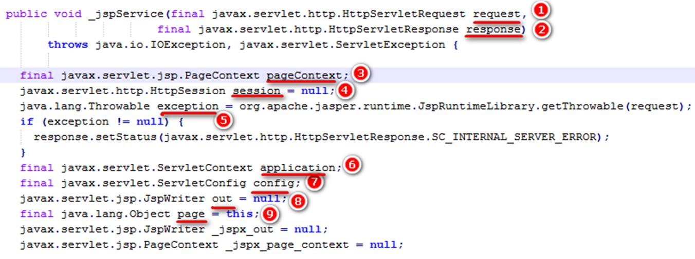

 

#### PageContext pageContext

pageContext主要有以下功能

 

Ø 获取其它隐含对象

  getException方法返回exception隐式对象   getPage方法返回page隐式对象  getRequest方法返回request隐式对象   getResponse方法返回response隐式对象   getServletConfig方法返回config隐式对象  getServletContext方法返回application隐式对象  getSession方法返回session隐式对象   getOut方法返回out隐式对象   

 

Ø 作为域对象

可以设置、获取属性值

public void setAttribute(java.lang.String name,java.lang.Object value)

public java.lang.Object getAttribute(java.lang.String name)

public void removeAttribute(java.lang.String name)

 

Ø 访问其它属性域

`1 public java.lang.Object getAttribute(java.lang.String name,int scope)``2 public void setAttribute(java.lang.String name, java.lang.Object value,int scope)``3 public void removeAttribute(java.lang.String name,int scope)`

 

int scope代表各个域的常量，可取值如下

`1 PageContext.APPLICATION_SCOPE``2 PageContext.SESSION_SCOPE``3 PageContext.REQUEST_SCOPE``4 PageContext.PAGE_SCOPE`

#### HttpServletRequest request

域对象，可以存取属性值，用来在域中共享。

public void setAttribute(java.lang.String name,java.lang.Object value)

public java.lang.Object getAttribute(java.lang.String name)

public void removeAttribute(java.lang.String name)

#### HttpSession session

域对象，可以存取属性值，用来在域中共享。

 

#### ServletContext application

域对象，可以存取属性值，用来在域中共享。

 

#### -------四个域对象作用范围比较--------

作用范围：

| 域对象      | 作用范围    | 起始时间    | 结束时间    |
| ----------- | ----------- | ----------- | ----------- |
| pageContext | 当前JSP页面 | 页面加载    | 离开页面    |
| request     | 同一个请求  | 收到请求    | 响应        |
| session     | 同一个会话  | 开始会话    | 结束会话    |
| application | 当前Web应用 | Web应用加载 | Web应用卸载 |

 

#### HttpServletResponse response

response对象：代表HTTP响应

#### ServletConfig config

config对象：ServletConfig实例，代表Servlet配置信息

#### Throwable exception

exception对象：封装了当前JSP页面捕获到的异常信息

#### JspWriter out

Ø out对象用于向客户端发送文本数据。

Ø out对象是通过调用pageContext对象的getOut()方法返回的，其作用和用法与ServletResponse.getWriter方法返回的PrintWriter对象非常相似。

Ø JSP页面中的out对象的类型为JspWriter，JspWriter相当于一种带缓存功能的PrintWriter，设置JSP页面的page指令的buffer属性可以调整它的缓存大小，甚至关闭它的缓存。

Ø 只有向out对象中写入了内容，且满足如下任何一个条件时，out对象才去调用ServletResponse.getWriter方法，并通过该方法返回的PrintWriter对象将out对象的缓冲区中的内容真正写入到Servlet引擎提供的缓冲区中：

●设置page指令的buffer属性关闭了out对象的缓存功能

●out对象的缓冲区已满

●整个JSP页面结束

Ø out对象的工作原理图

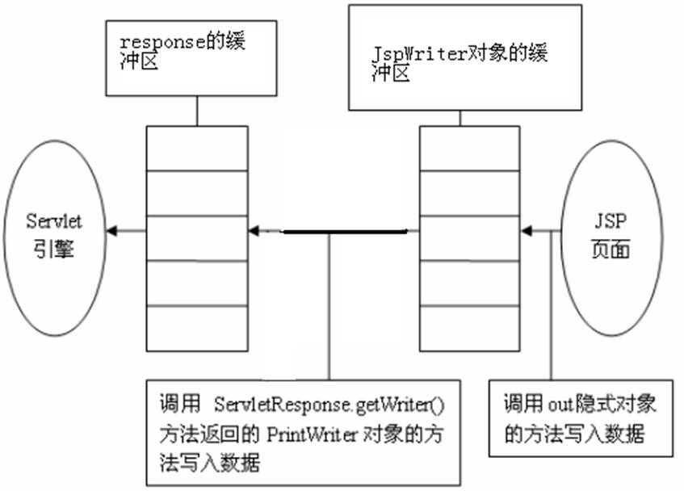

 

#### Object page

this的一个引用，但却是Object类型的，导致能用的方法仅限于Object类的方法，还不如this本身实用。

# 四、filter

## 1、提出问题

1、我们在访问后台很多页面时都需要登录，只有登录的用户才能查看这些页面，我们需要在每次请求的时候都检查用户是否登陆，这样做很麻烦，有没有一种方法可以在我们请求之前就帮我们做这些事情。有！

 

2、我们web应用经常会接收中文字符，由于可能导致中文乱码，我们每次都需要在方法的开始使用request.setCharacterEncoding(“utf-8”)；能不能在我们要获取参数值直接就可以自己设置好编码呀。能！

 

这种问题的解决方法我们想到了一种办法。那就是在每次请求之前我们先将它拦截起来，当我们设置好一切东西的时候，再将请求放行。类似与我们地铁站的检票系统。每个人进站的时候必须刷卡，扣完钱后才可以进站坐车。

 

web中也有这个机制，我们叫做过滤器。

就是我们接下来学习的filter

## 2、Filter简介

### 1、什么是filter

Filter（过滤器） 的基本功能是对 Servlet 容器调用 Servlet (JSP)的过程进行拦截，从而在 Servlet 处理请求前和Servlet响应请求后实现一些特殊的功能。

在 Servlet API 中定义了三个接口类来开供开发人员编写 Filter 程序：Filter, FilterChain, FilterConfig

Filter 程序是一个实现了 Filter 接口的 Java 类，与 Servlet 程序相似，它由 Servlet 容器进行调用和执行

Filter 程序需要在 web.xml 文件中进行注册和设置它所能拦截的资源：Filter 程序可以拦截 Jsp, Servlet, 静态图片文件和静态 html 文件

 

### 2、filter的运行原理是什么

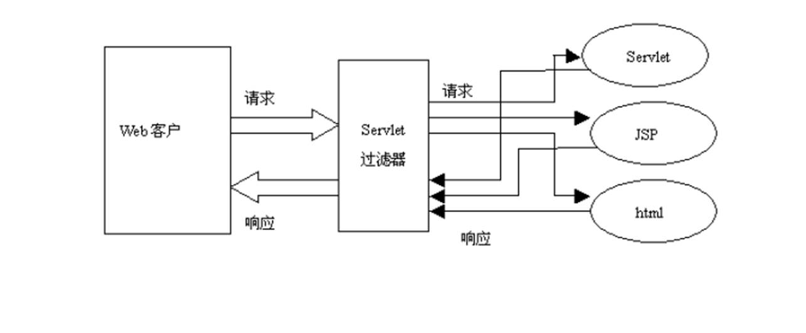

 

这个Servlet过滤器就是我们的filter

 

Ø 当在 web.xml 中注册了一个 Filter 来对某个 Servlet 程序进行拦截处理时，这个 Filter 就成了 Tomcat与该 Servlet 程序的通信线路上的一道关卡，该 Filter 可以对 Servlet 容器发送给 Servlet 程序的请求和 Servlet 程序回送给 Servlet 容器的响应进行拦截，可以决定是否将请求继续传递给 Servlet 程序，以及对请求和相应信息是否进行修改

Ø 在一个 web 应用程序中可以注册多个 Filter 程序，每个 Filter 程序都可以对一个或一组 Servlet 程序进行拦截。

Ø 若有多个 Filter 程序对某个 Servlet 程序的访问过程进行拦截，当针对该 Servlet 的访问请求到达时，web 容器将把这多个 Filter 程序组合成一个 Filter 链(过滤器链)。Filter 链中各个 Filter 的拦截顺序与它们在应用程序的 web.xml 中映射的顺序一致

 

## 3、Filter-helloword

### 1、Hello-World

filter编写三步骤：

1、创建filter实现类，实现filter接口

2、编写web.xml配置文件，配置filter的信息

3、运行项目，可以看到filter起作用了

代码：

1、filter实现类

```java
public class MyFirstFilter implements Filter{
    @Override
    public void init(FilterConfig filterConfig) throws ServletException {
        System.out.println("初始化方法");
    }

    @Override
    public void doFilter(ServletRequest request, ServletResponse response,FilterChain chain) throws IOException, ServletException {
        System.out.println("dofilter方法");
    }

    @Override
    public void destroy() {
        System.out.println("销毁方法...");
    }

}

```


2、web.xml配置

```xml
<filter>
    <filter-name>MyFirstFilter</filter-name>
    <filter-class>com.atguigu.filter.MyFirstFilter</filter-class>
</filter>
<filter-mapping>
    <filter-name>MyFirstFilter</filter-name>
    <url-pattern>/index.jsp</url-pattern>
</filter-mapping>

```

3、运行程序，发现index.jsp页面不显示了，后台输出“dofilter方法”，说明我们写的filter执行了。

### 2、filter的生命周期

1、在服务器启动时，filter被创建并初始化，执行init()方法。

2、请求通过filter时执行doFilter方法。

3、服务器停止时，调用destroy方法。

 

### 3、filter放行请求

我们发现，刚才的filter配置好后，index.jsp页面没法访问了，访问这个页面的时候filter的dofilter方法被调用了。说明dofilter这个方法拦截了我们的请求。

我们如何显示页面呢。也就是如何将请求放行呢。我们观察发现有个filterChain被传入到这个方法里面了。filterChain里面有个doFilter()方法。

放行请求只需要调用filterChain的dofilter方法。

```java
public void doFilter(ServletRequest request, ServletResponse response,
                     FilterChain chain) throws IOException, ServletException {
    System.out.println("dofilter方法");
    chain.doFilter(request, response);//放行请求
}

```

### 4、filter拦截原理

我们在chain.doFilter(request, response);方法后也写一句话，System.out.println

(“doFilter方法执行后…”)，在index.jsp页面也写上jsp脚本片段，输出我是jsp页面。运行程序发现控制台输出了这几句话：

dofilter方法…

我是jsp页面

dofilter方法后…

我们不难发现filter的运行流程

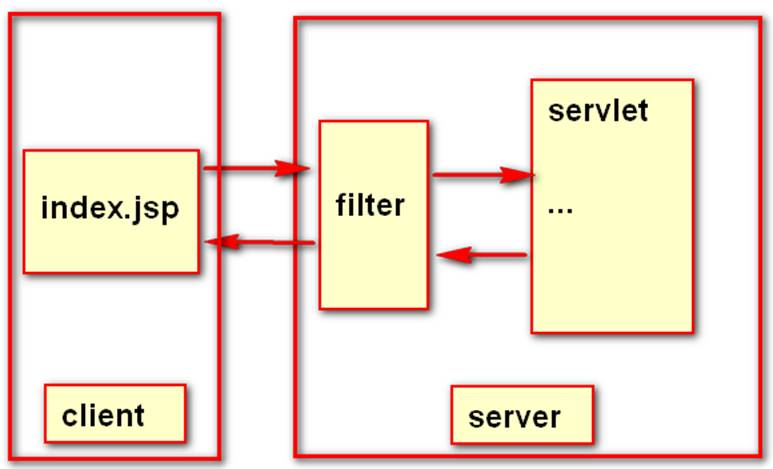

 

### 5、FilterChain

doFilter(ServletRequest request, ServletResponse response, FilterChain chain)

在doFilter执行之前，由容器将filterChain对象传入方法。调用此对象的.doFilter()方法可以将请求放行，实际上是执行过滤器链中的下一个doFilter方法，但是如果只有一个过滤器，则为放行。

 

### 6、FilterConfig

FilterConfig类似ServletConfig，是filter的配置信息对象。FilterConfig对象具有以下方法。

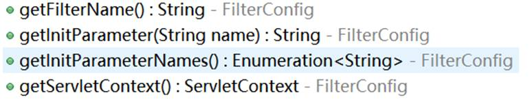

getFilterName():获取当前filter的名字。获取的是在web.xml中配置的filter-name的值

getInitParameter(String name):获取filter的初始化参数。在web.xml中配置

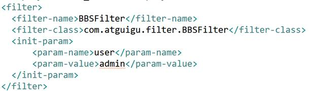

getInitParameterNames():获取filter初始化参数名的集合。

getServletContext():获取当前web工程的ServletContext对象。

 

## 5、Filter的url-pattern

url-pattern是配置filter过滤哪些请求的。主要有以下几种配置：

web.xml中配置的/都是以当前项目路径为根路径的

1、精确匹配：

  /index.jsp  /user/login  会在请求/index.jsp、/user/login的时候执行过滤方法

 

2、路径匹配：

  /user/   /  凡是路径为/user/下的所有请求都会被拦截，/表示拦截系统的所有请求，包括静态资源文件。

 

3、扩展匹配：

  .jsp .action   凡是后缀名为.jsp .action 的请求都会被拦截。

  

注意：/login/.jsp 这种写法是错误的，只能是上述三种的任意一种形式。不能组合新形式。

jsp也是错误的，扩展匹配必须是后缀名

 

 

Ø 多重url-pattern配置

上面的三种形式比较有局限性，但是url-pattern可以配置多个，这样这三种组合基本就能解决所有问题了

 

## 6、Filter的dispatcher

filter的dispatcher表示什么情况之下过滤这个请求。请求可能是转发到的，也可能是重定向到的等等。

1、REQUEST：

   如果要拦截的请求是直接请求、重定向过来的，则拦截请求

2、FORWARD：

   如果是要拦截的请求是转发过来的，则进行拦截

3、INCLUDE：

   如果是通过jsp：include方式的则进行拦截。<%@include %>这种不拦截

4、ERROR：

   如果是配置的Error方式，则进行拦截。

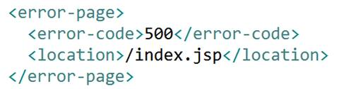

 

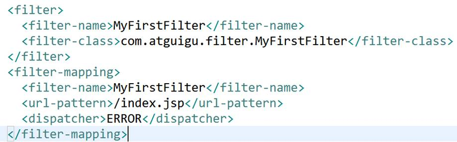

 

如上配置，发生错误会跳转到index.jsp，但是此时会被MyFirstFilter拦截。而其他方式请求的index.jsp不会被拦截

 

Ø dispatcher也可以进行多重配置

## 7、多Filter执行顺序

如果同一个资源有多个filter都对其拦截，则拦截的顺序是按照web.xml中配置的顺序进行的

执行流程图如下

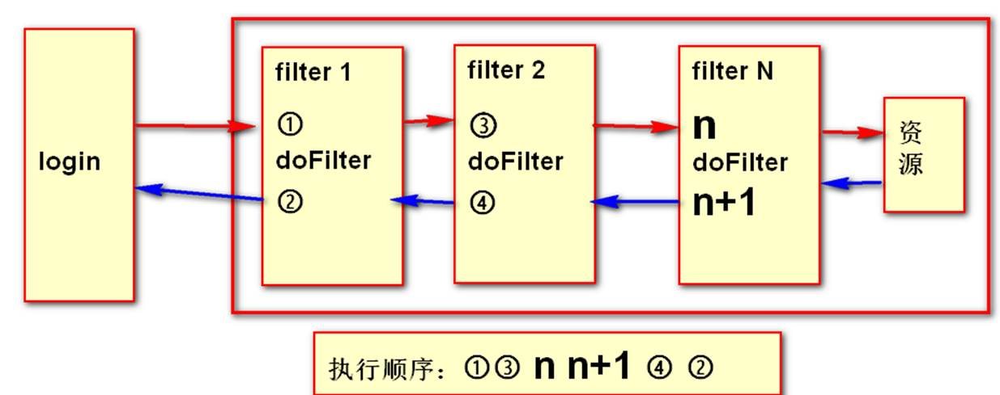

请求总是在处理之后再回来执行doFilter之后的方法。

## 8、Filter练习

1、创建一个论坛系统，要求登录后的用户才能发消息，使用filter进行登陆验证，使用filter解决论坛中出现的中文乱码，使用filter过滤论坛中的敏感字符


 

# 五、listener

## 1、Listener简介

什么是监听器：

专门用来对其他对象身上发生的事情或状态改变进行监听和相应处理的对象，当被监视对象发生情况时，立即采取相应的行动

 

作用：

监听web变化：Servlet规范中定义的一种特殊类，用于监听web'应用程序中的ServletContext，HttpSession，ServletRequest等域对象的创建与销毁，以及属性变化

## 2、八大listener

我们Servlet规范中定义了很多种类型的监听器，他们有着各自不同的功能。我们来看一下这些监听器。

\1.  ServletContextListener：

ServletContext生命周期监听器，创建和销毁时被触发。包含两个方法：

contextInitialized(ServletContextEvent)：ServletContext创建事件监听

contextDestroyed(ServletContextEvent)：ServletContext销毁事件监听

\2.  ServletContextAttributeListener：ServletContext属性监听器，发生属性变化时触发。

attributeAdded(ServletContextAttributeEvent)：增加属性时调用

attributeRemoved(ServletContextAttributeEvent)：移除属性时调用

attributeReplaced(ServletContextAttributeEvent)：属性替换时调用

\3.  HttpSessionListener：

HttpSession生命周期监听器，创建和销毁session时被触发。

sessionCreated(HttpSessionEvent)：session创建时触发

sessionDestroyed(HttpSessionEvent)：session销毁时触发，invalid，session过期。

\4.  HttpSessionAttributeListener：

  HttpSession属性监听器，session中属性变化时触发

 attributeAdded(HttpSessionBindingEvent)：属性添加时调用

attributeRemoved(HttpSessionBindingEvent)：属性移除时调用

attributeReplaced(HttpSessionBindingEvent)：属性替换时使用

\5.  HttpSessionActivationListener：

  HttpSession活化与钝化监听，不需要在web.xml中配置，必须是类实现此接口

sessionWillPassivate(HttpSessionEvent)：某个类和session一起钝化时调用

sessionDidActivate(HttpSessionEvent)：某个类和session一起活化时调用

\6.  HttpSessionBindingListener：

HttpSession属性绑定时调用，不需要在web.xml中配置，必须是类实现此接口。当此类被当做属性值绑定到session中时触发

valueBound(HttpSessionBindingEvent)：属性被设置到session域中时触发

valueUnbound(HttpSessionBindingEvent)：属性从session域中移除时触发

\7.  ServletRequestListener

ServletRequest生命周期监听器。ServletRequest创建和销毁时触发

requestInitialized(ServletRequestEvent)：请求初始化时触发

requestDestroyed(ServletRequestEvent)：请求完成时触发

 

\8.  ServletRequestAttributeListener

ServletRequest属性监听器。ServletRequest中属性变化时触发

attributeAdded(ServletRequestAttributeEvent)：request中增加属性调用

attributeRemoved(ServletRequestAttributeEvent)：request中移除属性调用

attributeReplaced(ServletRequestAttributeEvent)：request中属性替换调用

## 3、Listener分类

以上的八个监听器，我们发现很类似，除过两个特殊的外，都是属性监听器，和生命周期监听器。所以我们将以上的监听器划分为两种类型。

 

生命周期监听器：

ServletContextListener、HttpSessionListener、ServletRequestListener

 

属性监听器：

ServletContextAttributeListener、HttpSessionAttributeListener、ServletRequestAttributeListener

 

特殊的两个监听器：

HttpSessionActivationListener、HttpSessionBindingListener

 

## 4、Listener使用

1、生命周期、属性监听器的使用

l 创建相应的实现类：

```java
public class MyFirstListener implements ServletRequestListener {
    public MyFirstListener() {
    }
    public void requestDestroyed(ServletRequestEvent sre) {
        System.out.println("requestDestroyed");
    }
    public void requestInitialized(ServletRequestEvent sre) {
        System.out.println("requestInitialized");
    }
}

```


l 配置web.xml

```xml
<listener>
    <listener-class>com.atguigu.MyFirstListener</listener-class>
</listener>

```

2、两个特殊监听器的使用

创建相应的监听器实现类。

```java
public class Student implements HttpSessionBindingListener{
    @Override
    public void valueBound(HttpSessionBindingEvent event) {
        System.out.println("valueBound");
    }
    @Override
    public void valueUnbound(HttpSessionBindingEvent event) {
        System.out.println("valueUnbound");
    }

}

```


## 5、生命周期监听器

ServletContextListener、HttpSessionListener、ServletRequestListener

ServletContextListener：

web容器启动的时候ServletContext就会被创建，当web服务器关闭的时候这个对象被销毁

 

HttpSessionListener：

在第一次使用session的时候，session会被创建，服务器关闭，session并不会被销毁，而是钝化了。只有显式的调用invalid方法，或者是session过期，session才会被销毁。

 

ServletRequestListener：

每个新的请求都会创建request对象，触发初始化方法。当一次请求完成时，request对象被销毁，触发销毁方法。

## 6、属性监听器

ServletContextAttributeListener、HttpSessionAttributeListener、ServletRequestAttributeListener

都是域属性变化时触发的。

## 7、特殊的两个监听器

HttpSessionActivationListener、HttpSessionBindingListener

这两个监听器需要具体的实现类，只要实现这两个监听器即可，不用在web.xml中配置。

HttpSessionActivationListener监听对象随session钝化活化的过程，这个对象要能被钝化必须实现serializable接口。否则不能钝化和活化