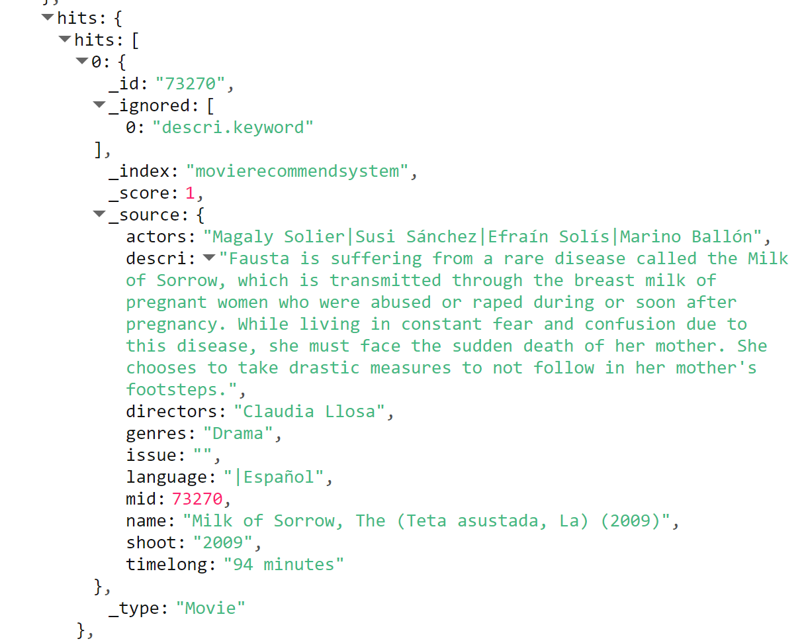

# BusinessServerWeb

## 首页

### 1 轮播图业务层

- 获取近来的热门电影，取前5电影作为轮播图，其他的作为热门电影展示在首页（电影推荐业务层）,得到电影mid和分数的集合

```java
/**
 * @Author LinRuShao
 * @Date 2022/10/22 15:26
 */
@Service
public class HomeHotRecommendationsService {
    @Autowired
    private MongoClient mongoClient;

    /**
     * 获取热门电影（热门推荐）
     * @return
     */
    public List<Recommendation> getHotRecommendations() {
        // 获取热门电影的条目
        MongoCollection<Document> rateMoreMoviesRecentlyCollection = mongoClient.getDatabase(Constant.MONGODB_DATABASE).getCollection(Constant.MONGODB_RATE_MORE_MOVIES_RECENTLY_COLLECTION);
        FindIterable<Document> documents = rateMoreMoviesRecentlyCollection.find().sort(Sorts.descending("yeahmonth")).limit(Constant.REDIS_MOVIE_RATING_QUEUE_SIZE);
        List<Recommendation> recommendations = new ArrayList<>();
        for (Document document : documents) {
            recommendations.add(new Recommendation(document.getInteger("mid"), 0D));
        }
        return recommendations;
    }
}
```

- 根据电影mid和评分的集合中获取推荐电影mid的集合（电影信息业务层）

```java
 /**
     * 获取热门推荐电影
     * @param recommendations
     * @return
     */
    public List<Movie> getRecommendeMovies(List<Recommendation> recommendations){
        List<Integer> ids = new ArrayList<>();
        for (Recommendation rec: recommendations) {
            ids.add(rec.getMid());
        }
        return getMovies(ids);
    }
```

- 根据电影的mid集合获取电影的详细信息

```java
 /**
     * 根据电影的mid查找电影
     * @param mids 电影ID列表
     * @return 电影的信息列表
     */
    public List<Movie> getMovies(List<Integer> mids){
        FindIterable<Document> documents = getMovieCollection().find(Filters.in("mid",mids));
        List<Movie> movies = new ArrayList<>();
        for (Document document: documents) {
            movies.add(documentToMovie(document));
        }
        return movies;
    }
```

- 因为直接查询mongodb集合得到的是一个集合文档，需要将集合文档转换到moive对象。

```java
  /**
     * 集合文档转换为Movie对象
     * @param document
     * @return
     */
    private Movie documentToMovie(Document document){
        Movie movie = null;
        try{
            movie = objectMapper.readValue(JSON.serialize(document),Movie.class);
            Document score = getAverageMoviesScoreCollection().find(Filters.eq("mid",movie.getMid())).first();
            if(null == score || score.isEmpty())
                movie.setScore(0D);
            else
                movie.setScore((Double) score.get("avg",0D));
        }catch (IOException e) {
            e.printStackTrace();
        }
        return movie;
    }
```

### 2 轮播图控制层

```java
 @RequestMapping("/")
    public  String  index(Model model) {
        /**
         * 获取热门推荐
         */
        List<Recommendation> hotRecommendations = recommenderService.getHotRecommendations();
        model.addAttribute("hotMovies", movieService.getRecommendeMovies(hotRecommendations));

        return "index";
    }

```

### 3 轮播图前端展示

- 主要利用boostrap框架搭建前端
- 轮播图的主要实现

```html
<div class="col-sm-9 col-sm-offset-3 col-md-10 col-md-offset-2 main">
	<div id="myCarousel" class="carousel slide" data-ride="carousel">
		<!-- 轮播（Carousel）指标 -->
		<ol class="carousel-indicators">
			<li data-target="#myCarousel" data-slide-to="0" class="active"></li>
			<li data-target="#myCarousel" data-slide-to="1"></li>
			<li data-target="#myCarousel" data-slide-to="2"></li>
			<li data-target="#myCarousel" data-slide-to="3"></li>
			<li data-target="#myCarousel" data-slide-to="4"></li>
		</ol>
		<!-- 轮播（Carousel）项目 -->
		<div class="carousel-inner" >
			<div class="item  active">
				<a th:href="@{'/single/'+${hotMovies.get(0).getMid()}}">
					
				</a>
				<div class="carousel-caption" th:text="${hotMovies.get(0).getName()}">标题 1</div>
			</div>
			<div class="item">
				<a th:href="@{'/single/'+${hotMovies.get(1).getMid()}}">
					
				</a>
				<div class="carousel-caption" th:text="${hotMovies.get(1).getName()}">标题 2</div>
			</div>
			<div class="item">
				<a th:href="@{'/single/'+${hotMovies.get(2).getMid()}}">
					
				</a>
				<div class="carousel-caption" th:text="${hotMovies.get(2).getName()}">标题 1</div>
			</div>
			<div class="item">
				<a th:href="@{'/single/'+${hotMovies.get(3).getMid()}}">
					
				</a>
				<div class="carousel-caption" th:text="${hotMovies.get(3).getName()}">标题 1</div>
			</div>
			<div class="item">
				<a th:href="@{'/single/'+${hotMovies.get(4).getMid()}}">
					
				</a>
				<div class="carousel-caption" th:text="${hotMovies.get(4).getName()}">标题 1</div>
			</div>
		</div>
		<!-- 轮播（Carousel）导航 -->
		<a class="left carousel-control" href="#myCarousel" role="button" data-slide="prev">
			<span class="glyphicon glyphicon-chevron-left" aria-hidden="true"></span>
			<span class="sr-only">Previous</span>
		</a>
		<a class="right carousel-control" href="#myCarousel" role="button" data-slide="next">
			<span class="glyphicon glyphicon-chevron-right" aria-hidden="true"></span>
			<span class="sr-only">Next</span>
		</a>
	</div>
</div>
```

## 实时推荐

### 1 业务层

1. 实时推荐的思想是进行混合推荐

~~~java
public List<Recommendation> getHybridRecommendations(MovieHybridRecommendation request) {
        return findHybridRecommendations(request.getMid(), request.getSum());
 }
~~~

2. 定义混合推荐算法findHybridRecommendations

~~~java
private List<Recommendation> findHybridRecommendations(int productId, int maxItems) {
        List<Recommendation> hybridRecommendations = new ArrayList<>();

        List<Recommendation> cfRecs = findMovieCFRecs(productId, maxItems);
        for (Recommendation recommendation : cfRecs) {
            hybridRecommendations.add(new Recommendation(recommendation.getMid(),
                    recommendation.getScore() * CF_RATING_FACTOR));
        }

        List<Recommendation> cbRecs = findContentBasedMoreLikeThisRecommendations(productId, maxItems);
        for (Recommendation recommendation : cbRecs) {
            hybridRecommendations.add(new Recommendation(recommendation.getMid(), recommendation.getScore() * CB_RATING_FACTOR));
        }

        List<Recommendation> streamRecs = findStreamRecs(productId,maxItems);
        for (Recommendation recommendation : streamRecs) {
            hybridRecommendations.add(new Recommendation(recommendation.getMid(), recommendation.getScore() * SR_RATING_FACTOR));
        }

        Collections.sort(hybridRecommendations, new Comparator<Recommendation>() {
            @Override
            public int compare(Recommendation o1, Recommendation o2) {
                return o1.getScore() > o2.getScore() ? -1 : 1;
            }
        });
        return hybridRecommendations.subList(0, maxItems > hybridRecommendations.size() ? hybridRecommendations.size() : maxItems);
//        return hybridRecommendations.subList(0, hybridRecommendations.size());
    }
~~~

3. 在混合推荐算法中又包括了基于电影的推荐算法findMovieCFRecs , 协同过滤推荐【电影相似性】,返回的是在相似电影下过滤后的电影，就是排除了当前的电影，推荐出和当前电影最相似的电影集合parseRecs

~~~Java
private List<Recommendation> findMovieCFRecs(int mid) {
        MongoCollection<Document> movieRecsCollection = mongoClient.getDatabase(Constant.MONGODB_DATABASE).getCollection(Constant.MONGODB_MOVIE_RECS_COLLECTION);
        Document movieRecs = movieRecsCollection.find(new Document("mid", mid)).first();
        return parseRecs(movieRecs);
    }
~~~

获取相似电影下的过滤后的电影

```java
 private List<Recommendation> parseRecs(Document document) {
        List<Recommendation> recommendations = new ArrayList<>();
        if (null == document || document.isEmpty())
            return recommendations;
        ArrayList<Document> recs = document.get("recs", ArrayList.class);
        for (Document recDoc : recs) {
            recommendations.add(new Recommendation(recDoc.getInteger("mid"), recDoc.getDouble("score")));
        }
        Collections.sort(recommendations, new Comparator<Recommendation>() {
            @Override
            public int compare(Recommendation o1, Recommendation o2) {
                return o1.getScore() > o2.getScore() ? -1 : 1;
            }
        });
        return recommendations.subList(0, recommendations.size());
    }
```

4. 基于内容的推荐findContentBasedMoreLikeThisRecommendations

```java
private List<Recommendation> findContentBasedMoreLikeThisRecommendations(int mid) {
        // 创建搜索请求对象
        SearchRequest request = new SearchRequest(Constant.ELEASTICSEARCH_INDEX);
        // 构建查询的请求体
        SearchSourceBuilder searchBuilder = new SearchSourceBuilder();
        TermQueryBuilder midQuery = QueryBuilders.termQuery("mid", String.valueOf(mid));
        searchBuilder.query(midQuery);
        searchBuilder.timeout(new TimeValue(60, TimeUnit.SECONDS));
        request.source(searchBuilder);
        // 查询匹配
        SearchResponse response = null;
        try {
            response = esClient.search(request, RequestOptions.DEFAULT);
        } catch (IOException e) {
            e.printStackTrace();
        }
        return parseESResponse(response);
    }
```

5. 基于用户推荐findStreamRecs

```java
 List<Recommendation> streamRecs = findStreamRecs(productId);
        for (Recommendation recommendation : streamRecs) {
            hybridRecommendations.add(new Recommendation(recommendation.getMid(), recommendation.getScore() * SR_RATING_FACTOR));
        }
```

```java
    // 用户推荐
    private List<Recommendation> findStreamRecs(int uid){
        MongoCollection<Document> streamRecsCollection = mongoClient.getDatabase(Constant.MONGODB_DATABASE).getCollection(Constant.MONGODB_STREAM_RECS_COLLECTION);
        Document streamRecs = streamRecsCollection.find(new Document("uid", uid)).first();
        return parseRecs(streamRecs);
    }
```


getHits()




### 2 控制层


### 3 前端展示


## 评分最多

## 电影分类

## 最新发布

## 我的评分电影

## 电影单独页面展示

## 前端通用模板或相似组件

### 1 导航栏

```html
<!--顶部菜单-->
<nav class="navbar navbar-inverse navbar-fixed-top" th:fragment="topbar">
	<div class="container-fluid">
		<div class="navbar-header">
			<button type="button" class="navbar-toggle collapsed" data-toggle="collapse" data-target="#navbar"
					aria-expanded="false" aria-controls="navbar">
				<span class="sr-only">Toggle navigation</span>
				<span class="icon-bar"></span>
				<span class="icon-bar"></span>
				<span class="icon-bar"></span>
			</button>
			<a class="navbar-brand" th:href="@{/}">
				<h1></h1>
			</a>
		</div>
		<div id="navbar" class="navbar-collapse collapse">
			<div class="top-search">
				<form  action="/movie/search" class="navbar-form navbar-right">
					<input type="text" class="form-control" name="query" placeholder="Search...">
					<input type="submit" value=" ">
				</form>
			</div>
			<div class="header-top-right">
				<!--<div class="signin">-->
				<ul id="topMenu" class="list-inline pull-right">
					<li><span class="fa fa-user"></span><a style="color: #1a1d1d" id="loginStatus" th:href="@{/login}">登录</a></li>
				</ul>
				<div class="clearfix"></div>
			</div>
		</div>
	</div>
</nav>
<!--右侧导航-->
<div class="col-sm-3 col-md-2 sidebar" id="sidebar">
  <div class="top-navigation">
	  <div class="t-menu">菜单栏</div>
	  <div class="t-img">
		  
	  </div>
	  <div class="clearfix"></div>
  </div>
  <div class="drop-navigation drop-navigation">
	  <ul class="nav nav-sidebar">
		  <li class="nav-link active" th:class="${activeUri=='/'?'nav-link active':'nav-link'}"><a th:href="@{/}" class="home-icon"><span class="glyphicon glyphicon-home"
																		   aria-hidden="true"></span>首页</a></li>
		  <li class="nav-link" th:class="${activeUri=='/realTime'?'nav-link active':'nav-link'}"><a th:href="@{/realTime}" class="user-icon"><span class="glyphicon glyphicon-home glyphicon-blackboard"
															  aria-hidden="true"></span>实时推荐</a></li>
		  <li class="nav-link" th:class="${activeUri=='/morescoremovie'?'nav-link active':'nav-link'}"><a th:href="@{/morescoremovie}" class="sub-icon"><span class="glyphicon glyphicon-home glyphicon-hourglass"
															   aria-hidden="true"></span>评分最多</a></li>
		  <li><a href="#" class="menu1"><span class="glyphicon glyphicon-film" aria-hidden="true"></span>电影分类<span
				  class="glyphicon glyphicon-menu-down" aria-hidden="true"></span></a></li>
			  <ul class="cl-effect-2">
				  <li class="nav-link" th:class="${activeUri=='/genres/Action/Action'?'nav-link active':'nav-link'}"><a th:href="@{/genres/Action/Action}">动作片</a></li>
				  <li class="nav-link" th:class="${activeUri=='/genres/Adventure/Adventure'?'nav-link active':'nav-link'}"><a th:href="@{/genres/Adventure/Adventure}">冒险片</a></li>
				  <li class="nav-link" th:class="${activeUri=='/genres/Animation/Animation'?'nav-link active':'nav-link'}"><a th:href="@{/genres/Animation/Animation}">动画片</a></li>
				  <li class="nav-link" th:class="${activeUri=='/genres/Comedy/Comedy'?'nav-link active':'nav-link'}"><a th:href="@{/genres/Comedy/Comedy}">喜剧片</a></li>
				  <li class="nav-link" th:class="${activeUri=='/genres/Crime/Crime'?'nav-link active':'nav-link'}"><a th:href="@{/genres/Crime/Crime}">犯罪片</a></li>
				  <li class="nav-link" th:class="${activeUri=='/genres/Documentary/Documentary'?'nav-link active':'nav-link'}"><a th:href="@{/genres/Documentary/Documentary}">纪录片</a></li>
			  </ul>
			  <!-- script-for-menu -->
			  <script>
				  $("li a.menu1").click(function () {
					  $("ul.cl-effect-2").slideToggle(300, function () {
						  // Animation complete.
					  });
				  });
			  </script>
		  <li class="nav-link" th:class="${activeUri=='/newmovie'?'nav-link active':'nav-link'}"><a th:href="@{/newmovie}" class="menu"><span class="glyphicon glyphicon-film glyphicon-king"
											 aria-hidden="true"></span>最新发布<span></span></a></li>
		  <li class="nav-link" th:class="${activeUri=='/user/myrate'?'nav-link active':'nav-link'}"><a th:href="@{/user/myrate}" class="news-icon"><span class="glyphicon glyphicon-envelope"
															 aria-hidden="true"></span>我的评分电影</a></li>
	  </ul>
	  <!-- script-for-menu -->
	  <script>
		  $(".top-navigation").click(function () {
			  $(".drop-navigation").slideToggle(300, function () {
				  // Animation complete.
			  });
		  });
	  </script>
	  <div class="side-bottom">
		  <div class="side-bottom-icons">
			  <ul class="nav2">
				  <li><a href="#" class="facebook"> </a></li>
				  <li><a href="#" class="facebook twitter"> </a></li>
				  <li><a href="#" class="facebook chrome"> </a></li>
				  <li><a href="#" class="facebook dribbble"> </a></li>
			  </ul>
		  </div>
		  <div class="copyright">
			  <p>Copyright &copy; 2015.Company name All rights reserved.More Templates - Collect from <a
					  href="http://www.zixuephp.cn/" title="模板在线" target="_blank">linrushao</a> <a
					  href="http://www.itaotmall.com" target="_blank">自学java</a></p>
		  </div>
	  </div>
  </div>
</div>
```

### 2 底部

```html
<div class="contact-w3ls" id="contact" th:fragment="footer">
    <div class="footer-w3lagile-inner">
        <div class="footer-grids w3-agileits">
            <div class="col-md-2 footer-grid">
                <h4>版本发布</h4>
                <ul>
                    <li><a href="#" title="Release 2016">2022</a></li>
                    <li><a href="#" title="Release 2015">2021</a></li>
                    <li><a href="#" title="Release 2014">2020</a></li>
                    <li><a href="#" title="Release 2013">2019</a></li>
                    <li><a href="#" title="Release 2012">2018</a></li>
                </ul>
            </div>
            <div class="col-md-2 footer-grid">
                <h4>平台服务</h4>
                <ul>
                    <li><a href="genre.html">用户注册</a></li>
                    <li><a href="comedy.html">电影推荐</a></li>
                    <li><a href="series.html">电影展示</a></li>
                    <li><a href="series.html">电影算法</a></li>
                    <li><a href="genre.html">电影评分</a></li>
                </ul>
            </div>
            <div class="col-md-2 footer-grid">
                <h4>加入我们</h4>
                <ul>
                    <li><a href="#">最快速</a></li>
                    <li><a href="#">最准时</a></li>
                    <li><a href="#">最好</a></li>
                </ul>
            </div>
            <div class="col-md-2 footer-grid">
                <h4>帮助中心</h4>
                <ul>
                    <li><a href="#">项目介绍</a></li>
                    <li><a href="#">项目技术</a></li>
                    <li><a href="#">项目流程</a></li>
                </ul>
            </div>
            <div class="col-md-2 footer-grid">
                <h4>联系我们</h4>
                <form action="#" class="subscribe-form">
                    <input type="text" placeholder="Email Address">
                </form>
            </div>
            <div class="clearfix"> </div>
            <ul class="bottom-links-agile">
                <li><a href="icons.html" title="Font Icons">Icons</a></li>
                <li><a href="short-codes.html" title="Short Codes">Short Codes</a></li>
                <li><a href="contact.html" title="contact">Contact</a></li>
            </ul>
        </div>
    </div>
</div>
```


### 3 星星评分

```html
<div class="zidingyi3 block-stars">
	<ul class="w3l-ratings" th:if="${hot.getScore()} lt '0.5'">
		<li><a href="#"><i class="fa fa-star-o" aria-hidden="true"></i></a></li>
		<li><a href="#"><i class="fa fa-star-o" aria-hidden="true"></i></a></li>
		<li><a href="#"><i class="fa fa-star-o" aria-hidden="true"></i></a></li>
		<li><a href="#"><i class="fa fa-star-o" aria-hidden="true"></i></a></li>
		<li><a href="#"><i class="fa fa-star-o" aria-hidden="true"></i></a></li>
	</ul>
	<ul class="w3l-ratings" th:if="(${hot.getScore()} ge '0.5') and (${hot.getScore()} lt '1')">
		<li><a href="#"><i class="fa fa-star-half-o" aria-hidden="true"></i></a></li>
		<li><a href="#"><i class="fa fa-star-o" aria-hidden="true"></i></a></li>
		<li><a href="#"><i class="fa fa-star-o" aria-hidden="true"></i></a></li>
		<li><a href="#"><i class="fa fa-star-o" aria-hidden="true"></i></a></li>
		<li><a href="#"><i class="fa fa-star-o" aria-hidden="true"></i></a></li>
	</ul>
	<ul class="w3l-ratings" th:if="(${hot.getScore()} ge '1') and (${hot.getScore()} lt '1.5')">
		<li><a href="#"><i class="fa fa-star" aria-hidden="true"></i></a></li>
		<li><a href="#"><i class="fa fa-star-o" aria-hidden="true"></i></a></li>
		<li><a href="#"><i class="fa fa-star-o" aria-hidden="true"></i></a></li>
		<li><a href="#"><i class="fa fa-star-o" aria-hidden="true"></i></a></li>
		<li><a href="#"><i class="fa fa-star-o" aria-hidden="true"></i></a></li>
	</ul>
	<ul class="w3l-ratings" th:if="(${hot.getScore()} ge '1.5') and (${hot.getScore()} lt '2')">
		<li><a href="#"><i class="fa fa-star" aria-hidden="true"></i></a></li>
		<li><a href="#"><i class="fa fa-star-half-o" aria-hidden="true"></i></a></li>
		<li><a href="#"><i class="fa fa-star-o" aria-hidden="true"></i></a></li>
		<li><a href="#"><i class="fa fa-star-o" aria-hidden="true"></i></a></li>
		<li><a href="#"><i class="fa fa-star-o" aria-hidden="true"></i></a></li>
	</ul>
	<ul class="w3l-ratings" th:if="${hot.getScore()} ge '2' and ${hot.getScore()} lt '2.5'">
		<li><a href="#"><i class="fa fa-star" aria-hidden="true"></i></a></li>
		<li><a href="#"><i class="fa fa-star" aria-hidden="true"></i></a></li>
		<li><a href="#"><i class="fa fa-star-o" aria-hidden="true"></i></a></li>
		<li><a href="#"><i class="fa fa-star-o" aria-hidden="true"></i></a></li>
		<li><a href="#"><i class="fa fa-star-o" aria-hidden="true"></i></a></li>
	</ul>
	<ul class="w3l-ratings" th:if="${hot.getScore()} ge '2.5' and ${hot.getScore()} lt '3'">
		<li><a href="#"><i class="fa fa-star" aria-hidden="true"></i></a></li>
		<li><a href="#"><i class="fa fa-star" aria-hidden="true"></i></a></li>
		<li><a href="#"><i class="fa fa-star-half-o" aria-hidden="true"></i></a></li>
		<li><a href="#"><i class="fa fa-star-o" aria-hidden="true"></i></a></li>
		<li><a href="#"><i class="fa fa-star-o" aria-hidden="true"></i></a></li>
	</ul>
	<ul class="w3l-ratings" th:if="${hot.getScore()} ge '3' and ${hot.getScore()} lt '3.5'">
		<li><a href="#"><i class="fa fa-star" aria-hidden="true"></i></a></li>
		<li><a href="#"><i class="fa fa-star" aria-hidden="true"></i></a></li>
		<li><a href="#"><i class="fa fa-star" aria-hidden="true"></i></a></li>
		<li><a href="#"><i class="fa fa-star-o" aria-hidden="true"></i></a></li>
		<li><a href="#"><i class="fa fa-star-o" aria-hidden="true"></i></a></li>
	</ul>
	<ul class="w3l-ratings" th:if="${hot.getScore()} ge '3.5' and ${hot.getScore()} lt '4'">
		<li><a href="#"><i class="fa fa-star" aria-hidden="true"></i></a></li>
		<li><a href="#"><i class="fa fa-star" aria-hidden="true"></i></a></li>
		<li><a href="#"><i class="fa fa-star" aria-hidden="true"></i></a></li>
		<li><a href="#"><i class="fa fa-star-half-o" aria-hidden="true"></i></a></li>			<li><a href="#"><i class="fa fa-star-o" aria-hidden="true"></i></a></li>
	</ul>
	<ul class="w3l-ratings" th:if="${hot.getScore()} ge '4' and ${hot.getScore()} lt '4.5'">
		<li><a href="#"><i class="fa fa-star" aria-hidden="true"></i></a></li>
		<li><a href="#"><i class="fa fa-star" aria-hidden="true"></i></a></li>
		<li><a href="#"><i class="fa fa-star" aria-hidden="true"></i></a></li>
		<li><a href="#"><i class="fa fa-star" aria-hidden="true"></i></a></li>
		<li><a href="#"><i class="fa fa-star-o" aria-hidden="true"></i></a></li>
	</ul>			
    <ul class="w3l-ratings" th:if="${hot.getScore()} ge '4.5' and ${hot.getScore()} lt '5'">
		<li><a href="#"><i class="fa fa-star" aria-hidden="true"></i></a></li>
		<li><a href="#"><i class="fa fa-star" aria-hidden="true"></i></a></li>
		<li><a href="#"><i class="fa fa-star" aria-hidden="true"></i></a></li>
		<li><a href="#"><i class="fa fa-star" aria-hidden="true"></i></a></li>
		<li><a href="#"><i class="fa fa-star-half-o" aria-hidden="true"></i></a></li>
	</ul>
	<ul class="w3l-ratings" th:if="${hot.getScore()} ge '5' ">
		<li><a href="#"><i class="fa fa-star" aria-hidden="true"></i></a></li>
		<li><a href="#"><i class="fa fa-star" aria-hidden="true"></i></a></li>
		<li><a href="#"><i class="fa fa-star" aria-hidden="true"></i></a></li>
		<li><a href="#"><i class="fa fa-star" aria-hidden="true"></i></a></li>
		<li><a href="#"><i class="fa fa-star" aria-hidden="true"></i></a></li>
	</ul>
</div>
```

