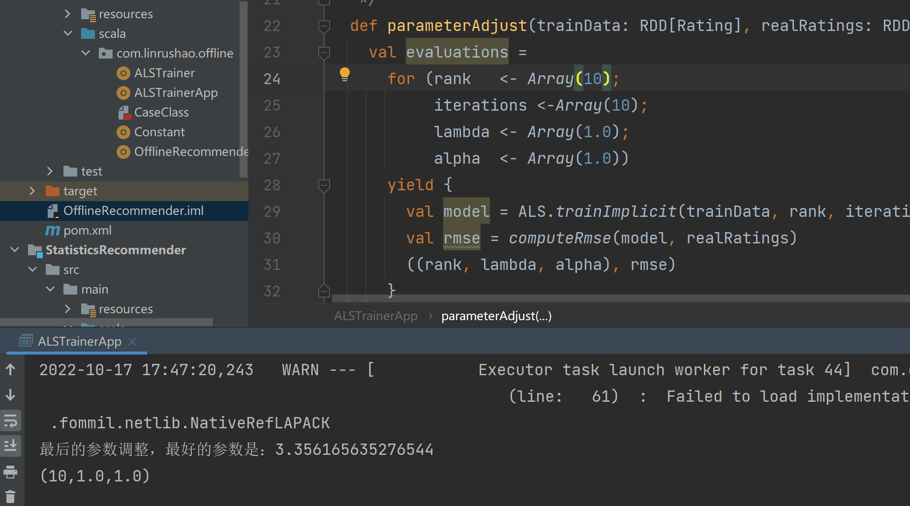

## OfflineRecommender

### 1 依赖引入

Scala、Spark、Mongodb

```xml
<?xml version="1.0" encoding="UTF-8"?>
<project xmlns="http://maven.apache.org/POM/4.0.0"
         xmlns:xsi="http://www.w3.org/2001/XMLSchema-instance"
         xsi:schemaLocation="http://maven.apache.org/POM/4.0.0 http://maven.apache.org/xsd/maven-4.0.0.xsd">
    <parent>
        <artifactId>recommender</artifactId>
        <groupId>org.example</groupId>
        <version>1.0-SNAPSHOT</version>
    </parent>
    <modelVersion>4.0.0</modelVersion>

    <artifactId>OfflineRecommender</artifactId>

    <properties>
        <maven.compiler.source>8</maven.compiler.source>
        <maven.compiler.target>8</maven.compiler.target>
        <mongodb-spark.version>2.4.1</mongodb-spark.version>
        <casbah.version>3.1.1</casbah.version>
    </properties>

    <dependencies>
        <!--mongodb-->
        <dependency>
            <groupId>org.mongodb.spark</groupId>
            <artifactId>mongo-spark-connector_2.12</artifactId>
            <version>${mongodb-spark.version}</version>
        </dependency>
        <dependency>
            <groupId>org.mongodb</groupId>
            <artifactId>casbah-core_2.12</artifactId>
            <version>${casbah.version}</version>
        </dependency>
        <dependency>
            <groupId>org.scalanlp</groupId>
            <artifactId>jblas</artifactId>
            <version>${jblas.version}</version>
        </dependency>
        <!-- Spark 的依赖引入 -->
        <dependency>
            <groupId>org.apache.spark</groupId>
            <artifactId>spark-core_2.12</artifactId>
        </dependency>
        <dependency>
            <groupId>org.apache.spark</groupId>
            <artifactId>spark-sql_2.12</artifactId>
        </dependency>
            <dependency>
                <groupId>org.apache.spark</groupId>
                <artifactId>spark-mllib_2.12</artifactId>
                <version>${spark.version}</version>
            </dependency>
        <!-- 引入 Scala -->
        <dependency>
            <groupId>org.scala-lang</groupId>
            <artifactId>scala-library</artifactId>
        </dependency>
    </dependencies>

</project>
```

### 2 样例类

```scala
package com.linrushao.offline

/**
 * @Author LRS
 * @Date 2022/9/13 16:29
 *       Desc
 */
/**
 * Movie数据集，数据集字段通过分割
 * 151^                          电影的ID
 * Rob Roy (1995)^               电影的名称
 * In the highlands ....^        电影的描述
 * 139 minutes^                  电影的时长
 * August 26, 1997^              电影的发行日期
 * 1995^                         电影的拍摄日期
 * English ^                     电影的语言
 * Action|Drama|Romance|War ^    电影的类型
 * Liam Neeson|Jessica Lange...  电影的演员
 * Michael Caton-Jones           电影的导演
 * tag1|tag2|tag3|....           电影的Tag
 **/

case class Movie( mid: Int,  name: String,  descri: String, 
                 timelong: String,  issue: String,
                 shoot: String,  language: String,  
                 genres: String,  actors: String,  directors: String)

/**
 * Rating数据集，用户对于电影的评分数据集，用，分割
 *
 * 1,           用户的ID
 * 31,          电影的ID
 * 2.5,         用户对于电影的评分
 * 1260759144   用户对于电影评分的时间
 */
/**
 *  基于LFM的离线推荐模块
 * @param uid
 * @param mid
 * @param score
 * @param timestamp
 */
case class MovieRating( uid: Int,  mid: Int,  score: Double,  timestamp: Int)

/**
 * 推荐项目
 * @param rid  项目ID
 * @param r    推荐分数
 */
case class Recommendation(mid: Int, score: Double)

/**
 * 电影相似推荐
 * @param mid 电影ID
 * @param recs 相似的电影集合
 */
case class MovieRecommendation(mid: Int, recs: Seq[Recommendation])

/**
 * 用户的电影推荐
 * @param uid 用户ID
 * @param recs 用户的推荐电影集合
 */
case class UserRecommendation(uid: Int, recs: Seq[Recommendation])

//mongodb数据库连接配置
case class MongoConfig(uri:String, db:String)

// 定义基于预测评分的用户推荐列表
case class UserRecs( uid: Int, recs: Seq[Recommendation] )

// 定义基于LFM电影特征向量的电影相似度列表
case class MovieRecs( mid: Int, recs: Seq[Recommendation] )
```

### 3 常量定义

```scala
object Constant {
  /**************加载数据表的表名******************/
  val RATING_COLLECTION_NAME = "Rating"
  val MOVIES_COLLECTION_NAME = "Movie"

  /**************统计的表的名称******************/
  val USER_RECS_COLLECTION_NAME = "UserRecs"
  val MOVIE_RECS_COLLECTION_NAME = "MovieRecs"

  /**************电影的最多推荐数目******************/
  val MAX_RATING = 5.0F
  val MAX_RECOMMENDATIONS = 100
}
```

### 4 推荐模型

#### 基于用户推荐

- 我们使用的推荐模型是基于评分推荐，先导入评分数据集合，去除时间项

- 在评分数据集中导出用户数据，一个用户可以为对多个电影评分，所以需要将用户数据进行去重处理

- 在用户推荐中需要利用==笛卡尔积==，把用户与每一个电影交叉连接起来，预测出一个用户对所有电影的评分数据，对数据进行两两比较然后进行排序取前n条数据作为该用户的推荐数据

  ```scala
  
      /**
       * 交叉连接（笛卡尔积）
       */
      val userProductsJoin = users.crossJoin(products)
  
      val userRating = userProductsJoin.map { row => (row.getAs[Int](0), row.getAs[Int](1)) }.rdd
  
      object RatingOrder extends Ordering[Rating] {
        def compare(x: Rating, y: Rating) = y.rating compare x.rating
      }
  
      val recommendations = model.predict(userRating)
        .filter(_.rating > 0)
        .groupBy(p => p.user)
        .map { case (uid, predictions) =>
          val recommendations = predictions.toSeq.sorted(RatingOrder)
            .take(maxRecs)
            .map(p => Recommendation(p.product, p.rating))
          UserRecommendation(uid, recommendations)
        }.toDF()
  ```

  

#### 基于电影推荐

- 导入电影数据集电影推荐和用户推荐相似，首先电影需要导入电影数据集

- 调用模型的产品矢量（电影的各项因素）

  ```scala
      /**
       * 产品矢量
       */
      val productsVectorRdd = model.productFeatures
        .map { case (movieId, factor) =>
          val factorVector = new DoubleMatrix(factor)
          (movieId, factorVector)
        }
  ```

- 对电影进行笛卡尔积计算（计算产品的余弦相似度）

  ```scala
  val movieRecommendation = productsVectorRdd.cartesian(productsVectorRdd)
        .filter {
          case ((movieId1, vector1), (movieId2, vector2))
          => movieId1 != movieId2
        }.map {
          case ((movieId1, vector1), (movieId2, vector2))
            //计算余弦相似度
          => val sim = cosineSimilarity(vector1, vector2)
          (movieId1, movieId2, sim)
       }.filter(_._3 >= minSimilarity)
        .groupBy(p => p._1)
        .map { case (mid: Int, predictions: Iterable[(Int, Int, Double)]) =>
          val recommendations = predictions.toSeq.sorted(RatingOrder)
            .take(maxRecs)
            .map(p => Recommendation(p._2, p._3.toDouble))
          MovieRecommendation(mid, recommendations)
        }.toDF()
  ```

#### 整体代码

```scala
package com.linrushao.offline

import com.linrushao.offline.Constant.{MOVIES_COLLECTION_NAME, MOVIE_RECS_COLLECTION_NAME, RATING_COLLECTION_NAME, USER_RECS_COLLECTION_NAME}
import com.mongodb.casbah.Imports.MongoClientURI
import com.mongodb.casbah.MongoClient
import com.mongodb.casbah.commons.MongoDBObject
import org.apache.spark.SparkConf
import org.apache.spark.mllib.recommendation.{ALS, MatrixFactorizationModel, Rating}
import org.apache.spark.sql.{Dataset, SparkSession}
import org.jblas.DoubleMatrix

/**
 * @Author LRS
 * @Date 2022/9/10 16:02
 *       Desc ALS模型推荐
 */
object ALSTrainer extends Serializable {
  /**
   * 计算推荐数据
   *
   * @param maxRecs
   * @param _conf
   * @param mongoConf
   */
  def calculateRecs(maxRecs: Int)(implicit _conf: SparkConf, mongoConf: MongoConfig): Unit = {
      
    /**
     * 创建一个sparkSession
     */
    val spark = SparkSession.builder()
      .config(_conf)
      .getOrCreate()

    import spark.implicits._

    /**
     * 加载评分数据集合并去除时间项
     */
    val ratings = spark.read
      .option("uri", mongoConf.uri)
      .option("collection", RATING_COLLECTION_NAME)
      .format("com.mongodb.spark.sql")
      .load()
      .select($"mid", $"uid", $"score")
      .cache

    /**
     * 评分集合中的用户数据，做去重处理
     */
    val users = ratings
      .select($"uid")
      .distinct
      .map(r => r.getAs[Int]("uid"))
      .cache

    /**
     * 加载电影集合
     */
    val movies = spark.read
      .option("uri", mongoConf.uri)
      .option("collection", MOVIES_COLLECTION_NAME)
      .format("com.mongodb.spark.sql")
      .load()
      .select($"mid")
      .distinct
      .map(r => r.getAs[Int]("mid"))
      .cache

    /**
     * 训练集
     */
    val trainData = ratings.map { line =>
      Rating(line.getAs[Int]("uid"), line.getAs[Int]("mid"), line.getAs[Double]("score"))
    }.rdd.cache()

    /**
     * 机器模型参数
     * train方法源码：
     *ratings    RDD of [[Rating]] objects with userID, productID, and rating
     *rank  number of features to use (also referred to as the number of latent factors)
     *iterations number of iterations of ALS
     *lambda     regularization parameter
     */
    val (rank, iterations, lambda) = (50, 5, 0.01)
    val model = ALS.train(trainData, rank, iterations, lambda)

    implicit val mongoClient = MongoClient(MongoClientURI(mongoConf.uri))

    /**
     * 基于用户推荐
     */
    calculateUserRecs(maxRecs, model, users, movies)

    /**
     * 基于电影推荐
     */
    calculateProductRecs(maxRecs, model, movies)

    mongoClient.close()

    spark.close()
  }


  /**
   * 计算为用户推荐的电影集合矩阵 RDD[UserRecommendation(id: Int, recs: Seq[Rating])]
   *
   * @param maxRecs 最大的推荐数目
   * @param model 模型
   * @param users 用户数据集
   * @param products 产品数据集（电影数据集）
   * @param mongoConf mongodb数据库配置
   * @param mongoClient  mongodb数据库客户端
   */
  private def calculateUserRecs(maxRecs: Int,
                                model: MatrixFactorizationModel,
                                users: Dataset[Int],
                                products: Dataset[Int])
    (implicit mongoConf: MongoConfig, mongoClient: MongoClient): Unit = {

    import users.sparkSession.implicits._

    /**
     * 交叉连接（笛卡尔积）
     */
    val userProductsJoin = users.crossJoin(products)

    val userRating = userProductsJoin.map { 
        row => (row.getAs[Int](0), row.getAs[Int](1)) }.rdd

    object RatingOrder extends Ordering[Rating] {
      def compare(x: Rating, y: Rating) = y.rating compare x.rating
    }

    val recommendations = model.predict(userRating)
      .filter(_.rating > 0)
      .groupBy(p => p.user)
      .map { case (uid, predictions) =>
        val recommendations = predictions.toSeq.sorted(RatingOrder)
          .take(maxRecs)
          .map(p => Recommendation(p.product, p.rating))
        UserRecommendation(uid, recommendations)
      }.toDF()

    /**
     * 保存数据之前先判断删除原先的数据库集合
     */
    mongoClient(mongoConf.db)(USER_RECS_COLLECTION_NAME).dropCollection()

    /**
     * 保存数据到mongodb中
     */
    recommendations
      .write
      .option("uri", mongoConf.uri)
      .option("collection", USER_RECS_COLLECTION_NAME)
      .mode("overwrite")
      .format("com.mongodb.spark.sql")
      .save
    //这是下标由1开始
    mongoClient(mongoConf.db)(USER_RECS_COLLECTION_NAME)
        .createIndex(MongoDBObject("uid" -> 1))
  }

  /**
   * 基于电影的推荐，电影推荐矩阵
   * @param maxRecs 最大推荐数目
   * @param model ALS模型
   * @param products 产品推荐（movie）
   * @param mongoConf 数据库配置
   * @param mongoClient mongodb数据库客户端
   */
  private def calculateProductRecs(maxRecs: Int, model: MatrixFactorizationModel,
                                   products: Dataset[Int])
    (implicit mongoConf: MongoConfig, mongoClient: MongoClient): Unit = {

    import products.sparkSession.implicits._

    object RatingOrder extends Ordering[(Int, Int, Double)] {
      def compare(x: (Int, Int, Double), y: (Int, Int, Double)) = y._3 compare x._3
    }

    /**
     * 产品矢量
     */
    val productsVectorRdd = model.productFeatures
      .map { case (movieId, factor) =>
        val factorVector = new DoubleMatrix(factor)
        (movieId, factorVector)
      }

    /**
     * 最小相似度（大于06的）太小的说明两者相似度很低
     */
    val minSimilarity = 0.6

    /**
     * cartesian 笛卡尔积
     */
    val movieRecommendation = productsVectorRdd.cartesian(productsVectorRdd)
      .filter {
        case ((movieId1, vector1), (movieId2, vector2))
        => movieId1 != movieId2
      }.map {
        case ((movieId1, vector1), (movieId2, vector2))
          //计算余弦相似度
        => val sim = cosineSimilarity(vector1, vector2)
        (movieId1, movieId2, sim)
     }.filter(_._3 >= minSimilarity)
      .groupBy(p => p._1)
      .map { case (mid: Int, predictions: Iterable[(Int, Int, Double)]) =>
        val recommendations = predictions.toSeq.sorted(RatingOrder)
          .take(maxRecs)
          .map(p => Recommendation(p._2, p._3.toDouble))
        MovieRecommendation(mid, recommendations)
      }.toDF()

    /**
     * 保存数据之前先判断删除原先的数据库集合
     */
    mongoClient(mongoConf.db)(MOVIE_RECS_COLLECTION_NAME).dropCollection()
    /**
     * 保存数据到mongodb中
     */
    movieRecommendation.write
      .option("uri", mongoConf.uri)
      .option("collection", MOVIE_RECS_COLLECTION_NAME)
      .mode("overwrite")
      .format("com.mongodb.spark.sql")
      .save
    //这是下标由1开始
    mongoClient(mongoConf.db)(MOVIE_RECS_COLLECTION_NAME)
        .createIndex(MongoDBObject("mid" -> 1))
  }

  /**
   * 余弦相似度（计算两个产品之间的距离）
   * @param vec1
   * @param vec2
   * @return
   */
  private def cosineSimilarity(vec1: DoubleMatrix, vec2: DoubleMatrix): Double = {
    vec1.dot(vec2) / (vec1.norm2() * vec2.norm2())
  }
}
```

### 5 主函数

```scala
package com.linrushao.offline


import com.linrushao.offline.Constant.MAX_RECOMMENDATIONS
import org.apache.spark.SparkConf

/**
 * @Author LRS
 * @Date 2022/9/10 14:48
 *       Desc 主函数运行，可以在集群运行，需要修改params += "spark.cores" -> "local[*]"
 *                         为params += "spark.cores" -> "spark://hadoop201:7077"
 *                                        其中hadoop201这是我的主机名
 */

/**
 * 继承App
 * 源码
 * Here, object `Main` inherits the `main` method of `App`.
 * 就是说继承了main方法，可以直接运行该项目
 */
object OfflineRecommender extends App {

  val params = scala.collection.mutable.Map[String, Any]()
  params += "spark.cores" -> "local[*]"
  params += "mongo.uri" -> "mongodb://hadoop201:27017/movierecommendsystem"
  params += "mongo.db" -> "movierecommendsystem"
  params += "maxRecommendations" -> MAX_RECOMMENDATIONS.toString

  implicit val conf = new SparkConf()
    .setAppName("OfflineRecommender")
    .setMaster(params("spark.cores").asInstanceOf[String])
    .set("spark.executor.memory", "6G")

  implicit val mongoConf = new MongoConfig(params("mongo.uri").asInstanceOf[String], params("mongo.db").asInstanceOf[String])

  val maxRecommendations = params("maxRecommendations").asInstanceOf[String].toInt
  //计算推荐
  ALSTrainer.calculateRecs(maxRecommendations)
}
```

集群运行命令

```shell
  bin/spark-submit
 --master spark://hadoop201:7077
 --class com.linrushao.offline.OfflineRecommender
 --jars /opt/module/spark-standalone/jars/jblas-1.2.4-SNAPSHOT.jar
 --packages org.mongodb.spark:mongo-spark-connector_2.12:2.4.1
/opt/module/spark-standalone/test/OfflineRecommender-1.0-SNAPSHOT.jar
```


需要mongodb 的 scala 驱动 -> casbah,还需要加入三个jar包，关于mongodb的连接

```shell
./spark-submit  --master spark://hadoop201:7077 --class com.linrushao.offline.OfflineRecommender  --packages org.mongodb.spark:mongo-spark-connector_2.12:2.4.1  --jars /opt/module/spark-standalone/jars/jblas-1.2.4-SNAPSHOT.jar,/opt/module/spark-standalone/jars/casbah-core_2.12-3.1.1.jar,/opt/module/spark-standalone/jars/mongo-java-driver-3.12.10.jar,/opt/module/spark-standalone/jars/mongo-hadoop-core-2.0.0.jar,/opt/module/spark-standalone/jars/casbah-commons_2.12-3.1.1.jar,/opt/module/spark-standalone/jars/casbah-query_2.12-3.1.1.jar  /opt/module/spark-standalone/test/OfflineRecommender-1.0-SNAPSHOT.jar 

```


### 6 参数调试

数据量太大，运行一直报关于内容的错误（栈溢出，jvm内存不足等）

```scala
package com.linrushao.offline

import breeze.numerics.sqrt
import com.linrushao.offline.Constant.{MOVIES_COLLECTION_NAME, RATING_COLLECTION_NAME}
import org.apache.spark.SparkConf
import org.apache.spark.mllib.recommendation.{ALS, MatrixFactorizationModel, Rating}
import org.apache.spark.rdd.RDD
import org.apache.spark.sql.SparkSession

/**
 * @Author LRS
 * @Date 2022/10/17 8:40
 *       Desc ALS模型参数选取
 */
object ALSTrainerApp extends App {
  /**
   * 其中 adjustALSParams 方法是模型评估的核心，输入一组训练数据和测试数据，
   * 输出计算得到最小 RMSE 的那组参数。
   * @param trainData 训练集
   * @param realRatings 真实集（测试集）
   */
  def parameterAdjust(trainData: RDD[Rating], realRatings: RDD[Rating]): (Int, Double, Double) = {
    val evaluations =
      for (rank   <- Array(10,30,50);
           iterations <-Array(10,50,70,80,100);
           lambda <- Array(1.0, 0.001, 0.0001);
           alpha  <- Array(1.0, 40.0))
      yield {
        val model = ALS.trainImplicit(trainData, rank, iterations, lambda, alpha)
        val rmse = computeRmse(model, realRatings)
        ((rank, lambda, alpha), rmse)
      }
    val ((rank, lambda, alpha), rmse) = evaluations.sortBy(_._2).head
    println("最后的参数调整，最好的参数是：" + rmse)
    (rank, lambda, alpha)
  }

  def computeRmse(model: MatrixFactorizationModel, realRatings: RDD[Rating]): Double = {
    val testingData = realRatings.map{ case Rating(user, product, rate) =>
      (user, product)
    }

    val prediction = model.predict(testingData).map{ case Rating(user, product, rate) =>
      ((user, product), rate)
    }

    val realPredict = realRatings.map{case Rating(user, product, rate) =>
      ((user, product), rate)
    }.join(prediction)

    sqrt(realPredict.map{ case ((user, product), (rate1, rate2)) =>
      val err = rate1 - rate2
      err * err
    }.mean())//mean = sum(list) / len(list)
  }


  val params = scala.collection.mutable.Map[String, Any]()
  params += "spark.cores" -> "local[*]"
  params += "mongo.uri" -> "mongodb://hadoop201:27017/movierecommendsystem"
  params += "mongo.db" -> "movierecommendsystem"

  val mongoConf = new MongoConfig(params("mongo.uri").asInstanceOf[String], params("mongo.db").asInstanceOf[String])

  val conf = new SparkConf().setAppName("ALSTrainerApp").setMaster(params("spark.cores").asInstanceOf[String]).set("spark.executor.memory","6G")

  val spark = SparkSession.builder()
    .config(conf)
    .getOrCreate()

  import spark.implicits._

  val ratings = spark.read
    .option("uri", mongoConf.uri)
    .option("collection", RATING_COLLECTION_NAME)
    .format("com.mongodb.spark.sql")
    .load()
    .select($"mid",$"uid",$"score")
    .cache

  val users = ratings
    .select($"uid")
    .distinct
    .map(r => r.getAs[Int]("uid"))
    .cache

  val movies = spark.read
    .option("uri", mongoConf.uri)
    .option("collection", MOVIES_COLLECTION_NAME)
    .format("com.mongodb.spark.sql")
    .load()
    .select($"mid")
    .distinct
    .map(r => r.getAs[Int]("mid"))
    .cache

  val trainData = ratings.map{ line =>
    Rating(line.getAs[Int]("uid"), line.getAs[Int]("mid"), line.getAs[Double]("score"))
  }.rdd.cache()

  println(parameterAdjust(trainData,trainData))

  spark.stop()
}
```

运行不起来



### 7 异常处理

    com.mongodb.MongoSocketReadException: Prematurely reached end of stream
原因1：
mongo没有配置空闲连接时间，而spring boot 默认的空闲连接时间为0。当连接闲置一段时间，由于防火墙或者负载均衡的原因，导致连接被关闭，而客户端并不知道，当客户端继续使用这个关闭的连接进行读写时就会出错。

原因2：

mongodb的服务器内存爆了（电脑内存不够），mongodb自动停止了服务，重新开启服务后在正常运行。


解决方法：

在程序中添加代码

```scala
val builder = new MongoClientOptions.Builder()
builder.maxConnectionIdleTime(60000);//set the max wait time in (ms)
val options: MongoClientOptions = builder.build()
```

```
Exception in thread "main" java.lang.NoClassDefFoundError: com/mongodb/casbah/commons/Imports
	at java.lang.ClassLoader.defineClass1(Native Method)
	at java.lang.ClassLoader.defineClass(ClassLoader.java:763)
	at java.security.SecureClassLoader.defineClass(SecureClassLoader.java:142)
	at java.net.URLClassLoader.defineClass(URLClassLoader.java:468)
	at java.net.URLClassLoader.access$100(URLClassLoader.java:74)
	at java.net.URLClassLoader$1.run(URLClassLoader.java:369)
	at java.net.URLClassLoader$1.run(URLClassLoader.java:363)
	at java.security.AccessController.doPrivileged(Native Method)
	at java.net.URLClassLoader.findClass(URLClassLoader.java:362)
	at java.lang.ClassLoader.loadClass(ClassLoader.java:424)
	at sun.misc.Launcher$AppClassLoader.loadClass(Launcher.java:349)
	at java.lang.ClassLoader.loadClass(ClassLoader.java:357)
	at com.mongodb.casbah.MongoClient.apply(MongoClient.scala:218)
	at com.linrushao.offline.ALSTrainer$.calculateUserRecs(ALSTrainer.scala:153)
	at com.linrushao.offline.ALSTrainer$.calculateRecs(ALSTrainer.scala:98)
	at com.linrushao.offline.OfflineRecommender$.delayedEndpoint$com$linrushao$offline$OfflineRecommender$1(OfflineRecommender.scala:46)
	at com.linrushao.offline.OfflineRecommender$delayedInit$body.apply(OfflineRecommender.scala:29)
	at scala.Function0.apply$mcV$sp(Function0.scala:39)
	at scala.Function0.apply$mcV$sp$(Function0.scala:39)
	at scala.runtime.AbstractFunction0.apply$mcV$sp(AbstractFunction0.scala:17)
	at scala.App.$anonfun$main$1$adapted(App.scala:80)
	at scala.collection.immutable.List.foreach(List.scala:392)
	at scala.App.main(App.scala:80)
	at scala.App.main$(App.scala:78)
	at com.linrushao.offline.OfflineRecommender$.main(OfflineRecommender.scala:29)
	at com.linrushao.offline.OfflineRecommender.main(OfflineRecommender.scala)
	at sun.reflect.NativeMethodAccessorImpl.invoke0(Native Method)
	at sun.reflect.NativeMethodAccessorImpl.invoke(NativeMethodAccessorImpl.java:62)
	at sun.reflect.DelegatingMethodAccessorImpl.invoke(DelegatingMethodAccessorImpl.java:43)
	at java.lang.reflect.Method.invoke(Method.java:498)
	at org.apache.spark.deploy.JavaMainApplication.start(SparkApplication.scala:52)
	at org.apache.spark.deploy.SparkSubmit.org$apache$spark$deploy$SparkSubmit$$runMain(SparkSubmit.scala:928)
	at org.apache.spark.deploy.SparkSubmit.doRunMain$1(SparkSubmit.scala:180)
	at org.apache.spark.deploy.SparkSubmit.submit(SparkSubmit.scala:203)
	at org.apache.spark.deploy.SparkSubmit.doSubmit(SparkSubmit.scala:90)
	at org.apache.spark.deploy.SparkSubmit$$anon$2.doSubmit(SparkSubmit.scala:1007)
	at org.apache.spark.deploy.SparkSubmit$.main(SparkSubmit.scala:1016)
	at org.apache.spark.deploy.SparkSubmit.main(SparkSubmit.scala)
Caused by: java.lang.ClassNotFoundException: com.mongodb.casbah.commons.Imports
	at java.net.URLClassLoader.findClass(URLClassLoader.java:382)
	at java.lang.ClassLoader.loadClass(ClassLoader.java:424)
	at sun.misc.Launcher$AppClassLoader.loadClass(Launcher.java:349)
	at java.lang.ClassLoader.loadClass(ClassLoader.java:357)

```

