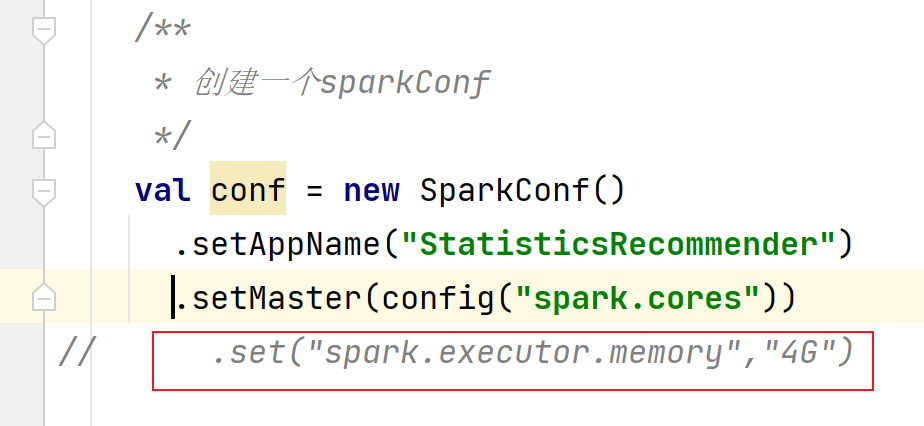
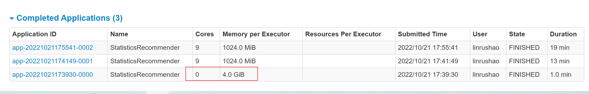
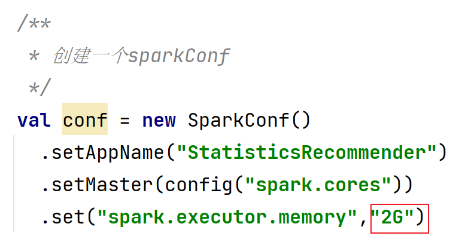

### StaticRecommender

#### 1 项目依赖

包括Scala 、Spark  和 mongodb的依赖

```xml
<?xml version="1.0" encoding="UTF-8"?>
<project xmlns="http://maven.apache.org/POM/4.0.0"
         xmlns:xsi="http://www.w3.org/2001/XMLSchema-instance"
         xsi:schemaLocation="http://maven.apache.org/POM/4.0.0 http://maven.apache.org/xsd/maven-4.0.0.xsd">
    <parent>
        <artifactId>recommender</artifactId>
        <groupId>org.example</groupId>
        <version>1.0-SNAPSHOT</version>
    </parent>
    <modelVersion>4.0.0</modelVersion>
    <artifactId>StatisticsRecommender</artifactId>
    <properties>
        <maven.compiler.source>8</maven.compiler.source>
        <maven.compiler.target>8</maven.compiler.target>
        <mongodb-spark.version>2.4.1</mongodb-spark.version>
        <casbah.version>3.1.1</casbah.version>
    </properties>

    <dependencies>
        <!--mongodb-->
        <dependency>
            <groupId>org.mongodb.spark</groupId>
            <artifactId>mongo-spark-connector_2.12</artifactId>
            <version>${mongodb-spark.version}</version>
        </dependency>
        <dependency>
            <groupId>org.mongodb</groupId>
            <artifactId>casbah-core_2.12</artifactId>
            <version>${casbah.version}</version>
        </dependency>
        <!-- Spark 的依赖引入 -->
        <dependency>
            <groupId>org.apache.spark</groupId>
            <artifactId>spark-core_2.12</artifactId>
        </dependency>
        <dependency>
            <groupId>org.apache.spark</groupId>
            <artifactId>spark-sql_2.12</artifactId>
        </dependency>
        <!-- 引入 Scala -->
        <dependency>
            <groupId>org.scala-lang</groupId>
            <artifactId>scala-library</artifactId>
        </dependency>
        <dependency>
            <groupId>org.apache.spark</groupId>
            <artifactId>spark-mllib_2.12</artifactId>
            <version>${spark.version}</version>
        </dependency>
        <dependency>
            <groupId>org.scalanlp</groupId>
            <artifactId>jblas</artifactId>
            <version>${jblas.version}</version>
        </dependency>
    </dependencies>
</project>
```

#### 2 静态推荐中的主要组成

- 最多评分

  历史热门统计，就是在评分数据集合中，历史评分数最多的电影。通过统计mid的所有评分数量,count(mid)，对mid进行分降序排序。

  ```sql
  select mid, count(mid) as count from ratings group by mid order by count desc
  ```

- 最热电影（最近热门电影）

  在一年中不同月份的评分数目不同，按照月份分组，统计一年中每个月份的电影评分数达到最多的电影

  - 先对原始数据进行处理，去除uid，因为现在所作的是以电影的评分为主，用户是谁并不重要，先去除

    ```sql
    select mid, score double, changeDate(timestamp) as yearmonth from ratings
    ```

  - 根据月份在进行统计

    ```sql
    select mid, count(mid) as count, yearmonth from ratingOfYearMonth group by yearmonth, mid order by yearmonth desc, count desc
    ```

- 优质电影

  统计电影的平均评分

  ```sql
  select mid, avg(score) as avg from ratings group by mid
  ```

- 类别电影Top统计(每个类别中的Top电影)

因为电影的类别是多样的，一个电影可以分为几种类别，所以在统计每个类别的Top电影数目之前，先要将所有的电影类别查出并做笛卡尔积，所谓的笛卡尔积简单来说就是将单个数据分别和所有数据进行组合。

```java
  val genres = List("Action","Adventure","Animation","Comedy","Crime","Documentary","Drama","Family","Fantasy","Foreign","History","Horror","Music","Mystery"
      ,"Romance","Science","Tv","Thriller","War","Western")

    // 把平均评分加入movie表里，加一列，inner join
    val movieWithScore = movies.join(averageMoviesDF, "mid")
    // 为做笛卡尔积，把genres转成rdd
    val genresRDD = spark.sparkContext.makeRDD(genres)

    // 计算类别top10，首先对类别和电影做笛卡尔积
    val genresTopMoviesDF = genresRDD.cartesian(movieWithScore.rdd)
      .filter{
// 条件过滤，找出movie的字段genres值(Action|Adventure|Sci-Fi)包含当前类别genre(Action)的那些
//过滤掉电影的类别不匹配的电影
        case (genre, movieRow) => movieRow.getAs[String]("genres").toLowerCase.contains( genre.toLowerCase )
      }
      .map{
//将整个数据集的数据量减少，生成RDD[string,Iter[mid,avg]]
        case (genre, movieRow) => ( genre, ( movieRow.getAs[Int]("mid"), movieRow.getAs[Double]("avg") ) )
      }
      //将genres数据集中的相同的聚集
      .groupByKey()
      .map{
 //take 表示数据的数目(在常量项中统一设置) 通过评分的大小进行数据的排序，然后将数据映射为对象
        case (genre, items) => GenresRecommendation( genre, items.toList.sortWith(_._2>_._2).take(MOVIE_GENRES_TOP).map( item=> Recommendation(item._1, item._2)) )
      }.toDF()

```

#### 3 样例类(case class)

> case类在模式匹配和actor中经常使用到，当一个类被定义成为case类后，Scala会自动帮你创建一个伴生对象并帮你实现了一系列方法且带来了不少好处
>
> 可以自动生成equal、hashcode、toString、copy方法 和他的伴生对象，并且为伴生对象生成apply、unapply方法

定义case class

```java
object CaseClass {
  /**
   * 定义样例类
   * @param mid           电影ID，mid
   * @param name          电影名称，name
   * @param descri        详情描述，descri
   * @param timelong      时长，timelong
   * @param issue         发行时间，issue
   * @param shoot         拍摄时间，shoot
   * @param language      语言，language
   * @param genres        类型，genres
   * @param actors        演员表，actors
   * @param directors     导演，directors
   */
  case class Movies(mid: Int, name: String, descri: String, timelong: String, issue: String,shoot: String, language: String, genres: String, actors: String, directors: String)

  /**
   * Rating数据集
   * 1,31,2.5,1260759144
   * @param uid
   * @param mid
   * @param score
   * @param timestamp
   */
  case class Ratings(uid: Int, mid: Int, score: Double, timestamp: Long )

  // 定义一个基准推荐对象
  case class Recommendation( mid: Int, score: Double )

  // 定义电影类别top10推荐对象
  case class GenresRecommendation( genres: String, recs: Seq[Recommendation] )

  /**
   * MongoDB的连接配置
   * @param uri   MongoDB的连接
   * @param db    MongoDB要操作数据库
   */
  case class MongoConfig( uri:String,  db:String)

}
```

#### 4 常量的提取

表的名称等统一放在一个object中

```java
object Constant {

  /**************加载数据表的表名******************/
  val MONGODB_MOVIE_COLLECTION = "Movie"
  val MONGODB_RATING_COLLECTION = "Rating"

  /**************统计的表的名称******************/
  //评分最多
  val RATE_MORE_MOVIES = "RateMoreMovies"
  //近期热门统计
  val RATE_MORE_RECENTLY_MOVIES = "RateMoreRecentlyMovies"
  //优质电影统计，统计电影的平均评分
  val AVERAGE_MOVIES = "AverageMovies"
  //电影Top
  val GENRES_TOP_MOVIES = "GenresTopMovies"

  /**************电影的每个类别genres中设置的Top条数******************/
  val MOVIE_GENRES_TOP = 30
}
```

#### 5 数据的保存

将数据保存到mongodb中

```java
 /**
   * 保存到mongdodb
   * @param df
   * @param collection_name
   * @param mongoConfig
   */
  def storeDFInMongoDB(df: DataFrame, collection_name: String)(implicit mongoConfig: MongoConfig): Unit ={
    df.write
      .option("uri", mongoConfig.uri)
      .option("collection", collection_name)
      .mode("overwrite")
      .format("com.mongodb.spark.sql")
      .save()
  }
```

#### 6 整体代码

数据量比较大，所以在本地运行的时候运行不起来（本人电脑运行不起来），于是将该程序放到spark集群下运行，因为我集群配置的内存大小了3G，所以在代码中没有配置代码



设置executor大小为4G的时候在集群中会报错：没有资源分配，因为此内存配置大于我集群中的内存配置，所以在web端看到的是0.0used，就是说内存没有被使用。需要注释该内存设置，如果是在本地运行的可以添加，并根据自己电脑的配置适当调整内存中的大小，这样程序运行会比较快。

设置为内存为4G时：



设置内存为2G在集群中才能运行起来



集群启动命令：

```shell
bin/spark-submit --master spark://hadoop201:7077
--class com.linrushao.statistics.StatisticsRecommender
--packages org.mongodb.spark:mongo-spark-connector_2.12:2.4.1  /opt/module/spark-standalone/test/StatisticsRecommender-1.0-SNAPSHOT.jar 

```

```java
package com.linrushao.statistics

import com.linrushao.statistics.CaseClass.{GenresRecommendation, MongoConfig, Movies, Ratings, Recommendation}
import com.linrushao.statistics.Constant.{AVERAGE_MOVIES, GENRES_TOP_MOVIES, MONGODB_MOVIE_COLLECTION, MONGODB_RATING_COLLECTION, MOVIE_GENRES_TOP, RATE_MORE_MOVIES, RATE_MORE_RECENTLY_MOVIES}
import org.apache.spark.SparkConf
import org.apache.spark.sql.{DataFrame, SparkSession}

import java.text.SimpleDateFormat
import java.util.Date

/**
 * @Author LRS
 * @Date 2022/9/10 8:34
 */
object StatisticsRecommender {

  def main(args: Array[String]): Unit = {

    val config = Map(
      "spark.cores" -> "local[*]",
      "mongo.uri" -> "mongodb://hadoop201:27017/movierecommendsystem",
      "mongo.db" -> "movierecommendsystem"
    )

    /**
     * 创建一个sparkConf
     */
    val conf = new SparkConf()
        .setAppName("statisticsRecommender")
        .setMaster(config("spark.cores"))
        .set("spark.executor.memory","4G")

    /**
     * 创建一个sparkSession
     */
    val spark = SparkSession
        .builder()
        .config(conf)
        .getOrCreate()

    import spark.implicits._

    /**
     * 使用mongdodb数据库
     */
    implicit val mongoConfig = MongoConfig(config("mongo.uri"), config("mongo.db"))
    /**
     * 加载需要用到的所有数据
     */
    val ratings = spark
      .read
      .option("uri", mongoConfig.uri)
      .option("collection", MONGODB_RATING_COLLECTION)
      .format("com.mongodb.spark.sql")
      .load()
      .as[Ratings]
      .cache

    val movies = spark
      .read
      .option("uri", mongoConfig.uri)
      .option("collection", MONGODB_MOVIE_COLLECTION)
      .format("com.mongodb.spark.sql")
      .load()
      .as[Movies]
      .cache
    ratings.createOrReplaceTempView("ratings")

    //TODO: 不同的统计推荐结果
    // 1. 历史热门统计，历史评分数据最多，mid，count
    val rateMoreDF = spark.sql("select mid, count(mid) as count from ratings group by mid order by count desc")

    // 2. 近期热门统计，按照“yyyyMM”格式选取最近的评分数据，统计评分个数
    // 创建一个日期格式化工具
    val simpleDateFormat: SimpleDateFormat = new SimpleDateFormat("yyyyMM")
    //注册udf，把时间戳转换成年月格式
    //本来的时间戳为秒的，需要转换为毫秒
    spark.udf.register("changeDate",
                       (x: Int)=>simpleDateFormat.format(new Date(x * 1000L)).toInt )
    //对原始数据做预处理，去掉uid
    val ratingOfYearMonth: DataFrame = spark.sql("select mid, score double, changeDate(timestamp) as yearmonth from ratings")
    ratingOfYearMonth.registerTempTable("ratingOfYearMonth")
    // 从ratingOfMonth中查找电影在各个月份的评分，mid，count，yearmonth
    val rateMoreRecentlyMoviesDF: DataFrame = spark.sql("select mid, count(mid) as count, yearmonth from ratingOfYearMonth group by yearmonth, mid order by yearmonth desc, count desc")

    // 3. 优质电影统计，统计电影的平均评分，mid，avg
    val averageMoviesDF: DataFrame = spark.sql("select mid, avg(score) as avg from ratings group by mid")

    // 4. 各类别电影Top统计
    // 定义所有类别
    val genres = List("Action","Adventure","Animation","Comedy","Crime",
                      "Documentary","Drama","Family","Fantasy","Foreign" "History",
                      "Horror","Music","Mystery","Romance",
                      "Science","Tv","Thriller","War","Western")

    // 把平均评分加入movie表里，加一列，inner join
    val movieWithScore = movies.join(averageMoviesDF, "mid")
    // 为做笛卡尔积，把genres转成rdd
    val genresRDD = spark.sparkContext.makeRDD(genres)

    // 计算类别top10，首先对类别和电影做笛卡尔积
    val genresTopMoviesDF = genresRDD.cartesian(movieWithScore.rdd)
      .filter{
// 条件过滤，找出movie的字段genres值(Action|Adventure|Sci-Fi)包含当前类别genre(Action)的那些
//过滤掉电影的类别不匹配的电影
        case (genre, movieRow) => movieRow
            .getAs[String]("genres")
            .toLowerCase
            .contains( genre.toLowerCase )
      }.map{
        //将整个数据集的数据量减少，生成RDD[string,Iter[mid,avg]]
        case (genre, movieRow) => ( genre, ( movieRow.getAs[Int]("mid"), movieRow.getAs[Double]("avg") ) )
      }
      //将genres数据集中的相同的聚集
      .groupByKey()
      .map{
            //take 表示10条数据(在常量项中统一设置) 通过评分的大小进行数据的排序，然后将数据映射为对象
        case (genre, items) => GenresRecommendation( genre, items
                                                    .toList
                                                    .sortWith(_._2>_._2)
                                                    .take(MOVIE_GENRES_TOP)
                                                    .map( item=> Recommendation(item._1,
                                                                               item._2)))
      }.toDF()

    /**
     * 保存到mongodb
     */
    // 1. 历史热门统计，历史评分数据最多
    storeDFInMongoDB(rateMoreDF, RATE_MORE_MOVIES)
    println(RATE_MORE_MOVIES+"表数据保存成功")
    //2. 近期热门统计
    storeDFInMongoDB(rateMoreRecentlyMoviesDF, RATE_MORE_RECENTLY_MOVIES)
    println(RATE_MORE_RECENTLY_MOVIES+"表数据保存成功")
    // 3. 优质电影统计，统计电影的平均评分
    storeDFInMongoDB(averageMoviesDF, AVERAGE_MOVIES)
    println(AVERAGE_MOVIES+"表数据保存成功")
    // 4. 各类别电影Top统计
    storeDFInMongoDB(genresTopMoviesDF, GENRES_TOP_MOVIES)
    println(GENRES_TOP_MOVIES+"表数据保存成功")
    spark.stop()
  }

  /**
   * 保存到mongdodb
   * @param df
   * @param collection_name
   * @param mongoConfig
   */
  def storeDFInMongoDB(df: DataFrame, collection_name: String)(implicit mongoConfig: MongoConfig): Unit ={
    df.write
      .option("uri", mongoConfig.uri)
      .option("collection", collection_name)
      .mode("overwrite")
      .format("com.mongodb.spark.sql")
      .save()
  }
}
```


