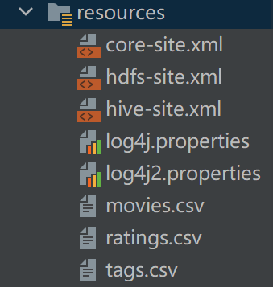

## dataloader

### 1 引入依赖

```xml
<?xml version="1.0" encoding="UTF-8"?>
<project xmlns="http://maven.apache.org/POM/4.0.0"
         xmlns:xsi="http://www.w3.org/2001/XMLSchema-instance"
         xsi:schemaLocation="http://maven.apache.org/POM/4.0.0 http://maven.apache.org/xsd/maven-4.0.0.xsd">
    <parent>
        <artifactId>recommender</artifactId>
        <groupId>org.example</groupId>
        <version>1.0-SNAPSHOT</version>
    </parent>
    <modelVersion>4.0.0</modelVersion>

    <artifactId>dataloader</artifactId>

    <properties>
        <maven.compiler.source>8</maven.compiler.source>
        <maven.compiler.target>8</maven.compiler.target>
        <mongodb-spark.version>2.4.1</mongodb-spark.version>
        <casbah.version>3.1.1</casbah.version>
    </properties>
    <dependencies>
        <!--mongodb-->
        <dependency>
            <groupId>org.mongodb.spark</groupId>
            <artifactId>mongo-spark-connector_2.12</artifactId>
            <version>${mongodb-spark.version}</version>
        </dependency>
        <dependency>
            <groupId>org.mongodb</groupId>
            <artifactId>casbah-core_2.12</artifactId>
            <version>${casbah.version}</version>
        </dependency>

        <!-- Spark 的依赖引入 -->
        <dependency>
            <groupId>org.apache.spark</groupId>
            <artifactId>spark-core_2.12</artifactId>
        </dependency>
        <dependency>
            <groupId>org.apache.spark</groupId>
            <artifactId>spark-sql_2.12</artifactId>
        </dependency>
        <!-- 引入 Scala -->
        <dependency>
            <groupId>org.scala-lang</groupId>
            <artifactId>scala-library</artifactId>
        </dependency>
        <!-- 加入 ElasticSearch 的驱动 -->
        <dependency>
            <groupId>org.elasticsearch.client</groupId>
            <artifactId>transport</artifactId>
            <version>${elasticsearch.version}</version>
        </dependency>
        <dependency>
            <groupId>org.elasticsearch</groupId>
            <artifactId>elasticsearch-spark-30_2.12</artifactId>
            <version>${elasticsearch.version}</version>
        </dependency>
    </dependencies>

</project>
```




在resources中如果添加了关于hadoop的配置信息，这在程序中默认是访问hadoop中HDFS的文件地址，所以此处要删除此三个Hadoop配置文件

### 2 样例类

```scala
package com.linrushao

/**
 * @Author LRS
 * @Date 2022/10/19 14:48
 *       Desc
 */
/**
 * MongoDB 配置对象
 * @param uri MongoDB连接地址
 * @param db  操作的MongoDB数据库
 */
case class MongoConfig(uri: String, db: String)

/**
 * Movie Class 电影类
 * @param mid       电影的ID
 * @param name      电影的名称
 * @param descri    电影的描述
 * @param timelong  电影的时长
 * @param issue     电影的发行时间
 * @param shoot     电影的拍摄时间
 * @param language  电影的语言
 * @param genres    电影的类别
 * @param actors    电影的演员
 * @param directors 电影的导演
 */
case class Movie(mid: Int,  name: String,  descri: String,  timelong: String,  issue: String,  shoot: String,  language: String,  genres: String,  actors: String,  directors: String)

/**
 * Tag Class  电影标签类
 * @param uid       用户的ID
 * @param mid       电影的ID
 * @param tag       用户为该电影打的标签
 * @param timestamp 用户为该电影打标签的时间
 */
case class Tag( uid: Int,  mid: Int,  tag: String,  timestamp: Int)

/**
 * Rating Class 电影的评分类
 * @param uid       用户的ID
 * @param mid       电影的ID
 * @param score     用户为该电影的评分
 * @param timestamp 用户为该电影评分的时间
 */
case class Rating( uid: Int,  mid: Int,  score: Double,  timestamp: Int)
/**
 *
 * @param httpHosts      http主机列表，逗号分隔
 * @param transportHosts transport主机列表
 * @param index          需要操作的索引
 * @param clustername    集群名称，默认elasticsearch
 */
case class ESConfig(httpHosts: String, transportHosts: String, index: String, clustername: String)
```

### 3 常量定义

```scala
package com.linrushao

/**
 * @Author LRS
 * @Date 2022/10/19 14:50
 *       Desc
 */
object Constant {
  /**************加载数据的路径******************/
  // [mid,name,descri,timelong,issue,shoot,language,genres,actors,directors]
  val ORIGINAL_MOVIE_DATA_PATH = "D:\\CODE\\JavaCODE\\45_MovieRecommend\\recommender\\dataloader\\src\\main\\resources\\movies.csv"
  // [userId,movieId,rating,timestamp]
  val ORIGINAL_RATING_DATA_PATH = "D:\\CODE\\JavaCODE\\45_MovieRecommend\\recommender\\dataloader\\src\\main\\resources\\ratings.csv"
  // [userId,movieId,tag,timestamp]
  val ORIGINAL_TAG_DATA_PATH = "D:\\CODE\\JavaCODE\\45_MovieRecommend\\recommender\\dataloader\\src\\main\\resources\\tags.csv"

  /**************在MongoDB中的Collection名称【表】******************/
  val MOVIES_COLLECTION_NAME = "Movie"
  val RATINGS_COLLECTION_NAME = "Rating"
  val TAGS_COLLECTION_NAME = "Tag"

  /**************在ElasticSearch中的Index名称******************/
  val ES_MOVIE_TYPE_NAME = "Movie"

}
```

### 4 数据加载

- 查看数据集，分析其成分后将数据进行切割，切割得到我们想要的数据。

例如电影数据，包括了：mid,name,descri,timelong,issue,shoot,language,genres,actors,directors字段，并且这些字段都是用^符号连接起来。

```
105575^
Look (2007)^
Interconnected stories are told entirely through images captured on security cameras^
98 minutes^
May 5, 2009^
2007^
English ^
Drama ^
Jamie McShane|Spencer Redford|Hayes MacArthur|Nichelle Hines ^
Adam Rifkin 

```

```scala
val movieDF = movieRDD.map(line => {
   val x = line.split("\\^")
   Movie(x(0).trim.toInt,       mid       电影的ID
         x(1).trim,             name      电影的名称
         x(2).trim,             descri    电影的描述
         x(3).trim,             timelong  电影的时长
         x(4).trim,             issue     电影的发行时间
         x(5).trim,             shoot     电影的拍摄时间
         x(6).trim,             language  电影的语言
         x(7).trim,             genres    电影的类别
         x(8).trim,             actors    电影的演员
         x(9).trim)             directors 电影的导演
    }).toDF()
```

切割后都转换为DataFrame数据，然后将数据进行缓存，让数据先保留在内存中，因为后续需要保存到elasticSearch和mongoDB数据库中，所以先对数据进行缓存后续可以让程序快速保存。

### 5 数据保存

- 保存数据到ElasticSreach中

```scala
 /**
   * 保存数据到ElasticSearch
   *
   * @param movies 电影数据集
   * @param esConf ElasticSearch的配置对象
   */
  def storeMoiveDataInES(movies: DataFrame)(implicit esConf: ESConfig): Unit = {
    System.setProperty("es.set.netty.runtime.available.processors", "false")

    // 需要操作的Index名称
    val indexName = esConf.index

    // 新建一个到ES的连接配置
    var settings: Settings = Settings
      .builder()
      .put("cluster.name", esConf.clustername)
      .build()

    // 创建到ES的连接客户端
    val esClient = new PreBuiltTransportClient(settings)

    //对于设定的多个Node分别通过正则表达式进行模式匹配，并添加到客户端实例
    esConf.transportHosts.split(";")
      .foreach {
        case ES_HOST_PORT_REGEX(host: String, port: String) =>
          esClient.addTransportAddress(new TransportAddress(InetAddress.getByName(host), port.toInt))
      }

    // 检查如果Index存在，那么删除Index
    if (esClient.admin()
      .indices()
      .exists(new IndicesExistsRequest(indexName))
      .actionGet()
      .isExists) {
      // 删除Index
      esClient
        .admin()
        .indices()
        .delete(new DeleteIndexRequest(indexName))
        .actionGet()
    }
    // 创建Index
    esClient
      .admin()
      .indices()
      .create(new CreateIndexRequest(indexName))
      .actionGet()

    // 声明写出时的ES配置信息
    val movieOptions = Map(
      "es.nodes" -> esConf.httpHosts,
      "es.http.timeout" -> "100m",
      "es.mapping.id" -> "mid")

    // 电影数据写出时的Type名称【表】
    val movieTypeName = s"$indexName/$ES_MOVIE_TYPE_NAME"

    // 将Movie信息保存到ES
    movies
      .write.options(movieOptions)
      .format("org.elasticsearch.spark.sql")
      .mode("overwrite")
      .save(movieTypeName)
    esClient.close()
  }
```

- 保存数据到mongoDB数据库中

```scala
  /**
   * 保存数据到MongoDB
   *
   * @param movies    电影数据集
   * @param ratings   评分数据集
   * @param tags      标签数据集
   * @param mongoConf MongoDB的配置
   */
  def storeDataInMongo(movies: DataFrame, ratings: DataFrame, tags: DataFrame)(implicit mongoConf: MongoConfig): Unit = {

    // 创建到MongoDB的连接
    val mongoClient = MongoClient(MongoClientURI(mongoConf.uri))

    // 删除Movie的Collection
    mongoClient(mongoConf.db)(MOVIES_COLLECTION_NAME).dropCollection()

    // 删除Rating的Collection
    mongoClient(mongoConf.db)(RATINGS_COLLECTION_NAME).dropCollection()

    // 删除Tag的Collection
    mongoClient(mongoConf.db)(TAGS_COLLECTION_NAME).dropCollection()

    //将Movie数据集写入到MongoDB
    movies
      .write
      .option("uri", mongoConf.uri)
      .option("collection", MOVIES_COLLECTION_NAME)
      .mode("overwrite")
      .format("com.mongodb.spark.sql")
      .save()

    //将Rating数据集写入到MongoDB
    ratings
      .write.option("uri", mongoConf.uri)
      .option("collection", RATINGS_COLLECTION_NAME)
      .mode("overwrite")
      .format("com.mongodb.spark.sql")
      .save()

    //将Tag数据集写入到MongoDB
    tags
      .write.option("uri", mongoConf.uri)
      .option("collection", TAGS_COLLECTION_NAME)
      .mode("overwrite")
      .format("com.mongodb.spark.sql")
      .save()

    //创建索引
    mongoClient(mongoConf.db)(MOVIES_COLLECTION_NAME).createIndex(MongoDBObject("mid" -> 1))
    mongoClient(mongoConf.db)(RATINGS_COLLECTION_NAME).createIndex(MongoDBObject("mid" -> 1))
    mongoClient(mongoConf.db)(RATINGS_COLLECTION_NAME).createIndex(MongoDBObject("uid" -> 1))
    mongoClient(mongoConf.db)(TAGS_COLLECTION_NAME).createIndex(MongoDBObject("mid" -> 1))
    mongoClient(mongoConf.db)(TAGS_COLLECTION_NAME).createIndex(MongoDBObject("uid" -> 1))

    //关闭MongoDB的连接
    mongoClient.close()
  }
```

### 6 整体代码

```scala
package com.linrushao
import com.linrushao.Constant.{ES_MOVIE_TYPE_NAME, MOVIES_COLLECTION_NAME, ORIGINAL_MOVIE_DATA_PATH, ORIGINAL_RATING_DATA_PATH, ORIGINAL_TAG_DATA_PATH, RATINGS_COLLECTION_NAME, TAGS_COLLECTION_NAME}
import com.mongodb.casbah.commons.MongoDBObject
import com.mongodb.casbah.{MongoClient, MongoClientURI}
import org.apache.spark.SparkConf
import org.apache.spark.sql.{DataFrame, SparkSession}
import org.elasticsearch.action.admin.indices.create.CreateIndexRequest
import org.elasticsearch.action.admin.indices.delete.DeleteIndexRequest
import org.elasticsearch.action.admin.indices.exists.indices.IndicesExistsRequest
import org.elasticsearch.common.settings.Settings
import org.elasticsearch.common.transport.TransportAddress
import org.elasticsearch.transport.client.PreBuiltTransportClient

import java.net.InetAddress

object DataLoader {

  /**************配置主机名:端口号的正则表达式******************/
  val ES_HOST_PORT_REGEX = "(.+):(\\d+)".r
  /**
   * 保存数据到MongoDB
   *
   * @param movies    电影数据集
   * @param ratings   评分数据集
   * @param tags      标签数据集
   * @param mongoConf MongoDB的配置
   */
  def storeDataInMongo(movies: DataFrame, ratings: DataFrame, tags: DataFrame)(implicit mongoConf: MongoConfig): Unit = {

    // 创建到MongoDB的连接
    val mongoClient = MongoClient(MongoClientURI(mongoConf.uri))

    // 删除Movie的Collection
    mongoClient(mongoConf.db)(MOVIES_COLLECTION_NAME).dropCollection()

    // 删除Rating的Collection
    mongoClient(mongoConf.db)(RATINGS_COLLECTION_NAME).dropCollection()

    // 删除Tag的Collection
    mongoClient(mongoConf.db)(TAGS_COLLECTION_NAME).dropCollection()

    //将Movie数据集写入到MongoDB
    movies
      .write
      .option("uri", mongoConf.uri)
      .option("collection", MOVIES_COLLECTION_NAME)
      .mode("overwrite")
      .format("com.mongodb.spark.sql")
      .save()

    //将Rating数据集写入到MongoDB
    ratings
      .write.option("uri", mongoConf.uri)
      .option("collection", RATINGS_COLLECTION_NAME)
      .mode("overwrite")
      .format("com.mongodb.spark.sql")
      .save()

    //将Tag数据集写入到MongoDB
    tags
      .write.option("uri", mongoConf.uri)
      .option("collection", TAGS_COLLECTION_NAME)
      .mode("overwrite")
      .format("com.mongodb.spark.sql")
      .save()

    //创建索引
    mongoClient(mongoConf.db)(MOVIES_COLLECTION_NAME).createIndex(MongoDBObject("mid" -> 1))
    mongoClient(mongoConf.db)(RATINGS_COLLECTION_NAME).createIndex(MongoDBObject("mid" -> 1))
    mongoClient(mongoConf.db)(RATINGS_COLLECTION_NAME).createIndex(MongoDBObject("uid" -> 1))
    mongoClient(mongoConf.db)(TAGS_COLLECTION_NAME).createIndex(MongoDBObject("mid" -> 1))
    mongoClient(mongoConf.db)(TAGS_COLLECTION_NAME).createIndex(MongoDBObject("uid" -> 1))

    //关闭MongoDB的连接
    mongoClient.close()
  }

  /**
   * 保存数据到ElasticSearch
   *
   * @param movies 电影数据集
   * @param esConf ElasticSearch的配置对象
   */
  def storeMoiveDataInES(movies: DataFrame)(implicit esConf: ESConfig): Unit = {
    System.setProperty("es.set.netty.runtime.available.processors", "false")

    // 需要操作的Index名称
    val indexName = esConf.index

    // 新建一个到ES的连接配置
    var settings: Settings = Settings
      .builder()
      .put("cluster.name", esConf.clustername)
      .build()

    // 创建到ES的连接客户端
    val esClient = new PreBuiltTransportClient(settings)

    //对于设定的多个Node分别通过正则表达式进行模式匹配，并添加到客户端实例
    esConf.transportHosts.split(";")
      .foreach {
        case ES_HOST_PORT_REGEX(host: String, port: String) =>
          esClient.addTransportAddress(new TransportAddress(InetAddress.getByName(host), port.toInt))
      }

    // 检查如果Index存在，那么删除Index
    if (esClient.admin()
      .indices()
      .exists(new IndicesExistsRequest(indexName))
      .actionGet()
      .isExists) {
      // 删除Index
      esClient
        .admin()
        .indices()
        .delete(new DeleteIndexRequest(indexName))
        .actionGet()
    }
    // 创建Index
    esClient
      .admin()
      .indices()
      .create(new CreateIndexRequest(indexName))
      .actionGet()

    // 声明写出时的ES配置信息
    val movieOptions = Map(
      "es.nodes" -> esConf.httpHosts,
      "es.http.timeout" -> "100m",
      "es.mapping.id" -> "mid")

    // 电影数据写出时的Type名称【表】
    val movieTypeName = s"$indexName/$ES_MOVIE_TYPE_NAME"

    // 将Movie信息保存到ES
    movies
      .write.options(movieOptions)
      .format("org.elasticsearch.spark.sql")
      .mode("overwrite")
      .save(movieTypeName)
    esClient.close()
  }

  def main(args: Array[String]): Unit = {

    //创建全局配置
    val params = scala.collection.mutable.Map[String, Any]()
    params += "spark.cores" -> "local[*]"
    params += "es.httpHosts" -> "hadoop201:9200"
    params += "es.transportHosts" -> "hadoop201:9300"
    params += "es.index" -> "movierecommendsystem"
    params += "es.cluster.name" -> "es-cluster"
    params += "mongo.uri" -> "mongodb://hadoop201:27017/movierecommendsystem"
    params += "mongo.db" -> "movierecommendsystem"

    // 声明Spark的配置信息
    val conf = new SparkConf().setAppName("DataLoader").setMaster(params("spark.cores").asInstanceOf[String])

    /**
     * 创建一个sparkSession
     */
    val spark = SparkSession.builder().config(conf).getOrCreate()
    // 定义ElasticSearch的配置对象
    implicit val esConf = new ESConfig(params("es.httpHosts")
      .asInstanceOf[String], params("es.transportHosts")
      .asInstanceOf[String], params("es.index")
      .asInstanceOf[String], params("es.cluster.name")
      .asInstanceOf[String])

    // 引入SparkSession内部的隐式转换
    import spark.implicits._

    // 定义MongoDB的配置对象
    implicit val mongoConf = new MongoConfig(params("mongo.uri").asInstanceOf[String], params("mongo.db").asInstanceOf[String])

    // 加载Movie数据集
    val movieRDD = spark.sparkContext.textFile(ORIGINAL_MOVIE_DATA_PATH)

    // 加载Rating数据集
    val ratingRDD = spark.sparkContext.textFile(ORIGINAL_RATING_DATA_PATH)

    // 加载Tag数据集
    val tagRDD = spark.sparkContext.textFile(ORIGINAL_TAG_DATA_PATH)

    // 将movie电影RDD转换为DataFrame
    val movieDF = movieRDD.map(line => {
      val x = line.split("\\^")
      Movie(x(0).trim.toInt, x(1).trim, x(2).trim, x(3).trim, x(4).trim, x(5).trim, x(6).trim, x(7).trim, x(8).trim, x(9).trim)
    }).toDF()

    // 将rating评分RDD转换为DataFrame
    val ratingDF = ratingRDD.map(line => {
      val x = line.split(",")
      Rating(x(0).toInt, x(1).toInt, x(2).toDouble, x(3).toInt)
    }).toDF()

    // 将tag标签RDD转换为DataFrame
    val tagDF = tagRDD.map(line => {
      val x = line.split("\\^")
      Tag(x(0).toInt, x(1).toInt, x(2).toString, x(3).toInt)
    }).toDF()

    //缓存,可以让程序能快速运行
    movieDF.cache()
    tagDF.cache()

    // 数据预处理
    import org.apache.spark.sql.functions._
    /**
     * mid, tags
     * tags: tag1|tag2|tag3...
     */
    val tagCollectDF = tagDF.groupBy($"mid")
      .agg(concat_ws("|", collect_set($"tag")).as("tags"))
      .select("mid", "tags")
    //将tags合并到movie数据集中产生新的movie数据集
    val esMovieDF = movieDF.join(tagCollectDF,Seq("mid","mid"),"left").select("mid","name","descri","timelong","issue","shoot","language","genres","actors","directors","tags")

    // 将数据保存到MongoDB
    storeDataInMongo(movieDF, ratingDF, tagDF)

    // 保存数据到ES
    storeMoiveDataInES(esMovieDF)

    //去除缓存
    tagDF.unpersist()
    movieDF.unpersist()

    //关闭Spark
    spark.close()
  }
}
```

